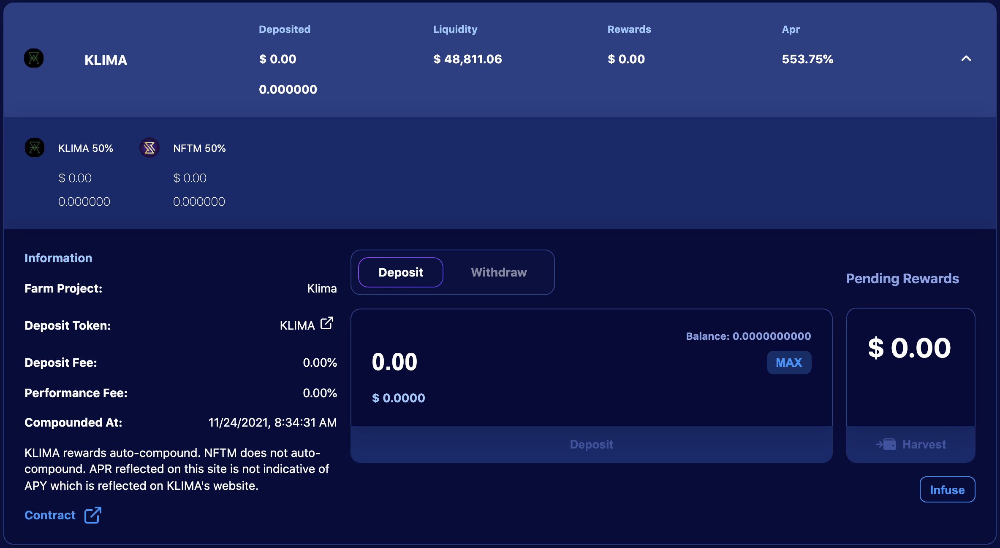

# Forks da OHM na rede Polygon: o caso da KLIMA

Se você tem seguido as notícias do mundo cripto nos últimos meses, você certamente notou muitas referencias a (3,3), e ouviu sobre projetos relacionados à OlympusDAO. Eu tentarei apresentar rapidamente o que esses projetos são, quais são as regras e princípios essenciais deles, e como você pode integrá-los às suas estratégias de investimento. Para essa última parte, nós focaremos na Klima DAO, um dos forks mais bem sucedidos na rede Polygon, que também possui uma história e objetivo interessantes.

## O que são forks da OHM

### O que é OHM e o que é um fork?

Tudo começou na rede Ethereum Mainnet com a Olympus DAO. O seu objetivo era criar uma nova moeda de reserva para competir com o dolar, exceto que diferente das outras stablecoins, esta nova moeda teria um valor flutuante. O token nativo (OHM) precisa ser respaldado por uma cesta de diferentes ativos, entretanto o tokenomics (economia de token) do projeto faz o valor da OHM ser definido pelo mercado.

A Olympus DAO foi lançada em Março de 2021 e ainda é um projeto muito bem sucedido na Mainnet. O TVL é representado em duzias de milhōes de dólares, e o preço de OHM tem se mantido bem alto. Por conta deste sucesso, o projeto foi copiado, e varios forks (ou seja, cópias) da Olympus DAO apareceram em varias blockchains.

### Visão geral do tokenomics

Esta seção será um pouco mais técnica do que nós geralmente apresentamos em nossos outros guias, mas para entender o sucesso da Olympus e outros forks da OHM, é importante entender como eles funcionam.

A ideia principal da Olympus é aumentar o seu tesouro o máximo possivel através da venda do seu token nativo com um desconto (bond), e manter o fornecimento em circulação o mais baixo possível para manter um preço alto. Isso é alcançado oferecendo recompensas bem altas aos stakers, e tendo praticamente controle total da liquidez.

* **Bonding:** o protocolo irá oferecer tokens nativos com desconto. O preço é pago utilizando diferentes ativos que são usados para respaldar o token nativo. No exemplo da Olympus DAO, o token OHM é 100% respaldado por alguns tokens que incluém principalmente DAI, então bonds podem ser comprados utilizando DAI diretamente, ou usando tokens LP DAI-OHM (e posterioremente tokens adicionais incluindo FRAX). Quando pessoas compram os tokens nativos usando os ativos do tesouro ou tokens LP, o pagamento vai diretamente ao tesouro, permitindo ao protocolo cunhar mais tokens, e portanto sobreviver por mais tempo. A unica coisa é que o token com desconto é liberado por um período de vesting, o que significa que o usuário que comprou o token através do bonding não será capaz de usá-lo imediatamente.&#x20;
* **Staking:** após o bonding, usuários irão coletar os tokens nativos e terão a escolha entre vendê-los ou fazer staking com eles. Para ter certeza que a segunda opção será a preferida, o protocolo oference recompensas que chegam a ser insanas aos stakers (estamos falando de 1.2% diariamente). O objetivo por trás destes APRs altíssimos é conseguir uma proporção de staking próxima a 100%. Se não há muitos tokens em circulação, o preço é jogado para cima, e aliado a altas recompensas, torna-se mais interessante ainda o staking. Como observação, um preço que se valoriza também ajudará a manter altas taxas de recompensas.
* **Aumentar o tesouro e controlar a liquidez:** O tesouro é expandido através do bonding, e do fato de que os tokens nativos podem passar pelo bonding com tokens LP que são praticamente controlados pelo protocolo. Estes tokens LP são usados para coletar taxas das transaçōes para os usuários que preferem comprar o token nativo a mercado em seu preço total, ao invés de obter o desconto oferecido pelos bonds (veja o próximo capítulo para detalhes).
* **Comprar de volta e queimar:** A maioria dos forks da OHM incluem um mecanismo que irá comprar de volta os tokens nativos e queimá-los em situaçōes específicas. Problemas ocorrem quando usuários estão vendendo o token nativo, que joga o preço para baixo. Porém, se pessoas venderem seus tokens, o APY aumenta já que o número de tokens cunhados permanece o mesmo para menos tokens em staking. Mas mesmo com um APY mais alto, se ninguém compra e faz staking dos tokens vendidos, o protocolo pode comprá-los de volta de volta do mercado para criar pressão compradora, levantar os preços, e manter a circulação do token baixa. Tokens que são comprados de volta são simplesmente destruídos. De fato, como parte do tesouro foi usado para adquirir estes tokens, mantê-los no tesouro ou distribuí-los iria, na verdade, acabar diluindo o tesouro, o que por si só iria reduzir a taxas de recompensas, ou afetar o período de tempo em que o protocolo poderia funcionar.

Você pode encontrar mais conteúdo sobre o conceito da Olympus DAO e seu tokenomics aqui:

* [DeFi 2.0 - A new Narrative? Olympus DAO, Tokemak Explained](https://www.youtube.com/watch?v=l0vRTi8\_FRk)
* [WTF is Olympus DAO](https://newsletter.banklesshq.com/p/wtf-is-olympus-dao)

### Bonding VS Staking

Porque alguém pagaria por um token se há uma versão mais barata dele por meio de um bond? Isso é uma pergunta legítima, e a resposta irá depender do desconto oferecido pelo bond.

Como nós iremos trabalhar com a KlimaDAO, vamos comparar o ato de comprar e fazer staking com o bonding:

Se alguém compra Klima diretamente do mercado e faz staking por 5 dias (a duração do periodo de vesting do bond), o ROI (**R**eturn **O**n **I**nvestment, Retorno Sobre Investimento) será de 8.51%. Se alguém preferir o bond, o ROI máximo seria de 5.47% ao prover BCT/KLIMA.

Isso significa que, com uma quantia de $100, você teria após 5 dias:

* $108.51 com a primeira opção
* $105.47 com a segunda opção

Entretanto, é importante entender que a Klima que passa por bonding é liberada ao longo do período de vesting. Portanto, você pode colher a Klima do vesting e fazer staking com ela para lucrar com as rebases (distribuição de recompensas). Como você apenas receberá recompensas pelo staking que fez durante o período de vesting, e como há 15 rebases durante os 5 dias para o bond ser totalmente liberado, nós podemos assumir que você pode colher 6.67% antes de cada um dos 15 rebases. Assumindo que você colherá e fará staking no inicio de cada rebase, você terá:

| Número do rebase | Quantidade em Staking | Recompensas | Recompensas Totais |
| ---------------- | --------------------- | ----------- | ------------------ |
| 1                | 7.031                 | 0.038       | 0.038              |
| 2                | 14.063                | 0.077       | 0.116              |
| 3                | 21.094                | 0.116       | 0.232              |
| 4                | 28.125                | 0.155       | 0.397              |
| 5                | 35.157                | 0.193       | 0.580              |
| 6                | 42.188                | 0.232       | 0.812              |
| 7                | 49.219                | 0.271       | 1.083              |
| 8                | 56.251                | 0.309       | 1.392              |
| 9                | 63.282                | 0.348       | 1.740              |
| 10               | 70.313                | 0.387       | 2.127              |
| 11               | 77.345                | 0.425       | 2.552              |
| 12               | 84.376                | 0.464       | 3.016              |
| 13               | 91.407                | 0.503       | 3.519              |
| 14               | 98.439                | 0.514       | 4.061              |
| 15               | 105.470               | 0.580       | 4.651              |

No fim do periodo de vesting, o ROI de 5.47% foi respeitado, mas as recompensas em staking adicionaram 4.65% de lucro (que não foi reacumulado para ficar simples), resultando em um ROI total de 10.12%. Isso significa que o bonding é mais interessante do que fazer staking diretamente, mesmo que o ROI de bonding seja inferior ao de staking.

A recompensa total que você obterá pelo staking em um numero N de vezes durante o período de vesting (com o Nmax = 15 no máximo) é:

$$Recompensa_{total} = \sum_{i=1}^{N}{\frac{Investimento * i * (1 + APR_{Vesting})}{N} * APR_{staking}}$$

Você pode então rodar suas próprias simulaçōes para verificar se é melhor comprar e fazer staking, ou bonding. No nosso exemplo, com um ROI de 8.51% em 5 dias, um desconto de bonding a 3.95% com 15 rebases seria melhor (dando um ROI equivalente de 8.52%).


Você pode rodar a mesma simulação colhendo e fazendo staking diariamente, ao invés de três vezes por dia antes de cada rebase. Para o mesmo APY acima, você precisaria de um desconto de 6.76% para obter um rendimento superior ao do staking.



Você pode encontrar uma calculadora para bonding x staking nesta [planillha google](https://docs.google.com/spreadsheets/d/1MTKTbf-ZAihGbEax3WEwkxToG7IlPKlwmYq59O3KG2o/edit#gid=0), que pode ser copiada e editada, se preferir. Obs: esta planilha não é fornecida ou admnistrada pela comunidade QiDAO.


### O caso especial da KlimaDAO

A particularidade que faz a KlimaDAO ser diferente dos outros forks da Olympus é o ativo principal de sua reserva respaldando o token Klima: o token BCT, fornecido pelo [Toucan Protocol](https://toucan.earth). O token BCT (**B**ase **C**arbon **T**onne) representa, na verdade, investimentos no mundo real que descarbonizam a Terra, transformando offsets de carbono do mundo real em tokens. Você pode ler muito mais sobre como isso funciona na [documentação oficial](https://docs.toucan.earth/protocol/introduction/defi-refi) da Toucan.

BCT é então usado pelo [app da KlimaDAO](https://dapp.klimadao.finance) para cunhar tokens KLIMA, da mesma maneira que DAI é usado pela OlympusDAO para cunhar OHM. Em outras palavras, Klima funciona como um sequestro de carbono, provendo fundos da vida real para lutar contra o aquecimento global. Mais informaçōes podem ser encontradas no [website da Klima](https://www.klimadao.finance) e na [documentção](https://klima-dao.gitbook.io/klima-dao/), assim como você pode discutir sobre maneiras de tornar as criptomoedas mais "verdes" participando do servidor do Discord da QiDAO. &#x20;


Uma das principais diferenças entre a Olympus e a Klima é que BCT não possui um preço estável. Isso resulta em um risco maior do que o que é visto na maioria dos forks que utilizam stablecoins em seu tesouro, entretanto é assumido que problemas ambientais serão mais importantes ao longo do tempo, e haverá mais projetos tentando extrair carbono da atomosfera, o que resultaria em um aumento no valor do BCT.


## Estratégia 1: Alavancagem em sKLIMA leverage, ou (9,9)

Sem aprofundar demais em [(3,3) na Teoria dos Jogos](https://en.wikipedia.org/wiki/Nash\_equilibrium), (9,9) representa uma situação onde alguém alavanca a sua posição de staking. Isso é, de fato, possível porque a KlimaDAO nos entrega um token sKLIMA como prova de nosso depósito, o que algumas plataformas aceitam como garantia para possíveis empréstimos. Vejamos em detalhes:

### Loop de alavancagem com MarketXYZ e Klima

A ideia é obter uma quantia inicial de tokens KLIMA que você pode depositar na KlimaDAO. Isso ta garantirá um imenso APY (no momento, de 38,873.08%, ou um APR de 601%, ou 1.68% diariamente) e tokens sKLIMA como prova de seu depósito.

Esse token sKLIMA pode ser usado na Market XYZ no [Baú de Alavancagem Verde](https://polygon.market.xyz/pool/5) que irá te permitir um empréstimo com este depósito como garantia.


Como observação, a Mai Finance fez uma parceria com a Market XYZ e semeou o Green Locker Pool (Baú de Alavancagem Verde) com 1M de MAI para garantir taxas de empréstimo baixas ao tomar emprestado MAI, tendo sua sKLIMA de garantia.


Não é obrigatório que voce tome emprestado MAI, você pode, na verdade, tomar emprestado o token que você quiser, com a menor taixa de juros, mas você precisa entender que você pagará taxas sobre seu empréstimo, e quanto mais rápido você pagá-lo, menores serão as taxas.

Com o seu empréstimo, você poderá comprar mais tokens KLIMA e repetir o loop.

Você irá notar que o APY em sKLIMA irá cobrir grandemente os juros de seu empréstimo.


Não há uma quantidade mínima para tomar emprestado na Market.xyz, por favor, respeite o seu limite ao aplicar esta estratégia.


### Resultados esperados

Market XYZ também apresentará níveis de liquidação, o que significa que se o valor da garantia cair abaixo do nível de liquidação, há o risco de você ser liquidado. Para diminuir o risco de liquidação, a simulação a seguir assume que você manterá uma proporção C/D (Garantia/Dívida)  de 250%, e que você investirá inicialmente $1,000 de tokens KLIMA ao APY de 38,873% APY para tomar MAI emprestado a juros de 20.49%.

| sKLIMA ($) | Empréstimo de MAI ($) | APY eq. (%) | Juros ($) |
| ---------- | --------------------- | ----------- | --------- |
| 1,000.00   | 400.00                | 38,873      | 81.96     |
| 1,500.00   | 560.00                | 54,455      | 114.74    |
| 1,560.00   | 624.00                | 60,642      | 127.86    |
| 1,624.00   | 649.60                | 63,129      | 133.10    |
| 1,649.60   | 659.84                | 64,125      | 135.20    |
| 1,659.84   | 663.94                | 64,523      | 136.04    |
| 1,663.94   | 665.57                | 64,682      | 136.38    |

Obviamente, é plenamente possível pararmos após 3 loops, já que o APY equivalente nã irá crescer muito após este ponto..

Além disso, como o investimento inicial é de $1,000, o valor que você receberá após 1 ano será de $646,820.00, assumindo que tudo permaneça constante. Em outras palavras, você investe $1,000, você precisará reembolsar $665.57 mais $136.38 (uma dívida acumulada de $801.95) mas você também receberá $646,820.

Você também pode notar que o valor da sua posição em sKlima cresce rapidamente (cerca de 8% a cada 5 dias), o que significa que você também pode aumentar a sua dívida neste ponto, e alavancar ainda mais para obter ainda mais lucros.

### Capturando o lucro e reembolsando o empréstimo

Um dos maiores problemas com forks da Olympus é que assume-se que todos fazem stake, e ninguém vende. Mas se ninguém vende, ninguém lucra, e na maioria dos casos, o primeiro a vender fica o bolo.

Para qualquer estratégia de investimento, é importante capturar o lucro. Você pode fazer isso, retirando uma parte da sua posição em sKLIMA na Market XYZ e tomando de volta KLIMA, que você pode vender.

Se você investir $100 e trabalhar com os 7 loops de cima, seu investimento em KLIMA gerará $67.11 após 31 dias, o que significa que você pode reembolsar seu empréstimo em um único mês. Se você assim fizer, você começará novamente com com 166$ no próximo mês e sem dívidas excpecionais. Somente fique atento ao APR de empréstimo, que pode se tornar bem alto na Market XYZ.

## Estratégia 2: Investimento continuo, ou (4,4)

Mais uma vez, (4,4) está relacionado a Teoria dos Jogos e moedas de reserva, e no caso, indica pessoas que emprestam seus tokens e fazem stake com eles. Nesta estratégia, nós veremos como usar a Klima e Augury para comprar Bonds regularmente, e fazer stake neles.

### Loop de investimento com Augury e Mai Finance

Nós ainda estamos utilizando Klima, mas desta vez nós usaremos uma [infusão da Augury Finance](https://augury.finance/infusions) para automatizar a extração do valor de Klima. Ao depositar seus tokens KLIMA na infusão, o algoritmo encarregado da infusão irá realizar as seguintes açōes após cada rebase:

* 50% da KLIMA colhida passa por staking novamente para aumentar sua posição em sKLIMA
* 50% da KLIMA colhida é vendida por USDC, adicionada a pool NFTM na Augury, e distribuida para você como tokens NFTM.

NFTM pode então ser mantida, enquanto aumenta em valor, ou resgatada em seu valor USDC. Em outras palavras, não importa se o token KLIMA perde valor após um rebase, já que o valor é capturado e armazenado em NFTM.

Após resgatar o valor em USDC de seus recompensas NFTM, você pode então comprar o token que preferir e guardar em um vault na Mai Finance. O exemplo acima usa o vault camWETH, mas você pode usar o vault que preferir. A ideia é pode usar os vaults na Mai Finance para tomar MAi emprestado e comprar novos Bonds na KimaDAO para repetir o loop. Então você pode colher os tokens KLIMA e injetá-los na Augury. Tenha em mente que Bonds passam por vesting, aos poucos, então é completamente possível colher regularmente e fazer staking na Augury antes do Bond estar totalmente pronto.

### Resultados esperados

Assumindo que você tenha investido $100 como no exemplo anterior, e os colocado diretamente na infusão da Augury, que o APR da infusão de Klima é de 552.94% (valor no momento atual), e que você quer manter uma proporção C/D no vault camWETH de 240% e um APY de 2.19% no vault camWETH, aqui estão os resultados após 1 ano:

| Dia | sKLIMA ($) | wETH ($)  | Empréstimo na MAI ($) |
| --- | ---------- | --------- | --------------------- |
| 30  | 137.751    | 27.708    | 11.545                |
| 60  | 189.776    | 64.883    | 27.035                |
| 90  | 261.474    | 116.150   | 48.396                |
| 120 | 360.282    | 186.835   | 77.848                |
| 150 | 496.453    | 284.283   | 118.451               |
| 180 | 684.115    | 418.613   | 174.422               |
| 210 | 942.737    | 603.771   | 251.571               |
| 240 | 1,299.152  | 858.978   | 357.907               |
| 270 | 1,790.339  | 1,210.720 | 504.466               |
| 300 | 2,467.258  | 1,695.500 | 706.458               |
| 330 | 3,400.140  | 2,363.625 | 984.844               |
| 360 | 4,685.775  | 3,284.424 | 1,368.510             |

Once again, assuming that all rates and prices stay the same, at the end of the year you would have

* $4,684.775 worth of KLIMA tokens
* $3,284.424 worth of wETH
* and outstanding debt of $1,368.510

Which is an equivalent APY of 6,866.46%. This is far from the 38,705.13% advertised by KLIMA, but still pretty impressive for a $100 investment. Also, a good load of your gains have been converted into wETH in a vault on Mai Finance, and your loan on the application will get you some additional Qi Tokens.


If this strategy has a much lower APY than pure (9,9), it's also a relatively affordable one since you can enter the loop with as much as KLIMA you want.


## Disclaimer

Everything presented in this document is pure theory and is proposed for educational purposes. The biggest issue with projects like Olympus and Klima is that, once again, the first user to sell will profit from the high price. If the first sell is massive (because gains are massive), it can snowball quickly into a panic effect that can very well kill the price of the KlIMA token. However, in this case, the APY would skyrocket, meaning that users who don't sell will benefit from very high rewards, so that when the APY attracts new users, the ones who held will be big winners.

It's also good to note that the project can only continue to print tokens as long as additional funds are injected into the treasury.

So the risk can be very high if you don't extract some benefits from time to time in order to lower the risks.

As a final note, pay attention that ohm-forks are the new trend, but most projects may fail, and a lot of these forks are not solid projects. Because of their nature, they are not verified by RugDoc yet, and it may be very complicated to identify real applications from pure scam.


Keep in mind that a strategy that works well at a given time may perform poorly (or make you lose money) at another time. Please stay informed, monitor the markets, keep an eye on your investments, and as always, do your own research.

