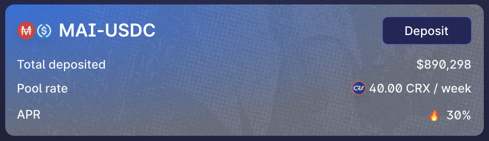
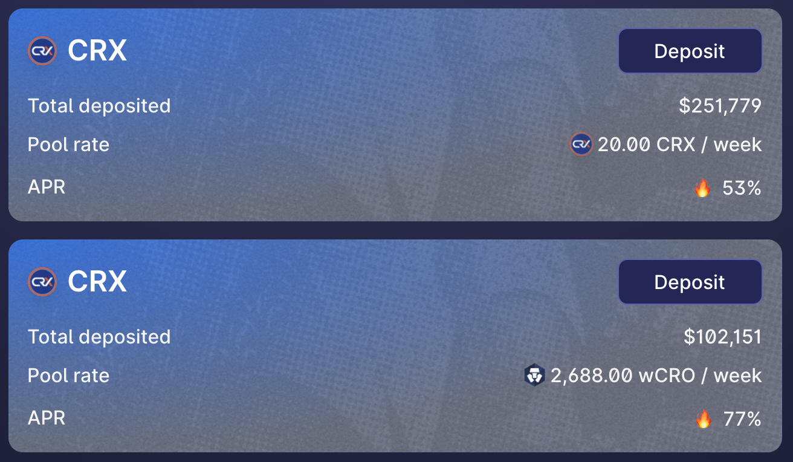
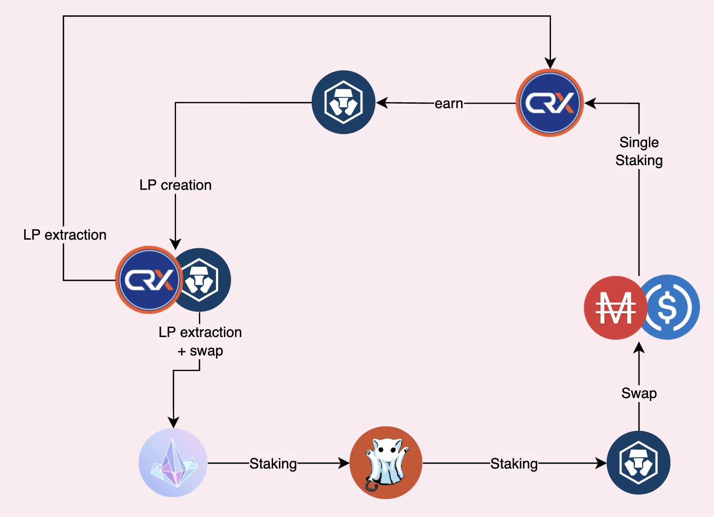

# Farming como LEGO na CroDex

Farming de rendimentos pode ser fácil. Você tem 2 tokens, você os combina em um par LP (**L**iquidity **P**roviding, ou Provedor de Liquidez), você deposita o token LP em uma pool e você começa a receber taxas de operaçōes e na maior parte do tempo, recompensa são pagas no token nativo da farm que você está usando. A maioria das pessoas irá simplesmente vender as recompensas por qualquer outro ativo que eles preferirem, o que é na maioria dos casos, totalmente válido, mas muito distante de uma solução otimizada. Hoje, nós veremos como você pode lucrar de um altissimo APR (**A**nnual **P**ercentage **R**ate) proposto na Cronos em varios DApps, o que irá transformar um APR de 30% em stablecoins em uma taxa muito mais alta.

## CroDex

### Farming com MAI

Mesmo que o aplicativo de empréstimo da Mai Finance ainda não esteja implantado na Cronos, já é possível fazer a ponte de MAI a outras redes. Uma das razões para fazer isso é porque não há muito MAI na Cronos, o que significa que qualquer aplicativo que proponha farming de MAI também fornecerá APRs elevados. É o caso da CroDex, atualmente o único local com liquidez de MAI na Cronos. Para este guia, usaremos a pool MAI-USDC na CroDex para reduzir o risco de perda impermanente em seu investimento inicial, mas você pode aumentar seus ganhos cultivando MAI-CRO.


Sempre que você seleciona um aplicativo para rendimentos em farming, é importante observar se a recompensa é exibida como APR (**A**nnual **P**ercentage **R**ate, Taxa Percentual Anual) ou APY (**A**nnual **P**ercentage **Y**ield, Rendimento Percentual Anual). Este último pressupõe que todas as recompensas que você recebe são reacumuladas diariamente por um ano completo. Em nosso exemplo, 30% de APR no par MAI-USDC corresponde a 34,97% de APY.\
Se você comparar com a pool MAI-USDC na Mai Finance, o APR dado é de 20,18% na Polygon, 22,10% na Fantom, e a pool MAI-av3CRV na Avalanche propõe 23,24% de APR. A CroDex propõe a melhor taxa sobre a stablecoin MAI em todas as redes!


A CroDex vai pagar você com seu token nativo, o CRX. Em dezembro de 2021, 1 CRX = 127,56 USDC

### Staking com apenas CRX

É aqui que fica interessante. A CroDex tem 2 pools diferentes onde você poderá fazer staking com seus tokens CRX para obter recompensas adicionais. Você pode fazer staking para obter mais CRX, mas usaremos a pool onde o staking de CRX o recompensará com tokens wCRO. wCRO é a versão embalada do CRO, o token de gas da rede Cronos.

Você já pode ver que poderia muito bem vender seu CRX por mais tokens MAI-USDC LP e obter quase 35% de APY no par estável, mas é claramente melhor fazer staking com seu CRX para obter CRO. Ele pode ser usado tanto para pagar taxas de transação, quanto para farming de MAI-CRO na CroDex. E quanto mais CRX você ganha com o tempo, mais CRO você receberá com staking de CRX. Mas neste guia, vamos explorar um pouco mais da Cronos!

## CRYSTL Finance

A CRYSTL Finance costumava ser conhecida como Polycrystal na Polygon. É um fork da Goose que propõe vaults de pares LP e pools com apenas um token, e funciona exatamente como a Beefy Finance. Estaremos usando ambos para nossa estratégia.

### Farming de CRYSTL com CRX-WCRO

Estaremos usando os tokens CRO produzidos pelo staking de CRX para trocar 50% da recompensa em mais CRX e combinar esses dois tokens em um par CRX-WCRO na CroDex e, em seguida, depositar o token LP em um vault na Crystl Finance. Isso lhe dará um alto APY que será reacumulado.

As taxas apresentadas estão em APY. Um APY de 1,21k% corresponde a um APR de 258,17%, mas você também pode obter os ganhos diários estimados diretamente nas informações do vault, e seu farming de CRX-WCRO obterá atualmente 0,71% de ganhos diários. É muito importante que você acompanhe a recompensa diária, porque iremos extrair essa parte de nossa posição LP e dividi-la em tokens separados. O CRX será re-staked em CroDex para obter mais tokens CRO, e o CRO será trocado por CRYSTL. Observe também que há uma taxa de retirada para os ganhos que extrairemos a cada dia.

### Staking com apenas CRYSTL

Com o token CRYSTL obtido na etapa anterior, você poderá obter USDC da pool de staking único da CRYSTL Finance. Simplesmente, faça staking com seu token CRYSTL e você será pago em USDC com um APR bem alto.

Então você pode simplesmente trocar 50% do USDC colhido por MAI e adicionar de volta à sua posição original na CroDex.\
\
Como alternativa, podemos usar a mesma abordagem acima e fazer staking com tokens CRYSTL para ganhar tokens SALEM, que é o token nativo do Salem Finance.

## Salem Finance

Salem Finance é outro fork da Goose onde você poderá cultivar o token SALEM. A maioria das pools LP tem uma taxa de depósito, mas na verdade não usaremos as farms LP, uma vez que a CRYSTL Finance já está nos dando os tokens SALEM de que precisamos. Em vez disso, apostaremos SALEMs nas pools para ganhar WCRO adicionais com, mais uma vez, um APR muito alto.

O token (w)CRO, por ser o token de gas de Cronos, tem muita utilidade. Você também pode conectá-lo à rede principal da Crypto.org, se desejar. No nosso caso, e porque queremos fechar nosso loop de investimento, podemos simplesmente vender os ganhos da Salem Finance e comprar mais USDC e MAI.

## Estratégia de Farming

Você já pode ver que com apenas 3 protocolos, você tem várias opções:

* Farming de MAI-USDC para obter CRX, staking de CRX para obter WCRO, vendendo WCRO para mais MAI-USDC
* Farming de MAI-USDC para obter CRX, staking de CRX para obter WCRO, farming de CRX-WCRO para obter CRYSTL, staking de CRYSTL para obter USDC, trocando USDC para mais MAI-USDC
* Farming de MAI-USDC para obter CRX, staking de CRX para obter WCRO, farming de CRX-WCRO para obter CRYSTL, staking de CRYSTL para obter SALEM, staking de SALEM para obter WCRO, vendendo WCRO para mais MAI-USDC

No restante deste guia, vamos nos concentrar na última estratégia, que é a mais complexa e requer muitas manipulações, mas também é a que oferece o melhor resultado geral. Sinta-se à vontade para aplicar o que você preferir, dependendo da sua aceitação de risco.

### Bootstrapping

O que se segue é uma simulação feita com um investimento inicial de $1.000 em tokens LP MAI-USDC, e os APRs/APYs atuais apresentados neste documento em dezembro de 2021. Claro, as taxas e os preços mudarão ao longo do tempo, então esta simulação é válida apenas no momento da escrita, e a simulação fornecerá apenas uma estimativa do que você poderia obter se configurasse este sistema.

### 1º Dia

Você deposita seu MAI-USDC na pool apropriada da CroDex e ganha 30% de APR sobre ele. No final do primeiro dia, depois de coletar suas recompensas CRX, você teria

| MAI-USDC | CRX em Staking | CRX-WCRO | CRYSTL | SALEM | WCRO  |
| -------- | -------------- | -------- | ------ | ----- | ----- |
| 1,000.00 | 0.822          | 0.000    | 0.000  | 0.000 | 0.000 |

### 2º Dia

Seu CRX em staking está gerando WCRO. Você pode colher a recompensa e trocar 50% por mais CRX para criar um par LP CRX-WCRO que você pode depositar na CRYSTL Finance. No final do segundo dia você teria

| MAI-USDC | CRX em Staking | CRX-WCRO | CRYSTL | SALEM | WCRO  |
| -------- | -------------- | -------- | ------ | ----- | ----- |
| 1,000.00 | 1.644          | 0.002    | 0.000  | 0.000 | 0.000 |

### Day 3

The CRX-WCRO pair locked in the CRYSTL Finance vault generated additional LP token. You will have to extract the daily gain and pay a 0.1% fee, and break the extracted LP portion into CRX and WCRO tokens. You can simply restake the CRX on CroDex, and swap the WCRO into CRYSTL. This can be done on [CroDex using the swap feature](https://swap.crodex.app/#/swap?outputCurrency=0xCbDE0E17d14F49e10a10302a32d17AE88a7Ecb8B). At the end of the day, you would have

| MAI-USDC | staked CRX | CRX-WCRO | CRYSTL  | SALEM | WCRO  |
| -------- | ---------- | -------- | ------- | ----- | ----- |
| 1,000.00 | 2.466      | 0.005    | 0.00003 | 0.000 | 0.000 |


Note that the rewards on CRYSTL are very small and it may not be interesting to harvest the reward from day 1. This simulation is still displaying the rewards you should get and will assume you still compound daily, but this is done to simplify the results. Make sure you don't spend all your reward into transaction fees, and it may be more interesting to compound only weeekly of the first few weeks.


### Day 4

Your CRYSTL reward from Crystl Finance can be staked in order to earn SALEM tokens. At the end of the 4th day you'd get

| MAI-USDC | staked CRX | CRX-WCRO | CRYSTL  | SALEM     | WCRO  |
| -------- | ---------- | -------- | ------- | --------- | ----- |
| 1,000.00 | 3.288      | 0.010    | 0.00011 | 0.0000002 | 0.000 |

### Day 5

Final bootstrapping day when you will harvest the rewards from Salem Finance. The WCRO reward can be swapped for more MAI-USDC. However, as you can notice, the value of the reward is so small that you won't be able to harvest the WCRO from Salem Finance before Day 50 or so.

## Farming results

### Daily routine

Once the system is fully prepared, here's your daily routine

* harvest CRX from the MAI-USDC pool
* harvest the WCRO reward from the single staking pool on CroDex
* swap 50% of the WCRO reward for more CRX on CroDex, and create some CRX-WCRO LP token
* deposit your additional CRX-WCRO token on CRYSTAL Finance
* withdraw a portion of CRX-WCRO corresponding to your daily reward
* break the LP token into CRX and WCRO on CroDex
* stake the CRX into the single staking pool on CroDex that gets WCRO rewards
* swap the WCRO for CRYSTL on CroDex
* stake the CRYSTL token on Crytl Finance to get SALEM tokens
* harvest the SALEM token
* single stake the SALEM token on Salem Finance
* harvest the WCRO token from Salem Finance
* swap the WCRO for MAI and USDC and create more LP pair
* deposit the new MAI-USDC pair in the appropriate pool on CroDex

### Raw results month after month

| day | MAI-USDC | staked CRX | CRX-WCRO | CRYSTL | SALEM  |
| --- | -------- | ---------- | -------- | ------ | ------ |
| 30  | 1,000.00 | 25.583     | 0.600    | 0.104  | 0.004  |
| 60  | 1,000.00 | 50.819     | 1.830    | 0.682  | 0.059  |
| 90  | 1,000.04 | 76.736     | 3.315    | 1.941  | 0.260  |
| 120 | 1,000.14 | 103.424    | 4.922    | 3.970  | 0.729  |
| 150 | 1,000.41 | 130.935    | 6.606    | 6.816  | 1.594  |
| 180 | 1,001.93 | 159.307    | 8.352    | 10.515 | 2.994  |
| 210 | 1,001.87 | 188.578    | 10.156   | 15.094 | 5.070  |
| 240 | 1,003.39 | 218.789    | 12.019   | 20.584 | 7.969  |
| 270 | 1,005.71 | 249.988    | 13.942   | 27.014 | 11.843 |
| 300 | 1,009.10 | 282.227    | 15.929   | 34.414 | 16.848 |
| 330 | 1,013.82 | 315.569    | 17.982   | 42.817 | 23.147 |
| 360 | 1,020.23 | 350.084    | 20.105   | 52.256 | 30.906 |

### Day 365

After a complete year of farming this system, you would have

* $1,021.49 worth of MAI-USDC on CroDex
* $355.96 worth of CRX single staked on CroDex
* $20.47 worth of CRX-WCRO deposited on CRYSTL Finance
* $53.93 worth of CRYSTL single staked on CRYSTL Finance
* $32.353 worth of SALEM single staked on Salem Finance

The WCRO from Salem Finance is actually included as the additional MAI-USDC position since it's fully sold to increase this pair.

This means that with an initial investment of $1,000, at the end of the year you would have $1,484.45 across all apps, for a total APY of 48.45%. And remember that this is done by farming only a stable pair as the root of the strategy. It's also good to note that the only token that is swapped over time is the CRO token.

### Alternative using Mai Finance

The Mai Finance application doesn't support vaults on Cronos, because tokens on Cronos don't have Chainlink Oracles yet. It's expected that during the first quarter of 2022, Chainlink will add oracles on Cronos, and you will be able to deposit your WCRO tokens in a Vault to borrow the MAI stable coin. This means that the strategy above can be modified to deposit WCRO and use MAI instead of selling the WCRO tokens, which will slightly increase your final reward rate.

## Disclaimer

This guide was written to showcase that you can increase your reward rate withouth dumping the tokens that you farm. It's not simple to find the right fits when you're building feedback loops, but it's definitely feasable, and you will most of the time rewarded if you can find the right combo. However, this guide was written only to demonstrate how you can do that, and not to build a similar system. All transaction fees were purposedly discarded, and some rewards will not last for a complete year, meaning that you may want to consider more simple loops for your personal investments. However, CroDex is a very good starting point for that type of system.


This guide is definitely not financial advice, it was made with an educational goal in mind. You need to pay attention to price variations, supply and demand, reward programs end dates, impermanent losses etc ... The goal wasn't to propose recipes that can be followed blindly, so please do your homework and your own simulation, and only invest what you're ready to possibly lose.

