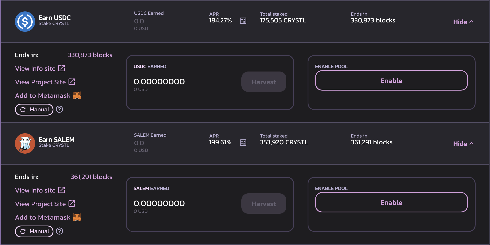

# Farming como LEGO na CroDex

Farming de rendimentos pode ser fácil. Você tem 2 tokens, você os combina em um par LP (**L**iquidity **P**roviding, ou Provedor de Liquidez), você deposita o token LP em uma pool e você começa a receber taxas de operaçōes e na maior parte do tempo, recompensa são pagas no token nativo da farm que você está usando. A maioria das pessoas irá simplesmente vender as recompensas por qualquer outro ativo que eles preferirem, o que é na maioria dos casos, totalmente válido, mas muito distante de uma solução otimizada. Hoje, nós veremos como você pode lucrar de um altissimo APR (**A**nnual **P**ercentage **R**ate) proposto na Cronos em varios DApps, o que irá transformar um APR de 30% em stablecoins em uma taxa muito mais alta.

## CroDex

### Farming com MAI

Mesmo que o aplicativo de empréstimo da Mai Finance ainda não esteja implantado na Cronos, já é possível fazer a ponte de MAI a outras redes. Uma das razões para fazer isso é porque não há muito MAI na Cronos, o que significa que qualquer aplicativo que proponha farming de MAI também fornecerá APRs elevados. É o caso da CroDex, atualmente o único local com liquidez de MAI na Cronos. Para este guia, usaremos a pool MAI-USDC na CroDex para reduzir o risco de perda impermanente em seu investimento inicial, mas você pode aumentar seus ganhos cultivando MAI-CRO.


Sempre que você seleciona um aplicativo para rendimentos em farming, é importante observar se a recompensa é exibida como APR (**A**nnual **P**ercentage **R**ate, Taxa Percentual Anual) ou APY (**A**nnual **P**ercentage **Y**ield, Rendimento Percentual Anual). Este último pressupõe que todas as recompensas que você recebe são reacumuladas diariamente por um ano completo. Em nosso exemplo, 30% de APR no par MAI-USDC corresponde a 34,97% de APY.\
Se você comparar com a pool MAI-USDC na Mai Finance, o APR dado é de 20,18% na Polygon, 22,10% na Fantom, e a pool MAI-av3CRV na Avalanche propõe 23,24% de APR. A CroDex propõe a melhor taxa sobre a stablecoin MAI em todas as redes!


A CroDex vai pagar você com seu token nativo, o CRX. Em dezembro de 2021, 1 CRX = 127,56 USDC

### Staking com apenas CRX

É aqui que fica interessante. A CroDex tem 2 pools diferentes onde você poderá fazer staking com seus tokens CRX para obter recompensas adicionais. Você pode fazer staking para obter mais CRX, mas usaremos a pool onde o staking de CRX o recompensará com tokens wCRO. wCRO é a versão embalada do CRO, o token de gas da rede Cronos.

Você já pode ver que poderia muito bem vender seu CRX por mais tokens MAI-USDC LP e obter quase 35% de APY no par estável, mas é claramente melhor fazer staking com seu CRX para obter CRO. Ele pode ser usado tanto para pagar taxas de transação, quanto para farming de MAI-CRO na CroDex. E quanto mais CRX você ganha com o tempo, mais CRO você receberá com staking de CRX. Mas neste guia, vamos explorar um pouco mais da Cronos!

## CRYSTL Finance

A CRYSTL Finance costumava ser conhecida como Polycrystal na Polygon. É um fork da Goose que propõe vaults de pares LP e pools com apenas um token, e funciona exatamente como a Beefy Finance. Estaremos usando ambos para nossa estratégia.

### Farming de CRYSTL com CRX-WCRO

Estaremos usando os tokens CRO produzidos pelo staking de CRX para trocar 50% da recompensa em mais CRX e combinar esses dois tokens em um par CRX-WCRO na CroDex e, em seguida, depositar o token LP em um vault na Crystl Finance. Isso lhe dará um alto APY que será reacumulado.

As taxas apresentadas estão em APY. Um APY de 1,21k% corresponde a um APR de 258,17%, mas você também pode obter os ganhos diários estimados diretamente nas informações do vault, e seu farming de CRX-WCRO obterá atualmente 0,71% de ganhos diários. É muito importante que você acompanhe a recompensa diária, porque iremos extrair essa parte de nossa posição LP e dividi-la em tokens separados. O CRX será re-staked em CroDex para obter mais tokens CRO, e o CRO será trocado por CRYSTL. Observe também que há uma taxa de retirada para os ganhos que extrairemos a cada dia.

### Staking com apenas CRYSTL

Com o token CRYSTL obtido na etapa anterior, você poderá obter USDC da pool de staking único da CRYSTL Finance. Simplesmente, faça staking com seu token CRYSTL e você será pago em USDC com um APR bem alto.

Então você pode simplesmente trocar 50% do USDC colhido por MAI e adicionar de volta à sua posição original na CroDex.\
\
Como alternativa, podemos usar a mesma abordagem acima e fazer staking com tokens CRYSTL para ganhar tokens SALEM, que é o token nativo do Salem Finance.

## Salem Finance

Salem Finance é outro fork da Goose onde você poderá cultivar o token SALEM. A maioria das pools LP tem uma taxa de depósito, mas na verdade não usaremos as farms LP, uma vez que a CRYSTL Finance já está nos dando os tokens SALEM de que precisamos. Em vez disso, apostaremos SALEMs nas pools para ganhar WCRO adicionais com, mais uma vez, um APR muito alto.

O token (w)CRO, por ser o token de gas de Cronos, tem muita utilidade. Você também pode conectá-lo à rede principal da Crypto.org, se desejar. No nosso caso, e porque queremos fechar nosso loop de investimento, podemos simplesmente vender os ganhos da Salem Finance e comprar mais USDC e MAI.

## Estratégia de Farming

Você já pode ver que com apenas 3 protocolos, você tem várias opções:

* Farming de MAI-USDC para obter CRX, staking de CRX para obter WCRO, vendendo WCRO para mais MAI-USDC
* Farming de MAI-USDC para obter CRX, staking de CRX para obter WCRO, farming de CRX-WCRO para obter CRYSTL, staking de CRYSTL para obter USDC, trocando USDC para mais MAI-USDC
* Farming de MAI-USDC para obter CRX, staking de CRX para obter WCRO, farming de CRX-WCRO para obter CRYSTL, staking de CRYSTL para obter SALEM, staking de SALEM para obter WCRO, vendendo WCRO para mais MAI-USDC

No restante deste guia, vamos nos concentrar na última estratégia, que é a mais complexa e requer muitas manipulações, mas também é a que oferece o melhor resultado geral. Sinta-se à vontade para aplicar o que você preferir, dependendo da sua aceitação de risco.

### Bootstrapping

O que se segue é uma simulação feita com um investimento inicial de $1.000 em tokens LP MAI-USDC, e os APRs/APYs atuais apresentados neste documento em dezembro de 2021. Claro, as taxas e os preços mudarão ao longo do tempo, então esta simulação é válida apenas no momento da escrita, e a simulação fornecerá apenas uma estimativa do que você poderia obter se configurasse este sistema.

### 1º Dia

Você deposita seu MAI-USDC na pool apropriada da CroDex e ganha 30% de APR sobre ele. No final do primeiro dia, depois de coletar suas recompensas CRX, você teria:

| MAI-USDC | CRX em Staking | CRX-WCRO | CRYSTL | SALEM | WCRO  |
| -------- | -------------- | -------- | ------ | ----- | ----- |
| 1,000.00 | 0.822          | 0.000    | 0.000  | 0.000 | 0.000 |

### 2º Dia

Seu CRX em staking está gerando WCRO. Você pode colher a recompensa e trocar 50% por mais CRX para criar um par LP CRX-WCRO que você pode depositar na CRYSTL Finance. No final do segundo dia você teria:

| MAI-USDC | CRX em Staking | CRX-WCRO | CRYSTL | SALEM | WCRO  |
| -------- | -------------- | -------- | ------ | ----- | ----- |
| 1,000.00 | 1.644          | 0.002    | 0.000  | 0.000 | 0.000 |

### 3º Dia

O par CRX-WCRO bloqueado no vault da CRYSTL Finance gerou mais tokens LP. Você terá que extrair o ganho diário e pagar uma taxa de 0,1%, e dividir a parte LP extraída em tokens CRX e WCRO. Você pode simplesmente fazer staking novamente com o CRX em CroDex e trocar o WCRO por CRYSTL. Isso pode ser feito na [CroDex usando a função de swap.](https://swap.crodex.app/#/swap?outputCurrency=0xCbDE0E17d14F49e10a10302a32d17AE88a7Ecb8B) No final do dia, você teria:

| MAI-USDC | CRX em Staking | CRX-WCRO | CRYSTL  | SALEM | WCRO  |
| -------- | -------------- | -------- | ------- | ----- | ----- |
| 1,000.00 | 2.466          | 0.005    | 0.00003 | 0.000 | 0.000 |


Observe que as recompensas na CRYSTL são muito pequenas e pode não ser interessante colher a recompensa do primeiro dia. Esta simulação ainda está exibindo as recompensas que você deve receber e irá assumir que você ainda reacumula diariamente, mas isso é feito para simplificar os resultados. Certifique-se de não gastar toda a sua recompensa em taxas de transaçōes, e pode ser mais interessante reinvestir apenas semanalmente durante as primeiras semanas.


### 4º Dia

Sua recompensa CRYSTL da Crystl Finance pode ser colocada em staking para ganhar tokens SALEM. No final do 4º dia você obteria

| MAI-USDC | CRX em Staking | CRX-WCRO | CRYSTL  | SALEM     | WCRO  |
| -------- | -------------- | -------- | ------- | --------- | ----- |
| 1,000.00 | 3.288          | 0.010    | 0.00011 | 0.0000002 | 0.000 |

### 5º Dia

Dia final da aprimoração do sistema, quando você colherá as recompensas da Salem Finance. A recompensa WCRO pode ser trocada por mais MAI-USDC. No entanto, como você pode notar, o valor da recompensa é tão pequeno que você não poderá colher o WCRO da Salem Finance antes do dia 50 ou depois.

## Resultados do Farming

### Rotina diária

Assim que o sistema estiver totalmente preparado, aqui está sua rotina diária:

* colher CRX da pool de MAI-USDC
* colher a recompensa WCRO reward da staking pool na CroDex
* trocar 50% de suas recompensas WCRO para mais CRX na CroDex, e criar alguns LP tokens CRX-WCRO
* depositar seus tokens CRX-WCRO adicionais na CRYSTAL Finance
* retirar uma porção de CRX-WCRO correspondente à sua recompensa diária
* quebrar o token LP em CRX e WCRO na CroDex
* fazer staking com CRX na pool de staking único na CroDex que garante recompensas WCRO
* trocar WCRO por CRYSTL na CroDex
* fazer staking com o token CRYSTL na Crystl Finance para obter tokens SALEM
* colher o token SALEM
* fazer staking apenas com o token SALEM na Salem Finance
* colher o token WCRO da Salem Finance
* trocar WCRO por MAI e USDC e criar mais pares LP
* depositar o novo par MAI-USDC na pool apropriada na CroDex

### Resultados mensais brutos

| Dia | MAI-USDC | CRX em Staking | CRX-WCRO | CRYSTL | SALEM  |
| --- | -------- | -------------- | -------- | ------ | ------ |
| 30  | 1,000.00 | 25.583         | 0.600    | 0.104  | 0.004  |
| 60  | 1,000.00 | 50.819         | 1.830    | 0.682  | 0.059  |
| 90  | 1,000.04 | 76.736         | 3.315    | 1.941  | 0.260  |
| 120 | 1,000.14 | 103.424        | 4.922    | 3.970  | 0.729  |
| 150 | 1,000.41 | 130.935        | 6.606    | 6.816  | 1.594  |
| 180 | 1,001.93 | 159.307        | 8.352    | 10.515 | 2.994  |
| 210 | 1,001.87 | 188.578        | 10.156   | 15.094 | 5.070  |
| 240 | 1,003.39 | 218.789        | 12.019   | 20.584 | 7.969  |
| 270 | 1,005.71 | 249.988        | 13.942   | 27.014 | 11.843 |
| 300 | 1,009.10 | 282.227        | 15.929   | 34.414 | 16.848 |
| 330 | 1,013.82 | 315.569        | 17.982   | 42.817 | 23.147 |
| 360 | 1,020.23 | 350.084        | 20.105   | 52.256 | 30.906 |

### 365º Dia

Após um ano completo de farming, você teria:

* $1,021.49 de MAI-USDC na CroDex
* $355.96 de CRX em staking na CroDex
* $20.47 de CRX-WCRO depositado na CRYSTL Finance
* $53.93 de CRYSTL em staking na CRYSTL Finance
* $32.353 de SALEM em staking na Salem Finance

O WCRO da Salem Finance está incluído como a posição MAI-USDC adicional, uma vez que foi totalmente vendido para aumentar este par.\
\
Isso significa que, com um investimento inicial de $1.000, no final do ano você teria $1.484,45 em todos os aplicativos, para um APY total de 48,45%. E lembre-se de que isso é feito com o farming de apenas um par estável como a raiz da estratégia. Também é bom observar que o único token que é trocado com o tempo é o token CRO.

### Alternativa usando a Mai Finance

A aplicação Mai Finance não oferece suporte a vaults na Cronos, porque os tokens na Cronos ainda não têm Oráculos da Chainlink. Espera-se que, durante o primeiro trimestre de 2022, a Chainlink adicione Oráculos à rede Cronos, e você poderá depositar seus tokens WCRO em um Vault para pegar emprestado a stablecoin MAI. Isso significa que a estratégia acima pode ser modificada para depositar WCRO e usar MAI em vez de vender tokens WCRO, o que aumentará ligeiramente sua taxa de recompensa final.

## Aviso legal

Este guia foi escrito para mostrar que você pode aumentar sua taxa de recompensas sem descartar os tokens que cultiva. Não é simples encontrar os ajustes certos quando você está construindo loops de feedback, mas é definitivamente viável, e você será recompensado na maioria das vezes se encontrar a combinação certa. No entanto, este guia foi escrito apenas para demonstrar como você pode fazer isso, e não para construir um sistema semelhante. Todas as taxas de transação foram descartadas propositalmente e algumas recompensas não durarão um ano completo, o que significa que você pode querer considerar loops mais simples para seus investimentos pessoais. No entanto, a CroDex é um bom ponto de partida para esse tipo de sistema.


Este guia definitivamente não é um conselho financeiro, ele foi feito com um objetivo educacional em mente. Você precisa prestar atenção às variações de preços, oferta e demanda, datas de término dos programas de recompensa, perdas impermanentes, etc. O objetivo não era propor receitas que pudessem ser seguidas cegamente, então, por favor, faça seu dever de casa e sua própria simulação, e apenas invista o que você está pronto para perder.

