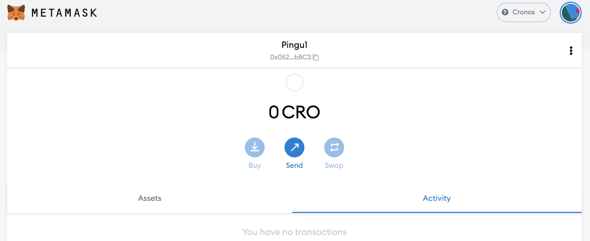
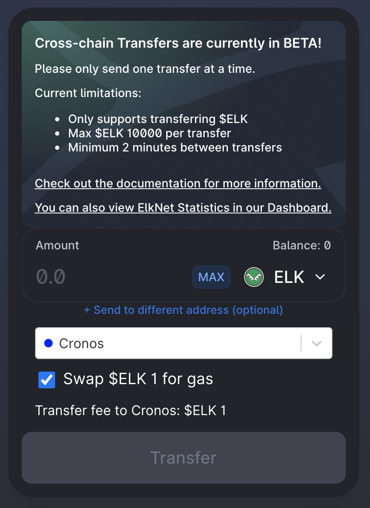
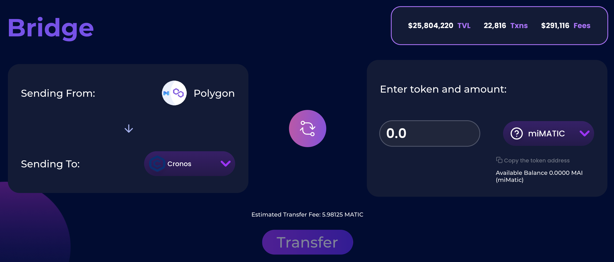
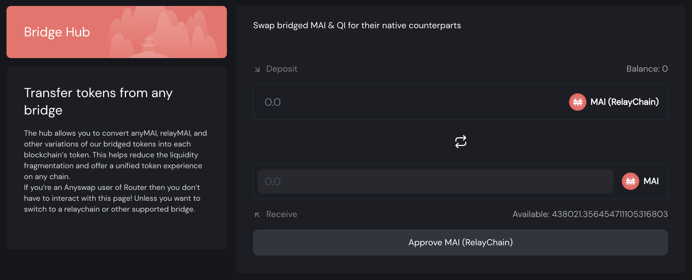
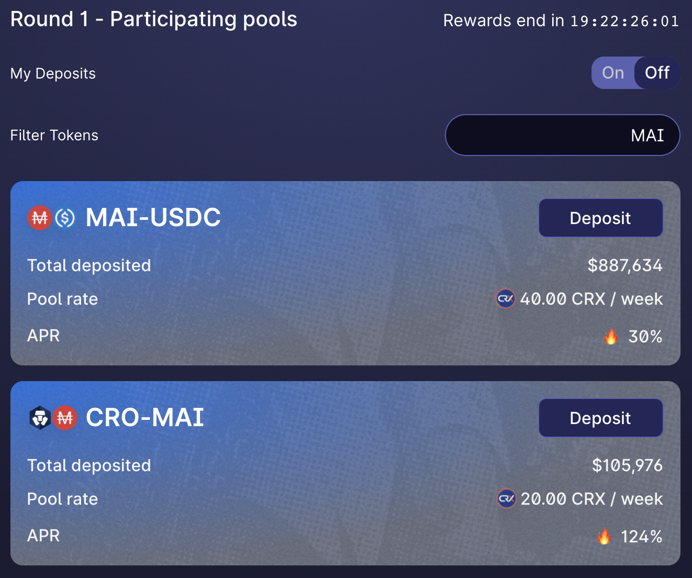

# Como começar na Cronos

## O que é Cronos

Será difícil explicar o que é a Cronos sem mencionar a Crypto.com. Crypto.com é uma das maiores corretoras centralizadas (também conhecido como CEX) e está construindo seu próprio conjunto de redes, incluindo a rede Crypto.org e a rede Cronos. A rede Crypto.org é uma rede com tecnologia proprietária, enquanto a Cronos é sua irmã compatível com EVM (Ethereum Virtual Machine). É praticamente a mesma coisa que ocorre com a Binance, que possuí a Binance Chain dedicada a CEX e a Binance Smart Chain compatível com EVM. \
\
Entre outras vantagens, a Cronos apresenta **compatibilidade com EVM,** o que significa que a maioria dos aplicativos lançados em outras redes EVM também podem ser implementados na Cronos. incluindo a Mai Finance, e **escalabilidade**: a Cronos é mais rápida e mais barata do que a Ethereum Mainnet.

## Começando na Cronos

Para usar a rede Cronos, você precisará de uma carteira. Como a Cronos é uma rede compatível com EVM, ela aceitará as mesmas carteiras que usamos em outras redes compatíveis com EVM, incluindo carteira virtuais como Metamask ou Nifty, e você poderá usar sua carteira de hardware como Trezor ou Ledger. \
\
Para este tutorial, nos limitaremos a Metamask, como fazemos em todos os outros guias deste site. Se você não tiver a Metamask instalada, você pode encontrar instruções para fazer isso no guia de [como começar na Polygon.](../../polygon-tutorials/how-to-get-started-on-polygon.md)

### Adicionando a Cronos à Metamask

Se você instalou a versão mais recente da Metamask, você já deve ter acesso à rede Cronos e não há mais nada para você definir além de selecionar Cronos na lista de redes na parte superior da interface Metamask. Você também pode definir um novo RPC para acessar a Cronos usando essas etapas. Abra o pop-up Metamask, clique no ícone de sua carteira, navegue até `Settings` então escolha `Networks` e encontre `Cronos`. A informação que você verá deve ser a suguinte:

* **Network Name:** Cronos
* **New RPC URL:** https://evm-cronos.crypto.org
* **Chain ID:** 25
* **Currency Symbol:** CRO
* **Block Explorer URL:** https://cronos.crypto.org/explorer/

Salve as alterações, e a Metamask irá transferi-lo automaticamente para a rede Cronos:

## Ponte à Cronos

### Faucets

Não há nenhum faucet oficial para obter seus primeiros tokens CRO para suas primeiras transações. No entanto, alguns aplicativos fornecem este serviço se você enviar alguns fundos à Cronos ou simplesmente se precisar de um pouco de gas:

* [Crystl Finance Faucet](https://cronos.crystl.finance/faucet): Depois de conectar sua carteira e completar o captcha, você poderá solicitar o envio de alguns tokens CRO para sua carteira.
* [Elk Finance](https://app.elk.finance/#/elknet): Ao fazer a ponte entre seus tokens ELK de uma rede para outra, você terá a opção de trocar uma pequena parte do ELK transferido pelo token de gas nativo da cadeia de destino. Isso é particularmente útil se você estiver conectando ativos pela primeira vez a uma nova cadeia.

* [Crypto.com](https://crypto.com/): Não se esqueça de que a Cronos é uma rede profundamente ligada a Crypto.com. Você pode criar uma conta lá, comprar seus tokens CRO diretamente vinculando uma conta bancária e enviá-los a Cronos.


Lembre-se de que você precisará de tokens de gas para poder fazer transações. Isso significa que se você conectar os ativos de outra rede a Cronos em uma conta sem tokens CRO, você ficará preso e não poderá fazer nada. Certifique-se de que sua carteira tenha fundos suficientes para realizar pelo menos uma transação de troca por token de gás.


### Pontes

* [Relay Chain](https://app.relaychain.com/transfer#/) é o parceiro oficial da Mai Finance se você deseja fazer a ponte entre seu MAI e a Cronos. Relay Chain oferece suporte à ponte de MAI a algumas rede diferentes, então você poderá enviar seus ativos da Polygon, Moonriver, Avalanche ou Shiden para a Cronos. Basta selecionar a rede de destino como Cronos e o token a enviar (na maioria das vezes denominado MAI, mas às vezes também sob miMATIC). Selecione o valor a ser transferido e inicie a transferência que não deve levar mais de 10 minutos. Preste atenção às taxas de transferência. No entanto, uma coisa boa sobre a Relay Chain é que ela te dará CRO no lado receptor para que você possa trocar alguns MAI por CRO.

* [AnySwap](https://anyswap.exchange/#/router) também é uma possibilidade para a maioria das redes se você quiser transferir alguns ativos para a Cronos. Como uma observação, a AnySwap também suporta a transferência de MAI da Polygon para a Cronos.
* [ElkNet](https://app.elk.finance/#/elknet) é um caso particular, uma vez que a ponte da Elk Finance permitirá que você conecte o token ELK de qualquer cadeia compatível com EVM para qualquer outra cadeia compatível com EVM, onde eles são implantados com a possibilidade de trocar uma pequena parte da quantia transferida em tokens de gas (consulte a seção dedicada a faucets logo acima).

### MAI Hub

Caso você envie MAI da Polygon à Cronos via Relay Chain, obterá a versão Relay Chain do MAI em vez do MAI nativo cunhado pelo aplicativo na Cronos. Os 2 tokens (o da Relay Chain e o da Mai Finance) têm o mesmo valor e o mesmo nome, mas endereços de contrato diferentes, e o único que será aceito para farming na Cronos é o da Mai Finance.

Você pode trocar o seu MAI da Relay Chain usando [o hub na Mai Finance](https://app.mai.finance/hub) com uma proporção de 1:1 ratio, então você poderá usar seu MAI verdadeiro em outras plataformas.

Não se esqueça de que você terá que converter seu MAI verdadeiro à versão da Relay Chain, se quiser enviá-lo da Cronos a outra rede.


Parece que a AnySwap suporta transferências de MAI da Polygon para o Cronos, mas você receberá a versão AnySwap do MAI que não poderá ser trocada pelo hub. Você pode ficar preso com um token inutilizável, então certifique-se de usar a ponte certa.


## DeFi na Cronos

Sendo a Cronos uma rede vinculada a Crypto.com, muitos investimentos estão fluindo para a rede e os aplicativos DeFi estão lá para dar suporte à liquidez. Dessa forma, você pode realizar farming nas seguintes plataformas:

* [CroDex](https://swap.crodex.app/#/swap): Esta é uma das principais DEX (**D**ecentralized **E**xchanges) e AMMs (**A**utomated **M**arket **M**aker) na Cronos, e é um fork da Uniswap v2 como QuickSwap. Você poderá trocar seus ativos, participar da mineração de liquidez fornecendo pares LP (**L**iquidity **P**roviding) em farms ou fazer staking com o token nativo da plataforma para ganhar mais recompensas. CroDex também é o primeiro parceiro oficial da Mai Finance na Cronos, e o único lugar onde você poderá trocar MAI por outros ativos, bem como participar de programas de mineração de liquidez cultivando os pares MAI-USDC e MAI-CRO .

Quando você faz farming na CroDex, você receberá recompensas em tokens CRX que você pode utilizar para staking em um Vault, para obter mais tokens CRX, mas há outras (melhores) opções que serão apresentadas em um tutorial futuro.

* [VVS](https://vvs.finance/) e [CronaSwap](https://app.cronaswap.org/): Estes são outros DEXes / AMMs que são forks da PancakeSwap (outro fork do Uniswap), onde você obterá os mesmos recursos do CroDex.
* [Beefy Finance](https://app.beefy.finance/#/cronos), [Adamant](https://adamant.finance/) e [Autofarm](https://autofarm.network/cronos/) são agregadores/otimizadores de rendimento famosos que estão presentes em muitas redes, e onde você poderá depositar seus tokens LP da maioria dos DEXes e deixar os algoritmos encarregados dos pools coletarem os tokens de farm e combinarem as recompensas em mais tokens LP.
* [Crystl Finance](https://cronos.crystl.finance) é um fork da Goose Finance que foi lançado primeiramente na Polygon e agora também está disponível na Cronos. Os usuários poderão depositar tokens LP em vaults para ganhar tokens CRYSTL que podem ser usados para staking ou farming (ou trocados).
* [Fortune DAO](https://www.fortunedao.com/#/) é o fork principal da Ohm (Olympus) na Cronos que aceita DAI e USDC.

## Mai Finance na Cronos

Atualmente, o aplicativo ainda não foi totalmente lançado e está aguardando principalmente que ChainLink Oracles aceite tokens como garantia. O Hub já está presente, então você pode esperar um lançamento no primeiro trimestre de 2022.

## Aviso Legal

Este guia NÃO é conselho financeiro e deve ser considerado simplesmente uma ferramenta educacional. Sempre faça sua própria pesquisa. A discussão de um projeto neste guia não deve ser considerada como um endosso do projeto.


Lembre-se de que uma estratégia que funciona bem em um determinado momento pode ter um desempenho ruim (ou fazer você perder dinheiro) em outro momento. Fique informado, monitore os mercados, fique de olho nos seus investimentos e, como sempre, faça suas próprias pesquisas.

