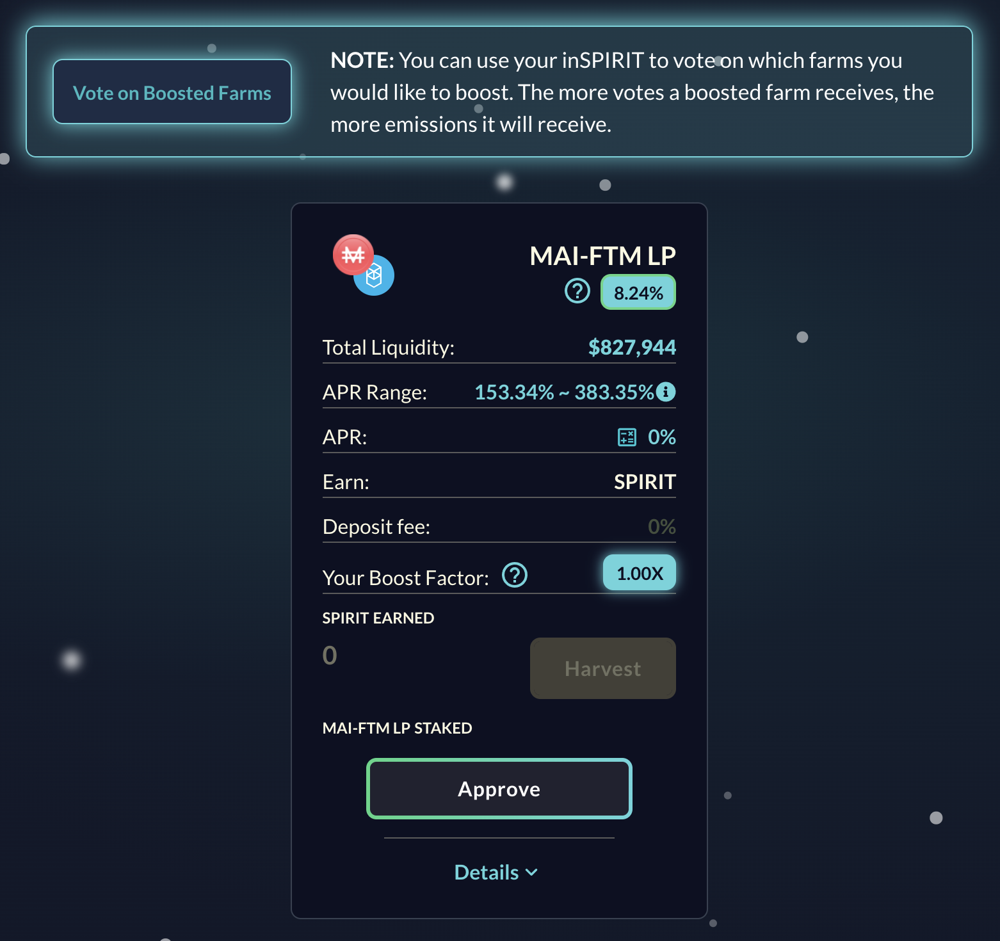

# Loop de Farming utilizando a SpiritSwap

Ao fazer farming, o par LP (**L**iquidity **P**roviding, provedor de liquidez) é muito importante. De fato, você quer o menor impermanent loss possível para que, assim, você não perca seu investimento inicial. Este par inicial gerará rendimentos, e você pode aumentar seus ganhos ao reinvestir o token com que você fez farming sem riscos adicionais no seu inicial. Esta é uma das razōes porque nossos guias propōem estratégias baseadas em stablecoins apenas, ou em pares que são compsotos por uma stable coin a uma blue chip como Bitcoin, Ethereum, ou o token nativo da rede que está sendo utilizada na estratégia.&#x20;

Hoje, nós exploraremos um loop relativamente complexo que sera baseado no par MAI-WFTM provido pela SpiritSwap para celebrar seu lançamento e o boost atual.

## Farming de MAI na SpiritSwap

[SpiritSwap](https://app.spiritswap.finance/#/) é uma das principais DEX (**D**ecentralized **Ex**change) e AMM (**A**utomated **M**arket **M**aker) na rede Fantom. É baseada na plataforma Uniswap, então você irá com muita certeza entender as funçōes principais dela, tais como troca de ativos, prover liquidez e gerar rendimentos. Você obterá recompensas no token nativo da plataforma, o token SPIRIT, com que você poderá realizar staking e receber inSPIRIT. O token inSPIRIT é particularmente útil, pois te permite votar em quais pools de liquidez receberam boost adicional, e irá te permitir receber um rendimento adicional do lucro do protocolo.

Para a nossa estratégia, nós usaremos a pool MAI-WFTM. Em dezembro de 2021, esta pool pode ser encontrar na aba`Booster Farms` .


Quando esta guia foi criado, a pool estava em um estado muito jobem (lançada nas ultimas 24h), o que explica o APR (**A**nnual **P**ercentage **R**ate) altíssimo. Como sempre, antes de aplicar uma de nossas estratégias, faça a sua própria pesquisa e verifique o APR antes de investir. Como comparação, USDC-WMATIC na Polygon tem cerca de 75%, e MAI-MOVR na Moonbeam de 158%. Outras pools como USDC-WFTM estabilizaram em torno de 50% na Fantom.

Para o propósito deste guia, nós manteremos o menor APR da faixa, 152.98%, que pode ser muito maior do que o alcançado.


Ao fazer farming de MAI-WFTM na SpiritSwap, você receberá recompensas pagas em SPIRIT, o token nativo do DApp (**D**ecentralized **App**lication). Em dezembro de 2021, 1 SPIRIT = 0.130 USDC.

## Farming com tokens SPIRIT na Liquid Driver

[Liquid Driver](https://www.liquiddriver.finance) é outro fork da Uniswap focado em prover liquidez na Fantom. Uma de suas funçōes mais interessantes é o fato que eles podem criar tokens linSPIRIT. A razão entre linSPIRIT e inSPIRIT é de 1:1, é de fato apenas uma versão wrapped (embrulhada) do token inSPIRIT, e você pode trocar ambos tokens um pelo outro na Liqud Driver.

Entretando, nós não usaremos esta função. Nós faremos farming na pool SPIRIT-linSPIRIT da Liquid Driver, mas há um porém:

Como você pode ver, você precisa criar o token LP na BeethovenX para conseguir o APR de 61% pago em token LQDR. Em dezembro de 2021, 1 LQDR = 4.560 USDC. Vamos ver como você pode obter esse token LP.

## Criando SPIRIT-linSPIRIT na BeethovenX

[BeethovenX](https://app.beets.fi/#/) foi reconhecida como a pool oficial da Balancer na Fantom. Assim como a Balancer, você não precisa depositar a mesma quantidade de ambos os tokens para criar um token LP. Isso signifca que você pode depositar diretamente 100% de seus tokens SPIRIT, e deixar o algoritmo fazer o resto.

Em troca, você receberá o token LP que poderá depositar na Liquid Driver.


Como você pode ver, esta pool não é incentivada na BeethovenX, você não poderá receber BEETS dela. Os incentivos são providenciados somente pela Liquid Driver quando você deposita o token em sua plataforma, e a única recompensa que você obterá será paga em LQDR.


## Staking de LQDR na Liquid Driver

Após ter criado seu token LP SPIRIT-linSPIRIT na BeenthovenX e o ter depositado na pool correta da Liquid Driver, você irá começar a receber tokens LQDR. Você pode então fazer staking com os tokens LQDR para receber uma porção da receita do protocolo. O interessante é que você pode escolher o período de tempo em que ocorrerá o staking, o que irá influenciar diretamente no seu APR (é a mesma coisa que ocorre ao fazer staking de Qi para obter o lucro do protocolo). O tempo de bloqueio médio é um pouco menor do que 2 anos (tempo máximo) e as recompensas serão pagas em:

* LQDR: você poderá fazer staking novamente com essa recompensa
* WFTM: nós usaremos isso mais tarde
* BOO: nós usaremos isso mais tarde
* linSPIRIT: isto pode ser usado para aumentar sua posição em SPIRIT-linSPIRIT na Liquid Driver
* SPELL: troque por mais WFTM !!!

## Staking de BOO na SpookySwap

[SpookySwap](https://spookyswap.finance) é quase a ultima peça de nosso quebra-cabeça. Staking de LQDR na Liquid Driver nos renderá tokens BOO, o token nativo da SpookySwap. SpookySwap é a maior DEX/AMM da Fantom, então você pode fazer praticamente a mesma coisa da SpiritSwap, exceto que seu token nativo é o token BOO. Isto acaba sendo útil porque você pode fazer staking com seus tokens BOO na SpookySwap para obter tokens xBOO, e esta versão staking de BOO pode ser usada para farming de outros tokens (é uma ferramenta comum em forks da Uniswap). Então, após você obter xBOO, você poderá depositar estes tokens na SpookySwap para receber mais WFTM.

## Obtendo mais tokens MAI-WTFM LP

Liquid Driver e SpookySwap produzirão tokens WFTM, so we're really missing MAI in order to add more LP tokens to our initial position in SpiritSwap. This can be done with a few different ways:

* swap 50% of your WFTM for MAI
* lend 66% of your WFTM on Beefy or Yearn Finance to get either mooScreamFTM or yvWFTM, then deposit the collateral tokens on Mai Finance and borrow MAI against them
* swap 66% of your WFTM for another asset and use the same strategy as above to borrow MAI


If you need more details on the 2 last bullet points, we have a dedicated article on [leveraging your assets on Fantom](leverage-your-crypto-on-fantom.md).


For our guide, we will try to maximize our gains and use mooScreamDAI. This means that we will swap 66% of our WFTM for DAI on Spirit Swap, then deposit DAI directly on Beefy using SCREAM as the underlying platform to get mooScreamDAI. This token will then be deposited in a vault on Mai Finance and we will be able to borrow MAI. In order to lower the risk of liquidation, we will keep a CDR (**C**ollateral to **D**ebt **R**atio) of 200%, which means we will borrow half the value of our deposit. This is perfect since this corresponds to the same value of the WFTM we kept, so that it will be possible to create additional MAI-WFTM LP tokens.

At the end of the loop, we'll get more MAI-WFTM and a yield bearing token used as collateral in Mai Finance.

## Farming Strategy

The following simulation is made assuming a few things:

* All rates and prices remain the same for the entire period of the simulation, 1 year in our case
  * 153% APR on MAI-WFTM farming on SpiritSwap
  * no reward on linSPIRIT
  * 61% APR on SPIRIT-linSPIRIT on Liquid Driver
  * 139% APR on staking LQDR
    * 26% APR in LQDR
    * 6% in WFTM
    * 30% in BOO
    * 74% in linSPIRIT
    * 3% in SPELL
  * 36% APR for staking xBOO
  * 21% APR for mooScreamDAI
* All rewards and programs are also running for an entire year
* The initial investment is $1,000 worth of MAI-WFTM LP token

### Day 1

On day 1, simply deposit your MAI-WFTM pair on SpiritSwap. At the end of the day, harvest your SPIRIT tokens and combine them into a SPIRIT-linSPIRIT pair on BeethovenX, then deposit this LP token on Liquid Driver. At the end of the day, you'd get

| MAI-WFTM | linPIRIT-SPIRIT | LQDR | xBOO | mooScreamDAI |
| -------- | --------------- | ---- | ---- | ------------ |
| 1,000.00 | 4.19            | 0.00 | 0.00 | 0.00         |

### Day 2

On day 2, yourr MAI-WFTM is still generating SPIRIT tokens that you'll deposit in the linSPIRIT-SPIRIT pool on Liquid Driver, but you will also be able to harvest your first few LQDR tokens, and stake them for the multi-rewards. At the end of the day, you'll get

| MAI-WFTM | linPIRIT-SPIRIT | LQDR  | xBOO | mooScreamDAI |
| -------- | --------------- | ----- | ---- | ------------ |
| 1,000.00 | 8.38            | 0.007 | 0.00 | 0.00         |

### Day 3

On day 3, same thing except your LQDR will have produced your first few exotic tokens from protocol revenues. Don't forget you will actually stake your BOO, add your linSPIRIT to the pool, your LQDR will be restaked, and the rest will be swapped for WFTM. The resulting WFTM is then partially swapped for DAI and then mooScreamDAI deposited in a Vault to borrow MAI, form additional MAI-WFTM that is then deposited on SpiritSwap. At the end of Day 3, you'd get

| MAI-WFTM | linPIRIT-SPIRIT | LQDR  | xBOO | mooScreamDAI |
| -------- | --------------- | ----- | ---- | ------------ |
| 1,000.00 | 12.58           | 0.021 | 0.00 | 0.00         |


xBOO and mooScreamDAI position are too small to be displayed, so you may skip these steps for the first few days. Also, for simplicity, I'm not taking transaction fees in consideration, which may have an impact on your gains.


At this point, the system is primed, it's time to sit down and profit.

## Farming Results

### Daily routine

Once the system is fully bootstrapped, here's the daily routine you'll have to follow:

* harvest SPIRIT tokens from MAI-WFTM pool on SpiritSwap
* harvest rewards from Liquid Driver staking pool
* harvest rewards from SpookySwap staking pool
* deposit the SPIRIT from SpiritSwap and the linSPIRIT from Liquid Driver into the pool on BeethovenX
* deposit the SPIRIT-linSPIRIT LP token on Liquid Driver
* stake your BOO on SpookySwap to get xBOO
* stake your xBOO to farm WFTM
* swap your SPELL for WFTM
* swap 66% of your WFTM for DAI
* deposit the DAI generated on Beefy to get mooScreamDAI
* deposit the mooScreamDAI tokens on Mai Finance
* borrow MAI and keep a CDR of 200% (50% of what you deposited)
* provide liquidity for the MAI-WFTM pool on SpiritSwap

### Raw results month after month

| day | MAI-WFTM  | linPIRIT-SPIRIT | LQDR    | xBOO   | mooScreamDAI | MAI debt |
| --- | --------- | --------------- | ------- | ------ | ------------ | -------- |
| 30  | 1,000.004 | 130.010         | 3.281   | 0.026  | 0.005        | 0.002    |
| 60  | 1,000.039 | 256.218         | 13.014  | 0.210  | 0.041        | 0.021    |
| 90  | 1,000.140 | 383.220         | 29.369  | 0.712  | 0.147        | 0.074    |
| 120 | 1,000.349 | 511.436         | 52.538  | 1.698  | 0.364        | 0.182    |
| 150 | 1,000.708 | 641.302         | 82.741  | 3.338  | 0.738        | 0.369    |
| 180 | 1,001.268 | 773.275         | 120.224 | 5.810  | 1.323        | 0.661    |
| 210 | 1,002.081 | 907.835         | 165.263 | 9.295  | 2.175        | 1.088    |
| 240 | 1,003.207 | 1,045.486       | 218.165 | 13.984 | 3.360        | 1.680    |
| 270 | 1,004.710 | 1,186.759       | 279.268 | 20.075 | 4.947        | 2.473    |
| 300 | 1,006.659 | 1,332.316       | 348.947 | 27.773 | 7.014        | 3.507    |
| 330 | 1,009.130 | 1,482.451       | 427.613 | 37.296 | 9.645        | 4.823    |
| 360 | 1,012.205 | 1,638.095       | 515.717 | 48.870 | 12.935       | 6.467    |

### Day 365

After a complete year of farming the syste, you would get

* $1,012.782 worth of MAI-WFTM on SpiritSwap
* $1,664.608 worth of linSPIRIT-SPIRIT on Liquid Driver
* $531.353 worth of LQDR staked on Liquid Driver
* $51.015 worth of xBOO on SpookySwap
* $13.554 worth of mooScreamDAI on Mai Finance in a vault
* $6.777 worth of MAI debt

Considering an initial investment of $1,000 this would be equivalent to an APY of 227.096%

### Small tweaks to the strategy

If you want to get a lower risk exposure, you can possible start with your initial investment being $1,000 worth of mooScreamDAI in a vault, borrow $500 worth of MAI and swaap 50% for WFTM to get the starting block on SpiritSwap. This will considerably lower your risk of loosing part of your initial in case the price of FTM goes down too much.

Currently, the highest rate is given by the SpiritSwap pool, so a possibible simplification of the loop would be to simply swap all the LQDR tokens you get on Liquid Driver for more MAI-WFTM.

## Disclaimer

This guide is a theoretical version of something you could implement on Fantom. When we're exposing loops in our tutorials, we're actually trying to never dump tokens and always try to find the best way possible to use everything we collect. This is a good way to keep price rising since farming and dumping a token usually resuslts in the price of the farmed token to go down, making the yields less and less attractive. If everyone was keeping their farmed tokens, their price would only go up with time.

In any case, the guide is also based on a lot of assumptions (price don't change, reward rates don't change) and doesn't count transaction fees, so if you want to implement this type of closed loop, make sure to be profitable at the end of the day, or compound your gains only once a week. And as usual, DYOR!


This guide is definitely not financial advice, it was made with an educational goal in mind. You need to pay attention to price variations, supply and demand, reward programs end dates, impermanent losses etc ... The goal wasn't to propose recipes that can be followed blindly, so please do your homework and your own simulation, and only invest what you're ready to possibly lose.

