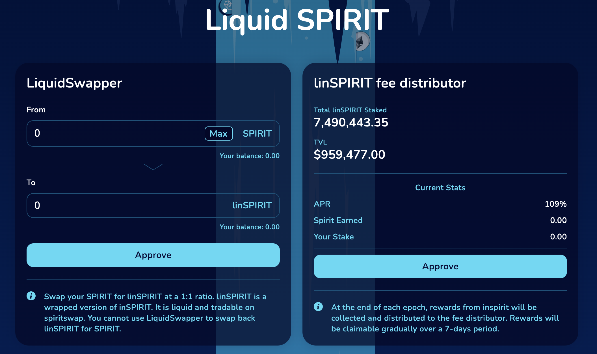
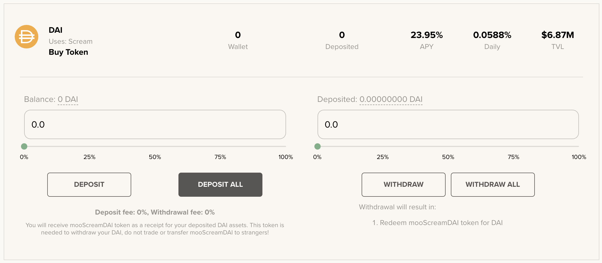
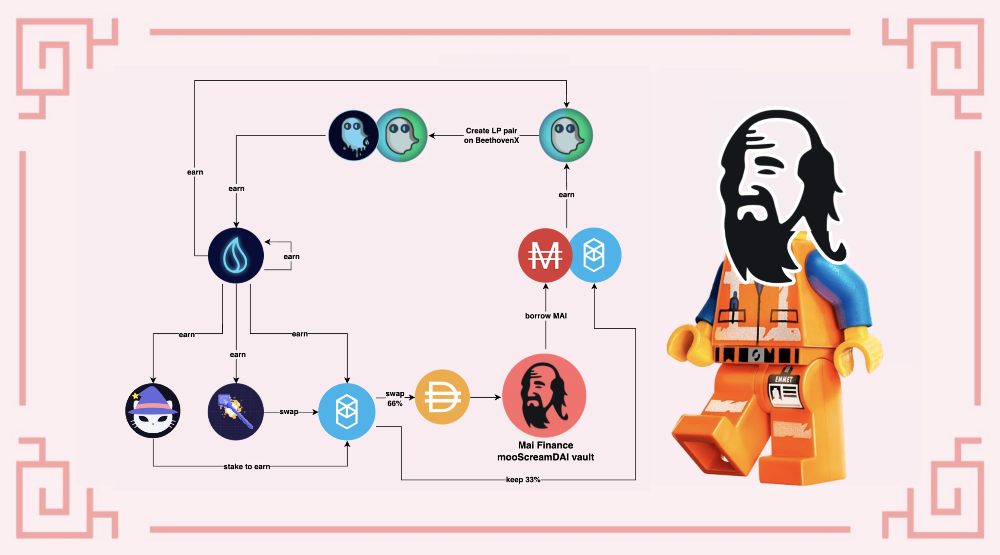

# Loop de Farming utilizando a SpiritSwap

Ao fazer farming, o par LP (**L**iquidity **P**roviding, provedor de liquidez) é muito importante. De fato, você quer o menor impermanent loss possível para que, assim, você não perca seu investimento inicial. Este par inicial gerará rendimentos, e você pode aumentar seus ganhos ao reinvestir o token com que você fez farming sem riscos adicionais no seu inicial. Esta é uma das razōes porque nossos guias propōem estratégias baseadas em stablecoins apenas, ou em pares que são compsotos por uma stable coin a uma blue chip como Bitcoin, Ethereum, ou o token nativo da rede que está sendo utilizada na estratégia.&#x20;

Hoje, nós exploraremos um loop relativamente complexo que sera baseado no par MAI-WFTM provido pela SpiritSwap para celebrar seu lançamento e o boost atual.

## Farming de MAI na SpiritSwap

[SpiritSwap](https://app.spiritswap.finance/#/) é uma das principais DEX (**D**ecentralized **Ex**change) e AMM (**A**utomated **M**arket **M**aker) na rede Fantom. É baseada na plataforma Uniswap, então você irá com muita certeza entender as funçōes principais dela, tais como troca de ativos, prover liquidez e gerar rendimentos. Você obterá recompensas no token nativo da plataforma, o token SPIRIT, com que você poderá realizar staking e receber inSPIRIT. O token inSPIRIT é particularmente útil, pois te permite votar em quais pools de liquidez receberam boost adicional, e irá te permitir receber um rendimento adicional do lucro do protocolo.

Para a nossa estratégia, nós usaremos a pool MAI-WFTM. Em dezembro de 2021, esta pool pode ser encontrar na aba`Booster Farms` .


Quando esta guia foi criado, a pool estava em um estado muito jobem (lançada nas ultimas 24h), o que explica o APR (**A**nnual **P**ercentage **R**ate) altíssimo. Como sempre, antes de aplicar uma de nossas estratégias, faça a sua própria pesquisa e verifique o APR antes de investir. Como comparação, USDC-WMATIC na Polygon tem cerca de 75%, e MAI-MOVR na Moonbeam de 158%. Outras pools como USDC-WFTM estabilizaram em torno de 50% na Fantom.

Para o propósito deste guia, nós manteremos o menor APR da faixa, 152.98%, que pode ser muito maior do que o alcançado.


Ao fazer farming de MAI-WFTM na SpiritSwap, você receberá recompensas pagas em SPIRIT, o token nativo do DApp (**D**ecentralized **App**lication). Em dezembro de 2021, 1 SPIRIT = 0.130 USDC.

## Farming com tokens SPIRIT na Liquid Driver

[Liquid Driver](https://www.liquiddriver.finance) é outro fork da Uniswap focado em prover liquidez na Fantom. Uma de suas funçōes mais interessantes é o fato que eles podem criar tokens linSPIRIT. A razão entre linSPIRIT e inSPIRIT é de 1:1, é de fato apenas uma versão wrapped (embrulhada) do token inSPIRIT, e você pode trocar ambos tokens um pelo outro na Liqud Driver.

Entretando, nós não usaremos esta função. Nós faremos farming na pool SPIRIT-linSPIRIT da Liquid Driver, mas há um porém:

Como você pode ver, você precisa criar o token LP na BeethovenX para conseguir o APR de 61% pago em token LQDR. Em dezembro de 2021, 1 LQDR = 4.560 USDC. Vamos ver como você pode obter esse token LP.

## Criando SPIRIT-linSPIRIT na BeethovenX

[BeethovenX](https://app.beets.fi/#/) foi reconhecida como a pool oficial da Balancer na Fantom. Assim como a Balancer, você não precisa depositar a mesma quantidade de ambos os tokens para criar um token LP. Isso signifca que você pode depositar diretamente 100% de seus tokens SPIRIT, e deixar o algoritmo fazer o resto.

Em troca, você receberá o token LP que poderá depositar na Liquid Driver.


Como você pode ver, esta pool não é incentivada na BeethovenX, você não poderá receber BEETS dela. Os incentivos são providenciados somente pela Liquid Driver quando você deposita o token em sua plataforma, e a única recompensa que você obterá será paga em LQDR.


## Staking de LQDR na Liquid Driver

Após ter criado seu token LP SPIRIT-linSPIRIT na BeenthovenX e o ter depositado na pool correta da Liquid Driver, você irá começar a receber tokens LQDR. Você pode então fazer staking com os tokens LQDR para receber uma porção da receita do protocolo. O interessante é que você pode escolher o período de tempo em que ocorrerá o staking, o que irá influenciar diretamente no seu APR (é a mesma coisa que ocorre ao fazer staking de Qi para obter o lucro do protocolo). O tempo de bloqueio médio é um pouco menor do que 2 anos (tempo máximo) e as recompensas serão pagas em:

* LQDR: você poderá fazer staking novamente com essa recompensa
* WFTM: nós usaremos isso mais tarde
* BOO: nós usaremos isso mais tarde
* linSPIRIT: isto pode ser usado para aumentar sua posição em SPIRIT-linSPIRIT na Liquid Driver
* SPELL: troque por mais WFTM !!!

## Staking de BOO na SpookySwap

[SpookySwap](https://spookyswap.finance) é quase a ultima peça de nosso quebra-cabeça. Staking de LQDR na Liquid Driver nos renderá tokens BOO, o token nativo da SpookySwap. SpookySwap é a maior DEX/AMM da Fantom, então você pode fazer praticamente a mesma coisa da SpiritSwap, exceto que seu token nativo é o token BOO. Isto acaba sendo útil porque você pode fazer staking com seus tokens BOO na SpookySwap para obter tokens xBOO, e esta versão staking de BOO pode ser usada para farming de outros tokens (é uma ferramenta comum em forks da Uniswap). Então, após você obter xBOO, você poderá depositar estes tokens na SpookySwap para receber mais WFTM.

## Obtendo mais tokens MAI-WTFM LP

Liquid Driver e SpookySwap produzirão tokens WFTM, portanto fica faltando MAI para adicionar mais LP tokens à nossa posição inicial na SpiritSwap. Isto pode ser feito em poucas etapas:

* troque 50% de seu WFTM por MAI
* empreste 66% de seu WFTM na Beefy ou Yearn Finance para receber mooScreamFTM ou yvWFTM, então deposite os tokens de garantia na Mai Finance como garantia, e tome MAI emprestado
* troque 66% de seu WFTM por outro ativo e utilize a mesma estratégia ácima para tomar MAI emprestado


Se você precisa de mais informaçōes sobre os últimos 2 pontos, nós possuímos um artigo dedicado à [alavancagem de ativos na Fantom](leverage-your-crypto-on-fantom.md).


Para o nosso guia, nós tentaremos maximizar nossos ganhos e usar mooScreamDAI. Isso significa que nós trocaremos 66% de nosso WFTM por DAI na SpiritSwap, e então depositaremos DAI diretamente na Beefy usando SCREAM como a plataforma subjacente para obter mooScreamDAI. Este token será então depositado em um vault na Mai Finance e nós poderemos tomar MAI emprestado. Para diminuir o risco de liquidação, nós manteremos uma CDR (**C**ollateral to **D**ebt **R**atio, ou Razão de Garantia para Dívida) de 200%, o que significa que nós tomaremos emprestado metade do valor de nosso depósito. Isso é perfeito já que corresponde ao mesmo valor de WFTM que nós mantivemos, assim fica possível criar tokens LP MAI-WFTM adicionais.

No final do loop, nós obteremos mais MAI-WFTM e um token comprovante de depósito usado como garantia na MaI Finance.

## Estratégia de Farming

A seguinte simulação é feita assumindo algumas coisas:

* Todas as taxas e preços permanecem os mesmos durante o periodo da simulação, 1 ano neste caso
  * APR de 153% no farming de MAI-WFTM da SpiritSwap
  * nenhuma recompensa na linSPIRIT
  * APR de 61% na SPIRIT-linSPIRIT da Liquid Driver
  * APR de 139% em staking de LQDR
    * APR 26% em LQDR
    * 6% em WFTM
    * 30% em BOO
    * 74% em linSPIRIT
    * 3% em SPELL
  * APR de 36% pelo staking de xBOO
  * APR de 21% por mooScreamDAI
* Todas as recompensas e programos também rodam durante o ano inteiro
* O investimento inicial é de $1,000 em token LP MAI-WFTM

### 1.º Dia

No primeiro dia, simplesmente deposite seu par MAI-WFTM na SpiritSwap. No final do dia, colha seus tokens SPIRIT e os combine em um par SPIRIT-linSPIRIT na BeethovenX, então deposite este token LP na Liquid Driver. No final do dia, você terá:

| MAI-WFTM | linPIRIT-SPIRIT | LQDR | xBOO | mooScreamDAI |
| -------- | --------------- | ---- | ---- | ------------ |
| 1,000.00 | 4.19            | 0.00 | 0.00 | 0.00         |

### 2.º Dia

No segundo dia, seu MAI-WFTM ainda está produzindo tokens SPIRIT que você depositará na pool linSPIRIT-SPIRIT da Liquid Driver, mas você também será capaz de colher seus primeiros tokens LQDR, e com eles, fazer staking para obter recompensas múltiplas. No final do dia, você terá:

| MAI-WFTM | linPIRIT-SPIRIT | LQDR  | xBOO | mooScreamDAI |
| -------- | --------------- | ----- | ---- | ------------ |
| 1,000.00 | 8.38            | 0.007 | 0.00 | 0.00         |

### 3.º Dia

No terceiro dia, ocorre a mesma coisa, exceto que seu LQDR terá produzido seus primeiros tokens exóticos do rendimento do protocolo. Não esqueça que você irá fazer staking com seu BOO, adicionar seu linSPIRIT à pool, seu LQDR passará por staking novamente, e o resto será trocado por WFTM. O WFTM resultante é então parcialmente trocado por DAI e então mooScreamDAI é depositada em um Vault para tomar MAI emprestado, formar mais MAI-WFTM que é então depositado na SpiritSwap. No final do terceiro dia, você obterá:

| MAI-WFTM | linPIRIT-SPIRIT | LQDR  | xBOO | mooScreamDAI |
| -------- | --------------- | ----- | ---- | ------------ |
| 1,000.00 | 12.58           | 0.021 | 0.00 | 0.00         |


As posiçōes em xBOO e mooScreamDAI são muito pequenas para serem exibidas, então você pode pular essas etapas nos primeiros dias. Além disso, por simplicidade, eu não estou levando em consideração as taxas das transaçōes, que podem impactar nossos ganhos.


Neste ponto, o sistema está montado, é hora de descansar e lucrar.

## Resultado do Farming

### Rotina diaria

Após o sistema estar totalmente montado, aqui está a rotina diária que você terá que seguir:

* colher tokens SPIRIT da pool MAI-WFTM na SpiritSwap
* colher recompensas da staking pool na Liquid Driver
* colher recompensas da staking pool na SpookySwap
* depositar o SPIRIT da SpiritSwap e o linSPIRIT da Liquid Driver na pool da BeethovenX
* depositar o LP token SPIRIT-linSPIRIT na Liquid Driver
* fazer staking com seu BOO na SpookySwap para receber xBOO
* fazer staking com seu xBOO para farming de WFTM
* trocar seu SPELL por WFTM
* trocar 66% de seu WFTM por DAI
* depositar o DAI gerado na Beefy para obter mooScreamDAI
* depositar os tokens mooScreamDAI na Mai Finance
* tomar MAI emprestao e manter uma CDR de 200% (50% do que você depositou)
* prover liquidez para a pool MAI-WFTM na SpiritSwap

### Resultados mensais brutos

| dia | MAI-WFTM  | linPIRIT-SPIRIT | LQDR    | xBOO   | mooScreamDAI | dívida em MAI |
| --- | --------- | --------------- | ------- | ------ | ------------ | ------------- |
| 30  | 1,000.004 | 130.010         | 3.281   | 0.026  | 0.005        | 0.002         |
| 60  | 1,000.039 | 256.218         | 13.014  | 0.210  | 0.041        | 0.021         |
| 90  | 1,000.140 | 383.220         | 29.369  | 0.712  | 0.147        | 0.074         |
| 120 | 1,000.349 | 511.436         | 52.538  | 1.698  | 0.364        | 0.182         |
| 150 | 1,000.708 | 641.302         | 82.741  | 3.338  | 0.738        | 0.369         |
| 180 | 1,001.268 | 773.275         | 120.224 | 5.810  | 1.323        | 0.661         |
| 210 | 1,002.081 | 907.835         | 165.263 | 9.295  | 2.175        | 1.088         |
| 240 | 1,003.207 | 1,045.486       | 218.165 | 13.984 | 3.360        | 1.680         |
| 270 | 1,004.710 | 1,186.759       | 279.268 | 20.075 | 4.947        | 2.473         |
| 300 | 1,006.659 | 1,332.316       | 348.947 | 27.773 | 7.014        | 3.507         |
| 330 | 1,009.130 | 1,482.451       | 427.613 | 37.296 | 9.645        | 4.823         |
| 360 | 1,012.205 | 1,638.095       | 515.717 | 48.870 | 12.935       | 6.467         |

### 365.º Dia

Após um ano completo de farming com o sistema, você teria:

* $1,012.782 de MAI-WFTM na SpiritSwap
* $1,664.608 de linSPIRIT-SPIRIT na Liquid Driver
* $531.353 de LQDR em staking na Liquid Driver
* $51.015 de xBOO na SpookySwap
* $13.554 de mooScreamDAI na Mai Finance em um cofre
* $6.777 em dívida de MAI

Considerando um investimento inicial de $1,000 isso seria equivalente a um APY de 227.096%

### Pequenos ajustes à estratégia

Se você que obter uma menor exposição a risco, você pode começar com um investimento inicial de $1,000 em um vault de mooScreamDAI, tomando $500 emprestados de MAI e trocando 50% por WFTM para obter o bloco de início na SpiritSwap. Isso irá diminuir consideravelmente o risco de perder parte de seu investimento inicial caso o preço de FTM caia muito.

Atualmente, a maior taxa é dada pela pool da SpiritSwap, então uma possível simplificação do loop seria trocar todos os tokens LQDR que você obtém na Liquid Driver por mais MAI-WFTM.

## Aviso legal

Este guia é uma versão teórica de algo que você pode implementar na Fantom. Quando nós estamos expondo loops em nossos tutoriais, nós estamos, na verdade, tentando evitar a venda dos tokens e, ao invés, fazer bom uso para tudo que nós coletamos. Essa é uma boa maneira de manter o preço aumentando já que fazer farming para depois vender um token acaba causando uma queda no preço do token, tornando os rendimentos cada vez menos atrativos. Se todos mantivessem seus tokens, o preço iria apenas subir com o passar do tempo.

De qualquer forma, o guia é baseado em varias suposiçōes (preço estável, taxas de recompensas estáveis) e não considera taxas de transaçōes, então se você deseja implementar este tipo de loop fechado, tenha certeza que será lucrativo, ou reacumule seus ganhos semanalmente. Como sempre, faça a sua própria pesquisa!


Este guia não representa conselho financeiro, e foi feito apenas com intento educacional. Você precisa prestar atenção à variação dos preços, oferta e demanda, datas de validade dos programas de recompensa, perda impermanente, etc. O objetivo não é te entregar uma receita de bolo que deve ser seguida cegamente, então, por favor, faça a sua lição de casa e sua própria simulação, e apenas invista o que você está disposto a possivelmente perder.

