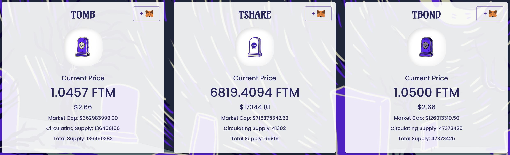
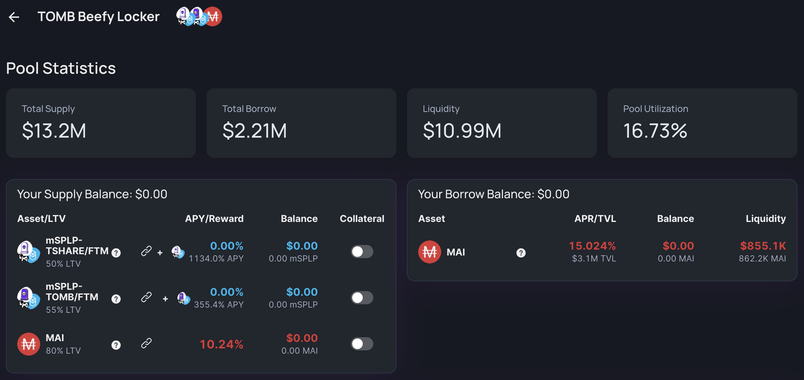

# Combo do Exodia na Fantom

## Introdução

Uma das coisas mais importantes a ter em mente ao investir em criptomoedas é garantir que sua posição inicial esteja protegida. Se você mantiver esse fundamento em mente, poderá apenas colocar seus ganhos em risco. No entanto, há outra opção se você quiser investir em um token que represente incertezas: comprá-lo com desconto e garantir que as recompensas sejam altas o suficiente para cobrir seu investimento inicial o mais rápido possível.

Há alguns meses, isso se tornou possível com a introdução de títulos e taxas de recompensa muito altas propostas por alguns projetos. Então, hoje, exploramos dois projetos no Fantom que estão usando o conceito de bonding para atingir 2 objetivos muito diferentes.

## Exodia

### Apresentação do projeto

[Exodia](https://app.exodia.fi/dashboard) é um pequeno projeto na Fantom que tem um potencial gigantesco. É um Ohm-fork baseado no token EXOD, uma moeda de reserva apoiada por diferentes ativos. Os ativos de rerva iniciais adicionados ao tesouro da Exodia foram DAI e FTM, mas a equipe e a DAO encarregados do protocolo decidiram desenvolver laços com a comunidade Olympus e alocar 33% de suas reservas excedentes para comprar ativos denominados em OHM. Como tal, uma pequena parte da tesouraria é denominada em tokens gOHM.

### Novo LP Token para Bonding

Para fortalecer laços, a Exodia votou recentemente para aumentar a quantidade de tokens relacionados ao OHM em seu tesouro e em breve aceitará um novo token como parte de seu programa de bonding. O novo token é um token LP (Liquidity Provider) que pode ser criado no BeethovenX. Uma das melhores coisas sobre os tokens BeethovenX é que eles podem ser criados mesmo se você possuir apenas um único ativo da seleção no pool, o que o torna facilmente acessível. O token LP é composto por:

* 20% em wFTM
* 20% em EXOD
* 20% em wsEXOD
* 20% em gOHM
* 20% em MAI

Este é provavelmente o primeiro fork da Ohm usando um token LP de um fork da Balancer para bonding. Isso é interessante porque agora você pode comprar novos títulos usando apenas seus tokens EXOD. As etapas seriam:

* deposite seu token EXOD no pool `The Monolith` da BeethovenX para obter o token LP
* venda seu token LP no aplicativo da Exodia para comprar um novo EXOD com desconto
* aguarde o período de vesting e colete seus tokens EXOD
* repita

Isso reduz drasticamente a pressão de venda dos tokens EXOD, o que beneficia o protocolo. Anteriormente, os flippers de títulos teriam que vender seu EXOD para obter DAI e comprar títulos adicionais, o que é prejudicial por reduzir o preço do token e causar um efeito em cascata ao tesouro e ao projeto.


Se você não está familiarizado com os projetos Ohm, recomendo fortemente mais algumas leituras sobre o assunto. Você pode consultar nosso guia sobre Klima (veja a seção Polígono) ou ir diretamente para a [official documentation of Exodia](https://docs.exodia.finance). Além disso, você pode se juntar à discórdia e se inscrever no esquema de educação..


Você também vê que o token LP aceita MAI, a moeda estável que você pode cunhar no Mai Finance. Esta será, na verdade, nossa fonte principal para o LP (veja mais adiante). Depois de comprar seus títulos com um desconto decente, você receberá seus tokens EXOD no final do período de aquisição. Você também pode apostar esse token em um APY (**A**nnual **P**ercentage **Y**ield, ou Rendimento Percentual Anual) decente de 38.787%, o que equivale a um APR (**A**nnual **P**ercentage Rate, ou Taxa Percentual Anual) de 601% ou um ganho diário de 1,65%.

We will be using the bonding system to purchase EXOD tokens with a discount, and profit from the very high APY to collect gains from rebase rewards.

## Tomb Finance

[Tomb Finance](https://tomb.finance) is a very particular project, original in many ways. The TOMB token is an algorithmic stable coin pegged to the FTM token, and designed to be a medium of exchange and to add additional liquidity to FTM,the gas token of the Fantom chain.

The Tomb Finance ecosystem proposes 2 more tokens:

* TSHARE: this is the governance token for Tomb Finance. Holders of TSHARE have voting power. TSHARE stakers will also receive additional TOMBs. The emission of additional TOMB tokens to TSHARE holders is following the same mechanics as Ohm forks with new token being minted at the end of each epoch with very high APY.
* TBOND: this is a special tokens that is primarly used to maintain the peg to 1 FTM. When the TOMB price falls below 1 FTM, users can purchase TBOND at the current price of TOMB tokens. They can do so by selling TOMB tokens to the protocol, and these tokens are burnt, which increases the value of TOMB back to 1 FTM. Buying TBOND at a discount and being able to redeem TOMB tokens gave the name to the TBOND token. When the TOMB token is above thee peg, people can redeem their TBOND for TOMB. New TOMB are minted, reducing the value of the token. In other words, this is an arbitrage token!

Tomb Finance also proposes 2 LP pools that will earn you TSHARE tokens. This is particularly important for Tomb Finance to have a very important liquidity depth. However, to achieve the objective of geetting TOMB as an alternative solution to FTM, it's important for the protocol to have users using TOMB, hence owning the liquidity. When you farm the TOMB-FTM and TSHARE-FTM pools, you are rewarded with TSHARE tokens that will allow you to earn more TOMB tokens, which is a nice little closed loop within a single application.

## Additional pieces to close loops

Now that we presented the 2 big pieces for our strategy, let's quickly see the other pieces of the puzzle of the day.

### Beefy Finance

[Beefy Finance](https://app.beefy.finance/#/fantom) is a yield optimizer that will accept LP tokens from particular DEX (**D**ecentralized **Ex**changes), farm reward tokens, and let their algorithms sell the reward for additional LP. As such, you can get an increasing investment position that will compound only the tokens from the LP and capture the value of the reward token at the time the token is harvested.

For our stratgy, we will be using the TOMB-FTM LP token. The reasons are multiple:

* TOMB being pegged to the FTM token, there's no IL (**I**mpermanent **L**oss) on this pair, so the only variation will be linked to the price variation of FTM
* TOMB-FTM is rewarded with TSHARE, so selling TSHARE won't impact the 2 tokens from the pair
* TOMB-FTM has quite a high APY which for a LP token with no IL
* using the LP token on beefy will allow you to get `mooTombTOMB-FTM` receipt token


For the purpose of this guide, we're using TOMB-FTM token because it presents less risk due to the absence of impermanent loss on the pair. However, you can totally use the TSHARE-FTM pair for higher rewards. Make sure you understand the risks and DYOR first.


### Market XYZ lending market

[Market.XYZ](https://fantom.market.xyz/pool/3) is a lending protocol on which you will be able to deposit some particular assets and borrow against them. When you lend your asset, you may get some lending incentives paid in the asset you lend. When you borrow, you will have to paay some interests at the time of repayment in the same asset you borrowed.

Market XYZ started a partnership with Mai Finance in 2021 in order to allow additional classes of assets to be used as collateral to borrow the MAI stablecoin. These assets are considered more risky than the ones currently accepted directly on Mai Finance, or are just waiting for an official ChainLink Oracle and are not accepted directly on the main app. This brings additional benefits: the QiDAO protocol is earning fees from borrowed MAI, borrowers are getting MAI at low interest rates (Mai Finance is adding more MAI from the treasury regularly based on demaand) and it is a very interesting use case for the stable coin, driving its usage up. On the flip side, lending markets are a great way to kickstart strong relations with different partners while they are waiting for their assets to be accepted on Mai Finance directly.

The lending market we are interested in for this strategy is the TOMB Beefy locker. After we deposit our TOMB-FTM tokens on Beefy, we receive mooTombTOMB-FTM receipt token that is a "proof of ownership" for the token that is compounding rewards on Beefy. This receipt token can be used as collateral on MarketXYZ to borrow additional MAI.


Market.XYZ only allows loans with a minimum value of 0.05 ETH (\~$170.00 at time of writing). Make sure you deposit enough collateral if you want to bororw from the different lockers.


In the screenshot above, you can see that we can

* deposit the mooTombTOMB-FTM token as collateral and get 355.4% APY on it, provided by Beefy
* borrow MAI against our collateral with a 15.02% interest rate (APR)

It's easy to see that the gains we get from the LP farming out-performs by far the borrowing interests, which makes this strategy viable. However, make sure you monitor properly the price of FTM and TOMB to prevent liquidation and make sure you borrow at a very high CDR (**C**ollateral to **D**ebt **R**atio), which will let you enough time to repay your loan in case of a massive price drop.


If you're not interested in this strategy but you are a user of Mai Finance, Market XYZ is an amazing application to lend your MAI. You will be paid in additional MAI that will be compounded into your position.


## Farming strategy

To complete our investment loop, we will start with purchasing EXOD bonds using MAI. The EXOD rebase rewards will be used to purchase TOMB-FTM LP tokens. The tokens will be used on Beefy to compound the TSHARE rewards. Additionally, the LP token receipt will be used as collateral on Market XYZ to borrow more MAI, which sends us back to our initial step.

We will simulate with a few assumptions:

* all reward rates and prices remain the same over one year
* Exodia APY is 38,787%
* TOMB-FTM APY via beefy is 318.51%
* borrowing interest on Market XYZ is 15.02% APR (interest don't compound so we're using APR when we're referring to borrowing fees)

Also, we will assume that you are harvesting your bonds and extra EXOD tokens daily and stake 50% to benefit from rebases as soon as possible. Bonds will be purchased at an average of 0% discount for simplicity, but you will hopefully get them with a better discount, and we will assume that we can purchase new bonds every 5 days.

### Day 1

We need to first figure out which entry point presents the less risk. The TOMB-FTM LP seems to fit exactly this (see reasons detailed on the LP pair description), so we will start the loop at this point with $1,000 worth of TOMB-FTM tokens. Once the LP token has been created on SpookySwap, you can deposit it on Beefy Finance and start borrowing right away.

For this strategy, we will try to stick to a CDR of 300%. This means that we will be able to borrow $333 worth of MAI from the locker with an interest rate of 15.02%. The MAI borrowed will be used on BeethovenX to get a wFTM-EXOD-gOHM-wsEXOD-MAI LP token. Finally, we will purchase an EXOD bond with the LP. Note that all the setup can be done on Day 1. At the end of the first day (assuming 3 rebases) we will get:

| Position            | value ($) |
| ------------------- | --------- |
| TOMB-FTM            | 1,000.000 |
| MAI loan            | 333.333   |
| EXOD                | 66.667    |
| additional TOMB-FTM | 3.930     |
| additional EXOD     | 1.098     |

### Day 2, 3, 4 and 5

The next few days, it's useless to do anything by harvest and compounding the EXOD rewards since the bond we purchased on Day is still vesting. So We can let the TOMB-FTM LP token grow in price without borrowing more and focus on EXOD rewards. 50% of the reward will be compounded into more EXOD, and the other 50% will be added to the TOMB-FTM LP. At the end of Day 5, when the bond is fully vested, we would have:

| Position            | value ($) |
| ------------------- | --------- |
| TOMB-FTM            | 1,021.369 |
| MAI loan            | 333.333   |
| EXOD                | 338.869   |
| additional TOMB-FTM | 4.014     |
| additional EXOD     | 5.582     |


The additional TOMB-FTM and EXOD are only what is produced on day 5 and compounded at the beginning of Day 6.


### Day 6

The TOMB-FTM compounded on Day 5, as well as the 50% EXOD harvested, give you a total of $1,028.173 worth of TOMB-FTM at the beginning of Day 6. This means that your possible loan is $342.724, allowing you to borrow an extra $9.391 worth of MAI that will be used to buy a new bond on Exodia. At this point, the system is primed and can simply manage your investment via a light daily routine.

### Daily Routine

The routine is split into 2 parts: the real daily routine that you will have to operate daily, and one that you will have to operate every 5 days.

Daily, you will have to:

* Claim vested EXOD tokens on Exodia
* Stake 50% of the EXOD tokens on Exodia
* Sell 25% of the EXOD tokens for FTM on SpookySwap
* Sell 25% of the EXOD tokens for TOMB on SpookySwap
* Create a TOMB-FTM LP token on SpookySwap
* Deposit the TOMB-FTM LP token on Beefy Finance
* Deposit the mooTombTOMB-FTM receipt token on Market.xyz

Every 5 days, you will have to:

* Borrow additional MAI from Market.xyz to keep a CDR of 300%
* Deposit the borrowed MAI on BeethovenX in The Monolith pool
* Exchange your Beethoven LP token for EXOD bond on Exodia

### Raw Results month after month

Here are raw results month after month

| day | TOMB-FTM   | EXOD       | MAI debt   |
| --- | ---------- | ---------- | ---------- |
| 30  | 1,222.088  | 488.438    | 407.363    |
| 60  | 1,531.135  | 735.586    | 510.378    |
| 90  | 1,956.250  | 1,093.089  | 652.083    |
| 120 | 2,546.404  | 1,609.179  | 848.801    |
| 150 | 3,371.740  | 2,353.088  | 1,123.913  |
| 180 | 4,532.773  | 3,424.178  | 1,510.924  |
| 210 | 6,173.591  | 4,965.049  | 2,057.864  |
| 240 | 8,500.790  | 7,180.350  | 2,833.597  |
| 270 | 11,810.653 | 10,363.762 | 3,936.884  |
| 300 | 16,528.139 | 14,936.728 | 5,509.380  |
| 330 | 23,262.834 | 21,504.023 | 7,754.278  |
| 360 | 32,889.239 | 30,933.491 | 10,963.080 |

### Day 365

After a complete year of farming this system, and assuming everything is the same as on Day 1 (prices, rates and everything else ...), you would have:

* $34,855.954 worth of TOMB-FTM LP tokens on Beefy
* $32,863.908 worth of EXOD tokens
* a debt of $11,618.651 worth of MAI on Market.xyz, with some additional interests to repay (corresponding to a total debt of $13,363.772)

It is very important to note that your Collateral to Debt Ratio remains close or above 300% at anytime during the exercise, so it is totally possible for you to sell a part of your TOMB-FTM or EXOD to repay it and lower the intests. It is also possible to adjust the portion of EXOD you sell daily to simply repay your initial loan and purchase new EXOD bonds by selling TOMB-FTM. The variations are endless, so feel free to adjust according to what you like the most.

In the end, from an initial investment of $1,000 you would end up with $67,719.862 and a debt of $13,363.772, which corresponds to an overall APY of 5,335.56%.

## Disclaimer

This is an experimental guide that is highlighting how you can increase your gains by adding Ohm forks in your investment loops. The simulation was done at a time where Exodia had very high APY on staked EXOD tokens. The same can be said about TOMB-FTM. These very high ratios are usually varying a lot, so you may expect a lot less benefits over the span of a complete year. Indeed, most Ohm forks are not designed to sustain such high yields for more than a few months, and generally drastically reduce their emission to continue emitting tokens.

Stay informed about the projects you're using, don't hesitate to ask questions, and as always, do your own researches.


This guide is definitely not financial advice, it was made with an educational goal in mind. You need to pay attention to price variations, supply and demand, reward programs end dates, impermanent losses etc ... The goal wasn't to propose recipes that can be followed blindly, so please do your homework and your own simulation, and only invest what you're ready to possibly lose.

