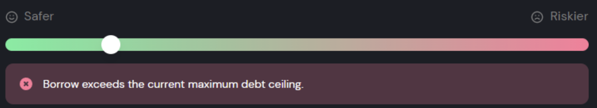

# Alavanque as suas criptomoedas na Fantom

## Introdução

A Mai Finance lançou a sua plataforma de empréstimos na Fantom com muitos tipos diferentes de vaults, permitindo a possibilidade de cunhar a stablecoin MAI dependendo dos ativos que você depositar no vault. A idéia é que você poderá manter suas criptomoedas e se beneficiar da sua apreciação de preço, enquanto pode comprar outras moedas e render em farming com altos APRs. Se você utilizar o seu empréstimo para comprar mais do mesmo ativo que você já depositou, isto chama-se alavancagem. Nós mostraremos os beneficios desta estratégia utilizando 2 plataformas de empréstimos diferentes na Fantom para alavancar nosso tokens DAI.

## Alavanque seus tokens em vaults

### Deposite seus ativos na Yearn Finance

[Yearn Finance](https://beta.yearn.finance/#/home) é um de protocolos rodando na Ethereum Mainnet e em outras blockchains, que permite aos seus usuários otimizar seus rendimentos através de empéstimos e trading. Na Fantom, o produto que nós utilizaremos serão os vaults na Yearn Finance. Esta é uma ferramenta que aceitará depósitos de únicos tokens e fará você colher rendimentos deste depósito. Como prova de depósito, você receberá yvToken. No nosso caso, nós depositaremos DAI e receberemos yvDAI em troca.


O website da Yearn Finance ainda está em sua versão beta na rede Fantom. O time ainda está trabalhando na plataforma e APRs/APYs ainda não são exibidos. Se você ir a aba Iron Bank, que é o protocolo de empréstimos da plataforma, você notará que emprestar DAI rende um APR de aproximadamente 8%. Por favor, invista a seu próprio risco.


### Deposite seu yvToken na Mai Finance

Após depositar seu DAI na Yearn Finance, você deverá obter yvDAI em sua carteira. Isto é o que nós chamamos de token comprovante de rendimento: é um token que não possui nenhum valor em si mesmo, mas representa a faria da pool em que seus ativos estão rendendo e em que recompensas são acumuladas automaticamente. Em outras palavras, se o seu DAI não alterar em valor pois ele é pareado ao dólar americano, o valor subjacente de seu token yvDAI só deve aumentar.

A Mai Finance aceita diversos tokens comprovantes de rendimentos como garantia, incluindo yvDAI. Agora, você pode depositar esse token como garantia e tomar emprestado MAI.

.png>)

O vault yvDAI possui um limite de liquidação em 110%, isso significa que você pode tomar MAI emprestado até o ponto que a razão entre o valor de sua garantia e o valor da dívida é de 110%. Tenha cuidado, pois 110% é o valor pelo qual você já é liquidado. Você precisa, portanto, manter uma proporção acima deste limite minimo. Como DAI não varia muito em preço (menos de centavos) é possivel mantermos uma CDR (**C**ollateral to **D**ebt **R**atio) "segura" de 115%, mas sinta-se livre para manter a taxa mais alta.

Como sempre, para calcular o valor do empréstimo que nós podemos obter baseado no valor de nossa garantia e a CDR alvo que queremos, nós usaremos a seguinte fórmula:

$$
MAI_{disponível} = \frac{Garantia_{valor} - Dívida_{valor} * CDR_{alvo}}{CDR_{alvo}}
$$

​Como uma garantia de $100 e nenhuma dívida, se nós queremos manter uma CDR saudável de 115%, nos podemos tomar emprestado até:

$$
MAI_{disponível}=\frac{100-0*1.15}{1.15}=86.95
$$

​Você está agora em uma posição onde você possui seu rendimentos em DAI de um vault, e você também tem um pouco da stablecoin MAI disponível para uso. Como nós queremos alavancar nossa posição em DAI, nós trocaremos nosso MAI por mais DAI.

### Trocando seu MAI na BeethovenX

Na Fantom, o principal provedor de liquidez para MAI é a [BeethovenX](https://app.beets.fi/#/trade). Este é o principal lugar para você trocar seus tokens MAI para mais DAI, para a nossa estratégia.

Esta é a última etapa de nosso loop. Agora que temos mais DAI, podemos depositá-lo no vault, e repetir o loop. Fazer isto aumenta a quantidade de ativos que temos no vault, o que significa que colheremos mais recompensas ao emprestar DAI naquela plataforma. O APR/APY continua o mesmo, mas como temos mais ativos, recebemos mais juros, e se compararmos ao nosso investimento inicial, é o o nosso APR que aumenta. Se você quer mais exemplos de que APR pode obter utilizando loops com yvDAI, por favor, leia nosso [guia de token camDAI](../../polygon-tutorials/camdai-beginner-strategy.md#main-strategy) para a Polygon, que utiliza a mesma estratégia, mas com ferramentas diferentes.


A BeethovenX é, de fato, uma oportunidade fantástica para obter rendimentos em farming com seu MAI emprestado. Simplesmente deposite seu MAI na pool MAI-DAI-USDC (APR de aproximadamente 30% em Novembro de 2021) se você não conseguir alcançar um APR melhor usando loops alavancados.


$$
MAI_
$$

## Alavanque os seus mooScreamTokens com a Mai Finance

### Deposite seus ativos na Beefy Finance

A [Beefy Finance](https://app.beefy.finance/#/fantom) é uma plataforma decentralizada, otimizadora de rendimentos multi-chain que permite a seus usuários receberem juros compostos pelos suas posiçōes em criptomoedas. Em outras palavras, você pode depositar alguns ativos ou LP tokens de outras plataformas na Beefy Finance, e irá colher tokens de farm automaticamente acumulados, podendo então acumulá-los em mais dos seus ativos/LP tokens depositados. Para o nosso exemplo, nós usaremos depósitos únicos em DAI na Beefy e usar a [Scream](https://scream.sh/lend) como plataforma subjacente. Scream é um fork da Compound na rede Fantom em que você pode emprestar os seus ativos e coletar tokens SCREAM. Beefy irá então vender os tokens SCREAM para comprar mais DAI.

Para depositar nosso DAI, nós iremos visitar o app da Beefy Finance e selecionar Scream como plataforma em que nós iremos realizar o farming. Você pode também adicionar o filtro DAI para obter o depósito direto de DAI.&#x20;

Como você pode ver, a Beefy já nos fornece um APY inacreditável em depósitos de DAI apenas. Após você ter depositado seu DAI na Beefy, você deve ter uma prova de depósito em sua carteira na forma de tokens mooScreamDAI. Assim como o token yvDAI, o token mooScreamDAI é um comprovante de rendimento, o que significa que seu ativo ainda está sendo utilizado na Scream e acumulado na Beefy, recebendo juros. Mas voce será capaz de utilizar este token como garantia na Mai Finance, para tomar emprestado MAI.

### Deposit seu mooScreamToken na Mai Finance

Após você ter depositado seu DAI na Yearn Finance, você deve ter mooScreamDAI em sua carteira. Você pode seguir as mesmas etapas da estratégia do vault acima, a única diferença é que a proporção de liquidação de mooScreamDAI é de 135%. Como DAI é uma stablecoin, ainda é possível tomar MAI emprestado e manter uma CDR bem próxima a proporção de liquidação. Para o nosso exemplo, nós iremos focar em uma taxa CDR de 140%, e utilizando a mesma fórmula de cima, nós podemos calcular a quantidade de MAI que podemos cunhar com 100$ de DAI.

$$
MAI_{disponível}=\frac{100-0*1.4}{1.4}=71.43
$$

​Como nós estamos tomando menos emprestado, nós poderemos realizar menos loops e o APY equivalente final será inferior, entretanto esta é ainda uma estratégia muito boa para iniciantes.

O resto do loop é o mesmo para yvDAI, o que significa que você deverá trocar seu MAI para DAI na BeethovenX e repetir até estar satisfeito.

## Algumas observaçōes sobre alavancagem

Alavancar DAI é considerada uma estratégia de iniciantes pois ela apresenta um risco bem baixo (por trabalhar com stablecoins) e você pode obter ótimos rendimentos utilizando no máximo 3 protocolos. Entretanto, ainda há certo risco.

### Risco de liquidação

Quanto mais loops você realizar, mais alto será o risco de liquidação. De fato, até mesmo uma pequena variação de preço da DAI será ampliada pela alavancagem que você aplicar, e mesmo que você mantenha uma CDR 5 pontos acima da taxa de liquidação, seu vault ainda pode estar em risco. É sempre uma boa ideia parar com os loops na etapa em que você deposita seus ativos na Mai Finance, e não tomar mais MAI emprestado para manter uma boa taxa CDR.

Além disso, em caso de liquidação, como o seu vault na Mai Finance contém muitos outros ativos, o impacto será maior do que se você não tivesse alavancado, simplesmente porque a dívida a ser paga será, também, muito maior.

### Risco da tecnologia

Se você usa varios protocolos para o seu LEGO de investimentos, você precisa ter certeza que estes protocolos são seguros. De fato, em nossa estratégia de alavancagem, se um único protocolo for hackeado, toda a estratégia pode entrar em colapso. Tenha certeza que você analisou tudo antes de investir em projetos DeFi.

### Alcançado o teto de dívida

Como estas estratégias são fáceis de configurar e apresentam baixo risco, há muita demanda por elas. Entretando, você certamente notou que no processo de alavancagem, MAI emprestado é trocado por DAI (ou outros tokens). Se muito MAI é vendido na Beethoven, o seu preço irá diminuir lentamente é há o risco da MAI perder a sua fixação, o que seria terrível para uma stablecoin. Para criar tempo suficiente para a moeda estabilizar, a Mai Finance possui mecanismos de segurança, dos quais o mais importante é o teto de dívida de cada vault.&#x20;

O teto de dívida representa o número máximo de MAI que pode ser cunhado em um vault. A partir do momento em que o teto for atingido, torna-se impossível cunhar mais MAI. Então, o time principal responsável pela Mai Finance pode decidir se aumenta o teto, ou se espera mais por um preço melhor de MAI.

Você pode, a qualquer momento, verificar a quantidade de MAI que pode ser cunhado na [página de criação de vault](https://app.mai.finance/vaults/create), mas você geralmente notará que não há mais MAI disponível quando aparecer a seguinte mensagem de erro:

Esta mensagem de erro aparecerá mesmo que o teu "fator de saude" esteja correto. Na maioria dos casos, esperar que o teto aumente é a única solução. Esteja atento ao Twitter ou ao Discord quando isso acontecer.

## Aviso legal

Este guia apresentou algumas das maneiras que você pode utilizar seus ativos na rede Fantom e como incluir a Mai Finance em sua estratégia para aumentar seus ganhos. Entretanto, como sempre, este tutorial não representa conselho financeiro e você deve sempre fazer a sua própria pesquisa antes de executar uma estratégia de investimento, e investir apenas de forma responsável.

Tenha em mente que esta solução pode não ser a melhor estratégia dependendo de quando planejar usá-la. Nós acabamos de mostrar que a BeethovenX possui também APRs interessantíssimos para o seu MAI, e você também pode usar a Beefy Finance para acumular as recompensas BEETS em mais stablecoins.


Tenha em mente que uma estratégia que funciona bem em um periodo de tempo pode performar mal (ou te fazer perder dinheiro) em outro período. Por favor, se informe, monitore os mercados, mantenha um olho em seus investimentos, e como sempre, faça a sua própria pesquisa.

