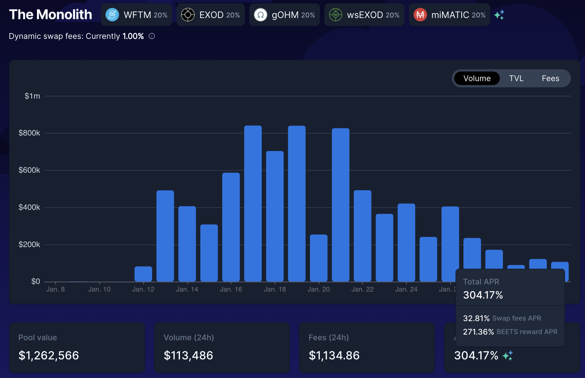
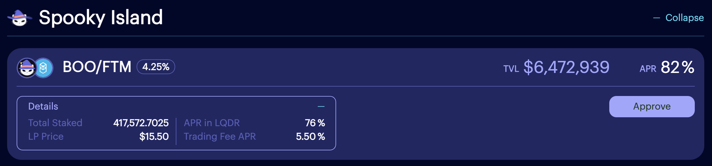

# Uma sinfonia assustadora

## Introdução

Tomar um empréstimo contra seus ativos é sempre uma faca de dois gumes: pode ajudá-lo a iniciar uma estratégia de investimento ou alavancar seus ativos, mas você terá uma dívida que precisará pagar em algum momento. Neste guia, usaremos um empréstimo obtido no Market.XYZ, um protocolo de empréstimo no qual você poderá tomar MAI emprestado com uma baixa taxa de empréstimo e usar esse empréstimo para farming na maioria dos protocolos "testados em batalha" na Fantom. Usaremos a estratégia para reembolsar o empréstimo e ver com que rapidez isso pode ser feito para desbloquear os ativos depositados como garantia.


Este guia não é conselho financeiro, foi feito com objetivo educacional em mente. Você precisa ficar atento às variações de preços, oferta e demanda, programas de recompensas, datas de término, perdas impermanentes, etc. O objetivo não era propor receitas que possam ser seguidas às cegas, então faça sua lição de casa e sua própria simulação, e só invista o que você está disposto a perder.


## Protocolos Fantom: Tenho que usar todos eles

Nesta estratégia, usaremos muitos pares LP (**L**iquidity **P**roviding, ou Fornecimento de Liquidez) em vários protocolos diferentes, por isso achamos que seria uma boa ideia fornecer uma breve recapitulação do que cada protocolo está fazendo.

### Market.XYZ

[Market.XYZ](https://fantom.market.xyz/) é um protocolo de empréstimo que disponibiliza lockers (armários) para seus parceiros. Você poderá depositar ativos únicos ou tokens LP como garantia e tomar emprestado outros ativos contra seus depósitos. Como você está tomando emprestado contra uma garantia, é importante garantir que você não seja liquidado. A liquidação ocorre quando o valor do bem que você depositou como garantia fica abaixo do valor do empréstimo que você contratou. É por isso que é importante garantir que a relação entre os 2 valores permaneça relativamente alta e que sua garantia não perca muito valor quando o mercado cair.

Para mitigar o risco de liquidação, usaremos o token LP FTM-USDC como garantia:

* A perda impermanente neste par é relativamente baixa
* USDC é uma stablecoin atrelada ao dólar americano
* FTM é o token de gás nativo da Fantom, tem grande liquidez e é usado em todos os lugares
* As taxas de recompensa no par FTM-USDC são altas, o que significa que, mesmo que o preço do FTM permaneça o mesmo, o valor de sua garantia aumentará

Você poderá tomar emprestado o par FTM-USDC da [Spooky LP Pool ](https://fantom.market.xyz/pool/10)no Market.xyz. As etapas para depositar sua garantia são as seguintes:

* Crie [tokens LP FTM-USDC na SpookySwap](https://spookyswap.finance/add/FTM/0x04068DA6C83AFCFA0e13ba15A6696662335D5B75) fornecendo liquidez em uma proporção de 1:1 para ambos os ativos
* Deposite o token LP FTM-USDC na Beefy finance para obter um recibo mooBooFTM-USDC (procure a plataforma SpookySwap e o ativo USDC nos filtros de pesquisa)
* Deposite o token de recibo mooBooFTM-USDC no Market.xyz

Quando seus tokens LP de recibo da Beefy estão no Market.XYZ, você ainda recebe o APY de recompensa fornecido pela Beefy. Isso significa que seus ativos ainda estão gerando rendimentos para você enquanto você os usa como garantia. Esta é uma ferramenta muito poderosa, especialmente quando você vê que mSPLP-FTM-USDC (moo Spookyswap FTM-USDC = mooBooFTM-USDC) aproveita de um APY de 51,4% e que você pode tomar emprestado MAI a um APR de 2,56%. Em outras palavras, sua garantia cresce mais rápido que sua dívida, então, em teoria, você pode muito bem pagar seu empréstimo com os juros de sua garantia.


Como uma observação, você pode ver que o locker Spooky LP Pool também oferece a possibilidade de empréstimo de outros tokens LP: ETH-FMT, DAI-FTM, BTC-FTM e fUSDT-FTM. Dependendo dos ativos que você tem em sua carteira, suas convicções e sua tolerância ao risco, você pode usar totalmente qualquer Spookyswap LP como garantia.


Para este tutorial, também limitaremos o risco tomando empréstimos com uma CDR (Colateral to Debt Ratio, ou Proporção de Garantia para Dívida) de 200%. Isso significa que tomaremos emprestado 50% do valor de nossa garantia (mais informaçōes na seção de estratégia de farming). Os índices de liquidação são expressos como LTV (Loan to Value, Empréstimo para Valor), que é o oposto da CDR. Você pode ver que a LTV para o token mooBooFTM-USDC é de 60%, acima do qual você será liquidado. Isso equivale a um CDR de 166,67%. Com uma meta de uma CDR de 200%, estamos 33% acima do índice de liquidação, que pode ser arriscado ou não, dependendo da sua tolerância ao risco.


Market.XYZ só permite empréstimos com um valor mínimo de 0,05 ETH (\~$170,00 no momento da escrita). Certifique-se de depositar garantias suficientes se quiser pedir emprestado dos diferentes lockers.


### BeethovenX

[BeethovenX](https://beets.fi/#/) é uma corretora descentralizada e um agente de mercado automatizado, um fork da Balancer. Você poderá depositar seus ativos em pools de liquidez, bem como trocar diferentes ativos em seu aplicativo. Eles têm sido parceiros sólidos do protocolo QiDAO, fornecendo tokens LP para as farms que você pode encontrar na Mai Finance. Usaremos duas pools diferentes na BeethovenX para esta estratégia:

* The Monolith: uma pool incentivada que foi aberta para o Exodia, um OHM-fork que foi [apresentado neste tutorial](investing-in-discounted-assets-using-bonds.md). Você poderá depositar seus tokens MAI diretamente nesta pool e coletar rendimentos.
* Pirate Party: uma pool incentivada dedicada a tokens LQDR, o token nativo da Liquid Driver, outro grande protocolo que usaremos neste guia.

Como sempre, a maior vantagem de usar a BeethovenX (ou Balancer) é que você pode depositar ativos únicos nas pools em vez de ter que fornecer tokens em uma proporção equilibrada.

### SpookySwap

[Spookyswap](https://spookyswap.finance/) é o maior fork da Uniswap V2 na Fantom, uma plataforma onde você poderá trocar ativos e fornecer liquidez para muitos pares. Spookyswap também tem sido um parceiro sólido da Mai Finance e disponibiliza uma pool MAI-USDC. A parceria se estendeu via Market.XYZ, onde você poderá tomar MAI emprestado contra alguns pares LP específicos (consulte a seção sobre Market.xyz), bem como seus tokens BOO e BOO em staking, o token nativo da Spookswap.

Para este guia, usaremos dois tokens LP diferentes da SpookySwap:

* FTM-USDC que será usado como ponto de partida para a estratégia. Este token LP é usado como garantia no Market.xyz
* FTM-BOO porque é uma das pools da SpookySwap aceitas na Liquid Driver com o maior APR. Trocaremos as recompensas BEETS da The Monolith por este par (mais informaçōes na seção estratégia de farming)

### Liquid Driver

[Liquid Driver](https://www.liquiddriver.finance/) é um otimizador de rendimento no qual você poderá depositar tokens LP de diferentes farms e obter rendimentos neles. A maneira como o otimizador funciona é coletando os tokens de recompensa da plataforma de destino e reacumulando-os para você. Isso é útil, pois o gas no Fantom pode ser caro. Uma taxa de desempenho é cobrada, mas uma parte da receita do protocolo é redistribuída para os stakers LQDR. LQDR é o token nativo do Liquid Driver.

Para esta estratégia, usaremos o par LP FTM-BOO porque é uma pool com um das maiores APRs em LQDR para Spookyswap.

## Estratégia de farming

Para esta estratégia, usaremos Market.XYZ como nosso ponto de partida para tomar emprestado MAI contra os tokens LP mooBooFTM-USDC. O MAI emprestado será depositado na BeethovenX na pool The Monolith. Como esta é a pool com a maior taxa de recompensa em nossa estratégia, vamos usá-lo como nosso motor para pagar nossa dívida: 50% dos BEETS serão vendidos para pagar a dívida no Market.xyz e 50% serão convertidos em Tokens LP FTM-BOO. Os tokens FTM-BOO serão depositados na LiquidDriver para coletar tokens LQDR que serão então colocados em staking na pool Pirate Party na BeethovenX. Assim que a dívida for totalmente paga, as recompensas BEETS serão totalmente convertidas em tokens FTM-BOO. As recompensas BEETS fornecidas pela pool Pirate Party também serão reacumuladas em mais FTM-BOO.

Para esta simulação, usaremos os seguintes números:

* Começamos com um valor de $1.000 em tokens mooBooFTM-USDC
* O APR para o token mooBooFTM-USDC fornecido pela SpookySwap via Beefy é de 41,5%
* A taxa de empréstimo para MAI é de 2,56%
* BeethovenX dá um APR de 304,17% para The Monolith e 175,77% para o Pirate Party
* LiquidDriver dá um APR de 82% no par FTM-BOO LP

Como de costume para nossas simulações, assumimos que todos os preços permanecem os mesmos por todo o período de 1 ano, as taxas permanecem as mesmas e também usamos os APRs fornecidos. Na realidade, os preços e as taxas variam, e os APRs são compostos por taxas de negociação e tokens de recompensa, o que pode afetar o resultado final. Também é importante notar que **nenhuma taxa de transação** é considerada para esta simulação. Por fim, estamos usando muitos protocolos e cada protocolo pode apresentar riscos de contrato inteligente. Certifique-se de fazer suas próprias pesquisas antes de usar uma plataforma e invista apenas o que você está disposto a perder.

Você pode encontrar nossa simulação Spooky Symfony [nesta planilha](https://docs.google.com/spreadsheets/d/19s6kBnT5w0b9GKuTkDiiD1u\_ZoeNUZtI9XYxEmk\_WM0/edit?usp=sharing). Sinta-se à vontade para copiá-la e brincar com ela para ver como o loop funciona e como as diferentes taxas podem afetar seu APY final.

### 1º Dia

No primeiro dia, você precisa criar sua garantia para o Market.xyz. Obtenha uma porção igual de FTM e USDC e forneça liquidez na SpookySwap para criar tokens LP FTM-USDC. Esses tokens serão depositados no Beefy, que lhe dará o token de recibo mooBooFTM-USDC. Este é o token que será usado como garantia no Market.xyz e contra o qual você tomar emprestado MAI. Como queremos manter uma CDR de 200%, tomaremos emprestado $500 em MAI. Finalmente, os tokens MAI serão colocado em staking na BeethovenX na pool The Monolith.

Ao final do primeiro dia, você terá:

| Posição           | Valor ($) |
| ----------------- | --------- |
| mooBooFTM-USDC    | 1,000.000 |
| The Monolith      | 500.000   |
| Pirate Party      | 0.000     |
| Recompensas BEETS | 4.167     |
| FTM-BOO           | 0.000     |
| Recompensas LQDR  | 0.000     |
| Dívida em MAI     | 500.000   |

### 2º Dia

No segundo dia, você teria:

* venda 50% de seu BEETS para MAI para reembolsar uma pequena fração do seu empréstimo&#x20;
* troque suas recompensas BEETS pelo par LP FTM-BOO. Você pode trocar na BeethovenX e criar o par LP na SpookySwap, ou fazer tudo na SpookySwap.&#x20;
* faça staking com o LP FTM-BOO na Liquid Driver para começar a coletar tokens LQDR.

No final do segundo dia, você terá:

| Posição           | Valor ($) |
| ----------------- | --------- |
| mooBooFTM-USDC    | 1,001.137 |
| The Monolith      | 500.000   |
| Pirate Party      | 0.000     |
| Recompensas BEETS | 4.167     |
| FTM-BOO           | 2.083     |
| Recompensas LQDR  | 0.005     |
| Dívida em MAI     | 497.952   |

### 3º Dia

Repita a operação do segundo dia e colete seus primeiros tokens LQDR. Estes serão depositados na BeethovenX na pool Pirate Party para obter recompensas extras BEETS, e no final do terceiro dia você terá:

| Posição           | Valor ($) |
| ----------------- | --------- |
| mooBooFTM-USDC    | 1,002.275 |
| The Monolith      | 500.000   |
| Pirate Party      | 0.005     |
| Recompensas BEETS | 4.167     |
| FTM-BOO           | 4.167     |
| Recompensas LQDR  | 0.000     |
| Dívida em MAI     | 495.903   |


Os ganhos da pool Pirate Party são muito pequenos para serem significativos neste momento, mas isso mudará com o tempo.


### Rotina diária

Neste ponto, o sistema está totalmente preparado. Sua rotina diária consistirá em:

* colher recompensas BEETS da The Monolith
* colher recompensas BEETS da Pirate Party
* trocar 50% dos BEETS por MAI se você ainda possuir dívida por pagar
* reembolsar uma porção de sua dívida se necessário
* troque o resto dos BEETS por tokens LP FTM-BOO
* depositar os FTM-BOO na LiquidDriver
* colher LQDR
* depositar na Pirate Party

Essa estratégia não é muito eficiente em termos de gas, então você pode considerar aumentar seus ganhos apenas uma vez por semana, ou até com menos frequência.

### Resultados brutos mensais

Aqui podemos ver os resultados brutos mensais, assim como são exibidos na planilha da Google vinculada acima.

| Dia | FTM-USDC  | The Monolith | Pirate Party | FTM-BOO   | Dívida em MAI |
| --- | --------- | ------------ | ------------ | --------- | ------------- |
| 30  | 1,033.503 | 500.000      | 1.901        | 60.500    | 440.541       |
| 60  | 1,069.343 | 500.000      | 8.031        | 123.652   | 378.905       |
| 90  | 1,106.425 | 500.000      | 18.452       | 187.988   | 317.139       |
| 120 | 1,144.794 | 500.000      | 33.265       | 254.136   | 255.242       |
| 150 | 1,184.493 | 500.000      | 52.612       | 322.738   | 193.216       |
| 180 | 1,225.569 | 500.000      | 76.681       | 394.462   | 131.058       |
| 210 | 1,268.069 | 500.000      | 105.704      | 470.006   | 68.770        |
| 240 | 1,312.043 | 500.000      | 139.963      | 550.105   | 6.351         |
| 270 | 1,357.542 | 500.000      | 181.427      | 691.752   | 0.000         |
| 300 | 1,404.619 | 500.000      | 233.046      | 846.443   | 0.000         |
| 330 | 1,453.328 | 500.000      | 295.350      | 1,009.331 | 0.000         |
| 360 | 1,503.726 | 500.000      | 368.942      | 1,182.000 | 0.000         |

### 365º Dia

Ao final de um ano inteiro cultivando este sistema, você teria:

* $1,512.294 em tokens FTM-USDC na Market.xyz
* $500.000 em MAI na pool The Monolith
* $382.353 em LQDR armazenados na pool Pirate Party
* $1.211.845 em tokens FTM-BOO na Market.xyz
* uma dívida final que é totalmente reembolsada após o dia #243

Isso equivale a um APY total de 260,65%.

### Efeito do reembolso da dívida no resultado total

Na maioria dos nossos guias, não reembolsamos nossa dívida como parte da estratégia. Isso se deve, na maioria dos casos, ao fato de estarmos usando um empréstimo com juros de 0% feito na Mai Finance. Aqui, estamos tomando emprestado da Market.XYZ com uma taxa de empréstimo de 2,56% e pagamos a dívida com 50% das BEETTS colhidas da The Monolith.

Se você alocar mais de 50% para o reembolso da dívida, pagará menos juros, mas aumentará suas posições muito mais lentamente na Liquid Driver. Se você alocar menos de 50% para o reembolso da dívida, receberá mais recompensas das outras plataformas, mas também pagará mais juros na Market.xyz.

Aqui está uma pequena tabela que indica o efeito dos BEETTS alocados para o reembolso da sua dívida em seu APY geral:

| BEETS % | APY geral | Dívida reembolsada após |
| ------- | --------- | ----------------------- |
| 100     | 242.85    | 122 days                |
| 90      | 245.06    | 135 days                |
| 80      | 247.75    | 152 days                |
| 70      | 251.05    | 174 days                |
| 60      | 255.23    | 203 days                |
| 50      | 260.65    | 244 days                |
| 40      | 267.92    | 305 days                |
| 33.5    | 274.09    | 364 days                |

Se você usar menos de 33,5% de suas recompensas BEETS para pagar sua dívida, ainda terá MAI para reembolsar após um ano completo.&#x20;

Também é bom entender que se você paga mais rápido, você também aumenta sua CDR de forma mais significativa, o que permite que você se afastar do índice de liquidação mais rapidamente.

## Variações a considerar

Esta estratégia apresenta muitas variações que apresentam diferentes benefícios.

### Mai Finance vs Market.xyz

Você pode tomar MAI emprestado da [Mai Finance](https://app.mai.finance) a 0% de juros. Por exemplo, se você usar mooScreamFTM em vez de mooBooFTM-USDC como garantia, isso apresentará as seguintes vantagens:

* Você não tem perdas temporárias em sua garantia
* Você empresta a 0% com uma única taxa de reembolso de 0,5%, que será, na maioria dos casos, muito menor do que os juros que você pagará na Market.xyz (se houver MAI para tomar emprestado deste vault)&#x20;
* Você pode obter recompensas Qi por tomar emprestado na plataforma, o que permitirá que você participe da governança do protocolo, além de receber dividendos ao fazer staking com seus tokens Qi. Isso aumentará seus ganhos anuais.
* Você está protegido contra taxas de empréstimo muito flutuantes na Market.xyz. A Mai Finance emprestará novo MAI regularmente para manter as taxas de empréstimo o mais baixas possível, mas não é uma garantia de que não suba. Você pode verificar métricas para o mercado de empréstimos [aqui](https://metrics.market.xyz/d/HChNahwGk/fuse-pool-details?orgId=1\&refresh=10s\&var-poolID=10\&var-chain=250).

No entanto, os tokens mooScreamFTM obtêm um APY muito menor em comparação com os tokens mooBooFTM-USDC, então você tem isso a perder.

### Staking com LQDR

Se você realizar staking com seu LQDR em vez de usá-lo na pool Pirate Party, você ganhará alguns dividendos da Liquid Driver que são pagos em diferentes ativos (LQDR, WFTM, LINSPIRIT, BOO, SPELL e BEETS). Você também receberá xLQDR que permitirá que você participe da governança da Liquid Driver e possivelmente LINSPIRIT para votar na alocação de recompensas no Spirit Swap. Por favor, verifique a página [xLQDR](https://www.liquiddriver.finance/xlqdr) cuidadosamente para obter mais detalhes.

### Staking com BEETS

Se os BEETS da The Monolith têm um papel importante nessa estratégia, você também pode usar os da Pirate Party da seguinte forma:

* deposite BEETS na pool Fidelio Duetto (BEETS-FTM)
* faça staking com o LP token na BeethovenX para receber fBEETS
* faça staking com seu fBEETS para obter dividendos do protocolo

Isso também permitirá que você vote nas melhorias do protocolo BeethovenX, bem como na alocação de recompensas para os diferentes pools da plataforma. Isso é particularmente útil para manter um APR alto na The Monolith.

### Use a pool FTM-BEETS na Spookyswap

Em nossa estratégia, vendemos todas as recompensas BEETS da The Monolith. No entanto, você também pode integrar a pool FTM-BEETS da Spookyswap em seu loop. Você teria que vender 50% de seus BEETS para FTM e combinar os dois tokens em um novo par LP que lhe renderia BOO. Você pode então decidir criar o FTM-BOO e depositar na Liquid Driver ou fazer staking com seu BOO na SpookySwap. Observe que, se você fizer staking com seu BOO, terá a possibilidade de depositar os tokens de recibo xBOO e ganhar tokens LQDR diretamente, e ainda poderá usar os tokens xBOO como garantia na Market.xyz. Este bloco de lego adicional abre muitas possibilidades.


Fique de olho neste par em particular caso ele esteja disponível na Liquid Driver. Esta pode ser uma opção melhor do que o FMT-BOO.


### Use seu FTM-USDC na Liquid Driver

Depois que seu empréstimo for totalmente reembolsado, você poderá manter os tokens mooBooFTM-USDC na Market.xyz ou na Beefy, eles continuarão acumulando recompensas. No entanto, você também pode remover o par LPs da Beefy e depositá-lo na Liquid Driver para obter mais LQDR.

Como uma observação, enquanto você está pagando seu empréstimo, o valor de sua CDR aumenta (A garantia é composta de recompensas reacumuladas e cresce em valor enquanto a dívida diminuí após cada reembolso parcial). Isso significa que você pode retirar a garantia peça por peça para manter uma CDR segura e depositá-las na Liquid Driver para obter mais tokens LQDR.

### Mantenha um pequeno vazamento de lucro

Este sistema é um loop fechado que se autoalimenta. No entanto, você pode muito bem continuar vendendo partes de seu BEETS por outros ativos depois de terminar de pagar seu empréstimo no Market.xyz. Como exemplo, você pode converter suas recompensas BEETS em USDC ou outra stablecoin, ou aumentar uma de suas posições que ganhe mais recompensas do que as concedidas para o par FTM-USDC.

## Aviso legal

Este guia foi projetado principalmente para mostrar a maneira como você pode reembolsar uma dívida usando rendimentos de farming. A velocidade com que você reembolsa sua dívida influenciará muito a taxa de recompensa total, mas também apresenta alguns aspectos muito positivos, sendo o principal deles a redução do risco de liquidação.

Claro, você pode facilmente cortar custos com esta estratégia, trocar pedaços do loop por outros, substituir protocolos por algo que você prefira, etc... No entanto, certifique-se de ler toda a documentação disponível para os protocolos que deseja usar e certifique-se de entender todos os diferentes riscos.


Este guia definitivamente não é conselho financeiro, e foi feito com objetivo educacional em mente. Você precisa ficar atento às variações de preços, oferta e demanda, programas de recompensas, datas de término, perdas impermanentes, etc. O objetivo não é propor receitas que possam ser seguidas às cegas, então faça sua lição de casa e sua própria simulação, e só invista o que você está disposto a perder.

