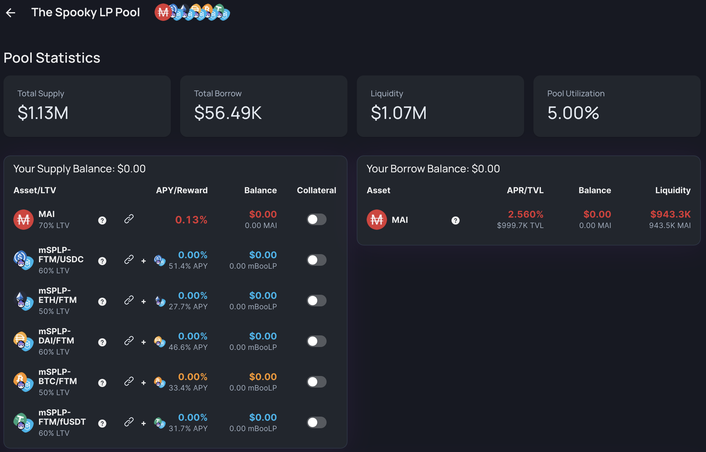
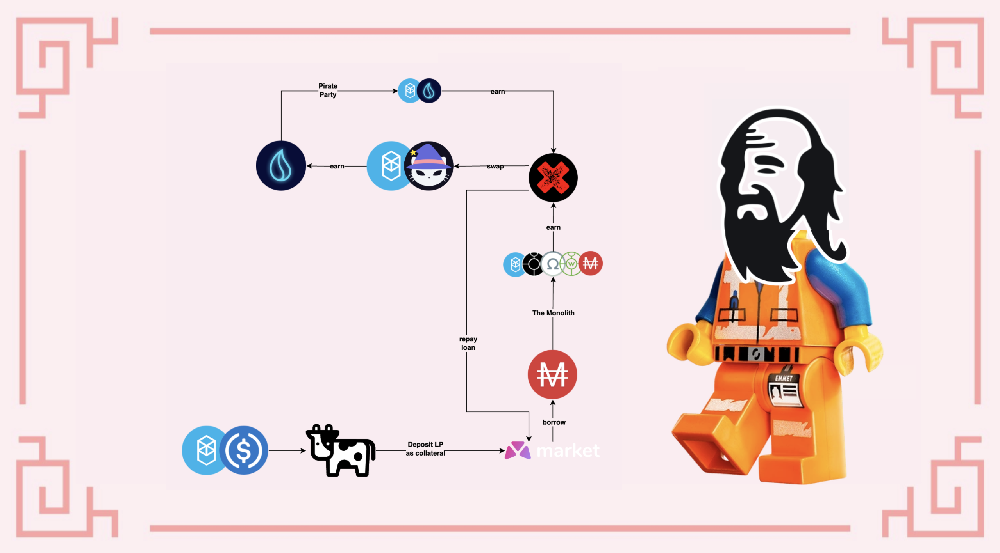

# Uma sinfonia assustadora

## Introdução

Tomar um empréstimo contra seus ativos é sempre uma faca de dois gumes: pode ajudá-lo a iniciar uma estratégia de investimento ou alavancar seus ativos, mas você terá uma dívida que precisará pagar em algum momento. Neste guia, usaremos um empréstimo obtido no Market.XYZ, um protocolo de empréstimo no qual você poderá tomar MAI emprestado com uma baixa taxa de empréstimo e usar esse empréstimo para farming na maioria dos protocolos "testados em batalha" na Fantom. Usaremos a estratégia para reembolsar o empréstimo e ver com que rapidez isso pode ser feito para desbloquear os ativos depositados como garantia.


Este guia não é conselho financeiro, foi feito com objetivo educacional em mente. Você precisa ficar atento às variações de preços, oferta e demanda, programas de recompensas, datas de término, perdas impermanentes, etc. O objetivo não era propor receitas que possam ser seguidas às cegas, então faça sua lição de casa e sua própria simulação, e só invista o que você está disposto a perder.


## Protocolos Fantom: Tenho que usar todos eles

Nesta estratégia, usaremos muitos pares LP (**L**iquidity **P**roviding, ou Fornecimento de Liquidez) em vários protocolos diferentes, por isso achamos que seria uma boa ideia fornecer uma breve recapitulação do que cada protocolo está fazendo.

### Market.XYZ

[Market.XYZ](https://fantom.market.xyz) é um protocolo de empréstimo que disponibiliza lockers (armários) para seus parceiros. Você poderá depositar ativos únicos ou tokens LP como garantia e tomar emprestado outros ativos contra seus depósitos. Como você está tomando emprestado contra uma garantia, é importante garantir que você não seja liquidado. A liquidação ocorre quando o valor do bem que você depositou como garantia fica abaixo do valor do empréstimo que você contratou. É por isso que é importante garantir que a relação entre os 2 valores permaneça relativamente alta e que sua garantia não perca muito valor quando o mercado cair.

Para mitigar o risco de liquidação, usaremos o token LP FTM-USDC como garantia:

* A perda impermanente neste par é relativamente baixa
* USDC é uma stablecoin atrelada ao dólar americano
* FTM é o token de gás nativo da Fantom, tem grande liquidez e é usado em todos os lugares
* As taxas de recompensa no par FTM-USDC são altas, o que significa que, mesmo que o preço do FTM permaneça o mesmo, o valor de sua garantia aumentará

Você poderá tomar emprestado o par FTM-USDC da [Spooky LP Pool ](https://fantom.market.xyz/pool/10)no Market.xyz. As etapas para depositar sua garantia são as seguintes:

* Crie [tokens LP FTM-USDC na SpookySwap](https://spookyswap.finance/add/FTM/0x04068DA6C83AFCFA0e13ba15A6696662335D5B75) fornecendo liquidez em uma proporção de 1:1 para ambos os ativos
* Deposite o token LP FTM-USDC na Beefy finance para obter um recibo mooBooFTM-USDC (procure a plataforma SpookySwap e o ativo USDC nos filtros de pesquisa)
* Deposite o token de recibo mooBooFTM-USDC no Market.xyz

Quando seus tokens LP de recibo da Beefy estão no Market.XYZ, você ainda recebe o APY de recompensa fornecido pela Beefy. Isso significa que seus ativos ainda estão gerando rendimentos para você enquanto você os usa como garantia. Esta é uma ferramenta muito poderosa, especialmente quando você vê que mSPLP-FTM-USDC (moo Spookyswap FTM-USDC = mooBooFTM-USDC) aproveita de um APY de 51,4% e que você pode tomar emprestado MAI a um APR de 2,56%. Em outras palavras, sua garantia cresce mais rápido que sua dívida, então, em teoria, você pode muito bem pagar seu empréstimo com os juros de sua garantia.


Como uma observação, você pode ver que o locker Spooky LP Pool também oferece a possibilidade de empréstimo de outros tokens LP: ETH-FMT, DAI-FTM, BTC-FTM e fUSDT-FTM. Dependendo dos ativos que você tem em sua carteira, suas convicções e sua tolerância ao risco, você pode usar totalmente qualquer Spookyswap LP como garantia.


Para este tutorial, também limitaremos o risco tomando empréstimos com uma CDR (Colateral to Debt Ratio, ou Proporção de Garantia para Dívida) de 200%. Isso significa que tomaremos emprestado 50% do valor de nossa garantia (mais informaçōes na seção de estratégia de farming). Os índices de liquidação são expressos como LTV (Loan to Value, Empréstimo para Valor), que é o oposto da CDR. Você pode ver que a LTV para o token mooBooFTM-USDC é de 60%, acima do qual você será liquidado. Isso equivale a um CDR de 166,67%. Com uma meta de uma CDR de 200%, estamos 33% acima do índice de liquidação, que pode ser arriscado ou não, dependendo da sua tolerância ao risco.


Market.XYZ só permite empréstimos com um valor mínimo de 0,05 ETH (\~$170,00 no momento da escrita). Certifique-se de depositar garantias suficientes se quiser pedir emprestado dos diferentes lockers.


### BeethovenX

[BeethovenX](https://beets.fi/#/) é uma corretora descentralizada e um agente de mercado automatizado, um fork da Balancer. Você poderá depositar seus ativos em pools de liquidez, bem como trocar diferentes ativos em seu aplicativo. Eles têm sido parceiros sólidos do protocolo QiDAO, fornecendo tokens LP para as farms que você pode encontrar na Mai Finance. Usaremos duas pools diferentes na BeethovenX para esta estratégia:

* The Monolith: uma pool incentivada que foi aberta para o Exodia, um OHM-fork que foi [apresentado neste tutorial](investing-in-discounted-assets-using-bonds.md). Você poderá depositar seus tokens MAI diretamente nesta pool e coletar rendimentos.
* Pirate Party: uma pool incentivada dedicada a tokens LQDR, o token nativo da Liquid Driver, outro grande protocolo que usaremos neste guia.

Como sempre, a maior vantagem de usar a BeethovenX (ou Balancer) é que você pode depositar ativos únicos nas pools em vez de ter que fornecer tokens em uma proporção equilibrada.

### SpookySwap

[Spookyswap](https://spookyswap.finance) é o maior fork da Uniswap V2 na Fantom, uma plataforma onde você poderá trocar ativos e fornecer liquidez para muitos pares. Spookyswap também tem sido um parceiro sólido da Mai Finance e disponibiliza uma pool MAI-USDC. A parceria se estendeu via Market.XYZ, onde você poderá tomar MAI emprestado contra alguns pares LP específicos (consulte a seção sobre Market.xyz), bem como seus tokens BOO e BOO em staking, o token nativo da Spookswap.

Para este guia, usaremos dois tokens LP diferentes da SpookySwap:

* FTM-USDC que será usado como ponto de partida para a estratégia. Este token LP é usado como garantia no Market.xyz
* FTM-BOO porque é uma das pools da SpookySwap aceitas na Liquid Driver com o maior APR. Trocaremos as recompensas BEETS da The Monolith por este par (mais informaçōes na seção estratégia de farming)

### Liquid Driver

[Liquid Driver](https://www.liquiddriver.finance) é um otimizador de rendimento no qual você poderá depositar tokens LP de diferentes farms e obter rendimentos neles. A maneira como o otimizador funciona é coletando os tokens de recompensa da plataforma de destino e reacumulando-os para você. Isso é útil, pois o gas no Fantom pode ser caro. Uma taxa de desempenho é cobrada, mas uma parte da receita do protocolo é redistribuída para os stakers LQDR. LQDR é o token nativo do Liquid Driver.

Para esta estratégia, usaremos o par LP FTM-BOO porque é uma pool com um das maiores APRs em LQDR para Spookyswap.

## Estratégia de farming

Para esta estratégia, usaremos Market.XYZ como nosso ponto de partida para tomar emprestado MAI contra os tokens LP mooBooFTM-USDC. O MAI emprestado será depositado na BeethovenX na pool The Monolith. Como esta é a pool com a maior taxa de recompensa em nossa estratégia, vamos usá-lo como nosso motor para pagar nossa dívida: 50% dos BEETS serão vendidos para pagar a dívida no Market.xyz e 50% serão convertidos em Tokens LP FTM-BOO. Os tokens FTM-BOO serão depositados na LiquidDriver para coletar tokens LQDR que serão então colocados em staking na pool Pirate Party na BeethovenX. Assim que a dívida for totalmente paga, as recompensas BEETS serão totalmente convertidas em tokens FTM-BOO. As recompensas BEETS fornecidas pela pool Pirate Party também serão reacumuladas em mais FTM-BOO.

Para esta simulação, usaremos os seguintes números:

* Começamos com um valor de $1.000 em tokens mooBooFTM-USDC
* O APR para o token mooBooFTM-USDC fornecido pela SpookySwap via Beefy é de 41,5%
* A taxa de empréstimo para MAI é de 2,56%
* BeethovenX dá um APR de 304,17% para The Monolith e 175,77% para o Pirate Party
* LiquidDriver dá um APR de 82% no par FTM-BOO LP

Como de costume para nossas simulações, assumimos que todos os preços permanecem os mesmos por todo o período de 1 ano, as taxas permanecem as mesmas e também usamos os APRs fornecidos. Na realidade, os preços e as taxas variam, e os APRs são compostos por taxas de negociação e tokens de recompensa, o que pode afetar o resultado final. Também é importante notar que **nenhuma taxa de transação** é considerada para esta simulação. Por fim, estamos usando muitos protocolos e cada protocolo pode apresentar riscos de contrato inteligente. Certifique-se de fazer suas próprias pesquisas antes de usar uma plataforma e invista apenas o que você está disposto a perder.

Você pode encontrar nossa simulação Spooky Symfony [nesta planilha](https://docs.google.com/spreadsheets/d/19s6kBnT5w0b9GKuTkDiiD1u\_ZoeNUZtI9XYxEmk\_WM0/edit?usp=sharing). Sinta-se à vontade para copiá-la e brincar com ela para ver como o loop funciona e como as diferentes taxas podem afetar seu APY final.

### 1º Dia

No primeiro dia, você precisa criar sua garantia para o Market.xyz. Obtenha uma porção igual de FTM e USDC e forneça liquidez na SpookySwap para criar tokens LP FTM-USDC. Esses tokens serão depositados no Beefy, que lhe dará o token de recibo mooBooFTM-USDC. Este é o token que será usado como garantia no Market.xyz e contra o qual você tomar emprestado MAI. Como queremos manter uma CDR de 200%, tomaremos emprestado $500 em MAI. Finalmente, os tokens MAI serão colocado em staking na BeethovenX na pool The Monolith.

Ao final do primeiro dia, você terá:

| Posição           | Valor ($) |
| ----------------- | --------- |
| mooBooFTM-USDC    | 1,000.000 |
| The Monolith      | 500.000   |
| Pirate Party      | 0.000     |
| Recompensas BEETS | 4.167     |
| FTM-BOO           | 0.000     |
| Recompensas LQDR  | 0.000     |
| Dívida em MAI     | 500.000   |

### 2º Dia

No segundo dia, você teria:

* venda 50% de seu BEETS para MAI para reembolsar uma pequena fração do seu empréstimo&#x20;
* troque suas recompensas BEETS pelo par LP FTM-BOO. Você pode trocar na BeethovenX e criar o par LP na SpookySwap, ou fazer tudo na SpookySwap.&#x20;
* faça staking com o LP FTM-BOO na Liquid Driver para começar a coletar tokens LQDR.

No final do segundo dia, você terá:

| Posição           | Valor ($) |
| ----------------- | --------- |
| mooBooFTM-USDC    | 1,001.137 |
| The Monolith      | 500.000   |
| Pirate Party      | 0.000     |
| Recompensas BEETS | 4.167     |
| FTM-BOO           | 2.083     |
| Recompensas LQDR  | 0.005     |
| Dívida em MAI     | 497.952   |

### Day 3

Repeat the operation from Day 2, then harvest your first LQDR tokens. These will be deposited on BeethovenX in the Pirate Party pool to get extra BEETS rewards, and at the end of Day 3 you will have

| positon        | value ($) |
| -------------- | --------- |
| mooBooFTM-USDC | 1,002.275 |
| the monolith   | 500.000   |
| pirate party   | 0.005     |
| BEETS rewards  | 4.167     |
| FTM-BOO        | 4.167     |
| LQDR rewards   | 0.000     |
| MAI debt       | 495.903   |


Gains from the Pirate Party pool are too small to be significant at this point, but you'll get some over time.


### Daily Routine

At this point the system is fully primed. Your daily routine will consist of

* harvest BEETS rewards from The Monolith
* harvest BEETS rewards from the Pirate Party
* swap 50% of the BEETS for MAI if you still have an outstanding debt
* repay a portion of your debt if you still have some
* swap the rest of the BEETS for FTM-BOO LP tokens
* deposit the FTM-BOO on LiquidDriver
* harvest LQDR
* deposit in the Pirate Party

This strategy isn't very gas-efficient so you may consider compounding your gains only once a week, or even less frequently.

### Raw results month after month

Here are raw results month after month, as you can get them in the Google SpreadSheet linked above.

| day | FTM-USDC  | The Monolith | Pirate Party | FTM-BOO   | MAI debt |
| --- | --------- | ------------ | ------------ | --------- | -------- |
| 30  | 1,033.503 | 500.000      | 1.901        | 60.500    | 440.541  |
| 60  | 1,069.343 | 500.000      | 8.031        | 123.652   | 378.905  |
| 90  | 1,106.425 | 500.000      | 18.452       | 187.988   | 317.139  |
| 120 | 1,144.794 | 500.000      | 33.265       | 254.136   | 255.242  |
| 150 | 1,184.493 | 500.000      | 52.612       | 322.738   | 193.216  |
| 180 | 1,225.569 | 500.000      | 76.681       | 394.462   | 131.058  |
| 210 | 1,268.069 | 500.000      | 105.704      | 470.006   | 68.770   |
| 240 | 1,312.043 | 500.000      | 139.963      | 550.105   | 6.351    |
| 270 | 1,357.542 | 500.000      | 181.427      | 691.752   | 0.000    |
| 300 | 1,404.619 | 500.000      | 233.046      | 846.443   | 0.000    |
| 330 | 1,453.328 | 500.000      | 295.350      | 1,009.331 | 0.000    |
| 360 | 1,503.726 | 500.000      | 368.942      | 1,182.000 | 0.000    |

### Day 365

At the end of one full year farming this system, you would have

* $1,512.294 worth of FTM-USDC tokens on Market.xyz
* $500.000 worth of MAI in The Monolith pool
* $382.353 worth of LQDR stored in the Pirate Party pool
* $1.211.845 worth of FTM-BOO tokens on Market.xyz
* a final debt that is fully repaid after day #243

This is equivalent to a total APY of 260.65%.

### Effect of the debt repayment on the overall result

In most of our guides, we don't repay any debt as part of the strategy. This is, in most cases, due to the fact that we're using a 0% interest loan taken on Mai Finance. Here, we are borrowing on Market.XYZ with a borrowing rate of 2.56% and we repay the debt with 50% of the BEETS harvested from The Monolith.

If you allocate more than 50% to the debt repayment, you will pay less interests, but you will grow your positions much slower on Liquid Driver. If you allocate less than 50% to the debt repayment, you will get more rewards from the other platforms, but you will also pay more interests on Market.xyz.

Here's a small table that indicates the effect of the allocated BEETS to your debt repayment on your overall APY:

| BEETS % | Overall APY | debt repaid after |
| ------- | ----------- | ----------------- |
| 100     | 242.85      | 122 days          |
| 90      | 245.06      | 135 days          |
| 80      | 247.75      | 152 days          |
| 70      | 251.05      | 174 days          |
| 60      | 255.23      | 203 days          |
| 50      | 260.65      | 244 days          |
| 40      | 267.92      | 305 days          |
| 33.5    | 274.09      | 364 days          |

If you use less than 33.5% of your BEETS rewards to repay your debt, you will still have some MAI to repay after a complete year.

It is also good to understand that it you repay faster, you also increase your CDR in a more significant way, which allows you to get away from liquidation ratio faster.

## Variations to consider

This strategy presents many variations that present different benefits.

### Mai Finance VS Market.xyz

You can totally borrow MAI from [Mai Finance](https://app.mai.finance) at 0% interest. As an example, if you use mooScreamFTM instead of mooBooFTM-USDC as collateral, this will present the following advantages:

* You don't have any impermanent losses on your collateral
* You borrow at 0% with a single 0.5% repayment fee, which will be in most cases, much lower than the interests you will pay on Market.xyz (if there are MAI to borrow for this vault)
* You may get Qi rewards for borrowing on the platform, which will let you participate in the protocole's governance, as well as get dividends if you stake your Qi tokens. This will increase your yearly gains
* You're protected from very fluctuating borrowing rate on Market.xyz. Mai Finance will lend new MAI regularly to keep the borrowing rates as low as possible but it's not a guarantee that it does not go up. You can check metrics for the lending market [here](https://metrics.market.xyz/d/HChNahwGk/fuse-pool-details?orgId=1\&refresh=10s\&var-poolID=10\&var-chain=250).

However, the mooScreamFTM tokens get a much lower APY compared to the mooBooFTM-USDC tokens, so you may miss on that.

### Stake your LQDR

If you stake your LQDR instead of using it in the Pirate Party pool, you will earn some dividends from Liquid Driver that are paid in different assets (LQDR, WFTM, LINSPIRIT, BOO, SPELL and BEETS). You will also get xLQDR that will let you participate in the governance of Liquid Driver, and possibly LINSPIRIT to vote on reward allocation on Spirit Swap. Please check the [xLQDR](https://www.liquiddriver.finance/xlqdr) page carefully for more details.

### Stake your BEETS

If BEETS from The Monolith play a high role in this strategy, you can totally use the ones from the Pirate Party as follows:

* deposit the BEETS in the Fidelio Duetto pool (BEETS-FTM)
* stake the LP token on BeethovenX to receive fBEETS
* stake your fBEETS to get protocol dividends

This will also let you vote on BeethovenX protocol improvements, as well as on the reward allocation for the different pools on the platform. This is particularly useful to keep a high APR on The Monolith.

### Use the FTM-BEETS pool on Spookyswap

In our strategy, we're selling all the BEETS rewards from The Monolith. However, you could also integrate the FTM-BEETS pool from Spookyswap in your loop. You would have to sell 50% of your BEETS for FTM and combine the two tokens into a new LP pair that will earn you BOO. You can then decide to create the FTM-BOO and deposit on Liquid Driver, or you can stake your BOO on SpookySwap. Note that if you stake your BOO, you will have the possibility to deposit the xBOO receipt tokens and earn LQDR tokens directly, and you can even use the xBOO tokens as collateral on Market.xyz. This additional lego brick opens many possibilities.


Keep an eye on this particular pair in case it becomes available on Liquid Driver. This may be a better option than the FMT-BOO one.


### Use your FTM-USDC on Liquid Driver

After your loan is fully repaid, you can keep the mooBooFTM-USDC tokens on Market.xyz or on Beefy, they will continue accruing rewards. However, you can also remove the LP pair from Beefy and deposit it on Liquid Driver to get more LQDR.

As a side note, while you're repaying your loan, the value of your Collateral to Debt Ratio grows (collateral is compounding rewards and grows in value while the debt is shrinking after each partial repayment). This means that you can withdraw the collateral pieces by pieces in order to keep a safe CDR, and deposit them on Liquid Driver for more LQDR tokens.

### Keep a little profit leak

This system is a closed loop that feeds itself. However, you can very well continue selling parts of your BEETS for other assets after you're done repaying your loan on Market.xyz. As an example, you could convert your BEETS rewards into USDC or another stable, or increase one of your positions that earns more rewards than the ones granted for the FTM-USDC pair.

## Disclaimer

This guide was mostly designed to showcase the way you can repay a debt using farming yields. The speed at which you repay your debt will highly influence the global reward rate, but also presents some very positive aspects, the main one being lowering the risk of liquidation.

Of course, you can very easily cut corners with this strategy, change pieces of the loop for some other ones, replace protocols with something you prefer etc ... However, make sure to read all the documentation available for the protocols that you want to use, and make sure you understand all the different risks.


This guide is definitely not financial advice, it was made with an educational goal in mind. You need to pay attention to price variations, supply and demand, reward programs, end dates, impermanent losses etc ... The goal wasn't to propose recipes that can be followed blindly, so please do your homework and your own simulation, and only invest what you're ready to possibly lose.

