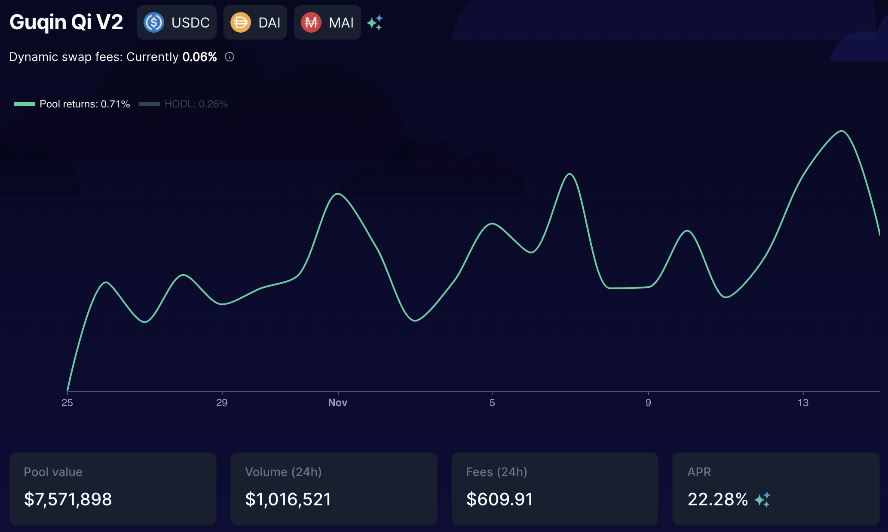
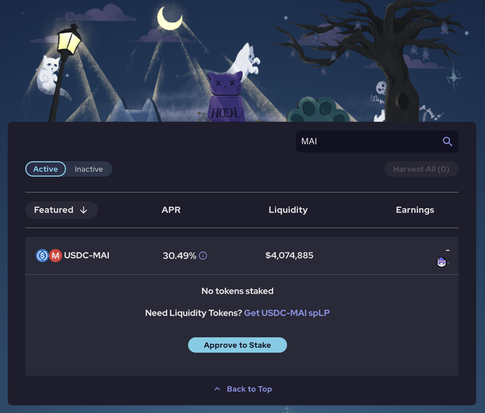
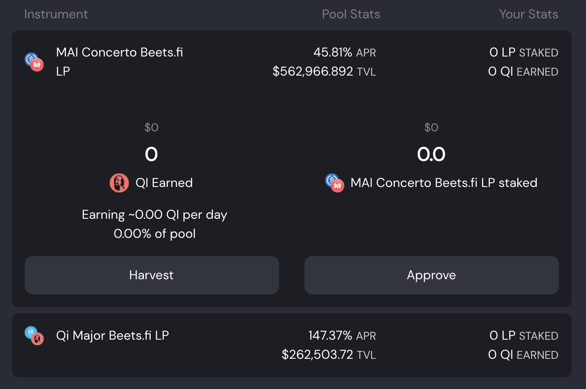
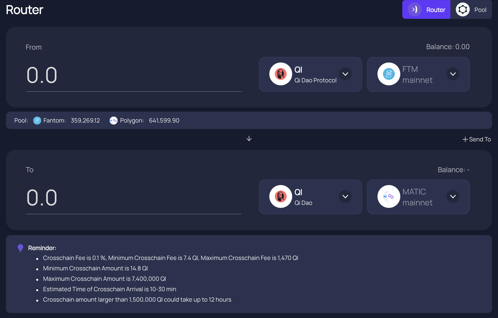
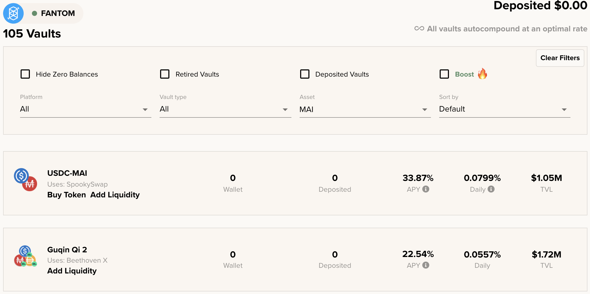
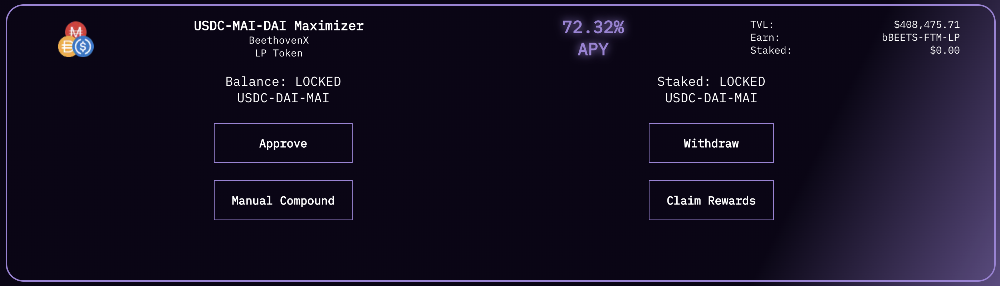

# O que fazer com MAI na Fantom

## Objetivo deste tutorial

O objetivo deste tutorial não é apresentar em detalhes o que você pode fazer com sua stablecoin MAI, mas exibir uma lista de todos os websites e aplicaçōes DeFi que você pode usar na Fantom que permitirá você usar seu MAI diretamente, ou em combinação com outras stablecoins. Para mais detalhes sobre maneiras específicas de usar MAI, você pode acessar os outros tutoriais neste site, ou buscar ajuda pelo Discord ou Telegram.

Por favor, perceba que esta lista não está completa, e que nunca estará já que novos dApps são lançados semanalmente na rede. Eu não posso analisar todos eles, então irei apenas exibir os principais, ou mais famosos e seguros.

Se você quer ver algum projeto específico listado aqui, por favor, junte-se a comunidade Qi no [Discord](https://discord.gg/mQq55j65xJ).

## Farming seguro em projetos blue chip

Projetos blue chip são aplicaçōes DeFi que provaram-se sólidas e que apresentam menor risco. Estes são geralmente auditados, e o time por trás deles já têm trabalhado neles por um bom tempo. Eles geralmente não possuem enormes APRs (**A**nnual **P**ercentage **R**ate) mas podem ser confiados.

### BeethovenX

[BeethovenX](https://app.beets.fi/#/) é um fork da Balancer, um projeto que não foi lançado na Fantom, mas cuja presença é bem estabelecida em outras redes. Como a Balancer, BeethoveeX é um gerenciador automatizado de portólios, provedor de liquidez, e detector de preços. Na plataforma, você será capaz de emprestar suas criptomoedas e coletar taxas de trades. Se precisar de mais informaçōes sobre o projeto, por favor, visite [a documentação oficial](https://docs.beethovenx.io)

O time da BeethovenX não somente criou um fork da Balancer, como também construiu ferramentas incríveis (gerenciamento de portfólio, rastreamento do token nativo BEETS, recompensas que podem ser reivindicadas a qualquer momento). E isso tudo com um universo e uma história fantástica, que os ajudou a criar uma fantástica comunidade.

Na Fantom, você será capaz de adicionar seu MAI na pool `Guqin Qi V2` que é composta por MAI (65% da pool), DAI (17.5% da pool) e USDC (17.5% da pool), e o APR (**A**nnual **P**ercentage **R**evenue) varia entre 20% e 30%, pago em BEETS e taxas de trocas.

Assim como a Balancer, a melhor coisa sobre a BeethovenX é provavelmente o fato que você não precisa prover a proporção exata para a pool. O algoritmo que está mantendo o balanço correto entre os 3 ativos irá tomar qualquer depósito que você tem e irá vender/comprar tokens para garantir que o balanço será mantido. Desta forma, você pode simplesmente depositar MAI e deixar a pool fazer o resto.

BeethovenX é também a melhor aplicação se você quer trocar seu MAI por outra moeda usando a função de troca.

### SpookySwap

[SpookySwap](https://spookyswap.finance) é provavelmente uma das melhores DEX na Fantom onde você será capaz de trocar seus tokens ERC20, providenciar liquidez e obter rendimentos de farming, criar tokens LP (**L**iquidity **P**rovider), realizar staking com o seu token nativo BOO, e você pode até mesmo fazer a ponte de alguns ativos da Fantom a outras rede (e vice versa). É um fork da Uniswap v2 em que o time construiu mais funçōes incríveis.

A SpookySwap recentemente introduziu um par de MAI-USDC que pode ser utilizado em farming para lucrar tokens BOO com uma média de APR entre 25% e 30%.

Você poderá fazer staking dos seus tokens BOO para receber mais 20% de APR, o que é uma ótima maneira de usar seu token de recompensa. Além disso, ao fazer staking de BOO, você receberá uma prova de depósito sBOO que pode ser aceita como garantia valida na Mai Finance mais tarde. Isso iria criar um pequeno loop onde pessoal serão capazes de depositar MAI-USDC, receber e fazer staking de BOO, depositar sBOO na Mai Finance e tomar emprestado MAI para adicionar à pool MAI-USDC.

### Mai Finance

[Mai Finance](https://app.mai.finance/farm) é uma platforma de empréstimos, e o principal projeto que todos nós amamos. and the main project that we all love. Para suportar o pareamento da MAI e ter mais casos de uso para MAI na rede Fantom, pools adicionais tem sido adicionadas à plataforma Mai Finance. Portanto, você será capaz de depositar o LP token MAI-USDC previamente criado na BeethovenX (procure pela pool MAI Concerto) e receba recompensas em Qi.

O token Qi que você obterá por fazer farming diretamente na Mai Finance pode ser usado na pool Qi-FTM que também está presente na Mai Finance (você pode criar o LP na BeethovenX também) na qual você será capaz de receber ainda mais Qi. Você pode também usar o [Roteador da AnySwap](https://anyswap.exchange/#/router) para enviar seu Qi colhido na Fantom à Polygon. Então você pode fazer staking de Qi na Mai Finance, participar na governança e coletar dividendos do protocolo.

## Farming degen e agregadores

### Beefy Finance

[Beefy Finance](https://app.beefy.finance/#/fantom) é um agregador presente nas maiores plataformas, incluindo a Fantom. Você poderá depositar alguns tokens LP na Beefy e os algoritmos irão tomar conta de colher suas recompensas, vendê-las e agregá-las em mais dos seus tokens LP.

Você pode usar alguns dos tokens da Beefy como garantia na Mai Finance, por favor, confira o artigo correspondente [aqui. ](leverage-your-crypto-on-fantom.md#Leverage-your-mooScreamTokens-on-Mai-Finance)Se tratando de usar MAI na Beefy, você pode depositar os tokens LP que você criou na BeehovenX ou SpookySwap:

Beefy venderá suas recompensas BEETS e BOO para adicionar mais de suas posiçōes MAI-DAI-USDC or MAI-USDC positions. Pay attention to the fact that Beefy is displaying APY (**A**nnual **P**ercentage **Y**ield) when BeethovenX and SpookySwap are using APR. This is a crucial point when you want to choose a given platform for the reward VS the simplicity of use.

### Beluga

Beluga is another aggregator on Fantom that will target specific platforms, and in our case, we can use Beluga for the BeethovenX pool. Instead of selling the BEETS token granted by BeethovenX to increase the MAI-DAI-USDC position, the BEETS will be deposited in the BEETS-FTM pool that is getting 350% APR as of November 2021. BEETS will be harvested regularly and compounded in the BEETS-FTM pool, and you will be able to harvest this LP token and remove the liquidity directly on BeethovenX. As a side note, because Beluga is using the BEETS-FTM pool that has a very high APR, the final APY for the MAI-DAI-USDC is very high too.


Please note that Beluga will not help you grow your stable position. The final APY is highly dependent on the price of BEETS and on the APR of the BEETS-FTM pool. The reward value will not be captured and saved in your stable LP, so you will have to manually break the BEETS-FTM LP and sell for whatever you want.


### Degen farms

A lot of degen farms are using LP tokens created on SpookySwap and SpiritSwap. SpookySwap only added MAI-USDC mid-November 2021 and SpiritSwap whitelisted MAI but does not have any MAI pool. This means that most degen farms don't have MAI LPs, but you may see MAI-USDC pairs pop on these sites very soon.

To stay aware of the new farms launching every day / every week, please follow the [list regularly updated on RugDoc.io](https://rugdoc.io/chain/fantom/). Also, make sure you're doing your own researches when using degen farms, this guide cannot be taken as financial advice and isn't promoting any specific farm or application aside Mai Finance.

### Tarot

Tarot is a very specific application, and is a fork of Impermax Finance. It allows user to

* lend single assets and gain reward paid in the asset they are lending
* borrow 2 assets to form LP tokens and farm on specific platforms, with the option to leverage their position to magnify their rewards

Tarot accepts certain pairs from SpookySwap, SpiritSwap and SushiSwap. However, because these platform are only starting to accept MAI and to propose LP pairs with MAI, Tarot does not currently propose these pairs. We can easily imagine that in a very near future, you will be able to lend your MAI on Tarot, or use MAI LP pairs to farm yields on a levered position. For more details about how the platform works, please read the [dedicated section on Impermax](../../polygon-tutorials/what-to-do-with-mai-on-polygon.md#Impermax) in the Polygon guide.

## Disclaimer

Everything is this tutorial is purely educational. The goal is to bring light to projects that I think are worthy for people evolving in the crypto world on Fantom. Mai Finance also proposes a MAI-USDC pool (create your LP token on BeethovenX) that will reward you with the Qi token. Finally, this guide is ABSOLUTELY NOT meant to be applied as is, it's not any financial advice and you should not follow blindly what I wrote. Please read the docs of the different projects I mentioned before considering investing on their platforms.


Keep in mind that a strategy that works well at a given time may perform poorly (or make you lose money) at another time. Please stay informed, monitor the markets, keep an eye on your investments, and as always, do your own research.

