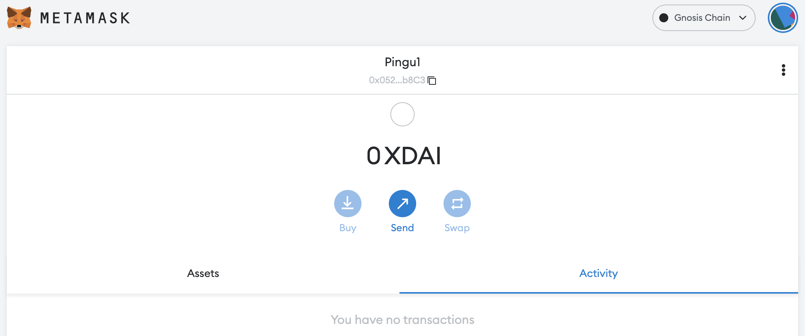

# Como começar na Gnosis Chain

## O que é a Gnosis Chain?

A Gnosis Chain é uma blockchain compatível com EVM, o que significa que é compatível com o código implantado na rede Ethereum (EVM = Ethereum Virtual Machine). Como a maioria das redes está tentando alcançar o Trilema Segurança/Escalabilidade/Descentralização, a Gnosis Chain se concentra na velocidade (finalidade da transação 5s) e baixos custos para transações. Ele usa xDAI (DAI encapsulado na Gnosis Chain) como seu principal token de gas para transações regulares, mas também usa o token GNO para governança e staking. A Gnosis Chain foi originalmente projetada para mercados de previsão construídos no Ethereum. Os mercados de previsão são como bolsas onde os resultados dos eventos são negociados. À medida que os eventos se desenrolam, os tokens gnosis ganham ou perdem valor dependendo do que foi previsto.

Para apoiar o objetivo da Gnosis Chain, foi adicionada uma camada de aplicativos, na qual você encontrará aplicativos descentralizados especializados, como

* RealT: uma aplicação imobiliária tokenizada
* Kleros: uma plataforma justiça (JaaS) que visa resolver conflitos usando a tecnologia blockchain

Você pode obter detalhes adicionais sobre a Gnosis Chain como seu TVL e outros aplicativos na [DeFi Llama](https://defillama.com/chain/Gnosis).

## Começando na Gnosis Chain

Antes de usar a Gnosis Chain, você precisará de um endereço de carteira. Como a Gnosis é uma rede EVM, ela aceita as mesmas carteiras de outras redes EVM, incluindo carteiras web como a Metamask ou Nifty. Você também poderá usar sua hard wallet, como a Trezor ou a Ledger, mas pode ser necessário seguir mais passos para poder conectá-la à rede.

Para este tutorial, vamos nos ater a Metamask como fazemos em todos os outros guias deste site. Se você não tiver a Metamask instalada, poderá encontrar instruções em [Como começar a sua jornada na Polygon.](../polygon/how-to-get-started-on-polygon.md)

### Adicionando a Gnosis Chain a Metamask

Em teoria, a Gnosis já vem pré-instalada com a MetaMask, o que significa que você não deve adicionar as informações da rede para que a Metamask funcione. No entanto, pode ser uma boa ideia verificar se sua configuração está correta verificando novamente os valores salvos em sua carteira local. Abra o pop-up Metamask, clique no ícone da sua carteira, navegue até Configurações, escolha Redes e encontre a Gnosis Chain. Os dados que você deve obter são os seguintes:

* **Network Name:** Gnosis Chain
* **New RPC URL:** https://rpc.gnosischain.com/
* **Chain ID:** 100
* **Currency Symbol:** xDAI
* **Block Explorer URL:** https://blockscout.com/xdai/mainnet

Salve as alterações e a Metamask irá automaticamente mudar para a rede Gnosis:

## Pontes à Gnosis Chain

### Faucets

Você pode usar o Google para encontrar algumas faucets (ou torneiras) na Gnosis Chain, onde poderá solicitar seus primeiros xDAI para iniciar as transações. Eu não recomendo nenhuma em particular, mas encontrei [esta faucet de comunidade](https://www.gimlu.com/faucet) que entrega 0,002 xDAI por solicitação. Esteja ciente de que o número de solicitações que você pode fazer é limitado e ela não foi feita para você ganhar dinheiro de graça.

### Pontes

* [Multi Chain](https://app.multichain.org/#/router) é a parceira oficial da Mai Finance para você que deseja transferir seu MAI para a Gnosis Chain da Polygon ou de outras redes. Após se conectar à Polygon, você deve escolher a rede de destino (Gnosis Chain) e o ativo que deseja enviar (MAI ou miMATIC) com o valor correto e clicar no botão Transferir. Preste atenção às taxas de transferência cobradas diretamente no ativo que você está transferindo.

* [Elknet](https://app.elk.finance/#/elknet) atuará como uma ponte e como uma faucet quando você transferir o token ELK entre 2 redes. Você poderá enviar seu ELK e, na rede receptora, obter uma pequena parte do seu ELK diretamente disponível como token de gas, xDAI no nosso caso.

## DeFi na Gnosis

A Gnosis possui algumas soluções DeFi em sua rede, incluindo:

* [SushiSwap](https://app.sushi.com/farm?chainId=100): Esta é uma das principais DEX e AMM na Gnosis/xDAI. Você poderá trocar seus ativos ou participar da mineração de liquidez fornecendo pares de LP (**L**iquidity **P**roviding, ou Fornecimento de Liquidez) em farms.
* [Curve](https://xdai.curve.fi/): É aqui que a maior parte da liquidez é fornecida na Gnosis Chain. Também é aqui que você poderá fornecer a stablecoin MAI na[ pool de MAI](https://xdai.curve.fi/factory/4) e receber recompensas em tokens GNO.

* [Honeyswap](https://app.honeyswap.org/#/pool), [Honeycomb](https://1hive.io/#/wallet) e [Agave](https://app.agave.finance/#/dashboard): Respectivamente, uma DEX (fork da Uniswap) que permite o swap de tokens e a criação de tokens de fornecimento de liquidez, uma AMM (fork da Goose) que permite o staking de seus tokens LP criados na Honeyswap e a produção de rendimentos ao fornecer liquidez, e um protocolo de empréstimo (fork da AAVE) que permite emprestar certos ativos e tomar emprestado outros. Esses 3 dApps estão formando um ecossistema completo gerenciado pela mesma equipe.
* [Elk Finance](https://app.elk.finance/#/farms): Elk é um fork da Uniswap V2 que permite operar swaps, depositar liquidez e farmar seu token $ELK usando diferentes ativos da Gnosis Chain, incluindo $MAI. Você também poderá fazer staking com seus tokens ELK para obter mais recompensas ou transferi-los de uma rede para outra usando a ponte ElkNet.

## Mai Finance na Gnosis Chain

A plataforma de empréstimo já está disponível na Gnosis Chain, onde você poderá colocar seus tokens GNO em um cofre e tomar emprestado MAI. Isso permitirá que você use seus tokens GNO como garantia e use seu MAI na Curve para cultivar mais tokens GNO. O loop consistiria em:

* Criar um cofre na [Mai Finance](https://app.mai.finance)
* Depositar seus tokens $GNO no cofre
* Tomar emprestado $MAI contra sua garantia a 0% de juros
* Depositar o $MAI na Curve Finance e receber recompensas em GNO

## Aviso legal

Este guia NÃO é conselho financeiro e deve ser simplesmente considerado uma ferramenta educacional. Sempre faça sua própria pesquisa. A discussão de um projeto neste guia não deve ser considerada como um endosso do projeto.


Tenha em mente que uma estratégia que funciona bem em um determinado momento pode ter um desempenho ruim (ou fazer você perder dinheiro) em outro momento. Por favor, mantenha-se informado, monitore os mercados, fique de olho em seus investimentos e, como sempre, faça sua própria pesquisa.

