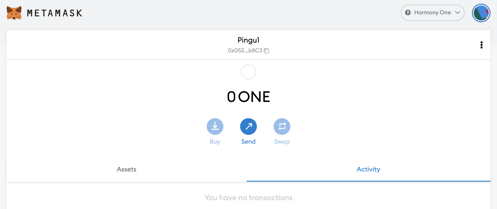
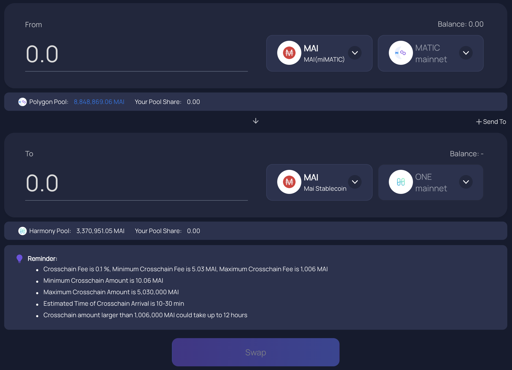
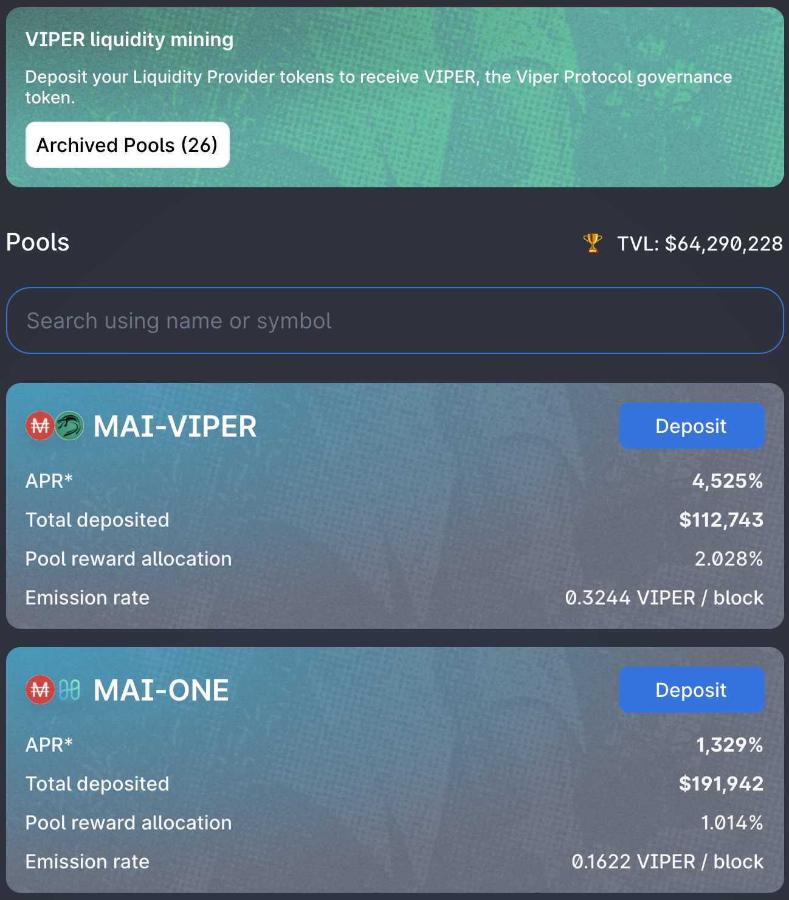

# Como começar na Harmony

## O que é Harmony

A Harmony é uma blockchain que tenta resolver os problemas que a Ethereum Mainnet enfrenta: alcançar um grau satisfatório de equilíbrio entre descentralização e escalabilidade. O foco principal da rede está voltado para o alto rendimento das transações, velocidade e eficiência energética. Isso é feito aproveitando altamente a fragmentação de validadores que seriam agrupados para processar transações simultaneamente. Suportar a escalabilidade é simples como aumentar o número de shards, o que também ajuda a alcançar transações mais rápidas. Sinta-se à vontade para pesquisar mais sobre o Harmony e sua tecnologia em sua [documentação oficial.](https://docs.harmony.one/home/general/technology)

## Começando na Harmony

Para usar a rede Harmony, você precisará de uma carteira. Como o Harmony é uma rede compatível com EVM (**E**thereum **V**irtual **M**achine), ela aceitará as mesmas carteiras que em outras rede compatíveis com EVM, incluindo carteiras virtuais como Metamask ou Nifty, e você poderá usar sua carteira de hardware como Trezor ou Ledger. \
\
Para este tutorial, nos limitaremos ao Metamask como fazemos em todos os outros guias deste site. Se você não tiver a Metamask instalado, você pode encontrar instruções em [como começar na Polygon.](../../polygon-tutorials/how-to-get-started-on-polygon.md)

### Adicionando a Harmony à Metamask

Se você instalou a versão mais recente da Metamask, já deve ter acesso à rede Harmony e não há mais nada para você definir além de selecionar Harmony One na lista suspensa de rede no topo do Metamask. Você também pode definir um novo RPC para acessar a Harmony usando estas etapas. Abra o pop-up Metamask, clique no ícone da sua carteira, navegue até `Settings` então escolha `Networks` e encontre `Harmony One`. A informação que você deve obter é:

* **Network Name:** Harmony One
* **New RPC URL:** https://api.harmony.one
* **Chain ID:** 1666600000
* **Currency Symbol:** ONE
* **Block Explorer URL:** https://explorer.harmony.one/

Salve as alterações, e a Metamask irá transferi-lo automaticamente para a rede Harmony:

## Ponte à Harmony One

### Faucets

Não há nenhum faucet oficial para obter seus primeiros tokens ONE para suas primeiras transações. Você terá que conectar alguns tokens de outra cadeeia usando a [Ponte Oficial da Harmony](https://bridge.harmony.one/erc20). Isso permitirá que você conecte alguns ativos específicos da Ethereum Mainnet ou Binance à Harmony. Você pode acessar [esta lista](https://docs.harmony.one/home/developers/harmony-stack#bridges-fiat-gateways-exchanges) com curadoria da equipe Harmony.

Como sempre, você pode usar a [ElkNet](https://app.elk.finance/#/elknet) para transferir alguns tokens ELK de outras redes para a Harmony. Se você fizer isso, certifique-se de marcar a caixa `Swap $ELK 1 for gas` que irá trocar uma parte de seus tokens transferidos para ONE, o que também permitirá que você troque o resto de seus tokens ELK por mais ONE ou outros ativos.

### Pontes

* [Multichain.org](https://app.multichain.org/#/router) (anteriormente conhecido como AnySwap) é o parceiro oficial da Mai Finance que permitirá que você conecte seus tokens MAI da Polygon e outras cadeias à Harmony. Como observação, a Multichain tem trabalhado lado a lado com os desenvolvedores da Mai Finance para garantir que o MAI que você envia à Harmony seja o mesmo que você poderá pedir emprestado da plataforma de empréstimo. Não há necessidade de um Hub na Harmony. Basta acessar o roteador Multichain, selecionar a rede de origem, o token que deseja transferir e a rede de destino e pronto. Preste atenção aos valores mínimos para transferências, taxas de transferência e duração da ponte, mas, uma vez feito isso, você obterá seu ativo no Harmony.

* [Ponte Oficial da Harmony](https://bridge.harmony.one/erc20), como explicado no parágrafo anterior, irá te permitir transferir ativos específicos da Ethereum Mainenet ou BSC.
* [RelayChain](https://app.relaychain.com/#/cross-chain-bridge-transfer) é outra solução se você deseja transferir algo para a Harmony. Verifique a aplicação para ver quais ativos são passíveis de conexão.
* [ElkNet](https://app.elk.finance/#/elknet) é um caso particular, uma vez que a ponte da Elk Finance permitirá que você envie o token ELK de qualquer rede compatível com EVM para qualquer outra rede compatível com EVM, onde eles são implantados com a possibilidade de trocar uma pequena parte da quantia transferida em tokens de gas (consulte a seção dedicada a Faucets logo acima).

## DeFi na Harmony

Como a Harmony One é uma rede que oferece transações rápidas e seguras, assim como gas muito barato, muitos DApps (**D**ecentralized **A**pplications) compatíveis com EVM foram implantados nessa rede. A lista a seguir não apresenta todos eles, fique à vontade para explorar a rede e sua lista de DApps você mesmo. Você pode encontrar uma[ lista extensa na DefiLlama](https://defillama.com/chain/Harmony).

* [ViperSwap](https://viper.exchange/#/swap): Este é o primeiro parceiro da Mai Finance no Harmony One. Este é um fork normal do Uniswap v2, uma DEX (**D**ecentralized **E**xchange) e AMM (**A**utomated **M**arket **M**aker) onde você poderá trocar seus ativos, criar tokens LP (**L**iquidity **P**roviding) e fazer farming para obter recompensas, fornecendo liquidez aos traders. A recompensa é paga usando o token VIPER, que você poderá usar para staking no aplicativo para obter mais recompensas. Esta é a DEX onde você encontrará liquidez para trocar seu MAI ou para fazer farming e obter recompensas usando seu MAI.

Você notará que o APR (**A**nnual **P**ercentage **R**ate, ou Taxa Percentual Anual) das pools é muito altas. Isso se deve principalmente ao formato de recompensa no ViperSwap: quando você reivindica suas recompensas, 5% dos tokens VIPER podem ser usados diretamente, enquanto 95% são bloqueados até 2021-12-25. Depois disso, a recompensa é adquirida ao longo de um ano completo, o que significa que você não será capaz de acessar seus ganhos do farming imediatamente, e isso irá pingar no teu bolso muito lentamente. Há uma outra reviravolta nas pools ViperSwap: você terá que pagar uma taxa de retirada que diminui se você fizer staking com seus tokens LP por muito tempo. Ela vai de uma taxa de 25% se você retirar dentro do mesmo bloco da transação de depósito (para combater as operações de flashloan) para 0,01% se você retirar após 1 mês. Mais detalhes em sua documentação oficial sobre [recompensas de farming ](https://docs.venomdao.org/viper/tokenomics#bbd0)e [taxas de retirada](https://docs.venomdao.org/viper/fees).

* [DeFi Kingdom](https://game.defikingdoms.com/#/): Este é um projeto particularmente interessante que mistura DeFi e Gamification. Seu token nativo, o token JEWEL, é usado como recompensa de farming para usuários que fornecem liquidez, mas pode ser usado no jogo ou no mercado. Explicar todo o universo de DeFi Kingdom (ou DFK) levaria muito tempo para este guia, por isso recomendamos a leitura da [documentação oficial.](https://docs.defikingdoms.com)

* [SushiSwap](https://app.sushi.com) é a famosa DEX/AMM que também está presente em muitas outras redes. Troque, forneça liquidez, faça farming com ONE e SUSHI.
* [Curve Finance](https://harmony.curve.fi) é outro aplicativo cross-chain que permitirá que você forneça liquidez (3pool e tricrypto) e te recompensará com tokens reacumulados, bem como ONE e CRV.
* [Beefy Finance](https://app.beefy.finance/#/harmony) é um otimizador de rendimento que já apresentamos em muitos de nossos guias, pois está presente em muitas redes. Atualmente, você poderá depositar seus tokens LP do Curve e SushiSwap e deixar o Beefy Composer acumular as recompensas fornecidas pela plataforma de farming em mais tokens LP.
* [Euphoria DAO](https://app.euphoria.money/#/dashboard) é atualmente o maior OHM-fork na Harmony, e desenvolvido pela Venom DAO, também por trás do ViperSwap. Você pode vincular alguns ativos diferentes e obter seu ativo nativo, o token WAGMI. Faça staking de WAGMIs para obter mais WAGMI com um APY insano (Annual Percentage Yield, ou Rendimento Percentual Anual) assim como occore na maioria dos forks da OlympusDAO.

## Mai Finance na Harmony

A Mai Finance foi lançada na Harmony One em dezembro de 2021, e este guia foi escrito bem próximo da sua data de lançamento, portanto o aplicativo já pode ter sido atualizado agora que você lê este guia. \
\
Você poderá depositar os seus tokens WETH ou ONE na Mai Finance (https://app.mai.finance/vaults/create) para pedir emprestada a stablecoin MAI. Você poderá então trocar MAI para alavancar seus ativos, operar com margem ou fazer farming na ViperSwap.

## Aviso legal

Como sempre dizemos, este guia não é um conselho financeiro e deve ser considerado apenas uma ferramenta educacional. Sempre faça sua própria pesquisa. A discussão de um projeto neste guia não deve ser considerada como um endosso do projeto.


Lembre-se de que uma estratégia que funciona bem em um determinado momento pode ter um desempenho ruim (ou fazer você perder dinheiro) em outro momento. Fique informado, monitore os mercados, fique de olho nos seus investimentos e, como sempre, faça suas próprias pesquisas.

