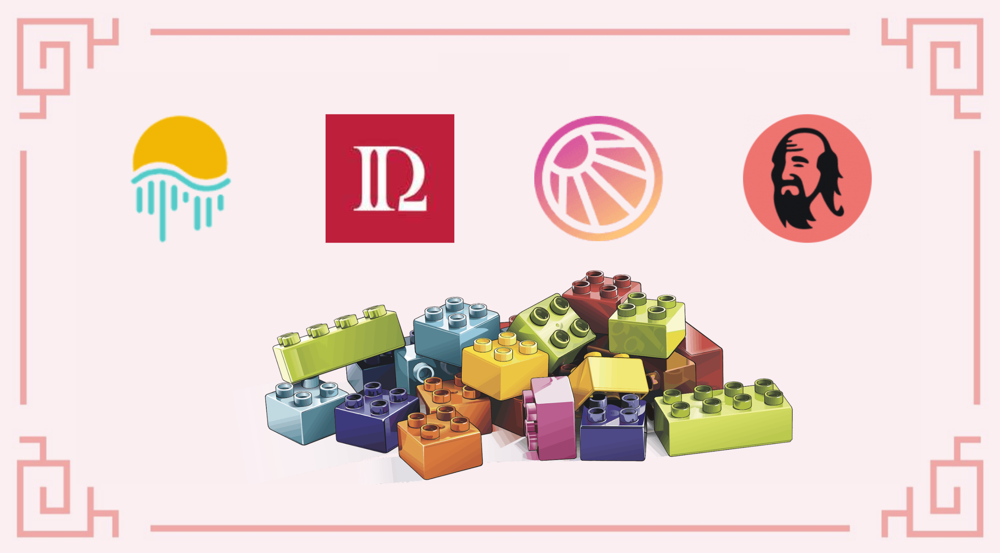
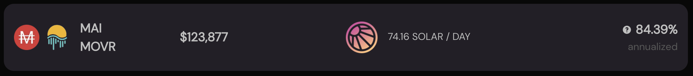
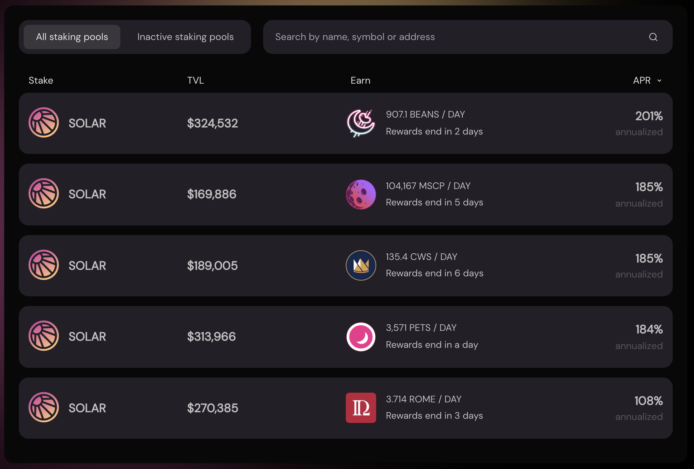
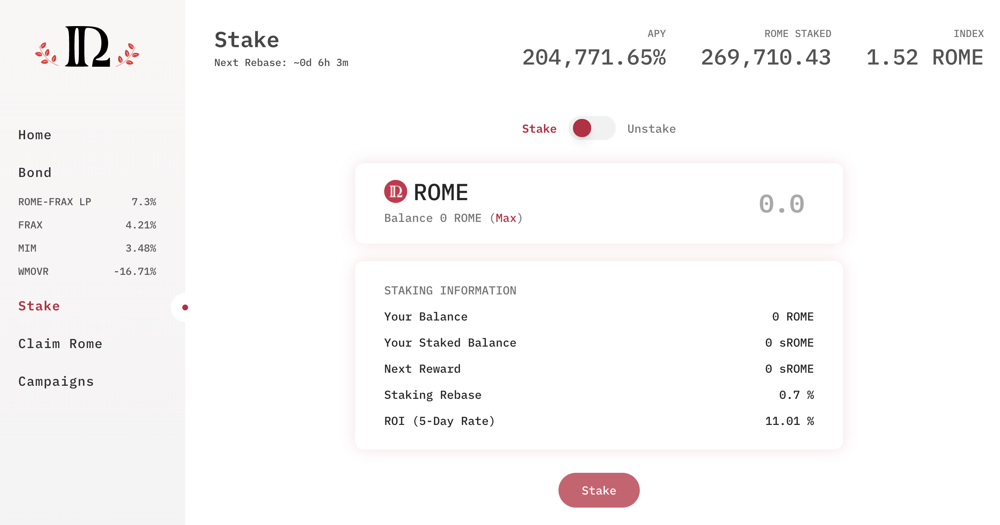
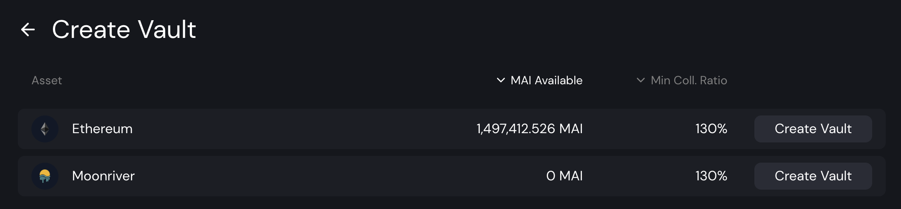
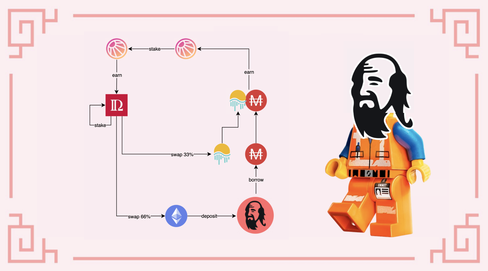

# Farming de MAI na SolarBeam

A maioria dos tutoriais apresentados neste guia usa stablecoins ​​como posição inicial. Isso se deve principalmente ao fato de que pares de moedas estáveis ​​não são afetados por perdas impermanentes nem pela volatilidade de outros ativos. Então, é quase impossível perder seu investimento inicial, e você pode usar estratégias mais arriscadas com os ganhos de suas stablecoins para aumentar seus ganhos.

Hoje, tentaremos outra abordagem na Moonriver com a Solarbeam, atualmente o único aplicativo que usa MAI. O par LP (**L**iquidity **P**roviding, Provedor de Liquidez) é MAI-MOVR. MAI é a moeda estável da Mai Finance com que você também poderá fazer ponte para a Moonriver ou cunhar de um cofre, e MOVR é o token de gás nativo do Moonriver. Como tal, o MOVR sempre terá algum tipo de utilidade e nunca deve cair em preço muito drasticamente. Este não é um par estável, mas a única parte variável do token está vinculada ao MOVR, o que o torna um bom ponto de partida de qualquer maneira.

Vamos ver como podemos gerar rendimentos muito altos com um loop de feedback fechado na Moonriver sem despejar muitos tokens de farming em movimento.

## SolarBeam

### Farming de MAI na Solarbeam

Solarbeam é a primeiro e principal DEX (**D**ecentralized **EX**change) e AMM (**A**utomatic **M**arket **M**aker) na Moonriver, e o segundo aplicativo em termos de TVL na rede. É também o primeiro parceiro Moonriver da Mai Finance e oferece uma pool MAI-MOVR que é recompensada com alguns de seus tokens nativos, o token SOLAR. Este também é o lugar onde você encontrará alguma liquidez para MAI.

O APR (**A**nnual **P**ercentage **R**ate, Taxa de Percentual Anual) de 84% é bastante alto devido ao baixo uso da pool, o que faz disso um ponto de início perfeito para a nossa estratégia. Você obterá este APR (corresponente a um APY de 131% se você quiser comparar com algo como MAI-WMATIC na QuickSwap como referencia) e a recompensa será paga em tokens SOLAR. Em dezembro de 2021, 1 SOLAR = 3.78 USDC.

### Staking de SOLAR

A maioria dos forks da Uniswap estão propondo staking para o seu token nativo, e a Solarbeam também está fazendo isto. Você pode fazer staking com o seu SOLAR no Vault para receber mais SOLAR, e dependendo da extensão do seu bloqueio, você obterá taxas muito interessantes (até 200% de APR por uma trava de 30 dias), mas nós faremos staking parece receber tokens externos. De fato, você pode fazer staking com seus tokens SOLAR para receber um monte de outros tokens de diferentes apps na Moonrier, e aquele que nós estamos procurando é o token ROME.

Você irá notar que a pool ROME é aquela com o menor APR, mas mesmo assim ainda é bem alto, e vocé logo verá que nossos tokens ROME irão multiplicar a uma taxa insana.

## Rome DAO

Rome DAO é outro grande nome na Moonriver. É um Ohm-fork (cópia da Olympus DAO) que usa o token ROME como token nativo. Você poderá fazer staking com seus tokens ROME no aplicativo para obter retornos muito elevados. O objetivo de cada Ohm-fork é ter o máximo de seus tokens nativo em staking e atrair liquidez para poder sustentar a emissão de novos tokens. Se você precisar de mais detalhes sobre Ohm-forks, verifique [nossos tutoriais sobre Klima DAO](../polygon/ohm-forks-on-polygon-the-case-of-klima.md) para a Polygon.

Como obteremos tokens ROME do Solarbeam, devemos ser capazes de colocá-los no Rome DAO e o sistema de rebase o te dará muito mais rápido. Para esta estratégia, apostaremos tokens ROME no Rome DAO e venderemos 50% da recompensa diária, que atualmente corresponde a \~ 1% do depósito no Rome DAO.

## Mai Finance

Mai Finance é uma plataforma de empréstimo onde você poderá depositar seus ativos cripto e tomar emprestada a moeda estável MAI a 0% de juros. A única taxa que será cobrada no Moonriver é a taxa de reembolso de 0,5% do seu empréstimo.

Para nossa estratégia, usaremos um vault ETH. O token ROME que será extraído do pool de staking Rome DAO será dividido da seguinte forma:

* 33% serão trocados para MOVE usando o recurso de troca no Solar Beam
* 66% serão trocados para ETH usando o recurso de troca no Solarbeam

Você poderá então depositar ETH na Mai Finance para tomar emprestado o MAI com um CDR (**C**ollateral to **D**ebt **R**atio) de 200% para permanecer na zona segura e tentar evitar a liquidação. O MAI emprestado será então usado para criar tokens LP MAI-MOVR adicionais que serão adicionados à posição inicial no Solarbeam.

Como exemplo, para cada $1 de ROME que você extrair da Rome DAO nós teremos:

* $0.33 de MOVR
* $0.66 de ETH depositado na Mai Finance
* $0.33 de MAI emprestado, com nosso ETH de garantia
* $0.66 de token LP MAI-MOVR LP para adicionar à Solarbeam

## Estratégia de Farming

A seguinte simulação é feita assumindo algumas coisas diferentes:

* Todas as taxas e preços permanecem iguais para todo o período da simulação, 1 ano em nosso caso
  * APR de 84% em farming de MAI-MOVR na Solarbeam
  * APR de 108% em staking de SOLAR para farming de tokens ROME
  * APR de 771% na Rome DAO ao fazer staking de tokens ROME
* Todas as recompensas e programas também permanecem em execução por um ano inteiro
* 50% dos ganhos diários na Rome DAO são vendidos por 33% em MOVR e 66% em ETH
* O investimento inicial é de $100 em tokens LP MAI-MOVR

### 1º Dia

No primeiro dia, você simplesmente depositaria seus $100 de MAI-MOVR na Solarbeam e coletaria seus tokens SOLAR no final do dia. Isso lhe daria o seguinte resultado:

| MAI-MOVR | SOLAR | ROME  | ETH   | LP Adicionais |
| -------- | ----- | ----- | ----- | ------------- |
| 100.000  | 0.230 | 0.000 | 0.000 | 0.000         |

### 2º Dia

No segundo dia, você manterá sua posição MAI-MOVR para cultivar mais SOLAR, mas também fará staking de sua primeira colheita de tokens SOLAR para começar a coletar alguns tokens ROME. No final do dia 2, você obteria:

| MAI-MOVR | SOLAR | ROME  | ETH   | LP Adicionais |
| -------- | ----- | ----- | ----- | ------------- |
| 100.000  | 0.460 | 0.001 | 0.000 | 0.000         |

### 3º Dia

No início do terceiro dia, você deve ser capaz de colher seus primeiros tokens ROME das recompensas de aposta diária de 50%. Provavelmente não é uma boa ideia fazer isso no dia 3 com apenas $100, porque o valor é insignificante. Você venderá 33% para MOVR e 66% para ETH, que irá depositar seu cofre na Mai Finance e, em seguida, tomará emprestado MAI graças a sua nova garantia.

| MAI-MOVR | SOLAR | ROME  | ETH      | LP Adicionais |
| -------- | ----- | ----- | -------- | ------------- |
| 100.000  | 0.690 | 0.002 | 0.000005 | 0.000005      |

At this point the system is fully bootstrapped.

## Resultados de Farming

### Rotina diaria

Após o sistema estar totalmente preparado, aqui está a nossa rotina diaria:&#x20;

* colher SOLAR da pool MAI-MOVR
* fazer staking com os tokens SOLAR que você acabou de receber
* colher os tokens ROME da pool de staking SOLAR&#x20;
* fazer staking com seus recém-adquiridios tokens ROME
* fazer unstaking de 50% de seus ganhos diários na Rome DAO (correspondente a 1.5 rebase)
* vender 66% de seus tokens ROME para ETH
* vender 33% de seus tokens ROME para MOVR
* depositar ETH no vault ETH na Mai Finance
* tomar emprestado 50% de seus depósito em stablecoin MAI
* parear o MAI emprestado com tokens MOVR
* depositar os tokens adicionais MAI-MOVR

### Resultados mensais brutos

| Dia | MAI-MOVR | SOLAR em Staking | ROME em Staking | ETH     |
| --- | -------- | ---------------- | --------------- | ------- |
| 30  | 100.021  | 7.135            | 0.352           | 0.023   |
| 60  | 100.190  | 14.045           | 1.550           | 0.200   |
| 90  | 100.713  | 20.978           | 3.911           | 0.740   |
| 120 | 101.872  | 27.968           | 7.869           | 1.925   |
| 150 | 104.052  | 35.072           | 14.023          | 4.148   |
| 180 | 107.788  | 42.378           | 23.204          | 7.947   |
| 210 | 113.814  | 50.019           | 36.559          | 14.065  |
| 240 | 123.142  | 58.178           | 55.580          | 23.525  |
| 270 | 137.175  | 67.158           | 82.767          | 37.745  |
| 300 | 157.848  | 77.321           | 120.875         | 58.681  |
| 330 | 187.841  | 89.226           | 174.234         | 89.041  |
| 360 | 230.861  | 103.358          | 248.711         | 132.575 |

### 365º Dia

Depois de um ano completo de farming, você teria:

* $239.633 de MAI-MOVR na Solarbeam
* $106.358 de SOLAR em staking na Solarbeam
* $263.708 de ROME em staking na Rome DAO
* $141.450 de ETH na Mai Finance
* $68.817 de dívidas em MAI na Mai Finance

O MAI-MOVR adicional não corresponde totalmente à dívida, pois estamos usando um terço dos tokens ROME trocados para obter metade dos novos tokens LP. \
\
Este loop forneceria, portanto, um APY equivalente de 583,15% a partir de uma posição inicial relativamente estável.

## Aviso legal

As principais coisas para entender a partir desta estratégia são que a Moonriver é pouco utilizada e as taxas de recompensas são muito interessantes. Além disso, assim que você joga um Ohm-fork em sua estratégia de reinvestir uma parte de seus ganhos, as taxas de recompensa são tão insanas que você terá um lucro muito interessante, desde que mantenha tokens suficientes na DAO para gerar recompensas em staking. \
\
Porém, lembre-se de que os projetos terão taxas de recompensa variáveis que não serão garantidas ao longo de um ano. Certifique-se de entender completamente o projeto em que está investindo, faça sua própria pesquisa e certifique-se de investir apenas o que você pode estar pronto para perder. Como essa estratégia trabalha com um investimento inicial relativamente estável, a única coisa que está em risco aqui são os benefícios de outros sistemas. Este guia não pode ser interpretado como um endosso aos projetos aqui citados.
