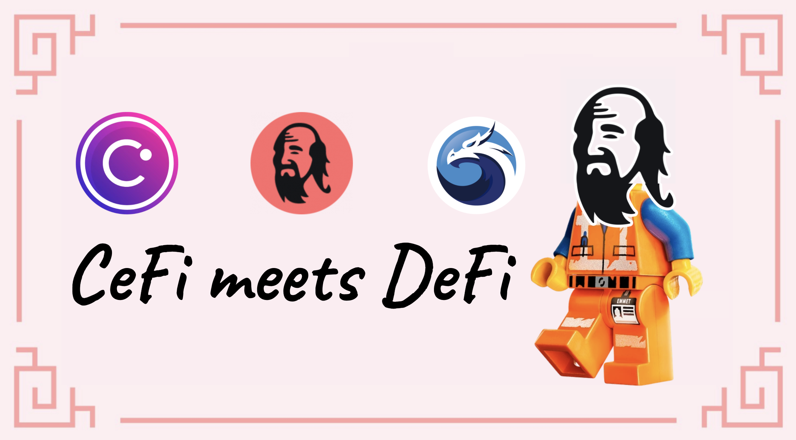
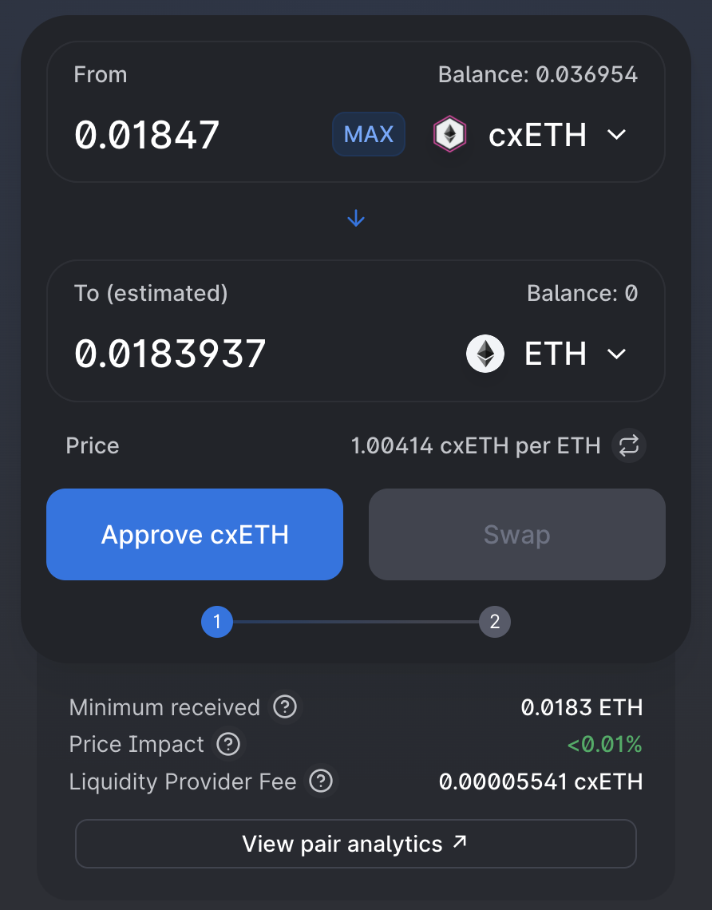

# De CeFi a DeFi com Celsius

## Introdução

[Celsius Network](https://celsius.network/) é um dos grandes players do CeFi, onde as pessoas podem facilmente comprar criptoativos com sua conta bancária e fazer staking com os tokens comprados para obter recompensas extras. Como exemplo, você pode obter um APY de 6,20% em seu BTC (Bitcoin), 5,35% em seu ETH (Ether), etc. Além de manter seus ativos e obter ganhos semanais compostos, você também pode emprestar ativos adicionais contra os que já possui (que são usados como garantia) para alavancar sua posição ou trocar por outros tokens. No entanto, a Celsius é uma rede fechada, e é por isso que muitas vezes é referenciado como um aplicativo CeFi (**Ce**ntralized **Fi**nance).

Se você tiver ativos na Celsius, ainda poderá enviá-los para outros aplicativos na blockchain nativa dos tokens. Por exemplo, você pode transferir ETH para dentro e para fora de Celsius usando sua carteira Ethereum ou BTC usando seu endereço na cadeia Bitcoin. Além disso, a Celsius lançou em fevereiro uma nova ponte chamada CelsiusX que permite enviar alguns ativos específicos do aplicativo Celsius para a Polygon. Os tokens atuais que são suportados são:

* ETH, o token nativo da Ethereum Mainnet
* ADA, o token nativo de Cardano
* DOGE, o token nativo da blockchain Dogecoin

Ao enviar seus ativos à Polygon, você também obtém acesso total ao ecossistema DeFi, bem como opções de ponte adicionais para mover seus tokens para Fantom, Avalanche e muitas outras redes. Este guia o guiará pelas diferentes etapas para enviar seus ativos da Celsius à Polygon e apresentará algumas coisas que você pode fazer lá.


Este guia definitivamente não é um conselho financeiro, foi feito com um objetivo educacional em mente. Você precisa ficar atento às variações de preços, oferta e demanda, programas de recompensas, datas de término, perdas impermanentes, etc. O objetivo não era propor receitas que possam ser seguidas às cegas, então faça sua lição de casa e sua própria simulação, e só invista o que você está disposto a perder.


## Obtendo ativos na Celsius

### Crie uma conta

Obviamente, para poder usar a Celsius, você precisará de uma conta Celsius. Basta acessar o site deles e registrar uma nova conta [usando este link](https://celsius.onelink.me/EyfO/5321754e). Observe que, por motivos legais e devido à natureza do modelo de negócios da Celsius, você precisará fornecer provas de sua identidade, também conhecidas como documentos KYC (**K**now **Y**our **C**ustomer), como uma carteira de motorista. Além disso, observe que o aplicativo Celsius pode não estar disponível em seu país. Verifique seus [Termos de Uso](https://celsius.network/terms-of-use) e [Política de Privacidade](https://celsius.network/privacy-policy) para detalhes adicionais.


Observe que este guia, a Mai Finance ou a comunidade QiDAO não é responsável pelos serviços fornecidos pela Celsius, e é altamente recomendável fazer sua própria pesquisa antes de se registrar para um produto financeiro.


Depois que sua conta for criada, sinta-se à vontade para fazer um tour rápido pelo aplicativo da Web e também fazer o download do aplicativo para dispositivos móveis.

### Obtendo seus ativos em sua conta

O aplicação móvel é, por enquanto, a única forma de comprar ativos diretamente através de Cartão de Crédito ou Transferência Bancária. Essa opção também pode ser restrita a determinados países/regiões. Devido a essas restrições, não abordaremos essa opção, mas sinta-se à vontade para explorar essa opção se isso for algo que você esteja disposto a fazer.&#x20;

Para este guia, focaremos no ETH e também assumiremos que você já possui algum Ether na Ethereum Mainnet que deseja conectar à Celsius. No aplicativo da Web, basta navegar até a guia `Receive`.

O primeiro passo é adicionar a moeda que você deseja receber. No nosso caso, queremos obter ETH, e é tão fácil quanto clicar no botão `Add New Coins` e selecionar ETH no menu suspenso.

Uma vez selecionado, você terá a possibilidade de obter o endereço da carteira que corresponde à sua conta Celsius na rede Ethereum.

Se você clicar em `View and Copy Address`, um novo pop-up será aberto com um código QR representando o endereço da sua carteira na rede Celsius, bem como seu valor em texto simples que você pode simplesmente copiar e colar.

Com o endereço da carteira, você inicia uma transferência de onde você tem seus tokens Ether. O exemplo abaixo foi retirado da Coinbase (outro grande player da indústria CeFi):

Claro, e como sempre com a Ethereum Mainnet, você terá que pagar uma **pequena** taxa de transação. Isso não é devido à Coinbase ou a Celsius. Como você pode ver abaixo, uma transferência direta da minha carteira MetaMask também exigiria que eu pagasse algumas taxas.


Dependendo do congestionamento da rede, as taxas podem ser bastante altas. Certifique-se de verificar o preço do gas para se beneficiar das taxas mais baixas possíveis.


Depois que a transferência for concluída, você poderá ver seus ativos no painel Celsius:

A partir deste ponto, se eu mantiver as moedas na minha conta em Celsius, receberei recompensas de staking todas as semanas. Para ETH, e em março de 2022, o APY é de 5,35%. No entanto, agora teremos a possibilidade de mover os ativos para a Polygon usando a ponte CelsiusX gratuitamente. Basta ir até a guia `Send` e selecionar o ativo que você deseja transferir para a Polygon.


Observação: se você ainda não tiver nenhum endereço de destinatário salvo, agora é hora de criar um. Escolha o endereço da sua carteira no Metamask e adicione-o como seu endereço de retirada. Por questões de segurança, quando você cria um endereço de saque ou o altera, esse endereço fica bloqueado por 24h. Como você verá na captura de tela abaixo, 24 horas depois de transferir $100 em ETH para Celsius, meu saldo já mudou de preço.


Você também pode notar nesta captura de tela que receberei cxETH na Polygon, que é uma versão _wrapped_ (embrulhada) do ETH. Seria a mesma coisa para ADA (você obterá cxADA) e DOGE (você obterá cxDOGE). Veremos mais adiante neste guia o que fazer com seus cxTokens.


Observe que não há absolutamente nenhuma taxa para esta transferência. Também é muito rápida.


Uma vez enviado, você receberá um e-mail solicitando a confirmação da transferência (sempre mais segurança) e poderá ver seu histórico de transações refletindo essa transferência no aplicativo da Celsius.

Após alguns minutos, você terá seus ativos (cxTokens) disponíveis em sua carteira na Polygon. A melhor maneira de acompanhar essas transferências é provavelmente usar [um aplicativo como o DeBank ](https://debank.com/)e dar uma olhada no seu histórico de transações na rede desejada (neste caso, Polygon):

## Polygon e cxTokens

### O que são cxTokens

Sem se aprofundar nos detalhes, os cxTokens são tokens embrulhados. Quando você transfere seus ativos da Rede Celsius para a Polygon, os ativos são mantidos bloqueados na Rede Celsius e novos tokens são cunhados na Polygon. No entanto, para o caso do Ether, a Celsius não tem a possibilidade de cunhar WETH diretamente na Polygon, então eles criam um token cujo preço é indexado no preço do ETH: cxETH.

O oposto também é verdadeiro, o que significa que quando você transfere seu cxETH de volta para Celsius, o cxToken é queimado e uma quantidade correspondente de ETH é liberada na Celsius e adicionada à sua conta.

Para garantir que o preço do cxToken esteja devidamente indexado ao preço do ativo subjacente, a Celsius está usando uma tecnologia da Chainlink: a Prova de Reserva.

Se você está curioso sobre os detalhes de como Celsius está gerenciando seus cxTokens, você pode ler todos os detalhes em seu [artigo na medium de janeiro de 2022](https://medium.com/@CelsiusX/celsius-is-integrating-chainlink-proof-of-reserve-to-unlock-cross-chain-liquidity-with-wrapped-6c85bb2f2a60).

### Trocando seus cxTokens

Como seus cxTokens são versões embrulhadas dos ativos subjacentes, você pode não encontrar muitos aplicativos que os aceitem desta forma. Felizmente, você pode trocá-los por alguns outros ativos usando a [QuickSwap](https://quickswap.exchange/#/swap), a única DEX com liquidez para cxTokens na Polygon em março de 2022.

Obviamente, você também pode operar a operação reversa e comprar cxTokens usando outros ativos.


Quando você estiver trocando _para_ ou _de_ cxTokens, preste atenção a rota seguida, bem como ao slippage. A QuickSwap parece usar apenas 4 saltos no máximo, e para acessar o cxDOGE como exemplo, você sempre precisa passar por ETH, cxETH e depois cxDOGE. Isso significa que você precisa ter liquidez suficiente entre o ativo que você troca e o ETH para que a rota possa ser ATIVO > ETH > cxETH > cxDOGE.

Atualmente, esse não é o caso do MAI como exemplo. Você pode querer fazer MAI > USDC > ETH > cxETH em uma primeira troca e cxETH > cxDOGE em uma segunda troca.

O mesmo acontece quando você quer sair de seus cxTokens: cxDOGE para MAI pode sofrer de alto slippage, e você provavelmente vai querer passar por cxETH ou ETH primeiro.


## Fornecendo liquidez com seus cxTokens

Com seus cxTokens, você pode fornecer liquidez as pools CelsiusX na QuickSwap. O parágrafo anterior explica como trocar seus cxTokens, e isso é feito usando pools LP (Liquidity Providing, ou Fornecimento de Liquidez). Para garantir que qualquer usuário possa trocar seus tokens, a QuickSwap dará recompensas pagas em dQUICK e MATIC aos usuários que fornecerem liquidez em seu aplicativo. Os 3 pares que lhe darão recompensas são:

* ETH/cxETH
* cxETH/cxADA
* cxETH/cxDOGE

Todos eles têm diferentes níveis de recompensas, e o melhor a fazer é acessar o aplicativo QuickSwap e verificar seus programas de mineração dupla.

Na captura de tela acima, você pode ver que, se fornecer liquidez para o par ETH-cxETH, poderá obter até 15% de APY (**A**nnual **P**ercentage **Y**ield, ou Rendimento Percentual Anual, que pressupõe que você reacumulará as recompensas) pago em dQUICK, WMATIC e diretamente em ETH e cxETH de taxas de swap. Se você não reacumular as recompensas, ainda é um APR de 13,97% que você receberá e poderá fazer o que quiser com os tokens de recompensa. Sinta-se à vontade para explorar este guia para obter ideias adicionais sobre como usá-los.


Para entrar em uma pool de liquidez, basta [prover liquidez ](https://quickswap.exchange/#/add/0x7ceB23fD6bC0adD59E62ac25578270cFf1b9f619/0xfe4546feFe124F30788c4Cc1BB9AA6907A7987F9)para o par escolhido na proporção de 1:1. Isso pode significar que você terá que trocar alguns cxTokens por outra coisa. Uma vez que o par de LP é criado, você pode depositá-lo no pool e começar a acumular rendimentos.


## Use seus cxTokens como garantia e faça um empréstimo

Trocar seus cxTokens significa que você os está vendendo para comprar outra coisa. A [Mai Finance](https://app.mai.finance) é um aplicativo DeFi (Decentaralized Finance, ou Finanças Descentralizadas) que permite manter seus ativos trancados em um cofre e tomar emprestado algumas stablecoins. Dai, você pode fazer o que quiser com seu empréstimo, incluindo:

* realizar farming com as stablecoins
* trocar a stablecoin MAI emprestada para comprar outros ativos
* alvancar seus cxTokens
* enviar seu MAI a outras redes

Basta explorar as diferentes páginas deste guia para coletar ideias sobre como usar seu empréstimo da maneira que melhor lhe convier.

**Observação**: quando você toma emprestado a stablecoin MAI na Mai Finance, você é pago em tokens Qi com base no valor emprestado. As taxas de recompensa variam com base no valor total emprestado deste cofre, no preço do Qi e na alocação de Qi para o cofre. Mais detalhes em nosso [guia em recompensas de cofres](../../mai-university/mai-loans-and-vaults-incentives.md).

E, claro, você pode combinar as duas soluções trocando seu empréstimo de MAI por um par LP de cxTokens e fazer farming na QuickSwap. Neste ponto, não há limite para o que você pode fazer, e seu investimento inicial é totalmente preservado em seu cofre na Mai Finance (desde que você não seja liquidado).

## Aviso legal

Este guia foi escrito para apresentar a você como você pode se beneficiar da CelsiusX, a ponte entre a Celsius Network e a Polygon, e experimentar tudo o que o DeFi pode oferecer na Polygon. É claro que usar protocolos na Polygon apresenta riscos. Se você estiver usando cxTokens como garantia na Mai Finance, terá que prestar atenção às liquidações caso o preço de sua posição de garantia fique abaixo do índice de liquidação, um limite que indica que seu empréstimo pode ter um valor maior do que os ativos que o sustentam. Esses riscos são apresentados em vários tutoriais neste site, portanto, mais uma vez, recomendamos que você leia alguns deles e certifique-se de entender como os diferentes protocolos apresentados neste guia estão funcionando antes de investir qualquer coisa. E como sempre, este não é um conselho financeiro, sempre faça sua própria pesquisa.


Tenha em mente que uma estratégia que funciona bem em um determinado momento pode ter um desempenho ruim (ou fazer você perder dinheiro) em outro momento. Por favor, mantenha-se informado, monitore os mercados, fique de olho em seus investimentos e, como sempre, faça sua própria pesquisa.

