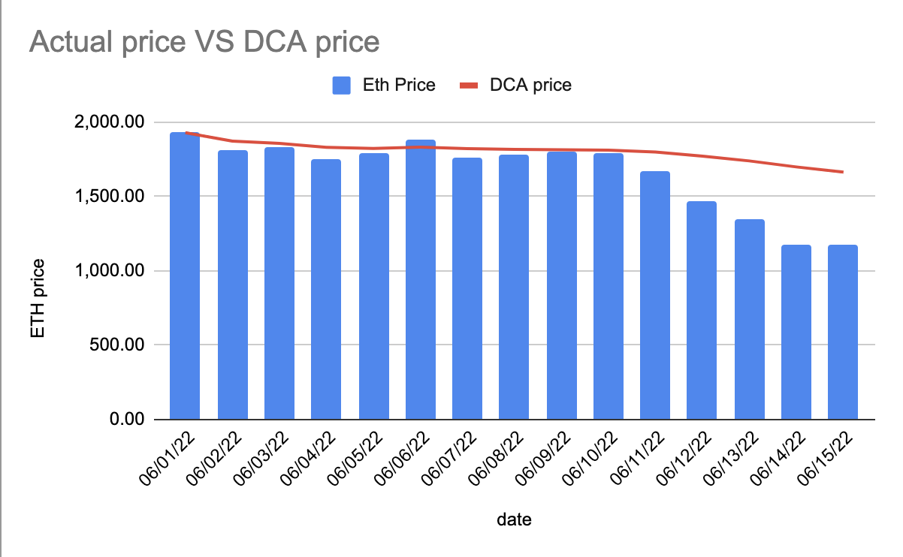
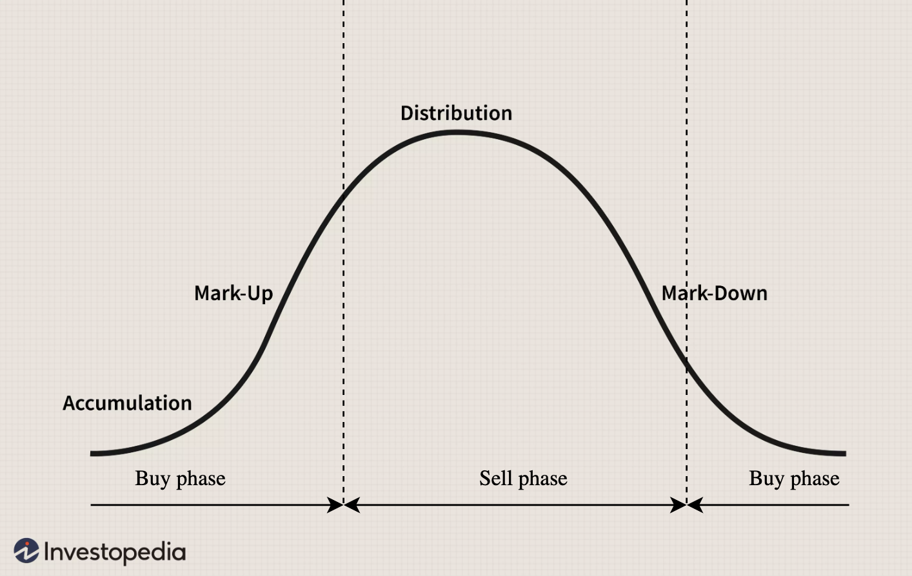
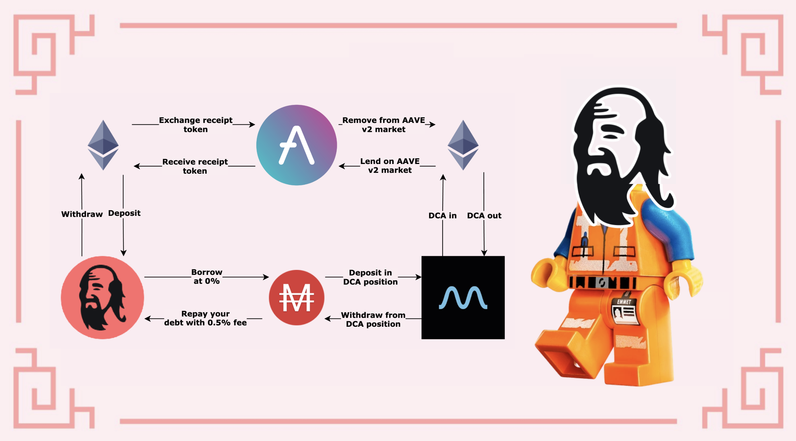

# DCA em mercados de alta e baixa

## Introdução

"Tempo no mercado é muito melhor do que cronometrar o mercado" é algo que você certamente já ouviu. Na verdade, ninguém pode perfeitamente vender no topo ou comprar no fundo. É por isso que a maioria dos investidores usará o DCA (Dollar Cost Average) para acumular o ativo que mais deseja. O DCA consiste em comprar uma pequena quantidade com uma determinada frequência, independentemente do preço. Ao fazer isso, o preço médio de compra é reduzido e você tem mais chances de comprar mais de um determinado ativo em comparação com uma única compra feita na hora errada.

Você pode encontrar mais detalhes sobre o que é Dollar-Cost Averaging no site da [investopedia](https://www.investopedia.com/terms/d/dollarcostaveraging.asp), que dá esta definição:

> Dollar-cost averaging (DCA) é uma estratégia de investimento na qual um investidor divide o valor total a ser investido em compras periódicas de um ativo-alvo em um esforço para reduzir o impacto da volatilidade na compra geral. As compras ocorrem independentemente do preço do ativo e em intervalos regulares.

Este artigo explica como você pode fazer DCA corretamente em seus ativos favoritos para completar seus vaults no Mai Finance, mas você também pode fazer DCA com a stablecoin MAI para obter um preço de venda melhor.


Tenha em mente que uma estratégia que funciona bem em um determinado momento pode ter um desempenho ruim (ou fazer você perder dinheiro) em outro momento. Por favor, mantenha-se informado, monitore os mercados, fique de olho em seus investimentos e, como sempre, faça sua própria pesquisa.


## Entendendo o Dollar Cost Averaging

Vamos ver como você pode fazer DCA em diferentes condições de mercado e o que isso significa em termos de poder de compra/venda.

### DCA em tendência de baixa (mercado baixista)

Quando o mercado já estiver em baixa por bastante tempo e (assim esperamos) perto do fundo, ou pelo menos em um nível de preço que você se sinta confortável para comprar, esse é o momento de acumular seus ativos favoritos e comprar tokens. Porque, é claro, você quer comprar quando o preço estiver baixo para vender quando estiver alto. E aqui temos um exemplo real do preço de ETH na primeira metade de junho de 2022:

| Data     | Preço de ETH em USD |
| -------- | ------------------- |
| 06/01/22 | 1,928.60            |
| 06/02/22 | 1,814.00            |
| 06/03/22 | 1,826.39            |
| 06/04/22 | 1,751.69            |
| 06/05/22 | 1,791.55            |
| 06/06/22 | 1,876.70            |
| 06/07/22 | 1,756.89            |
| 06/08/22 | 1,776.58            |
| 06/09/22 | 1,798.50            |
| 06/10/22 | 1,791.43            |
| 06/11/22 | 1,668.25            |
| 06/12/22 | 1,467.21            |
| 06/13/22 | 1,349.25            |
| 06/14/22 | 1,170.75            |
| 06/15/22 | 1,169.67            |

Esta é uma queda no preço de 39,35% para a primeira quinzena de junho, que antecedeu um mês desastroso de maio. Agora, supondo que você comprou um pouco de ETH todos os dias durante o mesmo período de tempo, este é o preço médio pelo qual você teria comprado ETH:

| Date     | average DCA price |
| -------- | ----------------- |
| 06/01/22 | 1,928.60          |
| 06/02/22 | 1,871.30          |
| 06/03/22 | 1,856.33          |
| 06/04/22 | 1,830.17          |
| 06/05/22 | 1,822.45          |
| 06/06/22 | 1,831.49          |
| 06/07/22 | 1,820.83          |
| 06/08/22 | 1,815.30          |
| 06/09/22 | 1,813.43          |
| 06/10/22 | 1,811.23          |
| 06/11/22 | 1,798.23          |
| 06/12/22 | 1,770.65          |
| 06/13/22 | 1,738.23          |
| 06/14/22 | 1,697.70          |
| 06/15/22 | 1,662.50          |

Com preço médio de US$ 1.662,50 e preço final de US$ 1.169,67, a queda passa de mais de 39% para 29,64%. Nesse sentido, o DCA reduz suas perdas. Isso também significa que, para equilibrar, você precisa que o preço volte para US$ 1.662,50 em vez de US$ 1.928,60, e caso o preço volte para US$ 1.928,60, você teria um lucro de 16%.

Uma coisa interessante a notar é que se você vendesse seu ETH por USDC (ou outra stablecoin como MAI) no mesmo período, seu preço médio de venda também teria sido de $ 1.662,50, e você teria vendido a um preço melhor todos os dias, exceto para o 6 de junho. Isso prova mais uma vez que o DCA é muito melhor do que tentar cronometrar o mercado.

### DCA em tendência de alta (mercado altista)

Quando o mercado está subindo, você também pode querer fazer DCA em ativos específicos para reduzir o preço médio de compra enquanto o preço está subindo. Obviamente, você quer fazer isso no início do período de mark-up do principal ciclo de mercado, e é por isso que é altamente recomendável fazer DCA mesmo em uma tendência de alta. Por exemplo, aqui está o preço de ETH para a primeira metade de outubro de 2021.

| Data     | Preço de ETH em USD |
| -------- | ------------------- |
| 10/01/21 | 3,001.13            |
| 10/02/21 | 3,308.87            |
| 10/03/21 | 3,390.77            |
| 10/04/21 | 3,418.78            |
| 10/05/21 | 3,381.78            |
| 10/06/21 | 3,516.57            |
| 10/07/21 | 3,576.81            |
| 10/08/21 | 3,587.83            |
| 10/09/21 | 3,560.00            |
| 10/10/21 | 3,575.02            |
| 10/11/21 | 3,419.73            |
| 10/12/21 | 3,546.48            |
| 10/13/21 | 3,492.75            |
| 10/14/21 | 3,604.96            |
| 10/15/21 | 3,790.15            |

Isso é mais ou menos o oposto da seção anterior, onde o preço do ETH saltou +26,29% em 15 dias. Então, se você tivesse sorte e comprasse no dia 1º de outubro, esse seria o lucro que você teria ao vender no dia 15. Em vez disso, se você tivesse investido todos os dias durante o período, aqui está o preço médio pelo qual você compraria ETH:

| Date     | ETH price in USD |
| -------- | ---------------- |
| 10/01/21 | 3,001.13         |
| 10/02/21 | 3,155.00         |
| 10/03/21 | 3,233.59         |
| 10/04/21 | 3,279.89         |
| 10/05/21 | 3,300.27         |
| 10/06/21 | 3,336.32         |
| 10/07/21 | 3,370.67         |
| 10/08/21 | 3,397.82         |
| 10/09/21 | 3,415.84         |
| 10/10/21 | 3,431.76         |
| 10/11/21 | 3,430.66         |
| 10/12/21 | 3,440.31         |
| 10/13/21 | 3,444.35         |
| 10/14/21 | 3,455.82         |
| 10/15/21 | 3,478.11         |

Com um preço médio de $3.478,11 e um preço final de $3.790,15, você obteria um ganho de 15,89% vendendo no dia 15. Nesse caso, o preço do DCA é sempre inferior ao preço de mercado, exceto no dia 11 de outubro, o que significa que você sempre poderá vender o ativo adquirido com um benefício.

Nesta situação, você também pode fazer DCA em stablecoins usando seu Ether. Com um preço médio de venda de $3.478,11, você teria um lucro melhor do que a venda à vista nos primeiros 5 dias ou no 11º. Isso é particularmente bom se você deseja capturar benefícios, pagar um empréstimo ou acumular stablecoins para a próxima vez que o mercado cair. Você também pode querer "economizar" preços altos em stablecoins para obter rendimentos em tempos incertos, quando seus ativos voláteis correm o risco de cair.

### Ciclos de mercado e DCA

Esteja você investindo em criptomoedas ou no mercado de ações, provavelmente notou que os mercados são cíclicos. Mais uma vez, você pode ler mais sobre os ciclos de mercado na [Investopedia](https://www.investopedia.com/trading/market-cycles-key-maximum-returns/), mas aqui estão as principais coisas que você precisa saber:

* Os mercados se movem em quatro fases; entender como funciona cada fase e como se beneficiar é a diferença entre tropeçar e prosperar.
* Na fase de acumulação, o mercado chegou ao fundo do poço e os primeiros adeptos e os contrários veem uma oportunidade de entrar e conseguir descontos.
* Na fase mark-up, o mercado parece ter se estabilizado e a maioria inicial está voltando, enquanto o dinheiro inteligente está sendo sacado.
* Na fase de distribuição, o sentimento se torna misto a levemente baixista, os preços estão agitados, os vendedores prevalecem e o fim do rali está próximo.
* Na fase mark-down, os atrasados tentam vender e salvar o que podem, enquanto os adeptos iniciais procuram sinais de um fundo para que possam voltar.

Os pontos de inflexão são o momento em que você precisa mudar de comprador para vendedor em sua estratégia de DCA:

## DCA em ativos voláteis usando Mai Finance e Mean Finance

### Mai Finance

[Mai Finance](https://app.mai.finance) é um protocolo de empréstimo no qual você poderá depositar ativos específicos como garantia e tomar emprestado a stablecoin MAI com 0% de juros. Para este guia específico, vamos supor que queremos converter o DCA em ETH a partir de um portfólio existente que já contém o equivalente a US$ 1.000 em ETH. No aplicativo descentralizado, você poderá:

* depositar o ETH em um cofre ETH
* tomar emprestado MAI contra sua garantia

Para limitar os riscos, assumiremos que você toma emprestado $300 em MAI para manter uma CDR (Colateral to Debt Ratio) saudável.

### Mean Finance

[Mean Finance](https://mean.finance/) é um aplicativo automatizado onde você poderá configurar uma posição de DCA que comprará automaticamente ativos específicos usando outros ativos, com uma determinada frequência durante um determinado período de tempo.

Uma vez criado, você poderá ver o desempenho de sua posição de DCA, bem como o histórico de todos os swaps.

Como você pode ver acima, a estratégia DCA está comprando ETH a cada 4 horas e comprando 1,61 MAI de ETH. Uma frequência mais alta refletirá a volatilidade do ativo visado mais do que uma troca menos frequente.

É importante notar algumas coisas sobre a Mean Finance:

* As posições são NFTs, o que significa que você é o único com acesso à posição.
* Por ser um NFT, você pode transferir a propriedade para outro endereço.
* Você pode retirar o ativo já trocado a qualquer momento. Isso é particularmente útil se o preço médio for muito inferior ao preço de mercado atual e você quiser vender o que já converteu.
* Você pode atualizar a duração e a taxa da estratégia DCA conforme desejar. Isso é mais uma vez particularmente útil se você puder retirar e vender o ativo trocado com um lucro substancial e reinvestir em sua posição de DCA.
* You can terminate the position at any moment and withdraw both the swapped asset as well as the collateral used to make purchases.

### DCA Strategy

The strategy for this guide is more or less what has been explained in the sections above.

Assuming you want to accumulate Ether, you will have to

* You can zap your ETH into the camWETH vault on Mai Finance in order to collect rewards from AAVE v2 lending market
* Borrow MAI to keep a healthy CDR
* Feed your MAI in Mean Finance for a given period of time
* At the end of the DCA period collect your WETH
* Repeat by topping off your vault

The idea here is that you may be able to borrow more or less MAI every time you renew your DCA position, depending on the market price and the health factor of your vault on Mai Finance. This strategy will allow you to slowly accumulate Ether using a DCA approach instead of leveraging everything at once. Topping off your vault is also a good way to keep a healthy CDR.

If you prefer selling your Ether, you can do the opposite loop and DCA into stable coins to repay your loan on Mai Finance:

* Feed WETH into Mean Finance for a given period of time and DCA out for MAI
* At the end of the DCA period, collect your MAI
* Repay your loan from Mai Finance
* Zap out your camWETH tokens from the vault and collect WETH
* Repeat by selling more WETH via Mean Finance

If you're doing this correctly, you will normally be able to fully repay your loan and end up with more Ether than what you originally deposited.

Alternatively, you can use the MAI loan to farm yields, and convert the rewards to a stablecoin that will be used to feed the DCA engine from Mean Finance.

## Disclaimer

Everything presented in this tutorial is educational content made to illustrate how you can use Dollar Cost Average to average the price of volatile assets and hopefully accumulate them in a sustainable manner. The goal here is to build wealth over a long period of time using automated tools rather than buying and selling with your feelings.

This strategy also presents some risks if you don't analyze the entire market. Indeed, if you start buying at the top of the cycle, DCA'ing will obviously not work that well and will take a lot of time before the average purchase price reaches an adequate market price. And your vault may be at risk if you use all your loan to DCA into a volatile asset while the market is at the beginning of a downtrend. As always, make sure you understand properly where the market is going before investing.


Keep in mind that a strategy that works well at a given time may perform poorly (or make you lose money) at another time. Please stay informed, monitor the markets, keep an eye on your investments, and as always, do your own research.

