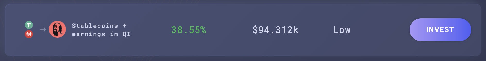
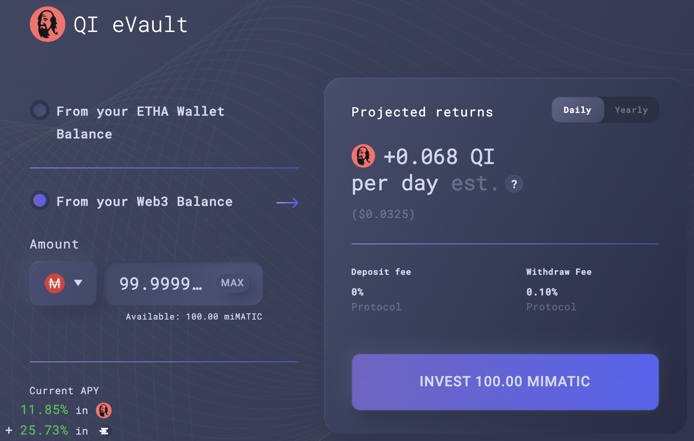

# Staking único de MAI com Ethalend

## Introdução

Uma da missōes deste website e a coleção de tutoriais que são ofericidos é fazer o DeFi amigável pela desmistificação dos protocólos mais complexos. Esta visão é também compartilhada pelo time atrás da [Ethalend](https://www.ethalend.org), e este guia irá apresentar uma maneira perfeita para usar estar plataforma junto com a Mai Finance para amplificar seu rendimento de farming em stablecoins.

## Apresentando a Ethalend

### O que é Ethalend

Ethalend é um protocolo componível que abstrai a complexidade no DeFi para prover rendimentos otimizados por algoritmos. Não se trata de um agregador de rendimentos, mas de um otimizador de rendimentos. Você será capaz de depositar átivos na plataforma, e o algoritmo encarregado da pool em que você depositou seus ativos irá, na verdade, investí-los da melhor maneira possível. Rendimentos são então distribuidos no token nativo da Ethalend, o token ETHA, assim como alguns tokens parceiros, incluindo Qi da Mai Finance que você pode obter ao depositar seu MAI no eVault MAI-USDT. Você pode ler mais sobre Ethalend pela [documentação oficial,](https://docs.ethalend.org) ou lendo esta excelente[ entrevista do cofundador](https://ambcrypto.com/un-complicating-defi-an-interview-with-ethalend-co-founder-danny-b/).

### Criando sua carteira Ethalend da sua carteira web3

Uma das coisas mais interessantes sobre a Ethalend é que a aplicação usa uma carteira on-chain dedicada que não está conectada a sua carteira web3. Isso pode ser considerado como:

* uma vantagem, já que todo risco contratual é limitado ao que é exposto nesta carteira privada. Além disso, algumas interaçōes entre a aplicação Ethalend e a carteira privada são direamente incluidas no uso da plataforma, o que pode te poupar algumas taxas de transaçōes. A propósito, a carteira inteligente ETHA é sem custódia, o que significa que apenas você terá acesso a carteira, não é como uma carteira centralizada que controla a parcela correspondente a sua carteira.
* uma desvantagem, porque adiciona complexidade em sua rotina, e a carteira inteligenta ETHA não é compativel com dispositivos físicos.

Caberá a você decidir se as vantagens estão trazendo valor suficiente para vencer as desvantagens. Quando você estiver pronto para criar a sua carteira, simplesmente clique no botão `Create Wallet` na parte superior direita da sua tela.

Tudo pronto para usar o protocolo!

## Visão geral da estratégia

Esta estratégia pode ser adicionada ao seu leque de estratégias relativamente seguras, já que usará farming de stablecoins em sua raíz, e rendimentos adicionais serão providos graças aos ativos mais voláteis das recompensas da posição em stablecoins.

### Staking único de MAI e ganhos

Uma das grandes vantagens da Ethalend, e uma das funçōes que permite simplificar o DeFi, é que não você precisar fornecer um par LP (**L**iquidity **P**roviding, Provedor de Liquidez) composto de 2 ativos com uma proporção de 1:1. O algoritmo que administra a pool (ou eVault no nosso caso) irá fazer automaticamente para você. Além disso, a partir do momento que você deposita seus ativos no eVault, eles serão roteados automaticamente ao melhor protocolo que irá maximizar seu rendimento. Será feito farming com os tokens de recompensas e então serão convertidos para você regularmente.

Como você pode ver, detalhes das recompensas são exibidos no canto direito da sua tela. As recompensas ETHA não são exibidas, mas você consegue uma estimativa das recompensas em Qi associadas ao seus depósit. Se você descer a página, você também terá um bom entendimento das estratégia subjacente que está usando a QuickSwap no nosso caso. Recompensas em QUICK serão convertidas em recompensas Qi. Recompensas ETHA são cunhadas pelo protocolo para te incentivar a usar a plataforma deles ao invés da QuickSwap.


Preste atenção às taxas de retirada de 0.10%. No momento atual, com um depósito de 100 MAI, terei que pagar 0.1 de MAI em taxas, o que corresponde praticamente a 10 dias de farming no eVault. Tenha certeza que você entendeu isso antes de investir.


### Staking de ETHA: Ethalend ou QuickSwap

A recompensa principal que você obterá por emprestar seu MAI na Ethalend será paga em ETHA, o token nativo da Ethalend. Uma das principais vantagens da Ethalend é que você será capaz de fazer staking com seus tokens ETHA diretamente na plataforma e aumentar seus rendimentos.

Como você pode ver, a melhor opção é depositar o ETHA recebido da pool ETHA-QUICK. Devido a natureza volátil dos 2 ativos, a recompensa é bem alta. Você pode reduzir o Impermanent Loss depositando seu ETHA na pool ETHA-USDT se preferir. Em ambos os casos, você será recompensado em tokens QUICK. E obviamente, se você está otimista em relação a ETHA, você pode realizar staking com suas recompensas na pool ETHA para mais ETHA.

Os vaults de staking na Ethaland são na verdade uma conveniência oferecida pela Ethalend. Ao depositar seus tokens na pool, o algoritmo irá vender alguns dos tokens depositados para comprar o outro lado do par LP, e usar este par na QuickSwap. A propósito, você pode fazer isso manualmente: reivindique seus tokens ETHA, saque os mesmos para sua carteira web3, venda 50% para comprar tokens QUICK, monte alguns LP tokens, e deposite-os na pool da QuickSwap:


A QuickSwap entrega um APY 223.1% APY para o par ETHA-QUICK, enquanto a Ethalend exibe um APR de 116.73% APR para o mesmo par. Isso acontece devido a diferença entre o APY (**A**nnual **P**ercentage **Y**ield, or recompensas acumuladas automaticamente) e APR (**A**nnual **P**ercentage **R**evenue, ou recompensas não acumuladas automaticamente). As 2 taxas representam, na verdade, a mesma coisa, então não importa qual plataforma você escolher para depositar seus tokens.&#x20;


### O Vault Mai de dQUICK

A melhor maneira de usar suas recompensas QUICK obtidas do staking de ETHA é convertê-las em dQUICK. Dai, dQUICK pode ser criado na Dragon's Lair da QuickSwap. É a maneira que a QuickSwap incentiva os usuários a fazerem staking de seu QUICK, recompensando os mesmos com mais QUICK: ao bloquear seus tokens QUICK na QuickSwap, você recebe mais tokens.


O APY de dQUICK varia muito, entre 20% e 40%, dependendo da quantidade de tokens QUICK que estão passando por staking na plataforma.


Mas uma das melhores coisas sobre dQUICK, é o fato do token ser uma prova de depósito que pode ser utilizada na Mai Finance como garantia. Isso significa que, após você depositar suas recompensas QUICK da Ethalend na QuickSwap e receber dQUICK, você pode ir a Mai Finance e depositar os tokens dQUICK no Vault dQUICK para usá-los como garantia, e tomar MAI emprestado.

Algumas coisas sobre os vaults dQUICK:

* Eles possuem taxa de liquidação de 130%, o que significa que você será capaz de tomar bastante MAI emprestado, tendo seus tokens dQUICK como garantia. Entretando, se você quiser coletar taxas de empréstimo também, você precisará manter uma CDR (**C**ollateral to **D**ebt **R**atio, Proporção de Garantia para Dívida) entre 155% e 400%. Isso é uma boa ideia já que o token QUICK é bem volátil, e como regra geral, este website estimula uma CDR de 100% sobre a proporção de liquidação (ou 230% para dQUICK).
* Vaults dQUICK estão entre aqueles com os maiores APRs ao tomar emprestado MAI, com dQUICK como garantia. No momento, você pode obter até 39.40% de APR pago em tokens Qi baseado na quantidade de MAI que você tomará emprestado, com o seu MAI de garantia.

Você pode ver que fornecer dQUICK é muito interessante já que você terá um ativo que recebe recompensas QUICK reacumuladas da QuickSwap, você obterá recompensas em Qi de seu empréstimo, e você cunhará mais MAI que pode ser então adicionado de volta no eVault na Ethalend, aumentando sua posição de farming em stablecoins.

### O que fazer com suas recompensas em Qi&#x20;

Este assunto é explicado neste [artigo](what-to-do-with-qi-on-polygon.md). Para este tutorial, nós iremos simplesmente depositar o Qi na pool Qi-BAL da Balancer para obtermos um APR excelente, pago em Qi e BAL adicionais, que podem ser reacumulados na mesma pool.

## Bootstrapping

A seguir veremos uma simulação feita com um investimento inicial de $100 de MAI que você pode tomar emprestado de um vault existente, ou comprar em uma DEX. É assumido que todos os APRs e APYs permanecem os mesmos durante o período de 1 ano, e que os tokens mantém o mesmo valor, o que obviamente é impossível.

### 1.º Dia

No primeiro dia, você depositará seu MAI na Ethalend na pool MAI-USDR, então receberá a recompensa em ambos Qi e ETHA no final do dia.

| Tipo de recompensa | Valor em dólares |
| ------------------ | ---------------- |
| Mai na Ethalend    | 100.000          |
| Qi+BAL na Balancer | 0.032            |
| ETHA na Ethalend   | 0.070            |
| dQUICK na Mai      | 0.000            |
| dívida na Mai      | 0.000            |

### 2.º Dia

No segundo dia, você poderá fazer staking de ETHA do primeiro dia na Ethalend, que irá gerar recompensas QUICK que podem ser convertidas em dQUICK na QuickSwap, depositadas na Mai Finance, e as usando como garantia, você será capaz de tomar MAI emprestado. Você também poderá depositar seu Qi na pool da Balancer. No final do segundo, dia você terá:

| Tipo de recompensa | Valor em dólares |
| ------------------ | ---------------- |
| Mai na Ethalend    | 100.000          |
| Qi+BAL na Balancer | 0.065            |
| ETHA na Ethalend   | 0.141            |
| dQUICK na Mai      | 0.000            |
| dívida na Mai      | 0.000            |

Deste ponto em diante, o sistema passou por bootstrapping, e você poderá aumentar a sua posição em MAI, assim como ganhar recompensas em Qi, BAL, ETHA e dQUICK. Perceba que alguns valores são muito baixos para serem relevantes neste ponto, e como você não será capaz de tomar emprestado menos de 0.01 MAI, você terá que acumular dQUICK por 14 dias antes de poder fazer isso.

## Resultados do Farming

### Rotina diária

A rotina diária de farming é compsota de:

* Colher as recompensas de Qi e ETHA da pool MAI-USDT na Ethalend
* Depositar os tokens Qi na pool Balancer
* Depositar os tokens ETHA na pool ETHA-QUICK na Ethalend
* Colher recompensas QUICK da pool ETHA-QUICK na Ethalend
* Converter QUICK em dQUICK na QuickSwap
* Depositar dQUICK no vault dQUICK na Mai Finance
* Tomar MAI emprestado do vault dQUICK na Mai Finance
* Depositar o MAI emprestado na pool MAI-USDT na Ethalend

Além disso, você será capaz de colher e reacumular as recompensas Qi e BAL semanalmente.

### Resultados mensais brutos

Abaixo estão os resultados brutos no fim da cada mês:

| Dia | Mai na Ethalend | Qi na Balancer | ETHA na Ethalend | dQUICK na Mai | Dívida de MAI |
| --- | --------------- | -------------- | ---------------- | ------------- | ------------- |
| 30  | 100.046         | 1.015          | 2.186            | 0.099         | 0.049         |
| 60  | 100.196         | 2.116          | 4.303            | 0.406         | 0.203         |
| 90  | 100.453         | 3.315          | 6.424            | 0.926         | 0.463         |
| 120 | 100.819         | 4.624          | 8.553            | 1.666         | 0.833         |
| 150 | 101.297         | 6.058          | 10.690           | 2.631         | 1.315         |
| 180 | 101.892         | 7.632          | 12.838           | 3.828         | 1.914         |
| 210 | 102.606         | 9.361          | 15.001           | 5.263         | 2.632         |
| 240 | 103.443         | 11.264         | 17.179           | 6.945         | 3.473         |
| 270 | 104.406         | 13.360         | 19.377           | 8.881         | 4.441         |
| 300 | 105.501         | 15.671         | 21.597           | 11.079        | 5.540         |
| 330 | 106.731         | 18.220         | 23.841           | 13.548        | 6.774         |
| 360 | 108.100         | 21.032         | 26.113           | 16.297        | 8.149         |
| 365 | 108.343         | 21.528         | 26.495           | 16.783        | 8.392         |

### 365.º Dia

No final de um ano, você terá:

* $108.343 de MAI na pool MAI-USDT da Ethalend
* $26.495 de ETHA na pool ETHA-QUICK da Ethalend
* $21.528 de Qi na pool Qi-BAL da Balancher
* $16.783 de dQUICK no vault da dQUICK da Mai Finance
* $8.392 em dívidas de MAI na Mai Finance

Isso resulta em um total de $173.149 em ativos, e uma dívida a pagar de $8.392, que corresponde a um APY equivalente de 64.757%. Isso foi alcançado com um investimento inicial de $100 de MAI utilizando uma stable pool como base para nosso farming. Perceba que as taxas de transaçōes não foram consideradas, mas podem influenciar o resultado final. Aqui também assumimos que você reacumulará diariamente durante o ano todo.

## Aviso legal

Tudo apresentado neste tutorial é de cunho educacional, feito apra ilsutrar como você pode usar seu MAI sem vendê-lo, e ainda gerar um APY de mais de 60%, utilizando diferentes protocolos como peças de LEGO. Entretanto, este tutorial não deve ser considerado como conselho financeiro.

Além disso, a estratégia apresenta um loop fechado que não vende token qualquer e cada sistema alimenta o proximo. Entretanto, como pode ver, a posição final em dQUICK não é muito alta, e o empréstimo em MAI provavelmentente não gerará muito Qi. Você pode provavelmente alcançar um APY equivalente (ou melhor), vendendo suas recompensas QUICK garantidas na pool ETHA-QUICK, comprando MAI e adicionando à sua posicao de MAI-USDT.


Tenha em mente que uma estratégia que funciona bem em um periodo de tempo pode performar mal (ou te fazer perder dinheiro) em outro período. Por favor, se informe, monitore os mercados, mantenha um olho em seus investimentos, e como sempre, faça a sua própria pesquisa.

