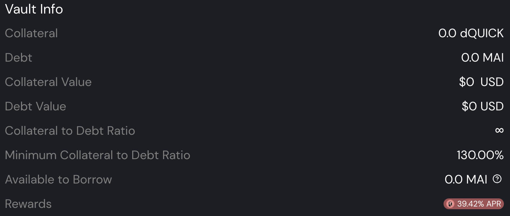
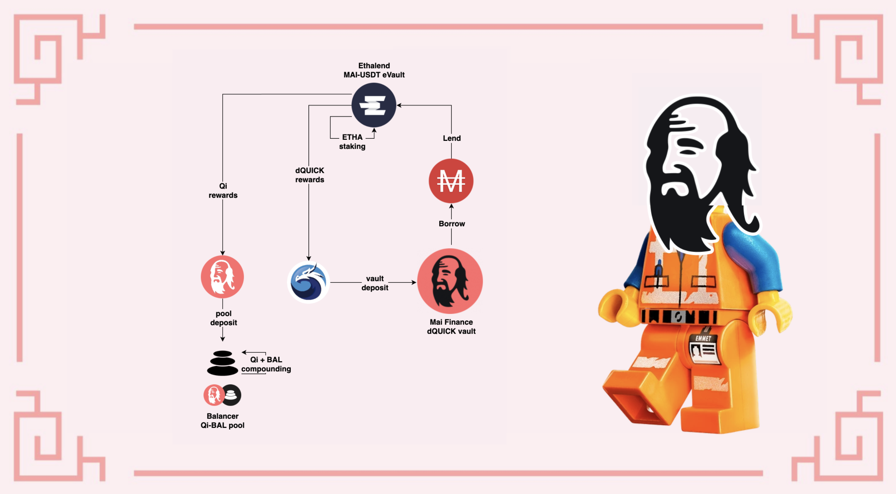

# Staking único de MAI com Ethalend

## Introdução

Uma da missōes deste website e a coleção de tutoriais que são ofericidos é fazer o DeFi amigável pela desmistificação dos protocólos mais complexos. Esta visão é também compartilhada pelo time atrás da [Ethalend](https://www.ethalend.org), e este guia irá apresentar uma maneira perfeita para usar estar plataforma junto com a Mai Finance para amplificar seu rendimento de farming em stablecoins.

## Apresentando a Ethalend

### O que é Ethalend

Ethalend é um protocolo componível que abstrai a complexidade no DeFi para prover rendimentos otimizados por algoritmos. Não se trata de um agregador de rendimentos, mas de um otimizador de rendimentos. Você será capaz de depositar átivos na plataforma, e o algoritmo encarregado da pool em que você depositou seus ativos irá, na verdade, investí-los da melhor maneira possível. Rendimentos são então distribuidos no token nativo da Ethalend, o token ETHA, assim como alguns tokens parceiros, incluindo Qi da Mai Finance que você pode obter ao depositar seu MAI no eVault MAI-USDT. Você pode ler mais sobre Ethalend pela [documentação oficial,](https://docs.ethalend.org) ou lendo esta excelente[ entrevista do cofundador](https://ambcrypto.com/un-complicating-defi-an-interview-with-ethalend-co-founder-danny-b/).

### Criando sua carteira Ethalend da sua carteira web3

Uma das coisas mais interessantes sobre a Ethalend é que a aplicação usa uma carteira on-chain dedicada que não está conectada a sua carteira web3. Isso pode ser considerado como:

* uma vantagem, já que todo risco contratual é limitado ao que é exposto nesta carteira privada. Além disso, algumas interaçōes entre a aplicação Ethalend e a carteira privada são direamente incluidas no uso da plataforma, o que pode te poupar algumas taxas de transaçōes. A propósito, a carteira inteligente ETHA é sem custódia, o que significa que apenas você terá acesso a carteira, não é como uma carteira centralizada que controla a parcela correspondente a sua carteira.
* uma desvantagem, porque adiciona complexidade em sua rotina, e a carteira inteligenta ETHA não é compativel com dispositivos físicos.

Caberá a você decidir se as vantagens estão trazendo valor suficiente para vencer as desvantagens. Quando você estiver pronto para criar a sua carteira, simplesmente clique no botão `Create Wallet` na parte superior direita da sua tela.

Tudo pronto para usar o protocolo!

## Visão geral da estratégia

Esta estratégia pode ser adicionada ao seu leque de estratégias relativamente seguras, já que usará farming de stablecoins em sua raíz, e rendimentos adicionais serão providos graças aos ativos mais voláteis das recompensas da posição em stablecoins.

### Staking único de MAI e ganhos

Uma das grandes vantagens da Ethalend, e uma das funçōes que permite simplificar o DeFi, é que não você precisar fornecer um par LP (**L**iquidity **P**roviding, Provedor de Liquidez) composto de 2 ativos com uma proporção de 1:1. O algoritmo que administra a pool (ou eVault no nosso caso) irá fazer automaticamente para você. Além disso, a partir do momento que você deposita seus ativos no eVault, eles serão roteados automaticamente ao melhor protocolo que irá maximizar seu rendimento. Será feito farming com os tokens de recompensas e então serão convertidos para você regularmente.

Como você pode ver, detalhes das recompensas são exibidos no canto direito da sua tela. As recompensas ETHA não são exibidas, mas você consegue uma estimativa das recompensas em Qi associadas ao seus depósit. Se você descer a página, você também terá um bom entendimento das estratégia subjacente que está usando a QuickSwap no nosso caso. Recompensas em QUICK serão convertidas em recompensas Qi. Recompensas ETHA são cunhadas pelo protocolo para te incentivar a usar a plataforma deles ao invés da QuickSwap.


Preste atenção às taxas de retirada de 0.10%. No momento atual, com um depósito de 100 MAI, terei que pagar 0.1 de MAI em taxas, o que corresponde praticamente a 10 dias de farming no eVault. Tenha certeza que você entendeu isso antes de investir.


### Staking de ETHA: Ethalend ou QuickSwap

A recompensa principal que você obterá por emprestar seu MAI na Ethalend será paga em ETHA, o token nativo da Ethalend. Uma das principais vantagens da Ethalend é que você será capaz de fazer staking com seus tokens ETHA diretamente na plataforma e aumentar seus rendimentos.

Como você pode ver, a melhor opção é depositar o ETHA recebido da pool ETHA-QUICK. Devido a natureza volátil dos 2 ativos, a recompensa é bem alta. Você pode reduzir o Impermanent Loss depositando seu ETHA na pool ETHA-USDT se preferir. Em ambos os casos, você será recompensado em tokens QUICK. E obviamente, se você está otimista em relação a ETHA, você pode realizar staking com suas recompensas na pool ETHA para mais ETHA.

Os vaults de staking na Ethaland são na verdade uma conveniência oferecida pela Ethalend. Ao depositar seus tokens na pool, o algoritmo irá vender alguns dos tokens depositados para comprar o outro lado do par LP, e usar este par na QuickSwap. A propósito, você pode fazer isso manualmente: reivindique seus tokens ETHA, saque os mesmos para sua carteira web3, venda 50% para comprar tokens QUICK, monte alguns LP tokens, e deposite-os na pool da QuickSwap:


A QuickSwap entrega um APY 223.1% APY para o par ETHA-QUICK, enquanto a Ethalend exibe um APR de 116.73% APR para o mesmo par. Isso acontece devido a diferença entre o APY (**A**nnual **P**ercentage **Y**ield, or recompensas acumuladas automaticamente) e APR (**A**nnual **P**ercentage **R**evenue, ou recompensas não acumuladas automaticamente). As 2 taxas representam, na verdade, a mesma coisa, então não importa qual plataforma você escolher para depositar seus tokens.&#x20;


### O Vault Mai de dQUICK

A melhor maneira de usar suas recompensas QUICK obtidas do staking de ETHA é convertê-las em dQUICK. Dai, dQUICK pode ser criado na Dragon's Lair da QuickSwap. É a maneira que a QuickSwap incentiva os usuários a fazerem staking de seu QUICK, recompensando os mesmos com mais QUICK: ao bloquear seus tokens QUICK na QuickSwap, você recebe mais tokens.


O APY de dQUICK varia muito, entre 20% e 40%, dependendo da quantidade de tokens QUICK que estão passando por staking na plataforma.


Mas uma das melhores coisas sobre dQUICK, é o fato do token ser uma prova de depósito que pode ser utilizada na Mai Finance como garantia. Isso significa que, após você depositar suas recompensas QUICK da Ethalend na QuickSwap e receber dQUICK, você pode ir a Mai Finance e depositar os tokens dQUICK no Vault dQUICK para usá-los como garantia, e tomar MAI emprestado.

Algumas coisas sobre os vaults dQUICK:

* Eles possuem taxa de liquidação de 130%, o que significa que você será capaz de tomar bastante MAI emprestado, tendo seus tokens dQUICK como garantia. Entretando, se você quiser coletar taxas de empréstimo também, você precisará manter uma CDR (**C**ollateral to **D**ebt **R**atio, Proporção de Garantia para Dívida) entre 155% e 400%. Isso é uma boa ideia já que o token QUICK é bem volátil, e como regra geral, este website estimula uma CDR de 100% sobre a proporção de liquidação (ou 230% para dQUICK).
* Vaults dQUICK estão entre aqueles com os maiores APRs ao tomar emprestado MAI, com dQUICK como garantia. No momento, você pode obter até 39.40% de APR pago em tokens Qi baseado na quantidade de MAI que você tomará emprestado, com o seu MAI de garantia.

Você pode ver que fornecer dQUICK é muito interessante já que você terá um ativo que recebe recompensas QUICK reacumuladas da QuickSwap, você obterá recompensas em Qi de seu empréstimo, e você cunhará mais MAI que pode ser então adicionado de volta no eVault na Ethalend, aumentando sua posição de farming em stablecoins.

### O que fazer com suas recompensas em Qi&#x20;

This subject is explained in [a dedicated article](what-to-do-with-qi-on-polygon.md). For the sake of this tutorial, we will simply deposit your Qi in the Qi-BAL pool on Balancer to benefit from a solid APR, paid in additional Qi and BAL tokens that you can compound in the exact same pool.

## Bootstrapping the system

What follows is a simulation made with an initial investment of $100 worth of MAI that you can either borrow from an existing vault, or buy from a DEX platform. It assumes that all current APRs and APYs stay the same over the span of 1 year, and that all tokens keep the same price, which will (of course) never be the case.

### Day 1

On day 1, you will deposit your MAI on Ethalend in the MAI-USDT pool, then you will get the reward in both Qi and ETHA at the end of the day.

| Reward type        | Value in dollars |
| ------------------ | ---------------- |
| Mai on Ethalend    | 100.000          |
| Qi+BAL on Balancer | 0.032            |
| ETHA on Ethalend   | 0.070            |
| dQUICK on Mai      | 0.000            |
| debt on Mai        | 0.000            |

### Day 2

On day 2, you can stake your ETHA from day 1 on Ethalend, which will generate QUICK rewards that you can then convert to dQUICK on QuickSwap, deposit on Mai Finance, and you will be able to borrow MAI against these tokens. You can also deposit your Qi in the Balancer pool. At the end of day 2 you will get:

| Reward type        | Value in dollars |
| ------------------ | ---------------- |
| Mai on Ethalend    | 100.000          |
| Qi+BAL on Balancer | 0.065            |
| ETHA on Ethalend   | 0.141            |
| dQUICK on Mai      | 0.000            |
| debt on Mai        | 0.000            |

From there, the system is bootstrapped, and you will be able to grow your stable position of MAI, as well as get rewards in Qi, BAL, ETHA and dQUICK. Note that some values are too low to be significant at this point, and since you won't be able to borrow less than 0.01 MAI, you will have to accumulate dQUICK for 14 days before being able to borrow MAI.

## Farming Results

### Daily routine

The daily farming routine is composed of

* Harvesting the Qi and ETHA rewards from the MAI-USDT pool on Ethalend
* Deposit the Qi tokens in the Balancer pool on Balancer
* Deposit the ETHA tokens in the ETHA-QUICK pool on Ethalend
* Harvest QUICK rewards from the ETHA-QUICK pool on Ethalend
* Convert QUICK into dQUICK on QuickSwap
* Deposit dQUICK into the dQUICK vault on Mai Finance
* Borrow MAI from the dQUICK vault on Mai Finance
* Deposit additional MAI borrowed in the MAI-USDT pool on Ethalend

Additionally, you will be able to harvest and compound the Qi and BAL rewards weekly.

### Raw results month after month

Below are the raw results at the end of each month:

| day | Mai on Ethalend | Qi on Balancer | ETHA on Ethalend | dQUICK on Mai | MAI debt |
| --- | --------------- | -------------- | ---------------- | ------------- | -------- |
| 30  | 100.046         | 1.015          | 2.186            | 0.099         | 0.049    |
| 60  | 100.196         | 2.116          | 4.303            | 0.406         | 0.203    |
| 90  | 100.453         | 3.315          | 6.424            | 0.926         | 0.463    |
| 120 | 100.819         | 4.624          | 8.553            | 1.666         | 0.833    |
| 150 | 101.297         | 6.058          | 10.690           | 2.631         | 1.315    |
| 180 | 101.892         | 7.632          | 12.838           | 3.828         | 1.914    |
| 210 | 102.606         | 9.361          | 15.001           | 5.263         | 2.632    |
| 240 | 103.443         | 11.264         | 17.179           | 6.945         | 3.473    |
| 270 | 104.406         | 13.360         | 19.377           | 8.881         | 4.441    |
| 300 | 105.501         | 15.671         | 21.597           | 11.079        | 5.540    |
| 330 | 106.731         | 18.220         | 23.841           | 13.548        | 6.774    |
| 360 | 108.100         | 21.032         | 26.113           | 16.297        | 8.149    |
| 365 | 108.343         | 21.528         | 26.495           | 16.783        | 8.392    |

### Day 365

At the end of one year, you would have

* $108.343 worth of MAI in the MAI-USDT pool on Ethalend
* $26.495 worth of ETHA in the ETHA-QUICK pool on Ethalend
* $21.528 worth of Qi in the Qi-BAL pool on Balancher
* $16.783 worth of dQUICK in the dQUICK vault on Mai Finance
* $8.392 worth of MAI debt on Mai Finance

This sums up as $173.149 worth of assets, and an outstanding debt of $8.392, which corresponds to an equivalent APY of 64.757%. This is achieved with an initial investment of $100 worth of MAI and using a stable pool as basis for farming. Note that transaction fees haven't been taken in account, but may influence the final result. This is also assuming you are compounding daily for 1 complete year.

## Disclaimer

Everything presented in this tutorial is educational content made to illustrate how you can use your MAI without selling them, and still generate an APY of more than 60% using different protocols as lego bricks. However, this tutorial should not be considered as financial advice.

Also, the strategy here is presenting a closed loop that doesn't sell any token and each system is feeding the next one. However, as you can see, the dQUICK final position isn't very high, and the MAI loan will probably not generate a lot of Qi. You can probably achieve the same equivalent APY (if not better) by selling the QUICK rewards granted by the ETHA-QUICK pool, buy MAI and add it to your MAI-USDT position.


Keep in mind that a strategy that works well at a given time may perform poorly (or make you lose money) at another time. Please stay informed, monitor the markets, keep an eye on your investments, and as always, do your own research.

