# De Finanças Tradicionais ao DeFi com Jarvis

Nem todas as stablecoins são iguais. Para a maioria dos usuários de DeFi (Finanças Descentralizadas), stablecoins representam uma criptomoeda atrelada ao dólar americano. É o caso de ativos como:

* USDC ou USDT emitidos por entidades centralizadas e lastreados em dólares americanos
* Ativos com garantia em excesso, como DAI ou MAI, que são levemente atrelados ao U.D. dólar, mas apoiados por uma cesta de diferentes criptomoedas&#x20;
* Stablecoins algorítmicas como UST ou MIM que são parcialmente apoiadas e para as quais o peg de $1 é mantido usando um algoritmo específico

Mas você sabia que pode encontrar outras stablecoins? Como exemplo, o TOMB é um token atrelado ao preço FTM (o token de gás nativo da rede Fantom) usando algoritmos.&#x20;

Neste artigo, focaremos em stablecoins atreladas a FIATs (moedas emitidas pelo governo) e tentaremos explicar por que elas são importantes para suas estratégias de investimento.

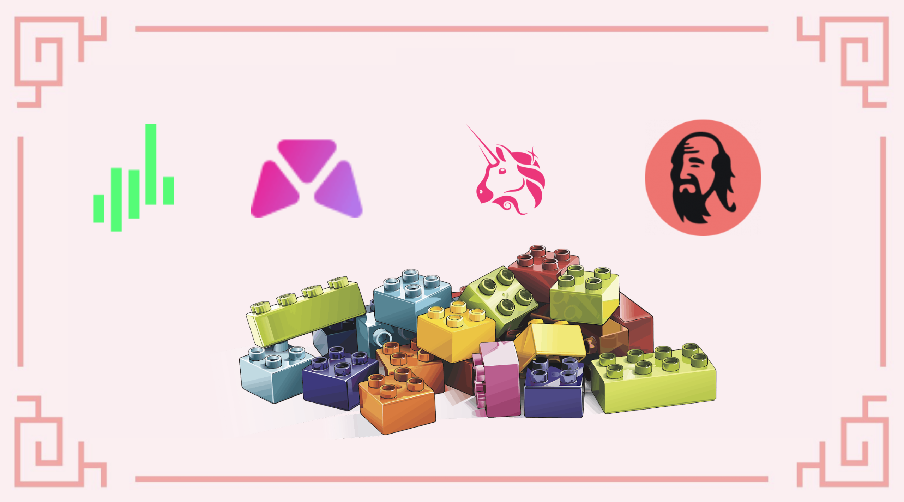


Tenha em mente que uma estratégia que funciona bem em um determinado momento pode ter um desempenho ruim (ou fazer você perder dinheiro) em outro momento. Por favor, mantenha-se informado, monitore os mercados, fique de olho em seus investimentos e, como sempre, faça sua própria pesquisa.


## Por que precisamos de dinheiro sintético?

Vamos considerar que você mora em um país europeu e usa o Euro diariamente. Se você fosse comprar criptoativos, provavelmente os compraria com seus euros. Para ativos voláteis como o Bitcoin, isso realmente não importa, porque você se concentrará no preço do Bitcoin em euros para avaliar se está ou não ganhando dinheiro. E esperançosamente, você vai fazer alguns.

Mas e se você quiser investir em DeFi e produzir farming? E se, para mitigar os riscos, você quiser fornecer liquidez usando apenas stablecoins? A maior parte da liquidez de stablecoins em muitas redes é fornecida como ativos indexados ao USD, o que significa que você terá que comprar USDC/USDT/DAI/MAI usando seus Euros. Neste ponto, você deve verificar se a liquidez que você fornece está gerando juros, mas também se a diferença de preço entre o dólar americano e o euro não está trabalhando contra você.

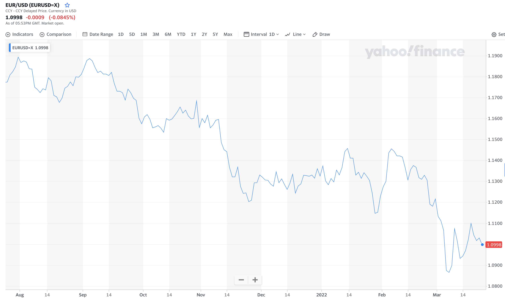

Se você comprou 100€ de USDC no dia 20 de setembro de 2021, você teria $117,29 de USDC porque a relação EUR:USD era de 1:1,1729 naquele momento. Se você converter $117,29 de USDC em Euros hoje (24 de março de 2022) com uma proporção de 1:1,0994, obterá 106,69€, ou um ganho de 6,69%.

Mas se você comprou CAD 100 (100 dólares canadenses) de USDC no mesmo dia (20 de setembro de 2021) com uma proporção de 1:0,7796, você teria $77,96 de USDC. Convertê-los hoje para CAD com uma proporção de 1:0,7972 valeria CAD 97,79, ou uma perda de 2,21%.

No entanto, 1 CAD sempre é igual a 1 CAD, não importa o que aconteça, como 1 USD = 1 USD e 1 EUR = 1 EUR.

Cada moeda de cada país varia de acordo com a situação geopolítica, política interna e internacional, decisões micro e macroeconômicas. É por isso que você precisa ficar atento à variação de preços de seus ativos de criptomoedas, mesmo que sejam "estáveis".

## Rede Jarvis e Mt. Pelerin

### O que é a Rede Jarvis

[Rede Jarvis](https://jarvis.network/) é um aplicativo especializado que permite aos usuários [trocarem seus criptoativos](https://app.jarvis.exchange/) por moedas fiduciárias (FIAT) sintéticas. Um FIAT sintético é uma criptomoeda atrelada ao preço de um FIAT existente. Como tal, Jarvis permitirá que você troque seus USDCs por:

* jCAD: a versão cripto do dólar canadense
* jEUR: a versão cripto do Euro
* jJPY: a versão criptográfica do iene japonês
* jSGD, jCHF, jGBP, e muitas outras

Como tal, Jarvis é realmente uma Forex On-Chain (Foreign Exchange, Agência de Câmbio) que está ao vivo na Ethereum Mainnet, mas também na Polygon, BNB Chain, Gnosis Chain e Avalanche.

Mas não para por aí. Jarvis propõe pools de liquidez incentivados que incluem jFIATs. Isso é feito para atrair usuários para depositar seus jFIATs e obter rendimentos em suas stablecoins (com a capacidade de depositar um único ativo por meio de pools da Curve), ajudar outros protocolos que oferecem stablecoins sem ter muita liquidez e facilitar para usuários DeFi aumentarem seus ganhos.

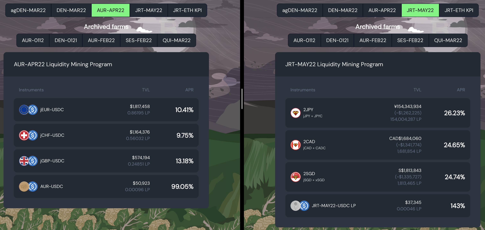


Você pode ver na captura de tela acima que o par 2CAD é composto por jCAD e CADC. O token CADC é na verdade outra versão do dólar canadense fornecida pela [DFX](https://app.dfx.finance/), outra solução Forex descentralizada.


### Mt. Pelerin

[Mt. Pelerin](https://www.mtpelerin.com/bridge-wallet) é uma mesa OTC fiat-cripto sem custódia. Ela permite que os usuários comprem criptomoedas diretamente de sua conta bancária e os depositem diretamente em sua carteira de criptomoedas. Também é um parceiro direto da Jarvis e permite comprar jFIATs.


A maneira mais fácil de usar o Mt. Pelerin é através do aplicativo móvel Bridge Wallet. Observe que, por ser um serviço centralizado, você terá que fornecer informações pessoais para provar sua identidade se quiser usar o serviço. Você também precisa ter um banco que permita fazer transferências bancárias para a Suíça. No entanto, sempre é possível usar o site deles no qual você encontrará um widget que permite comprar criptomoedas por transferência bancária ou cartão de crédito. Isso não está sujeito a nenhum KYC, mas tem algumas limitações. Observe que, ao usar o site, sua compra será enviada diretamente para sua carteira web. No restante deste guia, apresentaremos a solução Bridge Wallet.


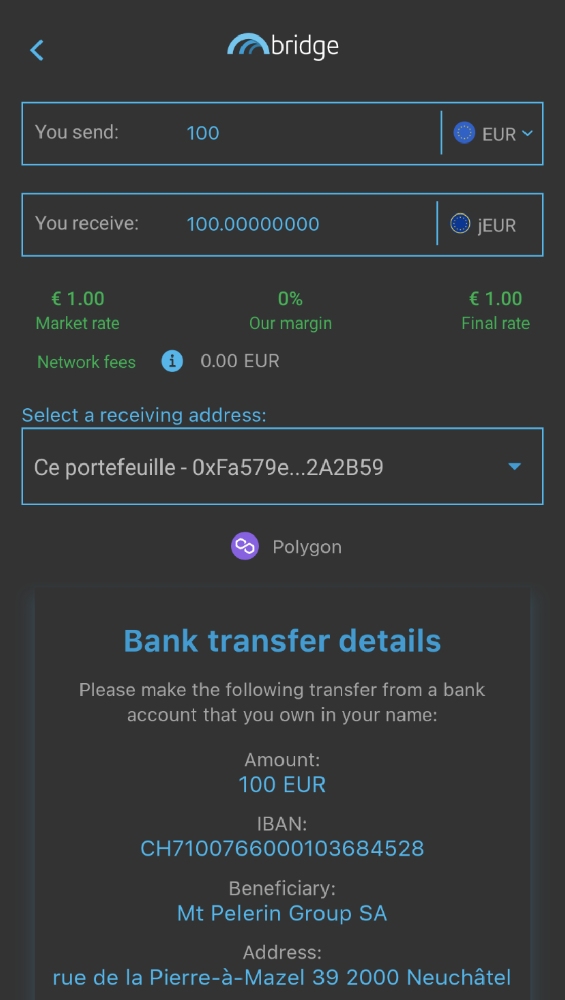

As transferências bancárias podem estar sujeitas a taxas e provavelmente levarão algum tempo para serem concluídas, mas no geral, o Mt. Pelerin permite que você compre e venda facilmente seus FIATs sintéticos por suas contrapartes FIAT. Eles também têm uma [estrutura de taxas](https://www.mtpelerin.com/pricing) internas que você pode estudar com mais detalhes e, dependendo do ativo que você comprar, poderá comprar e vender até $100.000 por ano gratuitamente.

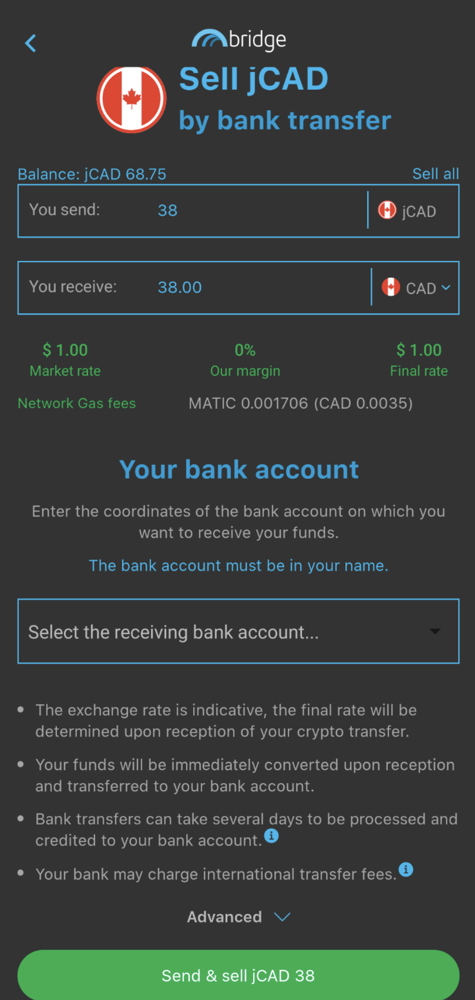


Se você comprou jFIATs, sua conta bancária é automaticamente vinculada à sua conta Bridge Wallet e você poderá selecioná-la na lista suspensa de destinatários. Caso contrário, terá de criar uma nova conta a partir de um IBAN.


### Vincule sua carteira Polygon à sua conta Mt. Pelerin (endereço da carteira Bridge)

Vincular sua carteira à sua conta Mt. Pelerin / Bridge Wallet é muito fácil. Você só precisa:&#x20;

* Abra a guia Endereços na parte inferior
* Clique em `Link an address`
* Tire uma foto do código QR da sua carteira Polygon ou copie e cole o endereço completo no campo
* Envie alguns MATICs para o endereço da Bridge Wallet para validá-lo

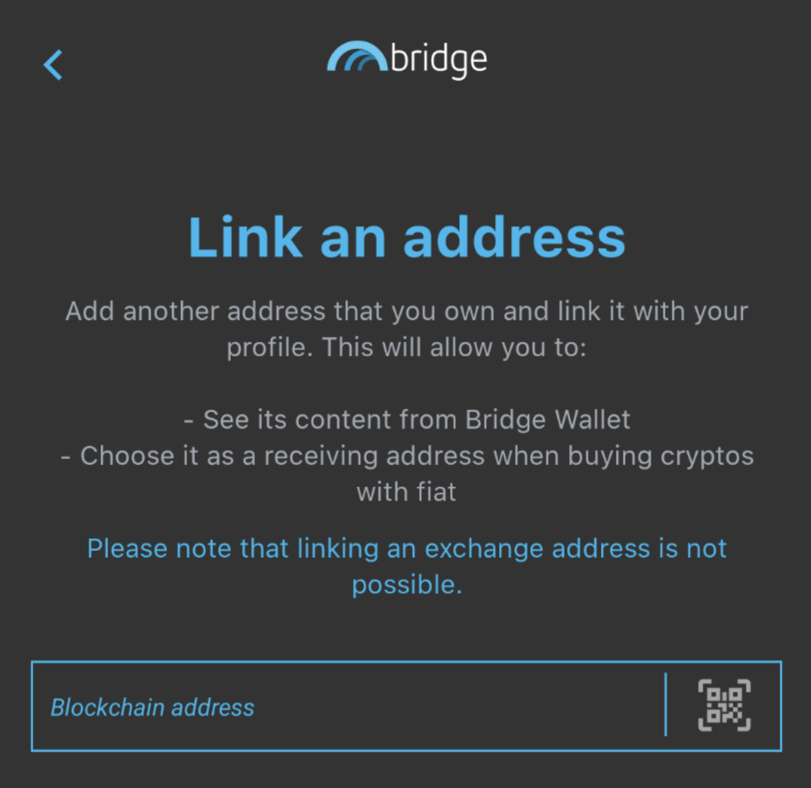

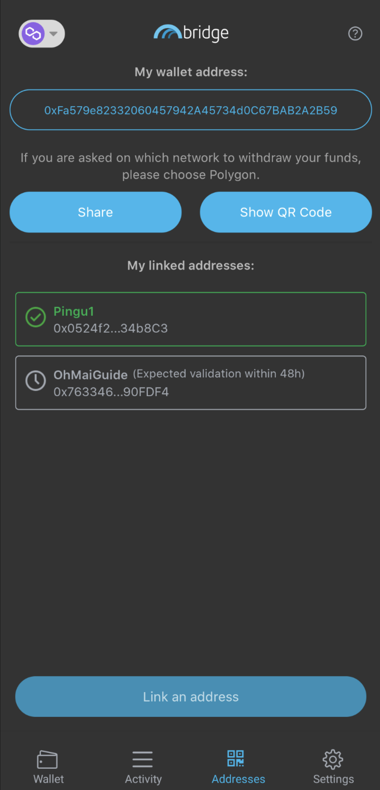


Mais uma vez, você pode usar o widget no site da Mt. Pelerin para comprar e vender suas criptomoedas usando sua carteira da web (ou carteira de hardware) diretamente sem usar a Bridge Wallet. Consulte o site da Mt. Pelerin.


### Enviando jFIATs para sua carteira Polygon

Enviar seus jFIATs para sua carteira na Polygon (ou em qualquer rede suportada) é muito fácil. Na guia Wallet, verifique se você está na rede que deseja usar como destino e carregue suas moedas do jWallet.

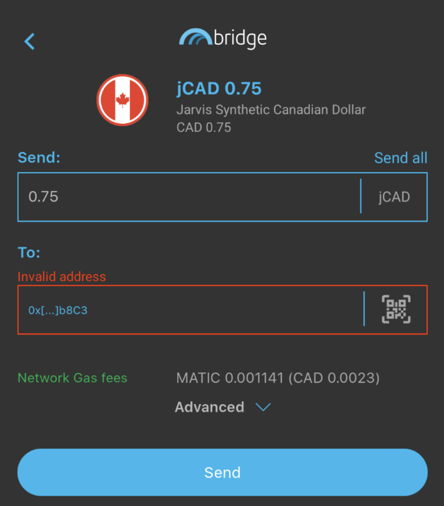

Depois de selecionar o jFIAT que deseja enviar, basta clicar em enviar, preencher os diferentes campos, iniciar a transação e desfrutar de baixo gás e processamento rápido!


Você pode obter uma recapitulação completa de todas as suas transações na seção de atividades de cada jFIAT, bem como na guia Atividade na tela principal.


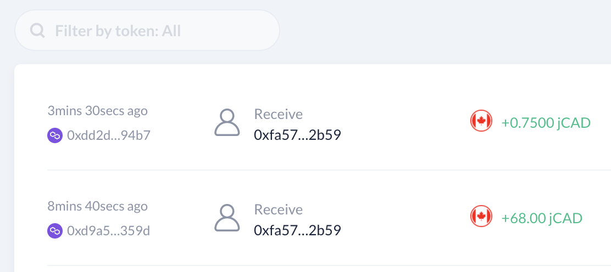


Mt. Pelerin é uma solução muito boa para comprar e vender criptomoedas e FIATs sintéticos. Mas você também pode usar este serviço para enviar dinheiro para seus amigos e familiares se eles também estiverem usando o aplicativo e possivelmente contornar transferências bancárias complexas ou limitações.


## Obtendo o melhor de seus jFIATs&#x20;

Você tem FIATs sintéticos na Polygon, então agora precisamos de uma maneira inteligente de usá-los. Na introdução, vimos que pode ser uma ideia melhor usá-los como estão em vez de trocá-los (vendê-los) por stablecoins atreladas ao dólar.

Pense também neste cenário: você tem dólares canadenses e quer um pouco de exposição ao Ethereum. Não seria bom se você pudesse comprar Ethereum sem correr o risco de realmente comprá-lo? Bem, é para isso que servem os mercados de empréstimos!

### Market.xyz

[Market.xyz](https://www.market.xyz/) é um protocolo de empréstimo onde você poderá usar alguns de seus criptoativos como garantia para tomar emprestado outros ativos. Eles lançaram recentemente uma novo pool 100% dedicada aos FIATs sintéticos da Jarvis: https://polygon.market.xyz/pool/7.

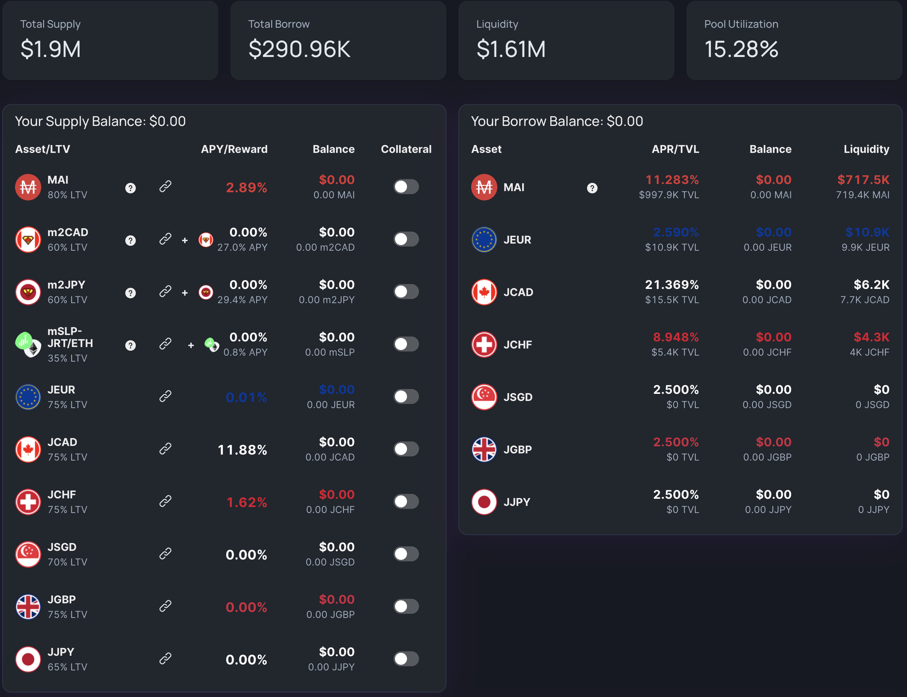

Como você pode ver, você pode emprestar seus jFIATs e ganhar juros dos mutuários. O armário também aceita alguns tokens LP (Fornecimento de Liquidez) como garantia. Isso significa que você pode emprestar seu m2CAD ou m2JPY e ainda ganhar um APY de \~27% (Rendimento Percentual Anual) sobre eles e emprestar outros jFIATs como jCAD ou jJPY para alavancar sua posição. Você também pode emprestar alguns MAI, a stablecoin atrelada ao dólar criada pelo protocolo QiDAO por trás do Mai Finance. A comunidade QiDAO concordou em fornecer novos MAI regularmente para manter uma baixa taxa de juros nos empréstimos MAI do locker Jarvis no Market.xyz.


Há um valor mínimo de empréstimo de 0,05 ETH nos lockets do Market.xyz, o que equivale a US$ 150 em março de 2022. Como você precisa manter uma proporção de garantia para dívida saudável, certifique-se de depositar garantia suficiente se quiser fazer um empréstimo na plataforma.


Como para qualquer plataforma de empréstimo na Polygon, o Market.xyz aplicará um índice de garantia para dívida saudável. É o que representa o LTV de cada garantia (Loan To Value, o inverso do CDR). Como exemplo, o LTV do m2CAD é de 60%, o que significa que a relação entre sua dívida e seu valor de garantia precisa permanecer acima de 60%.

No caso do m2CAD, a garantia é atrelada ao dólar canadense, que pode variar em relação ao MAI que você tomará emprestado (atrelado ao dólar americano). No entanto, a variação é muito pequena, então, em teoria, você pode tomar emprestado muito perto do limite de 60%. Para o nosso guia, tentaremos manter um CDR de 200%, o que corresponde a um LTV de 0,4 (1 / 2,5 = 0,5). Para poder tomar emprestado o valor de MAI de 0,05 ETH necessário, precisaremos de uma garantia no valor de:

$$
GarantiaDisponível = \frac{Valor De Dívida}{LTV} = \frac{0.05 ETH}{0.4} = 300\$
$$

Como hoje a relação USD:CAD é de 1:0,7972, precisarei de um investimento inicial de:

$$
InvestimentoCAD = \frac{300}{0.7972} = 376.32 CAD
$$


Supondo que eu invista $300 em CAD e tome emprestado $150 em MAI, atualmente ganharei um APY de 27% (ou um APR de 23,91%) em minha garantia e terei que pagar 11,28% de juros sobre meu empréstimo. Ao longo de 1 ano, isso representa um crescimento de $81 em minha garantia e $16,92 em juros a pagar.


Agora vamos ver o que fazer com seu empréstimo atrelado ao dólar.

### Uniswap V3

[Uniswap V3](https://app.uniswap.org/) é a versão mais recente do Uniswap, o projeto pai de muitas DEXes (Decentralized Exchanges) onde os usuários poderão trocar seus ativos por outras criptomoedas, bem como fornecer liquidez para suportar esses swaps.

A Uniswap V3 não é incentivada na Polygon (ainda), mas oferece uma nova maneira de fornecer liquidez: liquidez concentrada! Você seleciona o intervalo no qual deseja fornecer liquidez e, se o intervalo for muito estreito, você ganha mais taxas do que os usuários que fornecem liquidez em um intervalo mais amplo. Você pode aprender como fornecer pares de liquidez no Uniswap V3 com seu guia oficial e também assistir ao incrível [video da Finematics sobre a UniswapV3](https://youtu.be/Ehm-OYBmlPM).

Para este tutorial, vamos nos concentrar no par MAI-USDC, pois pegamos emprestado um pouco de MAI e queremos limitar a exposição ao risco cultivando stablecoins.

A primeira coisa a fazer é definir um intervalo alvo. Agora que o preço da MAI está muito mais estável devido à liquidez cada vez maior, mais pools e alguns mecanismos como o pool Curve que ajudam a manter o preço muito estável, visaremos uma taxa de 1:1 para MAI:USDC. Na realidade, 1 MAI está mais próximo de 0,998 USDC.

A faixa de preço esperada está entre 0,99 e 1,01 USDC para 1 MAI, dependendo das condições do mercado. Quando os ativos voláteis estão aumentando, as pessoas têm mais poder de empréstimo e tendem a trocar muito MAI, diminuindo seu preço. O efeito oposto ocorre quando o mercado encolhe e as pessoas precisam pagar seus empréstimos para evitar a liquidação: o MAI é comprado do mercado para pagar empréstimos, aumentando seu preço. Na verdade, a faixa de preço real tende a ficar entre 0,994 e 1,004 USDC por MAI.

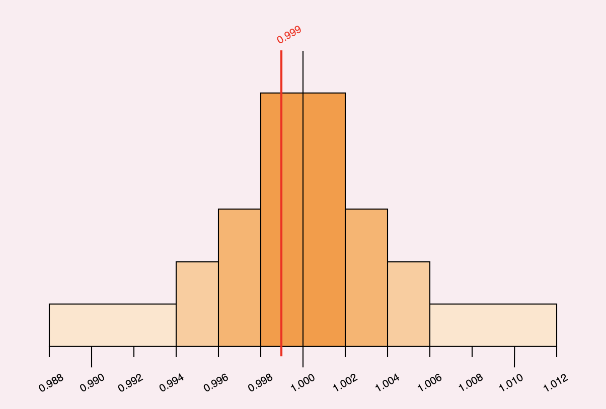

Porém, o que você realmente precisa entender é:

* Se você selecionar uma faixa ampla, receberá menos taxas do que se selecionar uma faixa estreita, porque sua liquidez está espalhada em uma faixa maior&#x20;
* Se selecionar um intervalo estreito e o preço sair desse intervalo, você não receberá taxas&#x20;
* Sua liquidez não é ajustada com base no preço. Se você selecionar um intervalo \[0,99;1,01] para MAI:USDC e o preço de MAI for 0,99 USDC, você terá 100% MAI e 0% USDC. Por outro lado, se o preço for 1,01 USDC por MAI, você terá 100% USDC e 0% MAI&#x20;
* Você pode sair de sua pool de liquidez a qualquer momento e criar uma nova com um intervalo mais amplo / mais estreito se perceber que sua primeira configuração não está coletando taxas suficientes&#x20;
* Para stablecoins, é melhor definir um intervalo de taxa de 0,05% para que agregadores como [zapper](https://zapper.fi/) ou [1inch](https://app.1inch.io/#/137/) escolham seu pool quando os usuários estiverem trocando suas stablecoins

Para a simplicidade deste guia, definiremos um intervalo centrado em 1.000 com um spread de 1% entre 0,995 e 1,005 USDC por MAI.

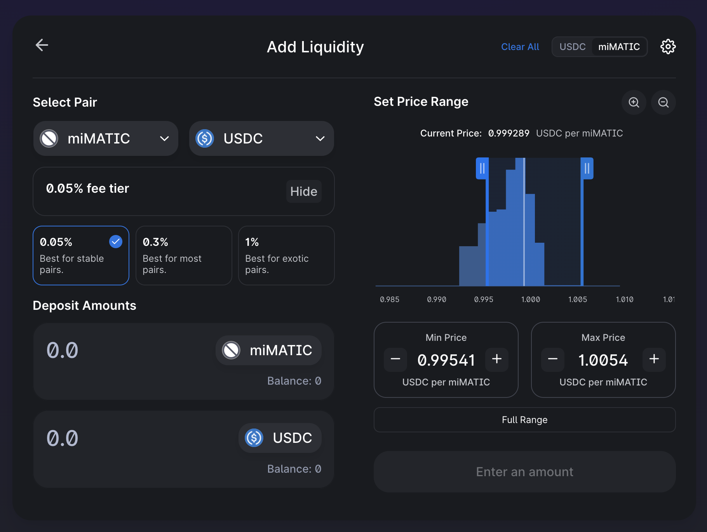


Preste atenção à ordem do token para o seu par. De fato, a faixa de preço não será a mesma se você selecionar MAI (mimatic) primeiro e USDC segundo, ou USDC primeiro e MAI segundo!&#x20;


Dependendo da sua configuração, você pode esperar entre um APR de 8% (faixa ampla) a 20% (faixa estreita) em seu LP pago em MAI e USDC. Isso dependerá muito da ação do preço e do volume de negócios operados no UniswapV3. Tenha em mente que você também pode usar esta ferramenta para operar suas negociações com um impacto de preço muito baixo e cobrar taxas de suas próprias negociações!

## Estratégia de farming

Para esta estratégia, usaremos a Jarvis como ponto de partida. Estaremos usando jCAD comprado via Mt. Pelerin para isso. O jCAD será depositado na Curve Finance na pool apropriada para obter um token 2CAD LP. Este token LP será depositado na Beefy para que as taxas de troca e os tokens de recompensa fornecidos pela Jarvis possam ser compostos em 2CAD adicionais. Como prova de depósito, receberemos tokens mooJarvis2CAD que podemos usar no Market.xyz como garantia para tomar emprestado MAI com uma CDR de 200% (50% LTV). O empréstimo de MAI será usado para criar um token de fornecimento de liquidez no UniswapV3 para que ele possa coletar taxas de swap a um APR de 12%.

Essa configuração inicial garante que você não seja impactado pela variação do preço do USD em relação ao CAD. Além disso, o valor emprestado é garantido no pool UniswapV3 e pode ser reembolsado a qualquer momento.

Ambos os ganhos das pools 2CAD e UniswapV3 serão adicionados a um "reforço de recompensa", ou seja, um pool que terá 0 impacto no investimento inicial ou no empréstimo, mas na verdade aumentará os ganhos por uma alta taxa de recompensa. Você pode usar praticamente qualquer pool com uma taxa de recompensa maior do que a pool 2CAD. Pode ser uma pool de liquidez na QuickSwap como a cxDOGE/cxETH (APY de 44,24% em março de 2022), ou mesmo um ohm-fork como a Klima (APY de 944% em março de 2022). Para nossa simulação, usaremos a pool JRT-MAY22-USDC diretamente na Rede Jarvis. A liquidez pode ser comprada/adicionada na [Rede Kyber](https://kyberswap.com/#/add/0x2791Bca1f2de4661ED88A30C99A7a9449Aa84174/0xF5f480Edc68589B51F4217E6aA82Ef7Df5cf789e/0xdaa2c66b06b62bad2e192be0a93f895c855484ee) e usa USDC e um token nativo da Rede Jarvis. Este token LP está gerando um APR de 143%.

Esta estratégia está focada em stablecoins, mas também apresenta muitas variações possíveis:

* Você pode usar 2JPY ou 2SGD se preferir esses FIATs em vez de jCAD&#x20;
* Você pode emprestar seu jCAD (ou qualquer jFIAT) no Market.xyz e coletar taxas de empréstimo dos mutuários&#x20;
* Você pode trocar seu empréstimo do Market.xyz por qualquer token para o qual fornecerá liquidez no UniswapV3. Escolha a pool de sua preferência, mas preste atenção às possíveis perdas impermanentes&#x20;
* Você pode trocar as taxas coletadas na UniV3 por qualquer coisa aceita na Mai Finance (BTC, CRV, LINK, GHST ...) e pagar seu empréstimo no Market.xyz usando o empréstimo obtido no Mai Finance, transferindo seu empréstimo a 11% a um empréstimo a 0%&#x20;
* Você também pode usar as taxas coletadas para pagar seu empréstimo no Market.xyz mais rapidamente&#x20;
* As possibilidades são infinitas

Como sempre, vamos supor algumas coisas para a simulação:

* O APY para 2CAD é de 27% (23,91% em APR)&#x20;
* A taxa de juros do empréstimo no Market.xyz é de 11,28%&#x20;
* O APR da sua posição ao UniswapV3 é de 12% porque você o torna bastante grande (mais seguro, mas menos eficiente)&#x20;
* Você receberá um APR de 143% no reforço de recompensa JRT-MAY22-USDC na Rede Jarvis

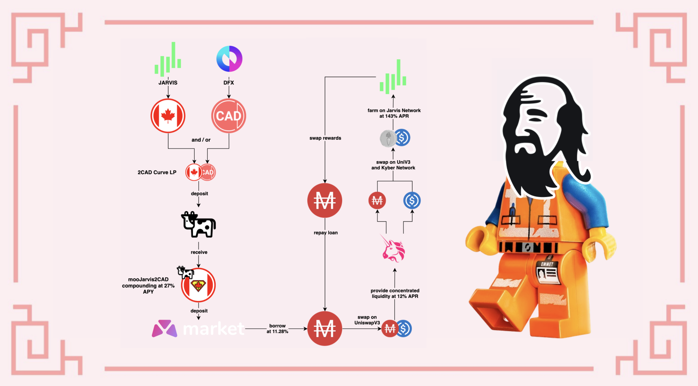


Se você deseja executar simulações para este sistema, pode usar a [Planilha Google](https://docs.google.com/spreadsheets/d/10-n5IyZLl0GZyjM16SNuVOONNsfJ15pm2GL0e2MagzE/edit?usp=sharing) vinculada a esta estratégia. Basta alterar as diferentes taxas de recompensa ou CDR desejado para estimar o APY final que você pode obter neste loop.


### 1º dia

Você precisa inicializar seu sistema. Para fazer isso:

* troque $300 de USDC por jCAD na Jarvis Network (ou compre jCAD diretamente via Mt. Pelerin)
* deposite o jCAD no Curve Finance na [pool #23](https://polygon.curve.fi/factory/23/deposit)
* deposite o token 2CAD LP na [Beefy Finance](https://app.beefy.finance/#/polygon/vault/jarvis-2cad)
* deposite o token de recibo da Beefy no Market.xyz&#x20;
* tome emprestado MAI com um CDR de 200% (LTV de 50%)&#x20;
* troque uma parte do seu MAI por USDC no Uniswap V3 e deposite MAI e USDC em uma nova pool de liquidez com parâmetros de sua escolha

Após o 1º dia de cultivo, você deve ter:

| posição            | valor ($) |
| ------------------ | --------- |
| mooJarvis2CAD      | 300.000   |
| recompensas 2CAD   | 0.197     |
| MAI-USDC UniV3     | 150.000   |
| taxas UniV3        | 0.049     |
| JRT-MAY22-USDC     | 0.000     |
| recompensas Jarvis | 0.000     |
| dívida em MAI      | 150.000   |

Você está pronto, o resto é manutenção simples e movimentação das recompensas para o pool da Jarvis

### Manutenção diária

Hora de colocar seus ganhos no reforço de recompensa:

* colha MAI e USDC na UniswapV3
* extraia uma pequena porção do seu mooJarvis2CAD correspondente ao que foi composto&#x20;
* colha a recompensa na Rede Jarvis&#x20;
* troque tudo por JRT-MAY22 e USDC na Rede Kyber e crie tokens LP&#x20;
* deposite o token LP na Rede Jarvis

No final do 2º dia, você terá:

| posição            | valor ($) |
| ------------------ | --------- |
| mooJarvis2CAD      | 300.000   |
| recompensas 2CAD   | 0.197     |
| MAI-USDC UniV3     | 150.000   |
| taxas UniV3        | 0.049     |
| JRT-MAY22-USDC     | 0.246     |
| recompensas Jarvis | 0.001     |
| dívida em MAI      | 150.000   |

### Resultados brutos mensais

Aqui estão os resultados brutos mês após mês, como podem ser obtidos na Planilha Google  vinculada acima:

| dia | mooJarvis2CAD | MAI-USDC | JRT-MAY22-USDC | dívida em MAI |
| --- | ------------- | -------- | -------------- | ------------- |
| 30  | 300.000       | 150.000  | 7.534          | 151.350       |
| 60  | 300.000       | 150.000  | 16.282         | 152.760       |
| 90  | 300.000       | 150.000  | 26.118         | 154.182       |
| 120 | 300.000       | 150.000  | 37.179         | 155.618       |
| 150 | 300.000       | 150.000  | 49.616         | 157.067       |
| 180 | 300.000       | 150.000  | 63.601         | 158.530       |
| 210 | 300.000       | 150.000  | 79.326         | 160.007       |
| 240 | 300.000       | 150.000  | 97.009         | 161.497       |
| 270 | 300.000       | 150.000  | 116.893        | 163.001       |
| 300 | 300.000       | 150.000  | 139.252        | 164.519       |
| 330 | 300.000       | 150.000  | 164.393        | 166.051       |
| 360 | 300.000       | 150.000  | 7.343          | 0.000         |

### 365º dia

Com uma CDR de 200%, você pagará toda a sua dívida durante o 11º mês, liberando o CAD inicial que poderá transferir de volta para sua conta bancária se quiser, e ainda terá

* $150 em MAI-USDC
* $7.343 em LPs na Jarvis

Para um APY total de 52.91%.


Se você realizar seus lucros da pool de liquidez 2CAD e investi-los diretamente na pool JRT-MAY22-USDC na Jarvis, sem adicionar o Market.xyz no meio, você obteria um APY total de 52,68%. Você pode ver a 2ª planilha no Google para obter detalhes ou definir o CDR para 1.000.000 (sem empréstimo).


## Aviso legal

Este guia foi escrito principalmente para ilustrar como você pode converter seus FIATs em criptoativos (e vice-versa) usando Mt. Pelerin e a Rede Jarvis. Para não residentes dos EUA, esta é uma ótima oportunidade de transferir dinheiro de um "mundo" para outro com muito pouco impacto e quase sem taxas. O fato de você também poder obter seus FIATs sintéticos na Polygon o torna particularmente eficiente, pois o custo do gas e o tempo de transação permanecem entre os melhores para o DeFi.

Também é interessante notar que cada vez mais aplicativos de primeira linha estão usando jFIATs, especialmente [AAVE v3](https://app.aave.com/markets/) que começou a propor mercados de empréstimo jEUR e EURS, facilitando a transição de TradFi (Finanças Tradicionais) para DeFi.

A estratégia proposta neste guia pressupõe que todos os preços e taxas permaneçam os mesmos, o que obviamente não é o que acontece na vida real. Certifique-se de prestar atenção às taxas de empréstimo de recompensa antes de investir qualquer coisa para poder pagar seu empréstimo.


Este guia definitivamente não é um conselho financeiro, foi feito com um objetivo educacional em mente. Você precisa ficar atento às variações de preços, oferta e demanda, programas de recompensas, datas de término, perdas impermanentes, etc. O objetivo não era propor receitas que possam ser seguidas às cegas, então faça sua lição de casa e sua própria simulação, e só invista o que você está disposto a perder.

