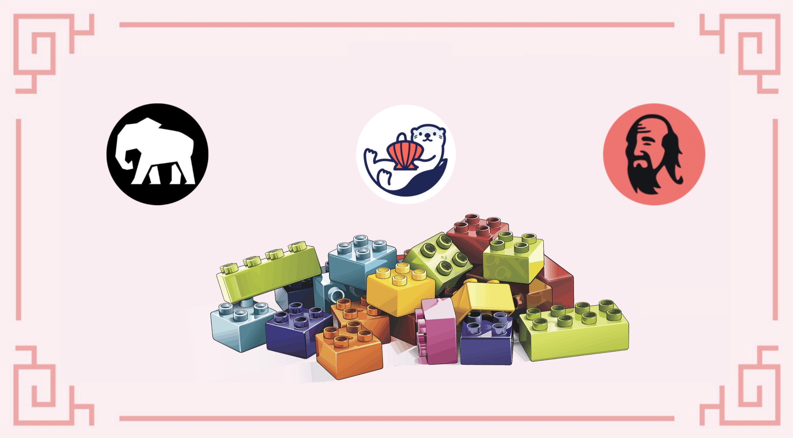
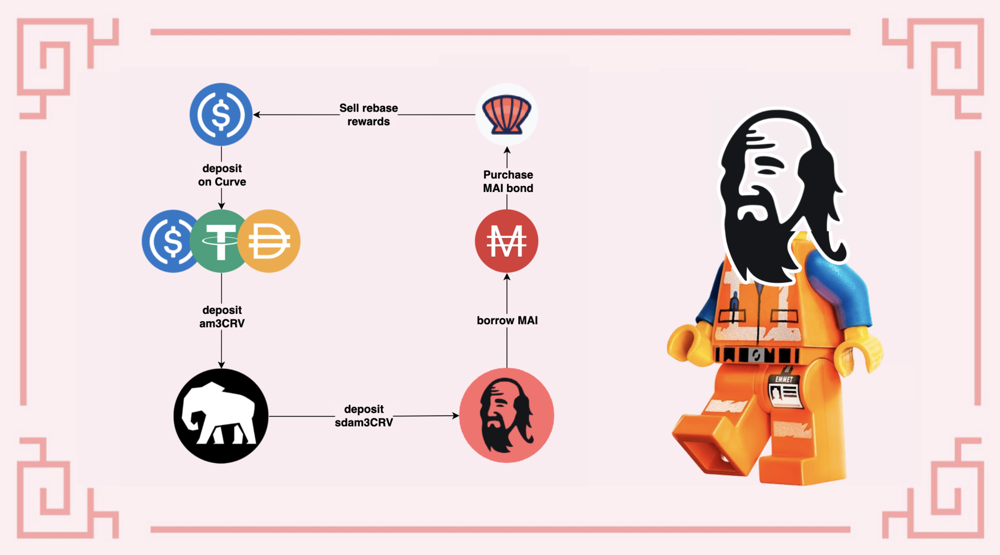

# O Elefante, o Chimpanzé e a Lontra

## Introdução

Este poderia ser um bom título para alguma poesia, no entanto, parece que esses são os 3 animais totêmicos dos protocolos que discutiremos neste guia. Hoje, examinaremos de perto uma das mais recentes (em janeiro de 2022) adições à coleção de tokens de garantia que apoiam a stablecoin MAI na Mai Finance: o token sdam3CRV. Vamos explicar em detalhes o que é e como você pode obtê-lo. Vamos então propor uma pequena estratégia para usá-lo e obter altos retornos usando a stablecoin de comprovante da Stake DAO, Mai Finance e o protocolo OtterClam como um multiplicador de recompensas.

## Stake DAO

### Apresentando a Stake DAO

[Stake DAO](https://app.stakedao.org) é uma plataforma de otimização de rendimentos onde os usuários podem depositar seus ativos e permitir que a plataforma use as estratégias mais selecionadas para maximizar os rendimentos. Os investimentos são propostos com uma pontuação de risco, e os investimentos são devidamente exibidos em um belo painel que facilita o acompanhamento dos resultados das estratégias escolhidas. Lançada principalmente na Ethereum Mainnet, a Stake DAO está se expandindo rapidamente para outras cadeias como Polygon e Avalanche. É claro que você pode ler mais sobre o Stake DAO em sua [documentação oficial.](https://stakedao.gitbook.io/stakedaohq/)

### A estratégia am3CRV

Para nosso guia, usaremos a `Passive Aave USD Strategy` (Estratégia passiva Aave USD) para a Polygon. Esta estratégia que depende do pool am3CRV da [Curve Finance](https://polygon.curve.fi): você deposita suas stablecoins (USDC, USDT ou DAI) no pool aave da Curve e receberá um token de comprovante am3CRV. Este é o token que você pode usar para fazer staking diretamente na Curve para receber recompensas CRV e WMATIC, mas você também pode depositar esse token na Stake DAO e as recompensas CRV e WMATIC serão vendidas e reacumuladas em sua posição de stablecoins.

Como você pode ver acima, fazer staking com tokens am3CRV na Curve daria a você um APR geral de 8,35% (Annual Percentage Rate, ou Taxa Percentual Anual). Se você for à Stake DAO, encontrará na aba `Strategies for Polygon` a estratégia que usa os tokens am3CRV onde você depositará seu token de comprovante e ganhará um APY de 11,11% (Annual Percentage Yield, ou Rendimento Percentual Anual) que pressupõe que você reacumule suas recompensas ao menos diariamente).

Ao depositar seus tokens am3CRV na Stake DAO, você receberá um novo token de comprovante: sdam3CRV (stake dao am3CRV).


Observe que a Stake DAO cobra taxas sobre seus ganhos para cada estratégia que você usar. No nosso caso, e em janeiro de 2022, a taxa de performance é de 15%, havendo também uma taxa de saque de 0,5%. Certifique-se de entender isso antes de entrar na piscina.


Essa estratégia pode ser considerada muito segura (DYOR), pois utiliza apenas stablecoins. O risco de Perda Impermanente é quase nulo porque o token am3CRV LP é composto apenas por stablecoins atreladas ao dólar americano. Se você quiser usar a Stake DAO, certifique-se de levar em consideração os riscos do contrato inteligente, pois seu ativo será emprestado na AAVE via Curve e o token LP está na Stake DAO, então você tem 3 camadas de protocolos expostos aos riscos.

Você pode usar o instrumento de farming na Stake DAO para depositar seus tokens sdam3CRV e obter um extra de \~9% pago no token SDT, o token nativo da Stake DAO. Para nosso guia, no entanto, usaremos o token sdam3CRV de maneira diferente.

## Mai Finance

[Mai Finance](https://app.mai.finance) é um protocolo de empréstimos onde você pode depositar seus ativos como garantia e tomar outros emprestado. Esta não é uma plataforma de empréstimos genérica onde você encontrará pessoas emprestando ativos a mutuários. Na Mai Finance, você empresta apenas a si mesmo e apenas toma emprestado por conta dos ativos que possui. Encontre mais detalhes sobre a Mai Finance neste site ou na [documentação oficial.](https://docs.mai.finance)

Em janeiro de 2022, o token sdam3CRV foi aprovado como opção de garantia na Mai Finance. Isso significa que o token que foi criado ao depositar seu recibo am3CRV no Stake DAO agora pode ser usado para tomar emprestado a stablecoin MAI. Isso é ótimo por alguns motivos:

* o token sdam3CRV é composto apenas por stablecoins, portanto, não deve ser afetado por perda impermanente e deve manter um preço estável
* porque o preço não está mudando muito, é bastante fácil evitar liquidações, mesmo se você tomar emprestado próximo ao nível de liquidação
* sua garantia está crescendo em valor porque é um ativo com rendimento. No momento da redação deste guia, você receberia 11% de APR em sua garantia

Este vault possui uma CDR (Colateral to Debt Ratio, ou Proporção de Garantia para Dívida) porque sempre tentamos promover a segurança nos guias apresentados neste site. Uma CDR alta apresenta alguns benefícios:

* Mantém você longe da liquidação em caso de grandes quedas no preço de sua garantia
* Ele permite que você retire uma boa parte de sua garantia e a venda para pagar sua dívida (consulte nosso [guia sobre reembolso de dívida](../../mai-university/debt-repayment-how.md))

No entanto, sinta-se à vontade para usar uma CDR adequada à sua tolerância ao risco.


O cofre sdam3CRV possui stablecoins como garantia. Como o cofre do camDAI, ele NÃO receberá incentivos de empréstimo. Seu índice de liquidação também pode ser reduzido para 110%, como para o cofre do camDAI.


Com o MAI você pode tomar emprestado contra sua garantia, você pode alavancar sua posição. Se precisar de detalhes, leia nosso [guia sobre alavancagem camDAI ](camdai-beginner-strategy.md)e aplique-o aos seus tokens sdam3CRV. Você pode obter uma exposição muito maior do que as taxas fornecidas pela Stake DAO apenas aplicando alguns loops de alavancagem. No entanto, isso aplica uma forte pressão de venda no token MAI, então vamos propor outra abordagem.

## OtterClam DAO

[OtterClam Finance](https://app.otterclam.finance) é um OHM-fork na Polygon muito original e inovador, integrando NFTs em sua plataforma. Lançado em novembro de 2021, a OtterClam teve um grande crescimento desde o início e agora está se movendo em direção ao GameFi.

Uma das coisas mais interessantes sobre a OtterClam é sua parceria com o protocolo QiDao por trás da Mai Finance. A maior parte das stablecoins que apoiam seu token CLAM está em MAI, a stablecoin cunhada na Mai Finance. Isso significa que você pode comprar títulos CLAM diretamente usando MAI, e é exatamente isso que faremos em nossa estratégia. De fato, os   OHM-forks são conhecidos por fornecer taxas de recompensa muito altas, e a OtterClam não é uma exceção. Algo único sobre os bonds da OtterClam é que você compra sCLAM (tokens CLAM em staking), para que os tokens recebam recompensas de rebase durante todo o período de vesting, o que torna os títulos ainda mais atraentes.

Nesta foto acima, você pode ver que, de fato, compraremos sCLAM com um desconto de 3,66% (o preço de compra é 9,20 MAI, enquanto o preço de mercado é $9,54), mas durante todo o período de vesting de 5 dias, o sCLAM comprado também aumentará em 6,95%. Por causa das taxas de recompensa muito altas (APY de 13.400% no momento da redação), será importante manter os tokens sCLAM em staking, mas venderemos o rendimento do staking por stablecoins e as depositaremos na Curve para aumentar nossa posição am3CRV .

Se você verificar o preço da CLAM, verá que esse token tem muita volatilidade, no entanto, e como para a maioria dos OHM-forks, o preço do token é irrelevante, estamos usando apenas a OtterClam como multiplicador dos ganhos. Os OHM-forks são projetados para reduzir o preço do token para $1 (ou qualquer ativo que esteja apoiando o token), e o token é uma "moeda de reserva", o que significa que foi projetado para ser usado e comprado/vendido.


As recompensas de staking são acumuladas nos tokens sCLAM, mas não podem ser acessadas durante o período de vesting. Teremos que esperar que os tokens passem completamente por esse período antes de podermos coletar e vender as recompensas de staking.


## Estratégia de farming

Como na maioria dos casos, o melhor ponto de partida para estratégias é começar com stablecoins. Dessa forma, você reduz o risco de perda impermanente e trabalha apenas com os lucros de seu farming (ou o valor emprestado no nosso caso). Portanto, o loop começa depositando stablecoins na Curve para obter um token am3CRV. Este token de recibo é depositado na Stake DAO para que você possa obter um recibo sdam3CRV. Este token será depositado na Mai Finance como garantia para tomar emprestado MAI. O empréstimo é usado para comprar bonds de MAI na OtterClam. As recompensas de rebase são trocadas por mais stablecoins. Como observação, você pode vender qualquer valor da recompensa de rebase. Para nosso guia, venderemos 100%, mas você pode manter uma parte para aumentar sua posição no CLAM mais rapidamente e coletar recompensas maiores mais rapidamente.

Como sempre para simulações, vamos fixar todos os valores da seguinte forma:

* APY para a estratégia sdam3CRV na Stake DAO é de 11.11%
* APR para staking de CLAMs na OtterClam é de 13,400%

Também não trataremos do reembolso da dívida e assumiremos que todos os preços permanecerão os mesmos. Executaremos a simulação com $100 em USDC como ponto de partida e também tentaremos manter uma CDR de 235% quando tomarmos mais MAI emprestado. Por fim, vamos supor, pela simplicidade desta simulação, que ao final de cada período de vesting, há um bond de MAI disponível com um desconto de 0% (você vai caçar descontos superiores a 0%, obviamente).

### 1º dia

No dia 1, você pode preparar praticamente tudo:

* Deposite seus $100 em USDC (ou USDT ou DAI, até você) no Curve Finance&#x20;
* Deposite seu token de comprovante am3CRV na Stake DAO&#x20;
* Deposite seu token de comprovante sdam3CRV na Mai Finance&#x20;
* Tome emprestado a um CDR de 200%, ou $50 em MAI para o primeiro empréstimo&#x20;
* Compre um bond de MAI na OtterClam Finance

Neste ponto, você está pronto e terá que esperar todo o período de vesting para começar a coletar recompensas de rebase. No final do dia, você teria:

| Posição             | Valor ($) |
| ------------------- | --------- |
| sdam3CRV            | 100.000   |
| empréstimo em MAI   | 50.000    |
| sCLAM               | 50.000    |
| sdam3CRV adicionais | 0.030     |
| sCLAM adicionais    | 0.000     |

### 2º, 3º e 4º dia

Durante estes dias não há nada que você possa fazer. Seu sdam3CRV está rendendo, mas é basicamente isso. Precisamos esperar o título passar pelo período de vesting.

### 5º dia

No final do quinto dia, o título está totalmente disponível e, como as recompensas de rebase foram reacumuladas durante todo o período de vesting, você teria no final do dia:

| Posição             | Valor ($) |
| ------------------- | --------- |
| sdam3CRV            | 100.122   |
| empréstimo em MAI   | 50.000    |
| sCLAM               | 53.382    |
| sdam3CRV adicionais |  0.030    |
| sCLAM adicionais    | 0.722     |

### 6º dia

Você tem alguns tokens sdam3CRV adicionais contra os quais pode pedir emprestado para comprar um novo bond. Este será um bond muito pequeno (apenas alguns centavos por enquanto), mas com o tempo, você poderá comprar mais e mais sCLAM com seu novo MAI. No final do dia, você terá:

| Posição             | Valor ($) |
| ------------------- | --------- |
| sdam3CRV            | 100.875   |
| empréstimo em MAI   | 50.437    |
| sCLAM               | 53.820    |
| sdam3CRV adicionais | 0.031     |
| sCLAM adicionais    | 0.728     |

A partir deste ponto, seu CLAM em staking produzirá recompensas todos os dias que você pode acumular em seu vault sdam3CRV, ou reacumular a cada 5 dias quando o título estiver disponível.

### Rotina diária

Supondo que você reacumule todos os dias, a rotina diária será:

* desbloqueie o equivalente a 3 rebases de seus CLAMs apostados vendê-los por qualquer moeda estável que você obteria mais com base no status do mercado deposite o estábulo adicional no pool aave no Curve Finance deposite o token am3CRV no Stake DAO deposite o token sdam3CRV na Mai FinanceThen, every 5 days you will be able to perform the following additional steps:

<!---->

* borrow additional MAI to keep a CDR of 200%
* purchase additional MAI bond on OtterClam

### Raw results month after month

Here are raw results month after month

| day | sdam3CRV  | CLAM    | MAI debt |
| --- | --------- | ------- | -------- |
| 30  | 121.249   | 64.007  | 60.625   |
| 60  | 150.866   | 78.815  | 75.433   |
| 90  | 187.350   | 97.057  | 93.675   |
| 120 | 232.294   | 119.529 | 116.147  |
| 150 | 287.659   | 147.212 | 143.830  |
| 180 | 355.863   | 181.314 | 177.931  |
| 210 | 439.882   | 223.323 | 219.941  |
| 240 | 543.383   | 275.074 | 271.691  |
| 270 | 670.884   | 338.825 | 335.442  |
| 300 | 827.950   | 417.358 | 413.975  |
| 330 | 1,021.437 | 514.101 | 510.719  |
| 360 | 1,259.790 | 633.277 | 629.894  |

### Day 365

After a complete year of farming this system, and assuming everything are the same as on Day 1 (prices, rates, and everything else ...), you would have:

* $1,304.575 worth of sdam3CRV tokens in your vault on Mai Finance
* $655.670 worth of CLAM on OtterClam finance
* a debt of $652.288 worth of MAI

You can see that at the end of the year, you still have a CDR of 200%. You could withdraw your collateral to repay your debt and unlock the rest of your collateral. You can also repay your debt by selling your CLAMs and unlocking 100% of your collateral.

In the end, from an initial investment of $100 you would end up with $1,307.958 and a debt of $652.288, which corresponds to an overall APY of 1,207.958%.

{% hint style="success" } If you extract only 50% of your rebase reward from OtterClam Finance and keep the rest staked, the high APY will be applied to a position that grows much faster. This presents more risks, but assuming everything stays the same, and if you sell only 50% of your reward, you would possibly end up with $3,608.447 split between your vault and OtterClam, and a debt of $750.828 for an equivalent APY of 2,757.619%.

## Disclaimer

This strategy is pretty interesting, because it presents very little risk on the initial side. Indeed, your money is working off stables, and the initial is "protected", so the probability of losing it is very small. The liquidation risk is also very small due to the very high CDR used for a very small price variation between the collateral and the borrowed asset. Without additional tools, you would probably get \~12% APY but it's clear that using other protocols to maximize the rewards can lead to very high returns.

However, make sure that you understand this investment strategy in its finest details. Make sure you accept the smart contract risks because we're using a lot of different protocols. Also, you need to understand how Ohm forks work and don't pay attention to the price of CLAMs, which may vary a lot. Finally, if rates _may_ remain the same on Stake DAO, the reward rate on OtterClam will most certainly decrease over time since ohm forks can't sustain such high APYs for long periods of time. As always, read the documentation of the different projects you will use, and make sure you understand all the risks.


This guide is definitely not financial advice, it was made with an educational goal in mind. You need to pay attention to price variations, supply and demand, reward programs, end dates, impermanent losses etc ... The goal wasn't to propose recipes that can be followed blindly, so please do your homework and your own simulation, and only invest what you're ready to possibly lose.

