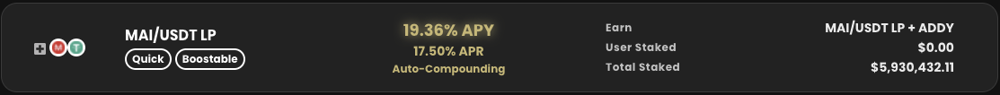

# Cosa fare con Mai su Polygon

## Obbiettivo di questo tutorial

L'obbiettivo di questo tutorial non è presentare in dettaglio cosa puoi fare con la tua stable coin MAI ma avere un elenco di tutti i siti Web e applicazioni DeFi che puoi utilizzare su Polygon che ti permettano di utilizzare i tuoi MAI direttamente o in combinazione con altre stable coin. Per maggiori dettagli su modi specifici di utilizzare MAI, puoi fare riferimento ad altri tutorial su questo sito o ottenere aiuto su [Discord](https://discord.gg/aRghpvhV) o [Telegram](https://t.me/QiDaoProtocol).

Si prega di notare che l'elenco non è completo e non lo sarà mai poiché ci sono nuove dApp lanciate ogni settimana sulla rete. Non possiamo recensirle tutte quindi presenterò solo le opzioni principali, ovvero le opzioni più famose/più "sicure".

Se vuoi che un particolare progetto sia elencato, per favore unisciti alla comunità Qi su [Discord](https://discord.gg/mQq55j65xJ).


Non presenterò le farm di Mai Finance. Questo argomento merita il suo tutorial, perché Qi non è come qualsiasi altro token farm.


## Farmare in sicurezza sui progetti maggiori \(bluechip\)

I progetti Bluechip sono le applicazioni DeFi che si sono dimostrate solide e presentano un rischio minore. Di solito sono controllati e il team di sviluppo ci ha lavorato per molto tempo. Di solito non hanno APR \(tasso percentuale annuo\) altissimi ma sono affidabili e sicure.

### Balancer

[Balancer](https://polygon.balancer.fi/#/) è un gestore di portafoglio automatizzato, fornitore di liquidità e rilevatore di prezzi. Sulla piattaforma potrai prestare le tue crypto valute e riscuotere commissioni dai trader, che riequilibrano il tuo portafoglio seguendo opportunità di arbitraggio. Se hai bisogno di maggiori dettagli su Balancer, vai a leggere il loro [documento ufficiale](https://docs.balancer.fi/).

Sulla rete Polygon, Balancer propone un pool composto dalle 4 principali stable coin: DAI, USDC, USDT e MAI \(miMATIC\). Questo pool stabile ha attualmente un APR abbastanza stabile di ~ 20%.

La cosa più bella di Balancer è che non hai assolutamente bisogno di possedere le 4 monete da depositare nel pool. Balancer genererà automaticamente una combinazione bilanciata a prescidere dal  deposito effettuato. Ciò significa che se hai 100$ di MAI, puoi semplicemente depositarli nel pool di Balancer e lasciare che l'algoritmo lo coverta correttamente per avere un rapporto del 25% per ogni moneta a seconda del loro rispettivo prezzo al momento del deposito.

I premi per il pool vengono pagati utilizzando il token BAL, distribuito su base settimanale. Oltre al token BAL, possono essere concessi premi aggiuntivi a seconda del pool in cui hai depositato. Puoi controllare i differenti [programmi di incentivi qui](https://balancer-incentives.web.app/). Nel nostro caso, la partecipazione al pool stabile ti farà guadagnare anche premi MATIC e Qi.

Il ciclo completo può essere rappresentato così:

Se hai bisogno di maggiori dettagli su come utilizzare Mai Finance per depositare le tue crypto valute e prendere in prestito MAI \(invece di vendere le tue crypto valute per acquistare MAI\), leggi altre guide su questo sito. Puoi anche [includere Aave](https://qidao-qimps.gitbook.io/mai-finance-tutorials/v/italian/tutorial-di-investimento/far-fruttare-i-tuoi-token-su-aave) per generare ulteriori profitti.

### Curve finance

Un po' di click-bait qui. [Curve](https://polygon.curve.fi/) è un'altra piattaforma in cui potrai depositare le tue crypto valute  in pool che genereranno entrate ma non direttamente MAI \(non ancora?\). I pool che ci interessano sono:

* il pool AAVE che genera tra il 5% e il 15% APR \(APR molto variabile\) su un trio di stable coin \(DAI/USDC/USDT\). Il pool funziona esattamente come Balancer nel senso che puoi entrare nel pool utilizzando un singolo asset che verrà utilizzato su AAVE dal protocollo.
* il pool atricrypto  è composto dal trio di stable coin \(DAI/USDC/USDT\) e include anche wETH e wBTC per mitigare l'impermanent loss. Questo pool ha un APR compreso tra il 25% e il 30%. Il team di Mai Finance sta attualmente cercando di aggiungere MAI a questo pool, il che significa che potresti essere in grado di depositare direttamente i tuoi MAI.

In attesa che il protocollo Curve accetti MAI come stable coin valida nei propri pool, puoi comunque utilizzare la tua crypto valuta preferita con Curve seguendo questi passaggi \(esempio con MATIC\):

* Deposita i tuoi token MATIC su AAVE ed ottieni amWMATIC
* Deposita i tuoi amWMATIC su Mai Finance ed ottieni camWMATIC \(le ricompense AAVE saranno aggiunte ai token camWMATIC\)
* Usa i token camWMATIC come collaterale su Mai Finance e prendi in prestito MAI
* Usa la [pagina di swap](https://app.mai.finance/swap) su Mai Finance per scambiare tutti i tuoi MAI per USDC
* Ora puoi
  * Entrare nel pool di atricrypto su Curve con i tuoi USDC e ottenere un APR dal 25% al ​​30%
  * Entrare nel pool AAVE su Curve con i tuoi USDC e ottenere un APR dal 5% al ​​15%

Le ricompense su Curve sono date in:

* USDC automaticamente reinvestiti che accrescono la tua posizione nel pool \(sarà un mix di USDC/USDT/DAI e possibilmente wBTC/wETH nel caso del pool atricrypto\)
* WMATIC che puoi utilizzare per ripetere il ciclo di cui sopra e aumentare il tuo prestito e capitale investito
* CRV, che possono essere utilizzati anche come collaterale su Mai Finance per prendere in prestito più MAI e aumentare il capitale investito

### AAVE

C'è una guida completa su come usare Mai Finance per [far fruttare i tuoi token su Aave](https://qidao-qimps.gitbook.io/mai-finance-tutorials/v/italian/tutorial-di-investimento/come-far-fruttare-i-tuoi-token-su-aave) .Non si tratta di fare un uso diretto della stable coin MAI ma possiamo immaginare che in futuro AAVE avrà anche un pool MAI dove potrai depositare le tue crypto valute.

### QuickSwap

[QuickSwap](https://quickswap.exchange/#/) è probabilmente uno dei più famosi DEX \(Decentralized EXchange\) su Polygon insieme a SushiSwap e 1Inch. È anche un AMM \(Automated Market Maker\) che consente agli utenti di fare trading in modo efficiente sulla rete Polygon utilizzando i pool di liquidità. Qualsiasi operazione è soggetta a una commissione che viene parzialmente ridistribuita agli utenti che depositano la loro liquidità sulla piattaforma.

Il modo in cui puoi usare MAI su QuickSwap è molto simile ad una farm normale ma se hai bisogno di capire i passaggi esatti per entrare nel pool MAI/USDC su QuickSwap, probabilmente è meglio chiedere supporto nel nostro [Discord](https://discord.gg/aRghpvhV).

Attualmente, se entri nel pool MAI/USDC LP \(Liquidity Provider\) su QuickSwap, guadagnerai:

* Commissioni di trading
* Token QUICK

## Farms "Degen" e aggregatori

### Adamant

[Adamant](https://adamant.finance/home) è un aggregatore che include tutti le "migliori" farm su Polygon e ti consente di accedervi direttamente dal loro sito web. Depositando i tuoi assets \(token LP\) su un pool specifico attraverso Adamant, il loro algoritmo raccoglierà per te le ricompense del pool e reinvestirà automaticamente parte di queste nella tua posizione LP. Il resto delle ricompense viene solitamente convertito in WMATIC che viene poi ridistribuito ai possessori del token ADDY \(token nativo di Adamant\). Infine, ricevi a tua volta una  ricompensa in token ADDY che investire per 90 giorni, guadagnando parte dei dividendi WMATIC.

Solitamente, Adamant è una buona scelta se non ti interessa il token della farm e se non vuoi richiedere le tue ricompense manualmente più volte al giorno. Genera anche maggiori entrate perchè ottieni ricompense ADDY oltre alle ricompense base del pool.

Adamant attualmente supporta alcuni pool che accettano la coppia MAI/USDC LP. I pool attivi sono:

* QuickSwap: le ricompense in QUICK vengono swappate in MAI/USDC LP e WMATIC
* DinoSwap: le ricompense in Dino vengono swappate in MAI/USDC LP e WMATIC 
* Mai Finance: le ricompense in Qi vengono swappate MAI/USDC LP e WMATIC


Gli screenshots del pool QuickSwap \(vedi paragrafo sopra\) e Adamant sono stati presi lo stesso giorno, ma mostrano diversi APY \(Annual Percentage Yield\).


Noterai che l'APY su Adamant è un po' più alto rispetto a QuickSwap. La ripartizione delle ricompense è la seguente:

* 12,88% di ricompense QUICK automaticamente reinvestiti \(il che significa che la ricompensa QUICK viene convertita in più token LP\)
* 9.16% di ricompense ADDY   \(non reinvestiti\)
* 3.40% di quota di dividendi delle commissioni \(ritirando le ricompense ADDY ogni giorno\)

Ciò significa che del 20,92% concesso da QuickSwap solo il 12,88% viene utilizzato per aumentare la posizione LP, il resto viene scambiato in dividendi WMATIC. Potrai richiedere le tue ricompense ADDY ogni giorno \(o in qualsiasi momento\) e depositarli a loro volta generando dividendi in WMATIC. In altre parole, Adamant sembra un'opzione migliore perché ha APY migliori e ricompense reinvestite automaticamente, ma in realtà richiede comunque molte azioni manuali.


L'utilizzo di Adamant ha anche un forte impatto sul prezzo dei token nativi. Va sottolineato che, dato che Adamant vende costantemente i token farm per generare più coppie di LP e WMATIC come dividendi ai possessori di ADDY, la pressione di vendita è molto alta sui token della farm e questo si riflette sul loro prezzo che sta diminuendo costantemente.


### Altre farm che accettando la coppia MAI/USDC

MAI sta diventando sempre più popolare su Polygon e dato che QuickSwap supporta la coppia MAI/USDC anche altre farm lo stanno supportando. Il seguente è un elenco di alcuni progetti su cui è possibile guadagnare rendimento utilizzando MAI/USDC:

* DinoSwap
* Augury
* Polypup
* ...

Anche altre farm accettano il pool MAI/USDC. Se vuoi rimanere informato su nuove farm e sulla loro data di lancio, ti consiglio vivamente di dare un'occhiata al [calendario Rugdoc.io](https://rugdoc.io/calendar/) per le farm Polygon e possibilmente al resto del sito che presenta una panoramica molto ben fatta di ciascuna farm, classificandole anche per fattore di rischio.

## Impermax

### Un po' di informazioni

[Impermax](https://polygon.impermax.finance/) è una piattaforma che consente agli utenti di sfruttare i propri token LP per ottenere rendimenti più elevati. L'obiettivo è molto semplice: depositando i token LP e utilizzandoli come garanzia è possibile prendere in prestito più dei 2 asset sottostanti per generare più token LP e ripetere il ciclo.

Quando l'utente entra nel ciclo è esposto all'impermanent loss e la perdita viene amplificata dal numero di volte in cui viene ripetuto il ciclo. Il rischio di liquidazione si moltiplica anche quando vengono applicati troppi cicli. Infatti, moltiplicando l'APR, la variazione di prezzo delle due monete che compongono la coppia viene amplificata dall'effetto leva, portando ad una liquidazione più rapida.

Con le stable coin però il rischio di liquidazione è minore perché la variazione di prezzo è trascurabile. Ciò significa anche che il rapporto tra Collaterale e Debito \(CDR\) può essere molto vicino al 100%, portando a un numero elevato di cicli e quindi un APR elevato.

Tieni presente che Impermax addebita commissioni quando prendi in prestito e metti in leva la tua posizione. La commissione corrisponde allo 0,1% della tua posizione finale. Ad esempio, se ho $100 di MAI/USDC e faccio leva 50x, la mia posizione finale avrà un valore di $5.000 e pagherò una commissione di $4,90 dovuta ai $4,900 che ho preso in prestito.

L'effetto dei cicli combinati di deposito/prestito consente di moltiplicare l'APY finale. Partendo da un APY iniziale del 20% per la coppia MAI/USDC e con un CDR del 110%, facendo 50 cicli e utilizzando la formula

$$
APREquivalente = APRIniziale * \sum_{i=0}^{n}{\frac{100}{CDR}}^i
$$

Possiamo facilmente ottenere un APR finale del 228%. Ci sono altri elementi che influenzano l'APR finale, vale a dire l'APR di prestito \(interesse sul prestito per ottenere più token LP\) e l'offerta/domanda di entrambi gli asset che compongono la coppia LP \(che determina direttamente l'APR di prestito\).

Inoltre, dato che tutte le tariffe vengono amplificate dal numero di volte in cui viene applicato il ciclo, l'APR varierà drasticamente e a volte potrà diventare negativo per un breve periodo di tempo \(il tuo token LP verrà utilizzato per ripagare l'APR negativo\).

### Posizione in leva della coppia MAI/USDC

Alla fine, stai usando l'APR di base su un valore molto più grande, che di conseguenza sta guadagnando interessi molto più grandi, aumentando l'APR della tua posizione iniziale.

Puoi vedere molto facilmente quanto sto usando come garanzia, quanto ho investito inizialmente, qual è il rapporto di leva finanziaria e quali sono i valori di liquidazione dovuti al rapporto di leva finanziaria. Questa posizione mi darà i seguenti rapporti al momento della scrittura

L'APR viene dato in token IMX che possono essere scambiati con più MAI/USDC \(usa il potere di Mai Finance per prendere in prestito a 0% di interesse\) o utilizzato per fornire liquidità su pool specifici che accettano IMX su Impermax.

### Fornire MAI a chi prende in prestito

Sull'app infatti è possibile fornire liquidità anche a coloro che vogliono applicare i cicli di leva alle proprie posizioni \(avranno bisogno di asset sottostanti per generare più token LP\). Il prestito di assets è un ottimo modo per guadagnare e lasciare che chi prende in prestito si assuma tutti i rischi. Inoltre, più utenti prendono in prestito, maggiore sarà l'APR di offerta.

Questo è un altro ottimo modo per ottimizzare il tuo prestito a tasso 0% su Mai Finance. Non solo non devi pagare nulla per prendere in prestito MAI, ma puoi guadagnare interessi semplicemente depositandoli su Impermax.

## Disclaimer

Tutte le informazioni di questo tutorial sono a scopo puramente educativo. L'obiettivo è portare alla luce progetti meritevoli di attenzione per le persone che sono entrate nel mondo delle crypto su Polygon. Ovviamente non ho parlato di Mai Finance come farm perché abbiamo già un tutorial dedicato. Infine, questa guida NON è ASSOLUTAMENTE pensata per essere applicata così com'è, non è un consiglio finanziario e non dovresti seguire ciecamente quello che vi è scritto. Si prega di leggere i documenti dei diversi progetti che sono stati menzionati prima di considerare un investimento sulle loro piattaforme.


Tieni presente che una strategia che funziona bene in un dato momento potrebbe avere un rendimento peggiore \(o farti perdere denaro\) in un altro. Tieniti aggiornato, monitora i mercati, tieni d'occhio i tuoi investimenti e come sempre, fai le tue ricerche.


