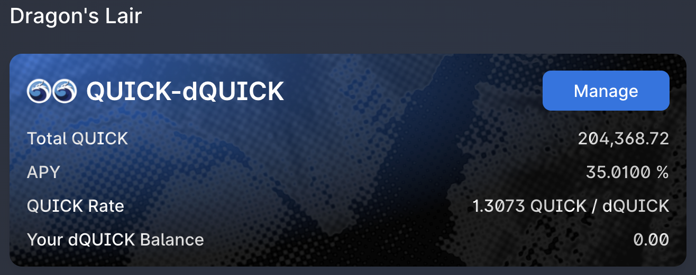

# Staking singolo di MAI su Ethalend

## Introduzione

Una delle missioni di questo sito Web e della raccolta di tutorial offerti è quella di rendere la DeFi user friendly demistificando i protocolli più complessi. Questa visione è condivisa anche dal team dietro [Ethalend](https://www.ethalend.org) e questa guida presenterà un modo perfetto per utilizzare questa piattaforma insieme a Mai Finance per amplificare i vostri rendimenti sul farming di stable coin.

## Presentazione Ethalend

### Che cos'è Ethalend

Ethalend è un protocollo componibile che astrae la complessità della DeFi per fornire una resa algoritmica ottimale. Non è un aggregatore di rendimento ma un ottimizzatore di rendimento. Potrai depositare i tuoi assets sulla piattaforma e l'algoritmo responsabile del pool in cui depositi i tuoi assets li investirà effettivamente nel miglior modo possibile. I rendimenti vengono quindi distribuiti nel token nativo di Ethalend, il token $ETHA ed in alcuni token dei partner, incluso $Qi di Mai Finance che puoi ottenere depositando il tuo $MAI nell' eVault $MAI-$USDT. Potete approfondire su Ethalend nella [documentazione ufficiale](https://docs.ethalend.org) o leggendo questa interessante [intervista con il co-fondatore](https://ambcrypto.com/un-complicating-defi-an-interview-with-ethalend-co-founder-danny-b/).

### Creare il wallet Ethalend dal tuo wallet web3

Una delle cose molto interessanti di Ethalend è che l'applicazione utilizza un portafoglio dedicato on chain che non è collegato al tuo portafoglio web3. Questo può essere considerato come

* un vantaggio poiché tutto il rischio contrattuale è limitato a ciò che è esposto in questo portafoglio privato. Inoltre, alcune interazioni tra l'applicazione Ethalend e il portafoglio privato sono incluse direttamente nell'utilizzo della piattaforma, il che potrebbe farvi risparmiare commissioni di transazione. Come nota a margine, il portafoglio intelligente ETHA non è detentivo, il che significa che solo tu avrai accesso al portafoglio, non è come un portafoglio centralizzato che controlla la quota corrispondente al tuo portafoglio.
* uno svantaggio, perché aggiunge complessità alla tua routine e il portafoglio intelligente ETHA non è compatibile con i dispositivi fisici.

Sta a voi decidere se i pro stanno apportando un valore sufficiente per superare i contro. Quando siete pronti a creare il portafoglio, fate semplicemente clic sul pulsante Create Wallet nell'angolo in alto a destra dello schermo.

Ecco fatto, siete pronti ad usare il protocollo!

## Panoramica della strategia

Questa strategia può essere aggiunta al tuo paniere di strategie relativamente sicure perchè utilizzerà il farm di stable coin e verranno forniti rendimenti aggiuntivi grazie ad assets più volatili generati dalle ricompense della posizione stable

### MAI staking singolo e rendimenti

Uno dei grandi vantaggi di Ethalend e una delle caratteristiche chiave che consente la semplificazione della DeFi, è che non è necessario fornire una coppia LP (**L**iquidity **P**roviding) composta da 2 assets con un rapporto di 1:1. L'algoritmo che gestisce il pool (o eVault nel nostro caso) lo farà automaticamente per voi. Inoltre, una volta depositati i vostri assets in un eVault, verranno reindirizzati automaticamente al protocollo migliore che massimizzerà il tuo rendimento. I token ricompensa verranno raccolti e convertiti regolarmente per voi.

Come potete vedere, i dettagli delle ricompense sono visualizzati nella parte destra dello schermo. I premi $ETHA non vengono visualizzati, ma otterrete una stima delle ricompense $Qi associate al  deposito. Se scorrete la pagina verso il basso, otterrete anche una buona comprensione della strategia sottostante che utilizza QuickSwap nel nostro caso. Le ricompense $QUICK verranno convertite in ricompense $Qi. I premi $ETHA sono coniati dal protocollo per incentivarvi a utilizzare la loro piattaforma invece di QuickSwap.


Prestate attenzione alle commissioni di prelievo dello 0,10%. Al momento della scrittura, con un deposito di 100 $MAI, dovrete pagare una commissione di uscita di 0,1 $MAI, che corrisponde approssimativamente a 10 giorni di farming nell' eVault. Assicuratevi di aver compreso questo punto prima di investire qualsiasi cosa.


### Staking di $ETHA: Ethalend o QuickSwap

La ricompensa principale che otterrete prestando $MAI su Ethalend sarà pagata in $ETHA, il token nativo di Ethalend. Uno dei principali vantaggi di Ethalend è che sarete in grado di mettere in stake singolarmente i token $ETHA direttamente sulla piattaforma e aumentare i vostri rendimenti.

Come potete vedere, l'opzione migliore è depositare l'$ETHA che avete guadagnato nel pool $ETHA-$QUICK. A causa della natura dei 2 assets (molto volatili), la ricompensa è davvero alta. Se preferite, potete ridurre l'impermanent loss depositando $ETHA nel pool $ETHA-$USDT. In entrambi i casi, sarete ricompensati con token $QUICK. E, naturalmente, se siete davvero ottimisti su $ETHA, potete mettere in stake le ricompense nel pool $ETHA per ottenere $ETHA aggiuntivi.

I vaults su Ethaland sono in realtà una comodità offerta da Ethalend. Quando depositate i vostri token nel pool, l'algoritmo di bilanciamento venderà alcuni dei token depositati per acquistare l'altro lato della coppia LP e utilizzerà questa coppia in QuickSwap. Come nota a margine, potete farlo anche completamente manualmente: richiedete i vostri token $ETHA, prelevate nel vostro portafoglio web3, vendete il 50% per i token $QUICK, create alcuni token LP e depositate nel pool QuickSwap:


QuickSwap pubblicizza un APY del 223,1% sulla coppia $ETHA-$QUICK, mentre Ethalend mostra un APR del 116,73% sulla stessa coppia. Ciò è dovuto alla differenza tra APY (rendimento percentuale annuo o ricompense auto-reinvestite) e APR (entrate percentuali annuali o ricompense non auto-reinvestite). Le 2 percentuali sono in realtà esattamente le stesse, quindi non importa quale piattaforma avete scelto di utilizzare per i token $ETHA.


### Vault dQUICK MAI

Il modo migliore per utilizzare le ricompense $QUICK che otterrete dallo staking di $ETHA è convertirli in $dQUICK. $dQUICK può essere creato su Dragon's Lair di QuickSwap. È il modo in cui QuickSwap incentiva gli utenti a mettere in stake $QUICK premiandoli con $QUICK aggiuntivi: bloccando i tuoi token $QUICK su QuickSwap, guadagnerete token extra.


L'APY di $dQUICK varia molto tra il 20% e il 40% a seconda della quantità di token $QUICK che vengono effettivamente messi in stake sulla piattaforma


Ma una delle cose migliori di $dQUICK è che è un token "ricevuta di deposito" che può essere utilizzato su Mai Finance come garanzia. Ciò significa che, dopo aver depositato le tue ricompense $QUICK da Ethalend su QuickSwap e ricevuto $dQUICK, potete andare su Mai Finance e depositare i token $dQUICK in un Vault $dQUICK e prendere in prestito $MAI a fronte del collaterale.

Alcune precisazioni sui depositi nei Vaults $dQUICK:

* Hanno un rapporto di liquidazione del 130%, il che significa che sarete in grado di prendere in prestito un sacco di $MAI a fronte dei token $dQUICK. Tuttavia, se volete riscuotere anche i premi per il prestito, dovrete mantenere un CDR (**C**ollateral to Debt Ratio) tra il 155% e il 400%. Questa è una buona idea dato che il token $QUICK è piuttosto volatile e come regola generale, noi suggeriamo fortemente un CDR del 100% al di sopra del rapporto di liquidazione (o 230% per $dQUICK).
* I Vaults $dQUICK sono tra quelli con l'APR più alto quando prendete in prestito $MAI contro $dQUICK. Al momento della scrittura, potete ottenere fino al 39,40% di APR pagato in token $Qi in base all'importo di $MAI che prenderete in prestito.

Potete già vederlo, fornire $dQUICK è molto interessante dato che avrete un asset che ottiene ricompense $QUICK da QuickSwap, otterrete ricompense $Qi per il prestito ed ulteriore $MAI  che possono quindi essere aggiunti di nuovo in eVault su Ethalend, aumentando la vostra posizione di farming di stable coins.

### Cosa fare con le ricompense in Qi

Questo argomento è spiegato in [un articolo dedicato](what-to-do-with-qi-on-polygon.md). Per questo tutorial, depositeremo semplicemente i Qi nel pool $Qi-$BAL su Balancer per beneficiare di un solido APR, pagato in token $Qi e $BAL aggiuntivi che potete ricombinare nello stesso identico pool.

## Avvio della strategia

Quella che segue è una simulazione realizzata con un investimento iniziale di $100 di $MAI che potete prendere in prestito da un Vault esistente o acquistare da una piattaforma DEX. Presuppone che tutti gli APR e APY attuali rimangano gli stessi nell'arco di 1 anno e che tutti i token mantengano lo stesso prezzo, il che (ovviamente) non potrà mai accadere.

### Giorno 1

Il giorno 1, depositerete $MAI su Ethalend nel pool $MAI-$USDT, quindi riceverete ricompense sia in $Qi che in $ETHA alla fine della giornata.

| Tipo di ricompensa | Valore in dollari |
| ------------------ | ----------------- |
| Mai su Ethalend    | 100.000           |
| Qi+BAL su Balancer | 0.032             |
| ETHA su Ethalend   | 0.070             |
| dQUICK su Mai      | 0.000             |
| debito su Mai      | 0.000             |

### Giorno 2

Il giorno 2, potete mettere in stake $ETHA dal giorno 1 su Ethalend che genererà ricompense in $QUICK che potete quindi convertire in $dQUICK su QuickSwap, depositare su Mai Finance e sarete in grado di prendere in prestito $MAI contro questi token. Potete anche depositare $Qi nel pool Balancer. Alla fine del giorno 2 otterrete:

| Tipo di ricompensa | Valore in dollari |
| ------------------ | ----------------- |
| Mai su Ethalend    | 100.000           |
| Qi+BAL su Balancer | 0.065             |
| ETHA su Ethalend   | 0.141             |
| dQUICK su Mai      | 0.000             |
| debito su Mai      | 0.000             |

A questo punto, il sistema è avviato e sarete in grado di far crescere la vostra posizione stable di $MAI, oltre a ottenere ricompense in $Qi, $BAL, $ETHA e $dQUICK. Noterete che alcuni valori sono troppo bassi per essere significativi a questo punto, e dato che non sarete in grado di prendere in prestito meno di 0,01 $MAI, dovrete accumulare $dQUICK per 14 giorni prima di poter prendere in prestito $MAI.

## Risultati del farming

### Routine quotidiana

La routine quotidiana del farming sarà la seguente:

* Raccolta delle ricompense $Qi ed $ETHA dal pool $MAI-$USDT su Ethalend
* Deposito dei tokens $Qi nel pool Balancer
* Deposito dei tokens $ETHA nel pool $ETHA-$QUICK su Ethalend
* Raccolta delle ricompense $QUICK del pool $ETHA-$QUICK su Ethalend
* Conversione dei $QUICK in dQUICK su QuickSwap
* Deposito di $dQUICK nel Vault $dQUICK su Mai Finance
* Prestito di $MAI dal vault $dQUICK su Mai Finance
* Deposito dei $MAI presi in prestito nel pool $MAI-$USDT su Ethalend

Inoltre, sarete in grado di raccogliere e reinvestire le ricompense $Qi e $BAL settimanalmente.

### Risultati "grezzi" mese dopo mese

Di seguito sono riportati i risultati "grezzi" alla fine di ogni mese:

| Giorno | Mai su Ethalend | Qi su Balancer | ETHA su Ethalend | dQUICK on Mai | Debito MAI |
| ------ | --------------- | -------------- | ---------------- | ------------- | ---------- |
| 30     | 100.046         | 1.015          | 2.186            | 0.099         | 0.049      |
| 60     | 100.196         | 2.116          | 4.303            | 0.406         | 0.203      |
| 90     | 100.453         | 3.315          | 6.424            | 0.926         | 0.463      |
| 120    | 100.819         | 4.624          | 8.553            | 1.666         | 0.833      |
| 150    | 101.297         | 6.058          | 10.690           | 2.631         | 1.315      |
| 180    | 101.892         | 7.632          | 12.838           | 3.828         | 1.914      |
| 210    | 102.606         | 9.361          | 15.001           | 5.263         | 2.632      |
| 240    | 103.443         | 11.264         | 17.179           | 6.945         | 3.473      |
| 270    | 104.406         | 13.360         | 19.377           | 8.881         | 4.441      |
| 300    | 105.501         | 15.671         | 21.597           | 11.079        | 5.540      |
| 330    | 106.731         | 18.220         | 23.841           | 13.548        | 6.774      |
| 360    | 108.100         | 21.032         | 26.113           | 16.297        | 8.149      |
| 365    | 108.343         | 21.528         | 26.495           | 16.783        | 8.392      |

### Giorno 365

Alla fine di un anno, avreste

* $108.343 in $MAI nel pool $MAI-$USDT su Ethalend
* $26.495 in $ETHA nel pool $ETHA-$QUICK su Ethalend
* $21.528 in $Qi nel pool Qi-BAL su Balancher
* $16.783 in $dQUICK nel vault $dQUICK su Mai Finance
* $8.392 di debito $MAI su Mai Finance

Ciò si riassume in un valore di $173,149 di assets e un debito residuo di $8,392 che corrisponde a un APY equivalente del 64,757%. Ciò si ottiene con un investimento iniziale di $100 di $MAI e utilizzando un pool di stable coin come base per il farming. Tenete presente che le commissioni di transazione non sono state prese in considerazione ma potrebbero influenzare il risultato finale. Questo presuppone anche che voi stiate farmando giornalmente per 1 anno completo.

## Disclaimer

Tutto ciò che viene presentato in questo tutorial è un contenuto educativo realizzato per illustrare come poter utilizzare i $MAI senza venderli e generare comunque un APY di oltre il 60% utilizzando protocolli diversi come i mattoncini Lego. Tuttavia, questo tutorial non deve essere considerato come un consiglio finanziario.

Inoltre, la strategia presenta un circuito chiuso che non vende alcun token e ogni sistema alimenta quello successivo. Tuttavia, come potete vedere, la posizione finale di $dQUICK non è molto alta e il prestito $MAI probabilmente non genererà molto $Qi. Probabilmente potete ottenere lo stesso APY equivalente (se non migliore) vendendo le ricompense $QUICK concesse dal pool $ETHA-$QUICK, acquistare $MAI e aggiungendolo alla posizione $MAI-$USDT.


Tieni presente che una strategia che funziona bene in un dato momento potrebbe avere un rendimento peggiore (o farti perdere denaro) in un altro. Tieniti aggiornato, monitora i mercati, tieni d'occhio i tuoi investimenti e come sempre, fai le tue ricerche.

