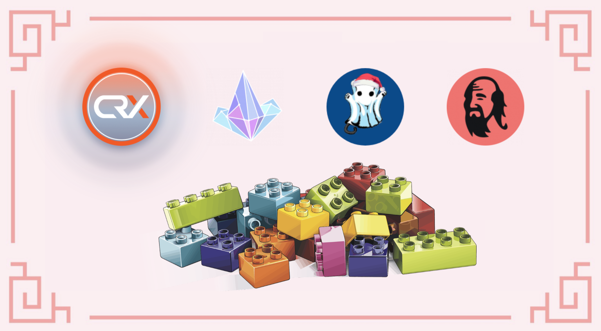
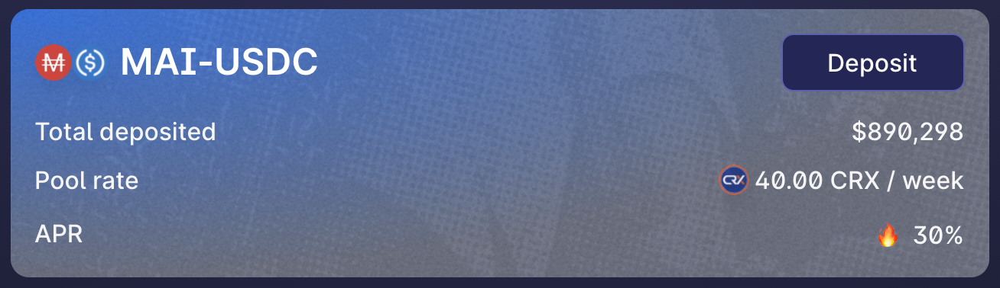
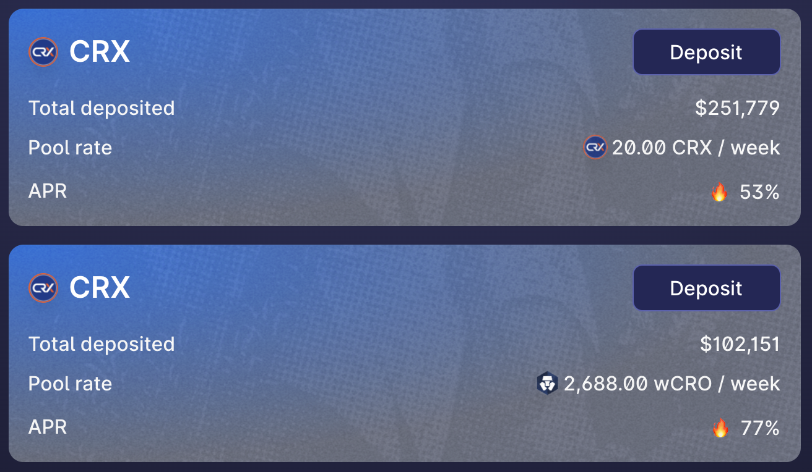
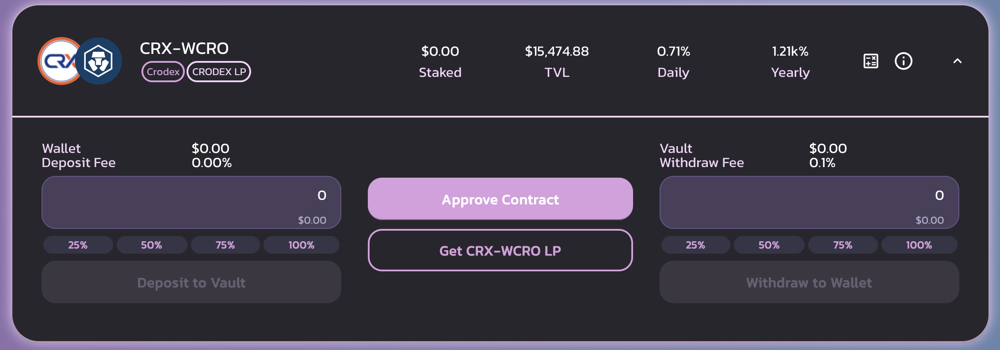
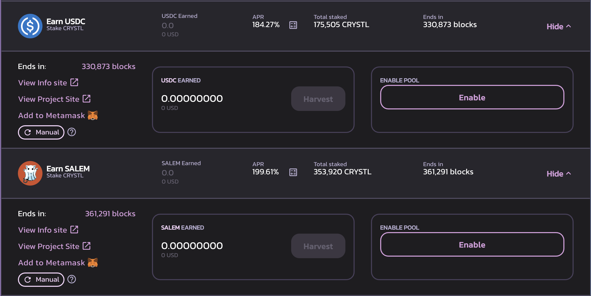
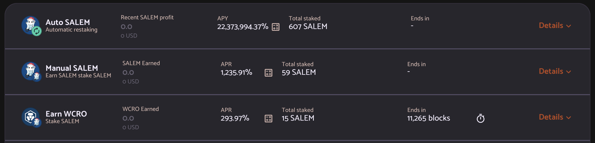
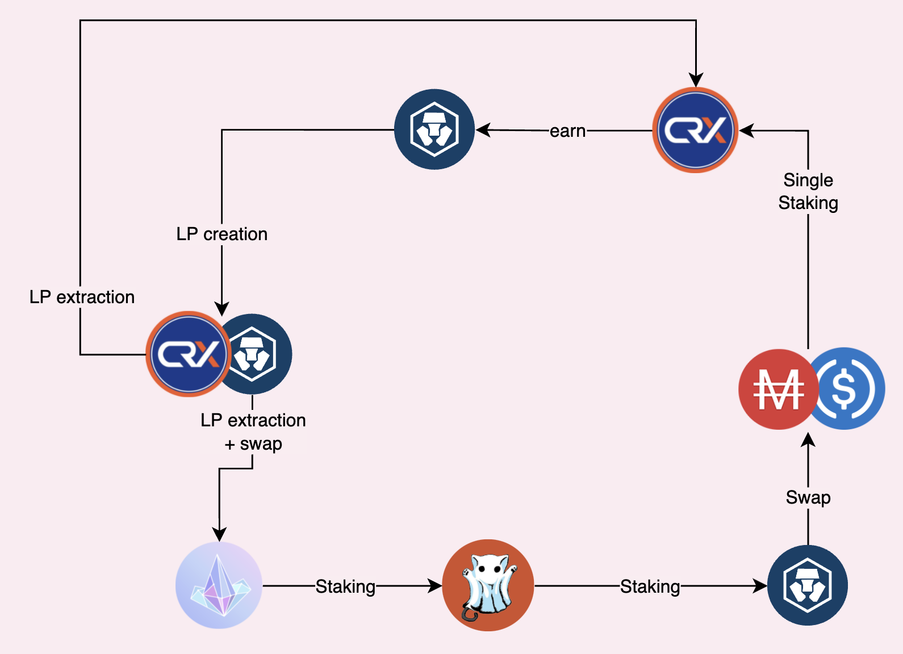
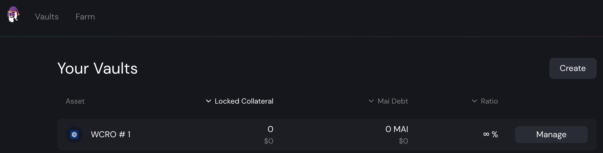

# Farm in stile Lego su CroDex

Il farming di rendimenti può sembrare facile. Avete 2 token, li combinate in una coppia LP (**L**iquidity **P**roviding), depositate il token LP in un pool, iniziate a ricevere commissioni di swap e la maggior parte delle volte, ricompense pagate nel token nativo della farm che state utilizzando. La maggior parte delle persone venderà semplicemente la ricompensa per qualunque assets di loro interesse, il che è il più delle volte totalmente valido ma molto lontano da una soluzione ottimizzata. Oggi vedremo come potete trarre profitto dall'altissimo APR (**A**nnual **P**ercentage **R**ate) proposto su Cronos su diverse DApps, che trasformerà un 30% di APR su stable coin in un valore molto più alto.

## CroDex

### Farmare con MAI

Anche se l'applicazione di prestito di Mai Finance non è ancora presente su Cronos, è già possibile trasferire $MAI da altre chain. Uno dei motivi per farlo è che non ci sono molti $MAI su Cronos, il che significa che qualsiasi applicazione che propone il farm con $MAI fornirà anche APR elevati. È il caso di CroDex, attualmente l'unico posto con liquidità $MAI su Cronos. Per questa guida, utilizzeremo il pool $MAI-$USDC su CroDex per ridurre il rischio di perdita temporanea sull'investimento iniziale ma potete aumentare ulteriormente i vostri guadagni farmando $MAI-$CRO.


Ogni volta che selezionate un'applicazione per il farming, è importante verificare se le ricompense vengono visualizzate come APR(**A**nnual **P**ercentage **R**ate) o APY (**A**nnual **P**ercentage **Y**ield). Quest'ultimo presuppone che tutte le ricompense ottenute vengano reinvestite giornalmente per un anno completo. Nel nostro esempio, un APR del 30% sulla coppia $MAI-$USDC corrisponde a un APY del 34,97%.

Se lo confrontate con il pool $MAI-$USDC su Mai Finance, l'APR dato è 20,18% su Polygon, 22,10% su Fantom e il pool $MAI-$av3CRV su Avalanche propone APR 23,24%. CroDex propone la migliore tariffa su $MAI di tutte le chain!


CroDex vi pagherà con il suo token nativo, il $CRX. A Dicembre 2021, 1 $CRX = 127.56 $USDC

### Staking singolo di $CRX

Qui è dove si fa interessante. CroDex ha 2 diversi pool in cui potrete mettere in stake i token $CRX per ulteriori ricompense. Potete mettere in stake per ottenere più $CRX ma utilizzeremo il pool in cui lo staking $CRX ci ricompenserà con token $wCRO. wCRO è la versione wrappata di $CRO, il token gas della rete Cronos.

Potete già vedere che potreste benissimo vendere $CRX per più token $MAI-$USDC LP e ottenere quasi il 35% APY sulla coppia stable ma è chiaramente meglio mettere in stake $CRX per ottenere $CRO. Non solo può essere utilizzato per pagare le commissioni di transazione, ma potete anche farmare $MAI-$CRO su CroDex. E più $CRX ottenete nel tempo, più $CRO otterrete se mettete in stake $CRX. Ma in questa guida esploreremo un po' di più Cronos!

## CRYSTL Finance

CRYSTL Finance era conosciuto come Polycrystal su Polygon. È un fork che propone coppie LP e pool di staking singolo e funziona esattamente come Beefy Finance. Useremo entrambi per la nostra strategia.

### Farming CRYSTL con CRX-WCRO

Useremo i token $CRO prodotti dallo staking $CRX per scambiare il 50% della ricompensa in più $CRX e combinare questi due token in una coppia $CRX-$WCRO su CroDex, quindi depositare il token LP in un vault su Crystl Finance. Questo vi darà un APY già molto alto.

I rendimenti visualizzati sono APY. Un APY dell'1,21k% corrisponde a un APR del 258,17%, ma potete anche ottenere i guadagni giornalieri stimati direttamente sulle informazioni del vault e il vostro farm di $CRX-$WCRO vi darà attualmente guadagni giornalieri dello 0,71%. È molto importante tenere traccia della ricompensa giornaliera perché estrarremo questa parte della nostra posizione LP e la suddivideremo in token separati. Il $CRX verrà rimesso in stake su CroDex per ottenere più token $CRO e il $CRO verrà scambiato con $CRYSTL. Tenete inoltre presente che è prevista una commissione di prelievo per i guadagni che otterremo ogni giorno.

### Staking singolo di CRYSTL

Con il token $CRYSTL ottenuto nel passaggio precedente, sarete in grado di ottenere $USDC dal pool single-staking di $CRYSTL Finance. Basta mettere in stale il token $CRYSTL e verrete pagati in $USDC con un APR piuttosto alto.

Quindi potete semplicemente scambiare il 50% dell'$USDC farmato con $MAI e aggiungerlo alla vostra posizione originale su CroDex.

In alternativa, possiamo utilizzare lo stesso approccio di cui sopra e mettere in stake token $CRYSTL per guadagnare token $SALEM, che è il token nativo di Salem Finance.

## Salem Finance

Salem Finance è un altro fork in cui potrete farmare il token $SALEM. La maggior parte dei pool LP ha una commissione di deposito, ma in realtà non utilizzeremo le farm LP poiché CRYSTL Finance ci sta già fornendo i token $SALEM di cui abbiamo bisogno. Invece, mettere in stake $SALEM nei pool per guadagnare $WCRO aggiuntivi con, ancora una volta, un APR molto alto.

Il token (w)CRO essendo il token gas di Cronos, ha molta utilità. Se lo desiderate, potete anche trasferirlo alla chain principale di Crypto.org. Nel nostro caso e poiché vogliamo chiudere il nostro ciclo di investimenti, possiamo semplicemente vendere i guadagni di Salem Finance e acquistare più $USDC e $MAI.

## Strategia di farming

Potete già notare che con solo 3 protocolli, avete diverse opzioni:

* Farming $MAI-$USDC per ottenere $CRX, staking di $CRX per ottenere $WCRO, vendere $WCRO per ulteriori $MAI-$USDC
* Farming MAI-USDC per ottenere $CRX, staking di CRX per ottenere $WCRO, farming di $CRX-$WCRO per ottenere $CRYSTL, staking di $CRYSTL per ottenere $USDC, swap di $USDC per ulteriori $MAI-$USDC
* Farming $MAI-$USDC per ottenere $CRX, staking di $CRX per ottenere $WCRO, farming $CRX-$WCRO per ottenere $CRYSTL, staking $CRYSTL per ottenere $SALEM, staking $SALEM per ottenere $WCRO, vendere $WCRO per ulteriori $MAI-$USDC

Per il resto di questa guida, ci concentreremo sull'ultima strategia, che è la più complessa e richiede molte manipolazioni, ma è anche quella che offre il miglior risultato complessivo. Sentitevi liberi di applicare quella che preferite in base alla vostra tolleranza al rischio.

### Messa a regime della strategia

Quella che segue è una simulazione realizzata con un investimento iniziale di $1.000 di token $MAI-$USDC LP e gli attuali APR/APY presentati in questo documento a Dicembre 2021. Naturalmente, le tariffe e i prezzi cambieranno nel tempo, quindi questa simulazione è valida solo al momento della scrittura e la simulazione fornirà solo una stima di ciò che potreste potenzialmente ottenere impostando questo sistema.

### Giorno 1

Depositare $MAI-$USDC su CroDex nel pool appropriato e ottenere il 30% APR . Alla fine del primo giorno, una volta ritirate le ricompense $CRX, avreste

| MAI-USDC | staked CRX | CRX-WCRO | CRYSTL | SALEM | WCRO  |
| -------- | ---------- | -------- | ------ | ----- | ----- |
| 1,000.00 | 0.822      | 0.000    | 0.000  | 0.000 | 0.000 |

### Giorno 2

I vostri $CRX in stake stanno generando $WCRO. Potete raccogliere la ricompensa e scambiare il 50% in più $CRX per creare una coppia $CRX-$WCRO che potete quindi depositare su CRYSTL Finance. Alla fine del secondo giorno avreste

| MAI-USDC | staked CRX | CRX-WCRO | CRYSTL | SALEM | WCRO  |
| -------- | ---------- | -------- | ------ | ----- | ----- |
| 1,000.00 | 1.644      | 0.002    | 0.000  | 0.000 | 0.000 |

### Giorno 3

La coppia $CRX-$WCRO bloccata nel vault CRYSTL Finance ha generato un token LP aggiuntivo. Dovrete estrarre il guadagno giornaliero, pagare una commissione dello 0,1% e suddividere la parte LP estratta in token $CRX e $WCRO. Puoi semplicemente rimettere in stak $CRX su CroDex e scambiare $WCRO in $CRYSTL.Questo può essere fatto su [CroDex dalla funzione di swap](https://swap.crodex.app/#/swap?outputCurrency=0xCbDE0E17d14F49e10a10302a32d17AE88a7Ecb8B). Alla fine della giornata avreste

| MAI-USDC | staked CRX | CRX-WCRO | CRYSTL  | SALEM | WCRO  |
| -------- | ---------- | -------- | ------- | ----- | ----- |
| 1,000.00 | 2.466      | 0.005    | 0.00003 | 0.000 | 0.000 |


Notate che le ricompense su CRYSTL sono molto piccole e potrebbe non essere interessante raccogliere le ricompense dal giorno 1. Questa simulazione mostra ancora le ricompense che dovreste ottenere e presumerà che le reinvestiate giornalmente ma questo è fatto per semplificare i calcoli. Assicuratevi di non spendere tutta la ricompensa in commissioni di transazione, potrebbe essere più vantaggioso fare il compound solo settimanalmente all'inizio.


### Giorno 4

Le vostre ricompense $CRYSTL di Crystl Finance possono essere messe in stake per guadagnare token $SALEM. Alla fine del 4° giorno otterreste

| MAI-USDC | staked CRX | CRX-WCRO | CRYSTL  | SALEM     | WCRO  |
| -------- | ---------- | -------- | ------- | --------- | ----- |
| 1,000.00 | 3.288      | 0.010    | 0.00011 | 0.0000002 | 0.000 |

### Giorno 5

L'ultimo giorno di messa a regime della strategia in cui raccoglierete le ricompense di Salem Finance. La ricompensa $WCRO può essere scambiata con più $MAI-$USDC. Tuttavia, come potete notare, il valore della ricompensa è così piccolo che non sarete in grado di raccogliere i $WCRO da Salem Finance prima del 50esimo giorno circa.

## Risultati del farming

### Routine quotidiana

Una volta che il sistema è completamente pronto, ecco la vostra routine quotidiana

* raccogliere i $CRX dal pool $MAI-$USDC
* raccogliere le ricompense $WCRO dal pool di staking singolo su CroDex
* swap 50% delle ricompense $WCRO per ulteriori $CRX su CroDex, e creazione della coppia LP $CRX-$WCRO
* depositare la coppia $CRX-$WCRO su CRYSTAL Finance
* ritirare una porzione di $CRX-$WCRO corrispondente alla ricompensa quotidiana
* dividere la coppia LP in $CRX e $WCRO su CroDex
* mettere in stake $CRX nel pool di staking singolo su CroDex che dà le ricompense in $WCRO
* swap dei $WCRO per $CRYSTL su CroDex
* mettere in stake i $CRYSTL su CRYSTAL Finance per ottenere i $SALEM
* raccogliere i $SALEM&#x20;
* mettere in stake singolo i $SALEM su Salem Finance
* raccogliere i $WCRO da Salem Finance
* swappare i $WCRO per $MAI e $USDC e aggiungerli alla coppia LP
* depositare la coppia $MAI-$USDC nel pool corretto su CroDex

### Risultati grezzi mese dopo mese

| giorno | MAI-USDC | staked CRX | CRX-WCRO | CRYSTL | SALEM  |
| ------ | -------- | ---------- | -------- | ------ | ------ |
| 30     | 1,000.00 | 25.583     | 0.600    | 0.104  | 0.004  |
| 60     | 1,000.00 | 50.819     | 1.830    | 0.682  | 0.059  |
| 90     | 1,000.04 | 76.736     | 3.315    | 1.941  | 0.260  |
| 120    | 1,000.14 | 103.424    | 4.922    | 3.970  | 0.729  |
| 150    | 1,000.41 | 130.935    | 6.606    | 6.816  | 1.594  |
| 180    | 1,001.93 | 159.307    | 8.352    | 10.515 | 2.994  |
| 210    | 1,001.87 | 188.578    | 10.156   | 15.094 | 5.070  |
| 240    | 1,003.39 | 218.789    | 12.019   | 20.584 | 7.969  |
| 270    | 1,005.71 | 249.988    | 13.942   | 27.014 | 11.843 |
| 300    | 1,009.10 | 282.227    | 15.929   | 34.414 | 16.848 |
| 330    | 1,013.82 | 315.569    | 17.982   | 42.817 | 23.147 |
| 360    | 1,020.23 | 350.084    | 20.105   | 52.256 | 30.906 |

### Giorno 365

Dopo un anno intero di farming con questo sistema, avreste

* $1,021.49 di $MAI-$USDC su CroDex
* $355.96 di $CRX in staking singolo su CroDex
* $20.47 di $CRX-$WCRO depositati su CRYSTL Finance
* $53.93 di $CRYSTL in staking singolo su CRYSTL Finance
* $32.353 di $SALEM in staking singolo su Salem Finance

I $WCRO da Salem Finance sono inclusi come posizione aggiuntiva $MAI-$USDC dato sono stati completamente venduti per incrementare questa coppia.

Ciò significa che con un investimento iniziale di $1.000, alla fine dell'anno avreste $1.484,45 su tutte le app, per un APY totale del 48,45%. E ricordate che questo viene fatto farmando solo una coppia stabile come base della strategia. È anche bene notare che l'unico token che viene scambiato nel tempo è il token $CRO.

### Alternativa usando Mai Finance

L'applicazione Mai Finance non supporta i depositi su Cronos, perché i token su Cronos non hanno ancora gli oracoli Chainlink. Si prevede che durante il primo trimestre del 2022, Chainlink aggiungerà i suoi oracoli su Cronos e sarate in grado di depositare i vostri token $WCRO in un Vault per prendere in prestito la stable coin $MAI. Ciò significa che la strategia di cui sopra può essere modificata per depositare $WCRO e utilizzare $MAI invece di vendere i token $WCRO, il che aumenterà leggermente il livello di ricompensa finale.

## Disclaimer

Questa guida è stata scritta per mostrare che potete aumentare i rendimenti senza vendere i token farmati. Non è semplice trovare la soluzione giusta quando si creano cicli farming ma è sicuramente fattibile e la maggior parte delle volte sarete ricompensati se riuscite a trovare la giusta combinazione. Tuttavia, questa guida è stata scritta solo per dimostrare come farlo e non per creare un sistema simile. Tutte le commissioni di transazione sono state volutamente scartate e alcune ricompense non dureranno per un anno intero, il che significa che potreste voler prendere in considerazione cicli più semplici per i vostri investimenti personali. Tuttavia, CroDex è un ottimo punto di partenza per questo tipo di sistema.


Questa guida non è ASSOLUTAMENTE un consiglio finanziario, è stata a solo scopo educativo. Dovete prestare attenzione alle variazioni di prezzo, domanda e offerta, data di fine dei programmi di ricompensa, impermanent loss ecc... L'obbiettivo non è quello di proporre ricette che possono essere seguite alla cieca quindi per favore fate i compiti a casa e le vostre simulazioni e investite solo ciò che siete disposti a perdere.

