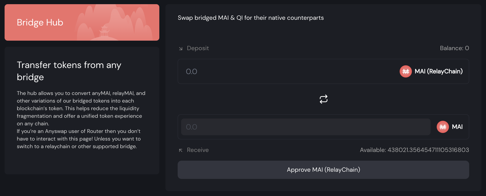

# Come iniziare con Cronos

## Cos'è Cronos?

Sarebbe difficile spiegare cosa sia Cronos senza menzionare Crypto.com. Crypto.com è uno dei più grandi scambi centralizzati (noti anche come CEX) e sta costruendo il proprio set di chain, tra cui Crypto.org Chain e Cronos. Crypto.org Chain è una chain con una tecnologia proprietaria mentre Cronos è la sua "sorella" compatibile con EVM (Ethereum Virtual Machine). È praticamente la stessa cosa della Binance Chain dedicata al CEX e della Binance Smart Chain che è compatibile con EVM.

Tra gli altri vantaggi, Cronos è **EVM-compatibile**, il che significa che la maggior parte delle applicazioni presenti su altre chain EVM possono essere implementate anche su Cronos, inclusa Mai Finance, e **Scalabile**: Cronos è più veloce ed economico della Ethereum Mainnet.

## Primi passi con Cronos

Per utilizzare la rete Cronos, avrete bisogno di un indirizzo per il portafoglio. Dato che Cronos è una rete compatibile con EVM, accetterà gli stessi portafogli di altre chain compatibili con EVM, inclusi portafogli web come Metamask o Nifty e sarete in grado di utilizzare i vostri portafogli hardware come Trezor o Ledger.

Per questo tutorial, ci atterremo a Metamask come per tutte le altre guide su questo sito. Se non avete Metamask installato, potete trovare le istruzioni su [Come iniziare con Polygon](../../polygon-tutorials/how-to-get-started-on-polygon.md).

### Aggiungere Cronos a Metamask

Se avete installato l'ultima versione di Metamask, dovreste già avere accesso alla chain Cronos e non dovrete far altro che selezionare Cronos nel menu a tendina delle reti nella parte superiore di Metamask. Potete anche impostare voi stessi un nuovo RPC per accedere a Cronos seguendo questi passaggi. Aprite l'estensione Metamask, fate clic sull'icona del vostro portafoglio, andate su Impostazioni, quindi scegliete Reti e scegliete Cronos. I dati che dovreste ottenere sono i seguenti:

* **Network Name:** Cronos
* **New RPC URL:** https://evm-cronos.crypto.org
* **Chain ID:** 25
* **Currency Symbol:** CRO
* **Block Explorer URL:** https://cronos.crypto.org/explorer/

Salvate le modifiche e Metamask passerà automaticamente alla rete Cronos:

## Trasferire assets verso Cronos (Bridging)

### Faucets

Non esiste un faucet ufficiale per ottenere i vostri primi token $CRO per le prime transazioni. Tuttavia, alcune applicazioni forniranno questo servizio se si trasferiscono dei fondi a Cronos o semplicemente se si necessita di gas:

* [Crystl Finance Faucet](https://cronos.crystl.finance/faucet): Dopo aver collegato il tuo portafoglio e completato il captcha, potreste essere in grado di richiedere alcuni $CRO che verranno inviati al vostro portafoglio.
* [Elk Finance](https://app.elk.finance/#/elknet): Quando trasferite i vostri token $ELK da una chain all'altra, avrete la possibilità di scambiare una piccola porzione degli $ELK trasferiti per il token gas nativo della chain di destinazione. Ciò è particolarmente utile se trasferendo assets per la prima volta a una nuova chain.

* [Crypto.com](https://crypto.com): Non dimenticate che Cronos è una chain profondamente legata a Crypto.com. Potete creare un account lì, acquistare i token $CRO direttamente collegando un conto bancario e inviarli a Cronos.


Tenete presente che avrete bisogno del token gas per poter effettuare transazioni. Ciò significa che se trasferite assets da un'altra chain a Cronos in un account senza token $CRO, rimarrete bloccati e non sarete in grado di fare nulla. Assicuratevi che il vostro portafoglio disponga di fondi sufficienti per eseguire almeno una transazione di scambio per il token gas.


### Bridges

* [Relay Chain](https://app.relaychain.com/transfer#/) è il partner ufficiale di Mai Finance se volete trasferire i vostri $MAI su Cronos. RelayChain supporta il bridging di $MAI da diverse chain ora, quindi sarete in grado di trasferire  i vostri assets da Polygon, Moonriver, Avalanche o Shiden a Cronos. Selezionate semplicemente la chain di destinazione come Cronos e il token da inviare (è il più delle volte denominato $MAI, ma a volte è anche sotto $miMATIC). Selezionate l'importo da trasferire e avviate il trasferimento, non dovrebbe richiedere più di 10 minuti. Fate attenzione alle commissioni di trasferimento. Tuttavia, una cosa buona di RelayChain è che ti darà un po' di $CRO sulla chain di destinazione in modo che possiate scambiare un po' di $MAI con $CRO.

* [AnySwap](https://anyswap.exchange/#/router) è un'altra alternativa per la maggior parte delle chain se si desidera trasferire alcuni assets a Cronos. Come nota a margine, AnySwap supporta anche il trasferimento di $MAI da Polygon a Cronos.
* [ElkNet](https://app.elk.finance/#/elknet) è un caso particolare dato che il bridge di Elk Finance vi consentirà di trasferire il token $ELK da qualsiasi chain compatibile con EVM a qualsiasi altra chain compatibile con EVM in cui sono distribuiti, con la possibilità di scambiare una piccola parte dell'importo trasferito in token di gas (vedi la sezione dedicata ai faucets appena sopra).

### MAI Hub

Nel caso in cui trasferiate $MAI da Polygon a Cronos tramite Relay Chain, otterrete la versione RelayChain di $MAI invece del $MAI nativo. I 2 token (quello di RelayChain e quello di Mai Finance) hanno lo stesso valore e lo stesso nome ma indirizzi di contratto diversi e l'unico che sarà accettato per farmare su Cronos è quello di Mai Finance.

Puoi scambiare i vostri $MAI (Relay Chain) usando [l'hub di Mai Finance](https://app.mai.finance/hub) con un rapporto 1:1 e a quel punto sarete in grado di utilizzare i veri $MAI su altre piattaforme.

Non dimenticate che dovrete convertire i $MAI nella versione Relay Chain quando vorrete trasferirli di nuovo da Cronos ad un'altra chain.


Anche se sembra che AnySwap supporti i trasferimenti di $MAI da Polygon a Cronos, riceverete la versione AnySwap di $MAI che non potrete scambiare tramite l'hub. Potreste rimanere bloccati con un token inutilizzabile, quindi assicuratevi di utilizzare il bridge giusto.


## DeFi su Cronos

Essendo Cronos collegato a Crypto.com, molti investimenti stanno fluendo nella chain e le applicazioni DeFi sono lì per supportare la liquidità. Pertanto sarete in grado di farmare sulle seguenti piattaforme:

* [CroDex](https://swap.crodex.app/#/swap): Questo è uno Top DEX (**D**ecentralized **Ex** changes) e AMMs (**A**utomated **M**arket **M**aker) su Cronos, ed è un fork di Uniswap v2 come QuickSwap. Sarete in grado di scambiare i vostri assets, partecipare all'estrazione di liquidità fornendo coppie LP (**L**iquidity **P**roviding) nelle farms o mettere in stake il token nativo della piattaforma per ottenere più ricompense. CroDex è anche il primo partner ufficiale di Mai Finance su Cronos e l'unico posto in cui potrete scambiare $MAI con altri assets, oltre a partecipare a programmi di liquidity mining farmando le coppie $MAI-$USDC e $MAI-$CRO .

Quando farmate su CroDex, otterrete ricompense in token $CRX che potete mettere in stake in un Vault per ottenere ulteriori $CRX ma ci sono altre (migliori) opzioni che verranno presentate in un tutorial futuro.

* [VVS](https://vvs.finance) e [CronaSwap](https://app.cronaswap.org): Questi sono altri DEXes/AMMs che sono dei fork di PancakeSwap (a sua volta un fork di Uniswap) con le stesse funzionalità di CroDex.
* [Beefy Finance](https://app.beefy.finance/#/cronos), [Adamant](https://adamant.finance) e [Autofarm](https://autofarm.network/cronos/) sono famosi aggregatori / ottimizzatori di rendimento che sono presenti su molte reti e dove sarete in grado di depositare i vostri token LP dalla maggior parte dei DEX e lasciare che gli algoritmi responsabili dei pool raccolgano i token della farm e facciano compound delle ricompense per ottenere più token LP .
* [Crystl Finance](https://cronos.crystl.finance) è un fork lanciato inizialmente su Polygon e che ora è disponibile anche su Cronos. Gli utenti potranno depositare token LP nei vaults per guadagnare token $CRYSTL che possono essere messi in stake, farmati o scambiati.
* [Fortune DAO](https://www.fortunedao.com/#/) è il fork principale di Ohm (Olympus) su Cronos ed accetta $DAI e $USDC.

## Mai Finance su Cronos

Attualmente l'applicazione non è ancora completamente avviata ed è principalmente in attesa che gli Oracle ChainLink accettino i token come garanzie. L'Hub è già presente quindi potete aspettarvi un lancio nel primo trimestre del 2022.

## Disclaimer

Questa guida NON è un consiglio finanziario e va considerata a puro scopo educativo. Fai sempre le tue ricerche. La discussione di un progetto in questa guida non deve essere considerata come un'approvazione del progetto stesso.


Tieni presente che una strategia che funziona bene in un dato momento potrebbe avere un rendimento peggiore (o farti perdere denaro) in un altro. Tieniti aggiornato, monitora i mercati, tieni d'occhio i tuoi investimenti e come sempre, fai le tue ricerche.

