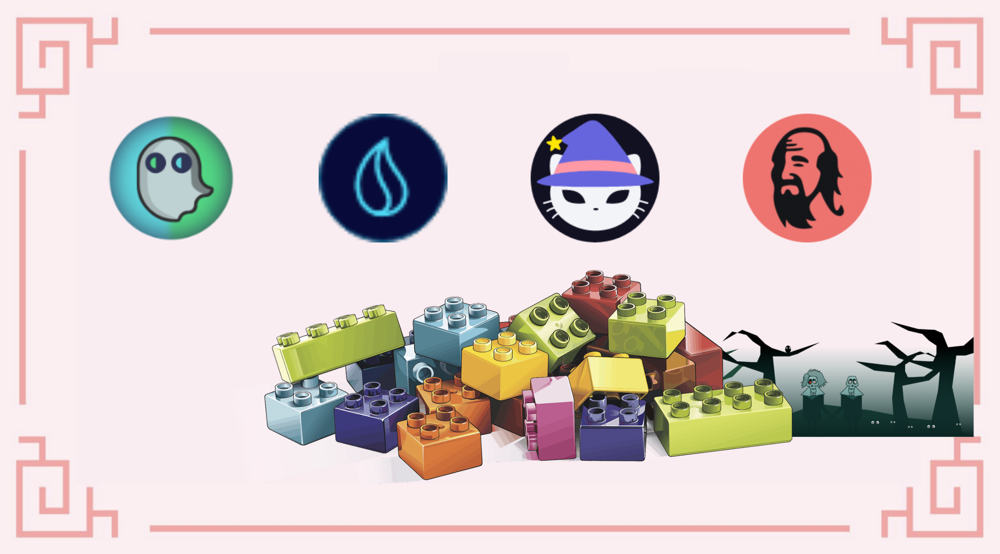
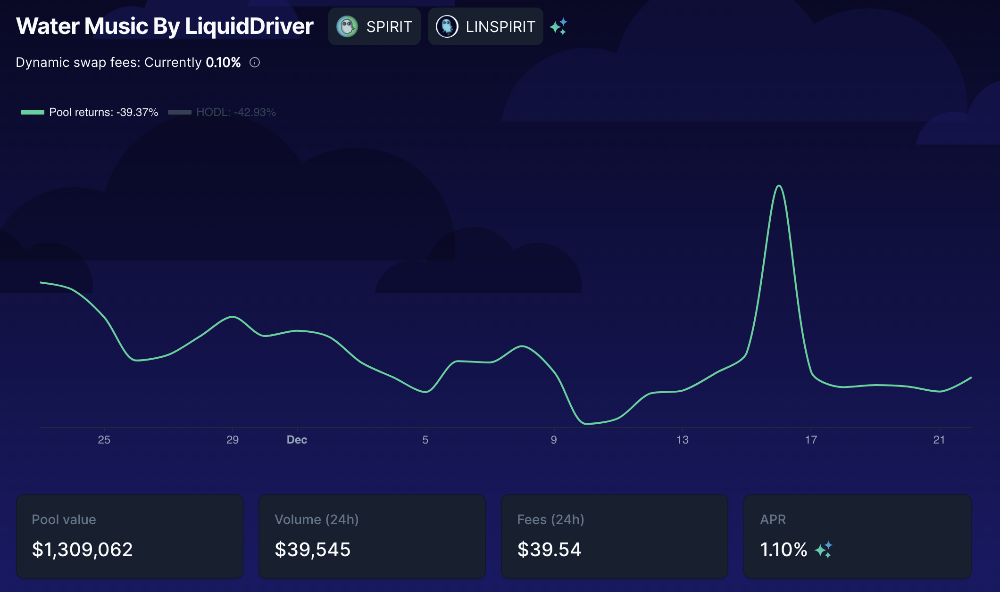

# Farming loop usando SpiritSwap

Quando si farma, la coppia LP (**L**iquidity **P**roviding) è molto importante. Fondamentalmente, vorreste la minor impermanent loss possibile in modo da non perdere l'investimento iniziale. Questa coppia iniziale genererà un rendimento e potrete aumentare i vostri guadagni reinvestendo il token farmato senza rischi aggiuntivi sul capitale iniziale. Questo è uno dei motivi per cui le nostre guide propongono strategie basate solo su stable coin o su coppie composte da una stable coin e un token blue chip come Bitcoin, Ethereum  o il token gas nativo della chain su cui stiamo eseguendo la strategia.

Oggi esploreremo un loop relativamente complesso che sarà basato sulla coppia LP $MAI-$WFTM fornita da SpiritSwap per celebrare il suo lancio.

## Farmare MAI su SpiritSwap

[SpiritSwap](https://app.spiritswap.finance/#/) è uno dei DEX principali (**D**ecentralized **Ex**change) nonchè AMM (**A**utomated **M**arket **M**aker) su Fantom. Si basa sulla piattaforma Uniswap quindi capirete sicuramente le caratteristiche principali di SpiritSwap, scambiare asset, fornire liquidità per guadagnare rendimenti. Otterrete ricompense nel token nativo della piattaforma, il token $SPIRIT che potrete mettere in stake e ottenere $inSPIRIT. Il token $inSPIRIT è particolarmente utile, vi permetterà di votare per i pool di liquidità su cui verrà applicato ulteriore boost e vi permetterà di guadagnare un rendimento extra dalle entrate del protocollo.

Per la nostra strategia, utilizzeremo il pool $MAI-$WFTM. A partire da dicembre 2021, questa farm  può essere trovata nel tab`Booster Farms`.


Quando questa guida è stata creata, il pool era in una fase molto precoce (lanciata nelle ultime 24 ore), il che potrebbe spiegare l'APR molto alto (**A**nnual **P**ercentage **R**ate). Come sempre, prima di applicare una delle nostre strategie, fate le vostre ricerche e verificate il l'APR prima di investire. Per confronto, $USDC-$WMATIC su Polygon è a circa il 75% e $MAI-$MOVR su Moonbeam è al 158%. Altri pool come $USDC-$WFTM si sono stabilizzati intorno al 50% su Fantom.

Ai fini di questa guida, manterremo l'APR più basso dell'intervallo osservato, 152,98%, che potrebbe essere molto più di quello "stabilizzato".


Quando farmate $MAI-$WFTM su SpiritSwap, ricevete ricompense pagate in $SPIRIT, il token nativo della DApp (**D**ecentralized **App**lication). A Dicembre 2021, 1 $SPIRIT = 0.130 $USDC.

## Farmare usando il token SPIRIT su Liquid Driver

[Liquid Driver](https://www.liquiddriver.finance) è un altro fork di Uniswap che si concentra sulla fornitura di liquidità su Fantom. Una delle funzionalità che ci interessa di più su Liquid Driver è il fatto che possono creare token $linSPIRIT dai token $SPIRIT. Il $linSPIRIT è una versione liquida del token $inSPIRIT. Il rapporto tra $linSPIRIT e $inSPIRIT è 1:1, è in realtà solo una versione wrappata del token $inSPIRIT e potete scambiare entrambi i token l'uno con l'altro direttamente su Liquid Driver.

Tuttavia, non utilizzeremo questa funzione. Farmeremo il pool $SPIRIT-$linSPIRIT su Liquid Driver, ma c'è un piccolo problema:

Come potete vedere, dovete creare il token LP su BeethovenX per ottenere l'APR del 61% pagato in token $LQDR. A Dicembre 2021, 1 $LQDR = 4.560 $USDC. Vediamo come ottenere questo token LP.

## Creare SPIRIT-linSPIRIT su BeethovenX

[BeethovenX](https://app.beets.fi/#/) è stato riconosciuto come pool di Balancer ufficiale su Fantom. Per quanto riguarda Balancer, non è necessario depositare la stessa quantità di entrambi i token per creare un token LP. Ciò significa che potete depositare direttamente il 100% dei token $SPIRIT e lasciare che l'algoritmo responsabile del pool lo mantenga bilanciato.

In cambio riceverete il token LP che potrete depositare su Liquid Driver.


Come puoi vedere, questo pool non è incentivato su BeethovenX, quindi non guadagnerete $BEETS. Gli incentivi sono forniti esclusivamente da Liquid Driver quando depositate il ​​token LP sulla loro piattaforma e l'unica ricompensa che otterrete viene pagata in $LQDR.


## Staking di LQDR su Liquid Driver

Dopo aver creato il token LP $SPIRIT-$linSPIRIT su BeenthovenX e averlo depositato nel pool corretto su Liquid Driver, inizierete a guadagnare token $LQDR. Potete quindi mettere in stake $LQDR per guadagnare una parte delle entrate del protocollo. La cosa interessante è che potete scegliere il periodo di tempo per cui i vostri $LQDR resteranno in staking e questo influenzerà direttamente il vostro APR (è la stessa cosa di quando mettete in stake $Qi per guadagnare entrate dal protocollo). Il tempo medio di blocco è poco meno di 2 anni (tempo di blocco massimo) e le ricompense vengono pagate in:

* $LQDR: potrete rimettere in stake questa ricompensa
* $WFTM: lo useremo in seguito
* $BOO: lo useremo in seguito
* $linSPIRIT: questo lo useremo per incrementare la posizione $SPIRIT-$linSPIRIT su Liquid Driver
* $SPELL: swappabile per ulteriori $WFTM !!!

## Staking di BOO su SpookySwap

[SpookySwap](https://spookyswap.finance) è quasi l'ultimo pezzo del nostro puzzle. Lo stake di $LQDR su Liquid Driver ci farà guadagnare token $BOO, il token nativo di SpookySwap. SpookySwap è il più grande DEX/AMM su Fantom, quindi potete fare praticamente la stessa cosa di SpiritSwap, tranne che il loro token nativo è il token $BOO. Ciò è particolarmente utile perché potete mettere in stake $BOO su SpookySwap per ottenere token $xBOO e questa versione di $BOO in stake può essere utilizzata per farmare altri token (è una caratteristica comune per i fork Uniswap). Quindi, una volta che avete $xBOO, sarete in grado di depositare questi token su SpookySwap per guadagnare $WFTM aggiuntivo.

## Ottenere ulteriori token LP MAI-WTFM

Liquid Driver e SpookySwap produrranno token $WFTM, quindi ci mancano i $MAI per incrementare la nostra posizione LP iniziale in SpiritSwap. Questo può essere fatto in vari modi:

* Swap del 50% dei vostri $WFTM per $MAI
* Fare lending del 66% dei nostri $WFTM su Beefy o Yearn Finance per ottenere $mooScreamFTM o $yvWFTM, quindi depositare i token collaterali su Mai Finance e prendere in prestito $MAI
* Swap del 66% dei vostri $WFTM per un'altro asset e utilizzare la stessa strategia precedente per prendere in prestito $MAI


Se avete bisogno di maggiori dettagli sugli ultimi 2 punti in elenco, abbiamo un articolo dedicato su [come far fruttare i tuoi token su Fantom](leverage-your-crypto-on-fantom.md).


Per la nostra guida, cercheremo di massimizzare i nostri guadagni e utilizzare $mooScreamDAI. Ciò significa che scambieremo il 66% del nostro $WFTM con $DAI su Spirit Swap quindi depositeremo $DAI direttamente su Beefy utilizzando $SCREAM come piattaforma sottostante per ottenere $mooScreamDAI. Questo token verrà quindi depositato in un Vault su Mai Finance e potremo prendere in prestito $MAI. Al fine di ridurre il rischio di liquidazione, manterremo un CDR (**C**ollateral to **D**ebt **R**atio) del 200%, il che significa che prenderemo in prestito metà del valore del nostro deposito. Questo è l'ideale perchè corrisponde allo stesso valore dei $WFTM che abbiamo tenuto, in modo che sarà possibile creare ulteriori token LP $MAI-$WFTM.

Alla fine del loop, otterremo più $MAI-$WFTM e un token con rendimento usato come garanzia su Mai Finance.

## Strategia di Farming

La seguente simulazione è fatta assumendo alcune cose:

* Tutte le tariffe e i prezzi rimangono gli stessi per l'intero periodo della simulazione, 1 anno nel nostro caso
  * 153% APR sul farm di $MAI-$WFTM su SpiritSwap
  * nessuna ricompensa su $linSPIRIT
  * 61% APR da $SPIRIT-$linSPIRIT su Liquid Driver
  * 139% APR dallo staking di $LQDR
    * 26% APR in $LQDR
    * 6% in $WFTM
    * 30% in $BOO
    * 74% in $linSPIRIT
    * 3% in $SPELL
  * 36% APR per lo staking di $xBOO
  * 21% APR da $mooScreamDAI
* Tutti le ricompense e i programmi sono validi per un anno intero
* L'investimento iniziale è del valore di $1,000$ in token LP $MAI-$WFTM

### Giorno 1

Il primo giorno, depositate semplicemente la vostra coppia LP $MAI-$WFTM su SpiritSwap. Alla fine della giornata, raccogliete i token $SPIRIT e combinateli in una coppia LP $SPIRIT-$linSPIRIT su BeethovenX, quindi depositate questo token LP su Liquid Driver. Alla fine della giornata, otterreste

| MAI-WFTM | linPIRIT-SPIRIT | LQDR | xBOO | mooScreamDAI |
| -------- | --------------- | ---- | ---- | ------------ |
| 1,000.00 | 4.19            | 0.00 | 0.00 | 0.00         |

### Giorno 2

Il giorno 2, i $MAI-$WFTM stanno ancora generando token $SPIRIT che depositerete nel pool $linSPIRIT-$SPIRIT su Liquid Driver, ma sarete anche in grado di raccogliere i primi token $LQDR e metterli in stake per le ricompense multiple . Alla fine della giornata, avrete

| MAI-WFTM | linPIRIT-SPIRIT | LQDR  | xBOO | mooScreamDAI |
| -------- | --------------- | ----- | ---- | ------------ |
| 1,000.00 | 8.38            | 0.007 | 0.00 | 0.00         |

### Giorno 3

Il giorno 3, la stessa cosa tranne che i vostri $LQDR avranno prodotto i vostri primi token esotici dalle entrate del protocollo. Non dimenticate che in realtà metterete in stake $BOO, aggiungerete il  $linSPIRIT al pool, i vostri $LQDR cresceranno e il resto verrà scambiato con $WFTM. I $WFTM risultanti vengono quindi parzialmente scambiati con $DAI e quindi i $mooScreamDAI depositati in un Vault per prendere in prestito $MAI, riaggiunti alla coppia LP $MAI-$WFTM che viene quindi depositata su SpiritSwap. Alla fine del giorno 3, otterreste

| MAI-WFTM | linPIRIT-SPIRIT | LQDR  | xBOO | mooScreamDAI |
| -------- | --------------- | ----- | ---- | ------------ |
| 1,000.00 | 12.58           | 0.021 | 0.00 | 0.00         |


Le posizioni $xBOO e $mooScreamDAI sono troppo piccole per essere visualizzate, quindi potete saltare questi passaggi per i primi giorni. Inoltre, per semplicità, non stiamo prendendo in considerazione le commissioni di transazione, che potrebbero avere un impatto sui vostri guadagni.


A questo punto il sistema è pronto, è ora di sedersi e trarre profitto.

## Risultati del Farming&#x20;

### Routine Quotidiana

Una volta che il sistema è stato completamente avviato, ecco la routine quotidiana che dovrete seguire:

* raccogliere i token $SPIRIT dal pool $MAI-$WFTM su SpiritSwap
* raccogliere le ricompense dal pool di staking su Liquid Driver
* raccogliere le ricompense dal pool di staking su SpookySwap
* depositare gli $SPIRIT di SpiritSwap e i $linSPIRIT di Liquid Driver nel pool su BeethovenX
* depositare i token LP $SPIRIT-$linSPIRIT su Liquid Driver
* mettere in stake $BOO su SpookySwap per ottenere $xBOO
* mettere in stake $xBOO per farmare $WFTM
* swappare $SPELL per $WFTM
* swappare il 66% degli $WFTM per $DAI
* depositare i $DAI generati su Beefy per ottenere $mooScreamDAI
* depositare i $mooScreamDAI su Mai Finance
* prendere in prestito $MAI e mantenere un CDR del 200% (50% di quanto depositato)
* aggiungere liquidità per il pool $MAI-$WFTM su SpiritSwap

### Stima "grezza" dei guadagni mese dopo mese

| day | MAI-WFTM  | linPIRIT-SPIRIT | LQDR    | xBOO   | mooScreamDAI | MAI debt |
| --- | --------- | --------------- | ------- | ------ | ------------ | -------- |
| 30  | 1,000.004 | 130.010         | 3.281   | 0.026  | 0.005        | 0.002    |
| 60  | 1,000.039 | 256.218         | 13.014  | 0.210  | 0.041        | 0.021    |
| 90  | 1,000.140 | 383.220         | 29.369  | 0.712  | 0.147        | 0.074    |
| 120 | 1,000.349 | 511.436         | 52.538  | 1.698  | 0.364        | 0.182    |
| 150 | 1,000.708 | 641.302         | 82.741  | 3.338  | 0.738        | 0.369    |
| 180 | 1,001.268 | 773.275         | 120.224 | 5.810  | 1.323        | 0.661    |
| 210 | 1,002.081 | 907.835         | 165.263 | 9.295  | 2.175        | 1.088    |
| 240 | 1,003.207 | 1,045.486       | 218.165 | 13.984 | 3.360        | 1.680    |
| 270 | 1,004.710 | 1,186.759       | 279.268 | 20.075 | 4.947        | 2.473    |
| 300 | 1,006.659 | 1,332.316       | 348.947 | 27.773 | 7.014        | 3.507    |
| 330 | 1,009.130 | 1,482.451       | 427.613 | 37.296 | 9.645        | 4.823    |
| 360 | 1,012.205 | 1,638.095       | 515.717 | 48.870 | 12.935       | 6.467    |

### Giorno 365

Dopo un anno intero di farming otterreste

* $1,012.782 di $MAI-$WFTM su SpiritSwap
* $1,664.608 di $linSPIRIT-$SPIRIT su Liquid Driver
* $531.353 di $LQDR in stake su Liquid Driver
* $51.015 di $xBOO su SpookySwap
* $13.554 di $mooScreamDAI su Mai Finance in un Vault
* $6.777 di debito in $MAI

Considerando un investimento iniziale di $1.000 questo equivarrebbe ad un APY del 227,096%

### Piccoli accorgimenti per la strategia

Se volete ottenere un'esposizione al rischio inferiore, potete iniziare con un investimento iniziale di $1.000 di $mooScreamDAI in un Vault, prendere in prestito $500 di $MAI e scambiare il 50% per $WFTM per ottenere la coppia di partenza su SpiritSwap. Ciò ridurrà considerevolmente il rischio di perdere parte dell'investimento iniziale nel caso in cui il prezzo di $FTM scenda troppo.

Al momento, il tasso più alto è dato dal pool SpiritSwap, quindi una possibile semplificazione del ciclo sarebbe semplicemente scambiare tutti i token $LQDR che ottenete su Liquid Driver per ulteriori $MAI-$WFTM.

## Disclaimer

Questa guida è una versione teorica di qualcosa che potreste implementare su Fantom. Quando esponiamo i loop nei nostri tutorial, in realtà cerchiamo di non vendere mai i token farmati e cerchiamo sempre di trovare il modo migliore possibile per utilizzare tutto ciò che raccogliamo. Questo è un buon modo per mantenere il prezzo in aumento poiché farmare e vendere un token di solito fa diminuire il prezzo del token farmato, rendendo i rendimenti sempre meno attraenti. Se tutti mantenessero i loro token farmati, il loro prezzo aumenterebbe solo con il tempo. In ogni caso, la guida si basa anche su molti presupposti (il prezzo che non cambia, i tassi delle ricompense che non cambiano) e non conta le commissioni di transazione, quindi se volete implementare questo tipo di circuito chiuso, assicuratevi che sia redditizio alla fine della giornata o valutate di accumulare i guadagni solo una volta alla settimana. E come al solito, DYOR!


Questa guida non è assolutamente un consiglio finanziario, è stata realizzata a solo scopo educativo. Dovete prestare attenzione alle variazioni di prezzo, domanda e offerta, date di fine dei programmi di ricompensa, impermanent loss ecc... L'obiettivo non è quello di proporre ricette che possono essere seguite alla cieca quindi, per favore, fate i compiti e fate le vostre simulazioni e investite solo ciò che siete disposti a perdere.

