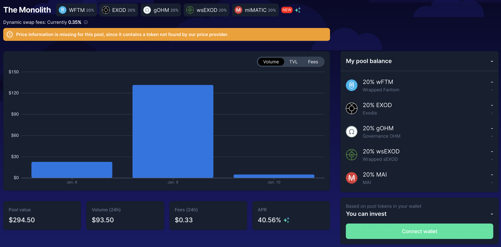
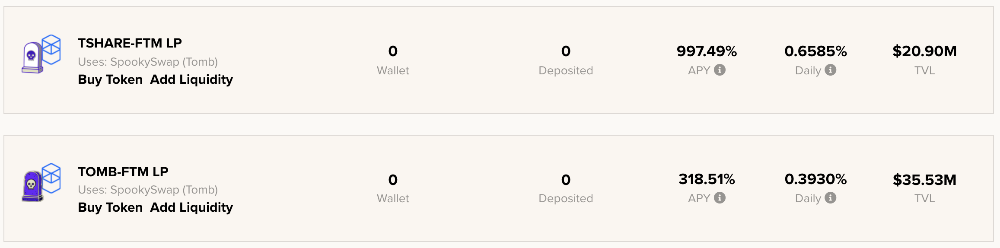

# Exodia Combo su Fantom

## Introduzione

Una delle cose più importanti da tenere a mente quando investite in crypto valute è assicurarsi che l'investimento iniziale sia protetto. Se tenete a mente questo fondamentale, imparerete a rischiare solamente i rendimenti generati. Tuttavia, c'è un'altra opzione se volete investire in un token che potrebbe essere a rischio: acquistarlo con uno sconto e assicurarvi che le ricompense siano sufficientemente alte da coprire l'investimento iniziale il più velocemente possibile.&#x20;

Da qualche mese, questo è possibile con l'introduzione di obbligazioni con tassi di reward molto elevati proposti da alcuni progetti. Quindi oggi esploreremo due progetti su Fantom che utilizzano il concetto di DeFi Lego per raggiungere 2 obiettivi molto diversi.

## Exodia

### Presentazione del progetto

[Exodia](https://app.exodia.fi/dashboard) è un piccolo progetto su Fantom che ha un potenziale gigantesco. È un fork di Ohm basato sul token $EXOD, una valuta "riserva di valore" supportata da diversi asset. Gli assets di supporto iniziali aggiunti alla tesoreria di Exodia sono $DAI e $FTM ma il team e la DAO responsabili del protocollo hanno deciso di sviluppare legami con la comunità Olympus e di allocare il 33% delle sue riserve in eccesso per acquistare assets denominati in $OHM. Di conseguenza, una piccola parte del tesoro è denominata in token $gOHM.

### Nuovo Bond con LP Token

Al fine di rafforzare i legami, Exodia ha recentemente votato per aumentare la quantità di token $OHM nella sua treasury e presto accetterà un nuovo token come parte del loro programma di bonding. Il nuovo token è un token LP (**L**iquidity **P**roviding) che si può creare su BeethovenX. Una delle cose migliori dei token BeethovenX è che possono essere creati anche se si possiede un solo asset dalla selezione nel pool, il che lo rende facilmente accessibile. Il token LP è composto da

* 20% $wFTM
* 20% $EXOD
* 20% $wsEXOD
* 20% $gOHM
* 20% $MAI

Questo è probabilmente il primo fork di Ohm che utilizza un token LP di un fork di Balancer per i suoi bond. E' particolarmente interessante perchè potete acquistare nuove obbligazioni usando solo i vostri token $EXOD. I passaggi coinvolti sarebbero:

* depositate i vostri $EXOD token nel `The Monolith` pool su BeethovenX per ottenere LP token
* vendete il token LP nell'app Exodia per comprare altri $EXOD con uno sconto
* attendete il periodo di vesting e ritirate i vostri $EXOD tokens
* ripetete

Ciò riduce drasticamente la pressione di vendita sui token $EXOD, il che può solo avvantaggiare il protocollo. In precedenza, i "flipper" obbligazionari avrebbero dovuto vendere il loro $EXOD affinché $DAI acquistasse obbligazioni aggiuntive, il che è dannoso in quanto riduce il prezzo del token e ha un effetto a cascata sulla tesoreria e sul periodo di runway.


Se non avete dimestichezza con i progetti Ohm, vi consigliamo vivamente di leggere altre letture sull'argomento. Potete fare riferimento alla nostra guida su Klima (vedi la sezione Polygon) o andare direttamente alla [documentazione ufficiale di Exodia](https://docs.exodia.finance). Inoltre, potreste unirvi al loro Discord e iscrivervi al loro programma educativo.


Noterete anche che il token LP accetta $MAI, la stable coin coniabile su Mai Finance. Questa sarà effettivamente la nostra fonte principale per l'LP (vedi più avanti). Una volta che avete acquistato le  obbligazioni con uno sconto decente, riceverete i vostri token $EXOD alla fine del periodo di vesting. Potete anche metterli in stake ad un APY decente(**A**nnual **P**ercentage **Y**ield) del 38,787%, che equivale ad un APR (**A**nnual **P**ercentage **R**ate) del 601% o un guadagno giornaliero di 1.65%.

Utilizzeremo il sistema di legame per acquistare token $EXOD con uno sconto e trarre profitto dall'APY molto elevato per raccogliere guadagni dai premi di rebase.

## Tomb Finance

[Tomb Finance](https://tomb.finance) è un progetto molto particolare, originale per molti versi. Il token $TOMB è una stable coin algoritmica ancorata al token $FTM e progettata per essere un mezzo di scambio ed aggiungere ulteriore liquidità a $FTM il token gas della chain Fantom.

L'ecosistema Tomb Finance propone altri 2 token:

* $TSHARE: questo è il token di governance per Tomb Finance. I titolari di $TSHARE hanno diritto di voto. Gli staker di $TSHARE riceveranno anche ulteriori $TOMB. L'emissione di token $TOMB aggiuntivi ai possessori di $TSHARE segue la stessa meccanica dei fork di Ohm con il nuovo token coniato alla fine di ogni epoch e con APY molto alto.
* $TBOND: questo è un token speciale che viene utilizzato principalmente per mantenere il peg a 1 FTM. Quando il prezzo $TOMB scende al di sotto di 1 FTM, gli utenti possono acquistare $TBOND al prezzo corrente dei token $TOMB. Possono farlo vendendo token $TOMB al protocollo e questi token vengono bruciati, il che riporta il valore di $TOMB di nuovo a 1 FTM. L'acquisto di $TBOND con uno sconto e la possibilità di riscattare i token $TOMB ha dato il nome al token $TBOND. Quando il token $TOMB è sopra il peg, le persone possono riscattare il loro $TBOND per $TOMB. Vengono quindi coniati nuovi $TOMB, riportando in basso il valore del token. In altre parole, questo è un token di arbitraggio!

Tomb Finance propone anche 2 pool di LP che vi faranno guadagnare token $TSHARE. Questo è particolarmente importante per Tomb Finance per avere una liquidità molto profonda. Tuttavia, per raggiungere l'obiettivo di rendere $TOMB una soluzione alternativa a $FTM è importante che il protocollo abbia utenti che utilizzino $TOMB, detenendone quindi la liquidità. Quando farmate i pool $TOMB-$FTM e $TSHARE-$FTM, venite ricompensati con token $TSHARE che vi permetteranno di guadagnare più token $TOMB, praticamente un piccolo circuito chiuso all'interno di una singola applicazione.

## Componenti addizionali per chiudere il circuito

Ora che abbiamo presentato i 2 componenti principali per la nostra strategia, vediamo rapidamente gli altri necessari a completare la strategia.

### Beefy Finance

[Beefy Finance](https://app.beefy.finance/#/fantom) è un ottimizzatore di rendimento che accetta i token LP di un DEX (**D**ecentralized **Ex**changes), i suoi token farmati e lascia che l'algoritmo venda le ricompense per incrementare la vostra posizione LP. In virtù di questo potete ottenere una posizione di investimento crescente che aggraverà solo i token dei LP e catturerà il valore del token ricompensa nel momento in cui il token viene raccolto.

Per la nostra strategia, utilizzeremo il token LP $TOMB-$FTM. I motivi sono molteplici:

* essendo $TOMB ancorato al token $FTM, non genera IL(**I**mpermanent **L**oss) sulla coppia, quindi l'unica variazione sarà legata alla variazione di prezzo di $FTM
* la ricompensa di $TOMB-$FTM è pagata in $TSHARE, quindi la vendita di $TSHARE non influirà sui 2 token della coppia
* $TOMB-$FTM ha un APY piuttosto alto per un token LP senza IL
* l'utilizzo del token LP su beefy vi consentirà di ottenere il token di ricevuta $mooTombTOMB-$FTM


Ai fini di questa guida, utilizziamo il token $TOMB-$FTM perché presenta meno rischi a causa dell'assenza di impermanent loss sulla coppia. Tuttavia, potete utilizzare anche la coppia $TSHARE-$FTM per ottenere ricompense più elevate. Assicuratevi di comprendere i rischi e DYOR.


### Market XYZ Lending

[Market.XYZ](https://fantom.market.xyz/pool/3) è un protocollo di prestito su cui potrete depositare alcuni assets particolari e prendere in prestito contro di essi. Quando prestate i vostri assets, potreste ricevere alcuni incentivi pagati nel token che prestate. Quando prendete in prestito, dovrete pagare alcuni interessi al momento del rimborso, nello stesso asset che avete preso in prestito.

Market XYZ ha avviato una partnership con Mai Finance nel 2021 per consentire l'utilizzo di classi aggiuntive di assets come garanzia per prendere in prestito la stable coin $MAI. Questi assets sono considerati più rischiosi di quelli attualmente accettati direttamente su Mai Finance oppure sono solo in attesa di un ChainLink Oracle ufficiale e quindi non vengono accettati direttamente sull'app principale. Ciò comporta ulteriori vantaggi: il protocollo QiDAO guadagna commissioni dai $MAI presi in prestito, i mutuatari ottengono $MAI a bassi tassi di interesse (Mai Finance aggiunge più $MAI dal tesoro regolarmente in base alla domanda) ed è un caso d'uso molto interessante per la stable coin, aumentandone l'utilizzo. D'altro canto, i mercati dei prestiti sono un ottimo modo per avviare solide relazioni con diversi partner mentre aspettano che i loro assets vengano accettati direttamente su Mai Finance.

Il mercato dei prestiti a cui siamo interessati per questa strategia è il Beefy Locker $TOMB. Dopo aver depositato i nostri token $TOMB-$FTM su Beefy, riceviamo il token di ricevuta $mooTombTOMB-$FTM che è una "prova di proprietà" del token che sta generando rendimenti su Beefy. Questo token di ricevuta può essere utilizzato come garanzia su MarketXYZ per prendere in prestito $MAI aggiuntivo.


Market.XYZ consente solo prestiti con un valore minimo di 0,05 ETH (\~$170,00 al momento della scrittura). Assicuratevi di depositare abbastanza assets a garanzia se volete prendere in prestito dai diversi locker.


Nello screenshot qui sopra, potete vedere che possiamo:

* depositare il token $mooTombTOMB-$FTM come collaterale e ottenere un APY del 355.4% , offerte da Beefy
* prendere in prestito $MAI contro la nostra garanzia con un APR del 15.02%

È facile notare che i guadagni che otteniamo dal farming LP superano di gran lunga gli interessi di prestito, il che rende praticabile questa strategia. Tuttavia, assicuratevi di monitorare correttamente il prezzo di $FTM e $TOMB per evitare la liquidazione e assicuratevi di prendere in prestito a un CDR molto alto (**C**ollateral to **D**ebt **R**atio), che vi darà abbastanza tempo per rimborsare il prestito in caso di un forte calo dei prezzi.


Se non siete interessati a questa strategia ma siete utenti di Mai Finance, Market XYZ è un'applicazione straordinaria per prestare i vostri $MAI. Sarete pagati in $MAI aggiuntivi che verranno aggiunti alla vostra posizione.


## Strategia di farming

Per completare il nostro ciclo di investimento, inizieremo con l'acquisto di obbligazioni $EXOD utilizzando $MAI. Le ricompense di rebase $EXOD verranno utilizzate per acquistare token LP $TOMB-$FTM . I token verranno utilizzati su Beefy per aumentare le ricompense $TSHARE. Inoltre, la ricevuta del token LP verrà utilizzata come garanzia sul mercato XYZ per prendere in prestito più $MAI, il che ci rimanda al nostro passaggio iniziale.

Faremo la simulazione dando per assodati alcuni punti (che difficilmente resteranno tali nel tempo):

* tutte le tariffe e i prezzi delle ricompense rimangono gli stessi per un anno
* L' APY di Exodia è 38,787%
* L'APY di $TOMB-$FTM su beefy è 318.51%
* l'interesse sul prestito da Market XYZ è del 15,02%&#x20;

Inoltre, supponiamo che voi stiate raccogliendo le vostre obbligazioni e i token $EXOD extra ogni giorno e ne mettiate in stake il ​​50% per beneficiare dei rebase il prima possibile. Le obbligazioni verranno acquistate con uno sconto medio dello 0% per semplicità, ma si spera che le otterrete con uno sconto migliore e presumeremo di poter acquistare nuove obbligazioni ogni 5 giorni.

### Giorno 1

Dobbiamo prima capire quale punto di ingresso presenta il rischio minore. L' LP $TOMB-$FTM sembra rispondere esattamente a questo requisito (vedi i motivi dettagliati nella descrizione della coppia di LP), quindi inizieremo il ciclo a questo punto con $1.000 di token $TOMB-$FTM. Una volta creato il token LP su SpookySwap, potete depositarlo su Beefy Finance e iniziare subito a prendere in prestito.

Per questa strategia, cercheremo di attenerci a un CDR del 300%. Ciò significa che saremo in grado di prendere in prestito $MAI per un valore di $333 dal locker con un tasso di interesse del 15,02%. I $MAI presi in prestito verranno utilizzati su BeethovenX per ottenere un token LP $wFTM-$EXOD-$gOHM-$wsEXOD-$MAI. Infine, acquisteremo un bond $EXOD con l'LP. Nota che tutta la configurazione può essere eseguita il giorno 1. Alla fine del primo giorno (supponendo 3 rebase) otterremo:

| Posizione             | value ($) |
| --------------------- | --------- |
| $TOMB-$FTM            | 1,000.000 |
| $MAI in prestito      | 333.333   |
| $EXOD                 | 66.667    |
| $TOMB-FTM addizionali | 3.930     |
| $EXOD addizionali     | 1.098     |

### Giorno 2, 3, 4 e 5

Nei prossimi giorni, è inutile raccogliere e aumentare le ricompense $EXOD poiché il bond che abbiamo acquistato il giorno 1 è ancora in fase di maturazione. Quindi possiamo lasciare che il token LP $TOMB-$FTM cresca di prezzo senza prendere in prestito di più e concentrarci sulle ricompense $EXOD. Il 50% della ricompensa sarà messo in stake per avere più $EXOD e l'altro 50% verrà aggiunto al LP $TOMB-$FTM. Alla fine del Giorno 5, quando l'obbligazione è completamente maturata, avremmo:

| Posizione             | valore ($) |
| --------------------- | ---------- |
| $TOMB-$FTM            | 1,021.369  |
| $MAI in prestito      | 333.333    |
| $EXOD                 | 338.869    |
| $TOMB-FTM addizionali | 4.014      |
| $EXOD addizionali     | 5.582      |


I $TOMB-$FTM e l'$EXOD aggiuntivi sono solo ciò che viene prodotto il giorno 5 e reinvestito all'inizio del giorno 6.


### Giorno 6

I $TOMB-$FTM reinvestiti il giorno 5, così come il 50% EXOD raccolto, vi danno un totale di $1.028,173 di $TOMB-$FTM all'inizio del giorno 6. Ciò significa che il vostro possibile prestito è di $342,724, permettendovi di prendere in prestito dei $MAI extra per un valore di $9,39 che verranno utilizzati per acquistare un nuovo bond su Exodia. A questo punto, il sistema è pronto e potete gestire semplicemente il vostro investimento attraverso una routine quotidiana abbastanza leggera.

### Routine quotidiana

La routine è suddivisa in 2 parti: la vera routine quotidiana che dovrete fare quotidianamente e una che dovrete fare ogni 5 giorni.

Ogni giorno, dovrete:

* Ritirare i token $EXOD ottenuti su Exodia
* Stake del 50% dei token $EXOD su Exodia
* Vendere 25% dei token $EXOD per $FTM su SpookySwap
* Vendere 25% dei token $EXOD per $TOMB su SpookySwap
* Creare il token LP $TOMB-$FTM su SpookySwap
* Depositare il token LP $TOMB-$FTM su Beefy Finance
* Depositare il token "ricevuta" $mooTombTOMB-$FTM su Market.xyz

Ogni 5 giorni, dovrete:

* Prendere in prestito $MAI aggiuntivi da Market.xyz per mantenere a CDR del 300%
* Depositare i $MAI presi in prestito su BeethovenX nel pool The Monolith
* Scambiare l'LP token di Beethoven per un bond $EXOD su Exodia

### Risultati "grezzi" mese dopo mese

Ecco i risultati grezzi mese dopo mese

| day | $TOMB-$FTM | $EXOD      | debito $MAI |
| --- | ---------- | ---------- | ----------- |
| 30  | 1,222.088  | 488.438    | 407.363     |
| 60  | 1,531.135  | 735.586    | 510.378     |
| 90  | 1,956.250  | 1,093.089  | 652.083     |
| 120 | 2,546.404  | 1,609.179  | 848.801     |
| 150 | 3,371.740  | 2,353.088  | 1,123.913   |
| 180 | 4,532.773  | 3,424.178  | 1,510.924   |
| 210 | 6,173.591  | 4,965.049  | 2,057.864   |
| 240 | 8,500.790  | 7,180.350  | 2,833.597   |
| 270 | 11,810.653 | 10,363.762 | 3,936.884   |
| 300 | 16,528.139 | 14,936.728 | 5,509.380   |
| 330 | 23,262.834 | 21,504.023 | 7,754.278   |
| 360 | 32,889.239 | 30,933.491 | 10,963.080  |

### Giorno 365

Dopo un anno intero di farming di questo sistema e supponendo che tutto sia lo stesso del giorno 1 (prezzi, tariffe e tutto il resto...), avreste:

* $34,855.954 in LP tokens $TOMB-$FTM su Beefy
* $32,863.908 in tokens $EXOD
* un debito di $11,618.651 in $MAI su Market.xyz, con alcuni interessi aggiuntivi da rimborsare (corrispondente ad un debito totale di $13,363.772)

È molto importante notare che il vostro rapporto **C**ollateral to **D**ebt rimanga vicino o superiore al 300% in qualsiasi momento quindi è assolutamente possibile che vendiate una parte dei vostri $TOMB-$FTM o $EXOD per ripagare il debito e abbassare gli interessi. È anche possibile modificare la quota di $EXOD che vendete giornalmente per rimborsare semplicemente il vostro prestito iniziale e acquistare nuove obbligazioni $EXOD vendendo $TOMB-$FTM. Le possibili variazioni sul tema sono infinite quindi sentitevi liberi di adattarvi in base a ciò che vi piace di più.

Alla fine, da un investimento iniziale di $1.000 si finirebbe con $67.719,862 e un debito di $13.363,772, che corrisponde a un APY complessivo di 5.335,56%.

## Disclaimer

Questa è una guida sperimentale che sta evidenziando come aumentare i rendimenti aggiungendo i fork di Ohm nei vostri circuiti di investimento. La simulazione è stata eseguita in un momento in cui Exodia aveva un APY molto alto sui token $EXOD in staking. Lo stesso si può dire di $TOMB-$FTM. Questi rapporti molto alti di solito variano molto, quindi potreste aspettarvi molti meno guadagni nell'arco di un anno intero. In effetti, la maggior parte dei fork di Ohm non è progettata per sostenere rendimenti così elevati per più di pochi mesi e generalmente riduce drasticamente la propria percentuale di emissione per continuare a emettere token.

Tenetevi informati sui progetti che state utilizzando, non esitate a fare domande e come sempre, fate le vostre ricerche.


Questa guida non è assolutamente un consiglio finanziario, è stata realizzata a solo scopo educativo. Dovete prestare attenzione alle variazioni di prezzo, domanda e offerta, date di fine dei programmi di ricompensa, impermanent loss ecc... L'obiettivo non è quello di proporre ricette che possono essere seguite alla cieca quindi, per favore, fate i compiti e fate le vostre simulazioni e investite solo ciò che siete disposti a perdere.

