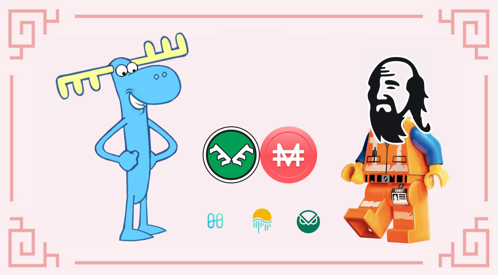
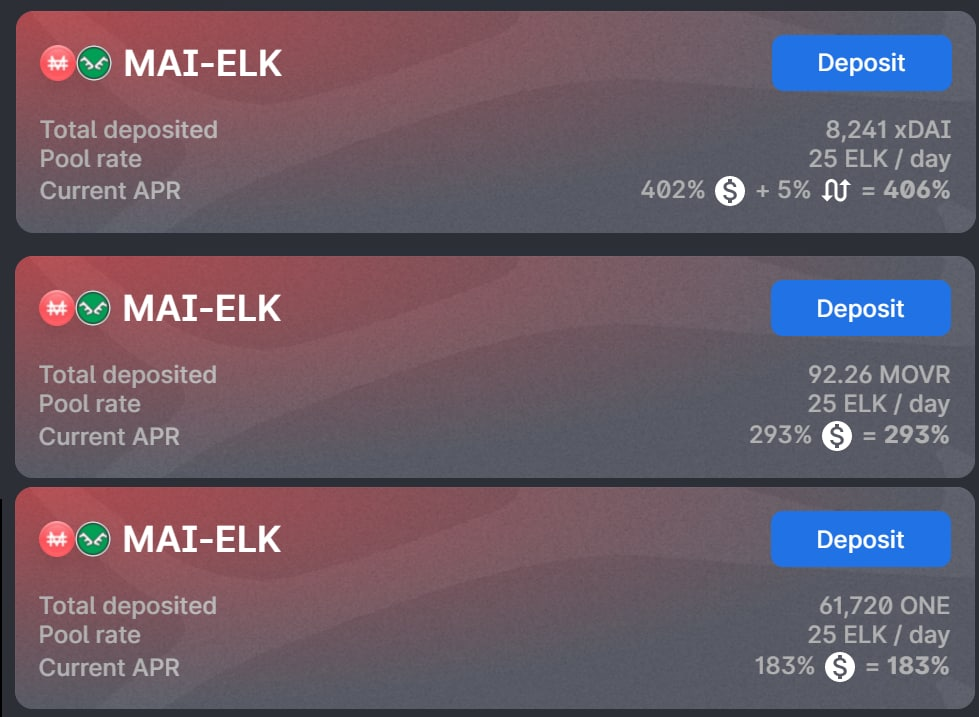

# Una coppia di LP, molti modi per farmare

## Introduzione

Fornire liquidità su un DEX (**E**xchange **DE**centralizzato) e ottenere una ricompensa è uno dei modi più comuni per farmare i rendimenti in DeFi (**fi**nanza **de**centralizzata). Tuttavia, molti utenti prestano attenzione solo alle tariffe del pool LP (**L**iquidity **P**rovider) in cui entrano, senza verificare realmente se la tariffa è un APR (**A**nnual **P**ercentage **R**eward) o un APY (**A**nnual **P**ercentage **Y**ield). Esistono molti modi per farmare un pool e gestire i token di ricompensa. In questa guida vedremo alcuni dei diversi modi in cui potete farmare uno degli ultimi pool su Harmony, $MAI-$ELK, e vedere cosa potete fare con i token $ELK che riceverete come ricompensa.


Questa guida non è un consiglio finanziario, è stata realizzata con uno scopo educativo in mente. Dovete prestare attenzione alle variazioni di prezzo, domanda e offerta, programmi di ricompensa, date di conclusione, impermanent loss ecc... L'obiettivo non è proporre ricette che possano essere seguite alla cieca, quindi per favore fate i compiti e le vostre simulazioni e investite solo ciò che siete disposti a perdere.


## Elk Finance

[Elk Finance](https://app.elk.finance/#/) è un DEX "forkato" da Uniswap v2, nonché un AMM (**M**arket **M**aker **A**utomatizzato). Troverete tutte le solite caratteristiche dei fork di Uniswap: scambiare i vostri assets, combinare le vostre diverse crypto valute in token LP, farmare alcune coppie LP e mettere in stake il loro token nativo, l'$ELK. Ciò che rende Elk Finance un progetto totalmente diverso, però, è la sua presenza su molte blockchain e non solo sulle chain compatibili con EVM (**E**thereum **V**irtual **M**achine). In effetti, Elk Finance è attualmente presente su 16 chain e hanno in programma di espandersi a molte altre. Sono riusciti a costruire un ponte tra tutte queste chain per consentire agli utenti di trasferire il token $ELK: ELKNET.

Inoltre, una caratteristica interessante proposta da ElkNet è la possibilità di scambiare una parte dell'asset trasferito con i token gasfee della destinazione. Ciò è particolarmente utile se state andando per la prima volta su una blockchain in cui non è disponibile un faucet.


Fatta eccezione per le chain in cui il gas è alto (solo Avalanche e Cronos al momento della scrittura), l'utilizzo di ElkNet per trasferire i token $ELK da una chain all'altra è gratuito. Avete letto bene, non pagate alcuna commissione di transazione!


Infine, Elk Finance fornisce protezione contro l'impermanent loss. Potete leggere tutti i dettagli sul programma Impermanent Loss nella [loro documentazione ufficiale](https://docs.elk.finance/features/impermanent-loss-protection), ma fondamentalmente, tutto ciò che dovete sapere è che se il prezzo di $ELK cambia tra il momento in cui depositate e il momento in cui prelevate, vi verranno pagati $ELK extra per coprire la perdita. Dato che $MAI è ancorato a 1 $USD, l'impermanent loss è collegata solo al movimento dei prezzi di $ELK, quindi siete sempre vincenti quando entrate nei pool LP su Elk Finance DEX.

## Farming della coppia LP MAI-ELK

Elk Finance ha collaborato con Mai Finance nel gennaio 2022 per proporre il farm di token utilizzando la coppia LP $MAI-$ELK sul proprio DEX. La coppia $MAI-$ELK per ora può essere utilizzata su 3 reti diverse: Harmony, Moonriver e Gnosis. Alcuni pool aggiuntivi potrebbero essere lanciati in seguito su Polygon, Cronos e Fantom. Vediamo le diverse strategie che potete applicare per questo nuovo pool.


Proponiamo questa guida per Harmony perché le gasfee sono molto economiche, il che vi consente di reinvestire manualmente le vostre ricompense su base giornaliera. Questo lo rende un'ottima blockchain per i principianti che hanno solo pochi dollari da investire come soldi virtuali. Tuttavia, tutto ciò che viene presentato in questa guida può essere applicato anche a qualsiasi altra blockchain.


### Farming e Staking

La prima strategia è piuttosto semplice:

* create la coppia LP
* depositate la coppia LP nel pool $MAI-ELK e ottenete il 200% di APR
* raccogliete le ricompense quotidianamente
* mettetele in stake con il 32.53% di APR

Se iniziate con $100, ecco i risultati che potete ottenere mese dopo mese per un anno intero di farming, supponendo che le tariffe sopra indicate rimangano le stesse per l'intero periodo.

| giorno | MAI-ELK ($) | ELK in stake ($) |
| ------ | ----------- | ---------------- |
| 30     | 100.000     | 16.653           |
| 60     | 100.000     | 33.756           |
| 90     | 100.000     | 51.323           |
| 120    | 100.000     | 69.366           |
| 150    | 100.000     | 87.897           |
| 180    | 100.000     | 106.930          |
| 210    | 100.000     | 126.479          |
| 240    | 100.000     | 146.557          |
| 270    | 100.000     | 167.180          |
| 300    | 100.000     | 188.360          |
| 330    | 100.000     | 210.115          |
| 360    | 100.000     | 232.458          |

At the end of the year, you would have

* $100.00 in token LP $MAI-$ELK nel pool
* $236.24 di token $ELK in stake

Che corrisponde a un APY complessivo del 236,24%. Non è esattamente APR perché parte della ricompensa è reinvestita (l'$ELK in stake).


Potete trovare tutti i risultati e la formula utilizzata per costruire questa tabella nella prima tab[ di questo Google Sheet](https://docs.google.com/spreadsheets/d/1Vva5dhjYix0g4bMZRSAMIutDgbT08TsTLhVJE0TUrF8/edit?usp=sharing). Potete copiare questo file sul vostro disco e modificare le tariffe e l'investimento iniziale per vedere la modifica complessiva dell'APY con il numero inserito.


### Farming e Reinvestimento (compounding) diretto

Compounding significa raccogliere le vostre ricompense e utilizzarle per reinvestire in ulteriori token LP aggiuntivi. Nel nostro caso, dovreste:

* raccogliere le vostre rewards in $ELK
* swapparne il 50% per $MAI
* aggiungerli alla coppia LP $MAI-$ELK
* depositarli nel pool

Se iniziate con lo stesso investimento iniziale di $100, i risultati che potete aspettarvi per un anno intero di farming, supponendo che le tariffe fornite rimangano le stesse per l'intero periodo sono i seguenti:

| giorno | MAI-ELK ($) |
| ------ | ----------- |
| 30     | 117.172     |
| 60     | 138.044     |
| 90     | 162.635     |
| 120    | 191.607     |
| 150    | 225.739     |
| 180    | 265.952     |
| 210    | 313.328     |
| 240    | 369.143     |
| 270    | 434.901     |
| 300    | 512.374     |
| 330    | 603.647     |
| 360    | 711.179     |

E alla fine dell'anno, avreste

* $730.878 in token LP $MAI-$ELK nel pool

Che corrisponde, per un investimento iniziale di $100, a un APY complessivo del 630,88%. Dal momento che stiamo reinvestendo le ricompense, questo è l'APY esatto che otterresti da un APR del 200%.

Come nota a margine, le formule per calcolare l'APY da un APR con reinvestimento giornaliero (o un APR da un APY) sono le seguenti:

$$
APY = ( 1 + \frac{APR}{N})^N-1
$$

$$
APR = N * (( 1 + APY)^\frac{1}{N} - 1)
$$

Con `N` che indica il numero di volte in cui reinvestite le vostre ricompense. Nel nostro caso, la formula 2 ci darebbe

$$
APY = ( 1 + \frac{2}{365})^{365}-1 = 634.88\%
$$

$$
APR = 365 * (( 1 + 6.3488)^\frac{1}{365} - 1) = 199.99\%
$$

È facile notare e capire che se applicate un APR del 200% (l'APR del pool di LP) alle vostre ricompense, otterrete rendimenti migliori rispetto a un APR del 32,53% (APR di staking). In questo senso, il compounding è molto meglio dello staking mentre l'APR da farming rimane al di sopra dell'APR da staking. Questo può ovviamente cambiare con la quantità di liquidità nel pool.


Come per la sezione precedente, la simulazione si trova nella stessa [Google SpreadSheet](https://docs.google.com/spreadsheets/d/1Vva5dhjYix0g4bMZRSAMIutDgbT08TsTLhVJE0TUrF8/edit?usp=sharing) nel secondo tab.


### Farming e Reinvestimento (compounding) usando Mai Finance

Se staking e compounding danno buoni rendimenti, entrambi i metodi sono direttamente collegati al prezzo del token $ELK, quindi il valore del vostro investimento varierà con il prezzo di $ELK. Abbiamo già visto che il compounding offre opzioni migliori rispetto allo staking. Ora vedremo come potete ottenere un certo valore dalle vostre ricompense da farming e continuare a investire nello stesso pool utilizzando Mai Finance. La routine quotidiana sarebbe la seguente:

* Raccogliere le ricompense $ELK
* Swappare il 66% delle ricompense per acquistare dei token "blue chip" accettati come garanzia su Mai Finance. Per il nostro esempio, useremo il token $ONE
* Depositare i token $ONE nel vostro vault su Mai Finance
* Prendere in prestito $MAI al 200% CDR (**C**ollateral to **D**ebt **R**atio), valore che corrisponderà ai vostri $ELK residui
* Combinarli nell coppia LP $MAI-$ELK
* Depositarli nel pool


Convertire i vostri token ricompensa in $ONE potrebbe non essere il modo più sicuro per proteggere i vostri assets, uno dei modi migliori per farlo è convertire in stable coin. Tuttavia, le opzioni su Mai Finance su Harmony al momento della stesura di questo articolo sono piuttosto limitate. Potreste ottenere opzioni migliori in futuro, come lo staking di token Stake DAO LP come garanzia (vedi [il nostro articolo dedicato su Polygon](../polygon/the-elephant-and-the-otter.md) per vedere come potreste essere in grado di utilizzare i token Stake DAO su Mai Finance).


Se iniziate con lo stesso investimento iniziale di $100, i risultati che potete aspettarvi per un anno intero di farming, supponendo che le tariffe fornite rimangano le stesse per l'intero period e che il vostro vault non venga liquidato, sono i seguenti:

| giorno | MAI-ELK ($) | ONE ($) | debito MAI ($) |
| ------ | ----------- | ------- | -------------- |
| 30     | 111.154     | 11.560  | 5.780          |
| 60     | 124.003     | 24.456  | 12.228         |
| 90     | 138.337     | 38.842  | 19.421         |
| 120    | 154.328     | 54.892  | 27.446         |
| 150    | 172.168     | 72.797  | 36.398         |
| 180    | 192.070     | 92.772  | 46.386         |
| 210    | 214.273     | 115.055 | 57.528         |
| 240    | 239.042     | 139.915 | 69.958         |
| 270    | 266.674     | 167.648 | 83.824         |
| 300    | 297.501     | 198.588 | 99.294         |
| 330    | 331.891     | 233.106 | 116.552        |
| 360    | 370.257     | 271.609 | 135.805        |

E alla fine dell'anno, avreste

* $377.069 in token LP $MAI-$ELK nel pool
* $278.446 in token $ONE nel vostro vault $ONE
* $139.223 di debito nel vostro vault
* un CDR del 200%, come previsto

Partendo da una posizione originale di $MAI-$ELK per un valore di $100, ciò rappresenterebbe un APY complessivo del 416,29%. Qui stiamo ottenendo un po' meno guadagni rispetto al puro compounding, tuttavia abbiamo anche estratto una buona parte dei nostri guadagni in $ONE, che potrebbe essere meno volatile di $ELK, quindi potrebbe presentare meno rischi.


Ancora una volta, la simulazione può essere trovata nel solito [Google SpreadSheet](https://docs.google.com/spreadsheets/d/1Vva5dhjYix0g4bMZRSAMIutDgbT08TsTLhVJE0TUrF8/edit?usp=sharing) nel terzo tab.


In alternativa, potete anche vendere tutti le vostre ricompense $ELK per i token accettati su Mai Finance, prendere in prestito $MAI e venderne parte per acquistare $ELK aggiuntivo al fine di aumentare la vostra posizione nel pool $MAI-$ELK. In questo modo, aumentate la vostra esposizione a $ONE, ma aumentate anche il vostro debito. Finireste con $270,715 di $MAI-$ELK, $ 352,913 di $ONE e $171,457 di debito per un APY complessivo del 342,17%.

## Influenza della frequenza con cui si reinveste

Sia che decidiate di mettere in stake le ricompense o di reinvestirle, è importante capire che il vostro rendimento cambierà a seconda della frequenza con cui eseguirete la vostra routine di raccolta + investimento. Ricordiamo che la formula che collega APY e APR è la seguente:

$$
APY = ( 1 + \frac{APR}{N})^N-1
$$

In questa equazione, `N` rappresenta il numero di volte in cui reinvestite le ricompense in un anno. Quindi, un APR del 200% come sopra vi darebbe il seguente APY a seconda della frequenza:

| Frequenza reinvestimento | APY equivalente |
| ------------------------ | --------------- |
| giornaliero              | 634.88 %        |
| due volte a settimana    | 625.01 %        |
| una volta a settimana    | 611.71 %        |
| due volte al mese        | 609.55 %        |
| una volta al mese        | 535.86 %        |
| ogni tre mesi            | 406.25 %        |
| due volte all'anno       | 300.00 %        |

Il reinvestimento manuale più di una volta al giorno può essere costoso a seconda della chain in cui vi trovate. Ma fondamentalmente, è chiaro che più spesso si reinveste, migliore è la ricompensa. Questo spiega anche perché gli ottimizzatori di resa/compounder automatico sono popolari. Tenete presente che combinando, aggiungete pressione di vendita al token che farmate, il che avrà un impatto negativo sul prezzo di quel token. Se questo è anche il token che state utilizzando per farmare (nel nostro esempio $ELK), potreste incorrere in impermanent loss, a meno che non stiate utilizzando Elk Finance DEX, che vi protegge da questa eventualità.

## Scelta del pool giusto

La coppia $MAI-$ELK è stata distribuita su diverse chain, quindi è possibile distribuire il vostro capitale sulla chain che offre le tariffe migliori.


Il pool $MAI-$ELK potrebbe anche essere distribuito su altre chain in un prossimo futuro, possibilmente su Polygon, Cronos e Fantom. Questo non è garantito e non esiste un ETA per questo, quindi rimanete aggiornati controllando la differenza tra i server Discord di entrambi i progetti e seguendoli su Twitter.


Oltre al tasso di ricompensa su ciascuna chain, potreste dover considerare anche il prezzo del token $ELK su ognuna di esse. In effetti, se il prezzo è quasi lo stesso su tutte le chain, la piccola differenza potrebbe anche essere un fattore determinante per la scelta della chain in cui si desidera coltivare il token $ELK.

Come potete vedere, il pool $MAI-$ELK su Moonriver offre un tasso di ricompensa migliore e anche il token $ELK ha un prezzo più alto su quella chain. Ciò significa che, nel momento in cui scriviamo, potrebbe essere meglio coltivare il pool $MAI-$ELK su Moonriver piuttosto che su Harmony o Gnosis, soprattutto se prevedete di vendere una parte dei token farmati. Notate che questo potrebbe non essere sempre vero, quindi assicuratevi di scegliere correttamente la chain e di fare le vostre ricerche prima di entrare in un pool di LP.Infine, si consiglia vivamente di leggere il [documento sulla protezione da IL](https://docs.elk.finance/features/impermanent-loss-protection) perché l'assicurazione dipende fortemente dal numero di giorni in cui i tuoi token LP vengono depositati nel pool.

Come nota a margine, poiché il bridging $ELK è gratuito, potete eventualmente spostarvi da una chain all'altra per beneficiare sempre delle migliori tariffe. Assicuratevi di comprendere che, così facendo, influenzerete anche i tassi di ricompensa del pool da cui uscite e quello in cui entrate (meno liquidità aumenterà l'APR, più liquidità lo abbasserà).

## Disclaimer

Questa guida è stata scritta per illustrare i diversi modi per farmare rendimenti utilizzando i token che forniscono liquidità. La strategia che sceglierete influirà fortemente sui guadagni , così come la vostra esposizione al rischio. Naturalmente, tutte le nozioni indicate in questo documento sono applicabili anche a qualsiasi coppia di LP ed è altamente raccomandato eseguire le proprie simulazioni prima di scegliere una strategia, una coppia di LP, un pool o anche un DEX.


Tenete presente che una strategia che funziona bene in un dato momento potrebbe avere un rendimento peggiore (o farvi perdere denaro) in un altro. Tenetevi aggiornati, monitorate i mercati, tenete d'occhio i vostri investimenti e come sempre, fate le vostre ricerche.

