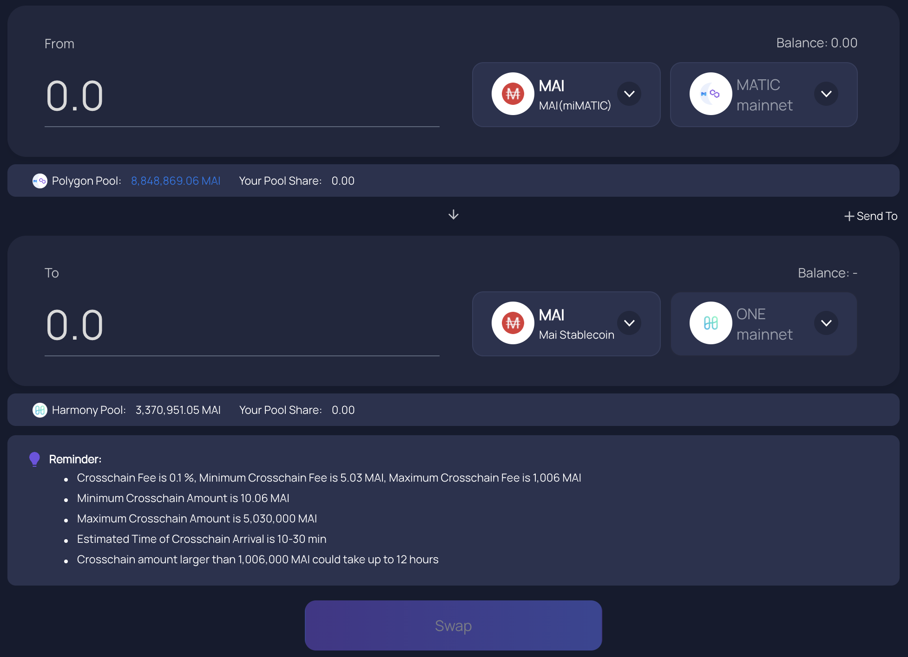

# Come iniziare con Harmony

## Cos'è Harmony?

Harmony è una blockchain che cerca di risolvere i problemi che la Mainnet di Ethereum deve affrontare: raggiungere un soddisfacente grado di equilibrio tra decentralizzazione e scalabilità. L'obiettivo principale della chain è proporre un'elevata velocità di transazione, scalabilità ed efficienza energetica. Questo viene fatto sfruttando fortemente lo sharding di validatori che vengono raggruppati per elaborare le transazioni contemporaneamente. Supportare la scalabilità significa semplicemente aumentare il numero di shard, il che aiuta anche a ottenere transazioni più veloci. Sentitevi liberi di approfondire di più su Harmony e la sua tecnologia nella loro [documentazione ufficiale](https://docs.harmony.one/home/general/technology).

## Primi passi con Harmony

Per utilizzare la rete Harmony, avrete bisogno di un indirizzo per il portafoglio. Dato che Harmony è una rete compatibile con EVM (**E**thereum **V**irtual **M**achine), accetterà gli stessi portafogli di altre chain compatibili con EVM, inclusi portafogli web come Metamask o Nifty e sarete in grado di utilizzare i vostri portafogli hardware come Trezor o Ledger.

Per questo tutorial, ci atterremo a Metamask come per tutte le altre guide su questo sito. Se non avete Metamask installato, potete trovare le istruzioni su [Come iniziare con Polygon](../../polygon-tutorials/how-to-get-started-on-polygon.md).

### Aggiungere Harmony a Metamask

Se avete installato l'ultima versione di Metamask, dovreste già avere accesso alla chain Harmony e non dovrete far altro che selezionare Harmony nel menu a tendina delle reti nella parte superiore di Metamask. Potete anche impostare voi stessi un nuovo RPC per accedere ad Harmony seguendo questi passaggi. Aprite l'estensione Metamask, fate clic sull'icona del vostro portafoglio, andate su Impostazioni, quindi scegliete Reti e scegliete Harmony. I dati che dovreste ottenere sono i seguenti:

* **Network Name:** Harmony One
* **New RPC URL:** https://api.harmony.one
* **Chain ID:** 1666600000
* **Currency Symbol:** ONE
* **Block Explorer URL:** https://explorer.harmony.one/

Salvate le modifiche e Metamask passerà automaticamente alla rete Harmony:

## Trasferire assets verso Harmony One (Bridging)

### Faucets

Non esiste un faucet ufficiale per ottenere i vostri primi token $ONE per le prime transazioni. Dovrete principalmente trasferire alcuni token da un'altra chain usando l'[Harmony bridge](https://bridge.harmony.one/erc20) che vi permetterà di trasferire alcuni assets specifici da Ethereum Mainnet o Binance Smart Chain. Potete anche trovare un elenco di progetti che vi permetteranno di comprare token direttamente su Harmony tramite un Fiat Gateway o Exchange Gateway da [questa lista](https://docs.harmony.one/home/developers/harmony-stack#bridges-fiat-gateways-exchanges) gestita dal team di Harmony.

Come sempre, potete anche usare [ElkNet](https://app.elk.finance/#/elknet) per trasferire alcuni token $ELK da altre chain ad Harmony. Se lo fate, assicuratevi di selezionare la casella $ELK per gas, il bridge scambierà una parte dei token trasferiti in $ONE, ciò vi consentirà anche di scambiare il resto dei vostri token $ELK con ulteriori $ONE o altri assets.

### Bridges

* [Multichain.org](https://app.multichain.org/#/router) (precedentemente noto come AnySwap) è il partner ufficiale di Mai Finance che vi consentirà di trasferire i vostri token $MAI da Polygon o altre chain ad Harmony. Come nota a margine, Multichain ha lavorato fianco a fianco con gli sviluppatori di Mai Finance per assicurarsi che i $MAI che trasferite ad Harmony siano gli stessi che otterreste dalla piattaforma di prestito. Non c'è bisogno di un Hub su Harmony. Basta andare al router Multichain, selezionare la rete di origine, il token che si desidera trasferire e la rete di destinazione e il gioco è fatto. Prestate attenzione agli importi minimi per i trasferimenti, alle commissioni di trasferimento e alla durata del bridge ma una volta fatto, otterrete i vostri assets su Harmony.

* [Official Harmony Bridge](https://bridge.harmony.one/erc20), come spiegato nel paragrafo precedente, vi consentirà di trasferire assets specifici da Ethereum Mainnet o BSC.
* [RelayChain](https://app.relaychain.com/#/cross-chain-bridge-transfer) è una soluzione alternativa se volete trasferire qualcosa su Harmony. Controllate la loro applicazione per vedere quali assets sono trasferibili.
* [ElkNet](https://app.elk.finance/#/elknet) è un caso particolare dato che il bridge di Elk Finance vi consentirà di trasferire il token $ELK da qualsiasi chain compatibile con EVM a qualsiasi altra chain compatibile con EVM in cui sono distribuiti, con la possibilità di scambiare una piccola parte dell'importo trasferito in token di gas (vedi la sezione dedicata ai faucets appena sopra).

## DeFi on Harmony

Dato che Harmony One è una rete che offre transazioni veloci e sicure, oltre a gas molto economico, molte DApp compatibili con EVM (**D**ecentralized **App**lications) sono state lanciate su questa rete. L'elenco che segue non le presenta tutte, sentitevi liberi di esplorare voi stessi la rete e il suo elenco di DApp. Potete trovare una [lista esaustiva su DefiLlama](https://defillama.com/chain/Harmony).

* [ViperSwap](https://viper.exchange/#/swap): Questo è il primo partner di Mai Finance su Harmony One. E' un fork di Uniswap v2, un DEX(**D**ecentralized **Ex**change) un AMM (**A**utomated **M**arket **M**aker) dove potrete scambiare i vostri assets, creare coppie di tokens LP (**L**iquidity **P**roviding) e farmare ed ottenere ricompense offrendo liquidità ai traders. Le ricompense vengono pagate utilizzando il token $VIPER, che potrete mettere in stake ull'app per ulteriori ricompense. Questo è il DEX dove troverete della liquidità $MAI per scambiare $MAI o per ottenere ricompense usando $MAI.

Noterete che gli APRs (**A**nnual **P**ercentage **R**ate) dei pools sono molto alti. Ciò è dovuto principalmente al formato della ricompensa su ViperSwap: quando richiedete le ricompense, il 5% dei token $VIPER può essere utilizzato direttamente, mentre il 95% resta bloccato fino al 2021-12-25. Dopodiché, la ricompensa matura per un anno intero, il che significa che non sarete in grado di accedere subito ai vostri guadagni da farm che vi verranno rilasciati MOLTO lentamente. C'è un'ulteriore twist nei pool di ViperSwap: dovrete pagare una commissione di prelievo che diminuisce se mettete in stake i vostri token LP per un lungo periodo.. Si passa dal 25% di commissione se si preleva all'interno dello stesso blocco della transazione di deposito (per contrastare le operazioni di flashloan) allo 0,01% se si preleva dopo 1 mese. Maggiori dettagli nella loro documentazione ufficiale su [ricompense da farming](https://docs.venomdao.org/viper/tokenomics#bbd0) e [commissioni di prelievo](https://docs.venomdao.org/viper/fees).

* [DeFi Kingdom](https://game.defikingdoms.com/#/): Questo è un progetto particolarmente interessante che sta mescolando DeFi e Gaming. Il suo token nativo, il token $JEWEL, viene utilizzato come ricompensa per gli utenti che forniscono liquidità, ma può anche essere utilizzato nel gioco o nel mercato. Spiegare l'intero universo di DeFi Kingdom (o DFK) richiederebbe troppo tempo per questa guida, quindi consigliamo vivamente di leggere [la documentazione ufficiale](https://docs.defikingdoms.com).

* [SushiSwap](https://app.sushi.com) è il famoso DEX/AMM che è presente anche su molte altre chain. Scambiate, fornite liquidità e farmate $ONE e $SUSHI.
* [Curve Finance](https://harmony.curve.fi) è un'altra applicazione cross-chain che vi consentirà di fornire liquidità (3pool e tricrypto) e vi ricompenserà con token composti oltre a $ONE e $CRV.
* [Beefy Finance](https://app.beefy.finance/#/harmony) è un ottimizzatore di rendimento che presentiamo già in molte delle nostre guide poiché è presente su molte chain. Attualmente, sarete in grado di depositare i vostri token LP da Curve e SushiSwap e lasciare che il compounder Beefy aggreghi le ricompense fornite dalla farm e li reinvesta per ottenere più token LP.
* [Euphoria DAO](https://app.euphoria.money/#/dashboard) è attualmente il più grande fork di Ohm su Harmony ed è sviluppato da Venom DAO, dietro a ViperSwap. Potete fornire alcuni assets ed ottenere il loro asset nativo, il token $WAGMI. Mettete in stake $WAGMI per ottenere ulteriori $WAGMI con APY folli (**A**nnual **P**ercentage **Y**ield) come per la maggiorparte dei progetti ispirati da OHM.

## Mai Finance su Harmony

Mai Finance è stata lanciata su Harmony One a dicembre 2021 e questa guida è abbastanza vicina alla data di lancio quindi l'applicazione potrebbe essere stata già aggiornata nel frattempo.

Potrete depositare i vostri token $WETH o $ONE su Mai Finance (https://app.mai.finance/vaults/create) per prendere in prestito la stable coin $MAI. Sarete quindi in grado di scambiare $MAI per sfruttare i vostri assets, la leva o i farmare su ViperSwap.

## Disclaimer

Questa guida NON è un consiglio finanziario e va considerata a puro scopo educativo. Fai sempre le tue ricerche. La discussione di un progetto in questa guida non deve essere considerata come un'approvazione del progetto stesso.


Tenete presente che una strategia che funziona bene in un dato momento potrebbe avere un rendimento peggiore (o farvi perdere denaro) in un altro. Tenetevi aggiornati, monitorate i mercati, tenete d'occhio i vostri investimenti e come sempre, fate le vostre ricerche.

