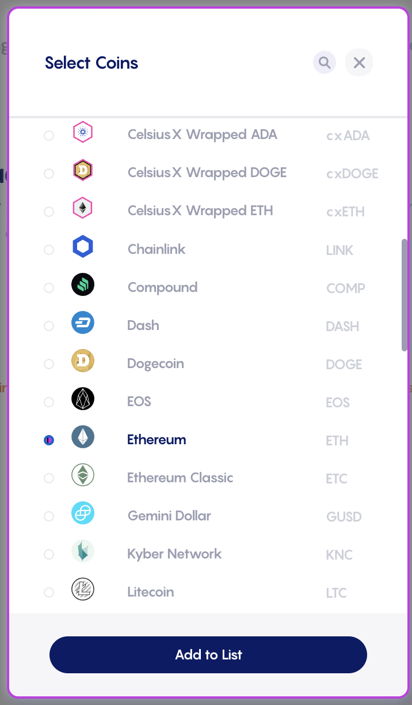
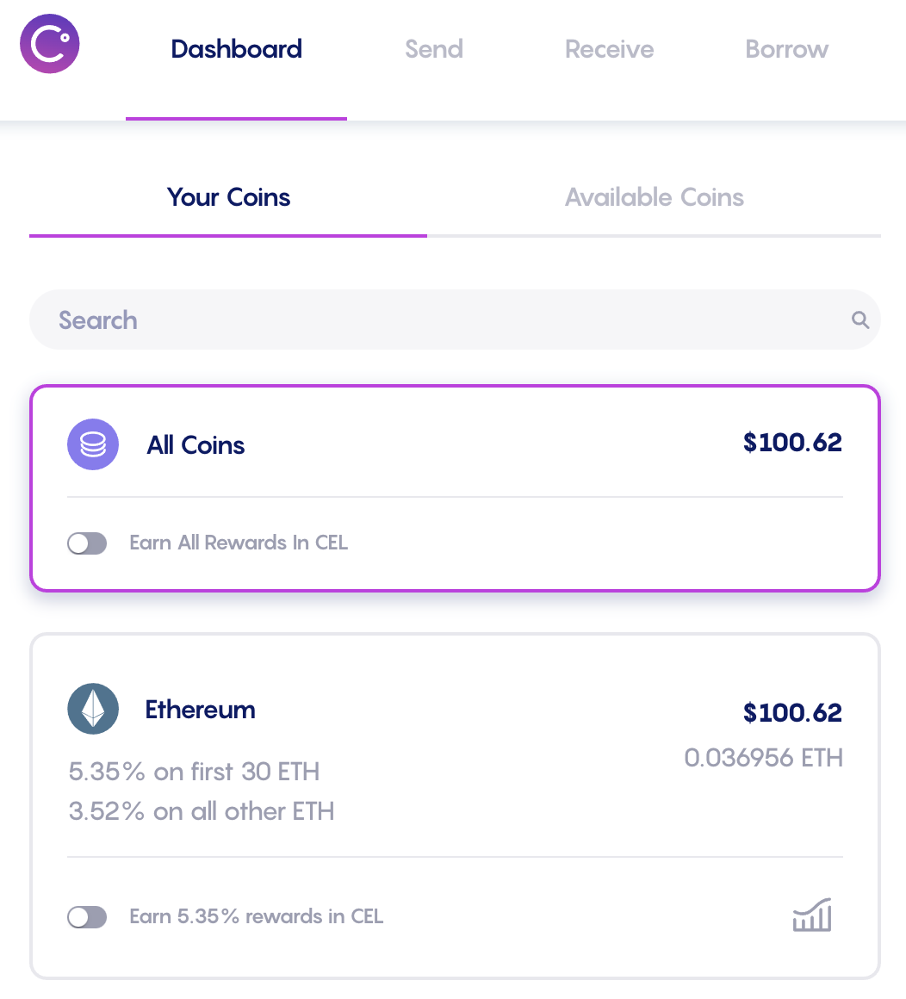
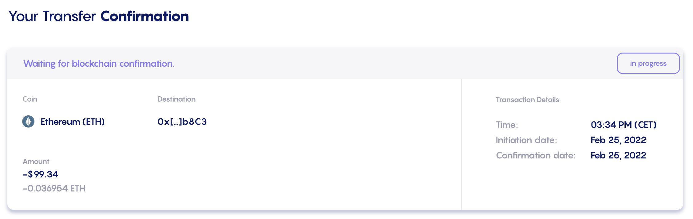
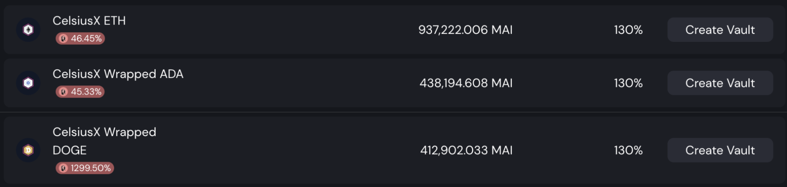

# Dalla CeFi alla DeFi con Celsius

## Introduzione

[Celsius Network](https://celsius.network) è uno dei grandi players della CeFi in cui le persone possono facilmente acquistare assets crypto attraverso il proprio conto bancario e mettere in stake per ottenere rewards extra. Ad esempio, potete guadagnare il 6,20% APY su $BTC (Bitcoin), il 5,35% su $ETH (Ethereum) ecc ... Oltre a detenere i vostri assets e ottenere guadagni settimanali, potete anche prendere in prestito assets aggiuntivi rispetto a quelli che già possiedete (che vengono poi utilizzati come garanzia) per sfruttare la vostra posizione o scambiarli con altri token. Tuttavia, Celsius è una rete chiusa ed è per questo che viene spesso definita un'applicazione CeFi(**Ce**ntralized **Fi**nance).

Se avete assets su Celsius, potete comunque inviarli ad altre applicazioni sulla blockchain nativa dei token. Ad esempio, potete trasferire $ETH dentro e fuori Celsius usando il vostro portafoglio Ethereum o $BTC usando il vostro indirizzo sulla chain Bitcoin. In aggiunta a questo, Celsius ha lanciato a febbraio un nuovo bridge chiamato CelsiusX che consente di inviare alcuni assets specifici dall'applicazione Celsius a Polygon. I token correntemente supportati sono:

* $ETH, token nativo dell' Ethereum Mainnet
* $ADA, token nativo di Cardano
* $DOGE, token nativo della blockchain Dogecoin

Inviando i vostri assets su Polygon, ottenete anche un accesso completo all'ecosistema DeFi, oltre a opzioni bridge aggiuntive per spostare i vostri token su Fantom, Avalanche e molte altre chain. Questa guida vi guiderà attraverso i diversi passaggi per trasferire le vostre risorse da Celsius a Polygon e presenterà alcune cose che potete farci.


Questa guida non è un consiglio finanziario, è stata realizzata con un obiettivo educativo in mente. Dovete prestare attenzione alle variazioni di prezzo, domanda e offerta, programmi di ricompensa, date di fine, impermanent loss ecc... L'obiettivo non è proporre ricette che possono essere seguite alla cieca, quindi per favore fate i compiti e le vostre simulazioni e investite solo ciò che siete pronti a perdere.


## Comprare assets su Celsius

### Creare un account

Ovviamente, per poter utilizzare Celsius, avrete bisogno di un account Celsius. Basta andare sul loro sito Web e registrare un nuovo account [usando questo link](https://celsiusnetwork.app.link/105588e0cd). Tenete presente che per motivi legali e per la natura del modello di business di Celsius, dovrete fornire prove della vostra identità, note anche come documenti KYC(**K**now **Y**our **C**ustomer), tipo la carta d'identità o la patente di guida. Inoltre, tenete presente che l'applicazione Celsius potrebbe non essere disponibile nel vostro paese. Controllate i loro [Termini d'uso](https://celsius.network/terms-of-use) e la [Privacy Policy](https://celsius.network/privacy-policy) per ulteriori dettagli.


Tenete presente che questa guida, Mai Finance o la comunità QiDAO non sono responsabili per i servizi forniti da Celsius e si consiglia vivamente di effettuare le proprie ricerche prima di registrarsi per un prodotto finanziario.


Una volta creato il vostro account, sentitevi liberi di fare un rapido tour dell'applicazione web ed eventualmente scaricare l'applicazione mobile.

### Portare assets nell'account

L'applicazione mobile è, per ora, l'unico modo per acquistare assets direttamente tramite Carta di Credito o Bonifico Bancario. Questa opzione può anche essere limitata a determinati paesi/regioni. A causa di queste restrizioni, non tratteremo questa opzione, ma sentitevi liberi di esplorare questa opzione se è la preferite.

Per questa guida, ci concentreremo su $ETH e presumeremo anche che voi abbiate già un po' di Ether sulla Mainnet di Ethereum che desiderate trasferire su Celsius. Dall'applicazione Web, accedete semplicemente al`Receive` tab.

Il primo passo è aggiungere il token che volete ricevere. Nel nostro caso, vogliamo ottenere $ETH e quindi selezioniamo `Add New Coins` e selezioniamo $ETH dal menu a tendina.

Una volta selezionato, avrete la possibilità di ottenere l'indirizzo del portafoglio che corrisponde al vostro account Celsius sulla rete Ethereum.

Se cliccate su `View and Copy address`, si aprirà un nuovo popup con un codice QR che rappresenta l'indirizzo del vostro portafoglio sulla rete Celsius, nonché il suo valore in testo normale che potete semplicemente copiare e incollare.

Con l'indirizzo del portafoglio, avviate un trasferimento dal wallet in cui avete i vostri token $ETH. L'esempio seguente è tratto da Coinbase (un altro grande player nel settore CeFi):

Ovviamente e come sempre con Ethereum Mainnet, dovrete pagare alcune commissioni di transazione. Questo non è assolutamente collegato a Coinbase o Celsius. Come potete vedere di seguito, un trasferimento diretto dal mio portafoglio MetaMask richiederebbe anche il pagamento di alcune commissioni.


A seconda della congestione della rete, le tariffe possono essere piuttosto elevate. Assicuratevi di controllare il prezzo del gas per beneficiare delle tariffe più basse possibili.


Una volta completato il trasferimento, dovreste essere in grado di vedere i vostri assets nella dashboard Celsius:

A questo punto, se tengo le monete nel mio account su Celsius, riceverò ricompense per lo staking ogni settimana. Per $ETH a marzo 2022, l'APY è del 5,35%. Tuttavia, ora avremo la possibilità di spostare gli asset su Polygon utilizzando il bridge CelsiusX **gratuitamente**. Andate semplicemente alla scheda Invia e selezionate l'asset che desiderate trasferire su Polygon.


Nota: se non avete ancora alcun indirizzo del destinatario salvato, ora è il momento di crearne uno. Scegliete l'indirizzo del vostro portafoglio da Metamask e aggiungetelo come indirizzo di prelievo. Per motivi di sicurezza, quando create un indirizzo di prelievo o lo modificate, questo indirizzo viene bloccato per 24 ore. Come vedrete nello screenshot qui sotto, 24 ore dopo aver trasferito $100 di $ETH a Celsius, il mio saldo è già cambiato.


Potete anche notare in questo screenshot che riceverò $cxETH su Polygon, che è una versione wrapped di $ETH. Sarebbe la stessa cosa per $ADA (otterrete $cxADA) e $DOGE (otterrete $cxDOGE). Vedremo più avanti in questa guida cosa fare con i vostri cxTokens.


Nota che non ci sono assolutamente commissioni per questo trasferimento. È anche molto veloce.


Una volta inviati, riceverete un'e-mail che vi chiede di confermare il trasferimento (per sicurezza) e potrete vedere la cronologia delle transazioni che riflette questo trasferimento nell'app Celsius.

Dopo pochi minuti, avrete le vostre risorse (cxTokens) disponibili nel vostro portafoglio su Polygon. Il modo migliore per tenere traccia di questi trasferimenti è probabilmente quello di utilizzare [un'applicazione come DeBank](https://debank.com) e date un'occhiata alla cronologia delle transazioni sulla chain desiderata (qui Polygon):

## Polygon e i cxTokens

### Cosa sono i cxTokens

Senza andare troppo in profondità nei dettagli, i cxTokens sono token wrapped. Quando trasferite i vostri assets dalla rete Celsius a Polygon, gli assets vengono bloccati nella rete Celsius e nuovi token vengono coniati su Polygon. Tuttavia, nel caso di Ether, Celsius non ha la possibilità di coniare $WETH direttamente su Polygon quindi creano un token il cui prezzo è indicizzato sul prezzo di $ETH: $cxETH.

È anche vero il contrario, il che significa che quando trasferite i vostri $cxETH su Celsius, il cxToken viene bruciato e una quantità corrispondente di $ETH viene rilasciata su Celsius e aggiunta al vostro account.

Per assicurarsi che il prezzo del cxToken sia correttamente indicizzato sul prezzo dell'asset sottostante, Celsius utilizza una tecnologia di Chainlink: la Proof of Reserve.

Se siete curiosi di conoscere i dettagli su come Celsius sta gestendo i cxToken, potete leggere tutti i dettagli nel loro [articolo medium di Gennaio 2022](https://medium.com/@CelsiusX/celsius-is-integrating-chainlink-proof-of-reserve-to-unlock-cross-chain-liquidity-with-wrapped-6c85bb2f2a60).

### Swappare i vostri cxTokens

Dato che i vostri cxToken sono versioni wrappate degli assets sottostanti, potreste non trovare molte applicazioni che li accettano così come sono. Fortunatamente, potete scambiarli con altri assets usando [QuickSwap DEX](https://quickswap.exchange/#/swap), l'unico DEX con liquidità per i cxTokens su Polygon a Marzo 2022.

Ovviamente, potete anche fare l'operazione inversa e acquistare cxTokens utilizzando altri asset.


Quando si effettua lo scambio in entrata o in uscita da cxTokens, prestate attenzione al percorso intrapreso, nonché allo slippage. QuickSwap sembra utilizzare solo 4 hop al massimo e per accedere a $cxDOGE come esempio, dovete sempre passare da $ETH, $cxETH e quindi $cxDOGE. Ciò significa che è necessario disporre di liquidità sufficiente tra l'asset che si scambia e $ETH in modo che il percorso possa essere ASSET > $ETH > $cxETH > $cxDOGE.

Attualmente l'esempio non è valido per $MAI. Potreste fare $MAI > $USDC > $ETH > $cxETH in un primo swap e $cxETH > $cxDOGE in un secondo swap.

Lo stesso vale quando volete uscire dai vostri cxTokens: da $cxDOGE a $MAI potreste soffrire di uno slippage elevato e probabilmente vorrete prima passare da $cxETH o $ETH.


## Fornire liquidità con i vostri cxTokens

Con i vostri cxTokens, potete fornire liquidità ai pool CelsiusX su QuickSwap. Il paragrafo precedente spiega come scambiare i vostri cxTokens e questo viene fatto usando i pool LP (pool di offerta di liquidità). Per assicurarsi che qualsiasi utente possa scambiare i propri token, QuickSwap darà ricompense pagate in $dQUICK e $MATIC agli utenti che mettono in stake la loro liquidità sulla loro applicazione. Le 3 coppie che vi daranno ricompense sono

* $ETH/$cxETH
* $cxETH/$cxADA
* $cxETH/$cxDOGE

Hanno tutti diversi livelli di ricompensa e la cosa migliore da fare è accedere all'app QuickSwap e controllare i loro programmi di dual mining.

Nello screenshot sopra, potete vedere che se fornite liquidità per la coppia $ETH-$cxETH, potete ottenere fino al 15% di APY (rendimento percentuale annuo che presuppone che reinvestirete le ricompense) pagato in $dQUICK, $WMATIC e direttamente in $ETH e $cxETH dalle commissioni di swap. Se non reinvestite le ricompense, otterrete comunque un 13,97% e sarete in grado di fare tutto ciò che volete con i token di ricompensa. Sentitevi liberi di esplorare questa guida per ottenere ulteriori idee su come usarle.


Per entrare in un pool di liquidità, semplicemente [fornite liquidità](https://quickswap.exchange/#/add/0x7ceB23fD6bC0adD59E62ac25578270cFf1b9f619/0xfe4546feFe124F30788c4Cc1BB9AA6907A7987F9) per la coppia scelta in un rapporto 1:1. Questo potrebbe significare che dovrete scambiare alcuni cxToken con qualcos'altro. Una volta creata la coppia LP, potete depositarla nel pool e iniziare ad accumulare rendimenti.


## Usare i vostri cxTokens come collaterale e prendere un prestito

Scambiare i vostri cxToken significa che li state effettivamente vendendo per acquistare qualcos'altro. [Mai Finance](https://app.mai.finance) è un'app DeFi (**De**centaralized **Fi**nance) che vi permetterà di mantenere i vostri assets in un vault e prendere in prestito alcune stablecoins. Quindi sarete in grado di fare quello che volete con il vostro prestito, incluso

* farmare stablecoins
* swappare i $MAI presi in prestito per comprare altri assets
* far fruttare i vostri cxTokens
* trasferire i vostri $MAI su altre chain

Basta esplorare le diverse pagine di questa sito per scovare idee su come utilizzare il prestito nel modo più adatto a voi.

**Nota :** quando prendete in prestito stablecoin $MAI su Mai Finance, venite pagati con token $Qi in base all'importo che prendete in prestito. I tassi di ricompensa variano in base all'importo totale preso in prestito per quel vault, al prezzo di $Qi e all'allocazione di $Qi per il vault. Maggiori dettagli nel nostre [guide alle ricompense dei vault](../../mai-university/mai-loans-and-vaults-incentives.md).

E, naturalmente, potete combinare entrambe le soluzioni scambiando il vostro prestito $MAI in una coppia di cxToken LP e farmare su QuickSwap. A questo punto, non c'è limite a ciò che potete fare e il vostro investimento iniziale è completamente conservato nel vostro vault su Mai Finance (a patto che veniate liquidati).

## Disclaimer

Questa guida è stata scritta per presentarvi come trarre vantaggio da CelsiusX, il bridge tra Celsius Network e Polygon e sperimentare tutto ciò che la DeFi può offrire su Polygon. Naturalmente, l'utilizzo di protocolli su Polygon presenta dei rischi. Se state utilizzando cxTokens come garanzia su Mai Finance, dovrete prestare attenzione alle liquidazioni nel caso in cui il prezzo della vostra posizione collaterale scenda al di sotto del rapporto di liquidazione, una soglia che indica che il vostro prestito potrebbe avere un valore maggiore rispetto agli assets che lo sostengono . Questi rischi sono presentati in diversi tutorial su questo sito, quindi, ancora una volta, siete vivamente incoraggiati a leggerne alcuni e assicurarvi di capire come funzionano i diversi protocolli presentati in questa guida prima di investire qualsiasi cosa. E come sempre, questo non è un consiglio finanziario, fate sempre le vostre ricerche.


Tenete presente che una strategia che funziona bene in un dato momento potrebbe avere un rendimento peggiore (o farvi perdere denaro) in un altro. Tenetevi aggiornati, monitorate i mercati, tenete d'occhio i vostri investimenti e come sempre, fate le vostre ricerche.

