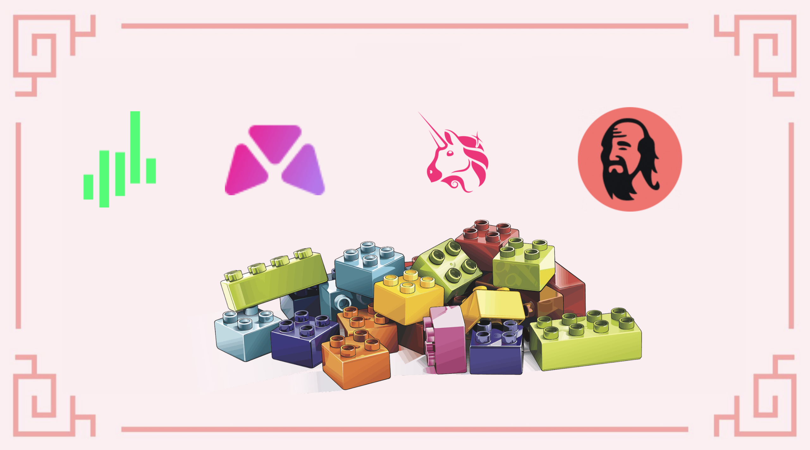
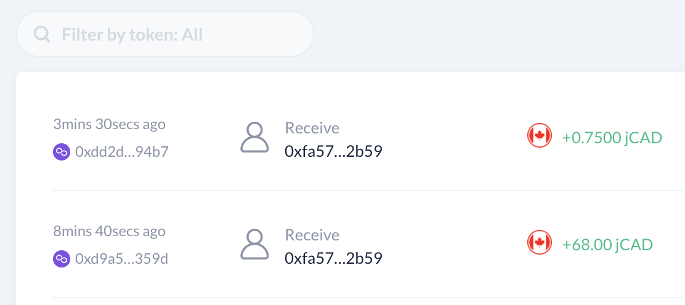
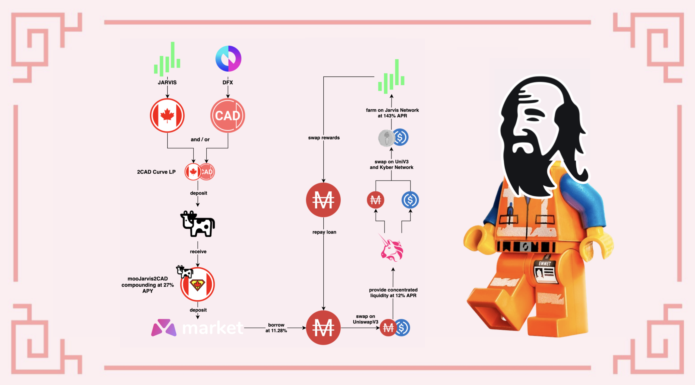

# Dalla finanza tradizionale alla DeFi con Jarvis

Non tutte le stablecoin sono uguali. Per la maggior parte degli utenti DeFi (**F**inanza **D**ecentralizzata), le stablecoin rappresentano una crypto valuta ancorata al dollaro USA. Questo è il caso di asset come:

* $USDC o $USDT che sono emessi da entità centralizzate e garantiti da dollari USA
* assets sovra-collateralizzati come $DAI o $MAI che sono parzialmente ancorati al dollaro USA ma supportati da un paniere di diverse crypto valute
* stablecoin algoritmiche come $UST o $MIM che sono parzialmente supportate e per le quali viene mantenuto il peg di $1 utilizzando un algoritmo specifico

Ma sapevate che è possibile trovare altre stablecoin? Ad esempio, $TOMB è un token che viene ancorato al prezzo di $FTM (il token gas nativo della rete Fantom) tramite un algoritmo.

In questo articolo, ci concentreremo sulle stablecoin che sono ancorate alle FIAT (valute emesse dal governo) e cercheremo di spiegare perché sono importanti per le vostre strategie di investimento.


Tenete presente che una strategia che funziona bene in un dato momento potrebbe avere un rendimento peggiore (o farvi perdere denaro) in un altro. Tenetevi aggiornati, monitorate i mercati, tenete d'occhio i vostri investimenti e come sempre, fate le vostre ricerche.


## Perché abbiamo bisogno di FIAT sintetici?

Supponiamo che voi viviate in un paese europeo e che usiate l'euro quotidianamente. Se doveste acquistare degli assets crypto, molto probabilmente li comprereste con i vostri euro. Per assets volatili come Bitcoin, non importa perché vi concentrerete sul prezzo di Bitcoin in euro per valutare se state facendo soldi o meno. Nella speranza che ne facciate un po'.

E se invece voleste investire in DeFi e farmare? E se, per mitigare i rischi, voleste fornire liquidità utilizzando solo stablecoin ? La maggior parte della liquidità stable su molte chain viene fornita come assets ancorati in USD, il che significa che dovrete acquistare $USDC/$USDT/$DAI/$MAI utilizzando i vostri euro. A questo punto, dovreste controllare che la liquidità che fornite stia generando interessi ma anche che la differenza di prezzo tra il dollaro USA e l'euro non stia lavorando contro di voi.

Se aveste acquistato $USDC per un valore di 100€ il 20 settembre 2021, avreste avuto $USDC per un valore di $117,29 perché il rapporto EUR:USD era 1:1,1729 in quel momento. Se doveste convertire $117,29 $USDC in euro oggi (24 marzo 2022) con un rapporto 1:1,0994, otterreste 106,69€ o un guadagno del 6,69%.

Ma se aveste acquistato $USDC per un valore di 100$CAD (100 dollari canadesi) lo stesso giorno (20 settembre 2021) con un rapporto di 1:0,7796, avreste avuto $USDC per un valore di 77,96 $USD. La conversione oggi in $CAD con un rapporto di 1:0,7972 varrebbe 97,79 $CAD o una perdita del 2,21%.

Tuttavia, 1 $CAD equivale sempre a 1 $CAD, come 1 $USD = 1 $USD e 1 $EUR = 1 $EUR.&#x20;

Ogni valuta di ogni paese varia a seconda della situazione geopolitica, della politica interna e internazionale, delle decisioni micro e macroeconomiche. Questo è il motivo per cui dovete prestare attenzione alla variazione di prezzo dei vostri asset crypto, anche se sono "stabili".

## Jarvis Network e Mt. Pelerin

### Cos'è Jarvis Network

[Jarvis Network](https://jarvis.network) è una dApp specializzata che permette agli utenti di [swappare i loro assets crypto](https://app.jarvis.exchange) per FIATs sintetici. Una FIAT sintetica è una cryptovaluta ancorata al prezzo di una FIAT esistente. In quanto tale, Jarvis ti consentirà di scambiare i tuoi $USDC con

* $jCAD: la versione crypto del Dollaro Canadese
* $jEUR: la versione crypto dell' Euro
* $jJPY: la versione crypto dello Yen Giapponese
* $jSGD, $jCHF, $jGBP e molte altre

Quindi, Jarvis è a tutti gli effetti un Forex On-Chain (**F**oreign **E**xchange) che è live sulla chain Ethereum, ma anche su Polygon, BNB Chain, Gnosis Chain e Avalanche.

Ma non si ferma qui. Jarvis propone pool di liquidità incentivati ​​che includono jFIAT. Questo viene fatto per attirare gli utenti a depositare i loro jFIAT e guadagnare rendimenti sulle loro stablecoin (con la possibilità di depositare un singolo asset tramite i pool Curve), aiutare altri protocolli che offrono stablecoin pur non avendo molta liquidità e semplificare agli utenti DeFi la possibilità di aumentare i loro guadagni.


Potete vedere nello screenshot sopra che la coppia 2CAD è composta da $jCAD e $CADC. Il token $CADC è in realtà un'altra versione del dollaro canadese fornita da DFX, un'altra soluzione Forex decentralizzata.


### Mt. Pelerin

[Mt. Pelerin](https://www.mtpelerin.com/bridge-wallet) è un desk OTC (**O**ver **T**he **C**ounter) fiat-crypto non custodial. Consente agli utenti di acquistare cryptovalute direttamente dal proprio conto bancario e di depositarle direttamente nel proprio portafoglio crypto. È anche un partner diretto di Jarvis e vi consente di acquistare jFIAT.


Il modo più semplice per utilizzare Mt. Pelerin è tramite l'applicazione mobile Bridge Wallet. Tenete presente che dato che si tratta di un servizio centralizzato, dovrete fornire informazioni personali per dimostrare la vostra identità se desiderate essere in grado di utilizzare il servizio. È inoltre necessario disporre di una banca che consenta di effettuare bonifici in Svizzera. Tuttavia, è sempre possibile utilizzare il loro sito Web sul quale troverete un widget che vi consente di acquistare cryptovalute tramite bonifico bancario o utilizzando una carta di credito. Questo non è soggetto ad alcun KYC ma presenta alcune limitazioni. Tenete presente che utilizzando il sito Web, il vostro acquisto verrà inviato direttamente al vostro portafoglio web. Per il resto di questa guida, presenteremo però la soluzione Birdge Wallet.


I bonifici bancari possono essere soggetti a commissioni e molto probabilmente richiederanno del tempo per essere completati, ma nel complesso, Mt. Pelerin vi consente di acquistare e vendere facilmente le vostre FIAT sintetiche per le loro controparti FIAT. Hanno anche una loro [struttura di commissioni](https://www.mtpelerin.com/pricing) interna che potete approfondire nel dettaglio e a seconda degli assets che acquistate, potreste essere in grado di acquistare e vendere fino a $100.000 all'anno gratuitamente.


Se avete acquistato jFIAT, il vostro conto bancario viene automaticamente collegato al vostro conto Bridge Wallet e potrete selezionarlo dall'elenco a discesa dei destinatari. In caso contrario, dovrete creare un nuovo account da un IBAN.


### Collegare il vostro wallet Polygon al vostro account Mt. Pelerin (indirizzo Bridge wallet)

Collegare il vostro portafoglio al vostro account Mt. Pelerin / Bridge Wallet è facile

* Aprite l'applicazione Bridge Wallet
* Selezionate il tab Addresses in basso
* Cliccate su `Link an address`
* Scattate una foto del codice QR del vostro portafoglio Polygon, oppure fate copia e incolla dell'indirizzo completo nel campo
* Inviate qualche $MATIC all'indirizzo Bridge Wallet per verificarlo


Ancora una volta, potete utilizzare il widget sul sito Web di Mt. Pelerin per acquistare e vendere le vostre crypto valute utilizzando il vostro portafoglio web (o portafoglio hardware) direttamente e senza utilizzare Bridge Wallet. Si prega di fare riferimento al sito web di MT. Pelerin.


### Trasferire jFIATs al vostro wallet Polygon

Trasferire i vostri jFIAT al vostro portafoglio su Polygon (o qualsiasi chain supportata) è molto semplice. Dalla scheda Portafoglio, assicuratevi di essere sulla chain che desiderate utilizzare come destinazione e inserite la quantità che volete trasferire dal jWallet.

Dopo aver selezionato la jFIAT che desiderate trasferire, fate semplicemente clic su Send, compilate i diversi campi, quindi avviate la transazione e goditevi le basse gasfee e un'elaborazione veloce!


Potete ottenere un riepilogo completo di tutte le vostre transazioni nella sezione attività di ogni jFIAT, nonché nella scheda Attività nella schermata principale.



Mt. Pelerin è un'ottima soluzione per acquistare e vendere crypto valute e FIAT sintetiche. Ma potete anche utilizzare questo servizio per inviare denaro ai vostri amici e familiari se anche loro utilizzano l'applicazione ed eventualmente aggirare bonifici bancari complessi o limitazioni.


## Ottenere il massimo dalle vostre jFIAT

Abbiamo FIAT sintetici su Polygon, quindi ora abbiamo bisogno di un modo intelligente per usarli. Nell'introduzione, abbiamo visto che potrebbe essere un'idea migliore usarli così come sono invece di scambiarli (venderli) con stablecoin ancorate a $USD.

Pensa anche a questo scenario: avete dollari canadesi e volete un po' di esposizione a Ethereum. Non sarebbe bello se poteste acquistare Ethereum senza correre il rischio di acquistarlo effettivamente? Bene, ecco a cosa servono i mercati dei prestiti !!!

### Market.xyz

[Market.xyz](https://www.market.xyz) è un protocollo di prestito in cui potrete utilizzare alcuni dei vostri assets crypto come garanzia per prendere in prestito altri assets. Recentemente hanno lanciato un nuovo pool 100% dedicato alle FIAT sintetiche di Jarvis: https://polygon.market.xyz/pool/7.

Come potete vedere, potete prestare i vostri jFIAT e guadagnare interessi da chi li prende in prestito. Il locker accetta anche alcuni token LP (**L**iquidity **P**ool) come garanzia. Ciò significa che potete prestare i vostri $m2CAD o $m2JPY e guadagnare comunque circa il 27% di APY (**R**endimento **P**ercentuale **A**nnuo) su di essi e prendere in prestito altre $jFIAT come $jCAD o $jJPY per sfruttare la vostra posizione. Potete anche prendere in prestito dei $MAI, la stablecoin ancorata all'$USD creata dal protocollo QiDAO dietro Mai Finance. La comunità QiDAO ha accettato di fornire regolarmente nuovi $MAI per mantenere un basso tasso di interesse sui prestiti $MAI per il locker Jarvis su Market.xyz.


C'è un importo minimo di prestito di 0,05 $ETH per i locker su Market.xyz, che equivale a $150 a Marzo 2022. Dal momento che è necessario mantenere un rapporto garanzia/debito sano, assicuratevi di depositare abbastanza garanzie se volete prendere un prestito sulla piattaforma.


Come per qualsiasi piattaforma di prestito su Polygon, Market.xyz applicherà un sano rapporto tra garanzie reali e debito. Questo rappresenta l'LTV di ciascuna garanzia (**L**oan **T**o **V**alue, l'inverso del CDR). Ad esempio, l'LTV di $m2CAD è del 60%, il che significa che il rapporto tra il vostro debito e il valore della vostra garanzia deve rimanere al di sopra del 60%.

Nel caso di $m2CAD, la garanzia è ancorata al dollaro canadese che può variare rispetto al $MAI che prenderai in prestito (ancorato al dollaro USA). Tuttavia, la variazione è molto piccola, quindi in teoria potete prendere un prestito molto vicino alla soglia del 60%. Per la nostra guida, cercheremo di attenerci a un CDR del 200%, che corrisponde a un LTV di 0,4 (1 / 2,5 = 0,5). Per poter prendere in prestito il valore richiesto di 0,05 $ETH di $MAI, avremo bisogno di depositare una garanzia come collaterale di

$$
ValoreCollaterale= \frac{ValoreDebito}{LTV} = \frac{0.05 ETH}{0.4} = 300\$
$$

Dato che oggi il rapporto USD:CAD è 1:0,7972, avrò bisogno di un investimento iniziale di

$$
InvestmentoCAD = \frac{300}{0.7972} = 376.32 CAD
$$


Supponendo di investire $300 in $CAD e prendere in prestito $150 di $MAI, attualmente guadagnerei il 27% di APY (23,91% ad Aprile) sulla mia garanzia e dovrò pagare l'11,28% di interesse sul mio prestito. Nell'arco di 1 anno, ciò rappresenta una crescita di $81 della mia garanzia e $16,92 di interessi da pagare.


Ora vediamo cosa fare con il vostro prestito ancorato a $USD.

### Uniswap V3

[Uniswap V3](https://app.uniswap.org) è l'ultima versione di Uniswap, il progetto capostipite di molti DEX (**E**xchange **D**ecentralizzato) in cui gli utenti potranno scambiare i propri assets con altre crypto valute, oltre a fornire liquidità per supportare questi swap.

Uniswap V3 non è (ancora) incentivato su Polygon, ma offre un nuovo modo di fornire liquidità: liquidità concentrata! Selezionate l'intervallo su cui desiderate fornire liquidità e se l'intervallo è molto ristretto, guadagnerete più commissioni rispetto agli utenti che forniscono liquidità su un intervallo più ampio. Potete imparare come fornire coppie di liquidità su Uniswap V3 con [la loro guida ufficiale](https://help.uniswap.org/en/articles/5391541-provide-liquidity-on-uniswap-v3), e potete anche guardare l'incredibile [video di Finematics su UniswapV3](https://youtu.be/Ehm-OYBmlPM).

Per questo tutorial, ci concentreremo sulla coppia $MAI-$USDC poiché abbiamo preso in prestito alcuni $MAI e vogliamo limitare l'esposizione al rischio farmando stablecoin.

La prima cosa da fare è definire un intervallo target. Ora che il prezzo di $MAI è molto più stabile a causa della liquidità sempre crescente, più pool e alcuni meccanismi come il pool Curve che aiutano a mantenere il prezzo molto stabile, punteremo a un tasso 1:1 per $MAI:$USDC. In realtà, 1 $MAI è più vicino a 0,998 USDC.

La fascia di prezzo prevista è compresa tra 0,99 e 1,01 $USDC per 1 $MAI, a seconda delle condizioni di mercato. Quando gli assets volatili sono in aumento, le persone hanno più potere di indebitamento e tendono a scambiare molto $MAI, diminuendone il prezzo. L'effetto opposto si verifica quando il mercato si contrae e le persone hanno bisogno di rimborsare i prestiti per evitare la liquidazione: $MAI viene acquistata sul mercato per rimborsare i prestiti, aumentandone il prezzo. In effetti, la fascia di prezzo effettiva tende ad essere compresa tra 0,994 e 1,004 $USDC per $MAI.

Quello che dovete davvero capire è

* Se selezionate un intervallo ampio, riscuoterete meno commissioni rispetto a un intervallo ristretto perché la vostra liquidità è distribuita su un range più ampio
* Se selezionate un intervallo ristretto e il prezzo esce da tale intervallo, non riscuoterete commissioni
* La vostra liquidità non viene regolata in base al prezzo. Se selezionate un intervallo \[0,99;1,01] per $MAI:$USDC e il prezzo di $MAI è 0,99 $USDC, avrete 100% MAI e 0% $USDC. D'altra parte, se il prezzo è 1,01 $USDC per $MAI, avrete 100% $USDC e 0% $MAI
* Potete uscire dal pool di liquidità in qualsiasi momento e crearne uno nuovo con un intervallo più ampio/ristretto se vedete che la vostra prima configurazione non sta raccogliendo abbastanza commissioni
* Per le stablecoin, è meglio impostare un intervallo di commissioni dello 0,05% in modo che aggregatori come zapper o 1inch scelgano il tuo pool quando gli utenti scambiano le loro stablecoin

Per semplicità di questa guida, imposteremo un intervallo centrato su 1.000 con uno spread dell'1% compreso tra 0.995 e 1.005 $USDC per $MAI.


Prestate attenzione all'ordine dei token per la vostra coppia. In effetti, la fascia di prezzo non sarà la stessa se selezionate $MAI (mimatic) prima e $USDC secondo, o $USDC prima e $MAI secondo !!!


A seconda della configurazione, potete aspettarvi tra l'8% di Aprile (intervallo ampio) e il 20% di Aprile (intervallo stretto) sul vostro LP pagato in $MAI e $USDC. Ciò dipenderà fortemente dall'azione dei prezzi e dal volume degli scambi operati su UniswapV3. Tenete presente che potete anche utilizzare questo strumento per gestire le vostre operazioni con un impatto sui prezzi molto basso e riscuotere commissioni dalle vostre stesse operazioni!

## Strategia di Farming

Per questa strategia, utilizzeremo Jarvis come punto di partenza. Utilizzeremo $jCAD acquistato tramite Mt. Pelerin per questo. Il $jCAD verrà depositato su Curve Finance nel pool appropriato per ottenere un token $2CAD LP. Questo token LP verrà depositato su Beefy in modo che le commissioni di scambio e i token premio forniti da Jarvis possano sommarsi in $2CAD aggiuntivi. Come prova di deposito, riceveremo i token $mooJarvis2CAD che potremo poi utilizzare su Market.xyz come garanzia per prendere in prestito alcuni $MAI con un CDR del 200% (50% LTV). Il prestito $MAI verrà utilizzato per creare un token di liquidità su UniswapV3 in modo che possa riscuotere commissioni di swap al 12% in Aprile.

Questa configurazione iniziale vi assicura di non essere influenzati dalla variazione di prezzo dell'$USD rispetto al $CAD. Inoltre, l'importo preso in prestito è garantito nel pool UniswapV3 e può essere rimborsato in qualsiasi momento.

Sia i guadagni dei pool $2CAD che quelli di UniswapV3 verranno aggiunti a un "reward booster", ovvero un pool che avrà un impatto pari a 0 sull'investimento iniziale o sul prestito ma in realtà aumenterà i guadagni grazie ad un tasso di ricompensa elevato. Potete utilizzare praticamente qualsiasi pool con un tasso di ricompensa superiore al pool $2CAD. Può essere un pool di liquidità su QuickSwap come $cxDOGE/$cxETH (44,24% APY a Marzo 2022) o anche un OHM-fork come Klima (944% APY a Marzo 2022). Per la nostra simulazione, utilizzeremo il pool $JRT-MAY22-$USDC direttamente su Jarvis Network. La liquidità può essere acquistata/aggiunta su Kyber Network e utilizza $USDC e un token nativo di Jarvis Network. Questo token LP sta attualmente ricevendo il 143% ad Aprile.

Questa strategia si concentra sulle stablecoin, ma presenta anche molte possibili variazioni sul tema:

* Potete usare $2JPY o $2SGD se preferite queste FIAT al posto di $jCAD
* Potete prestare $jCAD (o qualsiasi jFIAT) su Market.xyz e riscuotere commissioni di prestito dai mutuatari
* Potete scambiare il vostro prestito da Market.xyz con qualsiasi token per il quale fornirete liquidità su UniswapV3. Sceglete le pool che preferite ma fate attenzione al potenziale impermanent loss
* Potete scambiare le commissioni che raccogliete su UniV3 con qualsiasi cosa accettata su [Mai Finance](https://app.mai.finance) ($BTC, $CRV, $LINK, $GHST ...) e ripagare il vostro prestito su Market.xyz usando il prestito preso su Mai Finance, praticamente trasformando il vostro prestito al 11% in uno allo 0%
* Potete anche utilizzare le commissioni raccolte per rimborsare più rapidamente il vostro prestito su Market.xyz
* Le possibilità sono infinite

Come sempre, assumeremo alcune cose per la simulazione:

* L' APY per $2CAD è 27% (23.91% APR)
* Il tasso di interesse per il prestito su Market.xyz è 11.28%
* L' APR della vostra posizione su UniswapV3 è del 12% perché la distribuite su un range più ampio (più sicura ma meno efficiente)
* Otterrete il 143% APR su $JRT-MAY22-$USDC dal reward booster su Jarvis Network


Se desiderate eseguire simulazioni per questo sistema, è possibile utilizzare il [Google Spreadsheet linkato a questa strategia](https://docs.google.com/spreadsheets/d/10-n5IyZLl0GZyjM16SNuVOONNsfJ15pm2GL0e2MagzE/edit?usp=sharing). Basta modificare i diversi tassi di ricompensa o il CDR desiderato per stimare l'APY finale che potete ottenere da questo ciclo.


### Giorno 1

Dovete eseguire il bootstrap del sistema. Quindi dovrete:

* swappare $300 di $USDC per $jCAD su Jarvis Network (o comprare direttamente $jCAD via Mt. Pelerin)
* depositare i $jCAD su Curve Finance nel [pool #23](https://polygon.curve.fi/factory/23/deposit)
* depositare il token LP $2CAD su [beefy finance](https://app.beefy.finance/#/polygon/vault/jarvis-2cad)
* depositare il token di ricevuta di beefy su Market.xyz
* prendere in prestito $MAI con un CDR del 200% (LTV of 50%)
* swappare una parte dei $MAI per $USDC on Uniswap V3 e depositare $MAI e $USDC in un nuovo pool di liquidità con parametri a vostra scelta

Dopo il Giorno 1 di farming, dovreste avere

| posizione      | valore ($) |
| -------------- | ---------- |
| mooJarvis2CAD  | 300.000    |
| 2CAD rewards   | 0.197      |
| MAI-USDC UniV3 | 150.000    |
| UniV3 fees     | 0.049      |
| JRT-MAY22-USDC | 0.000      |
| Jarvis rewards | 0.000      |
| MAI debt       | 150.000    |

Tutto è pronto, il resto è semplice manutenzione e trasferimento delle ricompense nel pool Jarvis

### Routine giornaliera

È ora di mettere i tuoi guadagni nel booster di ricompensa:

* raccogliete i $MAI e $USDC su Uniswap V3
* ritirate una piccola porzione dei vostri $mooJarvis2CAD corrispondente a ciò che è stato già reinvestito grazie al compound
* raccogliete le ricompense su Jarvis Network
* swappate tutto per $JRT-MAY22 e $USDC su Kyber Network, e create il token LP
* depositate il token LP su Jarvis Network

Alla fine del Giorno 2, avrete

| posizione      | valore ($) |
| -------------- | ---------- |
| mooJarvis2CAD  | 300.000    |
| 2CAD rewards   | 0.197      |
| MAI-USDC UniV3 | 150.000    |
| UniV3 fees     | 0.049      |
| JRT-MAY22-USDC | 0.246      |
| Jarvis rewards | 0.001      |
| MAI debt       | 150.000    |

### Risultati "grezzi" mese dopo mese

Ecco i risultati "grezzi" che potete aspettarvi mese dopo mese, potete ottenerli simulandoli nel foglio di calcolo di Google linkato sopra.

| giorno | mooJarvis2CAD | MAI-USDC | JRT-MAY22-USDC | MAI debt |
| ------ | ------------- | -------- | -------------- | -------- |
| 30     | 300.000       | 150.000  | 7.534          | 151.350  |
| 60     | 300.000       | 150.000  | 16.282         | 152.760  |
| 90     | 300.000       | 150.000  | 26.118         | 154.182  |
| 120    | 300.000       | 150.000  | 37.179         | 155.618  |
| 150    | 300.000       | 150.000  | 49.616         | 157.067  |
| 180    | 300.000       | 150.000  | 63.601         | 158.530  |
| 210    | 300.000       | 150.000  | 79.326         | 160.007  |
| 240    | 300.000       | 150.000  | 97.009         | 161.497  |
| 270    | 300.000       | 150.000  | 116.893        | 163.001  |
| 300    | 300.000       | 150.000  | 139.252        | 164.519  |
| 330    | 300.000       | 150.000  | 164.393        | 166.051  |
| 360    | 300.000       | 150.000  | 7.343          | 0.000    |

### Giorno 365

Con un CDR del 200%, ripagherete l'intero debito durante l'11° mese, liberando i $CAD iniziali che potrete ritrasferire sul vostro conto bancario se lo desiderate e avrete ancora

* $150 di valore di $MAI-$USDC
* $7.343 di valore di LP su Jarvis

Per un gran totale di un 52.91% di APY.


Se prendete i profitti dal vostro pool di liquidità $2CAD e li investite direttamente nel pool $JRT-MAY22-$USDC su Jarvis, senza aggiungere Market.xyz nel mezzo, otterreste un APY totale del 52,68%. Potete vedere la seconda pagina del foglio di calcolo Google per i dettagli o impostare il CDR su 1.000.000 (nessun prestito).


## Disclaimer

Questa guida è stata scritta principalmente per illustrare come convertire le vostre FIAT in crypto valute (e viceversa) utilizzando Mt. Pelerin e Jarvis Network. Per i residenti non statunitensi, questa è un'ottima opportunità per trasferire denaro da un "mondo" all'altro con un impatto minimo e quasi senza commissioni. Il fatto che potete anche ottenere le vostre FIAT sintetiche su Polygon lo rende particolarmente efficiente poiché il costo del gas e il tempo di transazione rimangono tra i migliori della DeFi.

È anche interessante notare che sempre più applicazioni utilizzano jFIAT, in particolare [AAVE v3](https://app.aave.com/markets/) che ha iniziato a proporre i mercati di prestito $jEUR ed $EURS, facilitando il passaggio dalla TradFi (**Fi**nanza **Trad**izionale) alla DeFi.

La strategia proposta in questa guida presuppone che tutti i prezzi e le tariffe rimangano gli stessi, il che ovviamente non è ciò che accade nella vita reale. Assicuratevi di prestare attenzione ai tassi di prestito e alle ricompense prima di investire qualsiasi cosa in modo da poter rimborsare il prestito.


Questa guida non va considerata un consiglio finanziario, è stata realizzata a puro scopo educativo. Dovete prestare attenzione alle variazioni di prezzo, domanda e offerta, programmi di ricompensa, date di conclusione delle ricompense, impermanent loss ecc... L'obiettivo non è proporre ricette che possono essere seguite alla cieca, quindi per favore fate i vostri compiti e le vostre simulazioni e investite solo ciò che siete disposti a perdere.

