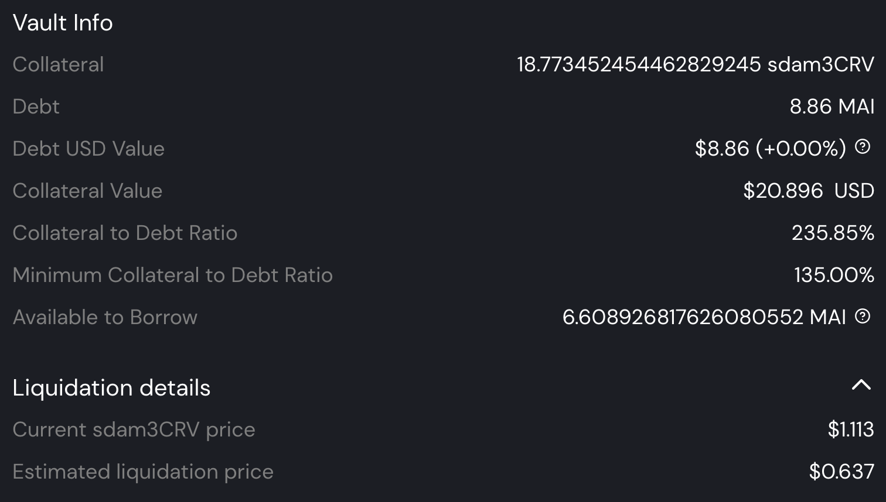
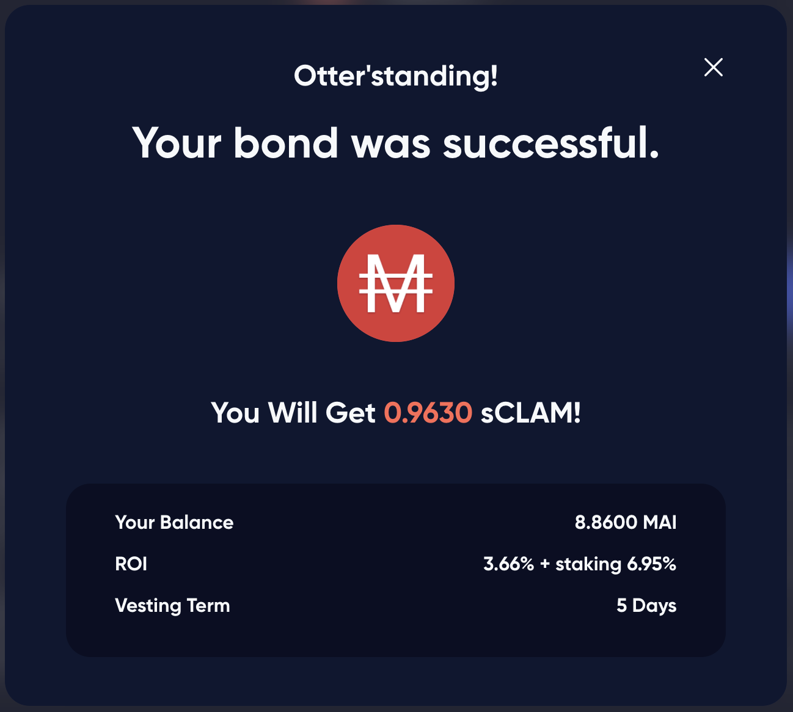

# L'elefante, lo scimpanzé e la lontra

## Introduzione

Anche se potrebbe sembrarvi un buon titolo per una poesia questi sono i 3 animali totem dei protocolli di cui parleremo in questa guida. Oggi daremo un'occhiata da vicino a una delle ultime (a gennaio 2022) aggiunte alla raccolta di token collaterali a sostegno della stable coin $MAI su Mai Finance: il token $sdam3CRV. Spiegheremo in dettaglio di cosa si tratta e come ottenerlo. Proporremo quindi una piccola strategia per utilizzarlo e ottenere rendimenti elevati utilizzando il token di Stake DAO, Mai Finance e il protocollo OtterClam come moltiplicatori di ricompense.

## Stake DAO

### Presentazione di Stake DAO

[Stake DAO](https://app.stakedao.org) è una piattaforma di ottimizzazione dei rendimenti in cui gli utenti possono depositare i propri assets e lasciare che la piattaforma utilizzi le strategie migliori per massimizzarne i rendimenti. Gli investimenti sono proposti con un punteggio di rischio e sono opportunamente visualizzati su una bella dashboard che rende facile seguire i risultati delle strategie scelte. Lanciato principalmente su Ethereum Mainnet, Stake DAO si sta rapidamente espandendo ad altre chain come Polygon e Avalanche. Ovviamente potete leggere di più su Stake DAO sulla loro [documentazione ufficiale](https://stakedao.gitbook.io/stakedaohq/).

### La strategia am3CRV

Per la nostra guida, useremo la `Passive Aave USD Strategy` per Polygon. Questa è una strategia che utilizza il pool am3CRV da [Curve Finance](https://polygon.curve.fi): depositando le vostre stable coin (USDC, USDT o DAI) nel pool aave di Curve riceverete un token di ricevuta am3CRV. Questo è il token che normalmente potete mettere in stake su Curve per ricevere i premi $CRV e $WMATIC ma potete anche depositare questo token su Stake DAO e le ricompense $CRV e $WMATIC verranno vendute e ridepositate nella vostra posizione stable.

Come potete vedere sopra, mettere in stake i vostri token $am3CRV su Curve vi darebbe un APR complessivo dell'8,35% (**A**nnual **P**ercentual **R**eward).. Se andate su Stake DAO, troverete nel `Strategies` tab per Polygon la strategia che utilizza i token $am3CRV in cui dovrete depositare il vostro token di ricevuta e guadagnare l'11,11% di APY (**A**nnual **P**ercentual **Y**ield, che presuppone che reinvestiate le rewards almeno una volta al giorno).

Quando depositate i vostri token $am3CRV su Stake DAO, riceverete un nuovo token di ricevuta: $sdam3CRV (Stake DAO am3CRV).


Tenete presente che Stake DAO prende commissioni sui vostri guadagni per ciascuna strategia che state utilizzando. Nel nostro caso, a partire da gennaio 2022, la commissione di performance è del 15% e ci sarà anche una commissione di prelievo dello 0,5%. Assicuratevi di avere tutto chiaro prima di entrare nel pool.


Questa strategia può essere considerata molto sicura (DYOR) poiché utilizza solo stable coin. Il rischio di impermanent loss è quasi nullo perché il token LP $am3CRV è composto solo da monete stabili ancorate al dollaro USA. Se volete usare Stake DAO, assicuratevi di prendere in considerazione i rischi dello smart contract poiché i vostri assets saranno prestati su AAVE tramite Curve ed il token LP è su Stake DAO, quindi avrete 3 livelli di protocolli esposti al rischio.

Potete anche utilizzare lo strumento di farming su Stake DAO per depositare i vostri token $sdam3CRV e ottenere un ulteriore \~9% pagato in token $SDT, il token nativo di Stake DAO. Per la nostra guida utilizzeremo comunque il token $sdam3CRV in modo diverso.

## Mai Finance

[Mai Finance](https://app.mai.finance) è un protocollo di prestito in cui potete depositare i vostri assets come garanzia e prendere in prestito a fronte di questa garanzia. Questa non è la piattaforma di prestito media in cui troverai persone che prestano beni ai mutuatari. Su Mai Finance, prestate solo a voi stessi e prendete in prestito solo contro i vostri assets. Troverete maggiori dettagli su Mai Finance su questo sito o sulla [documentazione ufficiale](https://docs.mai.finance).

A Gennaio 2022 il token $sdam3CRV è stato approvato come collaterale su Mai Finance. Ciò significa che il token che è stato creato depositando la ricevuta di $am3CRV su Stake DAO può ora essere utilizzato per prendere in prestito la stable coin $MAI. Questo è particolarmente utile per alcuni motivi:

* il token $sdam3CRV è composto solo da stable coin, quindi non dovrebbe essere influenzato da impermanent loss e dovrebbe mantenere un prezzo costante
* dato che il prezzo non cambia molto, è abbastanza facile evitare le liquidazioni, anche se prendete in prestito vicino al livello di liquidazione
* la vostra garanzia sta crescendo di valore perché è un'attività redditizia. Al momento della stesura di questa guida, otterreste l'11% di APR sulla vostra garanzia

Questo vault utilizza un CDR (**C**ollateral to **D**ebt **R**atio) elevato perché cerchiamo sempre di promuovere la sicurezza nelle guide presentate su questo sito. Un CDR elevato presenta alcuni vantaggi:

* Vi tiene lontani dalla liquidazione in caso di importanti azioni sui prezzi in negativo dei vostri assets collaterali
* Vi permette di ritirare una buona parte dei vostri collaterali garanzia e venderli per ripagare il vostro debito (vedi [rimborso del debito](../../mai-university/debt-repayment-how.md))

Tuttavia, sentitevi liberi di mantenere un CDR adatto alla vostra tolleranza al rischio.


Il vault $sdam3CRV utilizza monete stabili come garanzia. Come il vault $camDAI, NON riceverà alcun incentivo al prestito. Il suo rapporto di liquidazione può anche essere ridotto al 110%, come per il vault camDAI..


Con i $MAI che potete prendere in prestito contro i vostri collaterali, potete portare in leva la vostra posizione. Se avete bisogno di dettagli, leggete [strategia camDAI per principianti](camdai-beginner-strategy.md) e applicatela ai vostri token $sdam3CRV. Potete effettivamente ottenere un'esposizione molto maggiore ai rendimenti forniti da Stake DAO semplicemente applicando alcuni cicli di leva. Tuttavia, questo applica una forte pressione di vendita sul token $MAI, quindi proporremo un altro approccio.

## OtterClam DAO

[OtterClam Finance](https://app.otterclam.finance) è un Fork di Ohm su Polygon davvero unico e molto innovativo, integrando fantastici NFT sulla piattaforma. Lanciato nel novembre 2021, OtterClam ha visto una crescita notevole sin dal suo inizio e ora si sta muovendo verso GameFi.

Una delle cose più interessanti di OtterClam è la sua partnership con il protocollo QiDao dietro Mai Finance. La maggior parte delle stable coin che supportano il loro token $CLAM è in $MAI, la stable coin coniata su Mai Finance. Ciò significa che potete acquistare bond $CLAM utilizzando direttamente $MAI ed è esattamente ciò che faremo nella nostra strategia. In effetti, i fork di Ohm sono noti per fornire tassi di ricompensa molto elevati e OtterClam non fa eccezione. Un'altra cosa unica delle obbligazioni su OtterClam è che otterrete $sCLAM (token $CLAM con staking), quindi i token ottengono ricompense di rebase durante l'intero periodo di vesting, il che rende le obbligazioni ancora più attraenti.

In questo screenshot, potete vedere che acquisteremo effettivamente $sCLAM con uno sconto del 3,66% (il prezzo di acquisto è 9,20 $MAI mentre il prezzo di mercato è $ 9,54), ma durante l'intero periodo di vesting di 5 giorni, anche gli $sCLAM acquistati aumenteranno del 6,95%. Grazie ai tassi di ricompensa molto elevati (13.400% APY al momento della scrittura), sarà importante mantenere i token $sCLAM in stake ma venderemo i premi di staking per stable coin e li depositeremo su Curve per aumentare la nostra posizione $am3CRV .

Se controllate il prezzo di $CLAM, noterete che questo token ha molta volatilità, tuttavia e come per la maggior parte dei fork di Ohm, il prezzo del token è irrilevante, stiamo usando OtterClam solo come moltiplicatore per i guadagni. I fork di Ohm sono progettati per ridurre il prezzo del token a $1  e il token è una "valuta di riserva", il che significa che è progettato per essere utilizzato e acquistato/venduto.


I premi di staking vengono accumulati nei token $sCLAM di vesting, ma non è possibile accedervi durante il periodo di vesting. Dovremo aspettare che i token di vesting siano completamente acquisiti prima di poter raccogliere e vendere le ricompense di staking.


## Strategia di Farming

Come nella maggior parte dei casi, il miglior punto di partenza per le strategie è iniziare con stable coin. In questo modo, riducete il rischio di impermanent loss e lavorate solo con i benefici del farming (o l'importo preso in prestito nel nostro caso). Quindi il ciclo inizia depositando stable su Curve per ottenere un token $am3CRV. Questo token di ricevuta viene depositato su Stake DAO in modo che possiate ottenere una ricevuta $sdam3CRV. Questo token sarà depositato su Mai Finance come garanzia per prendere in prestito $MAI. Il prestito viene utilizzato per acquistare obbligazioni $MAI su OtterClam. Le ricompense di rebase vengono scambiate con ulteriori stable coin. Come nota a margine, potete vendere qualsiasi importo della ricompensa di rebase. Per la nostra guida, ne venderemo il 100%, ma potete tenerne un po' per aumentare la vostra posizione $CLAM più velocemente e raccogliere ricompense più grandi più velocemente.

Come sempre per le simulazioni, utilizzeremo dei numeri "fissi" come segue:

* APY per la strategia $sdam3CRV su Stake DAO 11.11%
* APR per lo stake di $CLAMs su OtterClam 13,4%

Inoltre, non terremo conto del rimborso del debito e presumeremo che tutti i prezzi rimangano gli stessi. Eseguiremo la simulazione con un valore di $100 USDC come punto di partenza e cercheremo anche di attenerci a un CDR del 235% quando prenderemo in prestito $MAI. Infine, assumiamo, per la semplicità di questa simulazione, che alla fine di ogni periodo di vesting sia disponibile un $MAI bond con uno sconto dello 0% (nella realtà avrete sconti maggiori dello 0% ovviamente).

### Giorno 1

Il giorno 1, potete preparare praticamente tutto:

* Depositate i vostri $100 $USDC (o $USDT o $DAI, a vostra discrezione) su Curve finance
* Depositate il vostro token di ricevuta $am3CRV su Stake DAO
* Depositate il vostro token di ricevuta $sdam3CRV su Mai Finance
* Prendete in prestito con un CDR del 200% o $50 di $MAI come primo prestito
* Acquistate un'obbligazione $MAI su OtterClam Finance

A questo punto, siete pronti e dovrete attendere l'intero periodo di vesting per iniziare a raccogliere le ricompense di rebase. Alla fine del Giorno 1 avreste:

| Posizione             | valore ($) |
| --------------------- | ---------- |
| $sdam3CRV             | 100.000    |
| $MAI in prestito      | 50.000     |
| $sCLAM                | 50.000     |
| $sdam3CRV addizionali | 0.030      |
| $sCLAM addizionali    | 0.000      |

### Giorno 2, 3 e 4

Niente da dire, i vostri $sdam3CRV stanno raccogliendo rendimenti ma è praticamente tutto, niente da raccogliere mentre l'obbligazione sta maturando

### Giorno 5

Alla fine del giorno 5, l'obbligazione è completamente maturata e poiché i premi di rebase sono stati accumulati durante l'intero periodo di maturazione, alla fine della giornata avreste:

| Posizione             | valore ($) |
| --------------------- | ---------- |
| $sdam3CRV             | 100.122    |
| $MAI in prestito      | 50.000     |
| $sCLAM                | 53.382     |
| $sdam3CRV addizionali | 0.030      |
| $sCLAM addizionali    | 0.722      |

### Giorno 6

Avete alcuni token $sdam3CRV in più contro i quali potete prendere in prestito per acquistare una nuova obbligazione. Sarà un vincolo molto piccolo (pochi centesimi per ora) ma con il tempo potrete acquistare sempre più $sCLAM con i vostri nuovi $MAI. Alla fine del Giorno 6, avrete:

| Posizione            | value ($) |
| -------------------- | --------- |
| $sdam3CRV            | 100.875   |
| $MAI in prestito     | 50.437    |
| $sCLAM               | 53.820    |
| sdam3CRV addizionali | 0.031     |
| $sCLAM addizionali   | 0.728     |

A questo punto, i vostri $CLAM in staking produrranno premi ogni giorno che potete accumulare nel vostro deposito $sdam3CRV oppure potete semplicemente accumulare ogni 5 giorni quando l'obbligazione è maturata.

### Routine giornaliera

Supponendo che reinvestiate le ricompense ogni giorno, la routine quotidiana sarà

* unstake dell'equivalente di 3 rebase dallo staking di $CLAM
* venderli per la stable coin più vantaggiosa in base allo stato del mercato
* depositare la stable aggiuntiva nel pool Aave su Curve Finance
* depositare il token $am3CRV su Stake DAO
* depositare il token $sdam3CRV su Mai Finance

Quindi ogni 5 giorni sarete in grado di eseguire i seguenti passaggi aggiuntivi:

* prendere in prestito ulteriori $MAI mantenendo un CDR del 200%
* acquistare ulteriore bond $MAI su OtterClam

### Risultati "grezzi" mese dopo mese&#x20;

Ecco i risultati che vi potete aspettare mese dopo mese

| giorno | $sdam3CRV | $CLAM   | debito MAI |
| ------ | --------- | ------- | ---------- |
| 30     | 121.249   | 64.007  | 60.625     |
| 60     | 150.866   | 78.815  | 75.433     |
| 90     | 187.350   | 97.057  | 93.675     |
| 120    | 232.294   | 119.529 | 116.147    |
| 150    | 287.659   | 147.212 | 143.830    |
| 180    | 355.863   | 181.314 | 177.931    |
| 210    | 439.882   | 223.323 | 219.941    |
| 240    | 543.383   | 275.074 | 271.691    |
| 270    | 670.884   | 338.825 | 335.442    |
| 300    | 827.950   | 417.358 | 413.975    |
| 330    | 1,021.437 | 514.101 | 510.719    |
| 360    | 1,259.790 | 633.277 | 629.894    |

### Giorno 365

Dopo un anno completo di farming di questo sistema e supponendo che tutto sia lo stesso del giorno 1 (prezzi, tariffe e tutto il resto...), avreste:

* $1,304.575 in token $sdam3CRV nel vault su Mai Finance
* $655.670 in token $CLAM su OtterClam finance
* un debito di $652.288 in $MAI su Mai Finance

Potete vedere che alla fine dell'anno avete ancora un CDR del 200%. Potreste ritirare il vostro collaterale per ripagare il debito e sbloccare il resto della tua garanzia. Potete anche ripagare il vostro debito vendendo i vostri $CLAM e sbloccando il 100% del collaterale.

Alla fine, da un investimento iniziale di $100 si finirebbe con $1.307,958 e un debito di $652,288, che corrisponderebbe ad un APY complessivo di 1.207,958%.

Se ritirate solo il 50% della vostra ricompensa di rebase da OtterClam Finance e mantenete il resto in stake, l'APY elevato verrà applicato a una posizione che cresce molto più velocemente. Ciò presenta più rischi ma supponendo che tutto rimanga lo stesso e vendiate solo il 50% delle vostre ricompense, potreste finire con $3.608,447 divisi tra il vostro Vault e OtterClam e un debito di $750,828 per un APY equivalente di 2.757,619%.

## Disclaimer

Questa strategia è piuttosto interessante, perché presenta pochissimi rischi iniziali. In effetti, i vostri soldi stanno lavorando in stable coin e quindi la probabilità di perderli è molto piccola. Il rischio di liquidazione è anche molto ridotto a causa del CDR molto elevato utilizzato per una variazione di prezzo molto piccola tra la garanzia e l'asset preso in prestito. Senza strumenti aggiuntivi, probabilmente otterreste un APY del 12% circa ma è chiaro che l'utilizzo di altri protocolli per massimizzare le ricompense può portare a rendimenti molto elevati.

Tuttavia, assicuratevi di aver compreso questa strategia di investimento nei minimi dettagli. Assicuratevi di accettare i rischi dello smart contract perché stiamo utilizzando molti protocolli diversi. Inoltre, dovete capire come funzionano i fork di Ohm e non prestare attenzione al prezzo di $CLAM che può variare molto. Infine, se i tassi possono rimanere gli stessi su Stake DAO, il tasso di ricompensa su OtterClam diminuirà sicuramente nel tempo poiché i fork ohm non possono sostenere APY così alti per lunghi periodi di tempo. Come sempre, leggete la documentazione dei diversi progetti che utilizzerete e assicuratevi di aver compreso tutti i rischi.


Questa guida non va considerata un consiglio finanziario, è stata realizzata a puro scopo educativo. Dovete prestare attenzione alle variazioni di prezzo, domanda e offerta, programmi di ricompensa, date di conclusione delle ricompense, impermanent loss ecc... L'obiettivo non è proporre ricette che possono essere seguite alla cieca, quindi per favore fate i vostri compiti e le vostre simulazioni e investite solo ciò che siete disposti a perdere.

