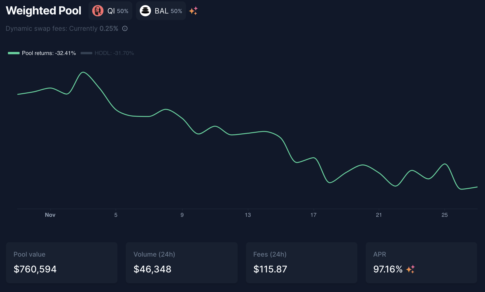

# Haciendo staking de MAI con Ethalend

## Introducción

Una de las misiones de este sitio web y de esta colección de tutoriales que hay disponibles, es hacer que DeFi sea fácil de usar, desmitificando los protocolos más complejos. Esta visión también la comparte el equipo que está detrás de [Ethalend](https://www.ethalend.org), y esta guía le presentará una forma perfecta de utilizar esta plataforma junto con Mai Finance para aumentar tus rendimientos al hacer farming de estables.

## Presentación de Ethalend&#x20;

### ¿Qué es Ethalend?

Ethalend es un protocolo tipo composable que se encarga de disminuir la complejidad de DeFi para proporcionar un rendimiento algorítmico óptimo. No es un agregador de rendimientos, sino un optimizador de rendimientos. Podrás depositar tus activos en la plataforma, y el algoritmo encargado del pool en el que depositas tus activos los invertirá realmente de la mejor manera posible. Los rendimientos se distribuyen entonces en el token nativo de Ethalend, el token ETHA, así como en algunos tokens de socios, incluyendo Qi de Mai Finance que puedes obtener depositando tu MAI en la eVault de MAI-USDT. Puedes leer más sobre Ethalend a través de su[ documentación oficial](https://docs.ethalend.org), o leyendo esta mágnifica [entrevista](https://ambcrypto.com/un-complicating-defi-an-interview-with-ethalend-co-founder-danny-b/)(aunque está en inglés).

### Crea tu cartera de Ethalend desde tu cartera web3&#x20;

Una de las cosas más interesantes de Ethalend es que la aplicación utiliza un monedero dedicado en la cadena que no está vinculado a tu monedero web3 (como metamask por ejemplo). Esto puede ser considerado como:

* Una ventaja, ya que todo el riesgo del contrato se limita a lo que se expone en este monedero privado. Además, algunas interacciones entre la aplicación Ethalend y el monedero privado se incluyen directamente en el uso de la plataforma, lo que puede ahorrarte algunas cuotas de transacción. Como nota al margen, el monedero inteligente ETHA es no custodiado, lo que significa que sólo tú tendrás acceso al monedero, no es como un monedero centralizado maestro que controla la parte correspondiente a tu monedero.
* &#x20;Una desventaja, añade complejidad en tu rutina, y el monedero inteligente ETHA no es compatible con dispositivos físicos.&#x20;

Por lo que dependerá de ti decidir si los pros aportan suficiente valor cómo para superar los contras. Cuando estés listo para crear tu monedero, simplemente haz clic en el botón `Create Wallet` que se encuentra en la esquina superior derecha.

Pues ya estaría, ya estás listo para poder usar el protocolo.

## Descripción de la estrategia

Esta estrategia puede añadirse a tu lita de estrategias relativamente seguras, ya que utilizará un farming de monedas estables raíz, y se proporcionarán rendimientos adicionales gracias a otros activos más volátiles de las recompensas de la posición estable.

### Haciendo staking de MAI

Una de las grandes ventajas de Ethalend, y una de las características clave que permite la simplificación de DeFi, es que para utilizar su plataforma, no necesitas proporcionar un par LP (Liquidity Provider) compuesto por 2 activos con una proporción de 1:1. El algoritmo que gestiona el pool (o eVault en nuestro caso) lo hará automáticamente por usted. Además, una vez que deposites tus activos en una eVault, éstos serán redirigidos automáticamente al mejor protocolo que maximice tu rendimiento. Los tokens de recompensa serán cultivados y convertidos por ti de forma periódica.

Como puedes ver, los detalles de las recompensas se muestran en la parte derecha de la pantalla. Las recompensas de ETHA no se muestran, pero se obtiene una estimación de las recompensas de Qi asociadas a su depósito. Si se desplaza hacia abajo en la página, también obtendrá un buen entendimiento acerca de la estrategia subyacente que está utilizando QuickSwap en nuestro caso. Las recompensas QUICK se convertirán en recompensas Qi. Las recompensas ETHA son acuñadas automáticamente por el protocolo para incentivar el uso de su plataforma en lugar de QuickSwap.


Preste atención a las tasas de retiro del 0,10%. En el momento de escribir esto, con un depósito de 100 MAI, tendré que pagar una comisión de salida de 0,1 MAI, que corresponde aproximadamente a 10 días de cultivo en la eVault. Asegúrese de entender este punto antes de invertir nada.


### Haciendo staking de ETHA: Ethalend o QuickSwap

La principal recompensa que obtendrás al prestar tu MAI en Ethalend, se pagará en ETHA, el token nativo de Ethalend. Una de las principales ventajas de Ethalend es que podrás hacer staking de tus tokens ETHA directamente en la plataforma y así aumentar tus rendimientos.

Como puedes ver, la mejor opción es depositar los ETHA ganados en el fondo de ETHA-QUICK. Debido a la naturaleza de los 2 activos (muy volátiles), la recompensa es realmente alta. Si lo prefieres, puedes reducir las pérdidas impermanentes depositando tus ETHA en el pool ETHA-USDT. En ambos casos, serás recompensado con tokens QUICK. Y, por supuesto, si eres realmente entusiasta de ETHA, puedes apostar tus recompensas en el pool de ETHA para obtener ETHA adicionales.&#x20;

Los depósitos de staking en Ethaland son en realidad una comodidad ofrecida por Ethalend. Cuando depositas tus tokens en el pool, el algoritmo de balanceo venderá algunos de los tokens depositados para comprar el otro para formar el par LP, y usar este par en QuickSwap directamente. Ya que realmente, puedes hacer esto manualmente: reclamar tus tokens ETHA, retirarlos en tu cartera web3, vender el 50% por tokens QUICK, crear algunos tokens LP, y depositarlos en el pool de QuickSwap:


QuickSwap promociona un 223,1% de APY en el par ETHA-QUICK, mientras que Ethalend muestra un 116,73% de APR en el mismo par. Esto se debe a la diferencia entre APY (Annual Percentage Yield, o recompensas autocompensadas) y APR (Annual Percentage Revenue, o recompensas sin autocomponer). Los 2 porcentajes son en realidad exactamente iguales, por lo que no importa la plataforma que elijas para utilizar tus tokens ETHA.


### La bóveda dQUICK Mai&#x20;

La mejor manera de utilizar las recompensas QUICK que obtendrás al hacer staking de tu ETHA es convertirlas en dQUICK. dQUICK se puede crear en la Dragon's Lair en QuickSwap. Esta es la forma en la que QuickSwap está incentivando a los usuarios a stakear sus QUICK recompensándolos con QUICK adicionales: al bloquear tus tokens QUICK en QuickSwap, ganarás tokens extra.


El APY de dQUICK varía mucho entre el 20% y el 40%, dependiendo de la cantidad de tokens QUICK que se stakeen en la Plataforma


Pero una de las mejores cosas de dQUICK es que es un token aprobado como colateral que puede utilizarse en Mai Finance como garantía. Esto significa que, después de depositar tus recompensas QUICK de Ethalend en QuickSwap y recibir dQUICK, puedes dirigirte a Mai Finance y depositar los tokens dQUICK en una bóveda dQUICK para pedir préstamos de MAI contra ellos.

Algunas cosas sobre las bóvedas de dQUICK:

* Tienen un ratio de liquidación del 130%, lo que significa que podrás pedir prestado muchos MAI contra tus tokens dQUICK. Sin embargo, si quieres cobrar también las recompensas de los préstamos, tendrás que mantener un CDR (ratio de garantía a deuda) entre el 155% y el 400%. Esto es una buena idea ya que el token QUICK es bastante volátil, y como regla general, esta guía siempre promueve manterner un CRD del 100% superior al ratio de liquidación (o 230% para dQUICK).&#x20;
* Las bóvedas de dQUICK se encuentran entre las que tienen el APR más alto cuando se pide prestado MAI contra dQUICK. En el momento de escribir este artículo, puedes obtener hasta un 39,40% de APR pagado en tokens Qi en función de la cantidad de MAI que vayas a pedir prestada contra tu MAI.

Como puedes ver, proporcionar dQUICK es muy interesante ya que tendrás un activo que obtiene recompensas QUICK compuestas de QuickSwap, obtendrás recompensas Qi por tu préstamo, y estarás acuñando MAI que luego pueden ser añadidos de nuevo en la eVault en Ethalend, aumentando tu posición de cultivo estable.

### ¿Qué hacer con tus recompensas en forma de Qi?

Esta cuestión ya ha sido explicada en este [artículo](https://qidao-qimps.gitbook.io/mai-finance-tutorials/v/espanol/tutoriales-de-polygon/que-hacer-con-qi-polygon). En pocas palabras, simplemente depositaremos el Qi en el pool Qi-BAL en Balancer para beneficiarte de un sólido APR, pagado en tokens Qi y BAL adicionales que puedes componer en el mismo pool.

## Poniendo a funcionar la estrategia

Lo que sigue es una simulación hecha con una inversión inicial de 100 dólares en MAI que puedes tomar prestados de una bóveda existente, o comprar en una plataforma DEX. Además, asume que todas las APRs y APYs actuales permanecen iguales durante el lapso de 1 año, y que todos los tokens mantienen el mismo precio, lo cual (por supuesto) nunca será el caso.

### Día 1

En el día 1, depositarás tu MAI en Ethalend en el pool de MAI-USDT, luego obtendrás la recompensa tanto en Qi como en ETHA al final del día.

| Tipo de recompensa | Valor en dólares |
| ------------------ | ---------------- |
| Mai on Ethalend    | 100.000          |
| Qi+BAL on Balancer | 0.032            |
| ETHA on Ethalend   | 0.070            |
| dQUICK on Mai      | 0.000            |
| debt on Mai        | 0.000            |

### Día 2

En el día 2, puedes hacer staking de tus ETHA del día 1 en Ethalend, lo que generará recompensas QUICK que luego puedes convertir en dQUICK en QuickSwap, depositarlo en Mai Finance, y pedir prestado MAI contra estos tokens. También puedes depositar tu Qi en el fondo de Balancer. Al final del día 2 obtendrás:

| Tipo de recompensa | Valor en dólares |
| ------------------ | ---------------- |
| Mai on Ethalend    | 100.000          |
| Qi+BAL on Balancer | 0.065            |
| ETHA on Ethalend   | 0.141            |
| dQUICK on Mai      | 0.000            |
| debt on Mai        | 0.000            |

A partir de aquí, el sistema estará a pleno funcionamiento, y podrás hacer crecer tu posición estable de MAI, así como obtener recompensas en Qi, BAL, ETHA y dQUICK. Ten en cuenta que algunos valores son demasiado bajos para ser significativos en este punto, y como no podrás pedir prestado menos de 0,01 MAI, tendrás que acumular dQUICK durante 14 días antes de poder pedir prestado MAI.

## Resultados del Farming

### Rutina diaria

La rutina diaria de farming estará compuesta por:&#x20;

* Recoger las recompensas de Qi y ETHA del pool de MAI-USDT en Ethalend
* &#x20;Depositar los tokens Qi en el pool de Balancer en Balancer
* &#x20;Depositar los tokens ETHA en el pool ETHA-QUICK en Ethalend
* &#x20;Recoger recompensas QUICK del pool ETHA-QUICK en Ethalend
* &#x20;Convertir QUICK en dQUICK en QuickSwap&#x20;
* Depositar dQUICK en la bóveda de dQUICK en Mai Finance&#x20;
* Tomar prestado MAI de la bóveda de dQUICK en Mai Finance&#x20;
* Depositar MAI adicionales prestados en el pool de MAI-USDT en Ethalend Además, podrás cosechar y componer las recompensas de Qi y BAL semanalmente.

### Resultados aproximados&#x20;

&#x20;A continuación se mostrarán cuales son los resultados aproximados al realizar esta estrategia:

| Día | Mai en Ethalend | Qi en Balancer | ETHA en Ethalend | dQUICK on Mai | MAI debt |
| --- | --------------- | -------------- | ---------------- | ------------- | -------- |
| 30  | 100.046         | 1.015          | 2.186            | 0.099         | 0.049    |
| 60  | 100.196         | 2.116          | 4.303            | 0.406         | 0.203    |
| 90  | 100.453         | 3.315          | 6.424            | 0.926         | 0.463    |
| 120 | 100.819         | 4.624          | 8.553            | 1.666         | 0.833    |
| 150 | 101.297         | 6.058          | 10.690           | 2.631         | 1.315    |
| 180 | 101.892         | 7.632          | 12.838           | 3.828         | 1.914    |
| 210 | 102.606         | 9.361          | 15.001           | 5.263         | 2.632    |
| 240 | 103.443         | 11.264         | 17.179           | 6.945         | 3.473    |
| 270 | 104.406         | 13.360         | 19.377           | 8.881         | 4.441    |
| 300 | 105.501         | 15.671         | 21.597           | 11.079        | 5.540    |
| 330 | 106.731         | 18.220         | 23.841           | 13.548        | 6.774    |
| 360 | 108.100         | 21.032         | 26.113           | 16.297        | 8.149    |
| 365 | 108.343         | 21.528         | 26.495           | 16.783        | 8.392    |

### Día 365

Al final de un año, usted tendría:

* 108,343 dólares de MAI en el fondo de MAI-USDT en Ethalend&#x20;
* 26,495 dólares de ETHA en el fondo ETHA-QUICK de Ethalend&#x20;
* 21,528 $ de Qi en el fondo Qi-BAL de Balancher&#x20;
* 16,783 $ de dQUICK en el depósito de dQUICK en Mai Finance&#x20;
* 8,392 $ de deuda MAI en Mai Finance

En total, el valor de los activos es de 173.149 $ y la deuda pendiente de 8.392 $, lo que corresponde a un APY equivalente del 64,757%. Esto se consigue con una inversión inicial de 100 dólares en MAI y utilizando un fondo estable como base para la explotación. Tenga en cuenta que no se han tenido en cuenta las comisiones de transacción, pero pueden influir en el resultado final. Esto también es asumiendo que se está componiendo diariamente durante 1 año completo.

## Descargo de Responsabilidad

Todo lo que se presenta en este tutorial es contenido educativo hecho para ilustrar cómo puede utilizar sus MAI sin venderlos, y aún así generar un APY de más del 60% utilizando diferentes protocolos como si fueran piezas de Lego. Sin embargo, este tutorial no debe ser considerado como un consejo financiero.&#x20;

Además, la estrategia aquí está presentando un bucle cerrado que no vende ningún token y cada sistema está alimentando el siguiente. Sin embargo, como se puede ver, la posición final dQUICK no es muy alta, y el préstamo MAI probablemente no generará una gran cantidad de Qi. Probablemente puedas conseguir el mismo APY equivalente (incluso mejor) vendiendo las recompensas QUICK otorgadas por el pool ETHA-QUICK, comprar MAI y añadirlo a tu posición MAI-USDT.


Tenga en cuenta que una estrategia que funciona bien en un momento dado puede dar malos resultados (o hacerle perder dinero) en otro momento. Manténgase informado, controle los mercados, vigile sus inversiones y, como siempre, investigue por su cuenta.

