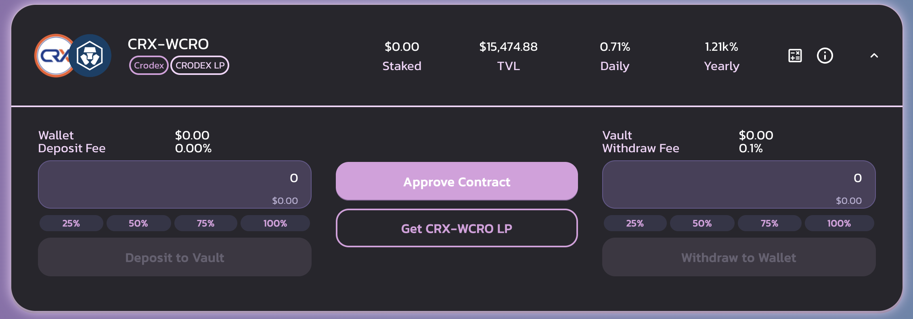
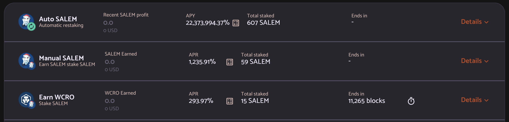

# Farmeando rendimientos en CroDex como Legos

Hacer farming de rendimientos puede ser fácil. Tienes 2 tokens, los combinas en un par LP (Liquidity Providing), depositas el token LP en un pool y empiezas a recibir comisiones de intercambio y la mayoría de las veces, recompensas pagadas en el token original. La mayoría de las personas se limitan a vender la recompensa por cualquier activo que estén buscando, lo cual en la mayoría de los casos es totalmente válido, pero está muy lejos de ser una solución optimizada. Hoy veremos cómo se puede sacar provecho de los altísimos APRs (Annual Percentage Rate) propuestos sobre Cronos en varias DApps, que transformarán un 30% de APRs sobre monedas estables en una tasa mucho más alta.

## CroDex

### Farmeando con MAI

Aunque la aplicación de préstamos de Mai Finance aún no está desplegada en Cronos, ya es posible transferir MAI desde otras cadenas. Una de las razones para hacerlo es que no hay mucho MAI en Cronos, lo que significa también que cualquier aplicación que proponga hacer farming con MAI ofrecerá altos APRs. Este es el caso de CroDex, actualmente el único lugar con liquidez de MAI en Cronos. Para esta guía, utilizaremos el pool de MAI-USDC en CroDex para disminuir el riesgo de **pérdida impermanente** en tu inversión inicial, pero puedes aumentar tus ganancias farmeando MAI-CRO.


Siempre que seleccione una aplicación para cultivar rendimientos, es importante observar si la recompensa se muestra como un APR (Annual Percentage Rate) o APY (Annual Percentage Yield). Este último supone que todas las recompensas que se obtienen se componen diariamente durante un año completo. En nuestro ejemplo, el 30% APRs del par MAI-USDC corresponde a un 34,97% APY.&#x20;

Si se compara con el pool MAI-USDC en Mai Finance, el APR dado es del 20,18% en Polygon, del 22,10% en Fantom, y el pool MAI-av3CRV en Avalanche propone un 23,24% APR. CroDex propone el mejor tipo de interés en MAI estable en todas las cadenas.


CroDex te pagará con su token nativo, el CRX. A fecha de Diciembre de 2021, 1 CRX = 127,56 USDC

### Haciendo staking de CRX

Aquí es donde la cosa se pone interesante. CroDex tiene dos grupos diferentes en los que podrás apostar tus fichas CRX para obtener recompensas adicionales. Puedes apostar para conseguir más CRX, pero nosotros usaremos el pool donde apostar CRX te recompensará con tokens wCRO. wCRO es la versión envuelta de CRO, el token de gas de la red Cronos.

Ya puedes ver que podrías perfectamente vender tu CRX por más tokens MAI-USDC LP y obtener casi un 35% de APY en el par estable, pero es claramente mejor apostar tu CRX para conseguir CRO. No sólo se puede utilizar para pagar las tasas de transacción, sino que también puede cultivar MAI-CRO en CroDex. Y cuanto más CRX consigas con el tiempo, más CRO obtendrás si haces staking de tus CRX. Pero en esta guía, exploraremos Cronos un poco más

## CRYSTL Finance

CRYSTL Finance era conocido como Polycrystal en Polygon. Es un fork que propone bóvedas de pares LP y pools de staking individual, y funciona exactamente igual que Beefy Finance. Utilizaremos ambos para nuestra estrategia.

### Farmeando CRYSTL con CRX-WCRO

Utilizaremos los tokens CRO producidos por el staking de CRX para intercambiar el 50% de la recompensa en más CRX y combinar estos dos tokens en un par CRX-WCRO en CroDex, luego depositar el token LP en una bóveda en Crystl Finance. Esto le permitirá obtener un alto APY que será compuesto.

Los tipos mostrados son un APY. Un APY de 1,21k% corresponde a un APR de 258,17%, pero también puedes obtener las ganancias diarias estimadas directamente en la información de la bóveda, y tu cultivo de CRX-WCRO te dará actualmente un 0,71% de ganancias diarias. Es muy importante que lleves la cuenta de la recompensa diaria porque extraeremos esta parte de nuestra posición de LP y la dividiremos en tokens separados. El CRX se volverá a apostar en CroDex para obtener más tokens CRO, y el CRO se cambiará por CRYSTL. También hay que tener en cuenta que hay una comisión de retirada por las ganancias que extraeremos cada día.

### Haciendo staking de CRYSTL

Con el token CRYSTL obtenido en el paso anterior, podrá obtener USDC del fondo de apuestas único de CRYSTL Finance. Sólo tienes que stakear tu token CRYSTL y se te pagará en USDC con un APR bastante alto.

A continuación, sólo hay que cambiar el 50% de los USDC cultivados por MAI, y volver a añadirlos a la posición original en CroDex.&#x20;

Alternativamente, podemos utilizar el mismo enfoque que el anterior y hacer staking de tokens CRYSTL para generar tokens SALEM, que es el token nativo de Salem Finance.

## Salem Finance

Salem Finance es otro fork en el que podrás farmear el token SALEM. La mayoría de los pools de LP tienen una tarifa de depósito, pero en realidad no utilizaremos las granjas de LP ya que CRYSTL Finance ya nos está dando los tokens SALEM que necesitamos. En su lugar, haremos staking de SALEM en los pools para ganar WCRO adicionales con, una vez más, un APR muy alto.

El token (w)CRO al ser el token de gas de Cronos, tiene mucha utilidad. Además, si se quiere, se puede puentear con la cadena principal de Crypto.org. En nuestro caso, y dado que queremos cerrar nuestro bucle de inversión, podemos simplemente vender las ganancias de Salem Finance y comprar más USDC y MAI.

## Estrategia de farmeo

Ya puedes ver que con sólo 3 protocolos, tienes varias opciones:

* Farmear MAI-USDC para obtener CRX, hacer staking de CRX para obtener WCRO, vender WCRO para obtener más MAI-USDC.
* Farmear MAI-USDC para obtener CRX, hacer staking de CRX para obtener WCRO, farmear CRX-WCRO para obtener CRYSTL, hacer staking de CRYSTL para obtener USDC, intercambiar USDC por más MAI-USDC.&#x20;
* Farmear MAI-USDC para conseguir CRX, hacer staking de CRX para conseguir WCRO, farmear CRX-WCRO para conseguir CRYSTL, hacer staking de CRYSTL para conseguir SALEM, hacer staking de SALEM para conseguir WCRO, vender WCRO por más MAI-USDC.&#x20;

Para el resto de esta guía, nos centraremos en la última estrategia, que es la más compleja y requiere muchas manipulaciones, pero también es la que ofrece el mejor resultado global. Siéntase libre de aplicar la que prefiera en función de su aceptación del riesgo.

### Poniendo en marcha el sistema

Lo que sigue es una simulación realizada con una inversión inicial de 1.000 dólares en tokens MAI-USDC LP, y los APRs/APYs actuales presentados en este documento a partir de Diciembre de 2021. Por supuesto, las tasas y los precios cambiarán con el tiempo, por lo que esta simulación sólo es válida en el momento de escribir este documento, y la simulación sólo proporcionará una estimación de lo que potencialmente podría obtener si realiza esta estrategia.

### Día 1

Depositas tu MAI-USDC en CroDex en el pool correspondiente y obtienes un 30% de APR sobre el mismo. Al final del primer día, una vez que cobres tus recompensas de CRX, tendría:

| MAI-USDC | CRX stakeado | CRX-WCRO | CRYSTL | SALEM | WCRO  |
| -------- | ------------ | -------- | ------ | ----- | ----- |
| 1,000.00 | 0.822        | 0.000    | 0.000  | 0.000 | 0.000 |

### Día 2

Su CRX stakeado está generando WCRO. Puede recolectar la recompensa y cambiar el 50% en más CRX para crear un par LP CRX-WCRO que luego puede depositar en CRYSTL Finance. Al final del segundo día tendrá:

| MAI-USDC | CRX stakeado | CRX-WCRO | CRYSTL | SALEM | WCRO  |
| -------- | ------------ | -------- | ------ | ----- | ----- |
| 1,000.00 | 1.644        | 0.002    | 0.000  | 0.000 | 0.000 |

### Día 3

El par CRX-WCRO bloqueado en la bóveda de CRYSTL Finance generó un token LP adicional. Tendrá que extraer la ganancia diaria y pagar una comisión del 0,1%, y dividir la parte de LP extraída en tokens CRX y WCRO. Puedes simplemente volver a tomar el CRX en CroDex, y cambiar el WCRO en CRYSTL. Esto se puede hacer en [CroDex usando el swap](https://swap.crodex.app/#/swap?outputCurrency=0xCbDE0E17d14F49e10a10302a32d17AE88a7Ecb8B). Al final del día tendrá:

| MAI-USDC | CRX stakeado | CRX-WCRO | CRYSTL  | SALEM | WCRO  |
| -------- | ------------ | -------- | ------- | ----- | ----- |
| 1,000.00 | 2.466        | 0.005    | 0.00003 | 0.000 | 0.000 |


Note that the rewards on CRYSTL are very small and it may not be interesting to harvest the reward from day 1. This simulation is still displaying the rewards you should get and will assume you still compound daily, but this is done to simplify the results. Make sure you don't spend all your reward into transaction fees, and it may be more interesting to compound only weeekly of the first few weeks.


### Día 4

Tu recompensa CRYSTL de Crystl Finance puede ser stakeado para generar tokens SALEM. Al final del cuarto día obtendrás:

| MAI-USDC | CRX stakeado | CRX-WCRO | CRYSTL  | SALEM     | WCRO  |
| -------- | ------------ | -------- | ------- | --------- | ----- |
| 1,000.00 | 3.288        | 0.010    | 0.00011 | 0.0000002 | 0.000 |

### Día 5

Día final de poner en marcha el sistema en el que se recogerán las recompensas de Salem Finance. La recompensa WCRO se puede cambiar por más MAI-USDC. Sin embargo, como puedes observar, el valor de la recompensa es tan pequeño que no podrás cosechar el WCRO de Salem Finance antes del día 50 aproximadamente.

## Resultados del Farming

### Rutina Diaria

Una vez que el sistema esté totalmente preparado, ésta es su rutina diaria

* Cosechar CRX de la reserva MAI-USDC
* Recoge la recompensa WCRO de la reserva de staking única en CroDex
* Intercambiar el 50% de la recompensa WCRO por más CRX en CroDex, y crear algún token CRX-WCRO LP
* Deposite sus CRX-WCRO adicionales en CRYSTAL Finance
* Retirar una parte de CRX-WCRO correspondiente a su recompensa diaria
* Dividir el token LP en CRX y WCRO en CroDex
* Hacer staking de CRX en el pool de staking único en CroDex que obtiene recompensas en forma de WCRO
* Intercambiar el WCRO por CRYSTL en CroDex
* Hacer staking del token CRYSTL en Crytl Finance para obtener tokens SALEM&#x20;
* Recolectar el token SALEM
* Hacer staking del token SALEM en Salem Finance
* Recolectar el token WCRO de Salem Finance
* Intercambiar el WCRO por MAI y USDC y crear mas tokens LP.
* Depositar el nuevo par MAI-USDC en su pool correspondiente en CroDex

### Resultados mensuales aproximados

| Día | MAI-USDC | CRX stakeado | CRX-WCRO | CRYSTL | SALEM  |
| --- | -------- | ------------ | -------- | ------ | ------ |
| 30  | 1,000.00 | 25.583       | 0.600    | 0.104  | 0.004  |
| 60  | 1,000.00 | 50.819       | 1.830    | 0.682  | 0.059  |
| 90  | 1,000.04 | 76.736       | 3.315    | 1.941  | 0.260  |
| 120 | 1,000.14 | 103.424      | 4.922    | 3.970  | 0.729  |
| 150 | 1,000.41 | 130.935      | 6.606    | 6.816  | 1.594  |
| 180 | 1,001.93 | 159.307      | 8.352    | 10.515 | 2.994  |
| 210 | 1,001.87 | 188.578      | 10.156   | 15.094 | 5.070  |
| 240 | 1,003.39 | 218.789      | 12.019   | 20.584 | 7.969  |
| 270 | 1,005.71 | 249.988      | 13.942   | 27.014 | 11.843 |
| 300 | 1,009.10 | 282.227      | 15.929   | 34.414 | 16.848 |
| 330 | 1,013.82 | 315.569      | 17.982   | 42.817 | 23.147 |
| 360 | 1,020.23 | 350.084      | 20.105   | 52.256 | 30.906 |

### Día 365

Después de un año completo de farming con esta estrategia, tendrías lo siguiente:

* 1.021,49 dólares en MAI-USDC en CroDex&#x20;
* 355,96 $ de CRX stakeados en CroDex&#x20;
* 20,47 $ de CRX-WCRO depositados en CRYSTL Finance
* 53,93 $ de CRYSTL stakeados en CRYSTL Finance&#x20;
* 32,353$ en SALEM stakeados en Salem Finance

&#x20;El WCRO de Salem Finance se incluye en realidad como la posición adicional MAI-USDC, ya que se vende en su totalidad para aumentar este par. Esto significa que con una inversión inicial de 1.000 dólares, al final del año tendría 1.484,45 dólares entre todas las aplicaciones, para un APY total del 48,45%. Y recuerde que esto se hace cultivando sólo un par estable como raíz de la estrategia. También es bueno tener en cuenta que el único token que se intercambia en el tiempo es el token CRO.

### Alternativa usando Mai Finance

La aplicación Mai Finance no admite bóvedas en Cronos, porque los tokens en Cronos aún no tienen oráculos de Chainlink. Se espera que durante el primer trimestre de 2022, Chainlink añada oráculos en Cronos, y podrás depositar tus tokens WCRO en una Bóveda para tomar prestada la moneda estable MAI. Esto significa que la estrategia anterior puede modificarse para depositar WCRO y utilizar MAI en lugar de vender los tokens WCRO, lo que aumentará ligeramente tu tasa de recompensa final.

## Descargo de Responsabilidad

Esta guía fue escrita para mostrar que puedes aumentar tu tasa de recompensa sin tirar los tokens que generas No es sencillo encontrar los ajustes correctos cuando construyes bucles de retroalimentación, pero es definitivamente factible, y la mayoría de las veces serás recompensado si puedes encontrar la combinación correcta. Sin embargo, esta guía fue escrita sólo para demostrar cómo se puede hacer eso, y no para construir un sistema igual. Todas las tasas de transacción fueron descartadas a propósito, y algunas recompensas no durarán un año completo, lo que significa que usted puede querer considerar bucles más simples para sus inversiones personales. Sin embargo, CroDex es un muy buen punto de partida para ese tipo de sistema.


Esta guía no es en absoluto un consejo financiero, sino que se ha realizado con un objetivo educativo. Es necesario prestar atención a las variaciones de precios, la oferta y la demanda, las fechas de finalización de los programas de recompensa, las pérdidas impermanentes, etc ... El objetivo no era proponer estrategias que se puedan seguir a ciegas, así que por favor haga sus deberes y su propia simulación, y sólo invierta lo que esté dispuesto a perder posiblemente.

