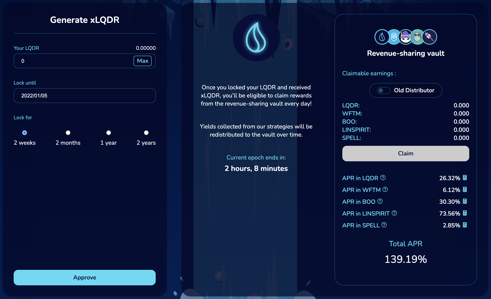

# Bucle de Farmeo usando SpiritSwap

Cuando se cultivan los rendimientos, el par LP (Proveedor de Liquidez) es muy importante. En efecto, usted quiere tener la menor pérdida impermanente posible para no perder su inversión inicial. Este par inicial generará rendimientos, y usted puede aumentar sus ganancias reinvirtiendo el token que farmeó sin riesgo adicional en su inicial. Esta es una de las razones por las que nuestras guías proponen estrategias basadas únicamente en monedas estables, o en pares compuestos por una moneda estable y un token <\<blue chip>> como Bitcoin, Ethereum, o el token de gas nativo de la cadena en la que estamos ejecutando la estrategia. Hoy exploraremos un bucle relativamente complejo que se basará en el par MAI-WFTM LP proporcionado por SpiritSwap para celebrar su lanzamiento e impulso actual.

## Farmeando MAI en SpiritSwap

[SpiritSwap](https://app.spiritswap.finance/#/) es uno de los principales DEX (Decentralized Exchange) y AMM (Automated Market Maker) en Fantom. Se basa en la plataforma Uniswap, por lo que seguramente entenderá las características principales de SpiritSwap, es decir, intercambiar activos, proporcionar liquidez para obtener rendimientos. Obtendrá recompensas en el token nativo de la plataforma, el token SPIRIT que podrá stakear y obtener inSPIRIT. El token inSPIRIT es especialmente útil, te permitirá votar por pools de liquidez en los que se aplicará un beneficio adicional, y te permitirá obtener un rendimiento extra de los ingresos del protocolo.&#x20;

Para nuestra estrategia, utilizaremos el pool MAI-WFTM. A partir de Diciembre de 2021, este pool se puede encontrar en la pestaña `Booster Farms` .


Cuando se ha creado esta guía, el pool estaba en una fase muy temprana (lanzado en las últimas 24 horas), lo que puede explicar los APRs (Annual Percentage Rate) tan elevados. Como siempre, antes de aplicar una de nuestras estrategias, haga sus propias investigaciones y verifique el APRs antes de invertir. Como comparación, USDC-WMATIC en Polygon está en torno al 75%, y MAI-MOVR en Moonbeam está en el 158%. Otros pools como USDC-WFTM se han estabilizado en torno al 50% en Fantom.&#x20;

A efectos de esta guía, nos quedaremos con el APR más bajo de todos, el 152,98%, que puede ser superior al valor actual.


Al cultivar MAI-WFTM en SpiritSwap, obtendrá recompensas pagadas en SPIRIT, el token nativo de la DApp (aplicación descentralizada). A fecha de Diciembre de 2021, 1 SPIRIT = 0.130 USDC.

## Farmeando usandp SPIRIT en Liquid Driver

[Liquid Driver](https://www.liquiddriver.finance) es otro fork de Uniswap que se centra en proporcionar liquidez en Fantom. Una de las características que más interesan en Liquid Driver es el hecho de que pueden crear tokens linSPIRIT a partir de tokens SPIRIT. El linSPIRIT es una versión líquida del token inSPIRIT. La proporción entre linSPIRIT e inSPIRIT es de 1:1, en realidad es una versión envuelta del token inSPIRIT, y puedes intercambiar ambos tokens por el otro directamente en Liquid Driver.

Sin embargo, no utilizaremos esta función. Farmearemos el pool SPIRIT-linSPIRIT en Liquid Driver, pero hay una pequeña trampa:

Como puedes ver, necesitas crear el token LP en BeethovenX para obtener el APR del 61% pagado en tokens LQDR. A fecha de Diciembre de 2021, 1 LQDR = 4,560 USDC. Veamos cómo puedes conseguir este token LP.

## Creando el par SPIRIT-linSPIRIT en BeethovenX

[BeethovenX](https://app.beets.fi/#/) ha sido reconocido como el pool oficial de Balancer en Fantom. En cuanto a Balancer, no es necesario depositar la misma cantidad de ambos tokens para crear un token LP. Esto significa que puedes depositar directamente el 100% de tus tokens SPIRIT, y dejar que el algoritmo encargado del pool lo mantenga equilibrado.

A cambio, obtendrás el token LP que podrás depositar en Liquid Driver.


Como puedes ver, este pool no está incentivado en BeethovenX, no ganarás BEETS con él. Los incentivos son proporcionados únicamente por Liquid Driver cuando depositas el token LP en su plataforma, y la única recompensa que obtendrás se paga en LQDR.


## Haciendo staking de LQDR en Liquid Driver

Una vez que haya creado su token SPIRIT-linSPIRIT LP en BeenthovenX y lo haya depositado en el pool adecuado en Liquid Driver, empezará a ganar tokens LQDR. A continuación, puede apostar los tokens LQDR para ganar una parte de los ingresos del protocolo. Lo bueno es que puedes elegir el periodo de tiempo durante el cual tus LQDR estarán apostados, y esto influirá directamente en tus APRs (es lo mismo que cuando apuestas Qi para ganar ingresos del protocolo). El tiempo medio de bloqueo es un poco menos de 2 años (tiempo máximo de bloqueo) y las recompensas se pagan en:

* LQDR: podrás volver a stakear esta recompensa&#x20;
* WFTM: lo utilizaremos más adelante&#x20;
* BOO: lo utilizaremos más adelante
* &#x20;linSPIRIT: puede utilizarse para aumentar su posición SPIRIT-linSPIRIT en Liquid Driver
* &#x20;SPELL: que se puede intercambiar por WFTM adicional

## Staking de BOO en SpookySwap

[SpookySwap](https://spookyswap.finance) es casi la última pieza de nuestro rompecabezas. Apostar LQDR en Liquid Driver nos hará ganar tokens BOO, el token nativo de SpookySwap. SpookySwap es el mayor DEX/AMM de Fantom, así que puedes hacer prácticamente lo mismo que en SpiritSwap, excepto que su token nativo es el token BOO. Esto es particularmente útil porque puedes stakear tus tokens de BOO en SpookySwap para obtener tokens de xBOO, y esta versión stakeada de BOO puede ser usada para farmear otros tokens (es una característica común para los forks de Uniswap). Así, una vez que tengas xBOO, podrás depositar estos tokens en SpookySwap para ganar WFTM adicionales.

## Obteniendo mas tokens LP MAI-WTFM&#x20;

Liquid Driver y SpookySwap producirán tokens WFTM, por lo que realmente nos falta MAI para añadir más tokens LP a nuestra posición inicial en SpiritSwap. Esto se puede hacer de varias maneras:&#x20;

* Intercambiar el 50% de tu WFTM por MAI&#x20;
* Prestar el 66% de tu WFTM en Beefy o Yearn Finance para conseguir mooScreamFTM o yvWFTM, y luego depositar los tokens de garantía en Mai Finance y pedir prestado MAI contra ellos&#x20;
* Intercambia el 66% de tu WFTM por otro activo y utiliza la misma estrategia anterior para pedir un préstamo de MAI


Si quieres obtener mas información acerca de los dos último puntos, puede leer el artículo [Apalanca tus crypto en Fantom](https://guide.qidao.community/v/espanol/tutoriales/fantom/leverage-your-crypto-on-fantom).


Para nuestra guía, intentaremos maximizar nuestras ganancias y utilizar mooScreamDAI. Esto significa que intercambiaremos el 66% de nuestro WFTM por DAI en Spirit Swap, y luego depositaremos DAI directamente en Beefy utilizando SCREAM como plataforma subyacente para obtener mooScreamDAI. Este token se depositará entonces en una bóveda en Mai Finance y podremos pedir prestado MAI. Para reducir el riesgo de liquidación, mantendremos un CDR (Ratio de Colateral a Deuda) del 200%, lo que significa que tomaremos prestado la mitad del valor de nuestro depósito. Esto es perfecto, ya que corresponde al mismo valor del WFTM que mantuvimos, por lo que será posible crear tokens MAI-WFTM LP adicionales.

Al final del bucle, obtendremos más MAI-WFTM y un token de rendimiento utilizado como colateral en Mai Finance.

## Estrategia de Farmeo

La siguiente simulación se hace suponiendo lo siguiente:&#x20;

* Todos los tipos y precios se mantienen iguales durante todo el periodo de la simulación, 1 año en nuestro caso:
  * &#x20;153% APRs en el farmeo de MAI-WFTM en SpiritSwap
  * Ninguna recompensa en linSPIRIT
  * &#x20;61% APR en SPIRIT-linSPIRIT en Liquid Driver
  * &#x20;139% de APR al hacer staking de LQDR&#x20;
    * 26% APR en LQDR&#x20;
    * 6% en WFTM&#x20;
    * 30% en BOO&#x20;
    * 74% en linSPIRIT&#x20;
    * 3% en SPELL
  * 36% APR en xBOO&#x20;
  * 21% APR para mooScreamDAI&#x20;
  * Todas las recompensas y programas también están en marcha durante todo un año
  * &#x20;La inversión inicial es de 1.000 dólares en tokens MAI-WFTM LP

### Día 1

El día 1, simplemente deposita tu par MAI-WFTM en SpiritSwap. Al final del día, recoja sus tokens SPIRIT y combínelos en un par SPIRIT-linSPIRIT en BeethovenX, y luego deposite esta token LP en Liquid Driver. Al final del día, obtendrás

| MAI-WFTM | linPIRIT-SPIRIT | LQDR | xBOO | mooScreamDAI |
| -------- | --------------- | ---- | ---- | ------------ |
| 1,000.00 | 4.19            | 0.00 | 0.00 | 0.00         |

### Día 2

En el día 2, su MAI-WFTM sigue generando tokens SPIRIT que depositará en el pool linSPIRIT-SPIRIT en Liquid Driver, pero también podrá cosechar sus primeros tokens LQDR, y stakearlos por ellos para obtener las recompensas múltiples. Al final del día, obtendrás

| MAI-WFTM | linPIRIT-SPIRIT | LQDR  | xBOO | mooScreamDAI |
| -------- | --------------- | ----- | ---- | ------------ |
| 1,000.00 | 8.38            | 0.007 | 0.00 | 0.00         |

### Día 3

El día 3, lo mismo, excepto que tu LQDR habrá producido tus primeras tokens exóticos de los ingresos del protocolo. No olvides que stakearas tu BOO, añadirás tu linSPIRIT al pool, tu LQDR se restablecerá y el resto se intercambiará por WFTM. El WFTM resultante se intercambia parcialmente por DAI y luego mooScreamDAI se deposita en una bóveda para tomar prestado MAI, formar MAI-WFTM adicionales que luego se depositan en SpiritSwap. Al final del Día 3, se obtendría:

| MAI-WFTM | linPIRIT-SPIRIT | LQDR  | xBOO | mooScreamDAI |
| -------- | --------------- | ----- | ---- | ------------ |
| 1,000.00 | 12.58           | 0.021 | 0.00 | 0.00         |


Las posiciones de xBOO y mooScreamDAI son demasiado pequeñas para ser mostradas, por lo que puedes omitir estos pasos durante los primeros días. Además, para simplificar, no estoy teniendo en cuenta las comisiones de las transacciones, que pueden tener un impacto en tus ganancias.


En este punto, el sistema está preparado, es el momento de sentarse y dejar que el sistema haga el resto.

## Resultados del farmeo

### Rutina diaria

Una vez que el sistema esté completamente arrancado, esta es la rutina diaria que tendrás que seguir:

* Cosechar tokens SPIRIT del pool MAI-WFTM en SpiritSwap&#x20;
* Recoger las recompensas del pool de Liquid Driver
* Recoger las recompensas del pool de staking de SpookySwap&#x20;
* Depositar el SPIRIT de SpiritSwap y el linSPIRIT de Liquid Driver en el pool de BeethovenX
* Deposita el token LP SPIRIT-linSPIRIT en Liquid Driver
* Stakea tu BOO en SpookySwap para conseguir xBOO&#x20;
* Stakea tu xBOO para cultivar WFTM&#x20;
* Intercambia tu SPELL por WFTM
* Intercambia el 66% de tu WFTM por DAI
* Deposita el DAI generado en Beefy para obtener mooScreamDAI
* Deposita los tokens mooScreamDAI en Mai Finance pedir prestado MAI y mantener un CDR del 200% (50% de lo que has depositado)
* Proporcionar liquidez al pool de MAI-WFTM en SpiritSwap

### Resultados mensuales aproximados

| Día | MAI-WFTM  | linPIRIT-SPIRIT | LQDR    | xBOO   | mooScreamDAI | Deuda Mai |
| --- | --------- | --------------- | ------- | ------ | ------------ | --------- |
| 30  | 1,000.004 | 130.010         | 3.281   | 0.026  | 0.005        | 0.002     |
| 60  | 1,000.039 | 256.218         | 13.014  | 0.210  | 0.041        | 0.021     |
| 90  | 1,000.140 | 383.220         | 29.369  | 0.712  | 0.147        | 0.074     |
| 120 | 1,000.349 | 511.436         | 52.538  | 1.698  | 0.364        | 0.182     |
| 150 | 1,000.708 | 641.302         | 82.741  | 3.338  | 0.738        | 0.369     |
| 180 | 1,001.268 | 773.275         | 120.224 | 5.810  | 1.323        | 0.661     |
| 210 | 1,002.081 | 907.835         | 165.263 | 9.295  | 2.175        | 1.088     |
| 240 | 1,003.207 | 1,045.486       | 218.165 | 13.984 | 3.360        | 1.680     |
| 270 | 1,004.710 | 1,186.759       | 279.268 | 20.075 | 4.947        | 2.473     |
| 300 | 1,006.659 | 1,332.316       | 348.947 | 27.773 | 7.014        | 3.507     |
| 330 | 1,009.130 | 1,482.451       | 427.613 | 37.296 | 9.645        | 4.823     |
| 360 | 1,012.205 | 1,638.095       | 515.717 | 48.870 | 12.935       | 6.467     |

### Día 365

Después de un año completo de cultivo del sistema, usted obtendría:

* 1.012,782 dólares de MAI-WFTM en SpiritSwap&#x20;
* 1.664,608 dólares en linSPIRIT-SPIRIT en Liquid Driver
* &#x20;531,353 dólares de LQDR stakeados en Liquid Driver&#x20;
* 51,015 $ de xBOO en SpookySwap&#x20;
* 13,554 $ de mooScreamDAI en Mai Finance en una bóveda&#x20;
* 6,777 $ de deuda de MAI&#x20;

Considerando una inversión inicial de 1.000 dólares, esto equivaldría a un APY del 227,096%.

### Estrategia Alternativa

Si quieres tener una exposición de menor riesgo, puedes empezar con tu inversión inicial de 1.000$ de mooScreamDAI en una bóveda, pedir prestados 500$ de MAI y cambiar el 50% por WFTM para conseguir el bloque inicial en SpiritSwap. Esto reducirá considerablemente el riesgo de perder parte de tu inicial en caso de que el precio de FTM baje demasiado.&#x20;

Actualmente, la tasa más alta la da el pool de SpiritSwap, así que una posible simplificación del bucle sería simplemente intercambiar todos los tokens LQDR que consigas en Liquid Driver por más MAI-WFTM.

## Descargo de Responsabilidad

Esta guía es una versión teórica de algo que podrías implementar en Fantom. Cuando exponemos los bucles en nuestros tutoriales, en realidad tratamos de no deshacernos nunca de los tokens y de encontrar siempre la mejor manera posible de utilizar todo lo que recogemos. Esta es una buena manera de mantener el precio en alza, ya que cultivar y deshacerse de un token normalmente hace que el precio del token cultivado baje, haciendo que los rendimientos sean cada vez menos atractivos. Si todo el mundo se quedara con los tokens cultivados, su precio sólo subiría con el tiempo.&#x20;

En cualquier caso, la guía también se basa en un montón de suposiciones (el precio no cambia, las tasas de recompensa no cambian) y no cuenta las tasas de transacción, así que si quieres implementar este tipo de bucle cerrado, asegúrate de ser rentable al final del día, o compone tus ganancias sólo una vez a la semana. Y como siempre, ¡déjalo!


Esta guía no es en absoluto un consejo financiero, sino que se ha realizado con un objetivo educativo. Es necesario prestar atención a las variaciones de precios, la oferta y la demanda, las fechas de finalización de los programas de recompensa, las pérdidas impermanentes, etc ... El objetivo no era proponer recetas que se puedan seguir a ciegas, así que por favor haga sus deberes y su propia simulación, y sólo invierta lo que esté dispuesto a perder.

