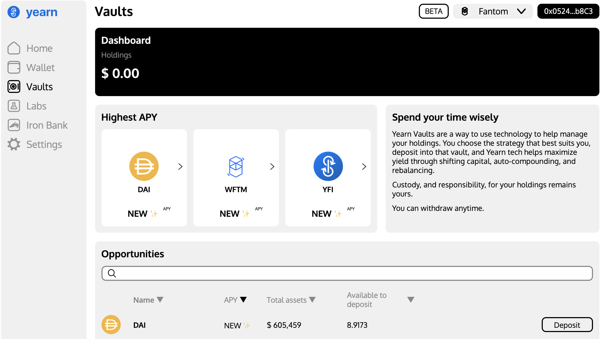
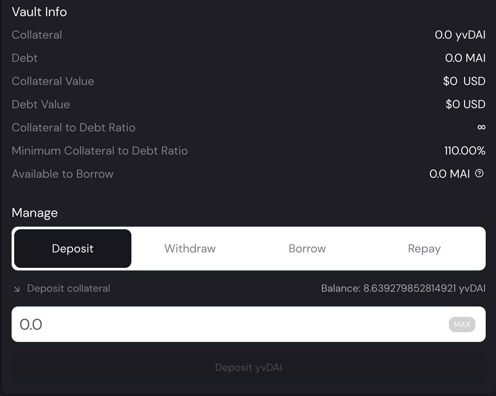
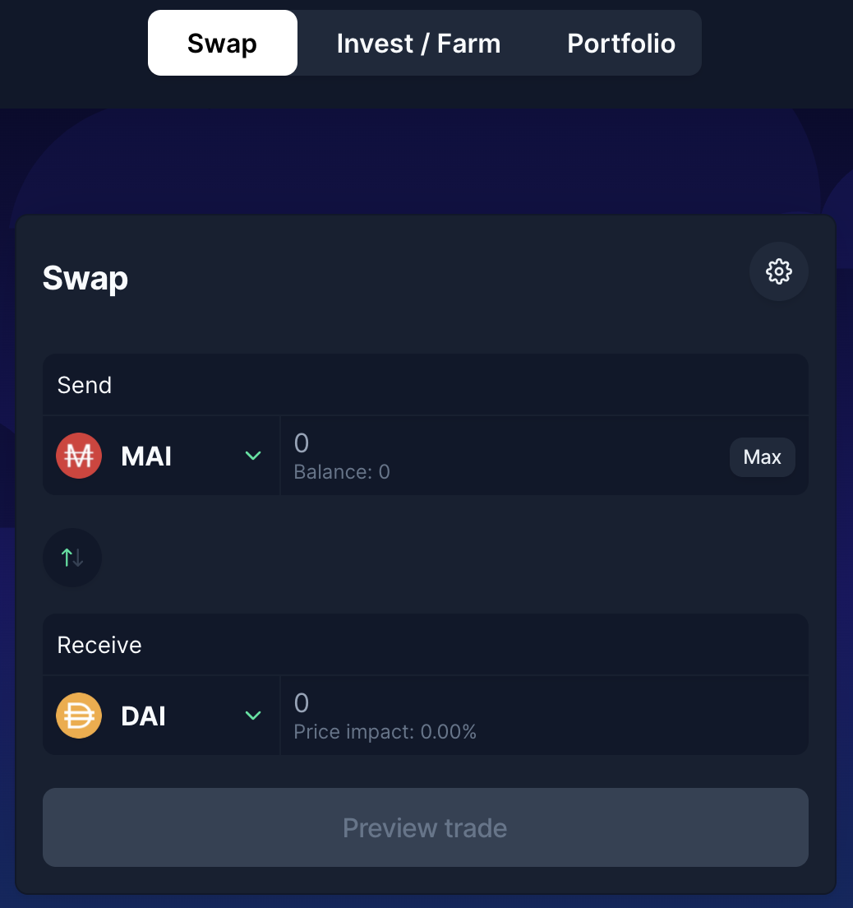
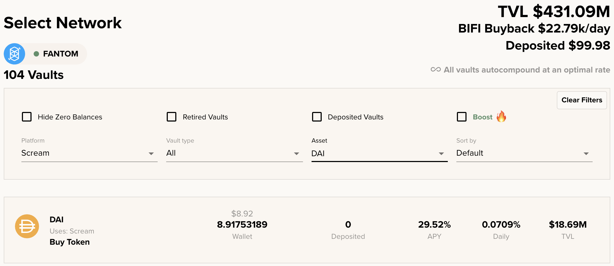
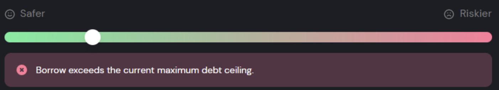

# Apalanca tus crypto en Fantom

## Introducción

Mai Finance ha lanzado su plataforma de préstamos en Fantom con muchos tipos de bóveda diferentes, permitiendo la posibilidad de acuñar la moneda estable MAI en base a los activos que deposites las bóvedas. La idea es que puedas conservar tus criptomonedas y beneficiarte de la revalorización de su precio, mientras compras otras monedas y hacer farming de altos rendimientos. Utilizar tu préstamo para comprar el mismo activo que ya has depositado, es lo que se conoce cómo apalancar tus tokens. A continuación, te mostraremos los beneficios de esta estrategia utilizando 2 plataformas de préstamo diferentes en Fantom para apalancar nuestros tokens DAI.Deposit your assets on Yearn Finance

## Apalanca tus tokens Yearn Vault&#x20;

### Deposita tus activos en Yearn Finance

[Yearn Finance](https://beta.yearn.finance/#/home) es un grupo de protocolos que se ejecutan en la Mainnet de Ethereum y otras blockchains que permiten a los usuarios optimizar sus ganancias en criptoactivos a través de servicios de préstamo y comercio. En Fantom, la funcionalidad que utilizaremos es la bóveda de Yearn Finance. Se trata de una herramienta que aceptará depósitos de un solo token y te hará generar rendimientos sobre este depósito. Como prueba del depósito, recibirás un yvToken. En nuestro caso, depositaremos DAI y obtendremos yvDAI a cambio.


El sitio web de finanzas de Yearn todavía está en modo beta en Fantom. El equipo todavía está trabajando en la plataforma y las APRs/APYs no se muestran. Si te diriges a la pestaña Iron Bank, que es el protocolo de préstamo/préstamo en la plataforma de yearn, verás que el préstamo de DAI está obteniendo \~8% APR. Por favor, invierta según su propio riesgo.


### Deposita tus yvToken en Mai Finance

Una vez que hayas depositado tu DAI en yearn finance, deberías tener yvDAI en tu cartera. Esto es lo que llamamos un token con rendimiento: es un token que no tiene ningún valor en sí mismo, sino que representa su participación en un fondo común donde sus activos están generando rendimientos y en el que las recompensas se componen automáticamente. Es decir, aunque DAI no cambia de valor porque el DAI está vinculado al dólar estadounidense, el valor subyacente de su token yvDAI aumenta de todos modos.

&#x20;Mai Finance acepta muchos tokens de rendimiento diferentes como colateral, incluyendo yvDAI. Ahora puede depositar este token y pedir prestado MAI contra él.

La bóveda de yvDAI tiene un umbral de liquidación del 110%, esto significa que puedes pedir prestado MAI como mínimo cuando la relación entre tu valor de garantía y el valor de tu deuda sea del 110%. Tenga cuidado de que el 110% es en realidad el porcentaje en la que su bóveda será parcialmente liquidada, por lo que tienes que mantener el ratio siempre por encima de este umbral mínimo. Dado que el precio del DAI no varía mucho (menos de unos pocos céntimos hacia arriba o hacia abajo) es posible mantener un **CDR** (Coeficiente de Colateral a Deuda) "seguro" del 115%, pero siéntase libre de elegir un valor algo más alto.&#x20;

Como siempre, para calcular el valor del préstamo que podemos obtener en función del valor de nuestra garantía y del CDR objetivo que queremos conseguir, utilizaremos la siguiente fórmula:

$$
MAI_{disponible} = \frac{Colateral_{valor} - Deuda_{valor} * Porcentaje_{CDR}}{Porcentaje_{CDR}}
$$

​Con un colateral de $100 y sin ninguna deuda, si quisiéramos mantener un CDR del 115% podríamos pedir prestado hasta:

$$
MAI_{disponible}=\frac{100-0*1.15}{1.15}=86.95
$$

Ahora estás en una posición en la que tienes tus DAI en una bóveda de Yearn, y también tienes algunas monedas estables MAI listas para usar. Como queremos aprovechar nuestra posición de DAI, ahora cambiaremos nuestro MAI por más DAI.

### Intercambiando el MAI en BeethovenX

En Fantom, eI principal proveedor de liquidez de MAI es [BeethovenX](https://app.beets.fi/#/trade). Este es el lugar principal donde podrás cambiar tus tokens MAI por más DAI para poder hacer nuestra estrategia.

Este es el último paso de nuestro bucle. Ahora que tienes más DAI que puedes depositar en una bóveda de Yearn y repetir el bucle. Al hacerlo, aumenta la cantidad de activos que tienes en la bóveda de Yearn, lo que significa que generará más recompensas al prestar sus DAI en esa plataforma. El APR/APY sigue siendo el mismo, pero como tienes más activos, generas más rendimiento, y si lo comparas con tu inversión inicial, es tu APR el que aumenta. Si quiere obtener más ejemplos sobre el APR que puede conseguir utilizando los bucles yvDAI, puede leer nuestra [guía sobre camDAI](../../polygon-tutorials/camdai-beginner-strategy.md#main-strategy) en Polygon. Aunque sea otra red distinta, el funcionamiento es el mismo


BeethovenX es una fantástica oportunidad para generar rendimientos con sus MAI prestados. Simplemente deposite su MAI en el pool MAI-DAI-USDC ( APR de \~30% a partir de noviembre de 2021) si no quiere realizar bucles apalancados.


$$
MAI_
$$

## Apalanca tus mooScreamTokens en Mai Finance

### Deposita tus activos en Beefy Finance

[Beefy Finance](https://app.beefy.finance/#/fantom) es una plataforma descentralizada y optimizadora de rendimientos multicadena que permite a sus usuarios ganar intereses compuestos sobre sus criptomonedas. En otras palabras, puede depositar algunos activos o tokens LP de otras plataformas en Beefy Finance y dejar que se auto-cosechen sus tokens de granja y los vuelva a componer en su activo depositado / token LP.&#x20;

En nuestro ejemplo, usaremos depósitos simples de DAI en Beefy y usaremos [Scream](https://scream.sh/lend) como plataforma subyacente. Scream es un fork de Compound en la red Fantom en la que podrás prestar tus activos y recoger tokens SCREAM. Beefy venderá entonces los tokens SCREAM para obtener más DAI.

Para depositar nuestro DAI, visitaremos la app Beefy Finance y seleccionaremos Scream como la plataforma en la que cultivaremos los rendimientos. También puedes añadir el filtro DAI para conseguir el depósito directo de DAI.

Como puedes ver, Beefy ya está dando un increíble APY en depósitos individuales de DAI. Una vez que tengas tu DAI depositado en Beefy, deberías tener una prueba de depósito en tu cartera bajo la forma de tokens mooScreamDAI. En cuanto al token yvDAI, el token mooScreamDAI es un depósito con rendimiento, lo que significa que tu activo se sigue utilizando en Scream y se compone en Beefy, obteniendo rendimientos. Además, podrás usar este token en Mai Finance para pedir prestado MAI contra ellos.

### Depositando tus mooScreamToken en Mai Finance

Una vez que hayas depositado tu DAI en Yearn Finance, deberías tener mooScreamDAI en tu cartera. Puedes utilizar exactamente los mismos pasos que para la estrategia de Yearn Vault anterior, la única diferencia es que el ratio de liquidación de mooScreamDAI es del 135%. Dado que DAI es una moneda estable, es posible tomar prestados MAI y mantener un CDR muy cercano a la proporción de liquidación. Para nuestro ejemplo, vamos a apuntar a un CDR del 140%, y con la misma fórmula anterior, podemos calcular la cantidad de MAI que podemos acuñar con 100$ de DAI.

$$
MAI_{disponible}=\frac{100-0*1.4}{1.4}=71.43
$$

​Como estamos pidiendo menos, podremos realizar menos bucles y el APY final equivalente también será menor, sin embargo, esta sigue siendo una estrategia bastante buena para principiantes.&#x20;

El resto del bucle es el mismo que para yvDAI, lo que significa que tendrás que cambiar tu MAI por DAI en BeethovenX y repetir hasta que estés satisfecho.

## Algunas notas adicionales sobre las estrategias con apalancamiento

El apalancamiento de DAI se considera una estrategia para principiantes en el sentido de que presenta muy poco riesgo (se trabaja con monedas estables) y se pueden obtener algunos buenos rendimientos utilizando como máximo 3 protocolos. Sin embargo, todavía hay algo de riesgo.

### Riesgo de Liquidación

Cuanto más bucles realices, mayor será el riesgo de liquidación. De hecho, incluso una pequeña variación del precio del DAI se verá magnificada por el apalancamiento que hayas aplicado, e incluso si mantienes un CDR 5 puntos por encima del ratio de liquidación, tu cámara puede estar en riesgo. Siempre es una buena idea detener los bucles de apalancamiento en el paso en el que depositas tus activos en la financiación de MAI y no pedir préstamos adicionales de MAI para mantener un mejor CDR.&#x20;

Además, en caso de liquidación, dado que su bóveda en la financiación MAI contiene muchos más activos, una liquidación también tendrá un mayor impacto que si no apalancó su posición, simplemente porque la deuda que tiene que pagar es también mucho mayor.

### Riesgo de Tecnología

Si utilizas muchos protocolos para tus estrategias de inversión, tienes que asegurarte de que estos protocolos son seguros. De hecho, en nuestra estrategia de apalancamiento, si un solo protocolo es hackeado, toda la estrategia puede colapsar. Asegúrate de hacer tu debida diligencia antes de invertir en proyectos DeFi.

### Llegando al techo de deuda

Dado que estas estrategias son fáciles de establecer y presentan pocos riesgos, hay una gran demanda de ellas. Sin embargo, seguro que ha notado que en el proceso de apalancamiento, el MAI prestado se intercambia por DAI (u otros tokens). Si se vende demasiado MAI en Beethoven, su precio disminuirá lentamente y se corre el riesgo de que MAI pierda su vinculación al dólar, lo cual es bastante malo para una moneda estable. Para dar tiempo a que el precio se estabilice, Mai Finance cuenta con mecanismos de seguridad, y el más importante es el techo de deuda para cada bóveda.

Un techo de deuda representa el número máximo de MAI que se pueden acuñar para una bóveda determinada. Una vez alcanzado el techo, no se pueden pedir más MAI. Entonces, el equipo desarrollador de MAI encargado de la financiación de MAI puede decidir aumentar el techo o esperar un poco más para obtener un mejor precio para MAI.

En todo momento se puede verificar la cantidad de MAI que se puede acuñar en el [página de creación de bóved](https://app.mai.finance/vaults/create)a, además podrás comprobar de forma adicional que no hay más MAI para pedir cuando vea el siguiente mensaje:

Este mensaje de error aparecerá incluso si su CDR es correcto. En la mayoría de los casos, la única solución es esperar a que aumente el techo. Estate atento a twitter o a Discord para saber cuándo ocurre esto.

## Descargo de Responsabilidad

Esta guía presenta algunas de las formas en las que puedes utilizar tus activos en Fantom e incluir a MAI Finance en tu estrategia para aumentar tus ganancias. Sin embargo, como siempre, este tutorial no es un consejo financiero y siempre debes hacer tu propia investigación antes de aplicar una estrategia de inversión, e invertir de manera responsable.&#x20;

Ten en cuenta también que esta solución puede no ser la mejor estrategia dependiendo del momento en que pienses utilizarla. Acabamos de destacar que BeethovenX tiene unos APR bastante interesantes también para su MAI, y también puede utilizar Beefy Finance para componer las recompensas de BEETS en monedas más estables.


Tenga en cuenta que una estrategia que funciona bien en un momento dado puede dar malos resultados (o hacerle perder dinero) en otro momento. Manténgase informado, controle los mercados, vigile sus inversiones y, como siempre, investigue por su cuenta..

