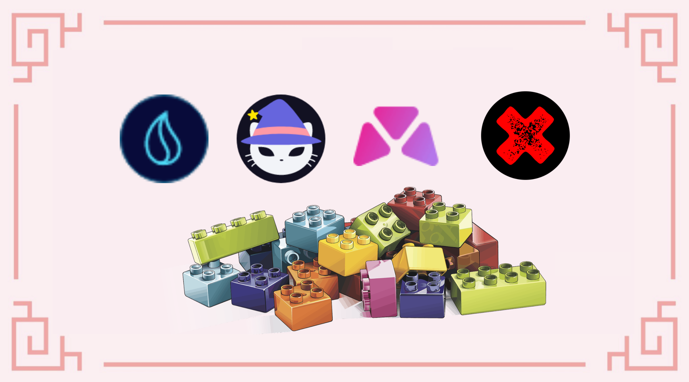
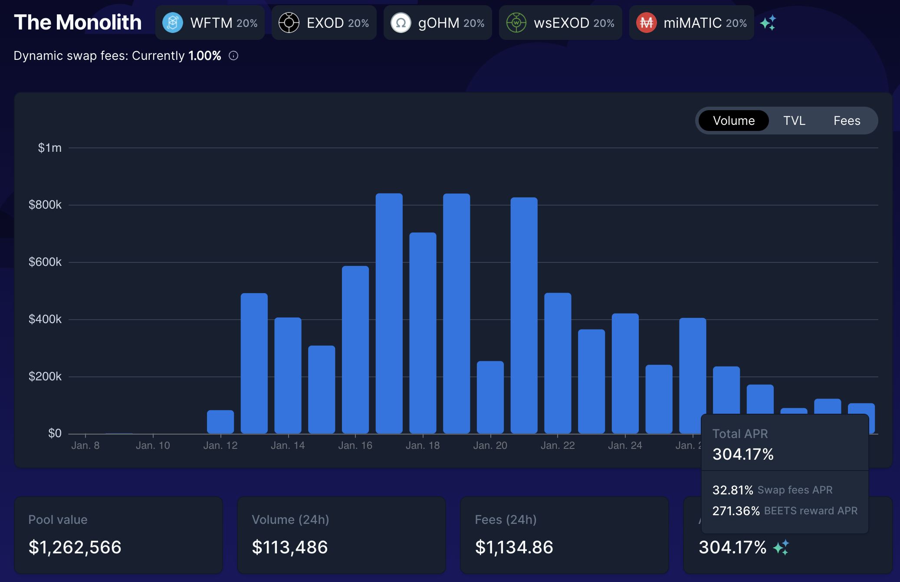
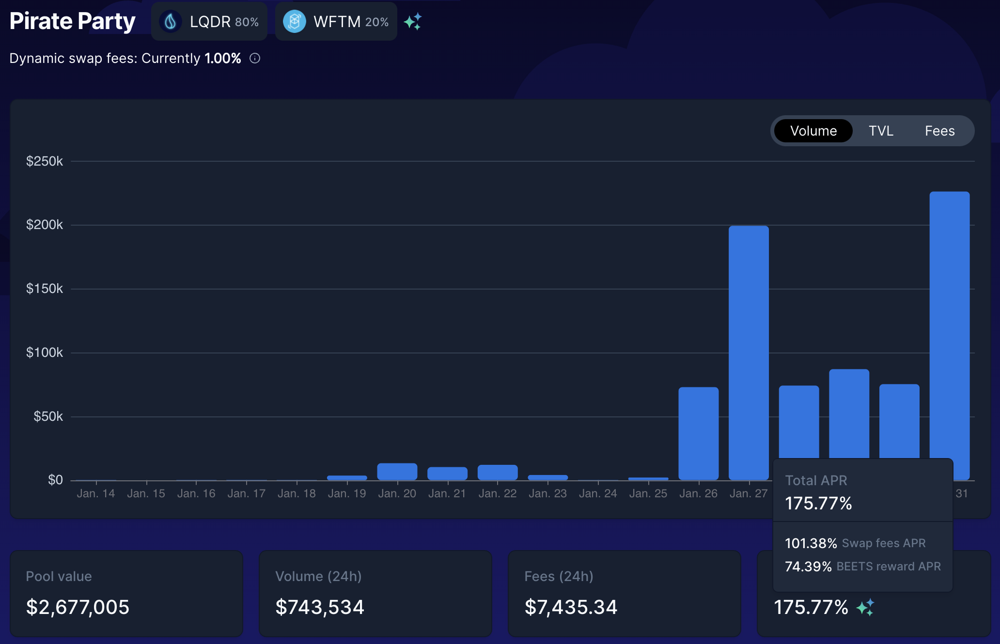
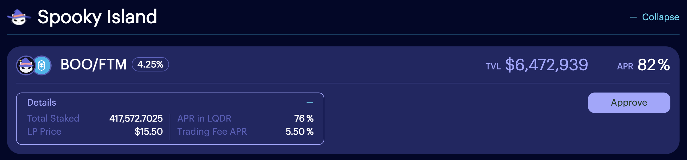
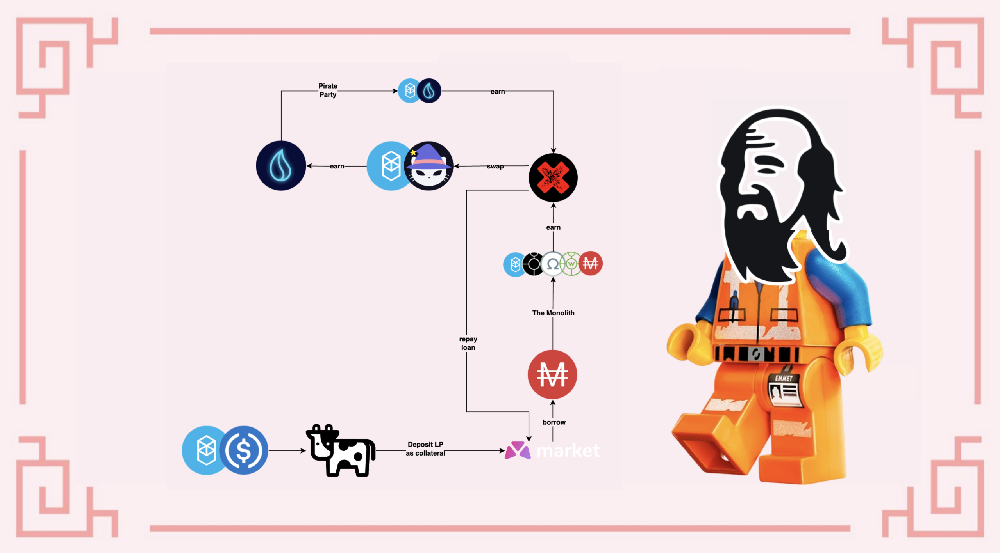

# Una sinfonía espeluznante

## Introducción

Tomar un préstamo contra tus activos es siempre un arma de doble filo: puede ayudarte a poner en marcha una estrategia de inversión, o a apalancar tus activos, pero tendrás una deuda que deberás devolver en algún momento. En esta guía, utilizaremos un préstamo tomado en Market.XYZ, un protocolo de préstamo en el que podrá pedir prestado MAI con una tasa de interés baja, y utilizaremos este préstamo para cultivar la mayoría de los protocolos probados en Fantom. Utilizaremos la estrategia de devolución del préstamo y veremos lo rápido que se puede hacer para desbloquear los activos depositados como garantía


Esta guía no es en absoluto un consejo financiero, sino que se ha realizado con un objetivo educativo. Es necesario prestar atención a las variaciones de precios, la oferta y la demanda, los programas de recompensas, las fechas de finalización, las pérdidas impermanentes, etc ... El objetivo no es proponer recetas que se puedan seguir a ciegas, así que por favor haga sus deberes y su propia simulación, y sólo invierta lo que esté dispuesto a perder posiblemente.


## Protocolos de Fantom, ¿por qué elegir?

En esta estrategia, utilizaremos un montón de diferentes pares LP (Liquidity Providing) en un montón de diferentes protocolos, por lo que pensamos que sería una buena idea dar un breve resumen de lo que hace cada protocolo.

### Market.XYZ

[Market.XYZ](https://fantom.market.xyz) es un protocolo de préstamo que construye varias "taquillas" para sus usuarios. Podrás depositar tokens individuales o tokens de LP como garantía, y pedir prestados otros activos contra tus depósitos. Debido a que usted está pidiendo prestado contra una garantía, es importante asegurarse de que no se liquide. Una liquidación se produce cuando el valor del activo que has depositado como garantía es inferior al valor del préstamo que has contratado. Por eso es importante asegurarse de que la relación entre los dos valores se mantiene relativamente alta, y que tu garantía no pierde demasiado valor cuando el mercado baja. Con el fin de mitigar el riesgo de liquidación, vamos a utilizar el token FTM-USDC LP como garantía:

* La pérdida impermanente en este par es relativamente baja USDC es una moneda estable vinculada al dólar estadounidense
* FTM es el token de gas nativo de Fantom, tiene una gran liquidez y se utiliza en todas partes&#x20;
* Las tasas de recompensa en el par FTM-USDC son altas, lo que significa que incluso si el precio de FTM se mantiene igual, el valor de su colateral subirá

Podrá pedir un préstamo contra el par FTM-USDC del [Spooky LP pool](https://fantom.market.xyz/pool/10) en market.xyz. Los pasos para depositar su garantía son los siguientes:

* Crear [tokens LP FTM-USDC en SpookySwap](https://spookyswap.finance/add/FTM/0x04068DA6C83AFCFA0e13ba15A6696662335D5B75) proporcionando liquidez en una proporción 1:1 para ambos activos&#x20;
* Deposita el token FTM-USDC LP en Beefy finance para obtener un recibo mooBooFTM-USDC (busca la plataforma SpookySwap y el activo USDC en los filtros de búsqueda)
* &#x20;Depositar el token de recibo mooBooFTM-USDC en Market.xyz

Cuando sus fichas de recibos de LP de Beefy están en Market.XYZ, sigue obteniendo el APY de recompensa proporcionado por Beefy. Esto significa que sus activos todavía están generando rendimientos para usted mientras usted pide prestado contra ellos. Esta es una herramienta muy poderosa, especialmente cuando ves que el mSPLP-FTM-USDC (moo Spookyswap FTM-USDC = mooBooFTM-USDC) está ganando un 51,4% APY y puedes pedir prestado MAI al 2,56% APR. En otras palabras, su colateral crece más rápido que su deuda, por lo que, en teoría, puede pagar perfectamente su préstamo con los intereses de su colateral.


Como nota al margen, puedes ver que la "taquilla" de Spooky LP Pool también ofrece la posibilidad de pedir préstamos contra otros tokens de LP: ETH-FMT, DAI-FTM, BTC-FTM y fUSDT-FTM. Dependiendo de los activos que tengas en tu cartera, tus convicciones y tu tolerancia al riesgo, puedes utilizar totalmente cualquier LP de Spookyswap como garantía.


Para este tutorial, también limitaremos el riesgo pidiendo un préstamo con un CDR (ratio de garantía a deuda) del 200%. Esto significa que tomaremos prestado el 50% del valor de nuestra colateral. Más información en la sección de que explica la estrategia de farming. Los ratios de liquidación se expresan como LTV (Loan to Value), que es lo contrario de un CDR. Puedes ver que el LTV para el token mooBooFTM-USDC es del 60%, por encima del cual serás liquidado. Esto equivale a un CDR del 166,67%. Con un objetivo de 200% de CDR, estamos un 33% por encima del ratio de liquidación, lo que puede ser arriesgado o no, dependiendo de tu tolerancia al riesgo.


Market.XYZ sólo permite préstamos con un valor mínimo de 0,05 ETH (\~$170,00 en el momento de escribir este artículo). Asegúrate de depositar suficientes colateral si quieres pedir un préstamo en las diferentes taquillas.


### BeethovenX

[BeethovenX](https://beets.fi/#/) es un Exchange Descentralizado y Creador de Mercado Automatizado basado en Balancer, es decir, es un fork de éste. Podrás depositar tus activos en pools de liquidez, así como intercambiar diferentes activos en su aplicación. Han sido socios del protocolo QiDAO, proporcionando tokens LP para las granjas que puedes encontrar en Mai Finance. Utilizaremos dos pools diferentes en BeethovenX para esta estrategia

* El Monolito: un pool incentivado que ha estado abierto para Exodia, un fork de Ohm que [hemos presentado en este tutorial](investing-in-discounted-assets-using-bonds.md). Podrá depositar sus tokens MAI directamente en este fondo común y obtener rendimientos
* Pirate Party: un pool incentivado dedicado a los tokens LQDR, el token nativo de Liquid Driver, otro gran protocolo que utilizaremos en esta guía

Como siempre, la mayor ventaja de utilizar BeethovenX (o Balancer) es que puedes depositar activos individuales en los pools en lugar de tener que proporcionar tokens en una proporción equilibrada.

### SpookySwap

[Spookyswap](https://spookyswap.finance) es el mayor fork de Uniswap V2 en Fantom, una plataforma en la que podrá intercambiar activos y proporcionar liquidez para muchos pares. Spookyswap también ha sido un socio de Mai Finance y propone un pool MAI-USDC. La asociación se ha extendido a través de Market.XYZ, donde podrá tomar prestados MAI contra algunos pares específicos de LP (véase la sección sobre Market.xyz), así como sus tokens BOO y staked BOO, el token nativo de Spookswap. Para esta guía, vamos a utilizar dos diferentes tokens LP de SpookySwap:&#x20;

* FTM-USDC que se utilizará como nuestro punto de partida para la estrategia. Este token LP se utiliza como garantía en market.xyz&#x20;
* FTM-BOO porque es uno de los pool de SpookySwap aceptados en Liquid Driver con el mayor APY. Intercambiaremos las recompensas BEETS de Monolith por este par (más en la sección de estrategia de farming)

### Liquid Driver

[Liquid Driver](https://www.liquiddriver.finance) es un optimizador de rendimientos en el que podrás depositar tokens LP de diferentes granjas y ganar rendimientos con ellos. El optimizador de rendimiento funciona cosechando los tokens de recompensa de la plataforma de destino y componiéndolos para ti. Esto es útil ya que el gas en Fantom puede ser caro. Se extrae una tasa de rendimiento, pero una parte de los ingresos del protocolo se redistribuye a los stakers de LQDR. LQDR es el token nativo de Liquid Driver. Para esta estrategia, utilizaremos el par LP FTM-BOO porque es un pool con una de las mayores TAE en LQDR para Spookyswap..

## Estrategia de Farmeo

Para esta estrategia, utilizaremos Market.XYZ como punto de partida para tomar prestados MAI contra tokens mooBooFTM-USDC LP. Los MAI prestados se depositarán en BeethovenX en el pool The Monolith. Dado que este es el pool con la mayor tasa de recompensa en nuestra estrategia, lo utilizaremos como motor para pagar nuestra deuda: El 50% de los BEETS se venderá para pagar la deuda en Market.xyz, y el 50% se convertirá en tokens FTM-BOO LP. Los tokens FTM-BOO se depositarán en LiquidDriver para recoger tokens LQDR que luego se apostarán en el pool de la Fiesta Pirata en BeethovenX. Una vez que la deuda esté totalmente pagada, las recompensas BEETS se convertirán totalmente en tokens FTM-BOO. Las recompensas BEETS proporcionadas por el pool del Partido Pirata también se convertirán en más FTM-BOO.&#x20;

Para esta simulación, utilizaremos los siguientes números:&#x20;

* Comenzamos con un valor de 1.000$ de tokens mooBooFTM-USDC
* El APR del token mooBooFTM-USDC proporcionado por SpookySwap a través de Beefy es del 41,5%.&#x20;
* La tasa de préstamo de MAI es del 2,56%.&#x20;
* BeethovenX da un APR del 304,17% para The Monolith, y del 175,77% para el Pirate Party&#x20;
* LiquidDriver da un 82% de APR en el par LP FTM-BOO&#x20;

Como es habitual en nuestras simulaciones, partimos de la base de que todos los precios son los mismos durante todo el periodo de 1 año, los tipos son los mismos y también utilizamos los APR proporcionadas tal cual. En realidad, los precios y los tipos varían, y los APR se componen de comisiones de negociación y fichas de recompensa, lo que puede afectar al resultado final. También es importante señalar que en esta simulación no se tienen en cuenta las comisiones por transacción. Por último, estamos utilizando muchos protocolos, y cada uno de ellos puede presentar riesgos de contratos inteligentes. Asegúrate de hacer tus propias investigaciones antes de usar una plataforma, y sólo invierte lo que estés dispuesto a perder.

Puedes encontrar nuestra simulación de esta estrategia en la siguiente [SpreadSheet](https://docs.google.com/spreadsheets/d/19s6kBnT5w0b9GKuTkDiiD1u\_ZoeNUZtI9XYxEmk\_WM0/edit?usp=sharing). Siéntase libre de copiarlo y jugar con él para ver cómo funciona el bucle, y cómo las diferentes tasas pueden afectar a su APY final.

### Día 1

En el día 1, necesita crear su colateral para Market.xyz. Consigue una porción igual de FTM y USDC y proporciona liquidez en SpookySwap para crear tokens FTM-USDC LP. Estos tokens se depositarán en Beefy, lo que te permitirá obtener el token de recepción mooBooFTM-USDC. Este es el token que se utilizará como colateral en Market.xyz y contra el que se prestará MAI. Como queremos mantener un CDR del 200%, tomaremos prestados 500 dólares de MAI. Por último, los tokens MAI se pondrán en juego en BeethovenX en el pool de The Monolith.&#x20;

Al final del primer día, tendrás;

| Posición          | Valor ($) |
| ----------------- | --------- |
| mooBooFTM-USDC    | 1,000.000 |
| the monolith      | 500.000   |
| pirate party      | 0.000     |
| Recompensas BEETS | 4.167     |
| FTM-BOO           | 0.000     |
| Recompensas LQDR  | 0.000     |
| Deuda de MAI      | 500.000   |

### Día 2

El día 2, tendrá que:

* vender el 50% de tus BEETS por MAI para devolver una pequeña fracción de tu préstamo
* intercambiar tus recompensas BEETS por un par LP FTM-BOO. Usted puede intercambiar en BeethovenX y crear el par LP en SpookySwap, o hacer todo en SpookySwap.&#x20;
* Poner los LPs FTM-BOO en Liquid Driver para empezar a recoger tokens LQDR.&#x20;

Al final del segundo día, tendrás:

| Posicion           | Valor($)  |
| ------------------ | --------- |
| mooBooFTM-USDC     | 1,001.137 |
| the monolith       | 500.000   |
| pirate party       | 0.000     |
| Recompensas BEETS  | 4.167     |
| FTM-BOO            | 2.083     |
| Recompensas LQDR   | 0.005     |
| Deuda MAI          | 497.952   |

### Día 3

Repite la operación del Día 2, y luego recoge tus primeros tokens LQDR. Éstos se depositarán en BeethovenX en la reserva de Pirate Party para obtener recompensas extra de BEETS, y al final del Día 3 tendrás

| Posicion              | Valor ($) |
| --------------------- | --------- |
| mooBooFTM-USDC        | 1,002.275 |
| the monolith          | 500.000   |
| pirate party          | 0.005     |
| Recompensas en BEETS  | 4.167     |
| FTM-BOO               | 4.167     |
| Recompensas en LQDR   | 0.000     |
| Deuda MAI             | 495.903   |


Las ganancias del grupo del Pirate Party son demasiado pequeñas para ser significativas en este momento, pero las obtendrás con el tiempo.


### Rutina Diaria

En este momento el sistema está totalmente preparado. Su rutina diaria consistirá en:

* cosechar recompensas de BEETS en the Monolith&#x20;
* cosechar recompensas BEETS del Pirate Party
* cambiar el 50% de las BEETS por MAI si todavía tienes una deuda pendiente
* pagar una parte de tu deuda si todavía tienes alguna&#x20;
* cambiar el resto de BEETS por tokens L FTM-BOO&#x20;
* depositar los FTM-BOO en LiquidDriver
* cosechar LQDR depositar en el Pirate Party&#x20;

Esta estrategia no es muy eficiente en términos de gas, por lo que puede considerar la posibilidad de componer sus ganancias sólo una vez a la semana, o incluso con menos frecuencia.

### Resultados mensuales aproximados

Aquí están los resultados brutos mes a mes, tal y como se pueden obtener en la hoja de cálculo de Google enlazada anteriormente.

| Día | FTM-USDC  | The Monolith | Pirate Party | FTM-BOO   | Deuda en MAI  |
| --- | --------- | ------------ | ------------ | --------- | ------------- |
| 30  | 1,033.503 | 500.000      | 1.901        | 60.500    | 440.541       |
| 60  | 1,069.343 | 500.000      | 8.031        | 123.652   | 378.905       |
| 90  | 1,106.425 | 500.000      | 18.452       | 187.988   | 317.139       |
| 120 | 1,144.794 | 500.000      | 33.265       | 254.136   | 255.242       |
| 150 | 1,184.493 | 500.000      | 52.612       | 322.738   | 193.216       |
| 180 | 1,225.569 | 500.000      | 76.681       | 394.462   | 131.058       |
| 210 | 1,268.069 | 500.000      | 105.704      | 470.006   | 68.770        |
| 240 | 1,312.043 | 500.000      | 139.963      | 550.105   | 6.351         |
| 270 | 1,357.542 | 500.000      | 181.427      | 691.752   | 0.000         |
| 300 | 1,404.619 | 500.000      | 233.046      | 846.443   | 0.000         |
| 330 | 1,453.328 | 500.000      | 295.350      | 1,009.331 | 0.000         |
| 360 | 1,503.726 | 500.000      | 368.942      | 1,182.000 | 0.000         |

### Día 365

Al final de un año completo que cultiva este sistema, usted tendría:

* 1.512,294 dólares en tokens FTM-USDC en Market.xyz
* 500.000 dólares en MAI en el fondo the Monolith
* 382.353 dólares en LQDR almacenados en el pool del Pirate Party
* 1.211.845 dólares en tokens FTM-BOO en Market.xyz
* Una deuda final que se devuelve completamente después del día #243&#x20;

Esto equivale a un APY total de 260,65%..

### Efecto del reembolso de la deuda en el resultado global

En la mayoría de nuestras guías, no pagamos ninguna deuda como parte de la estrategia. Esto se debe, en la mayoría de los casos, a que estamos utilizando un préstamo al 0% de interés tomado en Mai Finance. En este caso, tomamos un préstamo en Market.XYZ con un tipo de interés del 2,56% y pagamos la deuda con el 50% de los BEETS cosechados en the Monolith.&#x20;

Si asigna más del 50% al pago de la deuda, pagará menos intereses, pero hará crecer sus posiciones mucho más lentamente en Liquid Driver. Si asigna menos del 50% al pago de la deuda, obtendrá más recompensas de las otras plataformas, pero también pagará más intereses en Market.xyz.&#x20;

Aquí hay una pequeña tabla que indica el efecto de los BEETS asignados a su reembolso de la deuda en su APY general:

| BEETS % | APY Global | Deuda repagada en  |
| ------- | ---------- | ------------------ |
| 100     | 242.85     | 122 días           |
| 90      | 245.06     | 135 días           |
| 80      | 247.75     | 152 días           |
| 70      | 251.05     | 174 días           |
| 60      | 255.23     | 203 días           |
| 50      | 260.65     | 244 días           |
| 40      | 267.92     | 305 días           |
| 33.5    | 274.09     | 364 días           |

Si utilizas menos del 33,5% de tus recompensas BEETS para reembolsar tu deuda, todavía tendrás algo de MAI para reembolsar después de un año completo.&#x20;

También es importante entender que si reembolsas más rápido, también aumentas tu CDR de manera más significativa, lo que te permite alejarte del ratio de liquidación más rápido.

## Variaciones a considerar

La estrategia presenta muchas variaciones que presentan diferentes beneficios.

### Mai Finance VS Market.xyz

Puedes pedir prestado en [Mai Finance](https://app.mai.finance) al 0% de interés. Por ejemplo, si utilizas mooScreamFTM en lugar de mooBooFTM-USDC como colateral, tendrás las siguientes ventajas:

* No tienes pérdidas impermanentes en tu garantía&#x20;
* Pides un préstamo al 0% con una única comisión de reembolso del 0,5%, que será, en la mayoría de los casos, mucho más baja que los intereses que pagarás en Market.xyz (si hay MAI para pedir préstamos para esta bóveda)&#x20;
* Puedes obtener recompensas Qi por pedir préstamos en la plataforma, lo que te permitirá participar en la gobernanza del protocolo, así como obtener dividendos si stakeas tus tokens Qi. Esto aumentará tus ganancias anuales&#x20;
* Estarás protegido de una tasa de préstamo muy fluctuante en Market.xyz.&#x20;
* Mai Finance prestará nuevos MAI regularmente para mantener las tasas de préstamo lo más bajas posible, pero no es una garantía de que no suban. Puede comprobar las métricas del mercado de préstamos [aquí](https://metrics.market.xyz/d/HChNahwGk/fuse-pool-details?orgId=1\&refresh=10s\&var-poolID=10\&var-chain=250).

Sin embargo, los tokens mooScreamFTM obtienen un APY mucho más bajo en comparación con los tokens mooBooFTM-USDC, por lo que es posible que te pierdas esa oportunidad

### Hacer staking de tus LQDR

Si apuesta su LQDR en lugar de utilizarlo en el fondo común del Pirate Party, ganará algunos dividendos de Liquid Driver que se pagan en diferentes activos (LQDR, WFTM, LINSPIRIT, BOO, SPELL y BEETS). También obtendrás xLQDR que te permitirá participar en la gobernanza de Liquid Driver, y posiblemente LINSPIRIT para votar en la asignación de recompensas en Spirit Swap. Véase la página de [xLQDR](https://www.liquiddriver.finance/xlqdr) para obtener más detalles

### Hacer staking de tus BEETS

Los BEETS del the Monolith juegan un papel importante en esta estrategia, puedes utilizar los del Pirate Party de la siguiente manera&#x20;

* depositar los BEETS en el pool de Fidelio Duetto (BEETS-FTM)
* stakee el tokens LP en BeethovenX para recibir fBEETS&#x20;
* stakee los fBEETS para obtener los dividendos del protocolo&#x20;

Esto también te permitirá votar sobre las mejoras del protocolo de BeethovenX, así como sobre la asignación de recompensas para los diferentes pools de la plataforma. Esto es especialmente útil para mantener una APR alta en the Monolith

### Usar el pool FTM-BEETS en Spookyswap

En nuestra estrategia, estamos vendiendo todas las recompensas BEETS de the Monolith. Sin embargo, también podrías integrar el conjunto FTM-BEETS de Spookyswap en tu bucle. Tendrías que vender el 50% de tus BEETS por FTM y combinar los dos tokens en un nuevo par de LP que te hará ganar BOO. A continuación, puede decidir crear el FTM-BOO y depositar en Liquid Driver, o puede stakear su BOO en SpookySwap. Ten en cuenta que si stakeas tu BOO, tendrás la posibilidad de depositar los tokens de recibo xBOO y ganar tokens LQDR directamente, e incluso puedes usar los tokens xBOO como garantía en Market.xyz. Esta pieza de lego adicional abre muchas posibilidades.


No pierdas de vista este par en particular por si está disponible en Liquid Driver. Puede ser una mejor opción que el FMT-BOO.


### Usar tu FTM-USDC en Liquid Driver

Cuando el préstamo esté completamente pagado, puedes mantener los tokens mooBooFTM-USDC en Market.xyz o en Beefy, y seguirán acumulando recompensas. Sin embargo, también puedes retirar el par LP de Beefy y depositarlo en Liquid Driver para obtener más LQDR.&#x20;

Como nota al margen, mientras estás reembolsando tu préstamo, el valor de tu relación entre la garantía y la deuda crece (la garantía está acumulando recompensas y crece en valor mientras la deuda se reduce después de cada reembolso parcial). Esto significa que puedes retirar la garantía pieza a pieza para mantener un CDR seguro, y depositarla en Liquid Driver para obtener más tokens LQDR.

### Haga una pequeña toma de beneficios

Este sistema es un circuito cerrado que se alimenta a sí mismo. Sin embargo, puedes perfectamente seguir vendiendo partes de tus BEETS por otros activos una vez que hayas terminado de pagar tu préstamo en Market.xyz. Por ejemplo, podrías convertir tus recompensas de BEETS en USDC u otro estable, o aumentar una de tus posiciones que gane más recompensas que las concedidas para el par FTM-USDC.

## Descargo de Responsabilidad

Esta guía fue diseñada principalmente para mostrar la forma en que se puede pagar una deuda utilizando los rendimientos del farming. La velocidad a la que pagues tu deuda influirá mucho en la tasa de recompensa global, pero también presenta algunos aspectos muy positivos, siendo el principal la disminución del riesgo de liquidación.&#x20;

Por supuesto, es muy fácil reducir las partes que forman esta estrategia, cambiar piezas del bucle por otras, sustituir protocolos por otros que prefieras, etc... Sin embargo, asegúrate de leer toda la documentación disponible para los protocolos que quieras utilizar, y asegúrate de entender todos los diferentes riesgos.


Esta guía no es en absoluto un consejo financiero, sino que se ha realizado con un objetivo educativo. Es necesario prestar atención a las variaciones de precios, la oferta y la demanda, los programas de recompensa, las fechas de finalización, las pérdidas impermanentes, etc ... El objetivo no era proponer recetas que se puedan seguir a ciegas, así que por favor haga sus deberes y su propia simulación, y sólo invierta lo que esté dispuesto a perder posiblemente.

