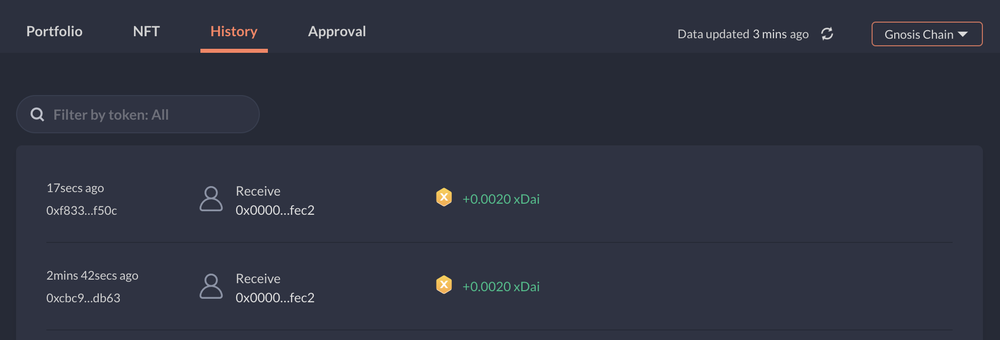
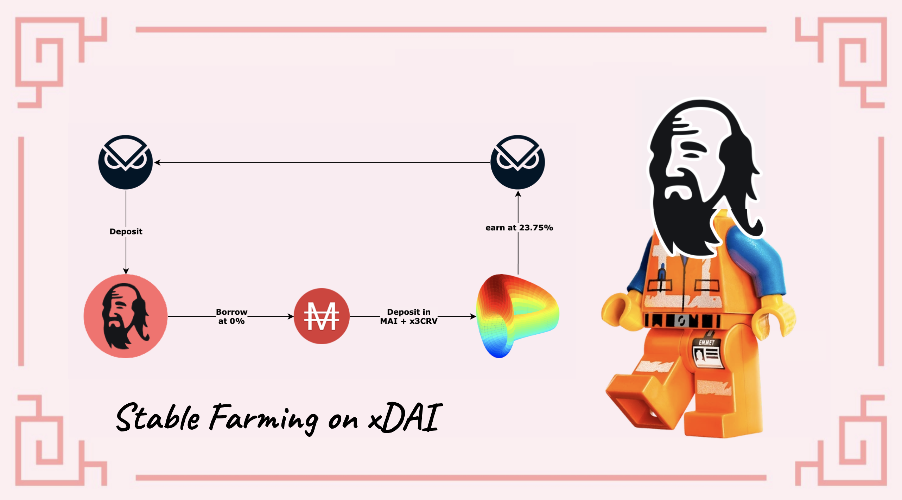

# Cómo comenzar en Gnosis Chain

## ¿Qué es la Gnosis Chain?

Gnosis Chain es una blockchain compatible con EVM, lo que significa que es compatible con el código desplegado en la red Ethereum (EVM = Ethereum Virtual Machine). Como la mayoría de las cadenas intentan alcanzar el equilibrio en la siguiente trifecta seguridad/escalabilidad/descentralización, Gnosis Chain se centra en la velocidad (5s de finalización de la transacción) y en los bajos costes de las transacciones. Utiliza xDAI (gnosis chain wrapped DAI) como su principal token de gas para las transacciones regulares, pero también utiliza el token GNO para la gobernanza y el staking. La cadena Gnosis ha sido diseñada originalmente para los mercados de predicción construidos en Ethereum. Los mercados de predicción son como bolsas en las que se negocian los resultados de los eventos. A medida que se desarrollan los acontecimientos, los tokens Gnosis ganan o pierden valor en función de lo que se predijo.&#x20;

Para apoyar el objetivo de la Cadena Gnosis, se ha añadido una capa de aplicación, en la que se encuentran aplicaciones descentralizadas especializadas como

* RealT: una aplicación inmobiliaria tokenizada
* Kleros: una plataforma de justicia como servicio que pretende resolver los conflictos mediante la tecnología blockchain

Puede consultar detalles adicionales sobre Gnosis Chain como su TVL y otras aplicaciones en [DeFi Llama](https://defillama.com/chain/Gnosis).

## Empezando en Gnosis Chain

Antes de utilizar la cadena Gnosis, necesitará una dirección de monedero. Debido a que Gnosis es una red EVM, aceptará los mismos monederos que en otras cadenas EVM, incluyendo monederos web como Metamask o Nifty, y podrás utilizar tu monedero hardware como Trezor o Ledger, pero puede que tengas que seguir pasos extra para poder conectar tu monedero frío a la red.&#x20;

Para este tutorial, nos ceñiremos a Metamask como para todas las demás guías de este sitio. Si no tienes Metamask instalado, puedes encontrar instrucciones en [How to get started on Polygon](../polygon/how-to-get-started-on-polygon.md).

### Añadiendo Gnosis Chain a Metamask

En teoría, Gnosis viene preinstalado con MetaMask, lo que significa que no deberías tener que añadir la información de la cadena para que Metamask funcione. Sin embargo, puede ser una buena idea verificar que tu configuración es correcta comprobando dos veces los valores guardados en tu monedero local. Abre la ventana emergente de Metamask, haz clic en el icono de tu monedero, vaya a`Configuración` luego elija `Redes` y busque `Gnosis Chain`. Los datos que deberian mostrar son los siguientes:

* **Nombre de la red:** Gnosis Chain
* &#x20;**RPC URL:** https://rpc.gnosischain.com/
* **Chain ID:** 100
* **Currency Symbol:** xDAI
* **Block Explorer URL:** https://blockscout.com/xdai/mainnet

Guarde los cambios, y Metamask le cambiará automáticamente a la cadena Gnosis:

## Enviando fondos a  Gnosis Chain

### Faucets

Puedes utilizar Google para encontrar unos cuantos faucets (páginas web que dan unos tokens gratis) en Gnosis Chain donde podrás solicitar tus primeros xDAI para empezar a realizar transacciones. No recomiendo nada en particular, pero encontré este [faucet comunitario](https://www.gimlu.com/faucet) que entrega 0.002 xDAI en cada solicitud. Tenga en cuenta que el número de solicitudes que puede hacer es limitado, y no es en absoluto una manera de hacer dinero gratis.

### Puentes

* [Multi Chain](https://app.multichain.org/#/router) es el socio oficial de Mai Finance si desea transferir su MAI a Gnosis Chain desde Polygon u otras redes. Cuando esté conectado a Polygon, sólo tiene que elegir la cadena de destino (Gnosis Chain) y el activo que desea enviar (MAI o miMATIC) con la cantidad correcta, y hacer clic en el botón Transferir. Presta atención a las tasas de transferencia que se toman directamente en el activo que estás transfiriendo.

* [Elknet](https://app.elk.finance/#/elknet) actuará tanto como bridge como faucets cuando transfieras el token ELK entre 2 redes. Podrás puentear tu ELK y en el extremo receptor, podrás tener una pequeña porción de tu ELK directamente disponible como el token de gas, xDAI en nuestro caso.

## DeFi en Gnosis

Gnosis propone algunas opciones DeFi en su cadena, incluyendo:

* [SushiSwap](https://app.sushi.com/farm?chainId=100): este es uno de los principales DEX y AMM en Gnosis/xDAI. Podrá intercambiar sus activos, o participar en la minería de liquidez proporcionando pares LP (Liquidity Providing) en granjas
* [Curve](https://xdai.curve.fi/): Aquí es donde se proporciona la mayor parte de la liquidez en la cadena Gnosis. Aquí es también donde podras utilizar la stablecoin MAI en el pool de [MAI](https://xdai.curve.fi/factory/4) y recibir recompensas en tokens GNO.

* [Honeyswap](https://app.honeyswap.org/#/pool), [Honeycomb](https://1hive.io/#/wallet) and [Agave](https://app.agave.finance/#/dashboard): Respectivamente un DEX (fork Uniswap) que permite intercambiar tokens y crear tokens de provisión de liquidez, un AMM (fork Goose) que permite stakear tus tokens LP creados en Honeyswap y obtener rendimientos por la provisión de liquidez, y un protocolo de préstamo (fork AAVE) que permite prestar ciertos activos y tomar prestados otros. Estas 3 dApps forman un ecosistema completo gestionado por el mismo equipo
* [Elk Finance](https://app.elk.finance/#/farms): Elk es un fork de Uniswap V2 que te permitirá realizar swaps, depositar liquidez y farmear su token ELK utilizando diferentes activos de la cadena Gnosis, incluyendo MAI. También podrá stakear sus tokens ELK para obtener más recompensas, o transferirlos de una cadena a otra utilizando el puente ElkNet..

## Mai Finance en Gnosis Chain

La plataforma de préstamos ya está disponible en Gnosis Chain, donde podrá poner sus tokens GNO en un vault y tomar prestados MAI contra ellos. Esto le permitirá utilizar sus tokens GNO como garantía, y utilizar su MAI en Curve para cultivar más tokens GNO. El bucle consistiría en

* Crea un vault en [Mai Finance](https://app.mai.finance)
* Deposite sus tokens $GNO en su respectivo vault
* Pide prestado MAI contra su garantía al 0% de interés&#x20;
* Deposite los MAI en Curve Finance y obtenga recompensas de GNO

## Descargo de Responsabilidad

Esta guía NO es un consejo financiero, y debe considerarse simplemente como una herramienta educativa. Haga siempre su propia investigación. La discusión de un proyecto en esta guía no debe considerarse como un respaldo al proyecto.


Tenga en cuenta que una estrategia que funciona bien en un momento dado puede dar malos resultados (o hacerle perder dinero) en otro momento. Manténgase informado, controle los mercados, vigile sus inversiones y, como siempre, investigue por su cuenta.

