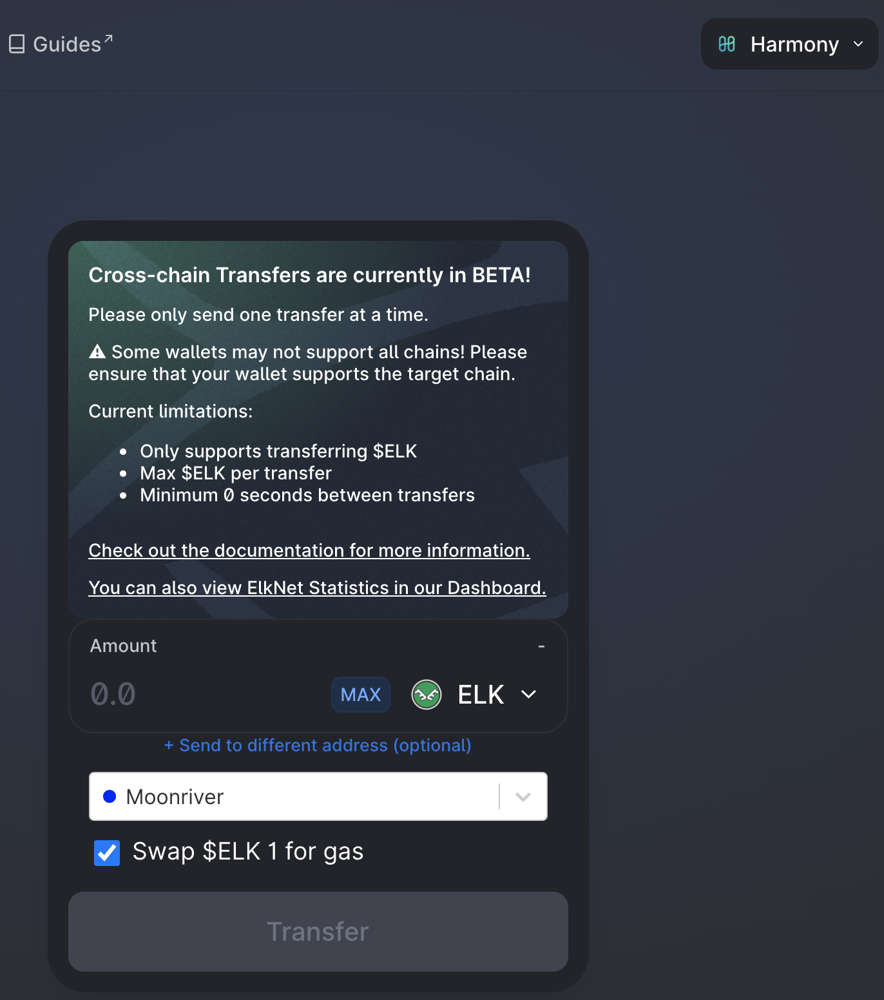

# Un Par LP, muchas formas de farmear

## Introducción

Proporcionar liquidez en un DEX (Decentralized EXchange) y cultivar recompensas es una de las formas más comunes de farmear rendimientos en DeFi (Finanzas descentralizadas). Sin embargo, muchos usuarios sólo prestan atención a las tasas de interés del pool de LP (Liquidity Providing) en el que entran, sin comprobar realmente si la tasa es un APR (Annual Percentage Reward) o un APY (Annual Percentage Yield). Hay muchas maneras de farmear un pool y gestionar los tokens de recompensa. Vamos a ver en esta guía algunas de las diferentes maneras en que puede farmear uno de los últimos pools en Harmony, MAI-ELK, y ver lo que puede hacer con los tokens ELK que obtendrá como recompensa.


Esta guía no es en absoluto un consejo financiero, sino que se ha realizado con un objetivo educativo. Es necesario prestar atención a las variaciones de precios, la oferta y la demanda, los programas de recompensas, las fechas de finalización, las pérdidas impermanentes, etc ... El objetivo no es ofrecer recetas que se puedan seguir a ciegas, así que por favor haga sus deberes y su propia simulación, y sólo invierta lo que esté dispuesto a perder.


## Elk Finance

[Elk Finance](https://app.elk.finance/#/) es un DEX basado en Uniswap. Encontrarás todas las características habituales de los proyectos basados en Uniswap: comerciar con tus activos, combinar tus diferentes criptomonedas en tokens LP, farmear algunos pares LP y stakear su token nativo, el ELK.

Sin embargo, lo que hace de Elk Finance un proyecto totalmente diferente es su presencia en muchas blockchains, y no sólo en las cadenas compatibles con EVM (Ethereum Virtual Machine). De hecho, Elk Finance está actualmente presente en 16 cadenas y tiene planes de expandirse a muchas otras. Han conseguido construir un puente entre todas esas cadenas para que los usuarios puedan transferir el token ELK.

Además, una característica genial que propone ElkNet es la posibilidad de intercambiar una parte del activo transferido por algún token de gas en el destino. Esto es especialmente útil si se va por primera vez a una cadena de bloques en la que no hay ningún grifo disponible.


A excepción de las cadenas en las que el gas es elevado (sólo Avalanche y Cronos en el momento de escribir este artículo), el uso de ElkNet para puentear sus tokens ELK de una cadena a otra se realiza sin coste alguno. Has leído bien, ¡no pagas ninguna tarifa de transferencia!


Por último, Elk Finance ofrece una protección contra las pérdidas permanentes. Puede leer todos los detalles sobre el programa de Pérdida Impermanente en [su documentación oficial,](https://docs.elk.finance/features/impermanent-loss-protection) pero básicamente, todo lo que necesita saber es que si el precio de ELK cambia entre el momento en que deposita y el momento en que retira, pagará ELK extra para cubrir la pérdida impermanente. Dado que el MAI está vinculado a 1 USD, la pérdida impermanente sólo está relacionada con el movimiento del precio del ELK, por lo que siempre sale ganando cuando entra en los pools de LP en Elk Finance DEX.

## Farmeando el token LP MAI-ELK

Elk Finance se asoció con Mai Finance en enero de 2022 para proponer el farmeo de tokens utilizando el par MAI-ELK LP en su DEX. El par MAI-ELK puede ser utilizado en 3 redes diferentes por ahora: Harmony, Moonriver y Gnosis. Es posible que más adelante se lancen otros pools en Polygon, Cronos y Fantom. Veamos las diferentes estrategias que puedes aplicar para este nuevo pool.


Proponemos esta guía para Harmony porque las tasas de gas son muy baratas, lo que le permite componer su recompensa manualmente sobre una base diaria. Esto hace que sea una blockchain muy buena para los principiantes que sólo tienen unos pocos dólares para invertir. Sin embargo, todo lo que se presenta en esta guía se puede aplicar también a cualquier otra cadena.


### Farmeando y haciendo Staking

La primera estrategia es bastante sencilla:&#x20;

* Combinar su par de LP deposite los LP en el pool MAI-ELK y obtenga un 200% de APR
* Recoja sus recompensas diariamente
* Stakealos al 32,53% de APR&#x20;

Si empiezas con 100$ iniciales, estos son los resultados que puedes obtener mes a mes durante un año completo de farmeo, asumiendo que las tasas indicadas anteriormente se mantienen durante todo el periodo de farmeo.

| Día | MAI-ELK ($) | ELK stakeado($) |
| --- | ----------- | --------------- |
| 30  | 100.000     | 16.653          |
| 60  | 100.000     | 33.756          |
| 90  | 100.000     | 51.323          |
| 120 | 100.000     | 69.366          |
| 150 | 100.000     | 87.897          |
| 180 | 100.000     | 106.930         |
| 210 | 100.000     | 126.479         |
| 240 | 100.000     | 146.557         |
| 270 | 100.000     | 167.180         |
| 300 | 100.000     | 188.360         |
| 330 | 100.000     | 210.115         |
| 360 | 100.000     | 232.458         |

Al final del año, tendrías:

* 100,00 dólares en tokens MAI-ELK LP en el pool&#x20;
* 236,24 dólares en tokens ELK stakeados&#x20;

Lo que corresponde a un APY global del 236,24%. No es exactamente el APR porque parte de la recompensa se compone (los ELK stakeados).


Puede encontrar todos los resultados y la fórmula utilizada para construir esta tabla en [este Google Sheet](https://docs.google.com/spreadsheets/d/1Vva5dhjYix0g4bMZRSAMIutDgbT08TsTLhVJE0TUrF8/edit?usp=sharing) en la primera pestaña. Puede copiar este archivo en su propia unidad y ajustar los tipos y la inversión inicial para ver cómo cambia el APY global con el número que introduzca.


### Farmeando y componiendo diariamente

Compounding significa que recoges tus recompensas y las utilizas para crear tokens de LP adicionales. En nuestro caso, usted haría:&#x20;

* Cosechar tus recompensas ELK&#x20;
* Vender el 50% por MAI&#x20;
* Combinar para formar el token LP MAI-ELK adicional
* Depositar en el pool&#x20;

Si empiezas con la misma inversión inicial de 100 dólares, los resultados que puedes esperar para un año completo de cultivo, asumiendo que las tasas dadas se mantienen durante todo el periodo de cultivo, son los siguientes:

| día | MAI-ELK ($) |
| --- | ----------- |
| 30  | 117.172     |
| 60  | 138.044     |
| 90  | 162.635     |
| 120 | 191.607     |
| 150 | 225.739     |
| 180 | 265.952     |
| 210 | 313.328     |
| 240 | 369.143     |
| 270 | 434.901     |
| 300 | 512.374     |
| 330 | 603.647     |
| 360 | 711.179     |

Y al final del año, tendrías 730,878 dólares en tokens MAI-ELK LP en el pool. Lo que corresponde, para una inversión inicial de 100 dólares, a un APY global del 630,88%. Como estamos componiendo la recompensa, este es el APY exacto que obtendrías con un APR del 200%. Como nota al margen, las fórmulas para calcular el APYs de un APR con capitalización diaria (o un APRs de un APY) son las siguientes:

$$
APY = ( 1 + \frac{APR}{N})^N-1
$$

$$
APR = N * (( 1 + APY)^\frac{1}{N} - 1)
$$

Siendo`N` el número de veces que se componen las recompensas. En nuestro caso, la fórmula 2 nos daría

$$
APY = ( 1 + \frac{2}{365})^{365}-1 = 634.88\%
$$

$$
APR = 365 * (( 1 + 6.3488)^\frac{1}{365} - 1) = 199.99\%
$$

Es fácil ver y comprender que si aplicas una APR del 200% (la APR del pool de LPs) a tu recompensa, obtendrás mejores rendimientos que si aplicas una APR del 32,53% (APR de staking). En este sentido, la capitalización es mucho mejor que el staking mientras la APRs de cultivo se mantenga por encima de la APR de staking. Obviamente, esto puede cambiar con la cantidad de liquidez en el pool.


Al igual que en el apartado anterior, la simulación se encuentra en el mismo [Google Sheet](https://docs.google.com/spreadsheets/d/1Vva5dhjYix0g4bMZRSAMIutDgbT08TsTLhVJE0TUrF8/edit?usp=sharing) pero en la segunda pestaña


### Farmeando y Componiendo usando Mai Finance

Si el staking y el compounding dan buenos rendimientos, ambos métodos están directamente ligados al precio del token ELK, por lo que el valor de su inversión variará con el precio del ELK. Ya hemos visto que el compounding da mejores opciones en comparación con el staking. Ahora veremos cómo puedes capturar algo de valor de tus recompensas de cultivo, y continuar invirtiendo en el mismo pool usando Mai Finance. La rutina diaria sería la siguiente:

* Recolectar las recompensas de ELK&#x20;
* Vender el 66% de la recompensa para comprar algun token aceptado como garantía en Mai Finance. Para nuestro ejemplo, utilizaremos el token ONE&#x20;
* Deposita los tokens ONE en tu bóveda en Mai Finance&#x20;
* Pida prestados MAI adicionales al 200% de CDR (relación entre la garantía y la deuda), cuyo valor corresponderá a sus tokens ELK restantes
* Combinar para formar tokens adicionales LP MAI-ELK
* Depositar en el pool


Convertir tus tokens de recompensa en ONE puede no ser la forma más segura de proteger tus activos, una de las mejores formas de hacerlo es convertirlos en monedas estables. Sin embargo, las opciones de Mai Finance en Harmony en el momento de escribir este artículo son bastante limitadas. Es posible que tengas mejores opciones en el futuro (después de enero de 2021), como hacer staking de tus tokens Stake DAO LP como garantía(vea [nuestro artículo en la red Polygon](../polygon/the-elephant-and-the-otter.md) para ver cómo puede utilizar los tokens Stake DAO en Mai Finance).


Si empiezas con la misma inversión inicial de 100 dólares, los resultados que puedes esperar para un año completo de farmeo, suponiendo que los tipos dados se mantienen durante todo el periodo de cultivo, y que tu cámara no se liquida, son los siguientes:

| Día | MAI-ELK ($) | ONE ($) | Deuda Mai ($) |
| --- | ----------- | ------- | ------------- |
| 30  | 111.154     | 11.560  | 5.780         |
| 60  | 124.003     | 24.456  | 12.228        |
| 90  | 138.337     | 38.842  | 19.421        |
| 120 | 154.328     | 54.892  | 27.446        |
| 150 | 172.168     | 72.797  | 36.398        |
| 180 | 192.070     | 92.772  | 46.386        |
| 210 | 214.273     | 115.055 | 57.528        |
| 240 | 239.042     | 139.915 | 69.958        |
| 270 | 266.674     | 167.648 | 83.824        |
| 300 | 297.501     | 198.588 | 99.294        |
| 330 | 331.891     | 233.106 | 116.552       |
| 360 | 370.257     | 271.609 | 135.805       |

Y al final del año, tendrías:

* 377,069 dólares en tokens LP MAI-ELK en el pool&#x20;
* 278,446 dólares en tokens en tu bóveda&#x20;
* 139,223 dólares de deuda de tu bóveda con un CDR del 200%, tal y como se esperaba&#x20;

Partiendo de una posición original de 100 dólares de MAI-ELK, esto representaría un APY global del 416,29%. Aquí estamos obteniendo un poco menos de ganancias en comparación con el compounding puro, sin embargo también hemos extraído una buena parte de nuestras ganancias en ONE, que puede ser menos volátil que ELK, por lo tanto puede presentar menos riesgo.


Una vez más, la simulación se puede encontrar en el mismo [Google SpreadSheet](https://docs.google.com/spreadsheets/d/1Vva5dhjYix0g4bMZRSAMIutDgbT08TsTLhVJE0TUrF8/edit?usp=sharing) en la tercera pestaña


Alternativamente, también puede vender todas sus recompensas ELK por tokens que se aceptan en Mai Finance, pedir prestado MAI y vender parte de él para comprar ELK adicionales con el fin de aumentar su posición en el pool de MAI-ELK. Al hacer esto, aumentas tu exposición a MAI, pero también aumentas tu deuda. Terminaría con 270,715 dólares de MAI-ELK, 352,913 dólares de ONE y 171,457 dólares de deuda para un APY global del 342,17%.

## Importancia de la frecuencia al componer recompensas

Tanto si decide stakear sus recompensas como si las compone, es importante entender que su recompensa cambiará en función de la frecuencia con la que realice su rutina de cosecha + inversión. Como recordatorio, la fórmula que relaciona el APY y el APR es la siguiente:

$$
APY = ( 1 + \frac{APR}{N})^N-1
$$

En esta ecuación, `N` representa el número de veces que compone sus recompensas en un año. Así, un APR del 200% como el anterior te daría los siguientes APY dependiendo de la frecuencia con la que compongas:

| Frecuencia de Compounding | APY equivalente |
| ------------------------- | --------------- |
| daily                     | 634.88 %        |
| twice in a week           | 625.01 %        |
| weekly                    | 611.71 %        |
| twice in a month          | 609.55 %        |
| monthly                   | 535.86 %        |
| quarterly                 | 406.25 %        |
| twice in a year           | 300.00 %        |

Componer manualmente más de una vez al día puede resultar caro según la cadena en la que te encuentres. Pero básicamente, está claro que cuanto más a menudo se componga, mejor será la recompensa. Esto también explica por qué los optimizadores de rendimiento / autocompensadores son populares. Ten en cuenta que al componer, añades presión de venta al token que cultivas, lo que tendrá un impacto negativo en el precio de ese token. Si ese es también el token que estás usando para cultivar (en nuestro ejemplo ELK), puedes ser impactado por pérdidas impermanentes, a menos que estés usando Elk Finance DEX, que te protege de las pérdidas impermanentes.

## Escogiendo el pool adecuado

El par MAI-ELK se ha desplegado en varias cadenas, por lo que es posible que usted despliegue su capital en la cadena que ofrezca las mejores tarifas.


Es posible que el pool de MAI-ELK también se despliegue en otras cadenas en un futuro próximo, posiblemente en Polygon, Cronos y Fantom. Esto no está garantizado y no hay una fecha límite para ello, así que mantente informado consultando los servidores Discord de ambos proyectos, o siguiéndolos en Twitter.


Además de la tasa de recompensa en cada cadena, también hay que tener en cuenta el precio del token ELK en cada cadena. De hecho, si el precio es casi el mismo en todas las cadenas, la pequeña diferencia también puede ser un factor para que elijas la cadena en la que quieres cultivar el token ELK.

Como puedes ver, el pool de MAI-ELK en Moonriver da una mejor tasa de recompensa, y el token ELK también tiene un precio más alto en esa cadena. Esto significa que, en el momento de escribir esto, puede ser mejor cultivar el pool de MAI-ELK en Moonriver que en Harmony o Gnosis, especialmente si planeas vender una parte de los tokens cultivados. Ten en cuenta que esto puede no ser cierto todo el tiempo, así que asegúrate de elegir bien tu cadena y de hacer tus propias investigaciones antes de unirte a un pool de LP. Además, es recomendable echarle un vistazo a su [documentacion sobre la protección contra IL](https://docs.elk.finance/features/impermanent-loss-protection) porque el seguro depende en gran medida del número de días que sus tokens LP estén depositados en el pool.&#x20;

Como nota al margen, dado que el puente de ELK es gratuito, puede pasar de una cadena a otra para beneficiarse siempre de las mejores tarifas. Asegúrese de entender que al hacerlo, también influirá en las tasas de recompensa del pool del que sale y al que se une (menos liquidez aumentará el APRs, más liquidez lo bajará).

## Descargo de Responsabilidad

Esta guía se ha redactado para ilustrar las diferentes formas de cultivar los rendimientos utilizando tokens que proporcionan liquidez. La estrategia que elijas influirá en gran medida en tus ganancias, así como en tu exposición al riesgo. Por supuesto, todas las nociones señaladas en este documento son también aplicables a cualquier par de LP, y es muy recomendable realizar sus propias simulaciones antes de elegir una estrategia, un par de LP, un pool o incluso un DEX.


Tenga en cuenta que una estrategia que funciona bien en un momento dado puede dar malos resultados (o hacerle perder dinero) en otro momento. Manténgase informado, controle los mercados, vigile sus inversiones y, como siempre, investigue por su cuenta.

