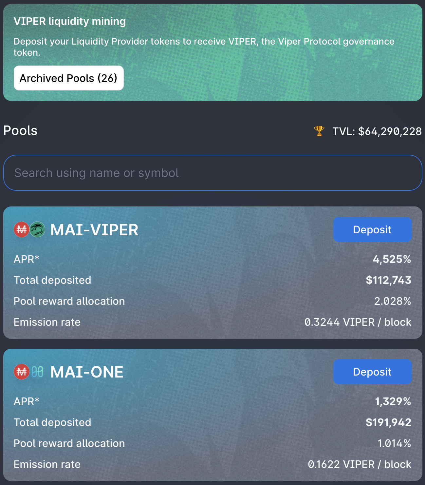
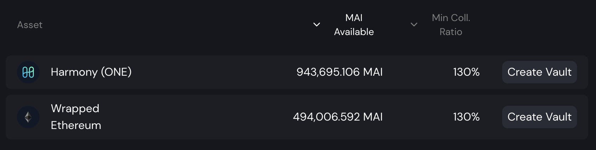

# Cómo comenzar en Harmony

## ¿Qué es Harmony?

Harmony es una cadena de bloques que intenta resolver los problemas a los que se enfrenta la Mainnet de Ethereum: conseguir un grado satisfactorio de equilibrio entre descentralización y escalabilidad. El enfoque principal de la cadena se hace en un alto rendimiento de las transacciones, la velocidad y la eficiencia energética. Esto se consigue aprovechando al máximo la fragmentación de los validadores que se agrupan para procesar las transacciones simultáneamente. La escalabilidad es tan simple como aumentar el número de fragmentos, lo que también ayuda a lograr una transacción más rápida. Siéntase libre de indagar más sobre Harmony y su tecnología en su[ documentación oficial](https://docs.harmony.one/home/general/technology).

## ¿Cómo utilizar Harmony?

Para utilizar la red Harmony, necesitarás una dirección de monedero. Dado que Harmony es una red compatible con **EVM** (Ethereum Virtual Machine), aceptará los mismos monederos que en otras cadenas compatibles con EVM, incluyendo monederos web como Metamask o Nifty, y podrás utilizar tu monedero hardware como Trezor o Ledger. Para este tutorial, nos ceñiremos a Metamask como para todas las demás guías de este sitio. Si no tienes Metamask instalado, puedes encontrar instrucciones en [Cómo comenzar en Polygon.](https://guide.qidao.community/v/espanol/tutoriales-de-polygon/how-to-get-started-on-polygon)

### Añadiendo Harmony a Metamask

Si ha instalado la última versión de Metamask, ya debería tener acceso a la cadena Harmony y no tiene que hacer nada más que seleccionar `Harmony One` en el menú desplegable de la red en la parte superior de Metamask. También puede establecer usted mismo una nueva RPC para acceder a Harmony siguiendo estos pasos. Abra la ventana emergente de Metamask, haga clic en el icono de su monedero, navegue hasta `Configuración` , entonces elija `Redes` y busque `Harmony One`. La información que debería obtener es la siguiente:

* **Nombre de la Red:** Harmony One
* **URL del RPC:** https://api.harmony.one
* **ID de la Cadena:** 1666600000
* **Simbolo del token:** ONE
* **URL del explorador de bloques:** https://explorer.harmony.one/

Guarde los cambios y Metamask le cambiará automáticamente a la red Harmony:

## Transfiriendo fondos a Harmony One

### Faucets

No hay ninguna pagina oficial para conseguir tus primeros tokens ONE gratis para tus primeras transacciones. En la mayoría de los casos, tendrá que hacer un puente con algunos tokens de otra cadena utilizando el sistema oficial del [bridge de Harmony](https://bridge.harmony.one/erc20) que te permitirán puentear algunos activos específicos desde Ehtereum Mainnet o Binance a Harmony. También puede obtener una lista de proyectos que le permitirán obtener algún ONE a través de Fiat Gateways o Exchanges desde [esta list](https://docs.harmony.one/home/developers/harmony-stack#bridges-fiat-gateways-exchanges)a creada por el equipo de Harmony.

Además, puedes usar [ElkNet](https://app.elk.finance/#/elknet) para transferir algunos tokens ELK de otras cadenas a Harmony. Si lo hace, asegúrese de marcar la casilla `Swap $ELK 1 for gas` que intercambiará una parte de sus tokens transferidos a ONE, lo que también le permitirá intercambiar el resto de sus tokens ELK por más ONE, u otros activos.

### Puentes

* [Multichain.org](https://app.multichain.org/#/router) (antes conocido como AnySwap) es el socio oficial de Mai Finance que te permitirá pasar tus tokens MAI de Polygon y otras cadenas a Harmony. Como nota al margen, Multichain ha estado trabajando mano a mano con los desarrolladores de Mai Finance para asegurarse de que el MAI que puenteas a Harmony es el mismo que podrás pedir prestado en la plataforma de préstamos. No hay necesidad de un Hub en Harmony. Simplemente dirígete al router Multichain, selecciona la red de origen, el token que quieres transferir y la red de destino, y ya está. Presta atención a las cantidades mínimas a transferir, las tasas de transferencia y la duración del puente, pero una vez hecho, obtendrás tu activo en Harmony.

* [Puente oficial de Harmony](https://bridge.harmony.one/erc20), como se explica en el párrafo anterior, le permitirá transferir activos específicos de Ethereum Mainnet o BSC.
* [RelayChain](https://app.relaychain.com/#/cross-chain-bridge-transfer) es otra solución si quiere transferir algo a Harmony. Consulta su aplicación para ver qué activos son puenteables.
* [ElkNet](https://app.elk.finance/#/elknet) es un caso particular, ya que el puente de Elk Finance le permitirá puentear el token ELK de cualquier cadena compatible con EVM a cualquier otra cadena compatible con EVM en la que estén desplegados con la posibilidad de intercambiar una pequeña parte de la cantidad transferida en token de gas (véase la sección dedicada a los grifos justo arriba).

## DeFi en Harmony

Debido a que Harmony One es una red que ofrece transacciones rápidas y seguras, así como gas muy barato, se han desplegado en esta red muchas DApps (aplicaciones descentralizadas) compatibles con EVM. La lista que sigue no las presenta todas, siéntase libre de explorar la red y su lista de DApps usted mismo. Puedes encontrar más [en esta lista hecha por DefiLlama](https://defillama.com/chain/Harmony).

* [ViperSwap](https://viper.exchange/#/swap): Este es el primer socio de Mai Finance en Harmony One. Se trata de un fork de Uniswap v2, un DEX (Exchange Descentralizada) y AMM (Creador de Mercado Automatizado) donde podrás intercambiar tus activos, crear tokens LP (Proveedor de Liquidez) y cultivar recompensas proporcionando liquidez a los usuarios de la plataforma. La recompensa se paga mediante el token VIPER, con el que podrás hacer staking en la aplicación para obtener más recompensas. Este es el DEX donde encontrarás liquidez de MAI para intercambiar tu MAI, o para cultivar recompensas usando tu MAI.

Observarás que los APRs (Annual Percentage Rate) de los pools son muy altos. Esto se debe principalmente al formato de las recompensas en ViperSwap: cuando reclamas tus recompensas, el 5% de los tokens VIPER pueden ser utilizados directamente, mientras que el 95% están bloqueados hasta el 2021-12-25. Después de eso, la recompensa se va acumulando a lo largo de un año completo, lo que significa que no podrás acceder a tus ganancias de cultivo de inmediato, y se te iran desbloqueando muy MUY lentamente. Hay otra curiosidad en los fondos de ViperSwap: tendrás que pagar una tasa de retirada que disminuye si apuestas tus tokens de LP durante mucho tiempo. Pasa de una comisión del 25% si retiras dentro del mismo bloque que la transacción de depósito (para luchar contra las operaciones de flashloan) al 0,01% si retiras después de 1 mes. Más detalles en su documentación oficial sobre [recompensas de farming](https://docs.venomdao.org/viper/tokenomics#bbd0) y [comision de retiros de LPs](https://docs.venomdao.org/viper/fees).

* [DeFi Kingdom](https://game.defikingdoms.com/#/): Se trata de un proyecto especialmente interesante que mezcla DeFi y Gamificación. Su token nativo, el token JEWEL, se utiliza como recompensa de cultivo para los usuarios que aportan liquidez, pero se puede utilizar en el juego o en el mercado. Explicar todo el universo de DeFi Kingdom (o DFK) llevaría demasiado tiempo para esta guía, por lo que recomendamos encarecidamente leer [su documentación official](https://docs.defikingdoms.com).

* [SushiSwap](https://app.sushi.com) es el famoso DEX/AMM que también está presente en muchas otras cadenas. Intercambio, proporciona liquidez, farmea ONE y genera rendimientos SUSHI.
* [Curve Finance](https://harmony.curve.fi) es otra aplicación de cadena cruzada que le permitirá proporcionar liquidez (3pool y tricrypto) y le recompensará con tokens compuestos, así como con ONE y CRV.
* [Beefy Finance](https://app.beefy.finance/#/harmony) es un optimizador de rendimiento que ya presentamos en muchos de nuestros artículos ya que está presente en muchas cadenas. Actualmente, podrás depositar tus tokens LP de Curve y SushiSwap, y dejar que el compounder Beefy agregue las recompensas proporcionadas por la plataforma de cultivo en más tokens LP.
* [Euphoria DAO](https://app.euphoria.money/#/dashboard) es actualmente el mayor fork de Ohm en Harmony, y desarrollado por Venom DAO también detrás de ViperSwap. Puedes depositar algunos activos diferentes y obtener su activo nativo, el token WAGMI. Puede hacer staking de WAGMIs para obtener más WAGMI con un APY (rendimiento porcentual anual) bastante alto como en la mayoría de los proyectos OHM.

## Mai Finance en Harmony

Mai Finance se lanzó en Harmony One en diciembre de 2021, y esta guía está bastante cerca de la fecha de lanzamiento, por lo que es posible que la aplicación se haya actualizado cuando la leas.

Podrás depositar tus WETH o tus tokens ONE en Mai Finance (https://app.mai.finance/vaults/create) para tomar prestada la moneda estable MAI. A continuación, podrás intercambiar MAI para apalancar tus activos, realizar operaciones de margen o cultivar rendimientos en ViperSwap.

## Descargo de Responsabilidad

Como siempre, esta guía no es un consejo financiero, y debe considerarse simplemente como una herramienta educativa. Haga siempre su propia investigación. La mención de un proyecto en esta guía no debe considerarse como una aprobación del mismo.


Tenga en cuenta que una estrategia que funciona bien en un momento dado puede dar malos resultados (o hacerle perder dinero) en otro momento. Manténgase informado, controle los mercados, vigile sus inversiones y, como siempre, investigue por su cuenta.

