# De CeFi a DeFi conCelsius

## Introducción

[Celsius Network](https://celsius.network) es uno de los grandes actores de CeFi (Finanzas Centralizadas) donde la gente puede comprar fácilmente criptoactivos con su cuenta bancaria y stakear los tokens comprados para obtener recompensas adicionales. Como ejemplo, puedes ganar un 6,20% APY en tu BTC (Bitcoin), un 5,35% en tu ETH (Ether), etc... Además de mantener sus activos y obtener ganancias semanales que se componen, también puede pedir prestados activos adicionales contra el que ya posee (que luego se utilizan como garantía) para apalancar su posición o intercambiar por otros tokens. Sin embargo, Celsius es una red cerrada, y es por ello que a menudo se le denomina aplicación CeFi (Finanzas Centralizadas).&#x20;

Si tienes activos en Celsius, todavía puedes enviarlos a otras aplicaciones en la blockchain nativa de los tokens. Por ejemplo, puedes transferir ETH dentro y fuera de Celsius usando tu cartera de Ethereum, o BTC usando tu dirección en la cadena de Bitcoin. Además de esto, Celsius lanzó en febrero un nuevo puente llamado CelsiusX que permite enviar algunos activos específicos desde la aplicación Celsius a Polygon. Los tokens actuales que son compatibles son ETH, el token nativo de la red principal de Ethereum ADA, el token nativo de Cardano DOGE, el token nativo de Dogecoin blockchain Al enviar tus activos en Polygon, también obtienes un acceso completo al ecosistema DeFi, así como opciones de puente adicionales para mover tus tokens a Fantom, Avalanche y muchas otras cadenas. Esta guía le guiará a través de los diferentes pasos para llevar sus activos de Celsius a Polygon, y le presentará algunas cosas que puede hacer allí.


Esta guía no es en absoluto un consejo financiero, sino que se ha realizado con un objetivo educativo. Es necesario prestar atención a las variaciones de precios, la oferta y la demanda, los programas de recompensas, las fechas de finalización, las pérdidas impermanentes, etc ... El objetivo no era proponer recetas que se puedan seguir a ciegas, así que por favor haga sus deberes y su propia simulación, y sólo invierta lo que esté dispuesto a perder posiblemente.


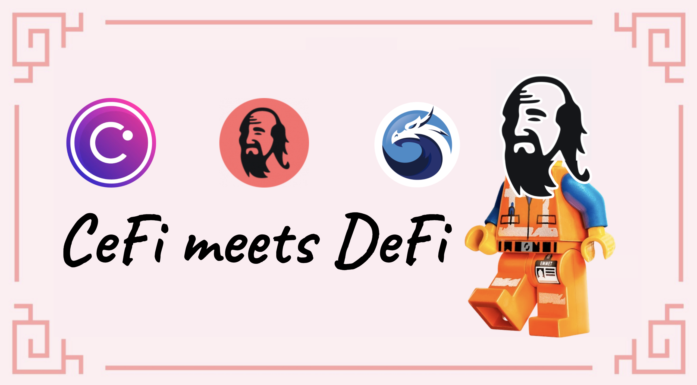

## Obteniendo activos con Celsius

### ¿Cómo crear una cuenta?

Por supuesto, para poder utilizar Celsius, necesitarás una cuenta Celsius. Simplemente dirígete a su página web y registra una nueva cuenta [usando este link](https://celsius.onelink.me/EyfO/5321754e). Tenga en cuenta que por razones legales, y debido a la naturaleza del modelo de negocio de Celsius, deberá proporcionar pruebas de su identidad, también conocidas como documentos KYC (Know Your Customer), como por ejemplo un permiso de conducir. Además, tenga en cuenta que la aplicación Celsius puede no estar disponible en su país. Puede visitar sus [Terminos de Uso](https://celsius.network/terms-of-use) y [Política de Privacidad](https://celsius.network/privacy-policy) para obtener más detalles


Tenga en cuenta que esta guía, Mai Finance o la comunidad QiDAO no son responsables de los servicios prestados por Celsius, y se recomienda encarecidamente hacer su propia investigación antes de registrarse en un producto financiero.


Una vez creada su cuenta, no dude en dar una vuelta rápida por la aplicación web, y también puede descargar la aplicación móvil

### Obteniendo activos en tu cuenta

La aplicación móvil es, por ahora, la única forma de comprar activos directamente con una tarjeta de crédito o una transferencia bancaria. Esta opción también puede estar restringida a ciertos países/regiones. Debido a estas restricciones, no cubriremos esta opción, pero siéntase libre de explorar esta opción si es algo que está dispuesto a hacer.

Para esta guía, nos centraremos en ETH, y también asumiremos que ya tienes algo de Ether en la Mainnet de Ethereum que quieres puentear a Celsius. Desde la aplicación web, simplemente vaya a la sección `Receive` .

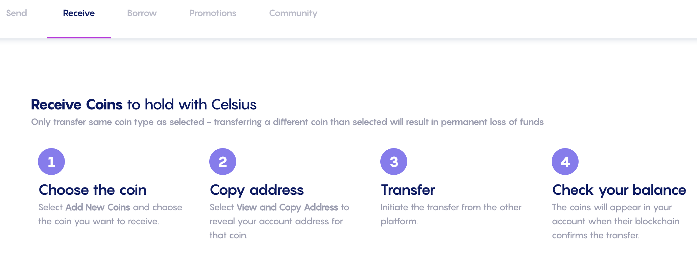

El primer paso es añadir la moneda que quieres recibir. En nuestro caso, queremos recibir ETH, y es tan fácil como hacer clic en `Add New Coins` y seleccionar ETH en el menú desplegable.

Una vez seleccionado, tendrá la posibilidad de obtener la dirección del monedero que corresponde a su cuenta Celsius en la red Ethereum.

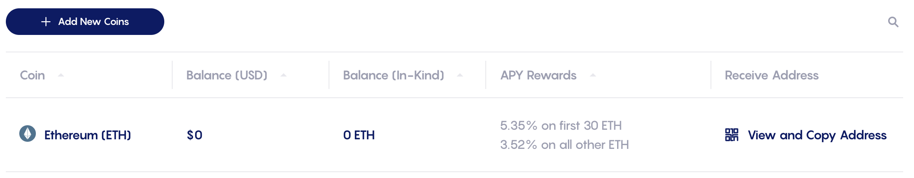

Si haces click en `View and Copy address`, se abrirá una nueva ventana emergente con un código QR que representa la dirección de tu monedero en la red Celsius, así como su valor en texto plano que puedes simplemente copiar y pegar.

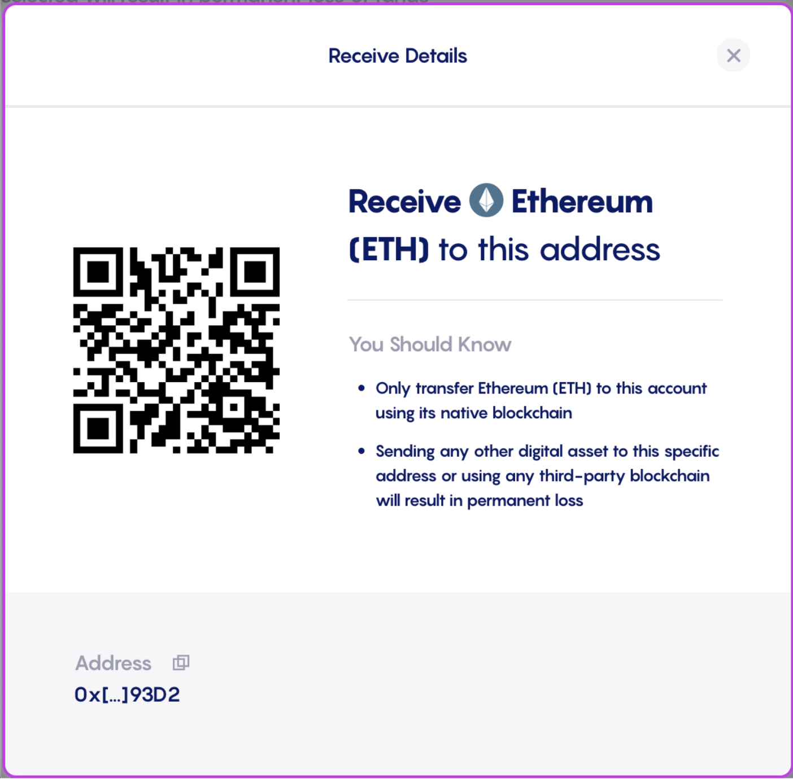

Con la dirección del monedero, inicias una transferencia desde donde tienes tus tokens Ether. El ejemplo siguiente está tomado de Coinbase (otro gran actor del sector CeFi):

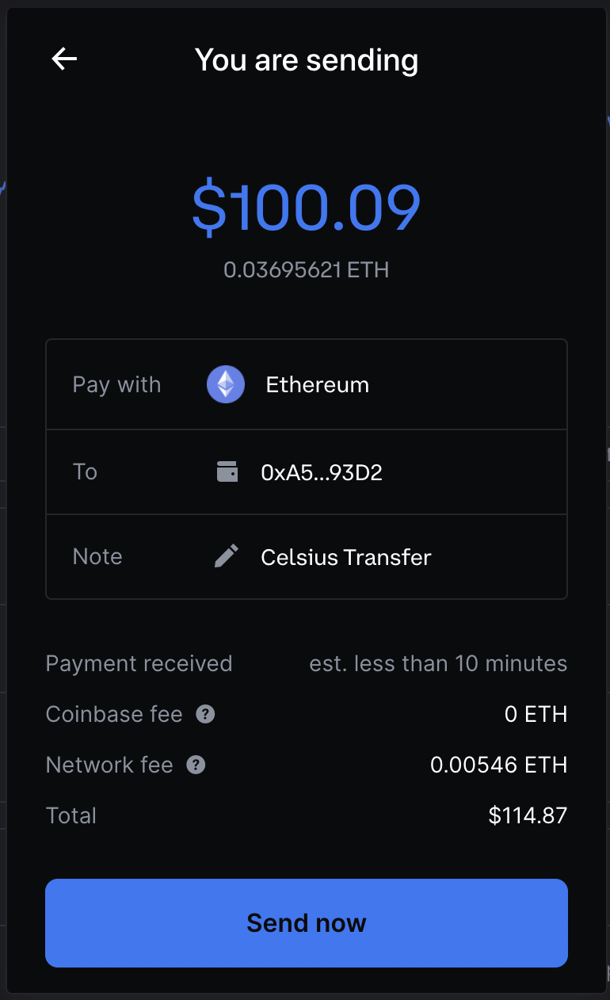

Por supuesto, y como siempre con Ethereum Mainnet, tendrás que pagar algunas tasas de transacción. Esto no está en absoluto relacionado con Coinbase o Celsius. Como puedes ver a continuación, una transferencia directa desde mi monedero MetaMask también me obligaría a pagar algunas comisiones.

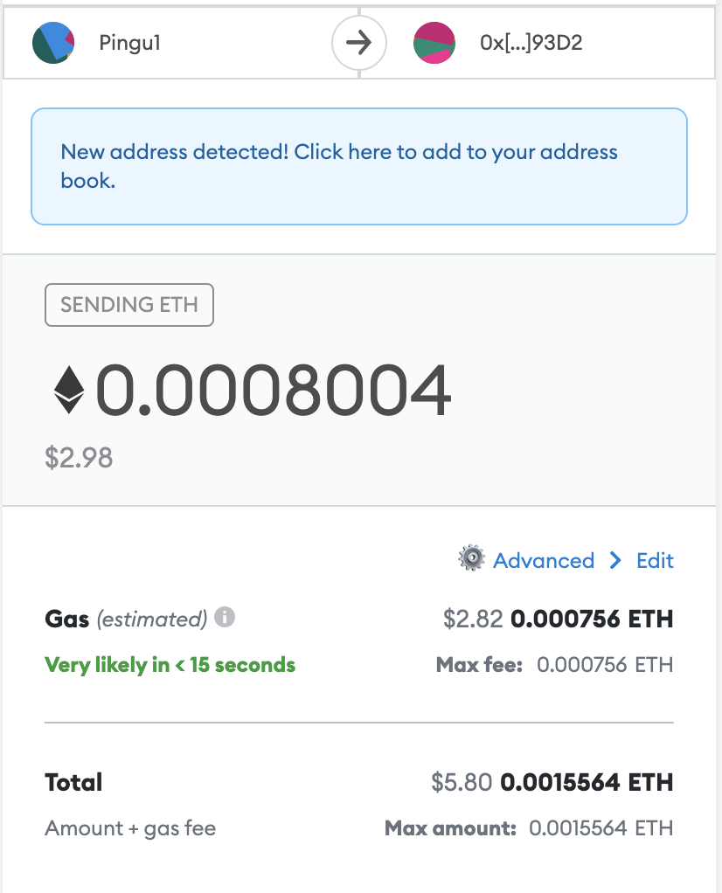


Dependiendo de la congestión de la red, las tarifas pueden ser bastante elevadas. Asegúrate de comprobar el precio del gas para beneficiarte de las tarifas más bajas posibles.


Una vez completada la transferencia, deberías poder ver tus activos en tu panel de control de Celsius:

En este momento, si mantengo las monedas en mi cuenta en Celsius, recibiré recompensas de staking cada semana. Para ETH, y a partir de marzo de 2022, el APY es del 5,35%. Sin embargo, ahora tendremos la posibilidad de trasladar los activos a Polygon utilizando el puente CelsiusX de forma gratuita. Simplemente dirígete a la pestaña Enviar y selecciona el activo que quieres transferir a Polygon.


Nota: si aún no tiene ninguna dirección de destinatario guardada, es el momento de crear una. Elija la dirección de su monedero en Metamask y añádala como dirección de retirada. Por razones de seguridad, cuando crea una dirección de retiro o la cambia, esta dirección se bloquea durante 24 horas. Como verás en la captura de pantalla de abajo, 24 horas después de haber transferido 100 dólares de ETH a Celsius, mi saldo ya ha cambiado de precio.


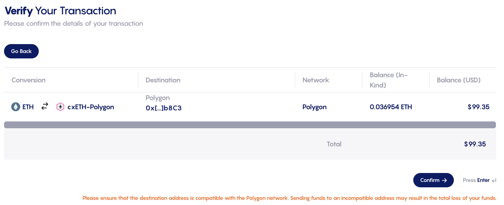

También puedes notar en esta captura de pantalla que recibiré cxETH en Polygon, que es una versión envuelta de ETH. Lo mismo ocurriría con ADA (recibirás cxADA) y DOGE (recibirás cxDOGE). Veremos más adelante en esta guía qué hacer con tus cxTokens.


Tenga en cuenta que esta transferencia no tiene ningún coste. También es muy rápida.


Una vez enviada, recibirás un correo electrónico en el que se te pedirá que confirmes la transferencia (siempre con más seguridad) y podrás ver el historial de transacciones que reflejan esta transferencia en la app Celsius.

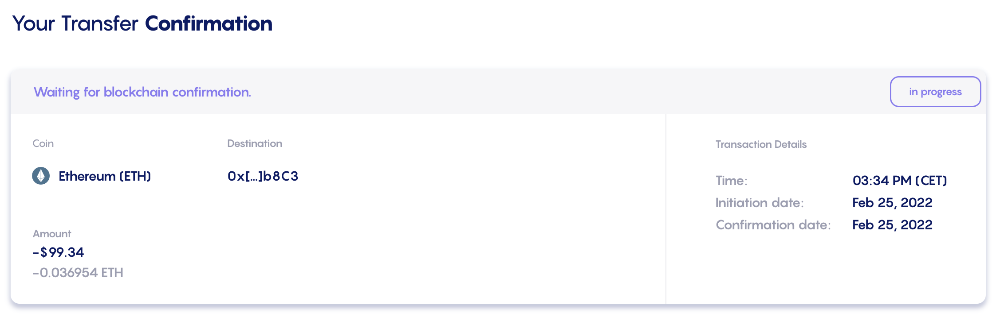

Después de unos minutos, tendrá sus activos (cxTokens) disponibles en su cartera en Polygon. La mejor manera de llevar la cuenta de estas transferencias es probablemente utilizar [una aplicación como DeBank](https://debank.com) y echar un vistazo a su historial de transacciones en la cadena deseada (aquí Polygon):

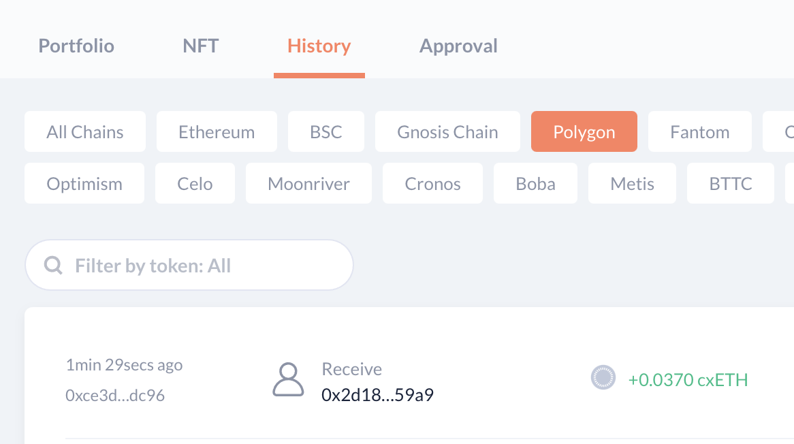

## Polygon ycxTokens

### Qué son los cxTokens

Sin entrar en demasiados detalles, los cxTokens son tokens envueltos. Cuando transfieres tus activos de la Red Celsius a Polygon, los activos se mantienen bloqueados en la Red Celsius y los nuevos tokens se mintean en Polygon. Sin embargo, para el caso de Ether, Celsius no tiene la posibilidad de mintear WETH en Polygon directamente, por lo que crean un token cuyo precio está indexado al precio de ETH: cxETH.

Lo contrario también es cierto, lo que significa que cuando transfieres tu cxETH a Celsius, el cxToken se quema y una cantidad correspondiente de ETH se libera en Celsius y se añade a tu cuenta.&#x20;

Para asegurarse de que el precio del cxToken está correctamente indexado en el precio del activo subyacente, Celsius está utilizando una tecnología de Chainlink: la Prueba de Reserva. Si tienes curiosidad por conocer los detalles de cómo Celsius gestiona sus cxTokens, puedes leer todos los detalles en su[ articulo de Medium hecho en Enero 2022](https://medium.com/@CelsiusX/celsius-is-integrating-chainlink-proof-of-reserve-to-unlock-cross-chain-liquidity-with-wrapped-6c85bb2f2a60).

### Intercambiando tus cxTokens

Debido a que sus cxTokens son versiones envueltas de los activos subyacentes, es posible que no encuentre muchas aplicaciones que los acepten tal cual. Por suerte, puede cambiarlos por otros activos utilizando [QuickSwap](https://quickswap.exchange/#/swap), el único DEX con liquidez para los cxTokens en Polygon a partir de marzo de 2022.

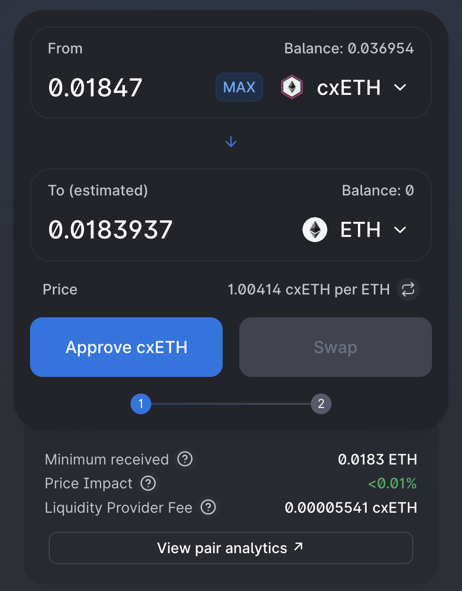

Obviamente, también se puede realizar la operación inversa y comprar cxTokens utilizando otros activos.


Cuando estés intercambiando dentro o fuera de cxTokens, presta atención a la ruta tomada, así como al deslizamiento. QuickSwap parece que sólo utiliza 4 saltos como máximo, y para acceder a cxDOGE como ejemplo, siempre hay que pasar por ETH, cxETH, y luego cxDOGE.&#x20;

Esto significa que necesitas tener suficiente liquidez entre el activo que intercambias y ETH para que la ruta pueda ser ACTIVO > ETH > cxETH > cxDOGE. Ese no es actualmente el caso de MAI como ejemplo. Puedes querer hacer MAI > USDC > ETH > cxETH en un primer intercambio, y cxETH > cxDOGE en un segundo intercambio. Lo mismo ocurre cuando quieres salir de tus cxTokens: cxDOGE a MAI puede sufrir un alto slippage, y probablemente querrás pasar por cxETH o ETH primero.


## Proporcionando liquidez con tus cxTokens

Con tus cxTokens, puedes proporcionar liquidez a los pools de CelsiusX en QuickSwap. En el párrafo anterior se explica cómo intercambiar tus cxTokens, y esto se hace utilizando pools LP (Liquidity Poviding pools). Para asegurar que cualquier usuario pueda intercambiar sus tokens, QuickSwap dará recompensas pagadas en dQUICK y MATIC a los usuarios que guarden su liquidez en su aplicación. Los 3 pares que obtendrán recompensas son

* ETH/cxETH
* cxETH/cxADA
* cxETH/cxDOGE

Todos tienen diferentes niveles de recompensas, y lo mejor es ir a la aplicación QuickSwap y comprobar sus programas de minería dual.

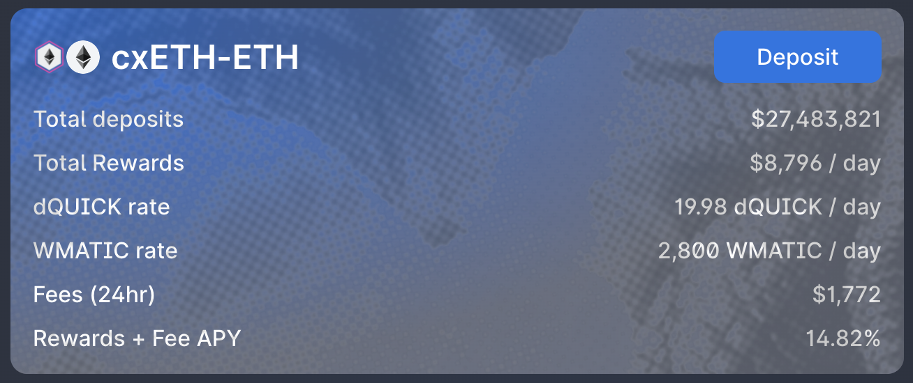

En la captura de pantalla de arriba, puedes ver que si proporcionas liquidez para el par ETH-cxETH, puedes obtener hasta un 15% de APY (rendimiento porcentual anual, que asume que vas a componer las recompensas) pagado en dQUICK, WMATIC, y directamente en ETH y cxETH de las tarifas de intercambio. Si no compones las recompensas, aún así obtendrás un 13,97% de APR, y podrás hacer lo que quieras con los tokens de recompensa. No dudes en explorar esta guía para obtener ideas adicionales sobre cómo utilizarlos.


Para participar en un pool de liquidez, vaya a [provide liquidity](https://quickswap.exchange/#/add/0x7ceB23fD6bC0adD59E62ac25578270cFf1b9f619/0xfe4546feFe124F30788c4Cc1BB9AA6907A7987F9) para el par elegido en una proporción de 1:1. Esto puede significar que tendrá que cambiar algunos cxTokens por otra cosa. Una vez creado el par LP, puedes depositarlo en el pool, y empezar a acumular rendimientos.


## Usa tus cxTokens como colateral y obtenga un préstamo

Intercambiar tus cxTokens significa que los estás vendiendo para comprar otra cosa. [Mai Finance](https://app.mai.finance) es una aplicación DeFi (Decentaralized Finance) que te permitirá mantener tus activos encerrados en una cámara acorazada y pedir un préstamo de monedas estables contra ellos. Luego podrás hacer lo que quieras con tu préstamo, incluyendo

* Farmeo de stablecoins
* Intercambiar la stablecoin MAI prestada para comprar otros activos
* Apalancar tus cxTokens
* puentear su MAI con otras cadenas

Sólo tienes que explorar las diferentes páginas de esta guía para recoger ideas sobre cómo utilizar tu préstamo de la manera que más te convenga.&#x20;

**Nota**: cuando pides prestada la moneda estable MAI en Mai Finance, se te paga con tokens Qi en función de la cantidad que pidas prestada. Las tasas de recompensa varían en función de la cantidad total prestada para esa bóveda, el precio de Qi, y la asignación de Qi para la bóveda. Más detalles en nuestra [guía en recompensas de las bóvedas](../../mai-university/mai-loans-and-vaults-incentives.md).

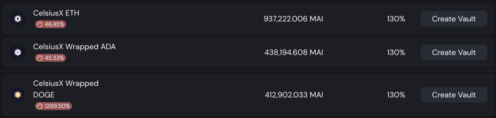

Y, por supuesto, puedes combinar ambas soluciones cambiando tu préstamo MAI por un par LP de cxTokens y farmear los rendimientos en QuickSwap. En este punto, no hay límite a lo que puedes hacer, y tu inversión inicial está totalmente preservada en tu bóveda en Mai Finance (mientras no te liquiden).

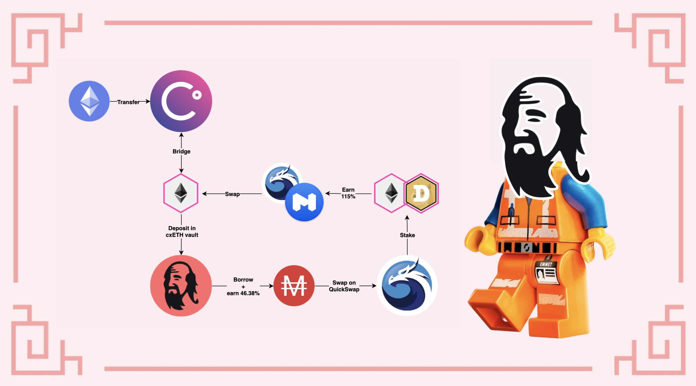

## Descargo de Responsabilidad

Esta guía ha sido escrita para presentarle cómo puede beneficiarse de CelsiusX, el puente entre la Red Celsius y Polygon, y experimentar con todo lo que DeFi puede ofrecer en Polygon. Por supuesto, el uso de protocolos en Polygon presenta riesgos. Si está utilizando cxTokens como garantía en Mai Finance, tendrá que prestar atención a las liquidaciones en caso de que el precio de su posición de garantía vaya por debajo del ratio de liquidación, un umbral que indica que su préstamo puede tener un valor mayor que los activos que lo respaldan. Estos riesgos se presentan en varios tutoriales en este sitio, por lo que, una vez más, se le recomienda encarecidamente que lea algunos de ellos y se asegure de entender cómo funcionan los diferentes protocolos presentados en esta guía antes de invertir nada. Y como siempre, esto no es un consejo financiero, siempre haga su propia investigación.


Tenga en cuenta que una estrategia que funciona bien en un momento dado puede dar malos resultados (o hacerle perder dinero) en otro momento. Manténgase informado, controle los mercados, vigile sus inversiones y, como siempre, investigue por su cuenta.

