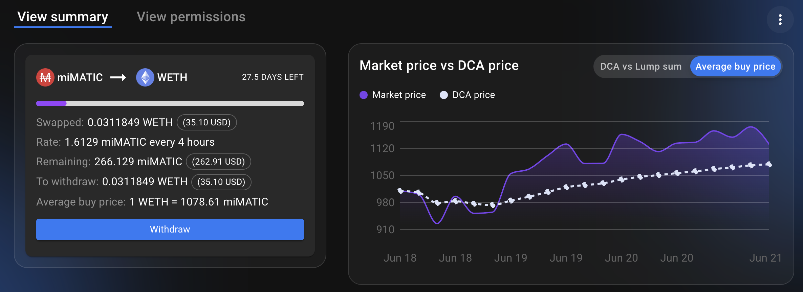

# DCA en mercados alcistas y bajistas

## Introducción

"El tiempo en el mercado es mucho mejor que la sincronización del mercado" es algo que seguramente ya ha escuchado. En realidad, nadie puede vender perfectamente en la cima, ni comprar en la cima. Por ello, la mayoría de los inversores recurren al DCA (Dollar Cost Average) para acumular el activo que más desean. El DCA consiste en comprar una pequeña cantidad con una frecuencia determinada, independientemente del precio. Al hacerlo, se reduce el precio medio de compra y se tienen más posibilidades de comprar más de un determinado activo en comparación con una única compra realizada en el momento equivocado.

Puede encontrar más detalles sobre qué es el Dollar-Cost Averaging en la pagina web de [investopedia](https://www.investopedia.com/terms/d/dollarcostaveraging.asp), la cual define el DCA como:

> El promediado de costes en dólares (DCA) es una estrategia de inversión en la que un inversor divide el importe total que va a invertir en compras periódicas de un activo objetivo en un esfuerzo por reducir el impacto de la volatilidad en la compra total. Las compras se realizan independientemente del precio del activo y a intervalos regulares

En este artículo se explica cómo se puede DCA correctamente en sus activos favoritos para completar sus bóvedas en Mai Finance, pero también se puede DCA en el MAI stablecoin con el fin de obtener un mejor precio de venta promedio.


Tenga en cuenta que una estrategia que funciona bien en un momento dado puede dar malos resultados (o hacerle perder dinero) en otro momento. Manténgase informado, controle los mercados, vigile sus inversiones y, como siempre, investigue por su cuenta.


## Entendiendo el Dollar Cost Averaging

Veamos cómo puede DCA en diferentes condiciones de mercado, y lo que significa en términos de poder de compra/venta.

### DCA en mercados bajistas

Cuando el mercado está ya bastante bajo y (con suerte) cerca del fondo, o al menos a un nivel de precios en el que te sientas cómodo comprando, ese es el momento de acumular tus activos favoritos y comprar tokens. Porque ya sabes, quieres comprar cuando el precio está bajo, y vender cuando está alto. Como ejemplo, aquí hay un ejemplo real del precio de ETH para los primeros 15 días de junio de 2022

| Fecha    | Precio de ETH en USD |
| -------- | -------------------- |
| 06/01/22 | 1,928.60             |
| 06/02/22 | 1,814.00             |
| 06/03/22 | 1,826.39             |
| 06/04/22 | 1,751.69             |
| 06/05/22 | 1,791.55             |
| 06/06/22 | 1,876.70             |
| 06/07/22 | 1,756.89             |
| 06/08/22 | 1,776.58             |
| 06/09/22 | 1,798.50             |
| 06/10/22 | 1,791.43             |
| 06/11/22 | 1,668.25             |
| 06/12/22 | 1,467.21             |
| 06/13/22 | 1,349.25             |
| 06/14/22 | 1,170.75             |
| 06/15/22 | 1,169.67             |

Esto supone una caída del precio del 39,35% para la primera mitad de junio, que siguió a un desastroso mes de mayo. Ahora bien, suponiendo que hayas comprado un poco de ETH cada día durante el mismo periodo de tiempo, este es el precio medio al que habrías comprado ETH:

| Fecha    | Precio medio de compra |
| -------- | ---------------------- |
| 06/01/22 | 1,928.60               |
| 06/02/22 | 1,871.30               |
| 06/03/22 | 1,856.33               |
| 06/04/22 | 1,830.17               |
| 06/05/22 | 1,822.45               |
| 06/06/22 | 1,831.49               |
| 06/07/22 | 1,820.83               |
| 06/08/22 | 1,815.30               |
| 06/09/22 | 1,813.43               |
| 06/10/22 | 1,811.23               |
| 06/11/22 | 1,798.23               |
| 06/12/22 | 1,770.65               |
| 06/13/22 | 1,738.23               |
| 06/14/22 | 1,697.70               |
| 06/15/22 | 1,662.50               |

Con un precio medio de 1.662,50 dólares y un precio final de 1.169,67 dólares, la caída pasa de más del 39% al 29,64%. En este sentido, el DCA reduce sus pérdidas. Esto también significa que, para alcanzar el punto de equilibrio, necesita que el precio vuelva a los 1.662,50 dólares en lugar de los 1.928,60 dólares, y en caso de que el precio vuelva a los 1.928,60 dólares, tendría un beneficio del 16%.

Una cosa interesante a tener en cuenta es que si vendieras tu ETH por USDC (u otra moneda estable como MAI) durante el mismo período, tu precio medio de venta también habría sido de 1.662,50 dólares, y habrías vendido a un mejor precio todos los días excepto el 6 de junio. Esto demuestra una vez más que el DCA es mucho mejor que tratar de cronometrar el mercado.

### DCA en un mercado alcista

Cuando el mercado está subiendo, también puede querer hacer DCA en activos específicos para bajar el precio medio de compra mientras el precio está subiendo. Obviamente, usted quiere hacer eso al principio del período de aumento del ciclo principal del mercado, por lo que se recomienda encarecidamente a DCA incluso en una tendencia alcista. Como ejemplo, aquí está el precio de ETH para los primeros 15 días de octubre de 2021.

| Fecha    | Precio de ETH en USD |
| -------- | -------------------- |
| 10/01/21 | 3,001.13             |
| 10/02/21 | 3,308.87             |
| 10/03/21 | 3,390.77             |
| 10/04/21 | 3,418.78             |
| 10/05/21 | 3,381.78             |
| 10/06/21 | 3,516.57             |
| 10/07/21 | 3,576.81             |
| 10/08/21 | 3,587.83             |
| 10/09/21 | 3,560.00             |
| 10/10/21 | 3,575.02             |
| 10/11/21 | 3,419.73             |
| 10/12/21 | 3,546.48             |
| 10/13/21 | 3,492.75             |
| 10/14/21 | 3,604.96             |
| 10/15/21 | 3,790.15             |

Esto es más o menos lo contrario de la sección anterior donde el precio de ETH subio un +26,29% en 15 días. Así que si tuviste suerte y compraste el 1 de octubre, ese es el beneficio que habrías obtenido vendiendo el día 15. En cambio, si hubieras invertido todos los días del periodo, este es el precio medio al que habrías comprado ETH

| Fecha    | Precio de ETH en USD |
| -------- | -------------------- |
| 10/01/21 | 3,001.13             |
| 10/02/21 | 3,155.00             |
| 10/03/21 | 3,233.59             |
| 10/04/21 | 3,279.89             |
| 10/05/21 | 3,300.27             |
| 10/06/21 | 3,336.32             |
| 10/07/21 | 3,370.67             |
| 10/08/21 | 3,397.82             |
| 10/09/21 | 3,415.84             |
| 10/10/21 | 3,431.76             |
| 10/11/21 | 3,430.66             |
| 10/12/21 | 3,440.31             |
| 10/13/21 | 3,444.35             |
| 10/14/21 | 3,455.82             |
| 10/15/21 | 3,478.11             |

Con un precio medio de 3.478,11 dólares y un precio final de 3.790,15 dólares, usted obtendría una ganancia del 15,89% vendiendo el día 15. En este caso, el precio del DCA es siempre inferior al del mercado, excepto el 11 de octubre, lo que significa que siempre podría vender el activo que compró con un beneficio.

En esta situación, también puede DCA en stablecoins utilizando su Ether. Con un precio medio de venta de 3.478,11 dólares, obtendrías un mejor beneficio que vendiendo al contado en los primeros 5 días o el día 11. Esto es especialmente bueno si quieres obtener beneficios, pagar un préstamo o acumular stablecoins para la próxima vez que el mercado baje. También puede querer "ahorrar" precios altos en stablecoins para obtener rendimientos en tiempos inciertos en los que sus activos volátiles tienen riesgo de bajar..

### Haciendo DCA en los ciclos del mercado

Tanto si invierte en criptomonedas como en el mercado de valores, probablemente haya notado que los mercados son cíclicos. Una vez más, puede leer más sobre los ciclos del mercado en la pagina de [investopedia](https://www.investopedia.com/trading/market-cycles-key-maximum-returns/), pero aquí están las cosas clave que necesitas saber:

* Los mercados se mueven en cuatro fases; entender cómo funciona cada una de ellas y cómo beneficiarse es la diferencia entre tambalearse y prosperar.&#x20;
* En la fase de acumulación, el mercado ha tocado fondo, y los pioneros y los contrarios ven la oportunidad de entrar en él y aprovechar los descuentos.&#x20;
* En la fase de aumento, el mercado parece haberse estabilizado, y la mayoría de los pioneros vuelven a entrar, mientras que el dinero inteligente se retira.&#x20;
* En la fase de distribución, el sentimiento se torna de mixto a ligeramente bajista, los precios se agitan, los vendedores prevalecen y el final del rally se acerca.
* En la fase de rebaja, los rezagados intentan vender y salvar lo que puedan, mientras que los primeros buscan señales de un fondo para volver a entrar..

Los puntos de inflexión son el momento en el que debe pasar de comprador a vendedor en su estrategia de DCA:

## DCA usando Mai Finance y Mean Finance

### Mai Finance

[Mai Finance](https://app.mai.finance) es un protocolo de préstamo en el que podrá depositar determinados activos como garantía y tomar prestada la stablecoin MAI a un interés del 0%. Para esta guía en particular, supongamos que queremos DCA en ETH desde una cartera existente que ya contiene el equivalente a 1.000 dólares de ETH. En la aplicación descentralizada, podrá:

* depositar el ETH en una bóveda de ETH
* tomar prestado MAI contra su garantía&#x20;

Para limitar los riesgos, supondremos que toma prestados 300 $ de MAI para mantener un CDR (ratio de garantía a deuda) saludable..

### Mean Finance

[Mean Finance](https://mean.finance/) es una aplicación automatizada en la que podrá establecer una posición de DCA que comprará automáticamente activos específicos utilizando otros activos, con una frecuencia determinada durante un tiempo determinado.

Una vez creado, podrá ver el rendimiento de su posición DCA, así como el historial de todos los swaps.

Como puede ver arriba, la estrategia DCA está comprando actualmente ETH cada 4 horas y comprando 1,61 MAI de ETH. Una frecuencia más alta reflejará la volatilidad del activo objetivo más que un intercambio menos frecuente.&#x20;

Es importante tener en cuenta algunas cosas sobre Mean Finance:

* Las posiciones son NFT, lo que significa que usted es el único que tiene acceso a la posición.&#x20;
* Al ser una NFT, usted puede posiblemente transferir la propiedad a otra dirección.&#x20;
* Puede retirar el activo ya intercambiado en cualquier momento. Esto es especialmente útil si el precio medio es muy inferior al precio actual del mercado y quiere vender lo que ya ha convertido.&#x20;
* Puede actualizar la duración y la tasa de la estrategia DCA como desee. Esto es, una vez más, especialmente útil si puede retirar y vender el activo canjeado con un beneficio sustancial y reinvertirlo en su posición DCA.&#x20;
* Puede terminar la posición en cualquier momento y retirar tanto el activo canjeado como la garantía utilizada para hacer la compra

### Estrategia de DCA&#x20;

La estrategia para esta guía es más o menos la que se ha explicado en las secciones anteriores

Suponiendo que quieras acumular Éter, tendrás que:

* Puedes depositar tu ETH en la bóveda de camWETH en Mai Finance para recoger las recompensas del mercado de préstamos de AAVE v2
* Pedir prestado MAI para mantener un CDR saludable&#x20;
* Alimenta tu MAI en Mean Finance durante un periodo de tiempo determinado
* &#x20;Al final del periodo de DCA recoge tu WETH&#x20;
* Repite la operación rellenando tu caja fuerte

La idea aquí es que usted puede ser capaz de pedir prestado más o menos MAI cada vez que renueve su posición DCA, dependiendo del precio de mercado y el factor de salud de su bóveda en Mai Finance. Esta estrategia le permitirá acumular lentamente Ether utilizando un enfoque DCA en lugar de apalancar todo a la vez. Recargar tu bóveda es también una buena manera de mantener un CDR saludable.&#x20;

Si prefieres vender tu Ether, puedes hacer el bucle contrario y DCA en monedas estables para pagar tu préstamo en Mai Finance:

* Introduzca el WETH en Mean Finance durante un periodo de tiempo determinado y realice el DCA para obtener el MAI&#x20;
* Al final del período de DCA, recoja su MAI&#x20;
* Devuelve tu préstamo de Mai Finance
* Saca tus tokens de camWETH de la caja fuerte y recoge WETH&#x20;
* Repite la operación vendiendo más WETH a través de Mean Finance

Si lo haces correctamente, normalmente podrás devolver completamente tu préstamo y acabarás con más Ether del que depositaste originalmente.&#x20;

Alternativamente, puedes utilizar el préstamo MAI para cultivar rendimientos, y convertir las recompensas en una stablecoin que se utilizará para alimentar el motor DCA de Mean Finance.

## Descargo de responsabilidad

Todo lo que se presenta en este tutorial es contenido educativo hecho para ilustrar cómo se puede utilizar el Promedio del Costo del Dólar para promediar el precio de los activos volátiles y, con suerte, acumularlos de manera sostenible. El objetivo aquí es construir riqueza durante un largo período de tiempo utilizando herramientas automatizadas en lugar de comprar y vender con sus sentimientos.&#x20;

Esta estrategia también presenta algunos riesgos si no se analiza todo el mercado. De hecho, si empieza a comprar en la parte alta del ciclo, el DCA'ing obviamente no funcionará tan bien y pasará mucho tiempo antes de que el precio medio de compra alcance un precio de mercado adecuado. Y su vault puede estar en riesgo si utiliza todo su préstamo para hacer DCA en un activo volátil mientras el mercado está al principio de una tendencia a la baja. Como siempre, asegúrese de entender bien hacia dónde va el mercado antes de invertir..


Tenga en cuenta que una estrategia que funciona bien en un momento dado puede dar malos resultados (o hacerle perder dinero) en otro momento. Manténgase informado, controle los mercados, vigile sus inversiones y, como siempre, investigue por su cuenta.

