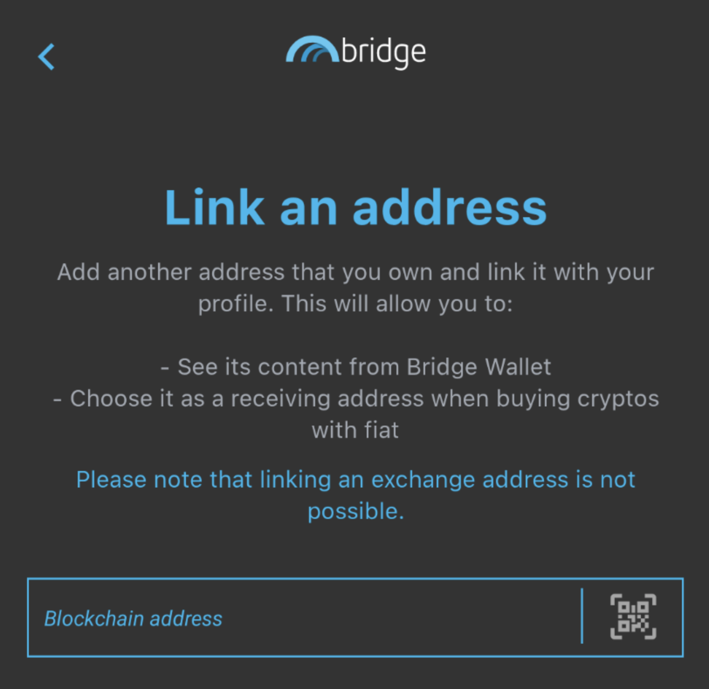
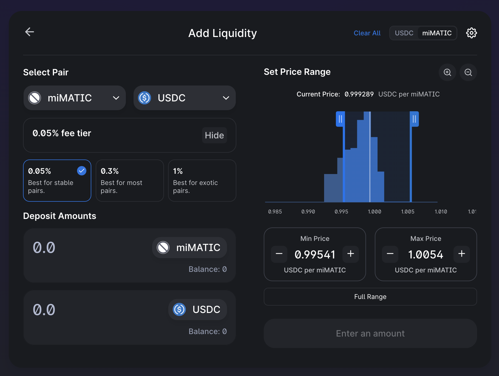

# De Finanzas tradicionales a DeFi con Jarvis

No todas las monedas estables son iguales. Para la mayoría de los usuarios de DeFi (Finanzas Descentralizadas), las monedas estables representan una criptodivisa que está vinculada al dólar estadounidense. Este es el caso de activos como:

* USDC o USDT que son emitidos por entidades centralizadas y respaldados por dólares estadounidenses&#x20;
* activos sobrecolateralizados como DAI o MAI que están suavemente vinculados al dólar estadounidense pero respaldados por una cesta de diferentes criptodivisas monedas estables&#x20;
* algorítmicas como UST o MIM que están parcialmente respaldadas y para las que la paridad de 1 dólar se mantiene utilizando un algoritmo específico.

Pero, ¿sabías que puedes encontrar otras monedas estables? Como ejemplo, TOMB es un token que se fija al precio de FTM (el token de gas nativo de la red Fantom) utilizando algoritmos. En este artículo, nos centraremos en las monedas estables que están vinculadas a las FIAT (monedas emitidas por gobiernos centrales), e intentaremos explicar por qué son importantes para tus estrategias de inversión.


Tenga en cuenta que una estrategia que funciona bien en un momento dado puede dar malos resultados (o hacerle perder dinero) en otro momento. Manténgase informado, controle los mercados, vigile sus inversiones y, como siempre, investigue por su cuenta..


## ¿Por qué necesitamos FIATs sintéticos ?

Consideremos que usted vive en un país europeo y utiliza el euro a diario. Si fuera a comprar criptoactivos, lo más probable es que los compraras con tus euros. En el caso de activos volátiles como el Bitcoin, realmente no importa porque te centrarás en el precio del Bitcoin en euros para evaluar si estás ganando dinero o no. Y, con suerte, ganará algo.&#x20;

Pero, ¿Qué pasa si en lugar de eso quieres invertir en DeFi y en el farming de rendimientos? ¿Y si, para mitigar los riesgos, quieres proporcionar liquidez utilizando sólo monedas estables? La mayor parte de la liquidez estable en muchas cadenas se proporciona como activos indexados en USD, lo que significa que tendrá que comprar USDC/USDT/DAI/MAI utilizando sus euros. En este punto, deberías comprobar que la liquidez que proporcionas está generando interés, pero también que la diferencia de precio entre el dólar y el euro no está jugando en tu contra.

Si usted comprara 100 euros en USDC el 20 de septiembre de 2021, tendría 117,29 dólares en USDC porque la relación EUR:USD era de 1:1,1729 en ese momento. Si usted convirtiera 117,29 dólares de USDC en euros hoy (24 de marzo de 2022) con una relación 1:1,0994, obtendría 106,69 euros, o una ganancia del 6,69%.&#x20;

Pero si usted comprara 100 CAD (100 dólares canadienses) en USDC el mismo día (20 de septiembre de 2021) con una relación de 1:0,7796 habría tenido 77,96 USDC. Convirtiéndolos hoy en CAD con una relación de 1:0,7972, tendrían un valor de 97,79 CAD, es decir, una pérdida del 2,21%.&#x20;

Sin embargo, 1 CAD siempre es igual a 1 CAD, pase lo que pase, como 1 USD = 1 USD y 1 EUR = 1 EUR. Cada moneda de cada país varía según la situación geopolítica, la política interna e internacional y las decisiones micro y macroeconómicas. Por eso hay que prestar atención a la variación del precio de estos criptoactivos, aunque sean "estables".

## La red Jarvis y Mt. Pelerin

### ¿Qué es la red Jarvis?

[Jarvis Network](https://jarvis.network/) es una aplicacion que permite [intercambar cryptoactivos ](https://app.jarvis.exchange/) por FIAT sintéticas. Una FIAT sintética es una criptomoneda que está vinculada al precio de una FIAT existente. Como tal, Jarvis le permitirá cambiar sus:

* USDCs por jCAD: la versión criptográfica del dólar canadiense
* &#x20;jEUR: la representación criptográfica del euro j
* JPY: la versión criptográfica del yen japonés&#x20;
* jSGD, jCHF, jGBP, y muchos más&#x20;

Como tal, Jarvis es realmente un  exchange de Forex en cadena que está en la red principal de Ethereum, pero también en Polygon, BNB Chain, Gnosis Chain y Avalanche. Pero no se queda ahí. Jarvis propone incentivar pools de liquidez que incluyan jFIATs. Esto se hace para atraer a los usuarios a depositar sus jFIAT y obtener rendimientos en sus stablecoins (con la posibilidad de depositar un solo activo a través de los pools de Curve), ayudar a otros protocolos que ofrecen monedas estables sin tener mucha liquidez, y facilitar a los usuarios de DeFi la salida de sus ganancias.


Puedes ver en la captura de pantalla anterior que el par 2CAD está compuesto por jCAD y CADC. El token CADC es en realidad otra versión del dólar canadiense proporcionada por DFX, otra solución de Forex descentralizada.


### Mt. Pelerin

[Mt. Pelerin](https://www.mtpelerin.com/bridge-wallet) es un escritorio OTC de criptomonedas no custodiada que ermite a los usuarios comprar crypto desde su cuenta bancaria directamente, y tenerlos depositados directamente en su cartera de crypto. También es un socio directo de Jarvis y permite comprar jFIATs.


La forma más sencilla de utilizar Mt. Pelerin es a través de la aplicación móvil Bridge Wallet. Tenga en cuenta que, al tratarse de un servicio centralizado, tendrá que proporcionar información personal para demostrar su identidad si quiere poder utilizar el servicio. También necesita tener un banco que le permita hacer transferencias bancarias a Suiza. Sin embargo, siempre es posible utilizar su sitio web en el que encontrarás un widget que te permite comprar criptodivisas a partir de una transferencia bancaria o utilizando una tarjeta de crédito. Esto no está sujeto a ningún KYC pero tiene algunas limitaciones. Tenga en cuenta que al utilizar el sitio web, su compra se enviará directamente a su cartera web. Para el resto de esta guía, presentaremos la solución usando Bridge Wallet.


Las transferencias bancarias pueden estar sujetas a comisiones, y lo más probable es que tarden algún tiempo en completarse, pero en general, Mt. Pelerin le permite comprar y vender fácilmente sus FIAT sintéticos por sus homólogos FIAT. Además, tienen una [estructura de comisiones](https://www.mtpelerin.com/pricing) que puede leer con más detalle, y dependiendo del activo que compre, podrá comprar y vender hasta 100.000 dólares al año de forma gratuita.


Si has comprado jFIATs, tu cuenta bancaria está automáticamente vinculada a tu cuenta de Bridge Wallet y podrás seleccionarla en la lista desplegable de destinatarios. Si no, tendrás que crear una nueva cuenta a partir de un IBAN.


### Vincular tu direccion de Polygon con tu cuenta de Mt. Pelerin (la direccion de Bridge wallet)

Vincular su cartera a su cuenta de Mt. Pelerin / Bridge Wallet es tan fácil como:

* Abrir la aplicación Bridge Wallet
* Abrir la pestaña de Direcciones en la parte inferior
* Hacer clic en `Link an address`
* Haz una foto del código QR de tu monedero Polygon, o copia y pega la dirección completa en el campo&#x20;
* Envía unos cuantos MATICs a la dirección del monedero de Bridge para validarlo


Una vez más, puede utilizar el widget del sitio web del Mt. Pelerin para [comprar](https://www.mtpelerin.com/buy-ehtereum) y [vender](https://www.mtpelerin.com/sell-ethereum) sus criptomonedas utilizando su billetera web (o billetera de hardware) directamente sin utilizar la billetera puente. Consulte el sitio web de Mt. Pelerin.


### Enviando jFIATs a tu cartera de Polygon

Enviar tus jFIATs a tu cartera en Polygon (o cualquier cadena soportada) es muy fácil. Desde la pestaña Wallet, asegúrate de que estás en la red que quieres usar como destino y carga tus jWallet Currencies.

Una vez que haya seleccionado el jFIAT que desea enviar, sólo tiene que hacer clic en enviar, rellenar los diferentes campos y, a continuación, iniciar la transacción y disfrutar de unos gastos reducidos y un procesamiento rápido.


Puede obtener un resumen completo de todas sus transacciones en la sección de actividad de cada jFIAT, así como en la pestaña Actividad de la pantalla principal.



Mt. Pelerin es una muy buena solución para comprar y vender criptodivisas y FIAT sintéticas. Pero también puedes utilizar este servicio para enviar dinero a tus amigos y familiares si ellos también utilizan la aplicación y, posiblemente, eludir transferencias bancarias complejas o limitaciones.


## Sacando rendimiento a tu jFIATs

Tienes FIATs sintéticos en Polygon, así que ahora necesitamos una forma inteligente de utilizarlos. En la introducción, vimos que puede ser una mejor idea utilizarlos tal cual en lugar de cambiarlos (venderlos) por monedas estables con paridad en dólares.

Piensa también en este escenario: tienes dólares canadienses y quieres un poco de exposición a Ethereum. ¿No sería bueno que pudiera comprar Ethereum sin correr el riesgo de comprarlo realmente? ¡¡¡Pues para eso están los mercados de préstamos !!!

### Market.xyz

[Market.xyz](https://www.market.xyz/) es un protocolo de préstamo en el que podrás utilizar algunos de tus criptoactivos como garantía para pedir prestados otros activos. Recientemente han lanzado un nuevo pool 100% dedicado a los FIAT sintéticos de Jarvis, puede comprobarlo [aquí ](https://polygon.market.xyz/pool/7)

Como puedes ver, puedes prestar tus jFIATs y ganar intereses de los prestatarios. Este pool también acepta algunos tokens LP (Liquidity Providing) como garantía. Esto significa que puedes prestar tus m2CAD o m2JPY y seguir ganando un \~27% de APY (rendimiento porcentual anual) sobre ellos, y pedir prestados otros jFIAT como jCAD o jJPY para apalancar tu posición.

También puede pedir prestao MAI, la moneda estable con paridad en USD creada por el protocolo QiDAO detrás de Mai Finance. La comunidad de QiDAO acordó proporcionar nuevas MAI de forma regular para mantener un tipo de interés bajo en los préstamos de MAI del casillero de Jarvis en Market.xyz.


Hay una cantidad mínima de préstamo de 0,05 ETH en las taquillas de Market.xyz, que equivale a 150 dólares a partir de marzo de 2022. Dado que necesitas mantener un ratio de garantía a deuda saludable, asegúrate de depositar suficiente garantía si quieres tomar un préstamo en la plataforma.


Como para cualquier plataforma de préstamos en Polygon, Market.xyz impondrá una relación "sana" entre la garantía y la deuda. Esto es lo que representa el LTV de cada garantía (Loan To Value, la inversa del CDR). Como ejemplo, el LTV de m2CAD es del 60%, lo que significa que la relación entre su deuda y el valor de su garantía debe mantenerse por encima del 60%.

En el caso de m2CAD, la garantía está vinculada al dólar canadiense, lo que puede variar en comparación con el MAI que le será prestado (vinculado al dólar estadounidense). Sin embargo, la variación es muy pequeña, por lo que, en teoría, puede pedir prestado muy cerca del umbral del 60%. Para nuestra guía, intentaremos ceñirnos a un CDR del 200%, que corresponde a un LTV de 0,4 (1 / 2,5 = 0,5). Para poder pedir un préstamo por valor de 0,05 ETH de MAI, necesitaremos un valor de garantía de

$$
Colateral= \frac{Debt Value}{LTV} = \frac{0.05 ETH}{0.4} = 300
$$

Debido a que dia de hoy la relación USD:CAD es de 1:0,7972, necesitaré una inversión inicial de

$$
CADinicial = \frac{300}{0.7972} = 376.32 CAD
$$


Suponiendo que invierto 300 dólares en CAD y pido prestado 150 dólares en MAI, actualmente ganaré un 27% de APY (23,91% de APR) por mi colateral y tendré que pagar un 11,28% de intereses por mi préstamo. En el transcurso de 1 año, esto representa un crecimiento de 81 dólares de mi colateral y 16,92 dólares de intereses a pagar.


Ahora vamos a ver qué hacer con su préstamo en dólares.

### Uniswap V3

[Uniswap V3](https://app.uniswap.org/) es la última versión de Uniswap, el proyecto matriz de muchos DEX (Decentralized Exchanges) donde los usuarios podrán intercambiar sus activos por otras criptodivisas, así como proporcionar liquidez para apoyar estos intercambios.

Uniswap V3 no está incentivado en Polygon (todavía), pero ofrece una nueva forma de proporcionar liquidez: ¡liquidez concentrada! Usted selecciona el rango en el que quiere proporcionar liquidez, y si el rango es muy estrecho, gana más comisiones que los usuarios que proporcionan liquidez en un rango más amplio. Puedes aprender como proveer liquidez en Uniswap V3 con [su guia oficial](https://help.uniswap.org/en/articles/5391541-provide-liquidity-on-uniswap-v3), o tambien puedes ver este video hecho por [Finematics](https://youtu.be/Ehm-OYBmlPM).

Para este tutorial, nos centraremos en el par MAI-USDC, ya que hemos tomado prestados algunos MAI y queremos limitar la exposición al riesgo farmeando monedas estables. Lo primero que hay que hacer es definir un rango objetivo.&#x20;

Ahora que el precio de MAI es mucho más estable debido a una liquidez cada vez mayor, a más pools y a algunos mecanismos como el Curve pool que ayudan a mantener el precio muy estable), nos pondremos como objetivo una tasa de 1:1 para MAI:USDC. En realidad, 1 MAI está más cerca de 0,998 USDC. El rango de precios esperado es entre 0,99 y 1,01 USDC para 1 MAI, dependiendo de las condiciones del mercado.&#x20;

Cuando los activos volátiles están en alza, la gente tiene más capacidad de endeudamiento y tiende a intercambiar mucho MAI, lo que disminuye su precio. El efecto contrario se produce cuando el mercado se reduce y la gente necesita devolver sus préstamos para evitar la liquidación: El MAI se compra en el mercado para reembolsar los préstamos, lo que aumenta su precio. De hecho, el rango de precios real suele estar entre 0,994 y 1,004 USDC por MAI.

Sin embargo, lo que realmente debe entender es:

* Si selecciona un rango amplio, cobrará menos comisiones que si selecciona un rango estrecho porque su liquidez se reparte en un rango mayor&#x20;
* Si selecciona un rango estrecho y el precio se sale de ese rango, no cobrará comisiones Su liquidez no se ajusta en función del precio.&#x20;
* Si selecciona un rango \[0,99;1,01] para MAI:USDC y el precio de MAI es 0,99 USDC, tendrá 100% de MAI y 0% de USDC. Por otro lado, si el precio es de 1,01 USDC por MAI, tendrá un 100% de USDC y un 0% de MAI&#x20;
* Puedes salir de tu pool de liquidez en cualquier momento y crear uno nuevo con un rango más amplio/estrecho si ves que tu primera configuración no está recogiendo suficientes comisiones
* Para las stablecoins, es mejor establecer un rango de comisiones del 0,05% para que los agregadores como [zapper](https://zapper.fi/) o [1inch](https://app.1inch.io/#/137/) elijan su pool cuando los usuarios están intercambiando sus stablecoins

Para simplificar esta guía, estableceremos un rango centrado en 1,000 con un margen del 1% entre 0,995 y 1,005 USDC por MAI.


Preste atención al orden de las fichas para su par. ¡¡¡De hecho, el rango de precios no será el mismo si selecciona MAI (miMatic) primero y USDC después, o USDC primero y MAI después !!!


Dependiendo de su configuración, puede esperar entre un 8% APR (rango amplio) y un 20% APR (rango estrecho) en su LP pagado en MAI y USDC. Esto dependerá en gran medida de la acción del precio y el volumen de las operaciones operadas en UniswapV3. Tenga en cuenta que también puede utilizar esta herramienta para operar sus operaciones con un impacto de precios muy bajo y cobrar las comisiones de sus propias operaciones.

## Estrategia de farmeo

Para esta estrategia, utilizaremos Jarvis como punto de partida. Para ello utilizaremos jCAD comprado a través de Mt. Pelerin. El jCAD se depositará en Curve Finance en el pool apropiado para obtener un token LP de 2CAD. Este token LP se depositará en Beefy para que las tasas de intercambio y los tokens de recompensa proporcionados por Jarvis puedan convertirse en 2CAD adicionales. Como prueba del depósito, recibiremos tokens mooJarvis2CAD que podremos utilizar en Market.xyz como garantía para pedir un préstamo de MAI con una CDR del 200% (50% LTV). El préstamo de MAI se utilizará para crear un token de provisión de liquidez en UniswapV3 para que pueda cobrar las comisiones de swap al 12% APR.

Esta configuración inicial garantiza que no se vea afectado por la variación del precio del USD con respecto al CAD. Además, la cantidad prestada está asegurada en el pool de UniswapV3 y puede ser devuelta en cualquier momento.&#x20;

Tanto las ganancias de los pools de 2CAD como de UniswapV3 se añadirán a un "potenciador de recompensas", es decir, un pool que tendrá un impacto nulo en la inversión inicial o en el préstamo, pero que en realidad aumentará las ganancias de una tasa de recompensa alta. Puede utilizar prácticamente cualquier pool con una tasa de recompensa superior a la del pool de 2CAD. Puede ser un pool de liquidez en QuickSwap como el cxDOGE/cxETH (44,24% APY a partir de marzo de 2022), o incluso un ohm-fork como Klima (944% APY a fecha de marzo de 2022). Para nuestra simulación, utilizaremos el pool JRT-MAY22-USDC directamente en la red Jarvis. La liquidez puede ser comprada y añadida en la  [Red de Kyber](https://kyberswap.com/#/add/0x2791Bca1f2de4661ED88A30C99A7a9449Aa84174/0xF5f480Edc68589B51F4217E6aA82Ef7Df5cf789e/0xdaa2c66b06b62bad2e192be0a93f895c855484ee) y utiliza USDC y un token nativo de la Red Jarvis. Este token LP está obteniendo actualmente un 143% de APR.

Esta estrategia se centra en monedas estables, pero también presenta muchas variaciones posibles:&#x20;

* Puede utilizar 2JPY o 2SGD si prefiere estos FIATs sobre jCAD
* Puede prestar su jCAD (o cualquier FIAT) en Market.xyz y cobrar comisiones de préstamo a los prestatarios&#x20;
* Puede intercambiar su préstamo de Market.xyz en cualquier token para el que proporcione liquidez en UniswapV3. Elija el pool que prefiera, pero preste atención a las posibles pérdidas impermanentes
* Puedes intercambiar las comisiones que ganas en Uniswap por activos aceptados por [Mai Finance](https://app.mai.finance) (BTC, CRV, LINK, GHST ...) y pagar su préstamo en Market.xyz utilizando el préstamo tomado en Mai Finance, transfiriendo realmente su préstamo al 11% en un préstamo al 0%
* También puede utilizar las comisiones cobradas para pagar su préstamo en Market.xyz más rápido&#x20;
* Las posibilidades son infinitas realmente.

Como siempre, asumiremos algunas cosas para la simulación:&#x20;

* El APY para 2CAD es del 27% APY (23,91% APR)&#x20;
* El tipo de interés del préstamo en Market.xyz es del 11,28%.&#x20;
* La APR de tu posición en UniswapV3 es del 12% porque la haces bastante grande (más segura pero menos eficiente)&#x20;
* Obtendrá un 143% de APR en el potenciador de recompensas JRT-MAY22-USDC en la red Jarvis&#x20;


Si desea realizar simulaciones para este sistema, puede utilizar el siguiente [Google Spreadsheet](https://docs.google.com/spreadsheets/d/10-n5IyZLl0GZyjM16SNuVOONNsfJ15pm2GL0e2MagzE/edit?usp=sharing) Simplemente cambie las diferentes tasas de recompensa o el CDR deseado para estimar el APY final que puede obtener de este bucle.


### Día 1

Tienes que arrancar tu sistema, para ello :

* Cambie 300 dólares de USDC por jCAD en Jarvis Network (o compre jCAD directamente a través de Mt. Pelerin)&#x20;
* Deposite el jCAD en Curve Finance en el [pool #23](https://polygon.curve.fi/factory/23/deposit)
* Deposite el token LP 2CAD en [beefy finance](https://app.beefy.finance/#/polygon/vault/jarvis-2cad)
* Depositar el token de recepción de carne en Market.xyz&#x20;
* Pedir prestado MAI con un CDR o 200% (LTV del 50%)
* Intercambia una parte de tu MAI por USDC en Uniswap V3 y deposita MAI y USDC en un nuevo pool de liquidez con los parámetros de tu elección&#x20;

Después del primer día de farming, debería tener:

| Posición               | Valor ($) |
| ---------------------- | --------- |
| mooJarvis2CAD          | 300.000   |
| recompensa 2CAD        | 0.197     |
| MAI-USDC UniV3         | 150.000   |
| comisiones UniV3       | 0.049     |
| JRT-MAY22-USDC         | 0.000     |
| recompensas de Jarvis  | 0.000     |
| deuda de MAI           | 150.000   |

Ya está todo listo, el resto es simple mantenimiento y trasladar las recompensas al pool de Jarvis

### Mantenimiento diario:

Es hora de poner tus ganancias en el potenciador de recompensas, para ello deberá:

* Recoger MAI y USDC en Uniswap V3
* Extrae una pequeña parte de tu mooJarvis2CAD correspondiente a lo que se ha compuesto&#x20;
* Cosechar la recompensa en la Red Jarvis
* &#x20;cambiar todo por JRT-MAY22 y USDC en Kyber Network, y crear tokens LP depositar el token LP en la Red Jarvis&#x20;

Al final del Día 2, tendrás:

| Posición            | Valor ($) |
| ------------------- | --------- |
| mooJarvis2CAD       | 300.000   |
| recompensas 2CAD    | 0.197     |
| MAI-USDC UniV3      | 150.000   |
| comisiones UniV3    | 0.049     |
| JRT-MAY22-USDC      | 0.246     |
| recompensas Jarvis  | 0.001     |
| Deuda en MAI        | 150.000   |

### Resultados mensuales aproximados

Aquí están los resultados brutos mes a mes, tal y como se pueden obtener en la hoja de cálculo de Google enlazada anteriormente.

| día | mooJarvis2CAD | MAI-USDC | JRT-MAY22-USDC | Deuda en MAI  |
| --- | ------------- | -------- | -------------- | ------------- |
| 30  | 300.000       | 150.000  | 7.534          | 151.350       |
| 60  | 300.000       | 150.000  | 16.282         | 152.760       |
| 90  | 300.000       | 150.000  | 26.118         | 154.182       |
| 120 | 300.000       | 150.000  | 37.179         | 155.618       |
| 150 | 300.000       | 150.000  | 49.616         | 157.067       |
| 180 | 300.000       | 150.000  | 63.601         | 158.530       |
| 210 | 300.000       | 150.000  | 79.326         | 160.007       |
| 240 | 300.000       | 150.000  | 97.009         | 161.497       |
| 270 | 300.000       | 150.000  | 116.893        | 163.001       |
| 300 | 300.000       | 150.000  | 139.252        | 164.519       |
| 330 | 300.000       | 150.000  | 164.393        | 166.051       |
| 360 | 300.000       | 150.000  | 7.343          | 0.000         |

### Día 365

Con un CDR del 200%, pagará la totalidad de su deuda durante el undécimo mes, liberando el CAD inicial que podrá transferir de nuevo a su cuenta bancaria si lo desea, y seguirá teniendo:

* 150 $ de MAI-USDC&#x20;
* 7343$ de LP en Jarvis&#x20;

Lo que supondría un total de 52.91% APY.


Si toma los beneficios de su fondo de liquidez 2CAD y los invierte directamente en el fondo JRT-MAY22-USDC en Jarvis, sin añadir Market.xyz en el medio, obtendría un APY total de 52,68%. Puede ver la segunda hoja en la hoja de cálculo de Google para más detalles, o establecer el CDR a 1.000.000 (sin préstamo).


## Descargo de Responsabilidad

Esta guía se ha escrito principalmente para ilustrar cómo puede convertir sus FIAT en criptoactivos (y viceversa) utilizando Mt. Pelerin y Jarvis Network. Para los no residentes en EE.UU., esta es una muy buena oportunidad para transferir dinero de un "mundo" a otro con muy poco impacto y casi sin comisiones. El hecho de que también pueda obtener sus FIAT sintéticos en Polygon lo hace especialmente eficiente, ya que el coste de la gasolina y el tiempo de transacción siguen siendo de los mejores para DeFi.&#x20;

También es interesante observar que cada vez más aplicaciones de primer nivel utilizan jFIAT, especialmente [AAVE v3](https://app.aave.com/markets/) que comenzó a proponer los mercados de préstamos jEUR y EURS, facilitando la transición de TradFi (Traditional Finance) a DeFi.&#x20;

La estrategia propuesta en esta guía, es asumiendo que todos los precios y tasas se mantienen iguales, lo cual obviamente no es lo que sucede en la vida real. Asegúrese de prestar atención a los tipos de interés de los préstamos de recompensa antes de invertir nada para poder devolver el préstamo.


Esta guía no es un consejo financiero, sino que se ha realizado con un objetivo educativo. Es necesario prestar atención a las variaciones de precios, la oferta y la demanda, los programas de recompensas, las fechas de finalización, las pérdidas impermanentes, etc ... El objetivo no era proponer recetas que se puedan seguir a ciegas, así que por favor haga sus deberes y su propia simulación, y sólo invierta lo que esté dispuesto a perder posiblemente.

