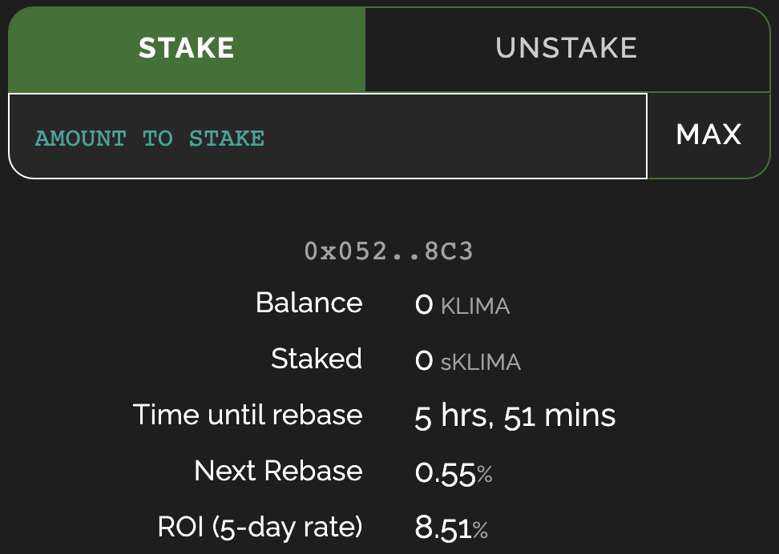
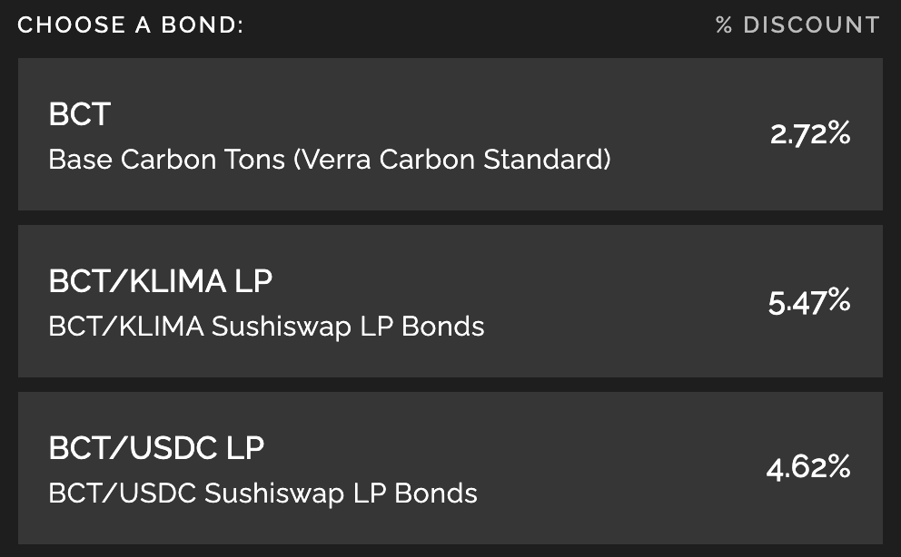
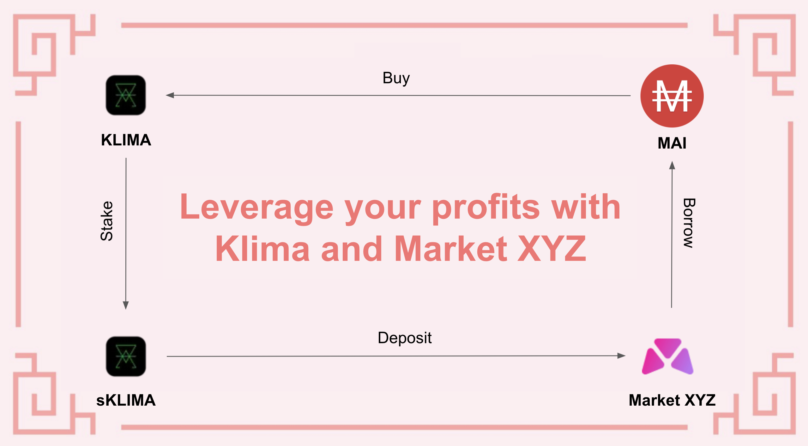
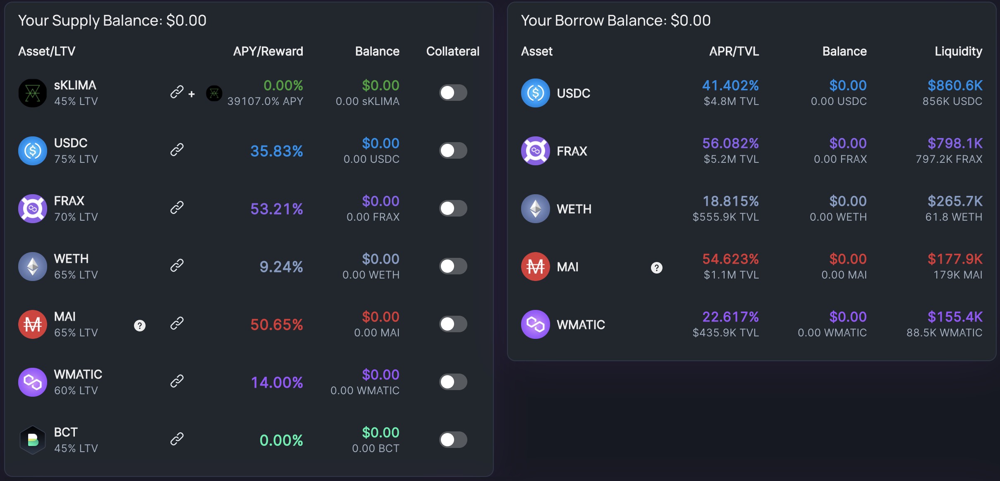
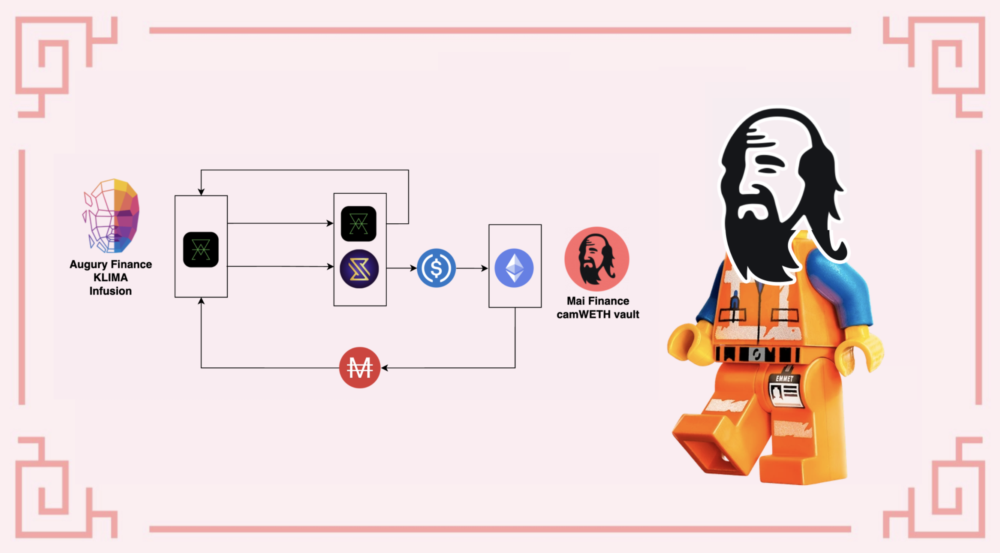
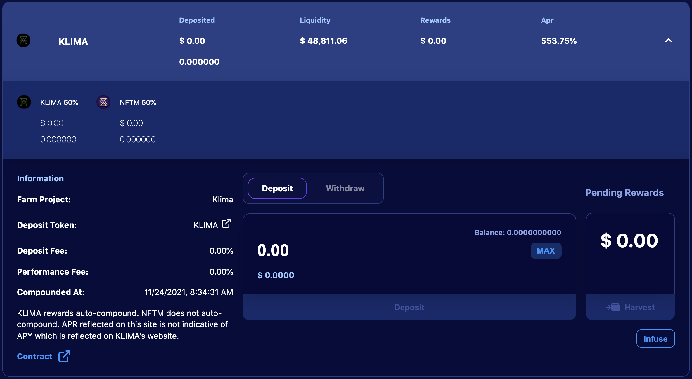

# Fork de OHM en Polygon: Entendiendo KLIMA

Si has estado al día con las noticias sobre criptomonedas durante los últimos meses, seguramente habrás notado muchas referencias a (3,3), y habrás oído hablar de proyectos relacionados con OHM. Intentaré introducir rápidamente lo que son estos proyectos, cuáles son las reglas principales del proyecto, y cómo puedes utilizarlos realmente como parte de tus estrategias de inversión. Para esta última parte, nos centraremos en Klima DAO, uno de los más exitosos forks de OHM en Polygon, que también tiene una historia y un objetivo muy interesante.

## ¿Qué son los forks de OHM?

### ¿Qué es OHM y qué es un fork?

Todo comenzó en la Mainnet de Ethereum con Olympus DAO. Su objetivo es crear una nueva moneda de reserva para competir con el dólar, salvo que, a diferencia de otras monedas estables, esta nueva moneda tendría un valor flotante. El token nativo (Ohm) necesita estar totalmente respaldado por diferentes activos, sin embargo los tokenomics del proyecto hace que el valor de Ohm sea definido por el mercado.&#x20;

Olympus DAO se lanzó en marzo de 2021 y sigue siendo tdavía un proyecto muy exitoso en Mainnet de Ethereum. El TVL (Total Value Locked) está denominado en decenas de millones de dólares, y el precio del Ohm mantiene un precio muy alto. Debido a este éxito, el proyecto ha sido forkeado(copiado) y múltiples clones de Olympus DAO han aparecido en muchas cadenas.

### Desglose de sus tokenomics

Esta sección será un poco más técnica de lo que solemos presentar en nuestras otras guías, pero para entender el éxito de Olympus y otros forks de OHM, es importante entender cómo funcionan.

La idea base del protocolo Olympus es aumentar la tesorería lo máximo posible vendiendo el token nativo con descuento, mientras se mantiene una oferta circulante lo más baja posible para mantener un precio alto. Esto se hace proporcionando recompensas muy altas a los stakers, y teniendo un control casi total de la liquidez.

* **Bonding:** el protocolo propondrá tokens nativos a un precio reducido. El precio se paga utilizando activos específicos que se utilizan para respaldar el token nativo. En el ejemplo de Olympus DAO, el token OHM está respaldado al 100% por unos pocos tokens que incluyen principalmente DAI, por lo que los bonos se pueden comprar usando DAI directamente, o usando tokens LP DAI-OHM (y últimamente tokens adicionales incluyendo FRAX). Cuando la gente compra los tokens nativos utilizando los activos respaldados o los tokens LP, el pago va directamente a la tesorería, lo que permite al protocolo generar más tokens, pudiendo así funcionar durante un periodo de tiempo más largo. Lo único es que el token descontado se liberará una vez transcurrido un periodo de bloqueo.
* **Staking:** Después de la vinculación, los usuarios recogerán los tokens nativos y podrán elegir entre venderlos o hacer staking. Para asegurarse de que se elige esta última opción, el protocolo ofrece recompensas increíblemente altas a los stakers (¡¡hablamos de un 1,2% de ganancias diarias!!). El objetivo detrás de estos altos APR es conseguir un ratio de staking lo más cercano posible al 100%. Si no hay muchos tokens circulando, el precio sube, y junto con las altas recompensas, hace que sea aún más interesante apostar. Como nota al margen, un precio que sube ayuda a mantener tasas de recompensa altas.
* **Aumentando la tesorería y controlando la liquidez:** La tesorería se incrementa por el bonding, y por el hecho de que los tokens nativos pueden ser enlazados con tokens LP que están casi completamente controlados por el protocolo. Estos tokens LP se utilizan para recaudar cuotas de intercambio para los usuarios que prefieren comprar el token nativo en el mercado a precio completo en lugar de la vinculación (esto estará explicado con mayor detalle a continuación).
* **Compra de tokens y quema:** La mayoría de los proyectos de tipo OHM incluyen un mecanismo que recomprará los tokens nativos y los quemará en ocasiones muy específicas. Los problemas surgen cuando los usuarios venden el token nativo, lo que hace bajar el precio. Sin embargo, si la gente vende sus tokens, el APY sube ya que el número de tokens generados sigue siendo el mismo para la cantidad reducida de tokens bloqueados. Pero incluso con un APY más alto, si nadie compra y hace staking de los tokens vendidos, el protocolo puede recomprarlos en el mercado para ejercer presión de compra, hacer subir el precio y mantener baja la oferta en circulación. Los tokens que se recompran simplemente se destruyen. De hecho, dado que parte de la tesorería se ha utilizado para adquirir estos tokens, mantenerlos en la tesorería o distribuirlos realmente diluiría la tesorería, lo que reduciría la tasa de recompensas o afectaría a los periodos de tiempo durante los que el protocolo puede funcionar.

Puedes encontrar más información acerca de OHM en estos artículos (aunque están en inglés):

* [DeFi 2.0 - A new Narrative? Olympus DAO, Tokemak Explained](https://www.youtube.com/watch?v=l0vRTi8\_FRk)
* [WTF is Olympus DAO](https://newsletter.banklesshq.com/p/wtf-is-olympus-dao)

### Bonding VS Staking

¿Por qué alguien pagaría por un token cuando hay una versión con descuento disponible a través de un bono? Esta es una pregunta válida, y la respuesta dependerá del descuento ofrecido por el bono.&#x20;

Como vamos a trabajar con Klima DAO, comparemos la compra + staking VS bono:

Si se compra directamente Klima en el mercado y hace staking del token durante 5 días (el periodo real de bloqueo de los bonos), el ROI (Return On Investment) será del 8,51%. Si, por el contrario, se compra un bono, el máximo rendimiento de la inversión sería del 5,47% mediante la aportación de la BCT/KLIMA.&#x20;

Esto significa que, con el equivalente a 100 dólares, se obtendría al cabo de 5 días&#x20;

* 108,51 dólares con la 1ª opción
* 105,47 dólares con la 2ª opción&#x20;

Sin embargo, es importante entender que el Klima vinculado se libera a lo largo del periodo de bloqueo. Por lo tanto, puede cosechar el Klima generado y apostarlo para beneficiarse de los rebases (distribución de recompensas). Dado que sólo obtendrá recompensas por lo que haya bloqueado durante el periodo de vesting, y dado que hay 15 rebases durante los 5 días para que el bono se libere completamente, podemos asumir que puede cosechar potencialmente un 6,67% antes de cada uno de los 15 rebases. Suponiendo que coseche y apueste al principio de cada reenganche, obtendría esto:

| Rebase # | Cantidad Stakeada | Recompensa | Recompensa Total |
| -------- | ----------------- | ---------- | ---------------- |
| 1        | 7.031             | 0.038      | 0.038            |
| 2        | 14.063            | 0.077      | 0.116            |
| 3        | 21.094            | 0.116      | 0.232            |
| 4        | 28.125            | 0.155      | 0.397            |
| 5        | 35.157            | 0.193      | 0.580            |
| 6        | 42.188            | 0.232      | 0.812            |
| 7        | 49.219            | 0.271      | 1.083            |
| 8        | 56.251            | 0.309      | 1.392            |
| 9        | 63.282            | 0.348      | 1.740            |
| 10       | 70.313            | 0.387      | 2.127            |
| 11       | 77.345            | 0.425      | 2.552            |
| 12       | 84.376            | 0.464      | 3.016            |
| 13       | 91.407            | 0.503      | 3.519            |
| 14       | 98.439            | 0.514      | 4.061            |
| 15       | 105.470           | 0.580      | 4.651            |

Al final del periodo de bloqueo, se respeta el 5,47% de ROI, pero las recompensas por hacer staking también añaden un 4,65% adicional (que no se ha compuesto para simplificar), lo que da como resultado un 10,12% de ROI. Esto significa que hacer bonding es en realidad más interesante que apostar directamente, aunque el ROI de la vinculación parezca menor que el ROI de la apuesta.&#x20;

La recompensa total que obtendrá apostando N veces durante el periodo de carencia (con Nmax = 15 como máximo) es:

$$
Reward_{total} = \sum_{i=1}^{N}{\frac{Investment * i * (1 + APR_{Vesting})}{N} * APR_{staking}}
$$

A continuación, puede realizar sus propias simulaciones para comprobar si es mejor comprar y hacer staking, o bien, hacer bonding. Para nuestro ejemplo, con un ROI de staking del 8,51% en 5 días, sería mejor un descuento de bono del 3,95% con 15 rebases (dando un ROI equivalente del 8,52%).


Puede realizar la misma simulación recolectando+ haciendo staking sólo una vez al día en lugar de 3 veces al día antes de cada rebase. Para el mismo APY que en el caso anterior, necesitaría un descuento de vinculación del 6,76% para obtener un mejor rendimiento de la inversión que con la estaca.



Puedes encontrar un simulador que compara el bonding VS staking en este [google spreadsheet](https://docs.google.com/spreadsheets/d/1MTKTbf-ZAihGbEax3WEwkxToG7IlPKlwmYq59O3KG2o/edit#gid=0). Esta hoja puede ser editada perfectamente aunque cabe destacar que no ésta es una colaboración oficial con el equipo de QiDAO


### Estudiando el caso de Klima DAO

La especificidad que diferencia a Klima DAO de otros Ohm-forks es el principal activo que respalda el token Klima: el token BCT, proporcionado por [Toucan Protocol](https://toucan.earth). El BCT (**B**ase **C**arbon **T**onne) representa en realidad inversiones en el mundo real para descarbonizar la tierra, convirtiendo las compensaciones de carbono del mundo real en tokens. Puede leer mucho más sobre su funcionamiento en la [documentació oficial](https://docs.toucan.earth/protocol/introduction/defi-refi) de Toucan.

BCT es utilizado por [Klima DAO ](https://dapp.klimadao.finance)para acuñar KLIMA, de la misma manera que el DAI es utilizado por el DAO de Olympus para acuñar el OHM. En otras palabras, Klima actúa como un sumidero de carbono, proporcionando fondos reales para luchar contra el cambio climático. Se puede encontrar más información en la página web de [Klima](https://www.klimadao.finance) y en su [documentación](https://klima-dao.gitbook.io/klima-dao/), además, puedes unirte al Discord de QiDAO para discutir acerca de cómo podemos convertir a MAI en una crypto verde


Una de las principales diferencias entre Olympus y Klima es que BCT no tiene un precio estable. Esto supone un mayor riesgo que para los forks que utilizan monedas estables para construir su tesorería, sin embargo se supone que los problemas medioambientales serán cada vez más importantes, y habrá cada vez más proyectos que intenten extraer carbono de la atmósfera, lo que a su vez aumentaría el valor global de BCT.


## Estrategia 1: Apalancamiento de sKLIMA, o (9,9)

Sin entrar en mucho detalle en la[ teoría de juegos (3,3)](https://es.wikipedia.org/wiki/Equilibrio\_de\_Nash), (9,9) representan una situación en la que se está apalancando una posición stakeada. Esto es realmente posible porque Klima DAO proporcionará un token sKLIMA como prueba de depósito que alguna plataforma aceptará como garantía para un posible préstamo. Veamos los detalles al respecto.

### Un bucle de apalancamiento con MarketXYZ y Klima

La idea es conseguir una cantidad inicial de KLIMA token que puedes depositar en Klima DAO. Esto le permitirá obtener un APY muy alto (en el momento de escribir este artículo, el APY es de 38.873,08%, o 601% APR o una ganancia diaria de 1,68%) y al depositar su token KLIMA, obtendrá sKLIMA como prueba de depósito.

El token de sKlima puede ser usado en el  [Green Leverage Locker](https://polygon.market.xyz/pool/5) de MarketXYZ lo que te permitirá pedir un préstamo contra el colateral depostiado


Como nota adicional, Mai Finance se asoció con el mercado XYZ y participó en el seed de Green Locker con 1 millón de MAI para garantizar tipos de interés bajos cuando se toman préstamos de MAI contra su sKLIMA.


No es una obligación que pidas prestado MAI, de hecho puedes pedir prestado cualquier token con el tipo de interés más bajo, pero tienes que tener en cuenta que tendrás que pagar comisiones por tu préstamo, y cuanto más rápido devuelvas tu préstamo, menos comisiones pagarás.&#x20;

Con su préstamo, podrá comprar más fichas KLIMA y repetir el bucle.&#x20;

Verás que el APY de sKLIMA compensará en gran medida los intereses de tu préstamo


Cabe destacar, que antes de pedir prestado en MarketXYZ tenga en cuenta de que hay una cantidad mínima a pedir prestada, por lo que compruebe el limite antes de aplicar esta estrategia


### Resultados aproximados

El mercado XYZ también tendrá algunos niveles de liquidación, lo que significa que si el valor de su garantía cae por debajo del nivel de liquidación, existe el riesgo de que pierda su garantía. Para reducir el riesgo de liquidación, la siguiente simulación asume que usted mantendrá un ratio C/D del 250%, y que invierte 1.000$ iniciales de tokens KLIMA al 38,873% APY para pedir prestado MAI al 20,49% de interés

| sKLIMA ($) | Prestamo MAI ($) | eq. APY (%) | intereses ($) |
| ---------- | ---------------- | ----------- | ------------- |
| 1,000.00   | 400.00           | 38,873      | 81.96         |
| 1,500.00   | 560.00           | 54,455      | 114.74        |
| 1,560.00   | 624.00           | 60,642      | 127.86        |
| 1,624.00   | 649.60           | 63,129      | 133.10        |
| 1,649.60   | 659.84           | 64,125      | 135.20        |
| 1,659.84   | 663.94           | 64,523      | 136.04        |
| 1,663.94   | 665.57           | 64,682      | 136.38        |

Por supuesto, es posible que se detenga después de 3 bucles, ya que el APY equivalente no crecerá mucho más allá de eso.&#x20;

Además, debido a que la inversión inicial es de $1,000, el valor que obtendrá al final de 1 año sería de $646,820.00, asumiendo que todo se mantiene igual. En otras palabras, inviertes $1,000, tendrás que pagar $665.57 con $136.38 adicionales (una deuda acumulada de $801.95) pero también ganarás $646,820.&#x20;

También puede ver que el valor de su posición en sKLIMA está creciendo muy rápidamente (alrededor del 8% cada 5 días), lo que significa que también puede aumentar su deuda en este punto y apalancarse aún más para obtener ganancias adicionales.

### Recogiendo beneficios y pagando la deuda

Uno de los principales problemas de los proyectos de Ohm-fork es que se supone que todo el mundo está apostando y nadie vende. Pero, si nadie vende, nadie obtiene beneficios y, en la mayoría de los casos, el primero en vender se llevará el pastel.

&#x20;Para cualquier estrategia de inversión, es importante capturar el valor de las ganancias. Puedes hacerlo retirando una parte de tu posición de sKLIMA en el mercado XYZ y recuperar KLIMA que puedes vender.

&#x20;Si inviertes 100 dólares y operas los 7 bucles como se indica más arriba, tu inversión en KLIMA habría generado 67,11 dólares al cabo de 31 días, lo que significa que puedes devolver completamente tu préstamo con intereses en un solo mes. Si lo haces, empezarás de nuevo con 166$ al mes siguiente y sin deuda pendiente. Sólo hay que vigilar la APR del préstamo que puede llegar a ser bastante alta en el mercado XYZ.

## Estrategia 2: Inversión Continua o (4,4) entero

Una vez más, (4,4) está relacionado con la teoría de juegos y las monedas de reserva, e indica que las personas que adquieren sus bonos luego los stakean. En esta estrategia, veremos cómo podemos usar Klima y Augury para comprar bonos regularmente, y apostarlos continuamente.

### El bucle de inversión usando Augury y Mai Finance

Seguimos usando Klima, pero esta vez utilizamos una [infusion de Augury Finance](https://augury.finance/infusions) con el fin de automatizar la extracción del valor de Klima. Al depositar tus tokens KLIMA en la infusión, el algoritmo encargado de la infusión realizará las siguientes acciones después de cada rebase:

* El 50% de los KLIMA cosechados se reestablece para aumentar su posición sKLIMA&#x20;
* El 50% del KLIMA cosechado se vende por USDC que se añade al pool de NFTM en Augury, y se le distribuye a usted como tokens NFTM

El NFTM puede entonces conservarse mientras aumenta su valor, o canjearse por su valor en USDC. En otras palabras, no importa si el token KLIMA pierde valor después de un reajuste, ya que su valor se captura y se almacena como NFTM.&#x20;

Después de canjear el valor USDC de sus recompensas NFTM, puede comprar el token de su elección y almacenarlo en una bóveda en Mai Finance. El ejemplo anterior utiliza una bóveda de camWETH, pero en realidad puedes utilizar cualquiera. La idea es poder utilizar las bóvedas en Mai Finance para pedir prestado MAI y comprar nuevos bonos en Klima DAO para repetir el bucle. Luego puedes cosechar los tokens de KLIMA e inyectarlos en Augury. Ten en cuenta que los bonos se van adquiriendo poco a poco, por lo que es totalmente posible cosechar regularmente y apostar en Augury antes de que tu bono sea totalmente adquirido.

### Resultados Esperados

Suponiendo que invierte 100 dólares como en el ejemplo anterior, y que los coloca directamente en la infusión Augury, que la APR de la infusión Klima es del 552,94% (valor actual en el momento de escribir este artículo), y que desea mantener una relación C/D en la cámara acorazada camWETH del 240% y un APY del 2,19% en la cámara acorazada camWETH, he aquí los resultados a un año:

| Día | sKLIMA ($) | wETH ($)  | Préstamo MAI ($) |
| --- | ---------- | --------- | ---------------- |
| 30  | 137.751    | 27.708    | 11.545           |
| 60  | 189.776    | 64.883    | 27.035           |
| 90  | 261.474    | 116.150   | 48.396           |
| 120 | 360.282    | 186.835   | 77.848           |
| 150 | 496.453    | 284.283   | 118.451          |
| 180 | 684.115    | 418.613   | 174.422          |
| 210 | 942.737    | 603.771   | 251.571          |
| 240 | 1,299.152  | 858.978   | 357.907          |
| 270 | 1,790.339  | 1,210.720 | 504.466          |
| 300 | 2,467.258  | 1,695.500 | 706.458          |
| 330 | 3,400.140  | 2,363.625 | 984.844          |
| 360 | 4,685.775  | 3,284.424 | 1,368.510        |

Una vez más, suponiendo que todas las tasas y precios se mantienen igual, al final del año usted tendría:

* 4.684,775 dólares en tokens KLIMA
* &#x20;3.284,424 dólares en wETH&#x20;
* Una deuda pendiente de $1,368.510&#x20;

Esto supondría un APY equivalente del 6,866,46%. Esto está lejos del 38.705,13% anunciado por KLIMA, pero sigue siendo bastante impresionante para una inversión de 100 dólares. Además, una buena carga de sus ganancias se han convertido en wETH en una bóveda en Mai Finance, y su préstamo en la aplicación le conseguirá algunos Qi Tokens adicionales.


Si esta estrategia tiene un APY mucho más bajo que el puro (9,9), también es una estrategia relativamente asequible ya que puede entrar en el bucle con la cantidad de KLIMA que desee.


## Descargo de Responsabilidad

Todo lo que se presenta en este documento es pura teoría y se propone con fines educativos. El mayor problema con proyectos como Olympus y Klima es que, una vez más, el primer usuario que venda se beneficiará del precio superior. Si la primera venta es masiva (porque las ganancias tambien lo son), puede convertirse rápidamente en un efecto de pánico que puede matar el precio del token KLIMA. Sin embargo, en este caso, el APY se dispararía, lo que significa que los usuarios que no vendan se beneficiarán de recompensas muy elevadas, de modo que cuando el APY atraiga a nuevos usuarios, los que hayan aguantado serán los verdaderos ganadores.&#x20;

También es bueno tener en cuenta que el proyecto sólo puede seguir imprimiendo tokens mientras se inyecten fondos adicionales en la tesorería.&#x20;

Así que el riesgo puede ser muy alto si no se extraen algunos beneficios de vez en cuando para disminuir los riesgos.&#x20;

Como nota final, presta atención a que los ohm-forks son la nueva tendencia, pero la mayoría de los proyectos pueden fracasar, y muchos de estos forks no son proyectos sólidos. Debido a su naturaleza, aún no han sido verificados por RugDoc, y puede ser muy complicado identificar las aplicaciones reales de las puras estafas.


Tenga en cuenta que una estrategia que funciona bien en un momento dado puede dar malos resultados (o hacerle perder dinero) en otro momento. Manténgase informado, controle los mercados, vigile sus inversiones y, como siempre, investigue por su cuenta.

