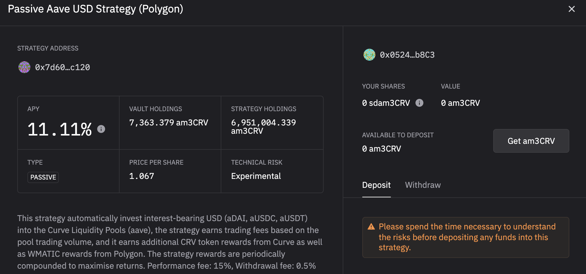

# El elefante, el chimpacé y la nutria

## Introducción

Este podría ser un buen título para alguna poesía, sin embargo, parece que estos son los 3 animales tótem de los protocolos que vamos a discutir en esta guía. Hoy vamos a analizar de cerca una de las últimas incorporaciones (a partir de enero de 2022) a la colección de tokens colaterales que respaldan la moneda estable MAI en Mai Finance: el token sdam3CRV. Explicaremos con detalle qué es y cómo puedes conseguirlo. A continuación, propondremos una pequeña estrategia para utilizarlo y obtener altas rentabilidades utilizando el token de recibo estable de Stake DAO, Mai Finance, y el protocolo OtterClam como multiplicador de recompensas.

## Stake DAO

### Presentación de Stake DAO

[Stake DAO](https://app.stakedao.org) DAO es una plataforma de optimización de rendimientos en la que los usuarios pueden depositar sus activos y dejar que la plataforma utilice las estrategias más curadas para maximizar los rendimientos. Las inversiones se proponen con una puntuación de riesgo, y las inversiones se muestran adecuadamente en un bonito panel que facilita el seguimiento de los resultados de las estrategias elegidas. Lanzado principalmente en Ethereum Mainnet, Stake DAO se está expandiendo rápidamente a otras cadenas como Polygon y Avalanche. Por supuesto, puede leer más sobre Stake DAO en su página web y en su [documentación oficial](https://stakedao.gitbook.io/stakedaohq/).

### La estrategia am3CRV

Para esta guia, usaremos el `Passive Aave USD Strategy` para Polygon.Esta es una estrategia que utiliza el pool am3CRV de [Curve Finance](https://polygon.curve.fi): depositas tus activos estables (USDC, USDT o DAI) en el pool de aave de Curve y recibirás un token de recepción am3CRV. Este es el token que puedes stakear en Curve directamente para recibir las recompensas CRV y WMATIC, pero también puedes depositar este token en Stake DAO y las recompensas CRV y WMATIC se venderán y se incorporarán a tu posición estable.

Como puedes ver arriba, apostar tus tokens am3CRV en Curve te daría un APRs global del 8,35% (**R**ecompensa **p**orcentual **a**nual). Si va a Stake DAO, encontrará en la sección Strategies en Polygon la estrategia que está utilizando los tokens am3CRV donde será para depositar su token de recepción y ganar 11,11% APY (**R**endimiento **P**orcentual **A**nual, que asume que componen sus recompensas al menos diariamente).

Cuando deposite sus tokens am3CRV en Stake DAO, recibirá un nuevo token de recepción: sdam3CRV (**s**take **d**ao am3CRV).


Tenga en cuenta que Stake DAO cobra comisiones sobre sus ganancias por cada estrategia que utilice. En nuestro caso, y a partir de enero de 2022, la comisión de rendimiento es del 15%, y también habrá una comisión de retirada del 0,5%. Asegúrese de entender esto antes de entrar en el pool.


Esta estrategia puede considerarse muy segura (DYOR) ya que sólo utiliza monedas estables. El riesgo de pérdida impermanente es casi nulo porque el token am3CRV LP se compone únicamente de monedas estables vinculadas al dólar estadounidense. Si quieres usar Stake DAO, asegúrate de tener en cuenta los riesgos del contrato inteligente, ya que tu activo se prestará en AAVE a través de Curve, y el token LP está en Stake DAO, por lo que tienes 3 capas de protocolos que están expuestos a riesgos.

Puedes utilizar el instrumento de farming en Stake DAO para depositar tus tokens sdam3CRV y obtener un \~9% extra pagado en token SDT, el token nativo de Stake DAO. Para nuestra guía, sin embargo, utilizaremos el token sdam3CRV de forma diferente.

## Mai Finance

[Mai Finance](https://app.mai.finance) es un protocolo de préstamo en el que puedes depositar tus activos como garantía y pedir un préstamo con ellos. No se trata de la típica plataforma de préstamos en la que las personas prestan activos a los prestatarios. En Mai Finance, sólo te prestas a ti mismo, y sólo pides prestado contra los activos que posees. Encuentre más detalles sobre Mai Finance en este sitio, o en [la documentacion oficial](https://docs.mai.finance).

En enero de 2022, el token sdam3CRV fue aprobado como opción de garantía en Mai Finance. Esto significa que el token que se ha creado al depositar su recibo am3CRV en Stake DAO ahora se puede utilizar para pedir prestada la moneda estable MAI. Esto es increíble por las siguientes razones:

* el token sdam3CRV está compuesto únicamente por monedas estables, por lo que no debería verse afectado por la Pérdida Impermanente y debería mantener un precio estable debido a que el precio no está cambiando mucho.
* Es bastante fácil evitar liquidaciones, incluso si tomas prestado cerca del nivel de liquidación su garantía se revaloriza porque es un activo que produce rendimientos.
* En el momento de redactar esta guía, obtendrías un 11% de APR sobre tu colateral

Esta cámara acorazada utiliza un CDR (**C**oeficiente de **C**olateral a **D**euda) alto porque siempre tratamos de promover la seguridad en las guías presentadas en este sitio web. Un CDR alto presenta algunos beneficios:

* Le mantiene alejado de la liquidación en caso de que se produzcan importantes acciones negativas en el precio de su garantía
* Le permite retirar una buena parte de su garantía y venderla para pagar su deuda (véase nuestra [guía sobre el repago de la deuda](../../debt-repayment-how.md))

Sin embargo, no dude en adquirir un CDR que se adapte a su tolerancia al riesgo.


La bóveda sdam3CRV utiliza monedas estables como garantía. Al igual que la bóveda de camDAI, NO obtendrá ningún incentivo de préstamo. Su coeficiente de liquidación también puede reducirse al 110%, como en el caso de la bóveda camDAI.


Con el MAI puede pedir un préstamo contra su garantía, puede apalancar su posición. Si necesita más detalles, lea nuestro [guía sobre camDAI](camdai-beginner-strategy.md) y aplicarlo a sus tokens sdam3CRV. De hecho, puedes conseguir una exposición mucho mayor a los tipos proporcionados por Stake DAO simplemente aplicando algunos bucles de apalancamiento. Sin embargo, esto aplica una fuerte presión de venta sobre el token MAI, por lo que vamos a proponer otro enfoque.

## OtterClam DAO

[OtterClam Finance](https://app.otterclam.finance) es un fork de Ohm muy único en Polygon que es muy innovador, integrando NFTs geniales en su plataforma. Lanzado en noviembre de 2021, OtterClam ha visto un gran crecimiento desde su creación y ahora se está moviendo hacia GameFi.

Una de las cosas más interesantes de OtterClam es su asociación con el protocolo QiDao detrás de Mai Finance. La mayor parte de las monedas estables que respaldan su token CLAM está en MAI, la moneda estable acuñada en Mai Finance. Esto significa que puedes comprar bonos CLAM usando MAI directamente, y esto es exactamente lo que haremos en nuestra estrategia. De hecho, los forks de Ohm son conocidos por ofrecer tasas de recompensa muy altas, y OtterClam no es una excepción. Otra cosa única acerca de los bonos en OtterClam es que usted compra sCLAM (tokens CLAM stakeados), por lo que los tokens están recibiendo recompensas rebase durante todo el período de devengo, lo que hace que los bonos aún más atractivo.

En esta captura de pantalla, se puede ver que efectivamente compraremos sCLAM con un descuento del 3,66% (el precio de compra es de 9,20 MAI mientras que el precio de mercado es de 9,54 $), pero durante todo el periodo de vesting de 5 días, las sCLAM compradas también crecerán un 6,95%. Debido a las altísimas tasas de recompensa (13.400% APY en el momento de escribir este artículo), será importante mantener los tokens sCLAM stakeados, pero venderemos las recompensas stakeadas por monedas estables, y las depositaremos en Curve para aumentar nuestra posición en am3CRV.

Si compruebas el precio de los CLAM, verás que este token tiene mucha volatilidad, sin embargo, y como para la mayoría de los forks de Ohm, el precio del token es irrelevante, sólo estamos usando OtterClam como multiplicador de las ganancias. Los forks de Ohm están diseñados para bajar el precio del token a 1$ (o cualquier activo que respalde el token), y el token es una "moneda de reserva", lo que significa que está diseñado para ser usado y comprado/vendido.


Las recompensas del staking se acumulan en los tokens sCLAM de vesting, pero no se puede acceder a ellas durante el periodo de vesting. Tendremos que esperar a que los tokens de adquisición de derechos sean totalmente adquiridos para poder cobrar y vender las recompensas de las apuestas.


## Estrategia de farmeo

Como en la mayoría de los casos, el mejor punto de partida para las estrategias es comenzar con monedas estables. De esta manera, se reduce el riesgo de pérdidas impermanentes, y sólo se trabaja con los beneficios de su cultivo (o la cantidad prestada en nuestro caso). Así que el bucle comienza depositando estables en Curve para obtener un token am3CRV. Este token de recibo se deposita en Stake DAO para que puedas obtener un recibo sdam3CRV. Este token se depositará en Mai Finance como garantía para pedir un préstamo de MAI. El préstamo se utiliza para comprar bonos MAI en OtterClam. Las recompensas de la recompensa se intercambian por monedas más estables. Como nota adicional, puedes vender cualquier cantidad de la recompensa rebase. Para nuestra guía, venderemos el 100% de la misma, pero puedes quedarte con una parte para aumentar tu posición en el CLAM más rápidamente y recoger mayores recompensas más rápido.

Como siempre para las simulaciones, fijaremos todos los números de la siguiente manera:

* El APY para la estrategia sdam3CRV en Stake DAO es del 11,11%.
* APR para los CLAMs stakeados en OtterClam es de 13,400%.

Tampoco nos ocuparemos de la devolución de la deuda y supondremos que todos los precios siguen siendo los mismos. Realizaremos la simulación con 100 dólares de USDC como punto de partida, y también intentaremos ceñirnos a un CDR del 235% cuando se pida más MAI. Por último, supondremos, para la simplicidad de esta simulación, que al final de cada período de adquisición, hay un bono MAI disponible con un descuento del 0% (se buscarán descuentos superiores al 0%, obviamente).

### Día 1

El día 1, puedes preparar prácticamente todo:

* Deposita tus 100 dólares en USDC (o USDT o DAI, depende de ti) en Curve finance
* Deposita tu token de recibo am3CRV en Stake DAO
* Deposita tu token de recibo sdam3CRV en Mai Finance
* Pedir un préstamo con un CDR del 200%, o 50 dólares en MAI para un primer préstamo
* Compra un bono MAI en OtterClam Finance

En este punto, ya estás listo y tendrás que esperar todo el periodo de adquisición de derechos para empezar a cobrar las recompensas de la recompensa. Al final del Día 1, usted tendría

| Position            | value ($) |
| ------------------- | --------- |
| sdam3CRV            | 100.000   |
| MAI loan            | 50.000    |
| sCLAM               | 50.000    |
| additional sdam3CRV | 0.030     |
| additional sCLAM    | 0.000     |

### Día 2, 3 y 4

Nada que decir, tu sdam3CRV está recogiendo rendimientos, pero eso es prácticamente todo, nada que cosechar mientras el bono es devengado

### Día 5

Al final del día 5, el bono está totalmente consolidado, y dado que las recompensas de la recompensa se han compuesto durante todo el período de consolidación, al final del día tendría

| Position            | value ($) |
| ------------------- | --------- |
| sdam3CRV            | 100.122   |
| MAI loan            | 50.000    |
| sCLAM               | 53.382    |
| additional sdam3CRV | 0.030     |
| additional sCLAM    | 0.722     |

### Día 6

Dispones de algunos tokens sdam3CRV adicionales con los que puedes pedir un préstamo para comprar un nuevo bono. Este será un bono muy pequeño (sólo unos centavos por ahora) pero con el tiempo, podrás comprar más y más sCLAM con tu nuevo MAI. Al final del sexto día, tendrás

| Position            | value ($) |
| ------------------- | --------- |
| sdam3CRV            | 100.875   |
| MAI loan            | 50.437    |
| sCLAM               | 53.820    |
| additional sdam3CRV | 0.031     |
| additional sCLAM    | 0.728     |

At this point, your staked CLAMs will produce rewards every day that you can compound in your sdam3CRV vault, or you can simply compound every 5 days when the bond is vested.

### Daily Routine

Assuming you compound every day, the daily routine will be

* unstake the equivalent of 3 rebases from your staked CLAMs
* sell them for whatever stable coin you would get the most based on the market status
* deposit the additional stable into the aave pool on Curve Finance
* deposit the am3CRV token on Stake DAO
* deposit the sdam3CRV token on Mai Finance

Then, every 5 days you will be able to perform the following additional steps:

* borrow additional MAI to keep a CDR of 200%
* purchase additional MAI bond on OtterClam

### Raw results month after month

Here are raw results month after month

| day | sdam3CRV  | CLAM    | MAI debt |
| --- | --------- | ------- | -------- |
| 30  | 121.249   | 64.007  | 60.625   |
| 60  | 150.866   | 78.815  | 75.433   |
| 90  | 187.350   | 97.057  | 93.675   |
| 120 | 232.294   | 119.529 | 116.147  |
| 150 | 287.659   | 147.212 | 143.830  |
| 180 | 355.863   | 181.314 | 177.931  |
| 210 | 439.882   | 223.323 | 219.941  |
| 240 | 543.383   | 275.074 | 271.691  |
| 270 | 670.884   | 338.825 | 335.442  |
| 300 | 827.950   | 417.358 | 413.975  |
| 330 | 1,021.437 | 514.101 | 510.719  |
| 360 | 1,259.790 | 633.277 | 629.894  |

### Day 365

After a complete year of farming this system, and assuming everything are the same as on Day 1 (prices, rates, and everything else ...), you would have:

* $1,304.575 worth of sdam3CRV tokens in your vault on Mai Finance
* $655.670 worth of CLAM on OtterClam finance
* a debt of $652.288 worth of MAI

You can see that at the end of the year, you still have a CDR of 200%. You could withdraw your collateral to repay your debt and unlock the rest of your collateral. You can also repay your debt by selling your CLAMs and unlocking 100% of your collateral.

In the end, from an initial investment of $100 you would end up with $1,307.958 and a debt of $652.288, which corresponds to an overall APY of 1,207.958%.

{% hint style="success" } If you extract only 50% of your rebase reward from OtterClam Finance and keep the rest staked, the high APY will be applied to a position that grows much faster. This presents more risks, but assuming everything stays the same, and if you sell only 50% of your reward, you would possibly end up with $3,608.447 split between your vault and OtterClam, and a debt of $750.828 for an equivalent APY of 2,757.619%.

## Disclaimer

This strategy is pretty interesting, because it presents very little risk on the initial side. Indeed, your money is working off stables, and the initial is "protected", so the probability of losing it is very small. The liquidation risk is also very small due to the very high CDR used for a very small price variation between the collateral and the borrowed asset. Without additional tools, you would probably get \~12% APY but it's clear that using other protocols to maximize the rewards can lead to very high returns.

However, make sure that you understand this investment strategy in its finest details. Make sure you accept the smart contract risks because we're using a lot of different protocols. Also, you need to understand how Ohm forks work and don't pay attention to the price of CLAMs, which may vary a lot. Finally, if rates _may_ remain the same on Stake DAO, the reward rate on OtterClam will most certainly decrease over time since ohm forks can't sustain such high APYs for long periods of time. As always, read the documentation of the different projects you will use, and make sure you understand all the risks.


This guide is definitely not financial advice, it was made with an educational goal in mind. You need to pay attention to price variations, supply and demand, reward programs, end dates, impermanent losses etc ... The goal wasn't to propose recipes that can be followed blindly, so please do your homework and your own simulation, and only invest what you're ready to possibly lose.

