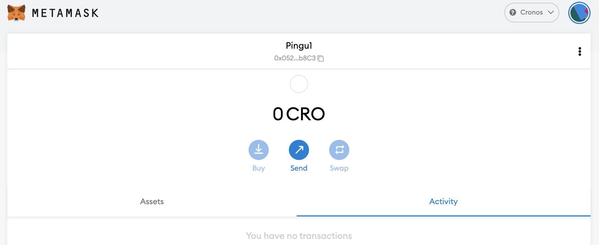

# How to get started on Cronos

## What is Cronos

It will be hard to explain what Cronos is without mentioning Crypto.com. Crypto.com is one of the biggest centralized exchanges (also known as CEX) and is building its own set of chains, including Crypto.org Chain and Cronos. Crypto.org Chain is a chain with a proprietary technology while Cronos is its EVM (Ethereum Virtual Machine) compatible sister. It's pretty much the same thing as the Binance Chain dedicated to the CEX, and Binance Smart Chain that is EVM compatible.

Among other advantages, Cronos presents **EVM-compatibility**, which means that most applications that launched on other EVM chains can also be deployed to Cronos, including Mai Finance, and **Scalability**: Cronos is faster and cheaper than the Ethereum Mainnet.

## Getting started on Cronos

In order to use the Cronos network, you will need a wallet address. Because Cronos is an EVM-compatible network, it will accept the same wallets as on other EVM-compatible chains, including web wallet like Metamask or Nifty, and you will be able to use your hardware wallet such as Trezor or Ledger.

For this tutorial, we will stick to Metamask like for all the other guides on this site. If you don't have Metamask installed, you can find instructions on [How to get started on Polygon](../polygon/how-to-get-started-on-polygon.md).

### Adding Cronos to Metamask

If you have installed the latest version of Metamask, you should already have access to the Cronos chain and there's nothing else for you to de besides selecting Cronos in the network dropdown at the top of Metamask. You can also set a new RPC yourself to access Cronos using these steps. Open the Metamask popup, click the icon of your wallet, navigate to `Settings` then chose `Networks` and find `Cronos`. The data you should get are as follows:

* **Network Name:** Cronos
* **New RPC URL:** https://evm-cronos.crypto.org
* **Chain ID:** 25
* **Currency Symbol:** CRO
* **Block Explorer URL:** https://cronos.crypto.org/explorer/

Save the changes, and Metamask will automatically switch you over to the Cronos network:

## Bridging to Cronos

### Faucets

There isn't any official faucet to get your first CRO tokens for your first few transactions. However, some application will provide this service if you bridge some funds to Cronos, or simply if you require some gas:

* [Crystl Finance Faucet](https://cronos.crystl.finance/faucet): After connecting your wallet and completing the captcha, you may be able to request some CRO to that will be sent to your wallet.
* [Elk Finance](https://app.elk.finance/#/elknet): When you're bridging your ELK tokens from one chain to another, you will have the option to swap a small portion of the transferred ELK into the native gas token of the destination chain. This is particularly useful if you're bridging assets for the first time to a new chain.

* [Crypto.com](https://crypto.com/): Don't forget that Cronos is a chain deeply linked to Crypto.com. You can create an account there, purchase your CRO tokens directly by linking a bank account, and send them to Cronos.


Keep in mind that you will need some gas token to be able to make transactions. This means that if you bridge assets from another chain to Cronos in an account without CRO tokens, you'll be stuck and will not be able to do anything. Make sure your wallet has enough funds to perform at least one swap transaction for gas token.


### Bridges

* [Relay Chain](https://app.relaychain.com/transfer#/) is the official partner of Mai Finance if you want to bridge your MAI to Cronos. RelayChain support bridging of MAI from a few different chains now, so you'll be able to send your assets from Polygon, Moonriver, Avalanche or Shiden to Cronos. Simply select the destination chain as Cronos, and the token to send (it is most of the time denominated as MAI, but sometimes it's also under miMATIC). Select the amount to transfer and initiate the transfer that shouldn't take more than 10 minutes. Pay attention to transfer fees. However, one good thing about RelayChain is that it will give you some CRO on the receiving side so that you can swap some MAI for CRO.

* [AnySwap](https://anyswap.exchange/#/router) is also a possibility for most chains if you want to transfer some assets to Cronos. As a side note, AnySwap also supports the transfer of MAI from Polygon to Cronos.
* [ElkNet](https://app.elk.finance/#/elknet) is a particular case since the bridge from Elk Finance will let you bridge the ELK token from any EVM-compatible chain to any other EVM-compatible chain where they're deployed with the possibility to swap a small portion of the transferred amount into gas token (see the section dedicated to Faucets just above).

### MAI Hub

In case you bridge some MAI from Polygon to Cronos via Relay Chain, you will get the RelayChain version of MAI instead of the native MAI minted by the application on Cronos. The 2 tokens (the one from RelayChain and the one from Mai Finance) have the same value and the same name, but different contract addresses, and the only one that will be accepted to farm yields on Cronos is the one from Mai Finance.

You can swap your MAI from Relay Chain using [the hub on Mai Finance](https://app.mai.finance/hub) with a 1:1 ratio, then you'll be able to use your true MAI on other platforms.

Don't forget that you will have to convert your true MAI into the Relay Chain version if you want to bridge them from Cronos to another chain.


It looks like AnySwap supports transfers of MAI from Polygon to Cronos, but you'll receive the AnySwap version of MAI that you will not be able to swap via the hub. You may be stuck with an unusable token, so make sure you're using the right bridge.


## DeFi on Cronos

Cronos being linked to Crypto.com, a lot of investments are flowing into the chain and DeFi applications are there to support liquidity. As such, you may be able to farm yields on the following platforms:

* [CroDex](https://swap.crodex.app/#/swap): This is one of the top DEXes (**D**ecentralized **Ex** changes) and AMMs (**A**utomated **M**arket **M**aker) on Cronos, and is a Uniswap v2 fork like QuickSwap. You will be able to swap your assets, participate in liquidity mining by providing LP (**L**iquidity **P**roviding) pairs in farms, or stake the native token of the platform to earn more rewards. CroDex is also the first official partner of Mai Finance on Cronos, and the only place where you'll be able to swap MAI for other assets, as well as participating in liquidity mining programs by farming the MAI-USDC and the MAI-CRO pairs.

When you farm on CroDex, you will get rewards on CRX tokens that you can stake in a Vault to get more CRX tokens, but there are other (better) options that will be presented in a future tutorial.

* [VVS](https://vvs.finance/) and [CronaSwap](https://app.cronaswap.org/): These are other DEXes/AMMs that are forks of PancakeSwap (another Uniswap fork) where you'll get the same features as on CroDex.
* [Beefy Finance](https://app.beefy.finance/#/cronos), [Adamant](https://adamant.finance/) and [Autofarm](https://autofarm.network/cronos/) are famous aggregators / yield optimizers that are present on many networks, and where you'll be able to deposit your LP tokens from most DEXes, and let the algorithms in charge of the pools harvest the farm tokens and compound the rewards into more LP tokens.
* [Crystl Finance](https://cronos.crystl.finance) is a straight goose fork that launched on Polygon first and is now also available on Cronos. Users will be able to deposit LP tokens in vaults in order to earn CRYSTL tokens that can be staked or farmed (or swapped).
* [Fortune DAO](https://www.fortunedao.com/#/) is the main Ohm (Olympus) fork on Cronos that accepts DAI and USDC.

## Mai Finance on Cronos

Currently the application is not fully launched yet and is mostly waiting for ChainLink Oracles to accept tokens as collaterals. The Hub is already present, so you can expect a launch in the first quarter of 2022.

## Disclaimer

This guide is NOT financial advice, and should simply be regarded as an educational tool. Always do your own research. Discussion of a project in this guide should not be considered as an endorsement of the project.


Keep in mind that a strategy that works well at a given time may perform poorly (or make you lose money) at another time. Please stay informed, monitor the markets, keep an eye on your investments, and as always, do your own research.

