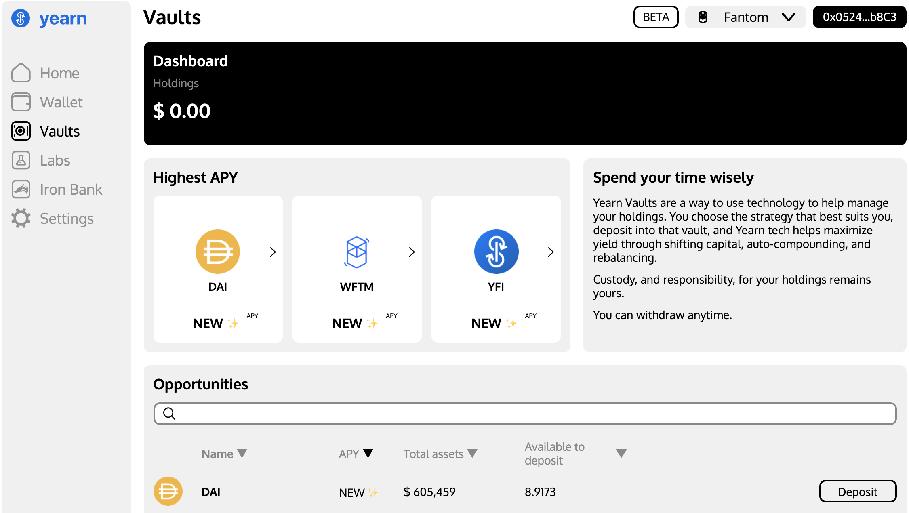
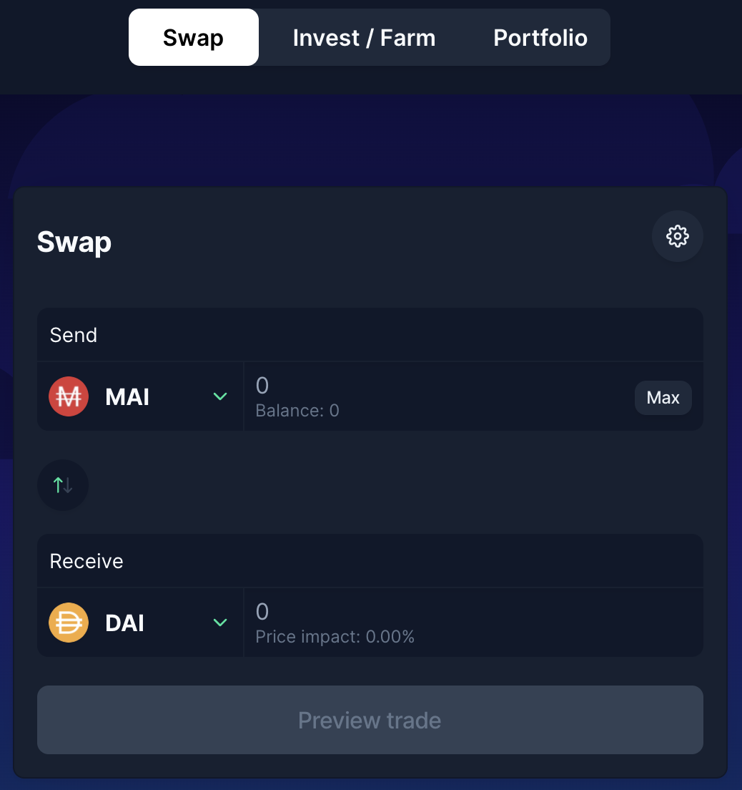

# Leverage your crypto on Fantom

## Introduction

Mai Finance has launched its lending platform on Fantom with many different vault types, enabling the possibility to mint the MAI stable coin based on the assets you will deposit in a vault. The idea is that you will be able to keep your crypto currencies and benefit from their price appreciation, while still being able to buy other coins and farm yields with high APRs. If you use your loan to buy more of the same asset you already deposited, this is what is called leveraging your tokens. We will show you the benefits of this strategy using 2 different lending platforms on Fantom to leverage our DAI tokens.

## Leverage your Yearn Vault tokens

### Deposit your assets on Yearn Finance

[Yearn Finance](https://beta.yearn.finance/#/home) is a group of protocols running on the Ethereum Mainnet and other blockchains that allow users to optimize their earnings on crypto assets through lending and trading services. On Fantom, the product that we will be using is the vaults on yearn finance. This is a tool that will accept single token deposits and will make you earn yields on this deposit. As a proof of deposit, you will receive a yvToken. In our case, we will deposit DAI and will get yvDAI in exchange.


The yearn finance website is still in beta mode on Fantom. The team is still working on the platform and APRs/APYs aren't showing. If you head to the Iron Bank tab, which is the lending/borrowing protocol on yearn platform, you'll see that lending DAI is getting \~8% APR. Please invest at your own risk.


### Deposit your yvToken on Mai Finance

Once you deposited your DAI on yearn finance, you should have yvDAI in your wallet. This is what we call a yield bearing token: it's a token that doesn't have any value per se, but represents your share of a pool where your assets are earning yields and in which rewards are automatically compounded. In other words, if your DAI doesn't change in value because the DAI is pegged to the US dollar, the underlying value of your yvDAI token increases anyway.

Mai Finance accepts a lot of different yield bearing tokens as collateral, including yvDAI. You can now deposit this token and borrow MAI against it.

.png>)

The yvDAI vault has a liquidation threshold of 110%, this means that you can borrow MAI so that the ratio between your collateral value and the debt value is 110%. Be careful that 110% is actually the ratio at which your vault will be liquidated. You need to keep the ratio above this minimum threshold. Since DAI doesn't vary much in price (less than a few cents up or down) it's possible to keep a "safe" CDR (**C**ollateral to **D**ebt **R**atio) of 115%, but feel free to keep something higher.

As always, to calculate the loan value we can get based on the value of our collateral and the target CDR we want to get, we will use the following formula:

$$
MAI_{available} = \frac{Collateral_{value} - Debt_{value} * Target_{CDR}}{Target_{CDR}}
$$

​With a collateral value of $100 and no debt, if we want to keep a healthy CDR of 115% we can borrow up to

$$
MAI_{available}=\frac{100-0*1.15}{1.15}=86.95
$$

​You are now in a position where you have your DAI earning yields in a Yearn vault, and you also have some MAI stable coin ready to use. Since we want to leverage our DAI position, we will now swap our MAI for more DAI.

### Swapping your MAI on BeethovenX

On Fantom, the main source of liquidity for MAI is [BeethovenX](https://app.beets.fi/#/trade). This is the main place where you will be able to swap your MAI tokens for more DAI for our strategy.

This is the last step of our loop. Now that you have more DAI you can deposit them in a Yearn vault and repeat the loop. Doing so increases the amount of assets you have in the Yearn vault, meaning that you will collect more rewards by lending your DAI on that platform. The APR/APY remains the same, but because you have more assets, you earn more yield, and if you compare to your initial investment, it's your APR that increases. If you want to get more examples on what APR you can achieve using the yvDAI loops, please go read our [camDAI token guide](../../polygon-tutorials/camdai-beginner-strategy.md#main-strategy) for Polygon that uses the exact same strategy but different tools.


BeethovenX is actually a fantastic opportunity to farm yields with your borrowed MAI. Simply deposit your MAI in the MAI-DAI-USDC pool (APR of \~30% as of November 2021) if you cannot achieve a better APR using leveraged loops.


$$
MAI_
$$

## Leverage your mooScreamTokens on Mai Finance

### Deposit your assets on Beefy Finance

[Beefy Finance](https://app.beefy.finance/#/fantom) is a Decentralized, Multi-Chain Yield Optimizer platform that allows its users to earn compound interest on their crypto holdings. In other words, you can deposit some assets or LP tokens from other platforms on Beefy Finance and let the auto-compounder harvest farm tokens and compound them into more of your deposited asset / LP token. For our exemple, we will use single DAI deposits on Beefy and use [Scream](https://scream.sh/lend) as the underlying platform. Scream is a Compound fork on the Fantom network on which you will be able to lend your assets and collect SCREAM tokens. Beefy will then sell the SCREAM tokens for more DAI.

To deposit our DAI, we will visit the Beefy Finance app and select Scream as the platform on which we will farm yields. You can also add the DAI filter in order to get the direct DAI deposit.

As you can see, Beefy is already giving an unbelievable APY on DAI single deposits. Once you have your DAI deposited on Beefy, you should have a proof of deposit in your wallet under the form of mooScreamDAI tokens. As for the yvDAI token, the mooScreamDAI token is a yield bearing deposit, meaning that you asset is still used on Scream and compounded on Beefy, earning yields. But you will be able to use this token on Mai Finance to borrow MAI against them.

### Deposit your mooScreamToken on Mai Finance

Once you deposited your DAI on yearn finance, you should have mooScreamDAI in your wallet. You can use the exact same steps as for the Yearn Vault strategy above, the only difference is that the mooScreamDAI liquidation ratio is 135%. Since DAI is a stable coin, it's still possible to borrow MAI and keep a CDR very close to the liquidation ration. For our exemple, we will aim at a 140% CDR, and with the same formula as above, we can calculate the amount of MAI we can mint with 100$ worth of DAI.

$$
MAI_{available}=\frac{100-0*1.4}{1.4}=71.43
$$

​Since we are borrowing less, we will be able to perform less loops and the final equivalent APY will also be lower, however this is still a pretty good beginner strategy.

The rest of the loop is the same as for yvDAI, meaning you will have to swap your MAI for DAI on BeethovenX and repeat until you're satisfied.

## Some notes on leveraging strategies

Leverage DAI is considered a beginner strategy in the sense that it presents very little risk (you are working with stable coins) and you can get some nice yields using at most 3 protocols. However, there's still _some_ risk.

### Liquidation risk

The more loops you will perform, the higher the liquidation risk. Indeed, even a small variation of the DAI price will be magnified by the leverage you applied, and even if you keep a CDR 5 points above the liquidation ratio, your vault can be at risk. It's always a good idea to stop the leverage loops at the step where you deposit your assets on MAI finance and don't borrow additional MAI in order to keep a better CDR.

Also, in case of a liquidation, because your vault on MAI finance contains a lot more assets, a liquidation will also have a bigger impact than if you didn't levered your position, simply because the debt you have to repay is also much bigger.

### Technology risk

If you use a lot of protocols for your investment legos, you need to make sure that these protocols are safe. Indeed, in our leveraging strategy, if a single protocol gets hacked, the entire strategy may collapse. Make sure you do your due diligence before investing in DeFi projects.

### Hitting debt ceilings

Because these strategies are easy to set and present low risks, there's a very high demand for them. However, you certainly noticed that in the leverage process, borrowed MAI is swapped for DAI (or other tokens). If too much MAI is sold on Beethoven, its price will decrease slowly and there is a risk for MAI to lose its peg, which is pretty bad for a stable coin. In order to let time for the price to stabilize, Mai Finance has security mechanisms in place, and the most important one is a debt ceiling for each vault.

A debt ceiling represents the maximum number of MAI that can be minted for a given vault. Once the ceiling is reached, no more MAI can be borrowed. Then the core team in charge of MAI finance can decide to increase the ceiling or wait a little more for a better price for MAI.

You can at all time verify the amount of MAI that can be minted on the [vault creation page](https://app.mai.finance/vaults/create), but you will usually notice that there aren't any more MAI if you get the following error message:

This error message will appear even if your health factor is correct. In most cases, waiting for the ceiling to be increased is the only solution. Keep an eye on twitter or on Discord to know when this happen.

## Disclaimer

This guide presented some of the ways you can use your assets on Fantom and include Mai Finance to your strategy in order to increase your gains. However, as usual, this tutorial isn't a financial advice and you should always DYOR before applying an investment strategy, and invest in a responsible manner.

Keep also in mind that this solution may not be the best strategy depending on when you plan to use it. We just highlighted that BeethovenX has pretty interesting APRs too for your MAI, and you can also use Beefy Finance to compound the BEETS rewards into more stable coins.


Keep in mind that a strategy that works well at a given time may perform poorly (or make you lose money) at another time. Please stay informed, monitor the markets, keep an eye on your investments, and as always, do your own research.

