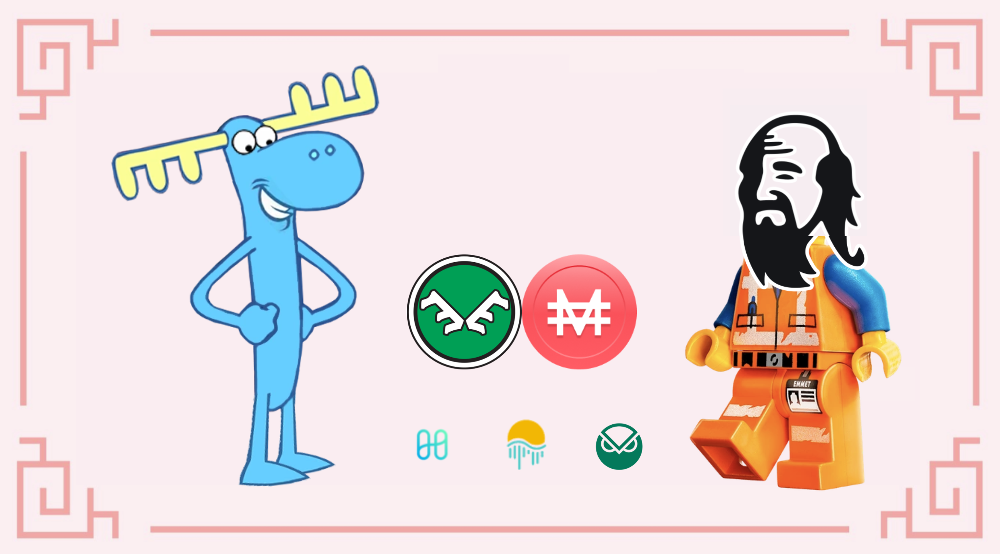
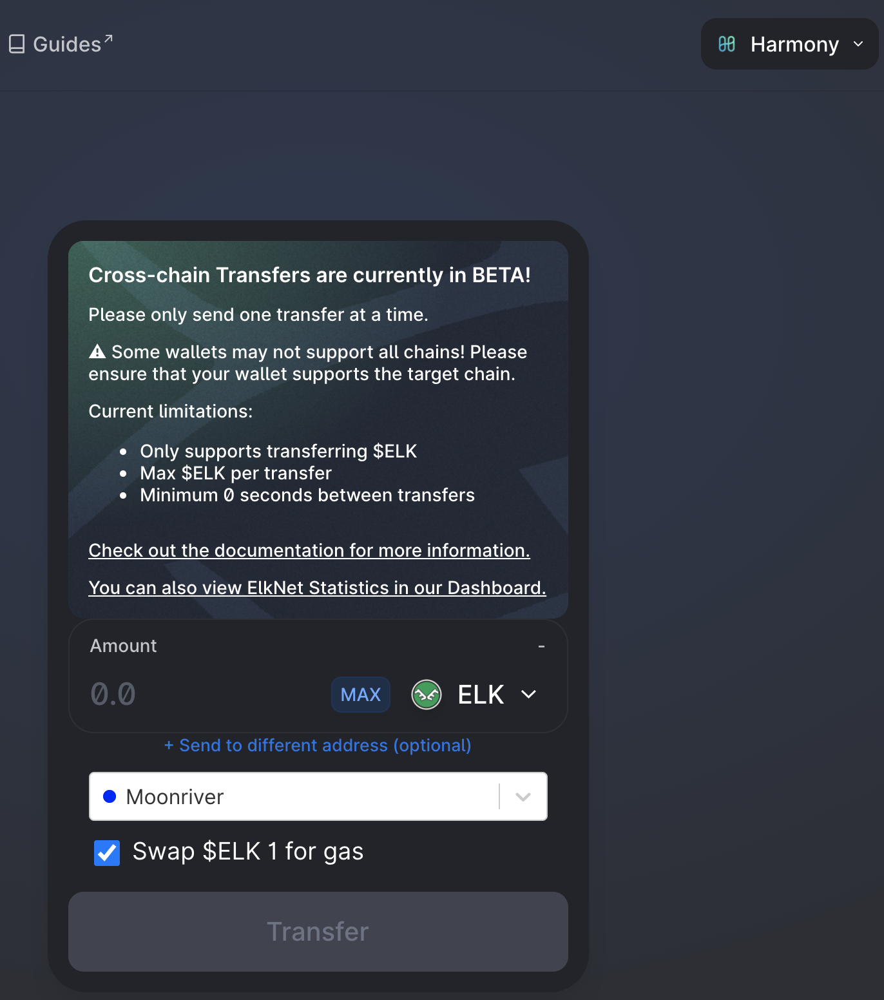
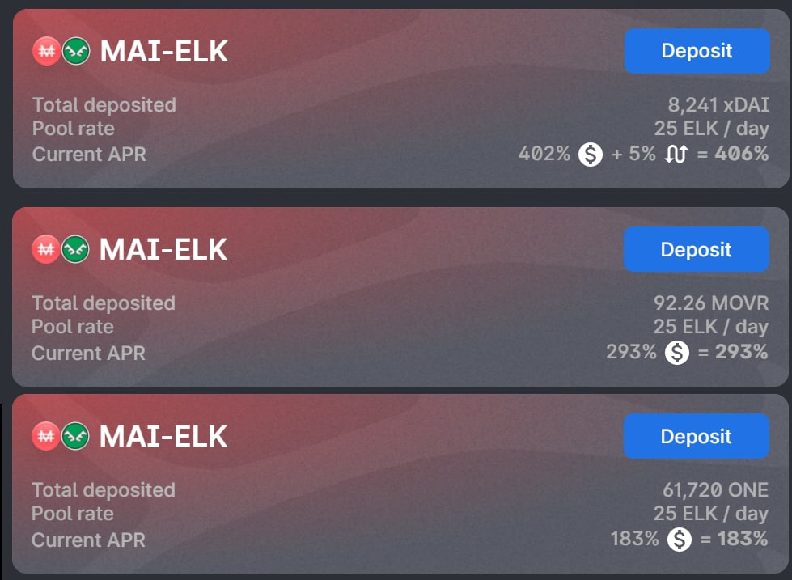
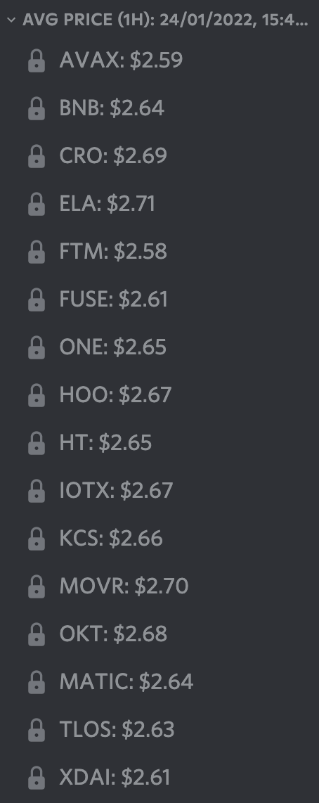

# Ein LP Paar, viele Farmmöglichkeiten

## Einleitung

Das Bereitstellen von Liquidität auf einer DEX (Decentralized EXchange) und das Farmen von Belohnungen ist eine der gängigsten Methoden, um in DeFi (Decentralized Finance) Renditen zu erwirtschaften. Viele Nutzer achten jedoch nur auf die Raten des LP-Pools (Liquidity Providing), in den sie einsteigen, ohne wirklich zu prüfen, ob die Rate ein APR (Annual Percentage Reward) oder ein APY (Annual Percentage Yield) ist. Es gibt viele Möglichkeiten, einen Pool zu farmen und die Belohnungstoken zu verwalten. In diesem Leitfaden sehen wir uns einige der verschiedenen Möglichkeiten an, wie du einen der neuesten Pools auf Harmony, MAI-ELK, farmen kannst und was du mit den ELK-Tokens, die du als Belohnung erhältst, machen kannst.


Dieser Leitfaden ist definitiv keine Finanzberatung, sondern wurde mit einem pädagogischen Ziel erzeugt. Du musst auf Preisschwankungen, Angebot und Nachfrage, Belohnungsprogramme, Endtermine, impermanente Verluste usw. achten ... Das Ziel war nicht, Empfehlungen zu geben, die man blind befolgen kann. Mach also bitte deine Hausaufgaben und deine eigenen Simulationen und investiere nur so viel, wie du bereit bist, möglicherweise zu verlieren.


## Elk Finance

[Elk Finance](https://app.elk.finance/#/) ist eine DEX, der von Uniswap v2 abgezweigt wurde, sowie ein AMM (**A**utomoated **M**arket **M**aker). Du findest hier alle üblichen Funktionen von Uniswap-Forks: Du kannst mit deinem Vermögen handeln, deine verschiedenen Kryptowährungen zu LP-Token kombinieren, einige LP-Paare farmen und ihren nativen Token, den ELK, staken.

Was Elk Finance jedoch zu einem völlig anderen Projekt macht, ist seine Präsenz auf vielen Blockchains, und nicht nur auf den EVM-kompatiblen Chains (**E**thereum **V**irtual **M**achine). Tatsächlich ist Elk Finance derzeit auf 16 Chains vertreten und plant, auf viele weitere zu expandieren. Es ist ihnen gelungen, eine Brücke zwischen all diesen Chains zu bauen, damit die Nutzer den ELK-Token übertragen können: Das ELKNET.

Eine weitere coole Funktion, die ElkNet anbietet, ist die Möglichkeit, einen Teil des übertragenen Guthabens gegen einen Gas-Token am Zielort zu tauschen. Das ist besonders nützlich, wenn du zum ersten Mal auf eine Block Chain triffst, auf der es keinen Faucet gibt.


Mit Ausnahme von Ketten, bei denen der Gasverbrauch hoch ist (zum Zeitpunkt der Erstellung dieses Artikels nur Avalanche und Cronos), ist die Nutzung von ElkNet zur Überbrückung deiner ELK-Token von einer Kette zur anderen kostenlos. Du hast richtig gelesen, du zahlst keine Überbrückungsgebühren!


Schließlich bietet Elk Finance einen Schutz vor impermanenten Verlusten. Du kannst alle Details über das Impermanent Loss Programm in der [offiziellen Dokumentation](https://docs.elk.finance/features/impermanent-loss-protection) nachlesen, aber im Grunde musst du nur wissen, dass du zusätzliche ELK zahlen musst, um den impermanenten Verlust auszugleichen, wenn sich der ELK-Kurs zwischen deiner Einzahlung und deiner Auszahlung ändert. Da MAI an 1 USD gebunden ist, hängt der impermanente Verlust nur von der Preisentwicklung des ELK ab, so dass du immer ein Gewinner bist, wenn du bei Elk Finance DEX in LP-Pools einsteigst.

## Farmen des MAI-ELK LP Paars

Elk Finance ist im Januar 2022 eine Partnerschaft mit Mai Finance eingegangen, um das Farmen von Token mit dem MAI-ELK LP-Paar auf ihrer DEX anzubieten. Das MAI-ELK-Paar kann vorerst in 3 verschiedenen Netzwerken verwendet werden: Harmony, Moonriver und Gnosis. Einige weitere Pools könnten später auf Polygon, Cronos und Fantom eingeführt werden. Lasst uns die verschiedenen Strategien anschauen, die ihr für diesen neuen Pool anwenden könnt.


Wir schlagen diesen Leitfaden für Harmony vor, weil die Gasgebühren sehr günstig sind und du deine Belohnung täglich manuell aufstocken kannst. Das macht sie zu einer sehr guten Blockchain für Anfänger, die nur ein paar Dollar als Spielgeld investieren können. Alles, was in diesem Leitfaden beschrieben wird, kann jedoch auch auf jede andere Chain angewendet werden.


### Farmen und Staken

Die allererste Strategie ist ziemlich simpel:

* kombiniere dein LP-Paar
* zahle die LP in den MAI-ELK-Pool ein und erhalte 200% APR
* ernte deine Belohnungen täglich
* stake mit 32,53% APR

Wenn du mit 100 $ beginnst, kannst du ein ganzes Jahr lang Monat zu Monat die folgenden Ergebnisse erzielen, vorausgesetzt, die oben genannten Raten bleiben über den gesamten Zeitraum gleich.

| Tag | MAI-ELK ($) | Gestaktes ELK ($) |
| --- | ----------- | ----------------- |
| 30  | 100.000     | 16.653            |
| 60  | 100.000     | 33.756            |
| 90  | 100.000     | 51.323            |
| 120 | 100.000     | 69.366            |
| 150 | 100.000     | 87.897            |
| 180 | 100.000     | 106.930           |
| 210 | 100.000     | 126.479           |
| 240 | 100.000     | 146.557           |
| 270 | 100.000     | 167.180           |
| 300 | 100.000     | 188.360           |
| 330 | 100.000     | 210.115           |
| 360 | 100.000     | 232.458           |

Am Ende des Jahres hättest du

* MAI-ELK LP-Token im Wert von 100,00 $ im Pool
* 236,24 $ an gestaketen ELK-Tokens

Das entspricht einem effektiven Jahreszins von 236,24 %. Es ist nicht genau APR, weil ein Teil der Belohnung aufgezinst wird (die gestaketen ELK).


Du findest alle Ergebnisse und die Formel, mit der diese Tabelle erstellt wurde, in [folgendem Google Sheet](https://docs.google.com/spreadsheets/d/1Vva5dhjYix0g4bMZRSAMIutDgbT08TsTLhVJE0TUrF8/edit?usp=sharing) im ersten Reiter. Du kannst diese Datei auf dein eigenes Laufwerk kopieren und die Zinssätze und die Anfangsinvestition anpassen, um zu sehen, wie sich der Gesamtwert mit der von dir eingegebenen Zahl verändert.


### Farmen und Thesaurieren

Thesaurieren bedeutet, dass du deine Belohnungen erntest und sie dazu verwendest, zusätzliche LP-Token zu erzeugen. In unserem Fall würdest du:

* deine ELK Belohnungen ernten
* 50% für MAI verkaufen
* zu einem zusätzlichen MAI-ELK-LP-Token kombinieren
* in den Pool einzahlen

Wenn du mit der gleichen Anfangsinvestition von 100 $ beginnst, kannst du für ein komplettes Jahr Farmen folgende Ergebnisse erwarten, vorausgesetzt, die angegebenen Raten bleiben für die gesamte Dauer des Farmens gleich:

| Tag | MAI-ELK ($) |
| --- | ----------- |
| 30  | 117.172     |
| 60  | 138.044     |
| 90  | 162.635     |
| 120 | 191.607     |
| 150 | 225.739     |
| 180 | 265.952     |
| 210 | 313.328     |
| 240 | 369.143     |
| 270 | 434.901     |
| 300 | 512.374     |
| 330 | 603.647     |
| 360 | 711.179     |

Und am Ende des Jahres hättest du

* $730.878 im Wert von MAI-ELK LP Token im Pool

Das entspricht bei einer Anfangsinvestition von $100 einem effektiven Jahreszins von 630,88%. Da wir die Belohnung thesaurieren, entspricht dies genau dem effektiven Jahreszins, den du bei einem APR von 200 % erhalten würdest.

Übrigens: Die Formeln zur Berechnung des effektiven Jahreszinses aus einem APR mit täglicher Aufzinsung (oder eines APR aus einem APY) lauten wie folgt:

$$
APY = ( 1 + \frac{APR}{N})^N-1
$$

$$
APR = N * (( 1 + APY)^\frac{1}{N} - 1)
$$

Dabei ist N die Anzahl, wie oft du deine Belohnungen zusammensetzt. In unserem Fall würde uns die Formel 2 Folgendes liefern

$$
APY = ( 1 + \frac{2}{365})^{365}-1 = 634.88\%
$$

$$
APR = 365 * (( 1 + 6.3488)^\frac{1}{365} - 1) = 199.99\%
$$

Es ist leicht zu sehen und zu verstehen, dass du mit einem APR von 200% (dem APR des LP-Pools) auf deine Belohnung bessere Erträge erzielst als mit einem APR von 32,53% (dem APR des Stakens). In diesem Sinne ist Thesaurieren viel besser als Staken, solange der APR des Farmers über dem APR des Stakings liegt. Das kann sich natürlich mit der Liquidität des Pools ändern.


Wie im vorherigen Abschnitt findest du die Simulation im gleichen [Google SpreadSheet](https://docs.google.com/spreadsheets/d/1Vva5dhjYix0g4bMZRSAMIutDgbT08TsTLhVJE0TUrF8/edit?usp=sharing) im zweiten Reiter.


### Farme und Thesauriere mit Mai Finance

Wenn Staken und Thesaurieren gute Renditen bringen, sind beide Methoden direkt an den Preis des ELK-Tokens gekoppelt, sodass der Wert deiner Investition mit dem ELK-Preis schwankt. Wir haben bereits gesehen, dass das Thesaurieren im Vergleich zum Staken bessere Optionen bietet. Jetzt sehen wir, wie du einen Teil des Wertes deiner Belohnungen beim Farmen mitnehmen und mit Mai Finance weiter in denselben Pool investieren kannst. Der Tagesablauf sieht folgendermaßen aus:

* Ernte die ELK Belohnungen
* Verkaufe 66% der Belohnung, um einen Blue Chip Token zu kaufen, der bei Mai Finance als Sicherheit akzeptiert wird. In unserem Beispiel werden wir den ONE-Token verwenden.
* Deponiere die ONE-Token in deinem Vault bei Mai Finance
* Leihe dir zusätzliche MAI zu 200% CDR (**C**Sicherheiten zu **D**Schulden **R**atio), deren Wert deinen verbleibenden ELK-Tokens entspricht
* kombiniere sie zu zusätzlichen MAI-ELK-LP-Token
* in den Pool einzahlen


Die Umwandlung deiner Belohnungen in ONE ist vielleicht nicht die sicherste Art, dein Vermögen zu schützen. Eine der besten Möglichkeiten ist die Umwandlung in Stable Coins. Zum Zeitpunkt des Verfassens dieses Artikels sind die Optionen für Mai Finance auf Harmony jedoch ziemlich begrenzt. Vielleicht gibt es in Zukunft (nach Januar 2021) bessere Optionen, wie z.B. das Staken von DAO LP Token als Sicherheit (siehe unseren [speziellen Artikel für Polygon](../polygon/the-elephant-and-the-otter.md), um zu sehen, wie du Stake DAO Token auf Mai Finance verwenden kannst).


Wenn du mit der gleichen Anfangsinvestition von 100 $ beginnst, kannst du für ein ganzes Jahr Farmen folgende Ergebnisse erwarten, vorausgesetzt, die angegebenen Raten bleiben während der gesamten Farmenzeit gleich und dein Vault wird nicht liquidiert:

| Tag | MAI-ELK ($) | ONE ($) | Mai Schulden ($) |
| --- | ----------- | ------- | ---------------- |
| 30  | 111.154     | 11.560  | 5.780            |
| 60  | 124.003     | 24.456  | 12.228           |
| 90  | 138.337     | 38.842  | 19.421           |
| 120 | 154.328     | 54.892  | 27.446           |
| 150 | 172.168     | 72.797  | 36.398           |
| 180 | 192.070     | 92.772  | 46.386           |
| 210 | 214.273     | 115.055 | 57.528           |
| 240 | 239.042     | 139.915 | 69.958           |
| 270 | 266.674     | 167.648 | 83.824           |
| 300 | 297.501     | 198.588 | 99.294           |
| 330 | 331.891     | 233.106 | 116.552          |
| 360 | 370.257     | 271.609 | 135.805          |

Und am Ende des Jahres hättest du

* MAI-ELK LP-Token im Wert von 377.069 $ im Pool
* 278.446 $ an EINEN Token in deinem ONE Vault
* Schulden im Wert von 139.223 $ aus deinem Tresor
* ein CDR von 200%, wie erwartet

Ausgehend von einer Ausgangsposition von MAI-ELK im Wert von 100 $ würde dies einen Gesamtertrag von 416,29 % bedeuten. Im Vergleich zum reinen Thesaurieren erhalten wir hier etwas weniger Gewinne, aber wir haben auch einen großen Teil unserer Gewinne in ONE investiert, das weniger volatil ist als ELK und daher weniger Risiken birgt.


Auch hier findest du die Simulation im gleichen [Google SpreadSheet](https://docs.google.com/spreadsheets/d/1Vva5dhjYix0g4bMZRSAMIutDgbT08TsTLhVJE0TUrF8/edit?usp=sharing) im dritten Reiter.


Alternativ kannst du auch alle deine ELK-Belohnungen für Token verkaufen, die bei Mai Finance akzeptiert werden, dir MAI leihen und einen Teil davon verkaufen, um zusätzliche ELK zu kaufen, um deine Position im MAI-ELK-Pool zu erhöhen. Auf diese Weise erhöhst du dein Engagement bei ONE, aber auch deine Schulden. Am Ende hättest du 270.715 USD an MAI-ELK, 352.913 USD an ONE und 171.457 USD an Schulden, was einem Gesamtwert von 342,17 % entspricht.

## Einfluss der Häufigkeit wie oft du thesaurierst&#x20;

Unabhängig davon, ob du deine Belohnung staken oder thesaurieren willst, ist es wichtig zu wissen, dass sich deine Belohnung ändert, je nachdem, wie oft du deine Ernte- und Investitionsroutine durchführst. Zur Erinnerung: Die Formel, die den effektiven Jahreszins und den APR miteinander verbindet, lautet wie folgt:

$$
APY = ( 1 + \frac{APR}{N})^N-1
$$

In dieser Gleichung steht N für die Anzahl der Aufzinsungen, die du pro Jahr für deine Belohnung vornimmst. Bei einem APR von 200% (siehe oben) würdest du also je nach Häufigkeit der Aufzinsung den folgenden effektiven Jahreszins erhalten:

| Frequenz des Thesaurierens | APY      |
| -------------------------- | -------- |
| Täglich                    | 634.88 % |
| Tweimal die Woche          | 625.01 % |
| Wöchentlich                | 611.71 % |
| Zwei mal im Monat          | 609.55 % |
| Monatlich                  | 535.86 % |
| Jedes Quartal              | 406.25 % |
| Halbjährlich               | 300.00 % |

Mehr als einmal am Tag manuell zu thesaurieren, kann je nach Chain teuer werden. Aber im Grunde ist es klar, dass die Belohnung umso besser ist, je öfter du thesaurierst. Das erklärt auch, warum Rendite-Optimierer / Auto-Compounder so beliebt sind. Bedenke, dass du durch das Thesaurieren den Verkaufsdruck auf den Token, den du farmst, erhöhst, was sich negativ auf den Preis dieses Tokens auswirken wird. Wenn das auch der Token ist, den du zum Farmen verwendest (in unserem Beispiel ELK), kann es zu impermanenten Verlusten kommen, es sei denn, du nutzt Elk Finance DEX, der dich vor impermanenten Verlusten schützt.

## Wahl des richtigen Pools

Das MAI-ELK-Paar wurde in mehreren Chains eingesetzt, so dass du dein Kapital in der Chain einsetzen kannst, die die besten Kurse bietet.


Der MAI-ELK-Pool könnte in naher Zukunft auch auf anderen Chains eingesetzt werden, möglicherweise auf Polygon, Cronos und Fantom. Das ist nicht garantiert und es gibt auch keinen Termin dafür. Halte dich auf dem Laufenden, indem du die unterschiedlichen Discord-Server der beiden Projekte besuchst oder ihnen auf Twitter folgst.


Neben der Höhe der Belohnung auf jeder Chain musst du auch den Preis des ELK Tokens auf jeder Chain berücksichtigen. Wenn der Preis auf allen Chains fast gleich ist, kann der winzige Unterschied auch ein Grund dafür sein, dass du dich für die Chain entscheidest, auf der du den ELK-Token farmen willst.

Wie du siehst, bietet der MAI-ELK-Pool auf Moonriver eine bessere Belohnung, und der ELK-Token hat auf dieser Chain auch einen höheren Preis. Das bedeutet, dass es zum Zeitpunkt der Erstellung dieses Artikels besser ist, den MAI-ELK-Pool auf Moonriver zu farmen als auf Harmony oder Gnosis, vor allem, wenn du vorhast, einen Teil der gefarmten Token zu verkaufen. Achte also darauf, dass du deine Chain richtig auswählst und deine eigenen Nachforschungen anstellst, bevor du einem LP-Pool beitrittst. Schließlich wird dringend empfohlen, die [Dokumentation zum IL-Schutz](https://docs.elk.finance/features/impermanent-loss-protection) zu lesen, da die Versicherung stark von der Anzahl der Tage abhängt, an denen deine LP-Token im Pool hinterlegt sind.

Nebenbei bemerkt: Da das Überbrücken von ELK kostenlos ist, kannst du möglicherweise von einer Chain zur anderen wechseln, um immer von den besten Tarifen zu profitieren. Mach dir klar, dass du damit auch die Belohnungssätze des Pools, den du verlässt, und des Pools, dem du beitrittst, beeinflusst (weniger Liquidität erhöht den APR, mehr Liquidität senkt ihn).

## Haftungsausschluss

Dieser Leitfaden soll dir die verschiedenen Möglichkeiten zum Farmen von Yields mit liquiditätsbringenden Token aufzeigen. Die von dir gewählte Strategie hat großen Einfluss auf deine Gewinne und das Risiko, dem du ausgesetzt bist. Natürlich gelten alle in diesem Dokument dargelegten Konzepte auch für jedes LP-Paar und es wird dringend empfohlen, eigene Simulationen durchzuführen, bevor du dich für eine Strategie, ein LP-Paar, einen Pool oder sogar eine DEX entscheidest.


Denke daran, dass eine Strategie, die zu einem bestimmten Zeitpunkt gut funktioniert, zu einem anderen Zeitpunkt schlecht abschneiden (oder Geldverluste erzeugen) kann. Bitte bleibe informiert, beobachte die Märkte, behalte deine Investitionen im Auge und recherchiere wie immer selbst.

