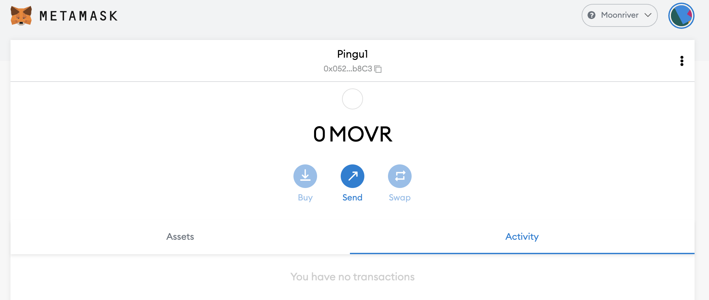
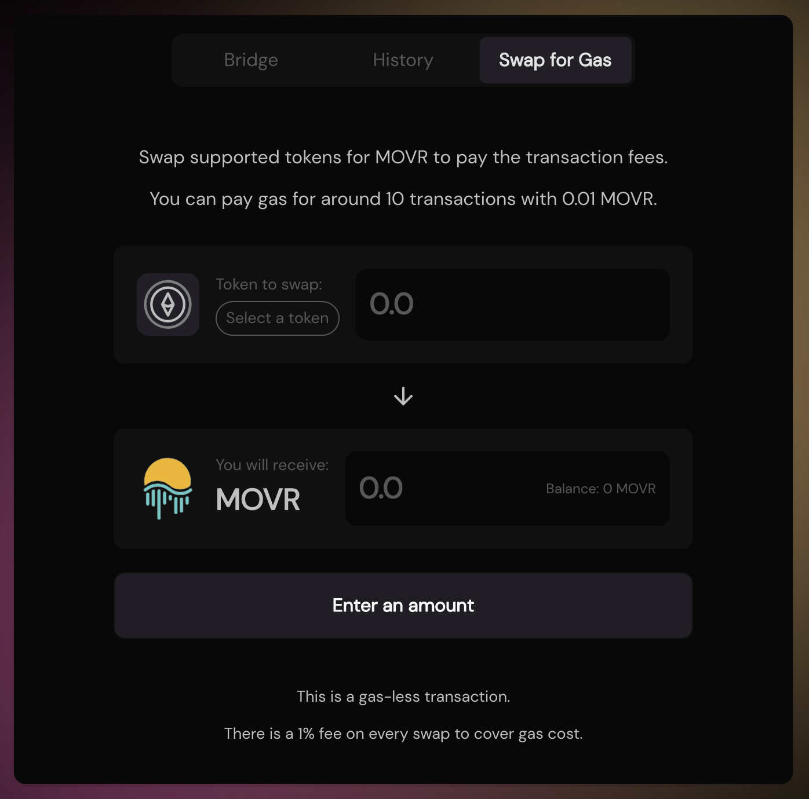
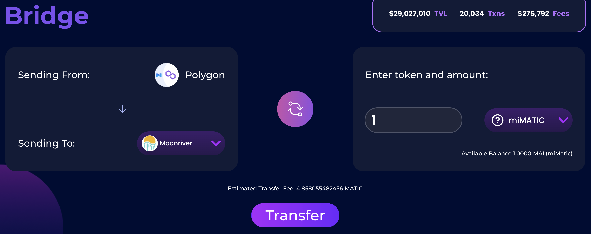
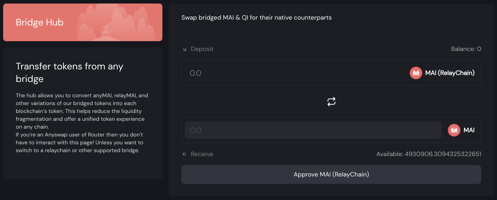
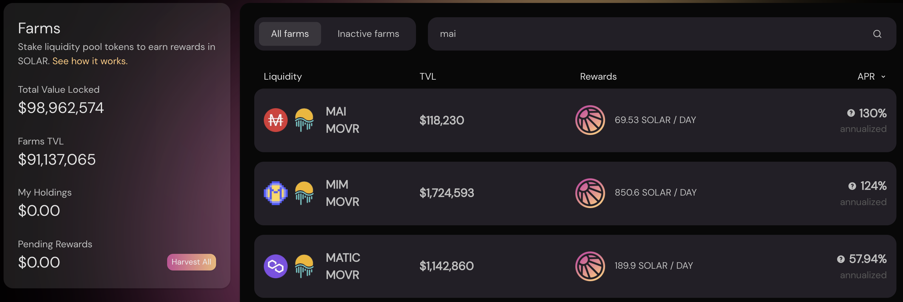
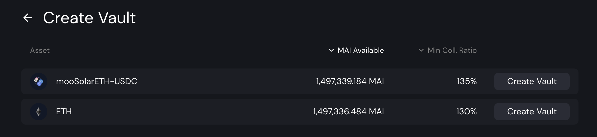

# How to get started on Moonriver

## What is Moonriver

It is going to be complex to explain what is Moonriver without talking about a few other chains too, including MoonBeam, Kusama and Polkadot.

Polkadot is a L1 block chain that directly competes with Ethereum, Cosmos or Eos, and the goal of the chain is to grow a complete ecosystem of cryptocurrencies and applications. One of the main point that makes Polkadot different from other L1 is its separation into a main chain (the relay chain) and user-created networks (parachains). The Relay Chain benefits from low requirements in terms of computing resources since most developments and tests are made on parachains. On the other hand, parachains inherit from the same security as the relay chain. This also creates isolated environments that can work in an autonomous fashion and won't disclose user data to the main chain.

Kusama is a pre-production environment for Polkadot, a separate chain that mimics the main Relay Chain of Polkadot, and where all the developments and updates for the main chain are tested first. However, as a pre-production environment, Kusama operates with real crypto-currencies and real transactions, but with looser rules than on Polkadot. However, the goal of the applications and side chains developed on Kusama is to be migrated to Polkadot at some point. Because of the looser rules, it's easier for a project to test things and grow a community while developing the protocol. Once the final product is ready, everything can migrate to the production environment.

Moonriver is actually a parachain on Kusama. Code that is deployed to Moonriver is a test version of the code that can be deployed on Moonbeam, the production version of Moonriver on Polkadot. Once the code is validated on Moonriver, it can ship to Moonbeam. Moonbeam and Moonriver are 2 chains that are EVM compatible, meaning that they accept the same smart contracts as other chains compatible with the Ethereum network. Because of this, Moonriver quickly become the entry point of many DApps (**D**ecentralized **App**lications) that wanted to expand from the Ethereum network (Eth Mainnet, Polygon, Avalanche, Fantom ...) to the Polkadot network.

As other EVM compatible chains, Moonriver uses a gas token used to verify transactions: the MOVR token.

## Getting started on Moonriver

Before usign the Moonriver network, you will need a wallet address. Because Moonriver is an EVM network, it will accept the same wallets as on other EVM chains, including web wallet like Metamask or Nifty, and you will be able to use your hardware wallet such as Trezor or Ledger, but you may have to follow extra steps to be able to connect your cold wallet to the network. You can find a very clear step by step guide on the [official moonbeam foundation doc](https://moonbeam.foundation/tutorials/how-to-create-moonriver-ethereum-address/).

For this tutorial, we will stick to Metamask like for all the other guides on this site. If you don't have Metamask installed, you can find instructions on [How to get started on Polygon](../polygon/how-to-get-started-on-polygon.md).

### Adding Moonriver to Metamask

In theory, Moonriver comes pre-installed with MetaMask, meaning that you should not have to add the chain information for Metamask to work. However, it may be a good idea to verify that your setup is correct by double checking the values saved into your local wallet. Open the Metamask popup, click the icon of your wallet, navigate to `Settings` then chose `Networks` and find `Moonriver`. The data you should get are as follows:

* **Network Name:** Moonriver
* **New RPC URL:** https://rpc.moonriver.moonbeam.network
* **Chain ID:** 1285
* **Currency Symbol:** MOVR
* **Block Explorer URL:** https://blockscout.moonriver.moonbeam.network/

Save the changes, and Metamask will automatically switch you over to the Moonriver network:

## Bridging to Moonriver

### Faucets

One of the biggest DEX on Moonriver, SolarBeam, offers [a gasless transaction swap](https://app.solarbeam.io/bridge/gas-swap) in case you're left without gas. This also assumes you have some funds on Moonriver, but cannot do anything because you have 0 MOVR in your wallet.

Note that only certain assets are accepted for this gasless transaction, and MAI isn't part of the supported coins.

### Bridges

* [Relay Chain](https://app.relaychain.com/transfer#/) is the official partner of Mai Finance if you want to transfer your MAI to Moonriver from Polygon. When you're connected to Polygon, you can simply chose the destination chain (Moonriver) and the asset you want to send (MAI or miMATIC) with the correct amount, and click on the `Transfer` button. Pay attention to the transfer fees.

* If you need to bridge other assets from other network, you can use Relay Chain (see above), [AnySwap](https://anyswap.exchange/#/bridge) will work if you want to bridge from Eth Mainnet to Moonriver, and of course you can also use the bridge feature from [Solarbeam](https://app.solarbeam.io/bridge).
* A special note for [Elknet](https://app.elk.finance/#/elknet) that will act both as a bridge and as a faucet when you transfer the ELK token between 2 networks. You will be able to bridge your ELK and on the receiving end, you can have a small portion of your ELK directly available as the gas token, MOVR in our case.

### Hub

In case you bridge some MAI from Polygon to Moonriver via Relay Chain, you will get the RelayChain version of MAI instead of the native MAI minted by the application on Moonriver. The 2 tokens (the one from RelayChain and the one from Mai Finance) have the same value and the same name, but different contract addresses, and the only one that will be accepted to farm yields on Moonriver is the one from Mai Finance.

You can swap your MAI from Relay Chain using [the hub on Mai Finance](https://app.mai.finance/hub) with a 1:1 ratio, then you'll be able to use your true MAI on other platforms.


As a side note, if you want to bridge your MAI from Moonriver to Polygon or other chains, you will have to convert them first into their RelayChain version.


## DeFi on Moonriver

Moonriver is getting a lot of traction and more and more applications are moving to this new chain, with a potential to fully migrate to Polkadot. As such, you will be able to farm yields on the following platform (list isn't complete):

* [Solarbeam](https://app.solarbeam.io): This is the main DEX and AMM on Moonriver. You will be able to swap your assets, participate in liquidity mining by providing LP (**L**iquidity **P**roviding) pairs in farms, or stake the native token of the platform. Solarbeam is also one of the first partner of Mai Finance on Moonriver, and you will be able to farm the MAI-MOVR pair. You will also find a MAI-USDC pool that isn't getting any rewards but may get some trading fees.

When you farm on Solarbeam, you will be rewarded in SOLAR tokens that you can then stake in a Vault for a certain vesting period and earn additional SOLAR tokens, or stake to gain other tokens exotic to the platform.

* [Huckleberry Finance](https://www.huckleberry.finance/): This is another DEX/AMM on Moonriver where you will be able to farm yiels, and possible use Beefy to compound your gains.
* [Beefy Finance](https://app.beefy.finance/#/moonriver): The famous auto-compounder is also on Moonriver and will help you compound your gains from both Solarbeam and Huckleberry. As a side note, Beefy doesn't propose the MAI-MOVR pair as of writing, but you may soon be able to use Beefy to harvest the SOLAR tokens and get more MAI-MOVR from the compounder.
* [Sushiswap](https://app.sushi.com/): No need to present SushiSwap! You'll be able to swap your assets and farm yields for certain LP tokens like you would do on any other chains. Rewards are granted in SUSHI and MOVR.
* [Rome DAO](https://romedao.finance/): This is the first OHM-fork on Moonriver. Bond your assets to get discounted ROME tokens that you can stake to gain very high APY. As time of writing, the 5-Day ROI is around 10.6%. RomeDAO currently accepts FRAX and MIM in its treasury, but may soon accept MAI also.

## Mai Finance on Moonriver

The lending platform is already available on Moonriver where you will be able to put your mooSolarETH-USDC tokens in a vault and borrow MAI against it. In order to do so:

* Create a ETH-USDC pair on Solarbeam
* Deposit the ETH-USDC pair on Beefy and get a mooSolarETH-USDC receipt token
* Deposit your mooToken on Mai Finance in [the appropriate vault](https://app.mai.finance/vaults/create)

Single ETH vault is also an option.

While your collateral is earning 44.08% APY from Beefy Finance (as of time of writing), you will be able to borrow MAI and farm the MAI-MOVR pool and get 128% APR on Solarbeam, or soon 158,058% APY on RomeDAO.

## Disclaimer

This guide is NOT financial advice, and should simply be regarded as an educational tool. Always do your own research. Discussion of a project in this guide should not be considered as an endorsement of the project.


Keep in mind that a strategy that works well at a given time may perform poorly (or make you lose money) at another time. Please stay informed, monitor the markets, keep an eye on your investments, and as always, do your own research.

