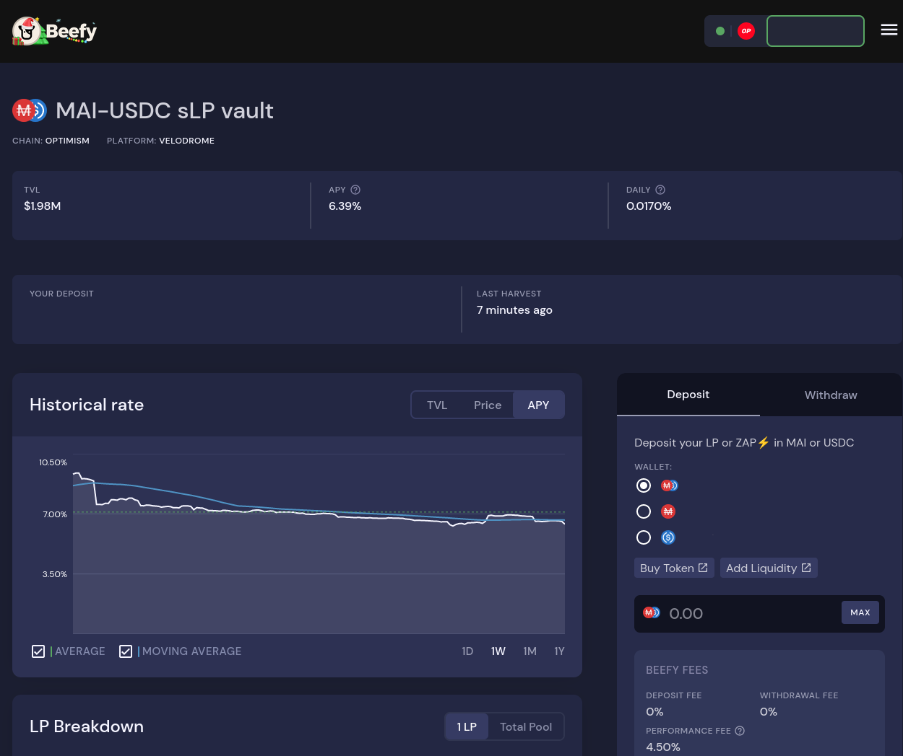

# Starter Guide for wstETH yield on Optimism

## Introduction

With incentives still flowing plentifully and various liquid staked ETH solutions launching, there are many easy ways to make simple yield during the bear market. Utilizing various protocols on Optimism, we will be generating yield with Lido’s staked ETH while also using our wstETH as collateral to borrow MAI. Depending on your risk tolerance and market forecast, there are a few different strategies we can employ.

<figure><figcaption></figcaption></figure>

## Protocols Used

### [QiDao (Mai Finance)](https://www.mai.finance/)

QiDao has released several vaults on Optimism that allow users to leverage their wstETH and other ETH derivatives. We can deposit our tokens as collateral and borrow MAI stablecoin (soft pegged to 1 USD) at 0% interest (0.5% repayment fee, 10% performance fee on interest-bearing collateral) for use in further yield activities.

### [Lido stETH](https://lido.fi/ethereum)

Lido staked Ether (stETH) is ETH's largest liquid staking token, and is used by many to enjoy ETH protocol yields without having to run their own staking operation. With wrapped stETH [recently becoming available on Layer 2 solutions](https://www.coindesk.com/tech/2022/10/06/lidos-steth-token-expands-to-layer-2-networks-optimism-and-arbitrum/) such as Optimism and Arbitrum, it has become much more accessible for small-sum holders to invest in ETH staking.

### [Beefy](https://beefy.finance/)

Beefy allows for autocompounding of farming rewards, which grows your position without any user interaction. Beefy vaults provide receipt tokens, which can also be used as MAI collateral. For users willing to accept the additional smart contract risk, Beefy Curve ETH/wstETH mooTokens provide higher yield than normal wstETH and can be used for MAI collateral.

### [Curve](https://curve.fi/)

Curve liquidity pools allow for single-token deposits, and provide low slippage and high liquidity for correlated assets (such as wstETH and ETH). We can deposit our ETH here to receive ETH/wstETH LP without needing to swap for wstETH first. We can also swap our ETH for wstETH if using only raw wstETH as MAI collateral.

### [Velodrome](https://app.velodrome.finance/)

Velodrome is an Optimism native automated market maker based on Solidly where users can deposit into volatile and stable liquidity pools. We can deposit our MAI into the MAI-USDC sLP and stake on Velodrome for VELO rewards. If you are long ETH, you can swap the VELO rewards into more wstETH to add to your collateral. If you want to grow your stable position, you can deposit the LP into Beefy to autocompound the rewards. Users who are long on Velodrome and the Optimism ecosystem can consider depositing VELO into the Beefy beVELO vault to receive Velodrome bribe income.

## Strategy Steps

For this example, we will be using Beefy Curve ETH/wstETH mooTokens as collateral. The steps are the same for raw wstETH, but instead you simply swap your ETH to wstETH and skip the first two steps, creating a wstETH MAI vault instead.

### 1. Deposit your ETH into the [Curve ETH/wstETH pool](https://curve.fi/#/optimism/pools/wsteth/deposit).

<figure><figcaption></figcaption></figure>

### 2. Deposit your LP tokens into the[ Beefy vault](https://app.beefy.finance/vault/curve-op-f-wsteth).

<figure><figcaption></figcaption></figure>

### 3. Create a [Beefy OP Curve ETH/wstETH MAI vault](https://app.mai.finance/vaults).

<figure><figcaption></figcaption></figure>

### 4. Deposit your mooTokens as collateral into the MAI vault.

<figure><figcaption></figcaption></figure>

### 5. Borrow MAI from your MAI vault. Skip to step 8 if you plan on using Beefy to autocompound your MAI-USDC LP.


### _Keep note of your Collateral to Debt Ratio and liquidation price. Ensure you do not borrow too much MAI, as it will put your funds at risk!_


<figure><figcaption></figcaption></figure>

### 6. Deposit and stake your MAI into the [Velodrome sLP](https://app.velodrome.finance/liquidity/manage?address=0xd62c9d8a3d4fd98b27caaefe3571782a3af0a737).&#x20;


The ratio of tokens in Velodrome LPs may not be 1:1. This is normal and to be expected.


<figure><figcaption></figcaption></figure>

### 7. Swap the VELO farm rewards to wstETH to add to your collateral, or deposit into the [beVELO vault](https://app.beefy.finance/vault/beefy-bevelo) on Beefy.

<figure><figcaption></figcaption></figure>

### 8. To autocompound your MAI LP rewards with Beefy, deposit your MAI directly into the [MAI-USDC sLP Beefy vault](https://app.beefy.finance/vault/velodrome-usdc-mai) using the ZAP function.&#x20;

<figure><figcaption></figcaption></figure>

## Final thoughts

Using this strategy, users can gain exposure to the protocol yields generated by ETH staking without the need of expensive equipment, nor large amounts of capital to deploy on the mainnet. Layer 2 solutions such as Optimism allow users to interact with various connected DeFi protocols and gain types of yield previously only available to large-scale investors. Since we are deploying our MAI into stable LPs, there is minimal risk of liquidation as we can easily withdraw MAI and repay our loan during any market turmoil. Those bullish on the price of ETH can consider swapping their borrowed MAI for more ETH to add to their collateral. Thank you for reading, and good luck!

## Disclaimer

This guide is NOT financial advice, and should simply be regarded as an educational tool. Always do your own research. Discussion of a project in this guide should not be considered as an endorsement of the project.


Keep in mind that a strategy that works well at a given time may perform poorly (or make you lose money) at another time. Please stay informed, monitor the markets, keep an eye on your investments, and as always, do your own research.

