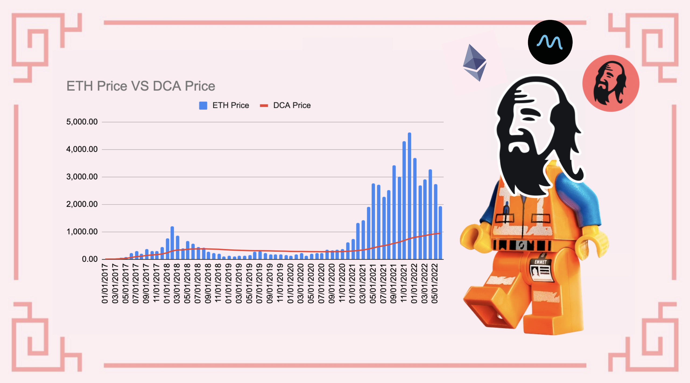
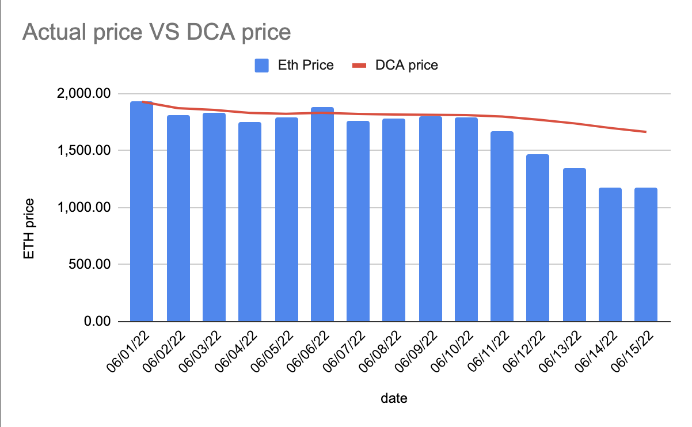
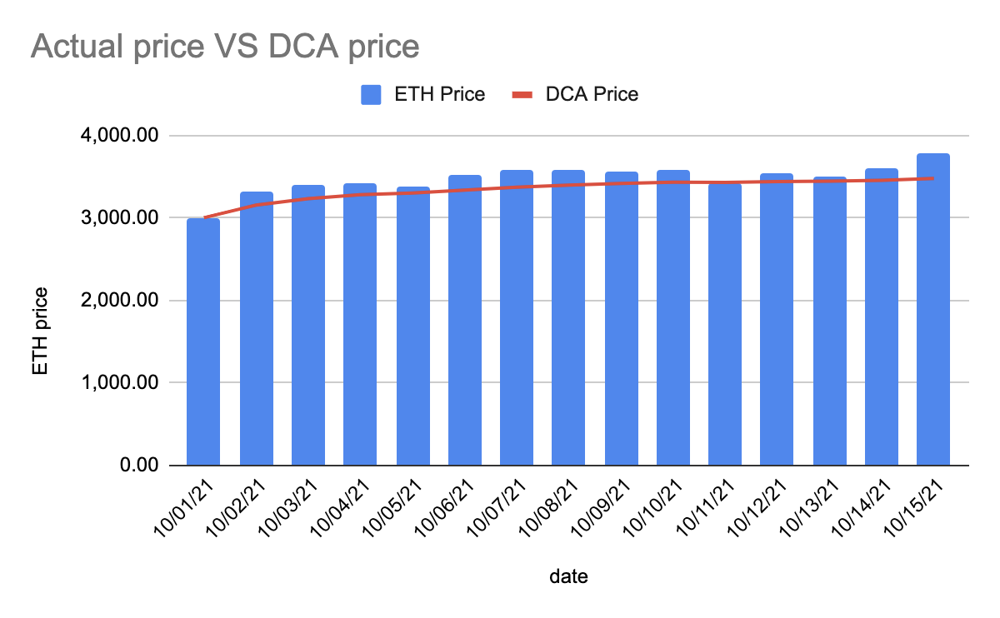
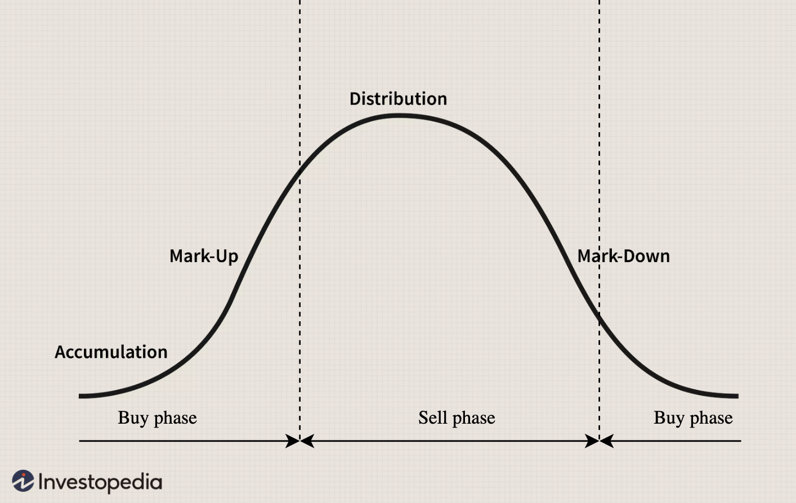
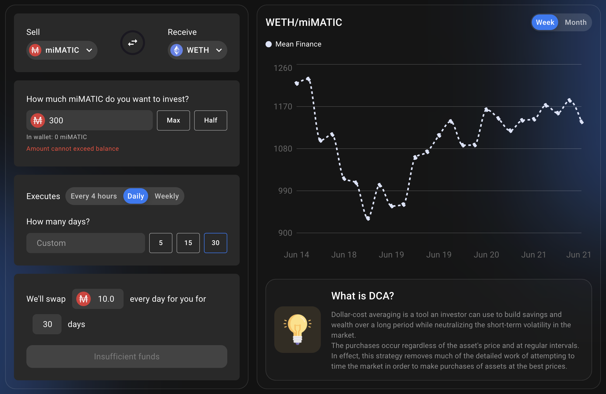
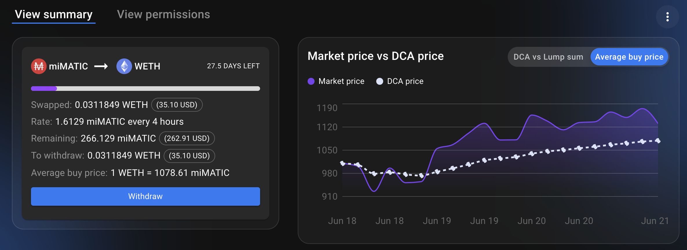
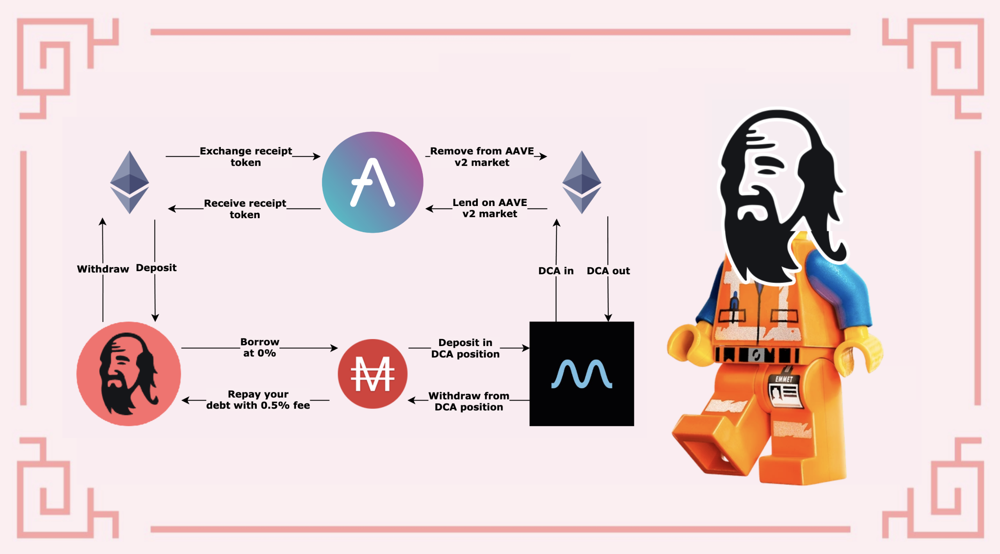

# DCA in bear and bull markets

## Intro

"Time in the market is way better than timing the market" is something you certainly already heard. In facts, nobody can perfectly sell at the top, or buy the bottom. This is why most investors will DCA (**D**ollar **C**ost **A**verage) to accumulate the asset they want the most. DCA consists in buying a little amount with a given frequency, regardless of the price. By doing so, the average buy price is lowered and you have better chances to buy more of a given asset compared to a single purchase done at the wrong time.

You can find more details on what is Dollar-Cost Averaging in the [investopedia website](https://www.investopedia.com/terms/d/dollarcostaveraging.asp), which gives this definition:

```
Dollar-cost averaging (DCA) is an investment strategy in which an investor divides up the total amount to be invested across periodic purchases of a target asset in an effort to reduce the impact of volatility on the overall purchase. The purchases occur regardless of the asset's price and at regular intervals.
```

This article explains how you can properly DCA into your favourite assets to top off your vaults on Mai Finance, but you can also DCA into the MAI stablecoin in order to get a better averaged sell price.




Keep in mind that a strategy that works well at a given time may perform poorly (or make you lose money) at another time. Please stay informed, monitor the markets, keep an eye on your investments, and as always, do your own research.


## Understand Dollar Cost Averaging

Let's see how you can DCA in different market conditions, and what it means in terms of buying/selling power.

### DCA in a downtrend (bearish market)

When the market is already quite down and (hopefully) near the bottom, or at least at a price level you feel comfortable to buy, that's the moment to accumulate your favourite assets and buy tokens. Because you know, you want to buy when the price is low, and sell when it's high. As an example, here's a real example of ETH price for the first 15 days of June 2022

|   Date   | ETH price in USD |
|----------|------------------|
| 06/01/22 |         1,928.60 |
| 06/02/22 |         1,814.00 |
| 06/03/22 |         1,826.39 |
| 06/04/22 |         1,751.69 |
| 06/05/22 |         1,791.55 |
| 06/06/22 |         1,876.70 |
| 06/07/22 |         1,756.89 |
| 06/08/22 |         1,776.58 |
| 06/09/22 |         1,798.50 |
| 06/10/22 |         1,791.43 |
| 06/11/22 |         1,668.25 |
| 06/12/22 |         1,467.21 |
| 06/13/22 |         1,349.25 |
| 06/14/22 |         1,170.75 |
| 06/15/22 |         1,169.67 |

This is a drop in price of 39.35% for the first half of June, that followed a disastroud month of May. Now, assuming you bought a little bit of ETH everyday over the same period of time, this is the average price at which you would have bought ETH:

|   Date   | average DCA price |
|----------|-------------------|
| 06/01/22 |          1,928.60 |
| 06/02/22 |          1,871.30 |
| 06/03/22 |          1,856.33 |
| 06/04/22 |          1,830.17 |
| 06/05/22 |          1,822.45 |
| 06/06/22 |          1,831.49 |
| 06/07/22 |          1,820.83 |
| 06/08/22 |          1,815.30 |
| 06/09/22 |          1,813.43 |
| 06/10/22 |          1,811.23 |
| 06/11/22 |          1,798.23 |
| 06/12/22 |          1,770.65 |
| 06/13/22 |          1,738.23 |
| 06/14/22 |          1,697.70 |
| 06/15/22 |          1,662.50 |

With an average price of $1,662.50 and an ending price of $1,169.67, the drop goes from more than 39% to 29.64%. In that sense, DCA lowers your losses. This also means that, to break even, you need the price to go back to $1,662.50 instead of $1,928.60, and in case the price goes back to $1,928.60, you would be in profit of 16%.



An interesting thing to note is that if you sold your ETH for USDC (or another stable coin like MAI) over the same period, your average selling price would also have been $1,662.50, and you would have sold at a better price everyday except for the 6th of June. This once again proves that DCA is way better than trying to time the market.

### DCA in an uptrend (bullish market)

When the market is going up, you may also want to DCA into specific assets to pull the average purchase price down while the price is going up. Obviously, you want to do that at the beginning of the mark-up period of the main market cycle, which is why it's strongly recommended to DCA even in an uptrend. As an example, here's the ETH price for the first 15 days of October 2021.

|   Date   | ETH price in USD |
|----------|------------------|
| 10/01/21 |         3,001.13 |
| 10/02/21 |         3,308.87 |
| 10/03/21 |         3,390.77 |
| 10/04/21 |         3,418.78 |
| 10/05/21 |         3,381.78 |
| 10/06/21 |         3,516.57 |
| 10/07/21 |         3,576.81 |
| 10/08/21 |         3,587.83 |
| 10/09/21 |         3,560.00 |
| 10/10/21 |         3,575.02 |
| 10/11/21 |         3,419.73 |
| 10/12/21 |         3,546.48 |
| 10/13/21 |         3,492.75 |
| 10/14/21 |         3,604.96 |
| 10/15/21 |         3,790.15 |

This is more or less the opposite of the previous section where the price of ETH jumped by +26.29% in 15 days. So if you were lucky and bought on the 1st of October, that's the profit you would have realized by selling on the 15th. Instead, if you had invested everyday for the period, here is the average price at which you would have bought ETH:

|   Date   | ETH price in USD |
|----------|------------------|
| 10/01/21 |         3,001.13 |
| 10/02/21 |         3,155.00 |
| 10/03/21 |         3,233.59 |
| 10/04/21 |         3,279.89 |
| 10/05/21 |         3,300.27 |
| 10/06/21 |         3,336.32 |
| 10/07/21 |         3,370.67 |
| 10/08/21 |         3,397.82 |
| 10/09/21 |         3,415.84 |
| 10/10/21 |         3,431.76 |
| 10/11/21 |         3,430.66 |
| 10/12/21 |         3,440.31 |
| 10/13/21 |         3,444.35 |
| 10/14/21 |         3,455.82 |
| 10/15/21 |         3,478.11 |

With an average price of $3,478.11 and an ending price of $3,790.15, you would make a gain of 15.89% by selling on the 15th. In this case, the DCA price is always lower than the market price, except on the 11th of October, which means that you would always be able to sell the asset you purchased with a benefit.



In this situation, you can also DCA into stablecoins using your Ether. With an average sell price of $3,478.11, you would make a better profit than spot selling in the first 5 days or on the 11th. This is particularly good if you want to capture benefits, repay a loan, or accumulate stablecoins for the next time the market goes down. You may also want to "save" high prices into stablecoins in order to farm yields in uncertain times where your volatile assets have a risk to go down.

### DCAing during market cycle

Whether you are investing in crypto-currencies or the stock market, you probably noticed that markets are cyclical. Once again, you can read more about market cycles in the [investopedia](https://www.investopedia.com/trading/market-cycles-key-maximum-returns/), but here are the key things you need to know:

* Markets move in four phases; understanding how each phase works and how to benefit is the difference between floundering and flourishing.
* In the accumulation phase, the market has bottomed, and early adopters and contrarians see an opportunity to jump in and scoop up discounts.
* In the mark-up phase, the market seems to have leveled out, and the early majority are jumping back in, while the smart money is cashing out.
* In the distribution phase, sentiment turns mixed to slightly bearish, prices are choppy, sellers prevail, and the end of the rally is near.
* In the mark-down phase, laggards try to sell and salvage what they can, while early adopters look for signs of a bottom so they can get back in.

Inflection points are the moment when you need to switch from a buyer to a seller in your DCA strategy:



## DCA into volatile assets using Mai Finance and Mean Finance

### Mai Finance

[Mai Finance](https://app.mai.finance) is a lending protocol where you will be able to deposit particular assets as collateral and borrow the MAI stablecoin at 0% interest. For this particular guide, let's assume we want to DCA into ETH from an existing portfolia already containing the equivalent of $1,000 worth of ETH. On the decentralized application, you will be able to

* deposit the ETH into a ETH vault
* borrow MAI against your collateral

In order to limit the risks, we will assume that you borrow $300 worth of MAI to keep an healthy CDR (**C**ollateral to **D**ebt **R**atio).

### Mean Finance

[Mean Finance](https://mean.finance/) is an automated application where you will be able to setup a DCA position that will automatically purchase specific assets using other assets, with a given frequency over a given amount of time.



Once created, you will be able to see the performance of your DCA position as well as the history of all the swaps.



As you can see above, the DCA strategy is currently buying ETH every 4 hours and buys 1.61 MAI worth of ETH. A higher frequency will reflect the volatility of the targetted asset more than a less frequent swap.

It's important to note a few things about Mean Finance

* Positions are NFTs, meaning that you are the only one with an access to the position.
* Because it's an NFT, you can possibly transfer the ownership to another address.
* You can withdraw the asset already swapped at any given moment. This is particularly useful if the average price is way lower than the current market price and you want to sell what you already converted.
* You can update the duration and rate of the DCA strategy as you wish. This is once again particularly useful if you can withdraw and sell the swapped asset with a substantial profit and re-invest into your DCA position.
* You can terminate the position at any moment and withdraw both the swapped asset as well as the collateral used to make purchases.

### DCA Strategy

The strategy for this guide is more or less what has been explained in the sections above.



Assuming you want to accumulate Ether, you will have to

* You can zap your ETH into the camWETH vault on Mai Finance in order to collect rewards from AAVE v2 lending market
* Borrow MAI to keep a healthy CDR
* Feed your MAI in Mean Finance for a given period of time
* At the end of the DCA period collect your WETH
* Repeat by topping off your vault

The idea here is that you may be able to borrow more or less MAI every time you renew your DCA position, depending on the market price and the health factor of your vault on Mai Finance. This strategy will allow you to slowly accumulate Ether using a DCA approach instead of leveraging everything at once. Topping off your vault is also a good way to keep a healthy CDR.

If you prefer selling your Ether, you can do the opposite loop and DCA into stable coins to repay your loan on Mai Finance:

* Feed WETH into Mean Finance for a given period of time and DCA out for MAI
* At the end of the DCA period, collect your MAI
* Repay your loan from Mai Finance
* Zap out your camWETH tokens from the vault and collect WETH
* Repeat by selling more WETH via Mean Finance

If you're doing this correctly, you will normally be able to fully repay your loan and end up with more Ether than what you originally deposited.

Alternatively, you can use the MAI loan to farm yields, convert the rewards to a stablecoin that will be used to feed the DCA engine from Mean Finance.

## Disclaimer

Everything presented in this tutorial is educational content made to illustrate how you can use Dollar Cost Average to average the price of volatile asset and hopefully accumulate them in a sustainable manner. The goal here is to build wealth over a long period of time using automated tools rather than buying and selling with your feelings.

This strategy also presents some risks if you don't analyze the entire market. Indeed, if you start buying at the top of the cycle, DCA'ing will obviously not work that well and will take a lot of time before the average purchase price reaches an adequat market price. And your vault may be at risk if you use all your loan to DCA into a volatile asset while the market is at the beginning of a down trend. As always, make sure you understand properly where the market is going before investing.


Keep in mind that a strategy that works well at a given time may perform poorly (or make you lose money) at another time. Please stay informed, monitor the markets, keep an eye on your investments, and as always, do your own research.

